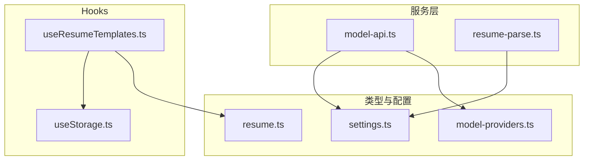
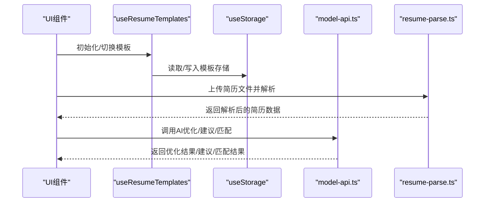
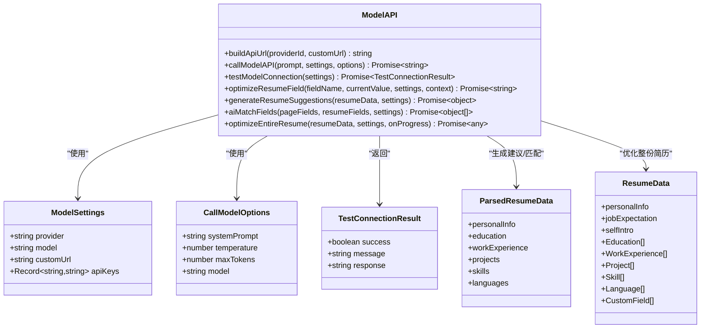
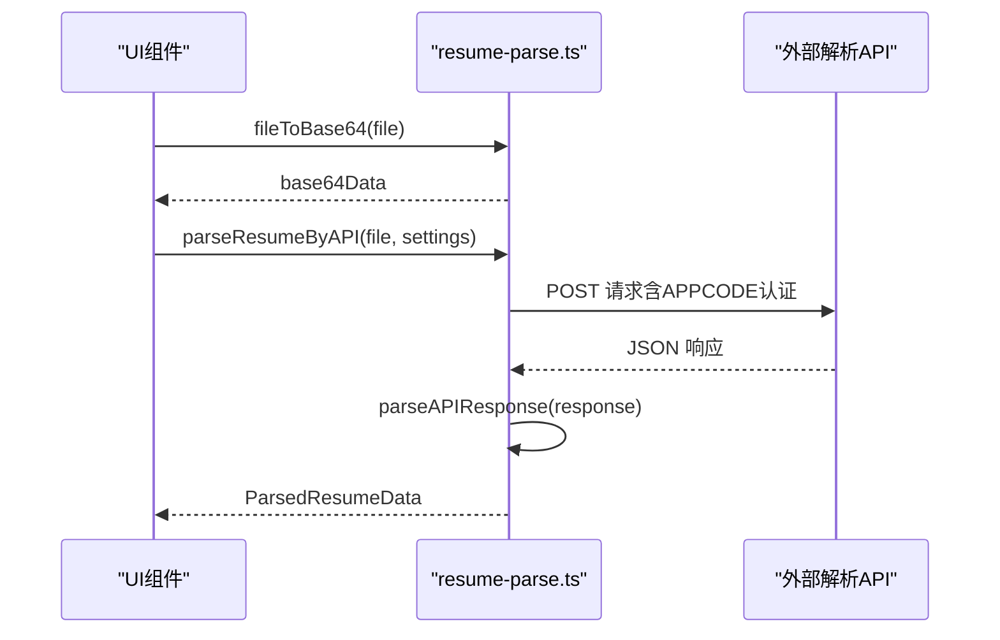
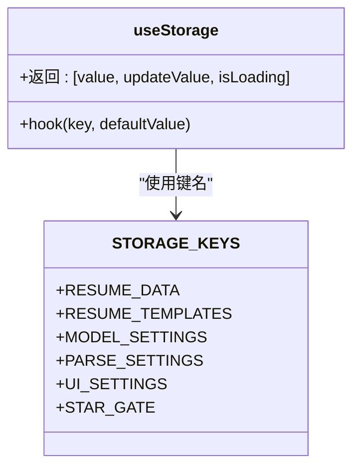
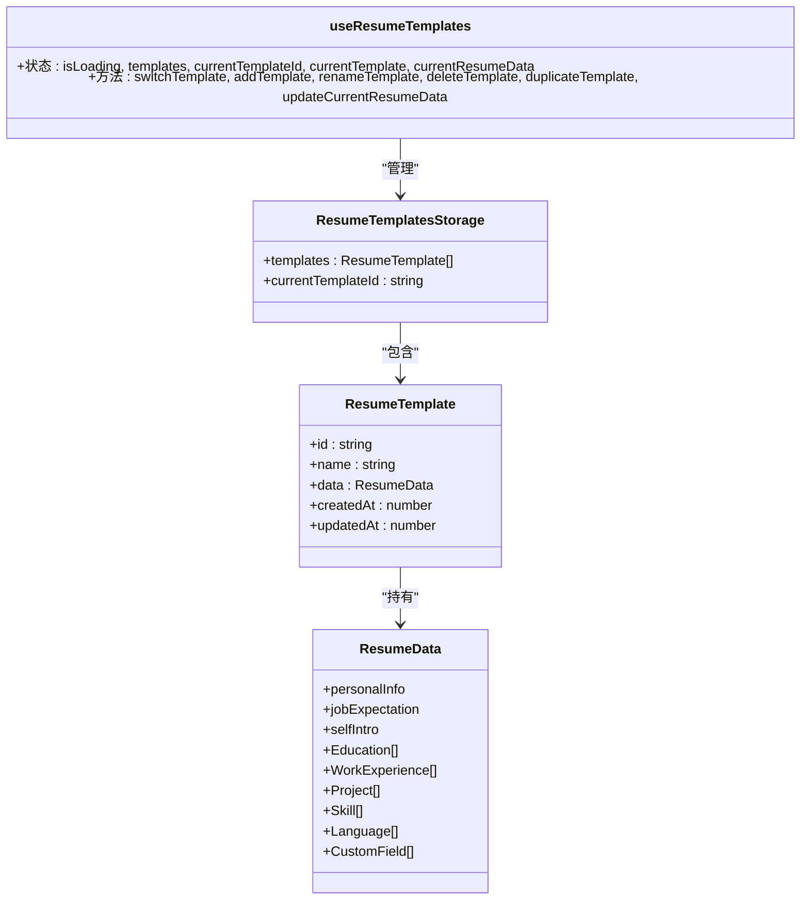
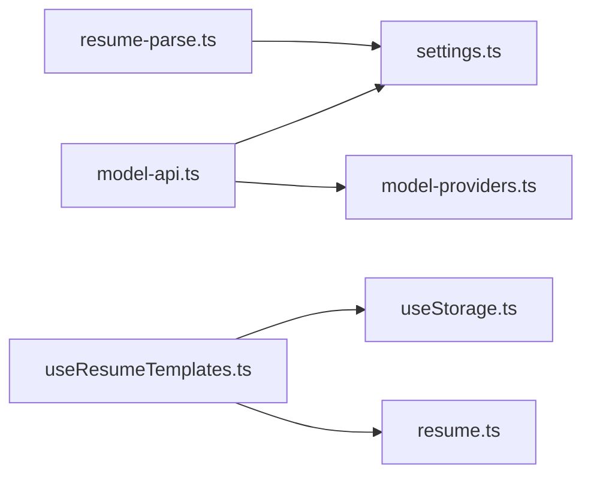

# API参考

<cite>
**本文引用的文件**
- [model-api.ts](file://src/services/model-api.ts)
- [resume-parse.ts](file://src/services/resume-parse.ts)
- [useStorage.ts](file://src/hooks/useStorage.ts)
- [useResumeTemplates.ts](file://src/hooks/useResumeTemplates.ts)
- [settings.ts](file://src/types/settings.ts)
- [resume.ts](file://src/types/resume.ts)
- [model-providers.ts](file://src/config/model-providers.ts)
</cite>

## 目录
1. [简介](#简介)
2. [项目结构](#项目结构)
3. [核心组件](#核心组件)
4. [架构总览](#架构总览)
5. [详细组件分析](#详细组件分析)
6. [依赖关系分析](#依赖关系分析)
7. [性能考量](#性能考量)
8. [故障排查指南](#故障排查指南)
9. [结论](#结论)
10. [附录](#附录)

## 简介
本文件为项目中关键服务与Hook的API级参考文档，覆盖以下内容：
- 模型API服务：列出所有AI调用函数（如callModelAPI、optimizeResumeField、optimizeEntireResume、generateResumeSuggestions、aiMatchFields、testModelConnection）的参数类型、返回Promise结构、错误处理机制。
- 简历解析服务：说明parseResumeByAPI函数的输入文件类型、输出数据结构及异常情况。
- Hook：useStorage与useResumeTemplates的暴露方法（如saveData、loadData、createTemplate、switchTemplate）及其调用方式与副作用。

本参考面向开发者，便于直接查阅与集成使用。

## 项目结构
围绕本次文档涉及的核心文件，项目采用按功能分层的组织方式：
- services：封装外部API调用与业务逻辑（模型API、简历解析）
- hooks：封装React状态与跨组件共享逻辑（存储、模板管理）
- types：统一类型定义（设置、简历数据、模型提供商）
- config：模型提供商配置

图表来源
- [model-api.ts](file://src/services/model-api.ts#L1-L120)
- [resume-parse.ts](file://src/services/resume-parse.ts#L1-L120)
- [useStorage.ts](file://src/hooks/useStorage.ts#L1-L88)
- [useResumeTemplates.ts](file://src/hooks/useResumeTemplates.ts#L1-L120)
- [settings.ts](file://src/types/settings.ts#L1-L120)
- [resume.ts](file://src/types/resume.ts#L86-L140)
- [model-providers.ts](file://src/config/model-providers.ts#L1-L96)

章节来源
- [model-api.ts](file://src/services/model-api.ts#L1-L120)
- [resume-parse.ts](file://src/services/resume-parse.ts#L1-L120)
- [useStorage.ts](file://src/hooks/useStorage.ts#L1-L88)
- [useResumeTemplates.ts](file://src/hooks/useResumeTemplates.ts#L1-L120)
- [settings.ts](file://src/types/settings.ts#L1-L120)
- [resume.ts](file://src/types/resume.ts#L86-L140)
- [model-providers.ts](file://src/config/model-providers.ts#L1-L96)

## 核心组件
本节概述各组件职责与对外接口要点：
- 模型API服务：封装模型提供商适配、URL构建、请求发送、响应解析与错误处理，并提供多类AI优化与建议能力。
- 简历解析服务：封装简历上传与解析流程，支持Base64编码、阿里云OCR风格API调用与多源字段映射。
- useStorage Hook：提供Chrome扩展/本地环境下的统一存储读写与变更监听，支持默认值与异步加载。
- useResumeTemplates Hook：提供简历模板的CRUD与切换、迁移旧数据、复制模板、更新当前模板数据等能力。

章节来源
- [model-api.ts](file://src/services/model-api.ts#L1-L120)
- [resume-parse.ts](file://src/services/resume-parse.ts#L1-L120)
- [useStorage.ts](file://src/hooks/useStorage.ts#L1-L88)
- [useResumeTemplates.ts](file://src/hooks/useResumeTemplates.ts#L1-L120)

## 架构总览
整体调用链路如下：
- UI层通过Hook管理状态与模板；
- 服务层负责与外部API交互；
- 类型与配置层提供统一的数据契约与提供商信息。

图表来源
- [useResumeTemplates.ts](file://src/hooks/useResumeTemplates.ts#L1-L120)
- [useStorage.ts](file://src/hooks/useStorage.ts#L1-L88)
- [model-api.ts](file://src/services/model-api.ts#L1-L120)
- [resume-parse.ts](file://src/services/resume-parse.ts#L1-L120)

## 详细组件分析

### 模型API服务（model-api.ts）

- 功能概览
  - 构建API请求URL（支持自定义与内置提供商）
  - 统一调用大模型API，处理鉴权、请求体构造、响应解析与错误映射
  - 提供测试连接能力
  - 提供简历字段优化、整份简历一键优化、简历建议生成、字段匹配等AI能力

- 关键函数与签名

  1) 构建API请求URL
  - 函数：buildApiUrl
  - 参数：providerId（字符串），customUrl（可选字符串）
  - 返回：字符串（API端点URL）
  - 特性：当providerId为custom时，自动补全为/chat/completions结尾；否则根据MODEL_PROVIDERS配置拼接

  2) 调用大模型API
  - 函数：callModelAPI
  - 参数：
    - prompt（字符串）
    - settings（ModelSettings）
    - options（CallModelOptions，可选）
  - 返回：Promise<string>（模型返回的文本）
  - 错误处理：对401、429、400等状态码进行明确提示；对响应格式不兼容抛出“无法解析模型响应”错误

  3) 测试模型连接
  - 函数：testModelConnection
  - 参数：settings（ModelSettings）
  - 返回：Promise<TestConnectionResult>
  - 行为：内部调用callModelAPI进行连通性测试，返回success、message与可选response

  4) 优化简历字段
  - 函数：optimizeResumeField
  - 参数：
    - fieldName（字符串，如self-intro、project-desc、responsibilities、description）
    - currentValue（字符串，当前字段内容）
    - settings（ModelSettings）
    - context（对象，可选，包含position、industry、projectName、company等）
  - 返回：Promise<string>
  - 行为：根据字段类型构造特定prompt并调用callModelAPI

  5) 生成简历建议
  - 函数：generateResumeSuggestions
  - 参数：resumeData（任意对象，包含个人信息与经历数组等），settings（ModelSettings）
  - 返回：Promise<{ completeness: number; suggestions: string[]; tips: string[] }>
  - 行为：构造建议prompt，尝试解析JSON响应，若失败回退为原始响应

  6) AI辅助字段匹配
  - 函数：aiMatchFields
  - 参数：
    - pageFields（数组，包含label、placeholder、name、id、type等）
    - resumeFields（数组，包含key、keywords、value等）
    - settings（ModelSettings）
  - 返回：Promise<Array<{pageIndex: number; resumeIndex: number; confidence: number}>>>
  - 行为：将页面字段与简历字段进行匹配，返回置信度>=0.5的匹配结果

  7) 一键优化整份简历
  - 函数：optimizeEntireResume
  - 参数：
    - resumeData（任意对象）
    - settings（ModelSettings）
    - onProgress（回调，接收进度对象）
  - 返回：Promise<any>（返回优化后的简历数据）
  - 行为：遍历自我介绍、工作经历描述、项目描述与职责描述，逐项调用对应优化函数，并通过onProgress反馈进度；对API限流进行延时控制

- 错误处理机制
  - API请求失败：根据HTTP状态码映射为明确错误消息（如认证失败、请求过于频繁、参数错误等）
  - 响应解析失败：当choices/output/result均不可用时，抛出“无法解析模型响应”
  - 连接测试：返回success与message，必要时包含response
  - 一键优化：对单项任务失败记录error并继续后续任务

- 使用示例（路径指引）
  - 调用模型API：参见 [调用模型API](file://src/services/model-api.ts#L38-L139)
  - 测试连接：参见 [测试模型连接](file://src/services/model-api.ts#L144-L174)
  - 优化字段：参见 [优化简历字段](file://src/services/model-api.ts#L179-L232)
  - 生成建议：参见 [生成简历建议](file://src/services/model-api.ts#L237-L287)
  - 字段匹配：参见 [AI辅助字段匹配](file://src/services/model-api.ts#L293-L366)
  - 一键优化：参见 [一键优化整份简历](file://src/services/model-api.ts#L492-L676)

- 依赖与配置
  - 模型提供商配置：参见 [模型提供商配置](file://src/config/model-providers.ts#L1-L96)
  - 类型定义：参见 [设置类型定义](file://src/types/settings.ts#L21-L121)

章节来源
- [model-api.ts](file://src/services/model-api.ts#L1-L120)
- [model-api.ts](file://src/services/model-api.ts#L141-L174)
- [model-api.ts](file://src/services/model-api.ts#L176-L232)
- [model-api.ts](file://src/services/model-api.ts#L234-L287)
- [model-api.ts](file://src/services/model-api.ts#L289-L366)
- [model-api.ts](file://src/services/model-api.ts#L490-L676)
- [model-providers.ts](file://src/config/model-providers.ts#L1-L96)
- [settings.ts](file://src/types/settings.ts#L21-L121)

#### 类图（函数与类型关系）

图表来源
- [model-api.ts](file://src/services/model-api.ts#L1-L120)
- [model-api.ts](file://src/services/model-api.ts#L141-L174)
- [model-api.ts](file://src/services/model-api.ts#L176-L232)
- [model-api.ts](file://src/services/model-api.ts#L234-L287)
- [model-api.ts](file://src/services/model-api.ts#L289-L366)
- [model-api.ts](file://src/services/model-api.ts#L490-L676)
- [settings.ts](file://src/types/settings.ts#L21-L121)
- [resume.ts](file://src/types/resume.ts#L86-L140)

### 简历解析服务（resume-parse.ts）

- 功能概览
  - 将File对象转换为Base64编码
  - 调用简历解析API（基于阿里云风格），校验配置与响应
  - 将API返回的原始数据映射为统一的简历数据结构

- 关键函数与签名

  1) 文件转Base64
  - 函数：fileToBase64
  - 参数：file（File）
  - 返回：Promise<string>（Base64字符串）

  2) 调用简历解析API
  - 函数：parseResumeByAPI
  - 参数：file（File），settings（ParseSettings）
  - 返回：Promise<ParsedResumeData>
  - 异常：当配置不完整或HTTP状态非2xx时抛出错误；401时提示认证失败

  3) 解析API响应
  - 函数：parseAPIResponse
  - 参数：apiResponse（任意对象）
  - 返回：ParsedResumeData（统一结构）

- 输出数据结构（ParsedResumeData）
  - personalInfo：包含name、gender、phone、email、political-status、expected-position、expected-salary、self-intro等字段
  - education：教育经历数组，每项为键值对映射
  - workExperience：工作/实习经历数组，每项为键值对映射
  - projects：项目经历数组，每项为键值对映射
  - skills：技能数组，每项为键值对映射
  - languages：语言能力数组，每项为键值对映射

- 输入文件类型
  - File对象（支持常见简历格式，如PDF、图片等，具体取决于上游OCR服务）

- 使用示例（路径指引）
  - 文件转Base64：参见 [文件转Base64](file://src/services/resume-parse.ts#L19-L33)
  - 调用解析API：参见 [调用简历解析API](file://src/services/resume-parse.ts#L38-L109)
  - 解析响应：参见 [解析API响应](file://src/services/resume-parse.ts#L137-L295)

- 依赖与配置
  - 类型定义：参见 [设置类型定义](file://src/types/settings.ts#L33-L83)
  - 原始数据结构：参见 [简历解析原始数据类型](file://src/types/settings.ts#L124-L190)

章节来源
- [resume-parse.ts](file://src/services/resume-parse.ts#L1-L120)
- [resume-parse.ts](file://src/services/resume-parse.ts#L137-L295)
- [settings.ts](file://src/types/settings.ts#L33-L83)
- [settings.ts](file://src/types/settings.ts#L124-L190)

#### 序列图（简历解析流程）

图表来源
- [resume-parse.ts](file://src/services/resume-parse.ts#L19-L33)
- [resume-parse.ts](file://src/services/resume-parse.ts#L38-L109)
- [resume-parse.ts](file://src/services/resume-parse.ts#L137-L295)

### Hook：useStorage

- 功能概览
  - 在Chrome扩展环境中使用chrome.storage.local进行持久化存储；在非Chrome环境下降级到localStorage
  - 提供加载状态、值变更监听与异步更新能力
  - 暴露统一的存储键名常量

- 暴露方法与行为
  - 返回值：[value, updateValue, isLoading]（元组）
    - value：当前存储值（类型T）
    - updateValue：更新值（支持传入新值或函数式更新）
    - isLoading：是否仍在加载中
  - 加载：首次初始化时从存储读取，若不存在则使用默认值
  - 监听：监听chrome.storage.onChanged事件，实现多实例间同步
  - 更新：异步写入存储，失败时记录错误

- 常用场景
  - 读取/写入模型设置、解析设置、UI设置、简历数据与模板
  - 在组件中以useState方式使用，自动响应存储变化

- 使用示例（路径指引）
  - Hook实现：参见 [useStorage实现](file://src/hooks/useStorage.ts#L1-L88)
  - 存储键名常量：参见 [STORAGE_KEYS](file://src/hooks/useStorage.ts#L93-L102)

章节来源
- [useStorage.ts](file://src/hooks/useStorage.ts#L1-L88)
- [useStorage.ts](file://src/hooks/useStorage.ts#L93-L102)

#### 类图（Hook与存储）

图表来源
- [useStorage.ts](file://src/hooks/useStorage.ts#L1-L88)
- [useStorage.ts](file://src/hooks/useStorage.ts#L93-L102)

### Hook：useResumeTemplates

- 功能概览
  - 管理简历模板集合与当前模板，提供CRUD操作与数据迁移逻辑
  - 支持从旧版简历数据迁移至新模板系统
  - 提供切换模板、新增模板、重命名、删除、复制、更新当前模板数据等方法

- 暴露方法与行为
  - 状态：
    - isLoading：模板与旧数据加载状态
    - templates：模板数组
    - currentTemplateId：当前模板ID
    - currentTemplate：当前模板对象
    - currentResumeData：当前模板对应的简历数据
  - 方法：
    - switchTemplate(templateId)：切换当前模板
    - addTemplate(name, copyFromCurrent=false)：新增模板，返回新模板ID
    - renameTemplate(templateId, newName)：重命名模板
    - deleteTemplate(templateId)：删除模板（至少保留一个）
    - duplicateTemplate(templateId)：复制模板，返回新模板ID
    - updateCurrentResumeData(newData)：更新当前模板数据（支持函数式更新）

- 数据迁移
  - 若模板列表为空且存在旧数据，则将旧数据迁移到新模板系统；否则创建默认模板
  - 若仅有模板但无当前模板ID，则选中第一个模板

- 使用示例（路径指引）
  - Hook实现：参见 [useResumeTemplates实现](file://src/hooks/useResumeTemplates.ts#L1-L234)
  - 迁移逻辑：参见 [迁移检查与执行](file://src/hooks/useResumeTemplates.ts#L35-L80)
  - CRUD与更新：参见 [模板操作与更新](file://src/hooks/useResumeTemplates.ts#L95-L217)

- 依赖与类型
  - 类型定义：参见 [简历类型定义](file://src/types/resume.ts#L86-L211)
  - 存储Hook：参见 [useStorage](file://src/hooks/useStorage.ts#L1-L88)

章节来源
- [useResumeTemplates.ts](file://src/hooks/useResumeTemplates.ts#L1-L120)
- [useResumeTemplates.ts](file://src/hooks/useResumeTemplates.ts#L120-L234)
- [resume.ts](file://src/types/resume.ts#L86-L211)
- [useStorage.ts](file://src/hooks/useStorage.ts#L1-L88)

#### 类图（模板管理）

图表来源
- [useResumeTemplates.ts](file://src/hooks/useResumeTemplates.ts#L1-L234)
- [resume.ts](file://src/types/resume.ts#L86-L211)

## 依赖关系分析
- 模型API服务依赖：
  - settings.ts：ModelSettings、CallModelOptions、TestConnectionResult
  - model-providers.ts：MODEL_PROVIDERS、getProvider、getModelsByProvider
- 简历解析服务依赖：
  - settings.ts：ParseSettings、ResumeParseRawData
- useResumeTemplates依赖：
  - useStorage.ts：统一存储
  - resume.ts：ResumeData、ResumeTemplate、默认模板与ID生成

图表来源
- [model-api.ts](file://src/services/model-api.ts#L1-L120)
- [resume-parse.ts](file://src/services/resume-parse.ts#L1-L120)
- [useResumeTemplates.ts](file://src/hooks/useResumeTemplates.ts#L1-L120)
- [settings.ts](file://src/types/settings.ts#L1-L120)
- [resume.ts](file://src/types/resume.ts#L86-L140)
- [model-providers.ts](file://src/config/model-providers.ts#L1-L96)
- [useStorage.ts](file://src/hooks/useStorage.ts#L1-L88)

章节来源
- [model-api.ts](file://src/services/model-api.ts#L1-L120)
- [resume-parse.ts](file://src/services/resume-parse.ts#L1-L120)
- [useResumeTemplates.ts](file://src/hooks/useResumeTemplates.ts#L1-L120)
- [settings.ts](file://src/types/settings.ts#L1-L120)
- [resume.ts](file://src/types/resume.ts#L86-L140)
- [model-providers.ts](file://src/config/model-providers.ts#L1-L96)
- [useStorage.ts](file://src/hooks/useStorage.ts#L1-L88)

## 性能考量
- API限流与节流
  - 一键优化整份简历时，对连续请求增加短暂延迟，避免触发服务商限流
- 响应解析与兼容
  - 对不同提供商的响应格式进行兼容处理，降低解析失败概率
- 存储读写
  - useStorage在更新时采用异步写入，避免阻塞UI线程；同时提供变更监听，减少不必要的重复渲染

[本节为通用指导，无需列出章节来源]

## 故障排查指南
- 模型API调用失败
  - 检查API Key是否配置（每个提供商独立存储），以及provider与model是否正确
  - 关注HTTP状态码：401（认证失败）、429（请求过于频繁）、400（参数错误）
  - 使用testModelConnection进行连通性测试
  - 参考：[调用模型API](file://src/services/model-api.ts#L38-L139)、[测试连接](file://src/services/model-api.ts#L144-L174)

- 简历解析失败
  - 确认ParseSettings的url与appCode已配置
  - 401通常表示认证失败或服务未激活
  - 参考：[调用简历解析API](file://src/services/resume-parse.ts#L38-L109)

- 模板管理异常
  - 删除模板时至少保留一个模板
  - 迁移完成后仍可能处于加载状态，等待migrationChecked为true
  - 参考：[模板删除与迁移](file://src/hooks/useResumeTemplates.ts#L146-L168)

章节来源
- [model-api.ts](file://src/services/model-api.ts#L38-L139)
- [model-api.ts](file://src/services/model-api.ts#L144-L174)
- [resume-parse.ts](file://src/services/resume-parse.ts#L38-L109)
- [useResumeTemplates.ts](file://src/hooks/useResumeTemplates.ts#L146-L168)

## 结论
本文档梳理了模型API服务、简历解析服务与两个关键Hook的API与使用方式，明确了参数类型、返回结构、错误处理与依赖关系。建议在实际集成时：
- 严格遵循类型定义与配置项
- 在调用AI相关接口前完成连通性测试
- 合理处理存储与模板迁移逻辑
- 对批量优化任务做好限流与进度反馈

[本节为总结，无需列出章节来源]

## 附录

### API清单与要点

- 模型API服务
  - buildApiUrl：构建API端点URL
  - callModelAPI：统一调用模型API，返回字符串
  - testModelConnection：测试连接，返回TestConnectionResult
  - optimizeResumeField：按字段类型优化内容
  - generateResumeSuggestions：生成建议与小贴士
  - aiMatchFields：页面字段与简历字段匹配
  - optimizeEntireResume：一键优化整份简历，支持进度回调

- 简历解析服务
  - fileToBase64：File转Base64
  - parseResumeByAPI：调用解析API并返回ParsedResumeData
  - parseAPIResponse：将原始响应映射为统一结构

- Hook
  - useStorage：提供统一存储读写与监听
  - useResumeTemplates：模板CRUD与迁移、切换、更新当前模板数据

章节来源
- [model-api.ts](file://src/services/model-api.ts#L1-L120)
- [model-api.ts](file://src/services/model-api.ts#L141-L174)
- [model-api.ts](file://src/services/model-api.ts#L176-L232)
- [model-api.ts](file://src/services/model-api.ts#L234-L287)
- [model-api.ts](file://src/services/model-api.ts#L289-L366)
- [model-api.ts](file://src/services/model-api.ts#L490-L676)
- [resume-parse.ts](file://src/services/resume-parse.ts#L19-L33)
- [resume-parse.ts](file://src/services/resume-parse.ts#L38-L109)
- [resume-parse.ts](file://src/services/resume-parse.ts#L137-L295)
- [useStorage.ts](file://src/hooks/useStorage.ts#L1-L88)
- [useResumeTemplates.ts](file://src/hooks/useResumeTemplates.ts#L1-L234)