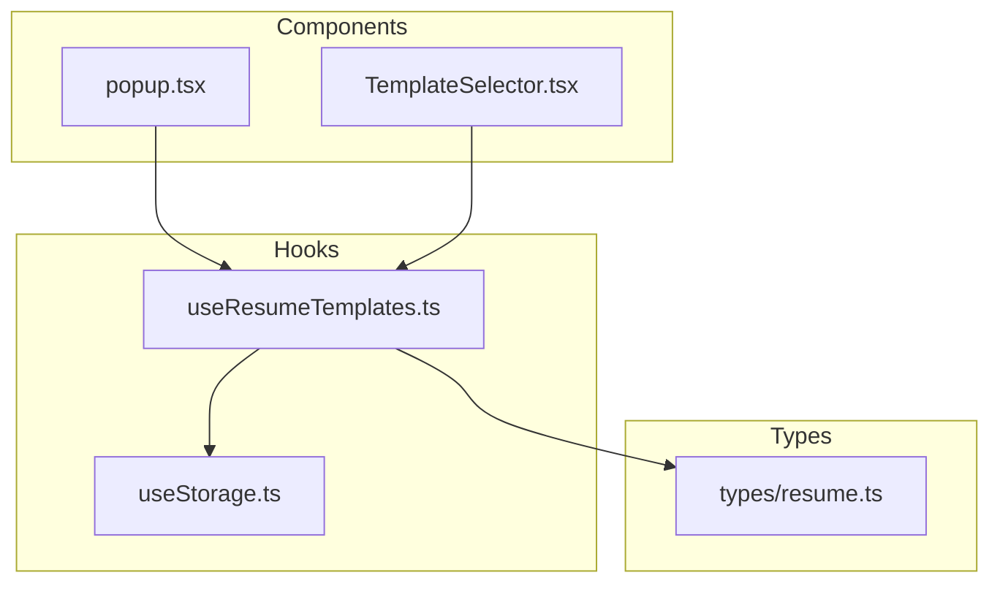
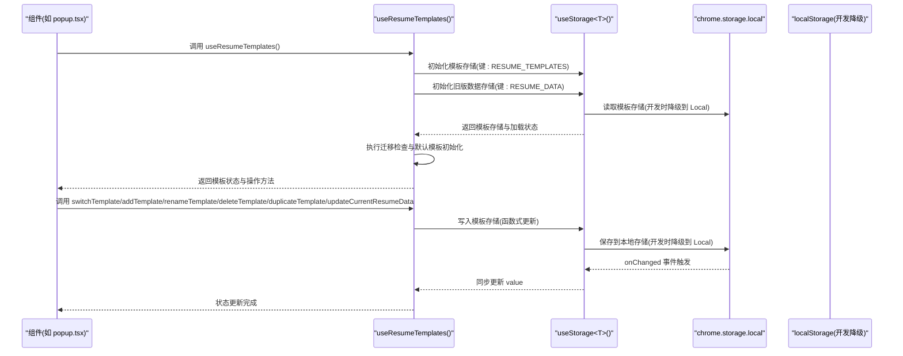
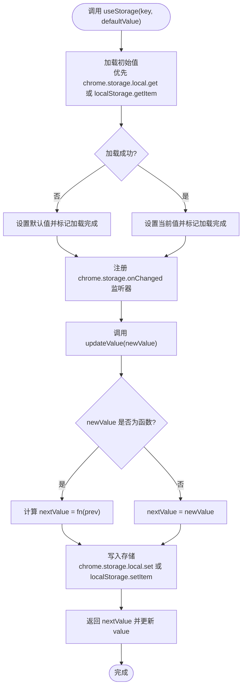
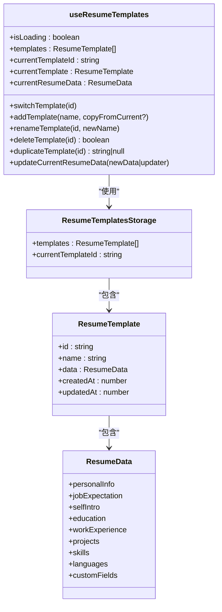
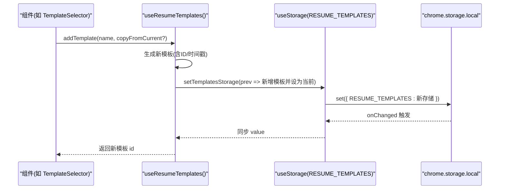
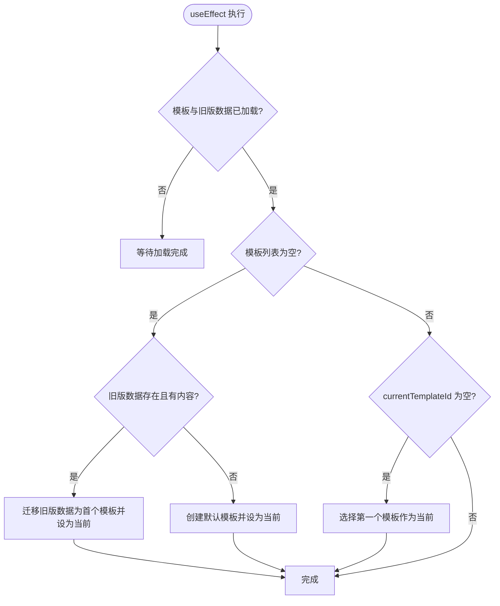
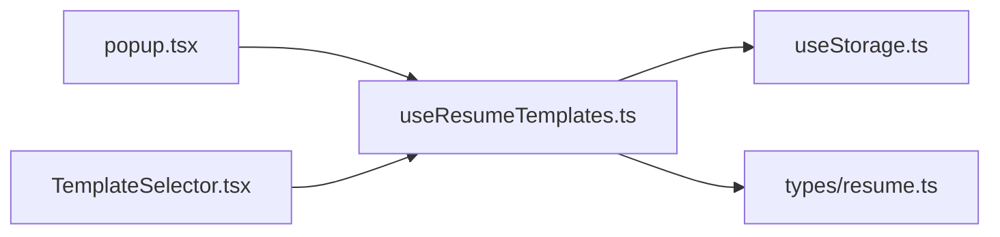

# Hook API

<cite>
**本文引用的文件**
- [src/hooks/useStorage.ts](file://src/hooks/useStorage.ts)
- [src/hooks/useResumeTemplates.ts](file://src/hooks/useResumeTemplates.ts)
- [src/types/resume.ts](file://src/types/resume.ts)
- [src/popup.tsx](file://src/popup.tsx)
- [src/components/common/TemplateSelector.tsx](file://src/components/common/TemplateSelector.tsx)
</cite>

## 目录
1. [简介](#简介)
2. [项目结构](#项目结构)
3. [核心组件](#核心组件)
4. [架构总览](#架构总览)
5. [详细组件分析](#详细组件分析)
6. [依赖关系分析](#依赖关系分析)
7. [性能考量](#性能考量)
8. [故障排查指南](#故障排查指南)
9. [结论](#结论)
10. [附录](#附录)

## 简介
本文件面向开发者，提供项目中两个关键自定义 React Hook 的 API 级文档：
- useStorage<T>(key: string, defaultValue: T)：提供跨浏览器扩展与开发环境的统一存储读写与变更监听能力，并支持函数式更新。
- useResumeTemplates()：围绕“模板化简历”进行完整的 CRUD 操作、当前模板数据访问、以及旧版数据迁移逻辑。

文档聚焦于接口签名、返回值语义、行为边界、错误处理与性能特征，帮助你快速上手并在实际业务中正确使用。

## 项目结构
- hooks 目录包含两个核心 Hook：useStorage 与 useResumeTemplates。
- 类型定义集中在 types/resume.ts，涵盖 ResumeData、ResumeTemplate、ResumeTemplatesStorage 等模型与默认值。
- 组件层通过 useResumeTemplates 获取模板状态与操作方法，并在弹窗与浮动面板中使用。

图表来源
- [src/hooks/useStorage.ts](file://src/hooks/useStorage.ts#L1-L101)
- [src/hooks/useResumeTemplates.ts](file://src/hooks/useResumeTemplates.ts#L1-L234)
- [src/types/resume.ts](file://src/types/resume.ts#L1-L212)
- [src/popup.tsx](file://src/popup.tsx#L130-L241)
- [src/components/common/TemplateSelector.tsx](file://src/components/common/TemplateSelector.tsx#L1-L239)

章节来源
- [src/hooks/useStorage.ts](file://src/hooks/useStorage.ts#L1-L101)
- [src/hooks/useResumeTemplates.ts](file://src/hooks/useResumeTemplates.ts#L1-L234)
- [src/types/resume.ts](file://src/types/resume.ts#L1-L212)
- [src/popup.tsx](file://src/popup.tsx#L130-L241)
- [src/components/common/TemplateSelector.tsx](file://src/components/common/TemplateSelector.tsx#L1-L239)

## 核心组件
- useStorage<T>(key: string, defaultValue: T)
  - 功能：在 Chrome 扩展环境中持久化存储数据，开发时降级到 localStorage；提供加载状态与变更监听；支持函数式更新。
  - 返回值：[value, updateValue, isLoading] 元组，其中 value 为当前值，updateValue 支持传入新值或函数式更新，isLoading 表示初始加载状态。
  - 降级策略：当 chrome.storage 不可用时，自动切换到 localStorage。
  - 变更监听：监听 chrome.storage.local 的变更事件，同步更新其他实例的状态。
- useResumeTemplates()
  - 功能：管理简历模板集合与当前模板，提供切换、新增、重命名、删除、复制、更新当前模板数据等操作，并内置旧版数据迁移逻辑。
  - 返回值：包含 isLoading、templates、currentTemplateId、currentTemplate、currentResumeData 以及若干操作方法的对象。
  - 边界条件：不允许删除最后一个模板；当模板列表为空且存在旧版数据时执行迁移；若仅有模板但未选中任何模板则自动选中第一个。

章节来源
- [src/hooks/useStorage.ts](file://src/hooks/useStorage.ts#L1-L101)
- [src/hooks/useResumeTemplates.ts](file://src/hooks/useResumeTemplates.ts#L1-L234)
- [src/types/resume.ts](file://src/types/resume.ts#L164-L212)

## 架构总览
下图展示 useStorage 与 useResumeTemplates 的协作关系，以及模板系统在组件中的使用方式。

图表来源
- [src/hooks/useResumeTemplates.ts](file://src/hooks/useResumeTemplates.ts#L1-L234)
- [src/hooks/useStorage.ts](file://src/hooks/useStorage.ts#L1-L101)
- [src/popup.tsx](file://src/popup.tsx#L130-L241)

## 详细组件分析

### useStorage<T>(key: string, defaultValue: T)
- 泛型接口
  - 参数
    - key: string，存储键名
    - defaultValue: T，初始默认值
  - 返回值
    - value: T，当前存储值
    - updateValue(newValue: T | ((prev: T) => T)): void，更新存储值；支持函数式更新
    - isLoading: boolean，表示初始加载是否完成
- 行为与细节
  - 初始加载：优先使用 chrome.storage.local.get 读取；若运行环境不支持 chrome.storage，则降级到 localStorage.getItem。
  - 变更监听：注册 chrome.storage.onChanged 监听器，当指定 key 发生变更时，同步更新当前实例的 value。
  - 函数式更新：updateValue 接受函数式更新器，内部计算 nextValue 后异步写入存储；开发时同样降级到 localStorage.setItem。
  - 错误处理：读取与写入均包含 try/catch 并打印错误日志，避免中断流程。
- 使用建议
  - 将复杂对象序列化后存入存储，读取时再反序列化；注意存储大小限制与性能影响。
  - 在组件卸载时，确保不会继续依赖已失效的回调或状态引用。

图表来源
- [src/hooks/useStorage.ts](file://src/hooks/useStorage.ts#L1-L101)

章节来源
- [src/hooks/useStorage.ts](file://src/hooks/useStorage.ts#L1-L101)

### useResumeTemplates()
- 方法与返回值概览
  - 返回对象包含：
    - 状态：isLoading、templates、currentTemplateId、currentTemplate、currentResumeData
    - 操作：switchTemplate(templateId)、addTemplate(name, copyFromCurrent?)、renameTemplate(templateId, newName)、deleteTemplate(templateId)、duplicateTemplate(templateId)、updateCurrentResumeData(newData | updater)
- 数据模型
  - ResumeData：完整简历数据结构与默认值
  - ResumeTemplate：模板项，包含 id、name、data、createdAt、updatedAt
  - ResumeTemplatesStorage：模板集合与当前模板 id
  - 默认模板与默认模板集合的生成与 ID 生成逻辑

图表来源
- [src/types/resume.ts](file://src/types/resume.ts#L86-L212)
- [src/hooks/useResumeTemplates.ts](file://src/hooks/useResumeTemplates.ts#L1-L234)

章节来源
- [src/hooks/useResumeTemplates.ts](file://src/hooks/useResumeTemplates.ts#L1-L234)
- [src/types/resume.ts](file://src/types/resume.ts#L86-L212)

#### 方法详解与边界条件
- switchTemplate(templateId: string)
  - 作用：切换当前模板
  - 边界：仅当模板列表中存在该 id 时才切换
- addTemplate(name: string, copyFromCurrent?: boolean)
  - 作用：新增模板
  - 行为：根据 copyFromCurrent 决定是否复制当前模板的数据；设置 createdAt/updatedAt；自动选中新模板
  - 返回：新模板 id
- renameTemplate(templateId: string, newName: string)
  - 作用：重命名模板
  - 行为：更新模板名称与 updatedAt
- deleteTemplate(templateId: string)
  - 作用：删除模板
  - 边界：不允许删除最后一个模板；若删除的是当前模板，会自动选择列表中的第一个模板作为新当前模板
  - 返回：删除成功返回 true，否则返回 false
- duplicateTemplate(templateId: string)
  - 作用：复制模板
  - 行为：生成新模板 id，名称追加“(副本)”，复制数据，自动选中新模板
  - 返回：新模板 id 或 null（当找不到模板时）
- updateCurrentResumeData(newData: ResumeData | ((prev: ResumeData) => ResumeData))
  - 作用：更新当前模板的简历数据
  - 行为：支持函数式更新；更新完成后设置 updatedAt
  - 边界：若当前模板 id 不存在则忽略更新

图表来源
- [src/components/common/TemplateSelector.tsx](file://src/components/common/TemplateSelector.tsx#L40-L120)
- [src/hooks/useResumeTemplates.ts](file://src/hooks/useResumeTemplates.ts#L108-L128)
- [src/hooks/useStorage.ts](file://src/hooks/useStorage.ts#L61-L88)

章节来源
- [src/hooks/useResumeTemplates.ts](file://src/hooks/useResumeTemplates.ts#L94-L216)
- [src/components/common/TemplateSelector.tsx](file://src/components/common/TemplateSelector.tsx#L40-L120)

#### 数据迁移逻辑
- 触发时机：在模板存储与旧版简历数据均加载完成后，且迁移检查尚未完成时执行
- 迁移规则：
  - 若模板列表为空且旧版数据存在且包含有效内容，则将旧版数据迁移为首个模板，并设置为当前模板
  - 若模板列表为空且旧版数据不存在或无内容，则创建默认模板并设为当前
  - 若已有模板但 currentTemplateId 为空，则自动选择第一个模板作为当前模板
- 迁移检查完成后，设置 migrationChecked 标记，避免重复执行

图表来源
- [src/hooks/useResumeTemplates.ts](file://src/hooks/useResumeTemplates.ts#L35-L80)

章节来源
- [src/hooks/useResumeTemplates.ts](file://src/hooks/useResumeTemplates.ts#L35-L80)

#### 在组件中的使用示例
- 弹窗页面 popup.tsx
  - 使用 useResumeTemplates 获取模板状态与操作方法，并将 updateCurrentResumeData 应用于表单数据填充
- 模板选择器 TemplateSelector.tsx
  - 通过 onSwitch/onAdd/onRename/onDelete/onDuplicate 回调与 useResumeTemplates 对接，实现模板管理 UI

章节来源
- [src/popup.tsx](file://src/popup.tsx#L130-L241)
- [src/components/common/TemplateSelector.tsx](file://src/components/common/TemplateSelector.tsx#L1-L239)

## 依赖关系分析
- useResumeTemplates 依赖
  - useStorage：用于持久化模板集合与旧版数据
  - 类型定义：ResumeData、ResumeTemplate、ResumeTemplatesStorage、defaultResumeData、defaultResumeTemplatesStorage、createDefaultTemplate、generateTemplateId
- 组件依赖
  - popup.tsx 与 TemplateSelector.tsx 通过 useResumeTemplates 提供的状态与方法构建 UI 与交互

图表来源
- [src/hooks/useResumeTemplates.ts](file://src/hooks/useResumeTemplates.ts#L1-L234)
- [src/hooks/useStorage.ts](file://src/hooks/useStorage.ts#L1-L101)
- [src/types/resume.ts](file://src/types/resume.ts#L1-L212)
- [src/popup.tsx](file://src/popup.tsx#L130-L241)
- [src/components/common/TemplateSelector.tsx](file://src/components/common/TemplateSelector.tsx#L1-L239)

章节来源
- [src/hooks/useResumeTemplates.ts](file://src/hooks/useResumeTemplates.ts#L1-L234)
- [src/hooks/useStorage.ts](file://src/hooks/useStorage.ts#L1-L101)
- [src/types/resume.ts](file://src/types/resume.ts#L1-L212)
- [src/popup.tsx](file://src/popup.tsx#L130-L241)
- [src/components/common/TemplateSelector.tsx](file://src/components/common/TemplateSelector.tsx#L1-L239)

## 性能考量
- 存储读写
  - useStorage 在更新时采用异步写入，避免阻塞渲染；函数式更新可减少不必要的中间状态
  - 开发环境降级到 localStorage，注意其同步阻塞特性可能影响首屏体验
- 监听与同步
  - onChanged 监听器在多实例间同步状态，避免重复渲染；但需注意在组件卸载时及时移除监听
- 模板迁移
  - 迁移逻辑仅在首次加载且未完成检查时执行，避免重复迁移造成性能浪费
- UI 层
  - 模板选择器与表单组件应结合 isLoading 状态进行占位渲染，提升用户体验

[本节为通用指导，不直接分析具体文件]

## 故障排查指南
- 无法读取存储
  - 症状：isLoading 持续为 true
  - 排查：确认运行环境是否支持 chrome.storage；若不支持，检查 localStorage 是否可用
  - 参考路径：[useStorage 初始化加载](file://src/hooks/useStorage.ts#L12-L37)
- 更新无效或未持久化
  - 症状：调用 updateValue 后值未改变或刷新后丢失
  - 排查：确认传入的 key 是否正确；检查 chrome.storage.local.set 或 localStorage.setItem 是否抛错
  - 参考路径：[useStorage 写入逻辑](file://src/hooks/useStorage.ts#L70-L88)
- 模板删除失败
  - 症状：deleteTemplate 返回 false
  - 排查：确认模板数量是否为 1；仅当模板数量大于 1 时允许删除
  - 参考路径：[deleteTemplate 边界条件](file://src/hooks/useResumeTemplates.ts#L146-L168)
- 迁移未生效
  - 症状：模板列表为空且未创建默认模板
  - 排查：确认旧版数据是否存在且包含有效内容；检查迁移检查标志 migrationChecked
  - 参考路径：[迁移逻辑](file://src/hooks/useResumeTemplates.ts#L35-L80)

章节来源
- [src/hooks/useStorage.ts](file://src/hooks/useStorage.ts#L12-L88)
- [src/hooks/useResumeTemplates.ts](file://src/hooks/useResumeTemplates.ts#L146-L80)

## 结论
- useStorage 提供了跨环境一致的存储抽象，支持函数式更新与变更监听，适合在扩展与开发环境之间无缝切换。
- useResumeTemplates 将模板管理、当前数据访问与旧版数据迁移整合在一个 Hook 中，配合组件层可快速搭建模板化的简历编辑体验。
- 建议在组件中结合 isLoading 与错误日志完善用户反馈，并在删除等危险操作前进行边界校验。

[本节为总结性内容，不直接分析具体文件]

## 附录
- 常用键名
  - RESUME_TEMPLATES：模板集合存储键
  - RESUME_DATA：旧版简历数据存储键
  - 参考路径：[STORAGE_KEYS](file://src/hooks/useStorage.ts#L93-L101)
- 类型参考
  - ResumeData、ResumeTemplate、ResumeTemplatesStorage、defaultResumeData、defaultResumeTemplatesStorage、createDefaultTemplate、generateTemplateId
  - 参考路径：[types/resume.ts](file://src/types/resume.ts#L86-L212)

章节来源
- [src/hooks/useStorage.ts](file://src/hooks/useStorage.ts#L93-L101)
- [src/types/resume.ts](file://src/types/resume.ts#L86-L212)