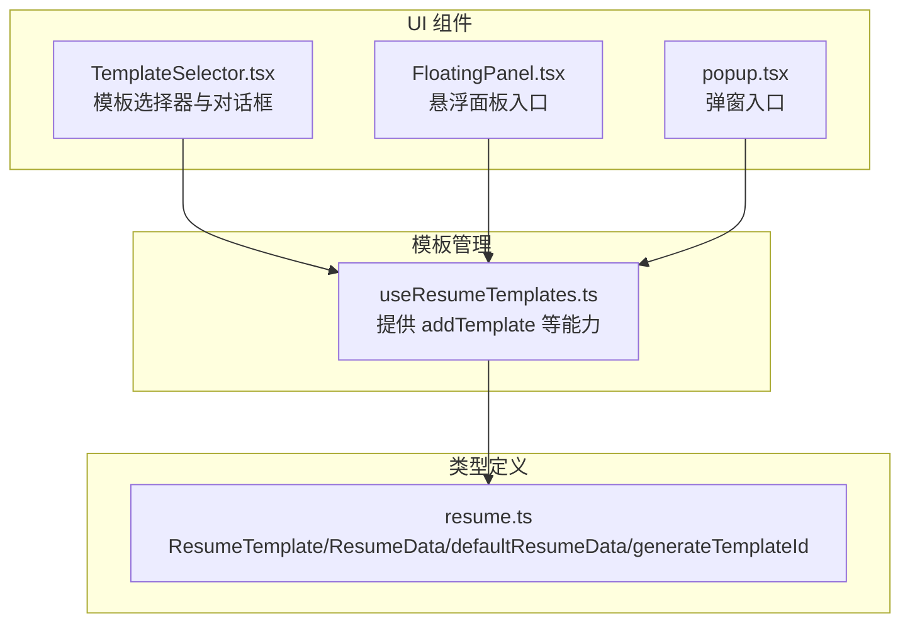
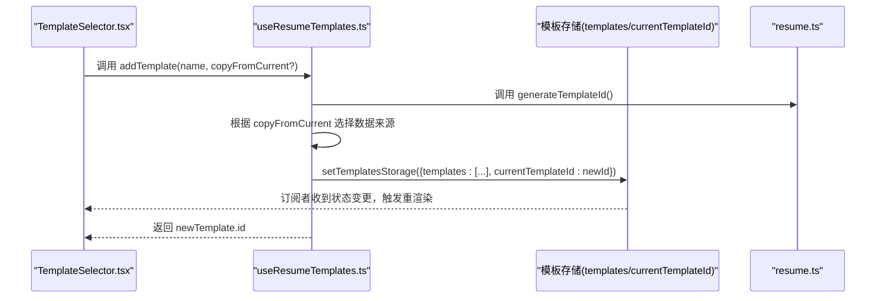
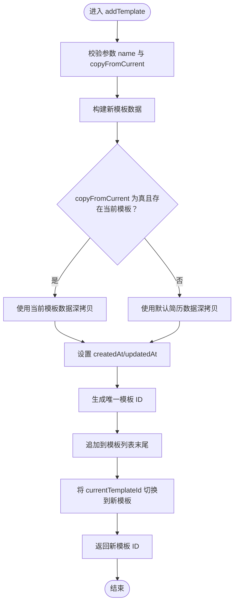
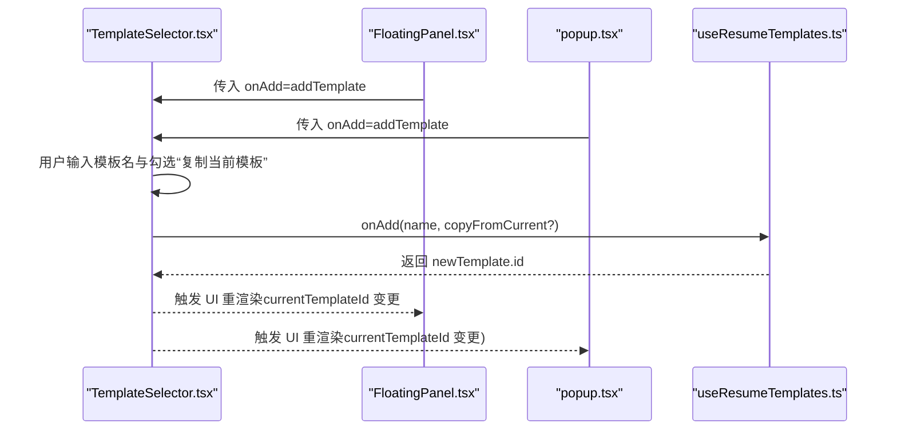
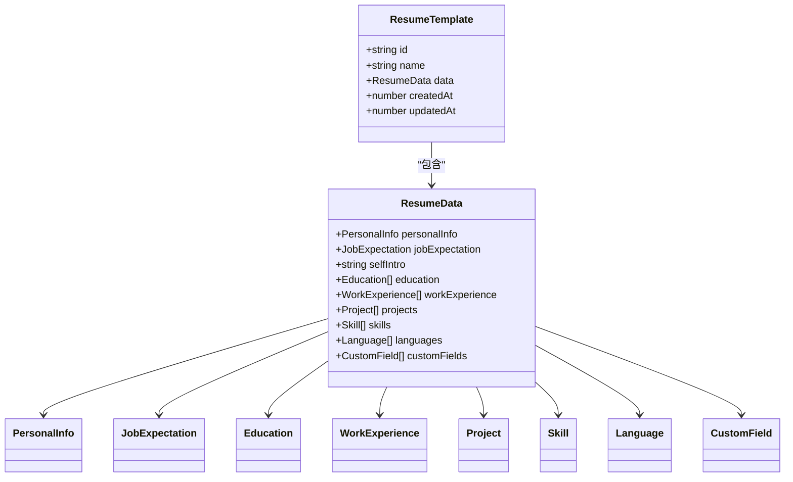
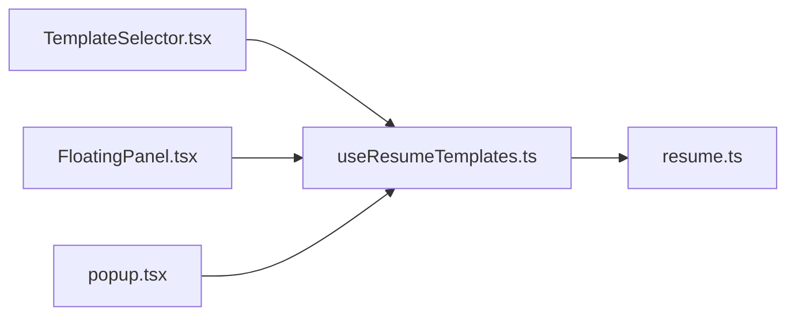

# addTemplate 方法

<cite>
**本文引用的文件**
- [useResumeTemplates.ts](file://src/hooks/useResumeTemplates.ts)
- [resume.ts](file://src/types/resume.ts)
- [TemplateSelector.tsx](file://src/components/common/TemplateSelector.tsx)
- [FloatingPanel.tsx](file://src/components/floating/FloatingPanel.tsx)
- [popup.tsx](file://src/popup.tsx)
</cite>

## 目录
1. [简介](#简介)
2. [项目结构](#项目结构)
3. [核心组件](#核心组件)
4. [架构总览](#架构总览)
5. [详细组件分析](#详细组件分析)
6. [依赖关系分析](#依赖关系分析)
7. [性能考量](#性能考量)
8. [故障排查指南](#故障排查指南)
9. [结论](#结论)

## 简介
本文件围绕 addTemplate 方法进行系统化说明，帮助开发者理解其职责与行为：
- 功能：创建一个新的简历模板。
- 参数：
  - name：模板名称（必填）。
  - copyFromCurrent：可选布尔值，决定新模板的数据来源。
- 数据来源规则：
  - 当 copyFromCurrent 为 true 且存在当前模板时，新模板将继承当前模板的数据；否则使用默认简历数据作为初始数据。
- 行为细节：
  - 自动生成唯一模板 ID。
  - 设置创建与更新时间戳。
  - 将新模板追加到模板列表末尾，并自动切换到该新模板。
- 返回值：新模板的 ID。该 ID 在 UI 导航中用于标识与切换模板。
- 注意事项：该方法会变更 currentTemplateId，这将触发依赖该状态的组件重渲染。

## 项目结构
addTemplate 方法位于模板管理 Hook 中，通过 UI 组件调用并影响全局模板状态。关键文件如下：
- 模板管理 Hook：提供 addTemplate、switchTemplate、renameTemplate、deleteTemplate、duplicateTemplate、updateCurrentResumeData 等能力。
- 类型定义：定义 ResumeTemplate、ResumeData、defaultResumeData、generateTemplateId 等。
- UI 组件：TemplateSelector 负责展示与交互；FloatingPanel 与 popup 页面集成模板管理能力。

图表来源
- [useResumeTemplates.ts](file://src/hooks/useResumeTemplates.ts#L107-L127)
- [resume.ts](file://src/types/resume.ts#L164-L212)
- [TemplateSelector.tsx](file://src/components/common/TemplateSelector.tsx#L1-L259)
- [FloatingPanel.tsx](file://src/components/floating/FloatingPanel.tsx#L117-L411)
- [popup.tsx](file://src/popup.tsx#L124-L241)

章节来源
- [useResumeTemplates.ts](file://src/hooks/useResumeTemplates.ts#L107-L127)
- [resume.ts](file://src/types/resume.ts#L164-L212)
- [TemplateSelector.tsx](file://src/components/common/TemplateSelector.tsx#L1-L259)
- [FloatingPanel.tsx](file://src/components/floating/FloatingPanel.tsx#L117-L411)
- [popup.tsx](file://src/popup.tsx#L124-L241)

## 核心组件
- 模板管理 Hook（useResumeTemplates）
  - 提供 addTemplate 方法，负责创建新模板并更新模板存储。
  - 提供 currentTemplate、currentResumeData 等派生状态，供 UI 使用。
- 类型定义（resume.ts）
  - ResumeTemplate：模板实体，包含 id、name、data、createdAt、updatedAt。
  - ResumeData：简历数据结构及默认值 defaultResumeData。
  - generateTemplateId：生成唯一模板 ID 的工具函数。
- UI 组件（TemplateSelector）
  - 负责收集用户输入（模板名、是否复制当前模板），并将请求转发给上层 Hook 的 addTemplate。
- 入口页面（FloatingPanel、popup）
  - 通过 useResumeTemplates 获取 addTemplate 并传入 TemplateSelector，实现“添加模板”功能。

章节来源
- [useResumeTemplates.ts](file://src/hooks/useResumeTemplates.ts#L107-L127)
- [resume.ts](file://src/types/resume.ts#L164-L212)
- [TemplateSelector.tsx](file://src/components/common/TemplateSelector.tsx#L1-L259)
- [FloatingPanel.tsx](file://src/components/floating/FloatingPanel.tsx#L117-L411)
- [popup.tsx](file://src/popup.tsx#L124-L241)

## 架构总览
addTemplate 的调用链路如下：
- UI 层（TemplateSelector）接收用户输入后调用 onAdd。
- onAdd 实际由 useResumeTemplates 的 addTemplate 实现。
- addTemplate 生成新模板对象（含唯一 ID、时间戳、数据来源），更新模板存储，并将 currentTemplateId 切换到新模板。
- 由于 currentTemplateId 是共享状态，任何订阅该状态的组件都会因变更而重渲染，从而驱动 UI 同步显示新模板。

图表来源
- [TemplateSelector.tsx](file://src/components/common/TemplateSelector.tsx#L47-L54)
- [useResumeTemplates.ts](file://src/hooks/useResumeTemplates.ts#L107-L127)
- [resume.ts](file://src/types/resume.ts#L186-L188)

## 详细组件分析

### addTemplate 方法详解
- 参数
  - name：字符串，新模板名称。
  - copyFromCurrent：布尔值，默认 false。为 true 时，新模板数据来自当前模板；否则来自默认简历数据。
- 数据来源规则
  - 若 copyFromCurrent 为 true 且存在 currentTemplate，则深拷贝 currentTemplate.data 作为新模板数据。
  - 否则，使用 defaultResumeData 作为新模板数据。
- 时间戳与 ID
  - createdAt 和 updatedAt 设置为当前时间戳。
  - id 通过 generateTemplateId 生成唯一标识。
- 存储与切换
  - 将新模板追加到 templates 数组末尾。
  - 同时将 currentTemplateId 设为新模板的 id，实现自动切换。
- 返回值
  - 返回新模板的 id。该 id 可用于后续 UI 导航（例如在模板选择器中定位新模板）。

图表来源
- [useResumeTemplates.ts](file://src/hooks/useResumeTemplates.ts#L107-L127)
- [resume.ts](file://src/types/resume.ts#L186-L188)
- [resume.ts](file://src/types/resume.ts#L124-L134)

章节来源
- [useResumeTemplates.ts](file://src/hooks/useResumeTemplates.ts#L107-L127)

### UI 集成与调用路径
- TemplateSelector.tsx
  - 作为 UI 入口，收集模板名与“复制当前模板”的选项，并调用 onAdd。
  - onAdd 由上层组件注入，实际指向 useResumeTemplates.addTemplate。
- FloatingPanel.tsx 与 popup.tsx
  - 两者均通过 useResumeTemplates 获取 addTemplate，并将其传入 TemplateSelector，实现悬浮面板与弹窗两种入口下的统一行为。

图表来源
- [TemplateSelector.tsx](file://src/components/common/TemplateSelector.tsx#L1-L259)
- [FloatingPanel.tsx](file://src/components/floating/FloatingPanel.tsx#L117-L411)
- [popup.tsx](file://src/popup.tsx#L124-L241)
- [useResumeTemplates.ts](file://src/hooks/useResumeTemplates.ts#L107-L127)

章节来源
- [TemplateSelector.tsx](file://src/components/common/TemplateSelector.tsx#L1-L259)
- [FloatingPanel.tsx](file://src/components/floating/FloatingPanel.tsx#L117-L411)
- [popup.tsx](file://src/popup.tsx#L124-L241)
- [useResumeTemplates.ts](file://src/hooks/useResumeTemplates.ts#L107-L127)

### 类型与数据模型
- ResumeTemplate
  - 字段：id、name、data（ResumeData）、createdAt、updatedAt。
- ResumeData
  - 包含个人信息、求职期望、自我介绍、教育经历、工作/实习经历、项目经历、技能、语言能力、自定义字段等。
- defaultResumeData
  - 提供各字段的默认空值，确保新模板具备完整结构。
- generateTemplateId
  - 生成带时间戳与随机串的唯一模板 ID。

图表来源
- [resume.ts](file://src/types/resume.ts#L1-L212)

章节来源
- [resume.ts](file://src/types/resume.ts#L1-L212)

## 依赖关系分析
- 模块耦合
  - useResumeTemplates 对 resume.ts 的类型与工具函数存在直接依赖。
  - TemplateSelector 仅依赖上层传入的回调（onAdd），保持 UI 与业务逻辑解耦。
  - FloatingPanel 与 popup 通过 useResumeTemplates 注入 addTemplate，形成入口级依赖。
- 状态依赖
  - addTemplate 会更新 templates 与 currentTemplateId，这两个状态被多个组件订阅，因此一次调用会触发多处 UI 重渲染。
- 外部依赖
  - 无外部第三方依赖，纯前端状态管理。

图表来源
- [TemplateSelector.tsx](file://src/components/common/TemplateSelector.tsx#L1-L259)
- [FloatingPanel.tsx](file://src/components/floating/FloatingPanel.tsx#L117-L411)
- [popup.tsx](file://src/popup.tsx#L124-L241)
- [useResumeTemplates.ts](file://src/hooks/useResumeTemplates.ts#L107-L127)
- [resume.ts](file://src/types/resume.ts#L164-L212)

章节来源
- [TemplateSelector.tsx](file://src/components/common/TemplateSelector.tsx#L1-L259)
- [FloatingPanel.tsx](file://src/components/floating/FloatingPanel.tsx#L117-L411)
- [popup.tsx](file://src/popup.tsx#L124-L241)
- [useResumeTemplates.ts](file://src/hooks/useResumeTemplates.ts#L107-L127)
- [resume.ts](file://src/types/resume.ts#L164-L212)

## 性能考量
- 时间复杂度
  - addTemplate 为 O(1) 操作，主要成本在于浅拷贝数据与一次数组追加。
- 空间复杂度
  - 若 copyFromCurrent 为 true，会深拷贝当前模板数据，空间开销与当前模板数据规模线性相关。
- 重渲染影响
  - currentTemplateId 的变更会触发大量订阅组件的重渲染，建议在 UI 层避免不必要的状态订阅，或对频繁更新的区域做局部优化。

## 故障排查指南
- 问题：添加模板后未看到新模板出现在选择器中
  - 排查：确认 onAdd 是否正确传入 useResumeTemplates 的 addTemplate；确认模板存储是否成功更新。
  - 参考路径：TemplateSelector.tsx 的 onAdd 调用与 useResumeTemplates.ts 的 addTemplate 实现。
- 问题：新模板未自动切换
  - 排查：确认 addTemplate 是否将 currentTemplateId 设为新模板 id；确认 UI 是否订阅了 currentTemplateId。
  - 参考路径：useResumeTemplates.ts 的 setTemplatesStorage 更新 currentTemplateId。
- 问题：复制当前模板导致数据异常
  - 排查：确认 copyFromCurrent 为 true 时确实使用了 currentTemplate.data；确认深拷贝是否生效。
  - 参考路径：useResumeTemplates.ts 的数据来源分支与深拷贝逻辑。
- 问题：默认数据不完整
  - 排查：确认 defaultResumeData 的结构与字段是否符合预期。
  - 参考路径：resume.ts 的 defaultResumeData 定义。

章节来源
- [TemplateSelector.tsx](file://src/components/common/TemplateSelector.tsx#L1-L259)
- [useResumeTemplates.ts](file://src/hooks/useResumeTemplates.ts#L107-L127)
- [resume.ts](file://src/types/resume.ts#L124-L134)

## 结论
addTemplate 方法提供了简洁一致的模板创建能力：
- 明确的参数与数据来源规则，支持“空白模板”与“基于当前模板的副本”两种场景。
- 自动生成唯一 ID、设置时间戳、更新模板列表并自动切换，保证用户体验连贯。
- 返回的新模板 ID 可用于 UI 导航与后续操作。
- 开发者需关注 currentTemplateId 变更引发的重渲染，合理组织 UI 结构与订阅范围，以获得最佳性能与体验。