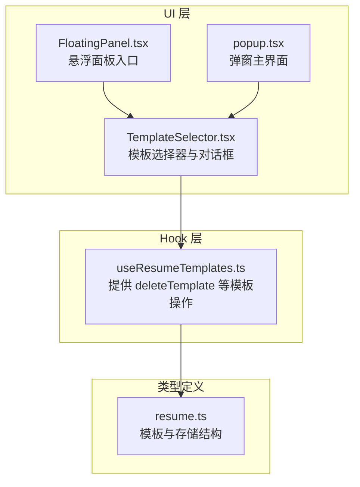
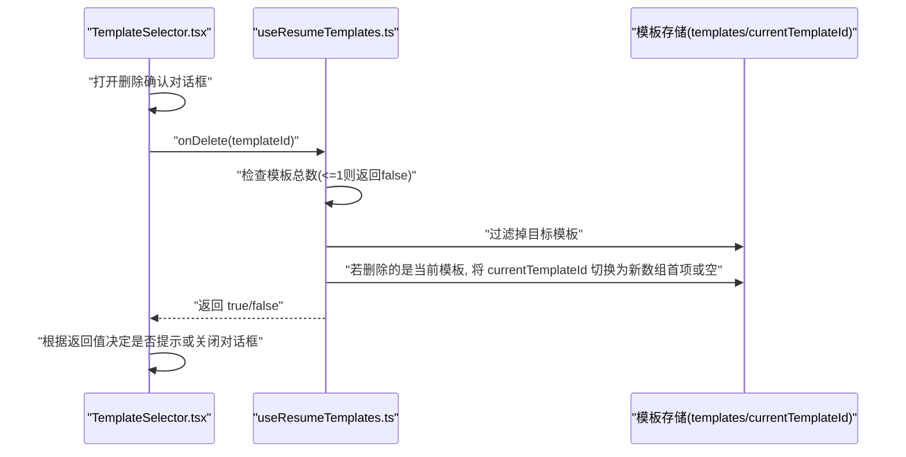
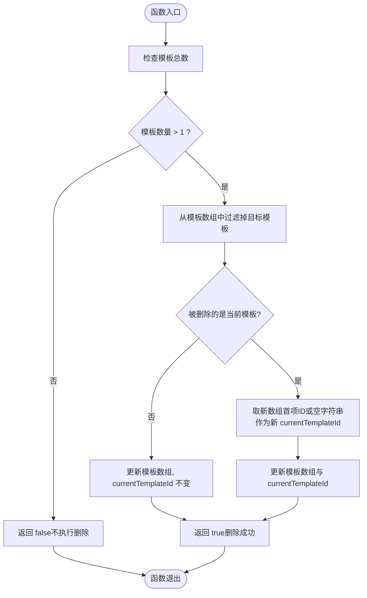
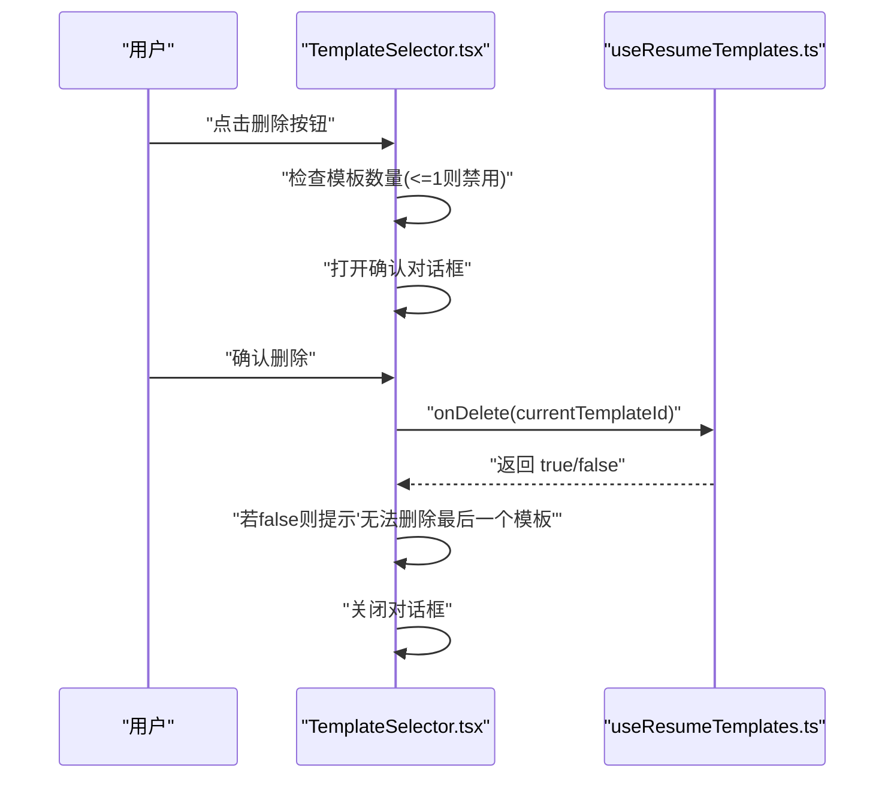
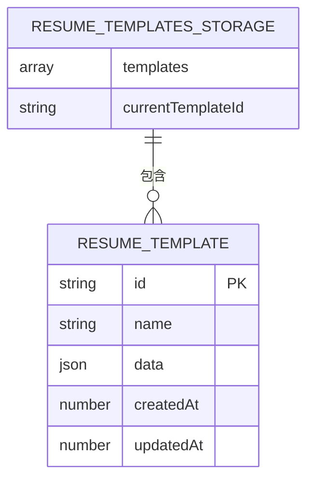
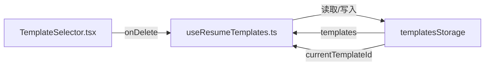

# deleteTemplate 方法

<cite>
**本文引用的文件**
- [useResumeTemplates.ts](file://src/hooks/useResumeTemplates.ts)
- [TemplateSelector.tsx](file://src/components/common/TemplateSelector.tsx)
- [resume.ts](file://src/types/resume.ts)
- [FloatingPanel.tsx](file://src/components/floating/FloatingPanel.tsx)
- [popup.tsx](file://src/popup.tsx)
</cite>

## 目录
1. [简介](#简介)
2. [项目结构](#项目结构)
3. [核心组件](#核心组件)
4. [架构总览](#架构总览)
5. [详细组件分析](#详细组件分析)
6. [依赖关系分析](#依赖关系分析)
7. [性能考量](#性能考量)
8. [故障排查指南](#故障排查指南)
9. [结论](#结论)

## 简介
本文件围绕 deleteTemplate 方法进行全面技术文档化，重点阐述其删除指定模板的安全机制与状态更新逻辑，并结合 addTemplate、switchTemplate 的协同工作流程，帮助开发者与使用者正确、安全地管理模板集合。

## 项目结构
deleteTemplate 方法位于模板管理 Hook 中，负责模板的删除操作；UI 层通过 TemplateSelector 组件触发删除并处理用户交互；类型定义位于 resume.ts 中，确保模板数据结构一致。

图表来源
- [useResumeTemplates.ts](file://src/hooks/useResumeTemplates.ts#L145-L168)
- [TemplateSelector.tsx](file://src/components/common/TemplateSelector.tsx#L45-L258)
- [resume.ts](file://src/types/resume.ts#L165-L181)
- [FloatingPanel.tsx](file://src/components/floating/FloatingPanel.tsx#L336-L349)
- [popup.tsx](file://src/popup.tsx#L199-L214)

章节来源
- [useResumeTemplates.ts](file://src/hooks/useResumeTemplates.ts#L145-L168)
- [TemplateSelector.tsx](file://src/components/common/TemplateSelector.tsx#L45-L258)
- [resume.ts](file://src/types/resume.ts#L165-L181)
- [FloatingPanel.tsx](file://src/components/floating/FloatingPanel.tsx#L336-L349)
- [popup.tsx](file://src/popup.tsx#L199-L214)

## 核心组件
- deleteTemplate：接收 templateId 参数，执行删除前的安全检查与状态更新，返回布尔值表示操作是否成功。
- addTemplate：新增模板，作为删除的对称操作，保证模板数量始终至少为 1。
- switchTemplate：切换当前模板，配合删除后的状态更新，确保 currentTemplateId 不失效。
- TemplateSelector：UI 层负责确认删除并调用 onDelete 回调，同时在模板数量小于等于 1 时禁用删除按钮。

章节来源
- [useResumeTemplates.ts](file://src/hooks/useResumeTemplates.ts#L95-L105)
- [useResumeTemplates.ts](file://src/hooks/useResumeTemplates.ts#L108-L128)
- [useResumeTemplates.ts](file://src/hooks/useResumeTemplates.ts#L145-L168)
- [TemplateSelector.tsx](file://src/components/common/TemplateSelector.tsx#L240-L250)

## 架构总览
deleteTemplate 的调用链路如下：UI 触发删除 -> Hook 执行删除逻辑 -> 更新模板数组与 currentTemplateId -> 返回布尔结果供 UI 判断。

图表来源
- [TemplateSelector.tsx](file://src/components/common/TemplateSelector.tsx#L66-L74)
- [useResumeTemplates.ts](file://src/hooks/useResumeTemplates.ts#L145-L168)

## 详细组件分析

### deleteTemplate 方法详解
- 入参与返回
  - 入参：templateId（字符串，目标模板 ID）
  - 返回：布尔值（true 表示删除成功；false 表示未执行删除）
- 安全机制
  - 在执行删除前检查模板总数，当模板数量小于等于 1 时直接返回 false，防止出现“无模板”状态。
- 状态更新逻辑
  - 从模板数组中过滤掉目标模板 ID，得到新数组。
  - 若被删除的模板正是当前模板，则将 currentTemplateId 切换为新数组的第一个模板 ID；若新数组为空，则 currentTemplateId 设为空字符串。
- 调用方处理建议
  - 调用方应基于返回值进行条件处理（例如显示提示信息），避免误以为删除失败而重复尝试。

图表来源
- [useResumeTemplates.ts](file://src/hooks/useResumeTemplates.ts#L145-L168)

章节来源
- [useResumeTemplates.ts](file://src/hooks/useResumeTemplates.ts#L145-L168)

### 与 addTemplate 的协同
- addTemplate 会在创建新模板时将 currentTemplateId 设为新模板 ID，从而保证模板集合非空。
- deleteTemplate 在模板数量 <= 1 时不执行删除，避免出现空集合。
- 协同效果：新增模板后，删除模板才具备意义；删除模板后，若剩余模板数仍大于 1，currentTemplateId 保持不变或自动切换到新数组首项，确保 UI 与数据一致性。

章节来源
- [useResumeTemplates.ts](file://src/hooks/useResumeTemplates.ts#L108-L128)
- [useResumeTemplates.ts](file://src/hooks/useResumeTemplates.ts#L145-L168)

### 与 switchTemplate 的协同
- switchTemplate 仅在模板数组包含目标 ID 时才切换 currentTemplateId，避免无效切换。
- deleteTemplate 在删除当前模板时会自动切换 currentTemplateId，确保后续切换不会指向已删除模板。
- 协同效果：删除与切换互不冲突，删除后切换行为稳定可靠。

章节来源
- [useResumeTemplates.ts](file://src/hooks/useResumeTemplates.ts#L95-L105)
- [useResumeTemplates.ts](file://src/hooks/useResumeTemplates.ts#L145-L168)

### UI 层交互与最佳实践
- TemplateSelector 在模板数量 <= 1 时禁用删除按钮，避免误触。
- 删除前通过确认对话框提示用户，确认后再调用 onDelete(templateId)。
- onDelete 返回 false 时，UI 应提示“无法删除最后一个模板”，并引导用户先添加模板。

图表来源
- [TemplateSelector.tsx](file://src/components/common/TemplateSelector.tsx#L240-L250)
- [TemplateSelector.tsx](file://src/components/common/TemplateSelector.tsx#L66-L74)
- [useResumeTemplates.ts](file://src/hooks/useResumeTemplates.ts#L145-L168)

章节来源
- [TemplateSelector.tsx](file://src/components/common/TemplateSelector.tsx#L240-L250)
- [TemplateSelector.tsx](file://src/components/common/TemplateSelector.tsx#L66-L74)

### 类型与数据模型
- ResumeTemplate：包含 id、name、data、createdAt、updatedAt 字段。
- ResumeTemplatesStorage：包含 templates 数组与 currentTemplateId。
- deleteTemplate 依赖这些类型确保模板对象与存储结构的一致性。

图表来源
- [resume.ts](file://src/types/resume.ts#L165-L181)

章节来源
- [resume.ts](file://src/types/resume.ts#L165-L181)

## 依赖关系分析
- deleteTemplate 依赖：
  - templatesStorage.templates：用于检查模板数量与过滤目标模板。
  - templatesStorage.currentTemplateId：用于判断是否需要切换当前模板。
  - setTemplatesStorage：用于原子性更新模板数组与 currentTemplateId。
- UI 依赖：
  - TemplateSelector 通过 onDelete 回调与 Hook 交互，同时受 templates 数量控制删除按钮可用性。

图表来源
- [TemplateSelector.tsx](file://src/components/common/TemplateSelector.tsx#L336-L349)
- [useResumeTemplates.ts](file://src/hooks/useResumeTemplates.ts#L145-L168)

章节来源
- [TemplateSelector.tsx](file://src/components/common/TemplateSelector.tsx#L336-L349)
- [useResumeTemplates.ts](file://src/hooks/useResumeTemplates.ts#L145-L168)

## 性能考量
- 时间复杂度：删除操作对模板数组进行一次过滤，时间复杂度 O(n)，n 为模板数量。由于模板数量通常较小，性能影响可忽略。
- 空间复杂度：创建新数组，空间复杂度 O(n)。
- 优化建议：
  - 若模板数量较多且频繁删除，可在 UI 层增加“批量删除”或“撤销删除”的交互，减少不必要的状态变更。
  - 避免在短时间内连续多次调用 deleteTemplate，以免产生多次状态更新。

[本节为通用性能讨论，不直接分析具体文件]

## 故障排查指南
- 现象：点击删除按钮无反应或立即提示“无法删除最后一个模板”
  - 排查：确认模板数量是否为 1；TemplateSelector 在模板数量 <= 1 时会禁用删除按钮。
  - 处理：先通过“添加模板”增加模板数量，再执行删除。
- 现象：删除后当前模板未切换
  - 排查：确认被删除的模板是否为当前模板；若删除的是当前模板，currentTemplateId 会被自动切换为首项或空字符串。
  - 处理：在 UI 层根据 currentTemplateId 的变化重新渲染表单或提示用户选择新模板。
- 现象：调用方未处理返回值导致误判
  - 排查：确认调用方是否基于返回值进行条件处理（如提示“无法删除最后一个模板”）。
  - 处理：在调用处依据布尔返回值进行分支处理。

章节来源
- [TemplateSelector.tsx](file://src/components/common/TemplateSelector.tsx#L240-L250)
- [TemplateSelector.tsx](file://src/components/common/TemplateSelector.tsx#L66-L74)
- [useResumeTemplates.ts](file://src/hooks/useResumeTemplates.ts#L145-L168)

## 结论
deleteTemplate 通过“模板数量保护 + 原子性状态更新 + 明确返回值”的设计，确保了模板删除过程的安全与可控。配合 addTemplate 与 switchTemplate 的协同，以及 UI 层的确认与提示，形成完整的模板生命周期管理闭环。调用方应严格依据返回值进行条件处理，以获得一致的用户体验。