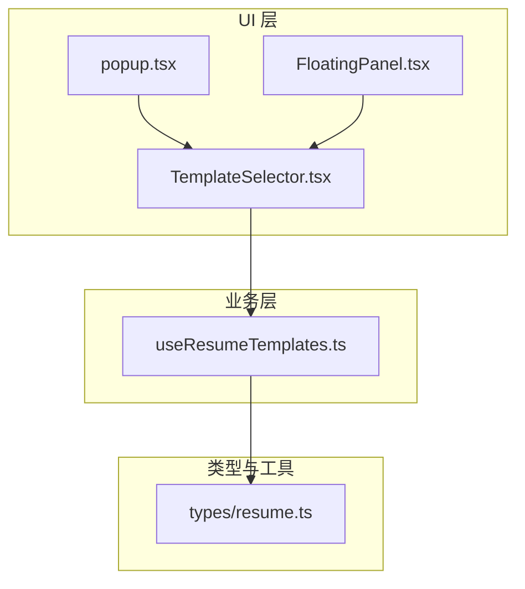
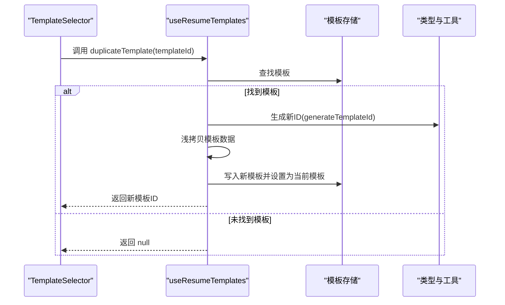
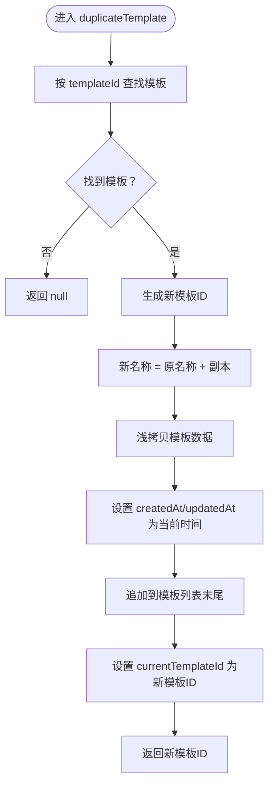
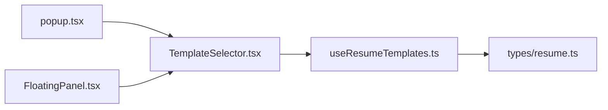

# duplicateTemplate 方法

<cite>
**本文引用的文件**
- [useResumeTemplates.ts](file://src/hooks/useResumeTemplates.ts)
- [resume.ts](file://src/types/resume.ts)
- [TemplateSelector.tsx](file://src/components/common/TemplateSelector.tsx)
- [popup.tsx](file://src/popup.tsx)
- [FloatingPanel.tsx](file://src/components/floating/FloatingPanel.tsx)
</cite>

## 目录
1. [简介](#简介)
2. [项目结构](#项目结构)
3. [核心组件](#核心组件)
4. [架构总览](#架构总览)
5. [详细组件分析](#详细组件分析)
6. [依赖关系分析](#依赖关系分析)
7. [性能考量](#性能考量)
8. [故障排查指南](#故障排查指南)
9. [结论](#结论)
10. [附录](#附录)

## 简介
本文件围绕 duplicateTemplate 方法进行深入文档化，说明其用于“复制现有模板”的功能。该方法接收一个模板 ID，查找对应模板并创建副本，副本名称自动添加“（副本）”后缀，数据进行浅拷贝（对顶层对象进行拷贝，避免引用共享），新模板获得独立 ID 和时间戳，并被添加到模板列表中，同时自动切换到该副本。方法返回新模板 ID 或 null（当源模板不存在时），便于调用方进行导航或状态管理。文档还对比了 duplicateTemplate 与 addTemplate 的区别：前者基于现有数据创建，后者创建空白模板。

## 项目结构
duplicateTemplate 方法位于模板管理 Hook 中，通过 UI 组件（弹窗面板与浏览器弹出页）暴露给用户使用。其核心实现与类型定义如下：
- 模板管理 Hook：src/hooks/useResumeTemplates.ts
- 类型定义：src/types/resume.ts
- UI 组件：src/components/common/TemplateSelector.tsx
- 页面入口：src/popup.tsx、src/components/floating/FloatingPanel.tsx

图表来源
- [popup.tsx](file://src/popup.tsx#L200-L214)
- [FloatingPanel.tsx](file://src/components/floating/FloatingPanel.tsx#L340-L350)
- [TemplateSelector.tsx](file://src/components/common/TemplateSelector.tsx#L190-L210)
- [useResumeTemplates.ts](file://src/hooks/useResumeTemplates.ts#L194-L216)
- [resume.ts](file://src/types/resume.ts#L164-L181)

章节来源
- [useResumeTemplates.ts](file://src/hooks/useResumeTemplates.ts#L194-L216)
- [resume.ts](file://src/types/resume.ts#L164-L181)
- [TemplateSelector.tsx](file://src/components/common/TemplateSelector.tsx#L190-L210)
- [popup.tsx](file://src/popup.tsx#L200-L214)
- [FloatingPanel.tsx](file://src/components/floating/FloatingPanel.tsx#L340-L350)

## 核心组件
- duplicateTemplate：在 useResumeTemplates.ts 中实现，负责根据传入的模板 ID 查找模板、复制数据、生成新 ID、更新时间戳、加入列表并切换到新模板，返回新模板 ID；若未找到源模板则返回 null。
- ResumeTemplate 类型：包含 id、name、data、createdAt、updatedAt 字段，用于描述模板的结构。
- generateTemplateId：用于生成唯一模板 ID 的工具函数。
- TemplateSelector：UI 组件，提供“复制模板”按钮，调用 onDuplicate 回调（即 duplicateTemplate）。
- popup.tsx 与 FloatingPanel.tsx：作为 UI 入口，注入 useResumeTemplates 并将 duplicateTemplate 传递给 TemplateSelector。

章节来源
- [useResumeTemplates.ts](file://src/hooks/useResumeTemplates.ts#L194-L216)
- [resume.ts](file://src/types/resume.ts#L164-L181)
- [resume.ts](file://src/types/resume.ts#L186-L190)
- [TemplateSelector.tsx](file://src/components/common/TemplateSelector.tsx#L231-L239)
- [popup.tsx](file://src/popup.tsx#L200-L214)
- [FloatingPanel.tsx](file://src/components/floating/FloatingPanel.tsx#L340-L350)

## 架构总览
duplicateTemplate 的调用链路如下：
- UI 触发：TemplateSelector 的“复制模板”按钮触发 handleDuplicate，进而调用 onDuplicate（即 duplicateTemplate）。
- 业务处理：duplicateTemplate 在 useResumeTemplates.ts 中执行查找、复制、生成新 ID、更新时间戳、写入存储并切换当前模板。
- 状态更新：模板列表与当前模板 ID 同步更新，UI 自动渲染最新模板列表并切换到新模板。

图表来源
- [TemplateSelector.tsx](file://src/components/common/TemplateSelector.tsx#L76-L81)
- [useResumeTemplates.ts](file://src/hooks/useResumeTemplates.ts#L194-L216)
- [resume.ts](file://src/types/resume.ts#L186-L190)

## 详细组件分析

### duplicateTemplate 方法实现要点
- 参数与返回值
  - 输入：templateId（字符串）
  - 输出：新模板 ID（字符串）或 null（当源模板不存在时）
- 查找与校验
  - 在模板列表中按 ID 查找目标模板；若不存在直接返回 null。
- 复制与改名
  - 新模板名称为“原名称（副本）”，确保区分度。
- 数据拷贝策略
  - 对模板数据进行浅拷贝，避免引用共享同一对象，降低副作用风险。
- 唯一性与时间戳
  - 新模板 ID 通过 generateTemplateId 生成，确保全局唯一。
  - createdAt 与 updatedAt 设置为当前时间戳。
- 存储与切换
  - 将新模板追加到模板列表末尾，并将 currentTemplateId 设为新模板 ID，立即切换到该副本。
- 返回值
  - 返回新模板 ID，便于调用方进行后续导航或状态管理；若失败返回 null。

图表来源
- [useResumeTemplates.ts](file://src/hooks/useResumeTemplates.ts#L194-L216)
- [resume.ts](file://src/types/resume.ts#L186-L190)

章节来源
- [useResumeTemplates.ts](file://src/hooks/useResumeTemplates.ts#L194-L216)

### 与 addTemplate 的区别
- duplicateTemplate：基于现有模板的数据创建副本，保留原始数据，适合快速生成相似版本（例如“简历（副本）”）。
- addTemplate：创建空白模板，数据来自默认模板或可选地从当前模板复制（由调用方决定），适合从零开始创建新模板。

章节来源
- [useResumeTemplates.ts](file://src/hooks/useResumeTemplates.ts#L108-L128)
- [useResumeTemplates.ts](file://src/hooks/useResumeTemplates.ts#L194-L216)

### UI 集成与交互
- TemplateSelector 提供“复制模板”按钮，点击后调用 onDuplicate 回调（即 duplicateTemplate）。
- popup.tsx 与 FloatingPanel.tsx 将 useResumeTemplates 注入到 UI，使 TemplateSelector 能够调用 duplicateTemplate。

章节来源
- [TemplateSelector.tsx](file://src/components/common/TemplateSelector.tsx#L231-L239)
- [popup.tsx](file://src/popup.tsx#L200-L214)
- [FloatingPanel.tsx](file://src/components/floating/FloatingPanel.tsx#L340-L350)

## 依赖关系分析
- duplicateTemplate 依赖：
  - 模板存储：从 templates 中查找模板，向 templates 追加新模板，并更新 currentTemplateId。
  - 类型与工具：使用 ResumeTemplate 接口、generateTemplateId 生成唯一 ID。
- UI 依赖：
  - TemplateSelector 依赖 onDuplicate 回调，将其绑定到“复制模板”按钮。
  - popup.tsx 与 FloatingPanel.tsx 依赖 useResumeTemplates，将 duplicateTemplate 传递给 TemplateSelector。

图表来源
- [TemplateSelector.tsx](file://src/components/common/TemplateSelector.tsx#L190-L210)
- [popup.tsx](file://src/popup.tsx#L200-L214)
- [FloatingPanel.tsx](file://src/components/floating/FloatingPanel.tsx#L340-L350)
- [useResumeTemplates.ts](file://src/hooks/useResumeTemplates.ts#L194-L216)
- [resume.ts](file://src/types/resume.ts#L164-L181)

章节来源
- [TemplateSelector.tsx](file://src/components/common/TemplateSelector.tsx#L190-L210)
- [popup.tsx](file://src/popup.tsx#L200-L214)
- [FloatingPanel.tsx](file://src/components/floating/FloatingPanel.tsx#L340-L350)
- [useResumeTemplates.ts](file://src/hooks/useResumeTemplates.ts#L194-L216)
- [resume.ts](file://src/types/resume.ts#L164-L181)

## 性能考量
- 时间复杂度
  - 查找模板：O(n)，n 为模板数量。
  - 写入存储：O(n)（数组追加），但实际为 O(1) 常数级追加。
- 空间复杂度
  - 复制模板数据为浅拷贝，空间开销与模板数据大小线性相关。
- 优化建议
  - 若模板数量较大且频繁复制，可在 UI 层限制显示数量或采用虚拟滚动。
  - 对于超大模板数据，可考虑分块复制或延迟初始化部分字段，减少首屏压力。
  - 保持浅拷贝策略以避免深层递归带来的额外开销。

## 故障排查指南
- 现象：点击“复制模板”无反应或未切换到新模板
  - 检查 onDuplicate 是否正确传入 duplicateTemplate。
  - 确认当前是否存在至少一个模板，避免 UI 误判。
- 现象：返回 null
  - 检查传入的 templateId 是否有效。
  - 确认模板存储是否已加载完成。
- 现象：新模板名称未带“（副本）”
  - 检查 duplicateTemplate 的改名逻辑是否被覆盖或修改。
- 现象：新模板数据与原模板共享引用
  - 确认浅拷贝是否生效，避免直接赋值引用。

章节来源
- [TemplateSelector.tsx](file://src/components/common/TemplateSelector.tsx#L76-L81)
- [useResumeTemplates.ts](file://src/hooks/useResumeTemplates.ts#L194-L216)

## 结论
duplicateTemplate 提供了基于现有模板快速创建副本的能力，具备良好的易用性与一致性：名称自动加“（副本）”、数据浅拷贝避免引用共享、新模板拥有独立 ID 与时间戳、自动切换到新模板并返回新 ID。与 addTemplate 相比，duplicateTemplate 更适合“快速生成相似版本”的场景，如制作不同投递方向的简历版本。通过清晰的调用链与类型约束，该方法在 UI 与业务层之间实现了稳定可靠的集成。

## 附录
- 使用场景示例
  - 快速创建相似简历版本：如“简历（副本）”、“投递A公司简历（副本）”等，便于在不丢失原始数据的情况下进行差异化编辑。
  - 多轮迭代：在现有模板基础上复制并逐步优化，避免重复录入。
- API 行为摘要
  - 输入：templateId（字符串）
  - 输出：新模板 ID（字符串）或 null
  - 行为：查找模板 -> 生成新 ID -> 浅拷贝数据 -> 更新时间戳 -> 追加到列表 -> 切换当前模板 -> 返回新 ID