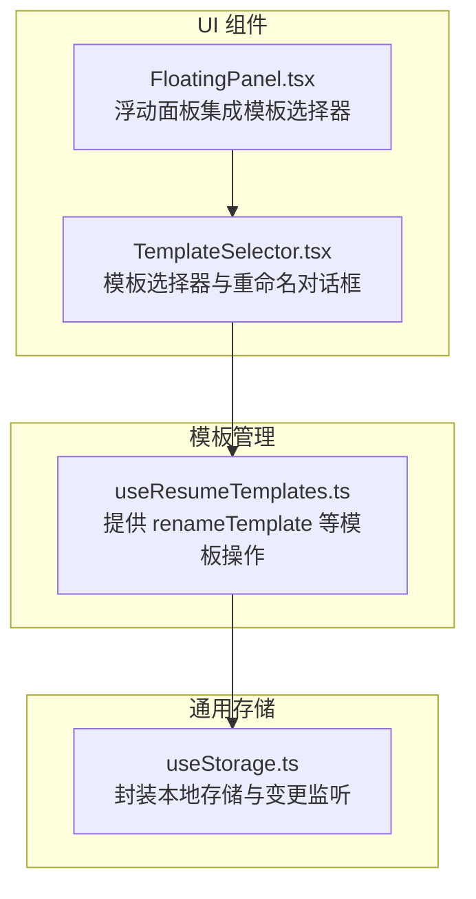
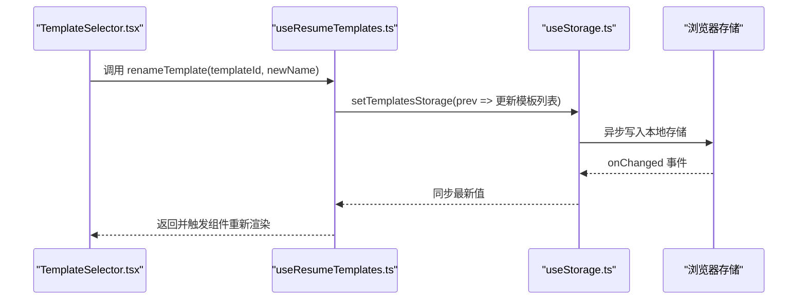
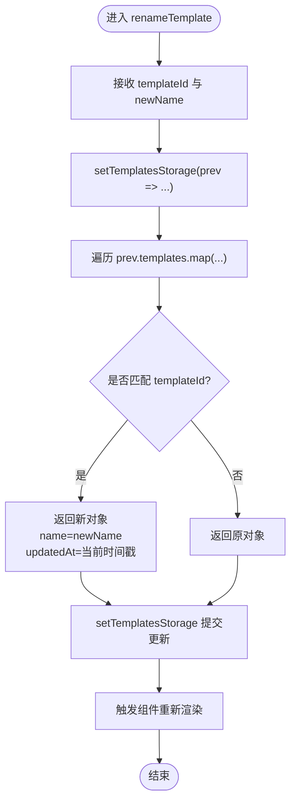
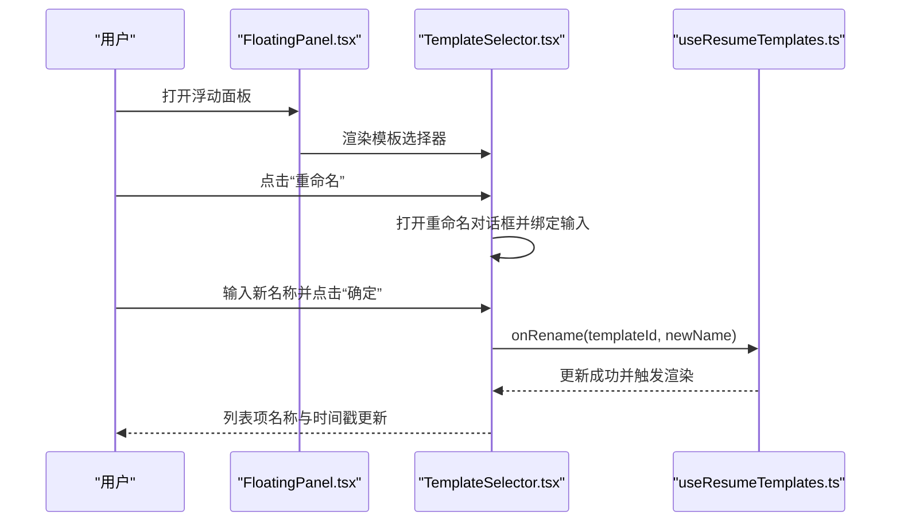
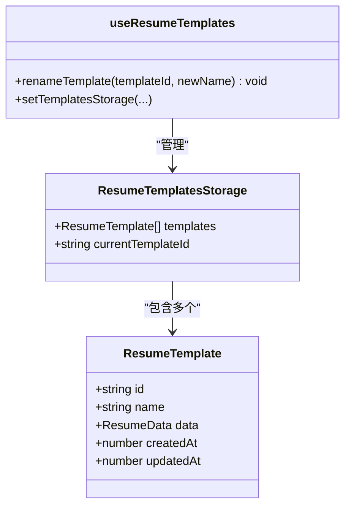
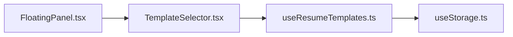

# renameTemplate 方法

<cite>
**本文引用的文件**
- [useResumeTemplates.ts](file://src/hooks/useResumeTemplates.ts)
- [TemplateSelector.tsx](file://src/components/common/TemplateSelector.tsx)
- [FloatingPanel.tsx](file://src/components/floating/FloatingPanel.tsx)
- [useStorage.ts](file://src/hooks/useStorage.ts)
- [resume.ts](file://src/types/resume.ts)
</cite>

## 目录
1. [简介](#简介)
2. [项目结构](#项目结构)
3. [核心组件](#核心组件)
4. [架构总览](#架构总览)
5. [详细组件分析](#详细组件分析)
6. [依赖关系分析](#依赖关系分析)
7. [性能考量](#性能考量)
8. [故障排查指南](#故障排查指南)
9. [结论](#结论)

## 简介
本文件围绕 renameTemplate 方法进行系统化文档说明，重点阐述其功能目标、参数语义、内部实现机制、副作用范围与使用方式。该方法用于修改指定模板的名称与更新时间戳，不改变模板 ID 或模板数据内容，仅更新元信息；同时通过状态更新触发相关组件重新渲染，确保 UI 与存储层保持一致。

## 项目结构
本方法位于模板管理 Hook 中，配合通用存储 Hook 与 UI 组件共同完成模板重命名的端到端流程。关键文件如下：
- 模板管理 Hook：提供模板 CRUD 能力与状态管理
- 通用存储 Hook：封装浏览器存储读写与跨实例同步
- UI 组件：模板选择器与浮动面板等，承载用户交互入口

图表来源
- [useResumeTemplates.ts](file://src/hooks/useResumeTemplates.ts#L130-L143)
- [TemplateSelector.tsx](file://src/components/common/TemplateSelector.tsx#L1-L258)
- [FloatingPanel.tsx](file://src/components/floating/FloatingPanel.tsx#L340-L350)
- [useStorage.ts](file://src/hooks/useStorage.ts#L1-L102)

章节来源
- [useResumeTemplates.ts](file://src/hooks/useResumeTemplates.ts#L1-L258)
- [TemplateSelector.tsx](file://src/components/common/TemplateSelector.tsx#L1-L258)
- [FloatingPanel.tsx](file://src/components/floating/FloatingPanel.tsx#L340-L350)
- [useStorage.ts](file://src/hooks/useStorage.ts#L1-L102)

## 核心组件
- renameTemplate：接收 templateId 与 newName 两个字符串参数，通过映射模板列表定位目标模板并更新其 name 与 updatedAt 字段，随后通过 setTemplatesStorage 触发状态更新与持久化。
- setTemplatesStorage：来自 useStorage 的更新函数，负责将模板存储结构写入浏览器本地存储，并广播给其他实例，从而驱动 UI 重新渲染。
- TemplateSelector：提供“重命名”对话框与输入控件，调用上层传入的 onRename 回调（即 renameTemplate）。
- FloatingPanel：在浮动面板中集成 TemplateSelector，作为模板管理界面的主要入口之一。

章节来源
- [useResumeTemplates.ts](file://src/hooks/useResumeTemplates.ts#L130-L143)
- [TemplateSelector.tsx](file://src/components/common/TemplateSelector.tsx#L45-L88)
- [FloatingPanel.tsx](file://src/components/floating/FloatingPanel.tsx#L340-L350)
- [useStorage.ts](file://src/hooks/useStorage.ts#L61-L88)

## 架构总览
下面的时序图展示了从 UI 触发到状态更新与持久化的完整链路。

图表来源
- [TemplateSelector.tsx](file://src/components/common/TemplateSelector.tsx#L56-L63)
- [useResumeTemplates.ts](file://src/hooks/useResumeTemplates.ts#L130-L143)
- [useStorage.ts](file://src/hooks/useStorage.ts#L40-L59)
- [useStorage.ts](file://src/hooks/useStorage.ts#L61-L88)

## 详细组件分析

### renameTemplate 方法详解
- 功能目标：修改指定模板的名称与更新时间戳，不改变模板 ID 与模板数据内容。
- 参数说明：
  - templateId: 目标模板的唯一标识符（字符串）
  - newName: 新的模板名称（字符串）
- 内部实现要点：
  - 使用 setTemplatesStorage(prev => ...) 形式进行不可变更新，避免直接修改原对象引用。
  - 通过 map 遍历模板数组，定位到 id 匹配的模板后，返回一个包含 name 与 updatedAt 更新的新对象，其余模板保持不变。
  - updatedAt 字段被设置为当前时间戳，体现元信息的更新。
- 副作用范围：
  - 仅影响模板列表中的特定模板项，不会改变当前激活模板或其他模板的数据内容。
  - 通过 setTemplatesStorage 触发状态更新，进而驱动依赖该状态的组件重新渲染。
- 类型与数据模型支撑：
  - 模板结构包含 id、name、data、createdAt、updatedAt 等字段，renameTemplate 仅更新 name 与 updatedAt。
  - 模板存储结构包含 templates 数组与 currentTemplateId，renameTemplate 不会改变 currentTemplateId。

图表来源
- [useResumeTemplates.ts](file://src/hooks/useResumeTemplates.ts#L130-L143)
- [resume.ts](file://src/types/resume.ts#L164-L181)

章节来源
- [useResumeTemplates.ts](file://src/hooks/useResumeTemplates.ts#L130-L143)
- [resume.ts](file://src/types/resume.ts#L164-L181)

### UI 集成与使用示例
- 在模板管理界面中，用户通过 TemplateSelector 的“重命名”按钮打开对话框，输入新名称后确认，组件调用 onRename 回调（即 renameTemplate）。
- FloatingPanel 将模板选择器集成到浮动面板中，作为主要的模板管理入口之一，用户可在此完成重命名操作。

图表来源
- [FloatingPanel.tsx](file://src/components/floating/FloatingPanel.tsx#L340-L350)
- [TemplateSelector.tsx](file://src/components/common/TemplateSelector.tsx#L45-L88)
- [TemplateSelector.tsx](file://src/components/common/TemplateSelector.tsx#L142-L164)
- [useResumeTemplates.ts](file://src/hooks/useResumeTemplates.ts#L130-L143)

章节来源
- [FloatingPanel.tsx](file://src/components/floating/FloatingPanel.tsx#L340-L350)
- [TemplateSelector.tsx](file://src/components/common/TemplateSelector.tsx#L45-L88)
- [TemplateSelector.tsx](file://src/components/common/TemplateSelector.tsx#L142-L164)

### 数据模型与类型约束
- 模板接口包含 id、name、data、createdAt、updatedAt 等字段，renameTemplate 仅更新 name 与 updatedAt。
- 模板存储结构包含 templates 数组与 currentTemplateId，renameTemplate 不会改变 currentTemplateId。

图表来源
- [resume.ts](file://src/types/resume.ts#L164-L181)
- [useResumeTemplates.ts](file://src/hooks/useResumeTemplates.ts#L130-L143)

章节来源
- [resume.ts](file://src/types/resume.ts#L164-L181)
- [useResumeTemplates.ts](file://src/hooks/useResumeTemplates.ts#L130-L143)

## 依赖关系分析
- renameTemplate 依赖 setTemplatesStorage，后者来自 useStorage，负责本地存储与跨实例同步。
- UI 层通过 TemplateSelector 与 FloatingPanel 调用 renameTemplate，形成“用户交互 -> 模板操作 -> 状态更新 -> UI 重新渲染”的闭环。

图表来源
- [TemplateSelector.tsx](file://src/components/common/TemplateSelector.tsx#L1-L258)
- [useResumeTemplates.ts](file://src/hooks/useResumeTemplates.ts#L130-L143)
- [useStorage.ts](file://src/hooks/useStorage.ts#L1-L102)
- [FloatingPanel.tsx](file://src/components/floating/FloatingPanel.tsx#L340-L350)

章节来源
- [TemplateSelector.tsx](file://src/components/common/TemplateSelector.tsx#L1-L258)
- [useResumeTemplates.ts](file://src/hooks/useResumeTemplates.ts#L130-L143)
- [useStorage.ts](file://src/hooks/useStorage.ts#L1-L102)
- [FloatingPanel.tsx](file://src/components/floating/FloatingPanel.tsx#L340-L350)

## 性能考量
- 不可变更新：通过 map 与对象展开构造新对象，避免直接修改原对象引用，有利于 React 依赖追踪与渲染优化。
- 局部更新：仅对匹配到的模板项进行更新，时间复杂度为 O(n)，其中 n 为模板数量；在模板数量较小的情况下开销可忽略。
- 存储写入：useStorage 的异步写入与 onChanged 广播机制保证了跨实例一致性，避免重复渲染与竞态。

[本节为通用性能建议，不直接分析具体文件]

## 故障排查指南
- 重命名无效：确认传入的 templateId 是否存在于 templates 中；若不存在，renameTemplate 不会执行任何更新。
- 名称未显示更新：检查 setTemplatesStorage 是否正确触发；若浏览器存储异常，可能影响 onChanged 广播与 UI 同步。
- 时间戳异常：确认 updatedAt 是否被正确更新为当前时间戳；若出现异常，可检查调用链路与时间源。

章节来源
- [useResumeTemplates.ts](file://src/hooks/useResumeTemplates.ts#L130-L143)
- [useStorage.ts](file://src/hooks/useStorage.ts#L40-L59)

## 结论
renameTemplate 方法以最小改动实现了模板元信息的更新，遵循不可变更新与局部更新原则，确保 UI 与存储层的一致性。其副作用严格限定在模板列表的局部更新范围内，不会影响当前激活状态或其他模板的数据内容。结合 TemplateSelector 与 FloatingPanel，用户可在模板管理界面中便捷地完成重命名操作。