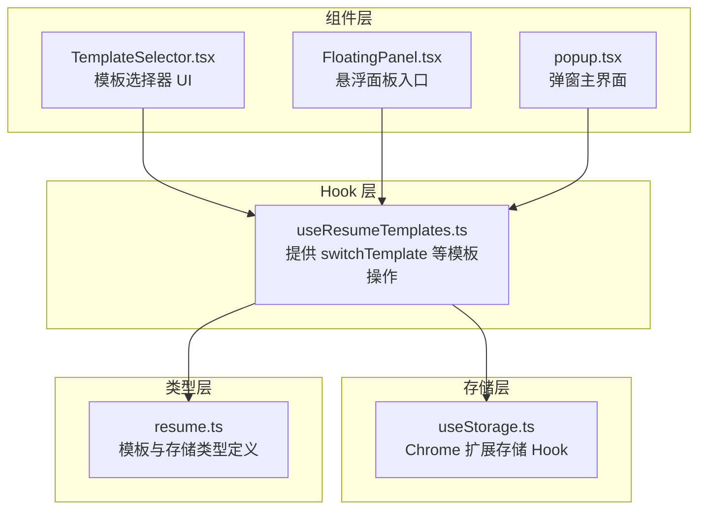
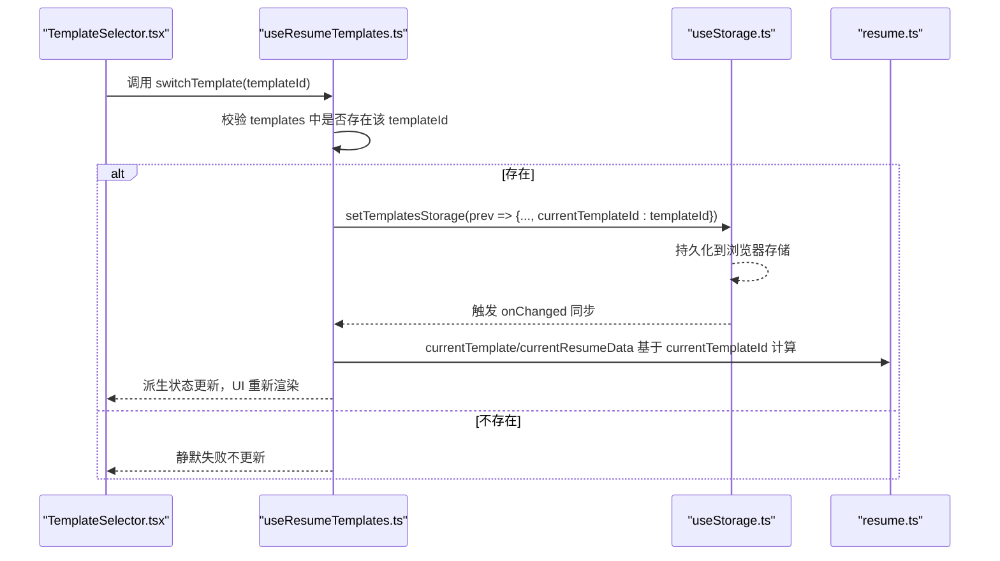
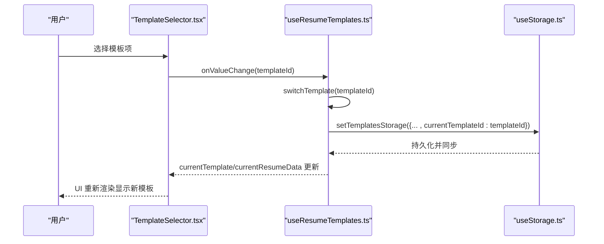
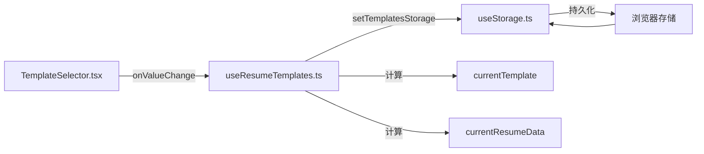

# switchTemplate 方法

<cite>
**本文引用的文件**
- [useResumeTemplates.ts](file://src/hooks/useResumeTemplates.ts)
- [useStorage.ts](file://src/hooks/useStorage.ts)
- [TemplateSelector.tsx](file://src/components/common/TemplateSelector.tsx)
- [FloatingPanel.tsx](file://src/components/floating/FloatingPanel.tsx)
- [popup.tsx](file://src/popup.tsx)
- [resume.ts](file://src/types/resume.ts)
</cite>

## 目录
1. [简介](#简介)
2. [项目结构](#项目结构)
3. [核心组件](#核心组件)
4. [架构总览](#架构总览)
5. [详细组件分析](#详细组件分析)
6. [依赖关系分析](#依赖关系分析)
7. [性能考量](#性能考量)
8. [故障排查指南](#故障排查指南)
9. [结论](#结论)

## 简介
本篇文档聚焦于 useResumeTemplates Hook 中的 switchTemplate 方法，详细说明其职责、参数、行为与副作用，以及与状态持久化、派生状态联动的关系。重点包括：
- 参数类型与无返回值特性
- 仅在目标模板存在于模板列表时才切换
- 通过 setTemplatesStorage 更新 storage 中的 currentTemplateId 字段，从而驱动 UI 更新
- 在组件层的实际使用方式与边界情况处理建议

## 项目结构
围绕 switchTemplate 的相关代码分布在以下模块：
- Hook 层：useResumeTemplates.ts 提供模板管理与切换能力
- 存储层：useStorage.ts 提供浏览器扩展场景下的状态持久化
- 类型层：resume.ts 定义模板与存储结构
- 组件层：TemplateSelector.tsx、FloatingPanel.tsx、popup.tsx 展示了如何在 UI 中调用 switchTemplate

图表来源
- [useResumeTemplates.ts](file://src/hooks/useResumeTemplates.ts#L1-L234)
- [useStorage.ts](file://src/hooks/useStorage.ts#L1-L88)
- [resume.ts](file://src/types/resume.ts#L165-L212)
- [TemplateSelector.tsx](file://src/components/common/TemplateSelector.tsx#L190-L210)
- [FloatingPanel.tsx](file://src/components/floating/FloatingPanel.tsx#L336-L350)
- [popup.tsx](file://src/popup.tsx#L197-L214)

章节来源
- [useResumeTemplates.ts](file://src/hooks/useResumeTemplates.ts#L1-L234)
- [useStorage.ts](file://src/hooks/useStorage.ts#L1-L88)
- [resume.ts](file://src/types/resume.ts#L165-L212)
- [TemplateSelector.tsx](file://src/components/common/TemplateSelector.tsx#L190-L210)
- [FloatingPanel.tsx](file://src/components/floating/FloatingPanel.tsx#L336-L350)
- [popup.tsx](file://src/popup.tsx#L197-L214)

## 核心组件
- useResumeTemplates
  - 提供模板列表、当前模板、当前模板对应的简历数据等状态
  - 提供 switchTemplate、addTemplate、renameTemplate、deleteTemplate、duplicateTemplate、updateCurrentResumeData 等操作
  - 通过 useStorage 持久化模板存储结构（包含 templates 与 currentTemplateId）

- useStorage
  - 读取/写入浏览器扩展存储（Chrome storage 或开发环境降级到 localStorage）
  - 返回 [value, updateValue, isLoading]，其中 updateValue 即 setTemplatesStorage

- 类型定义
  - ResumeTemplatesStorage：包含 templates 与 currentTemplateId
  - ResumeTemplate：包含 id、name、data、createdAt、updatedAt

章节来源
- [useResumeTemplates.ts](file://src/hooks/useResumeTemplates.ts#L1-L234)
- [useStorage.ts](file://src/hooks/useStorage.ts#L1-L88)
- [resume.ts](file://src/types/resume.ts#L165-L212)

## 架构总览
switchTemplate 的调用链路如下：
- 组件层通过 TemplateSelector 的 Select 组件触发 onValueChange
- onSwitch 接收 templateId 并调用 switchTemplate
- switchTemplate 校验模板是否存在，存在则通过 setTemplatesStorage 更新 currentTemplateId
- useStorage 将变更持久化到浏览器存储并触发其他实例同步
- 派生状态 currentTemplate 与 currentResumeData 基于 currentTemplateId 计算，从而驱动 UI 更新

图表来源
- [TemplateSelector.tsx](file://src/components/common/TemplateSelector.tsx#L190-L210)
- [useResumeTemplates.ts](file://src/hooks/useResumeTemplates.ts#L94-L105)
- [useStorage.ts](file://src/hooks/useStorage.ts#L61-L88)
- [resume.ts](file://src/types/resume.ts#L165-L212)

## 详细组件分析

### switchTemplate 方法 API 文档
- 方法签名
  - 名称：switchTemplate
  - 参数：templateId: string
  - 返回值：void
- 功能概述
  - 根据传入的 templateId 切换当前激活的简历模板
  - 仅当目标模板存在于模板列表 templates 中时才执行切换
- 行为细节
  - 校验：遍历 templates，若存在匹配的 id，则继续；否则直接返回（静默失败）
  - 更新：通过 setTemplatesStorage 将 currentTemplateId 设为 templateId
  - 持久化：setTemplatesStorage 内部异步写入浏览器存储
  - UI 更新：由于 currentTemplateId 变更，currentTemplate 与 currentResumeData 重新计算，触发组件重渲染
- 参数类型
  - templateId: string（模板唯一标识符）
- 边界情况
  - 传入无效 ID（不在 templates 中）：方法静默失败，不更新 currentTemplateId
  - 传入空字符串或非字符串类型：按字符串比较，不会命中任何模板，静默失败
- 依赖与联动
  - 依赖 useStorage 提供的 setTemplatesStorage 进行状态持久化
  - 与派生状态 currentTemplate、currentResumeData 联动，间接影响表单渲染与导出等 UI

章节来源
- [useResumeTemplates.ts](file://src/hooks/useResumeTemplates.ts#L94-L105)
- [useStorage.ts](file://src/hooks/useStorage.ts#L61-L88)
- [resume.ts](file://src/types/resume.ts#L165-L212)

### 调用流程与 UI 集成
- 组件层集成点
  - TemplateSelector.tsx：Select 的 onValueChange 事件绑定到 onSwitch，onSwitch 即 useResumeTemplates 的 switchTemplate
  - FloatingPanel.tsx 与 popup.tsx：在模板选择器中直接注入 onSwitch={switchTemplate}
- 典型调用路径
  - 用户在下拉框中选择某个模板项
  - onValueChange 回调被触发，传入所选模板的 id
  - switchTemplate 校验后更新 currentTemplateId，随后 UI 重新渲染

图表来源
- [TemplateSelector.tsx](file://src/components/common/TemplateSelector.tsx#L190-L210)
- [useResumeTemplates.ts](file://src/hooks/useResumeTemplates.ts#L94-L105)
- [useStorage.ts](file://src/hooks/useStorage.ts#L61-L88)

章节来源
- [TemplateSelector.tsx](file://src/components/common/TemplateSelector.tsx#L190-L210)
- [FloatingPanel.tsx](file://src/components/floating/FloatingPanel.tsx#L336-L350)
- [popup.tsx](file://src/popup.tsx#L197-L214)

### 错误处理与边界情况
- 无效 ID
  - 若传入的 templateId 不存在于 templates 中，switchTemplate 不会更新 currentTemplateId，也不会抛错
  - 建议：在调用前确保传入的 ID 来自受控的数据源（如模板列表）
- 空 ID 或类型错误
  - 传入空字符串或非字符串类型时，不会命中任何模板，行为同上
- 并发与同步
  - setTemplatesStorage 内部异步写入存储，其他实例通过 onChanged 监听同步
  - 在极短时间内多次调用可能导致短暂的竞态，但最终状态一致

章节来源
- [useResumeTemplates.ts](file://src/hooks/useResumeTemplates.ts#L94-L105)
- [useStorage.ts](file://src/hooks/useStorage.ts#L12-L59)

## 依赖关系分析
- 组件耦合
  - TemplateSelector 与 useResumeTemplates 强耦合：通过 onSwitch 注入 switchTemplate
  - FloatingPanel 与 popup 作为容器组件，统一注入 useResumeTemplates 的状态与操作
- 数据流
  - 输入：templates、currentTemplateId
  - 输出：currentTemplate、currentResumeData
  - 控制：switchTemplate 更新 currentTemplateId，进而影响派生状态
- 外部依赖
  - 浏览器存储（Chrome storage/localStorage），由 useStorage 抽象封装

图表来源
- [TemplateSelector.tsx](file://src/components/common/TemplateSelector.tsx#L190-L210)
- [useResumeTemplates.ts](file://src/hooks/useResumeTemplates.ts#L82-L105)
- [useStorage.ts](file://src/hooks/useStorage.ts#L12-L59)

章节来源
- [TemplateSelector.tsx](file://src/components/common/TemplateSelector.tsx#L190-L210)
- [useResumeTemplates.ts](file://src/hooks/useResumeTemplates.ts#L82-L105)
- [useStorage.ts](file://src/hooks/useStorage.ts#L12-L59)

## 性能考量
- 校验成本
  - switchTemplate 使用 some 遍历 templates 进行存在性校验，时间复杂度 O(n)
  - n 通常较小（模板数量有限），开销可忽略
- 更新粒度
  - 仅更新 currentTemplateId，避免不必要的深层拷贝
- 持久化策略
  - useStorage 异步写入，避免阻塞主线程
- 派生状态
  - currentTemplate 与 currentResumeData 通过 useMemo 缓存，减少重复计算

章节来源
- [useResumeTemplates.ts](file://src/hooks/useResumeTemplates.ts#L82-L105)
- [useStorage.ts](file://src/hooks/useStorage.ts#L61-L88)

## 故障排查指南
- 问题：切换无效
  - 检查传入的 templateId 是否来自 templates 列表
  - 确认组件是否正确将 onValueChange 绑定到 onSwitch
- 问题：UI 未刷新
  - 确保组件订阅了 useResumeTemplates 返回的状态（如 currentTemplateId/currentResumeData）
  - 检查是否存在外部状态覆盖或条件渲染导致的重渲染延迟
- 问题：数据未持久化
  - 检查浏览器存储权限与可用性（开发环境降级到 localStorage）
  - 查看 useStorage 的错误日志输出

章节来源
- [TemplateSelector.tsx](file://src/components/common/TemplateSelector.tsx#L190-L210)
- [useResumeTemplates.ts](file://src/hooks/useResumeTemplates.ts#L82-L105)
- [useStorage.ts](file://src/hooks/useStorage.ts#L12-L59)

## 结论
switchTemplate 是一个轻量、安全且幂等的模板切换接口：
- 严格校验模板存在性，避免无效切换
- 通过 setTemplatesStorage 完成状态持久化与 UI 同步
- 与 currentTemplate、currentResumeData 等派生状态紧密联动，保证 UI 一致性
- 在组件层应确保传入的 templateId 来自受控数据源，以获得最佳体验