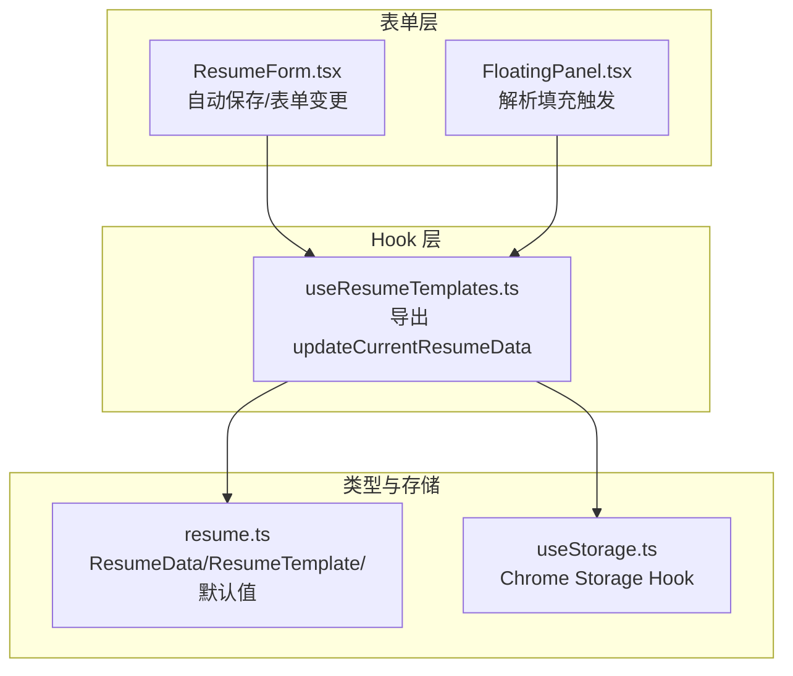
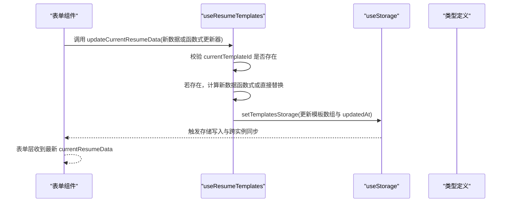
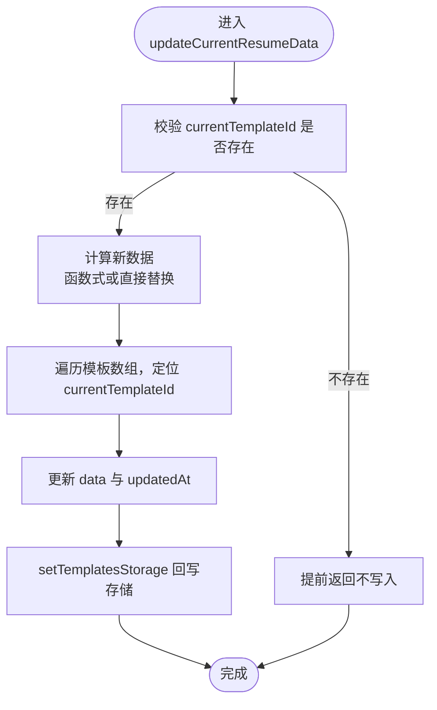
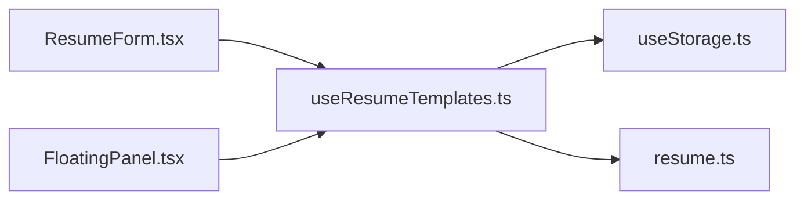

# updateCurrentResumeData 方法

<cite>
**本文引用的文件**
- [useResumeTemplates.ts](file://src/hooks/useResumeTemplates.ts)
- [ResumeForm.tsx](file://src/features/popup/ResumeForm.tsx)
- [FloatingPanel.tsx](file://src/components/floating/FloatingPanel.tsx)
- [resume.ts](file://src/types/resume.ts)
- [useStorage.ts](file://src/hooks/useStorage.ts)
</cite>

## 目录
1. [简介](#简介)
2. [项目结构](#项目结构)
3. [核心组件](#核心组件)
4. [架构总览](#架构总览)
5. [详细组件分析](#详细组件分析)
6. [依赖关系分析](#依赖关系分析)
7. [性能考量](#性能考量)
8. [故障排查指南](#故障排查指南)
9. [结论](#结论)

## 简介
本文件围绕 updateCurrentResumeData 方法进行深入文档化，说明其作为“当前激活模板中简历数据”的唯一持久化入口，如何通过函数式更新与对象替换两种方式更新模板数据，并在每次更新时同步刷新 updatedAt 时间戳。文档还解释了该方法对 currentTemplateId 的依赖与边界处理（当未选中模板时提前返回），以及在表单 onChange 场景下的典型调用方式与最佳实践。

## 项目结构
- updateCurrentResumeData 位于模板管理 Hook 中，负责对当前模板的数据进行更新。
- 表单层（弹窗与 Popup）通过 useResumeTemplates 获取 updateCurrentResumeData，并在用户输入、解析填充等场景触发持久化。
- 类型定义集中在 resume.ts，确保数据结构一致与默认值完备。
- 存储层由 useStorage 提供，负责浏览器本地存储与跨实例同步。

图表来源
- [useResumeTemplates.ts](file://src/hooks/useResumeTemplates.ts#L170-L192)
- [ResumeForm.tsx](file://src/features/popup/ResumeForm.tsx#L274-L283)
- [FloatingPanel.tsx](file://src/components/floating/FloatingPanel.tsx#L210-L216)
- [resume.ts](file://src/types/resume.ts#L86-L135)
- [useStorage.ts](file://src/hooks/useStorage.ts#L1-L88)

章节来源
- [useResumeTemplates.ts](file://src/hooks/useResumeTemplates.ts#L170-L192)
- [ResumeForm.tsx](file://src/features/popup/ResumeForm.tsx#L274-L283)
- [FloatingPanel.tsx](file://src/components/floating/FloatingPanel.tsx#L210-L216)
- [resume.ts](file://src/types/resume.ts#L86-L135)
- [useStorage.ts](file://src/hooks/useStorage.ts#L1-L88)

## 核心组件
- updateCurrentResumeData：接收两种参数形式：
  - 直接传入新的 ResumeData 对象，用于整体替换当前模板的数据。
  - 传入一个函数式更新器，形如(prev) => 新数据，用于基于旧数据派生新数据。
- 依赖 currentTemplateId：仅当存在当前模板 ID 时才执行更新；否则提前返回，避免错误写入。
- 更新策略：通过 map 遍历模板数组，定位 currentTemplateId 对应的模板，更新其 data 字段与 updatedAt 时间戳，然后整体回写模板存储。

章节来源
- [useResumeTemplates.ts](file://src/hooks/useResumeTemplates.ts#L170-L192)

## 架构总览
updateCurrentResumeData 在模板管理 Hook 中承担“数据写入中枢”的角色，向上游表单层暴露统一的更新接口，向下依赖存储 Hook 将变更持久化到浏览器本地存储。

图表来源
- [useResumeTemplates.ts](file://src/hooks/useResumeTemplates.ts#L170-L192)
- [useStorage.ts](file://src/hooks/useStorage.ts#L61-L88)
- [resume.ts](file://src/types/resume.ts#L86-L135)

## 详细组件分析

### 方法签名与行为
- 参数支持两种形式：
  - ResumeData：直接替换当前模板数据。
  - (prev: ResumeData) => ResumeData：基于旧数据派生新数据，便于链式更新与并发安全。
- 边界处理：
  - 若 currentTemplateId 不存在，立即返回，不进行任何写入。
- 更新细节：
  - 使用 map 定位 currentTemplateId 对应模板，更新 data 字段与 updatedAt。
  - 通过 setTemplatesStorage 回写整个模板存储对象，确保状态一致性。

章节来源
- [useResumeTemplates.ts](file://src/hooks/useResumeTemplates.ts#L170-L192)

### 数据流与持久化
- 表单层在用户输入或解析填充时调用 updateCurrentResumeData，随后通过 useResumeTemplates 的 currentResumeData 派发给各表单项，形成闭环。
- 存储层通过 useStorage 将模板存储写入浏览器本地存储，并监听其他实例的变更以保持同步。

图表来源
- [useResumeTemplates.ts](file://src/hooks/useResumeTemplates.ts#L170-L192)
- [useStorage.ts](file://src/hooks/useStorage.ts#L61-L88)

### 典型调用场景

- 表单 onChange 自动保存
  - 在表单组件中，用户输入触发 setFormData 后，通过定时器在短时间内自动调用 updateCurrentResumeData(formData)，实现“所见即所得”的持久化。
  - 示例路径参考：[自动保存逻辑](file://src/features/popup/ResumeForm.tsx#L274-L283)

- 解析填充后写入
  - 解析外部简历数据后，将解析结果转换为 ResumeData 并调用 updateCurrentResumeData，实现一键填充。
  - 示例路径参考：[解析填充调用](file://src/components/floating/FloatingPanel.tsx#L210-L216)

- 函数式更新
  - 当需要基于旧数据派生新数据时，传入函数式更新器，确保并发安全与一致性。
  - 示例路径参考：[函数式更新器用法](file://src/hooks/useResumeTemplates.ts#L170-L192)

章节来源
- [ResumeForm.tsx](file://src/features/popup/ResumeForm.tsx#L274-L283)
- [FloatingPanel.tsx](file://src/components/floating/FloatingPanel.tsx#L210-L216)
- [useResumeTemplates.ts](file://src/hooks/useResumeTemplates.ts#L170-L192)

### 类型与默认值保障
- ResumeData 与 ResumeTemplate 的完整字段定义，确保 updateCurrentResumeData 写入的数据结构稳定。
- defaultResumeData 与 createDefaultTemplate 提供默认值，保证首次使用与迁移场景的数据完整性。

章节来源
- [resume.ts](file://src/types/resume.ts#L86-L135)
- [resume.ts](file://src/types/resume.ts#L164-L211)

## 依赖关系分析
- 对外依赖
  - useResumeTemplates 返回的 currentTemplateId 与 setTemplatesStorage，决定是否执行更新与如何回写存储。
- 对内依赖
  - 类型定义 resume.ts，确保数据结构与默认值一致。
  - 存储钩子 useStorage，负责实际的本地存储写入与跨实例同步。

图表来源
- [useResumeTemplates.ts](file://src/hooks/useResumeTemplates.ts#L170-L192)
- [useStorage.ts](file://src/hooks/useStorage.ts#L1-L88)
- [resume.ts](file://src/types/resume.ts#L86-L135)
- [ResumeForm.tsx](file://src/features/popup/ResumeForm.tsx#L274-L283)
- [FloatingPanel.tsx](file://src/components/floating/FloatingPanel.tsx#L210-L216)

## 性能考量
- 函数式更新器的优势：避免重复深拷贝，减少不必要的渲染与存储写入；在高频输入场景下更高效。
- 批量更新建议：在短时间内多次输入时，利用表单层的防抖/节流策略（如自动保存定时器）合并多次写入，降低存储压力。
- 模板数组 map 的复杂度：O(n)，n 为模板数量；通常模板数较少，影响可忽略。

## 故障排查指南
- 问题：调用 updateCurrentResumeData 后未生效
  - 排查点：
    - currentTemplateId 是否为空：若为空，方法会提前返回，不会写入。
    - 存储写入是否成功：检查 useStorage 的写入日志与异常处理。
  - 参考路径：
    - [updateCurrentResumeData 边界处理](file://src/hooks/useResumeTemplates.ts#L170-L175)
    - [useStorage 写入实现](file://src/hooks/useStorage.ts#L61-L88)

- 问题：并发更新导致数据丢失
  - 建议使用函数式更新器，基于旧数据派生新数据，避免竞态条件。
  - 参考路径：
    - [函数式更新器用法](file://src/hooks/useResumeTemplates.ts#L170-L192)

- 问题：表单未显示最新数据
  - 确认表单层是否订阅 useResumeTemplates 的 currentResumeData，并在模板切换或更新后重新加载。
  - 参考路径：
    - [表单层加载 currentResumeData](file://src/features/popup/ResumeForm.tsx#L253-L271)

章节来源
- [useResumeTemplates.ts](file://src/hooks/useResumeTemplates.ts#L170-L192)
- [useStorage.ts](file://src/hooks/useStorage.ts#L61-L88)
- [ResumeForm.tsx](file://src/features/popup/ResumeForm.tsx#L253-L271)

## 结论
updateCurrentResumeData 是简历表单数据持久化的关键入口，具备以下特性：
- 支持直接替换与函数式更新两种模式，满足不同场景需求。
- 严格依赖 currentTemplateId，未选中模板时安全地提前返回，避免错误写入。
- 每次更新都会刷新 updatedAt，便于后续排序、筛选与版本追踪。
- 在表单 onChange、解析填充等场景中被广泛使用，是连接 UI 与存储的桥梁。