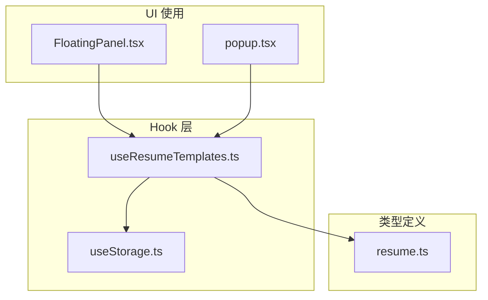
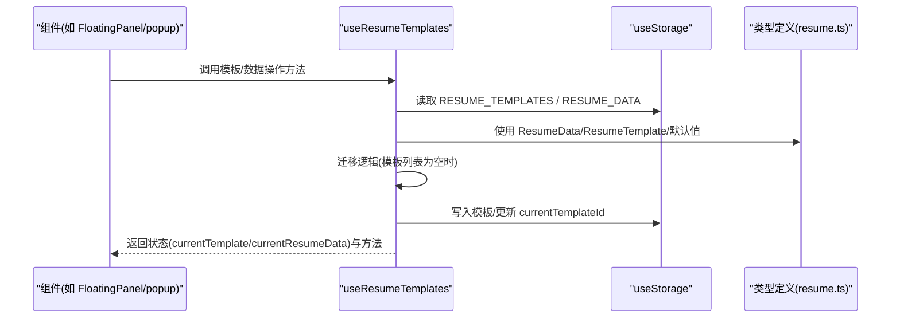
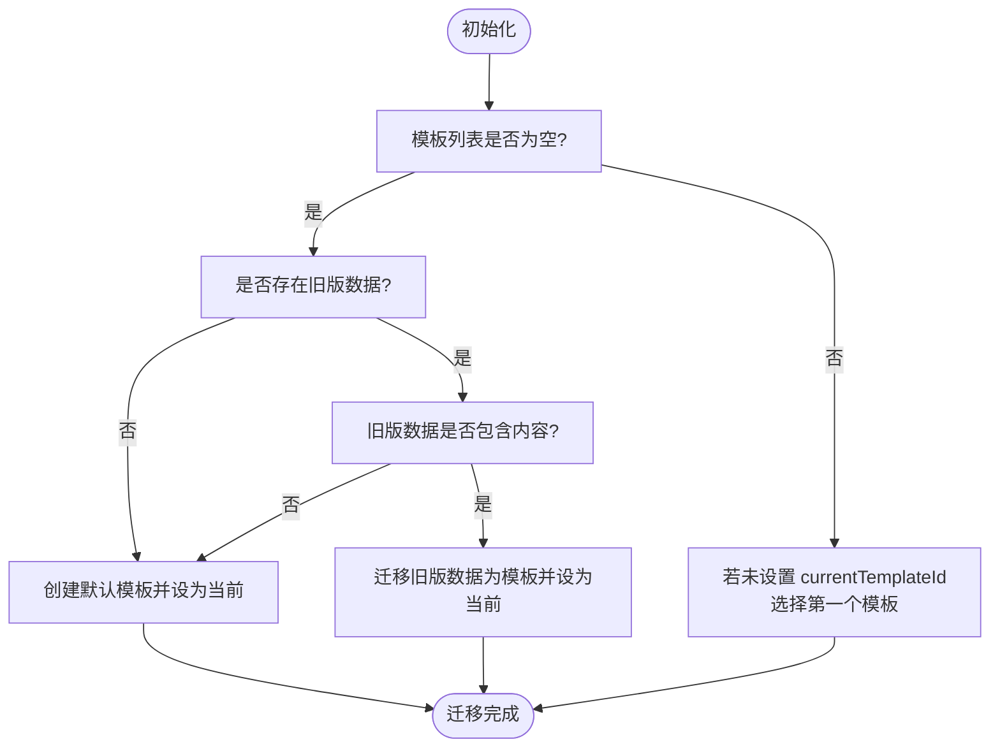
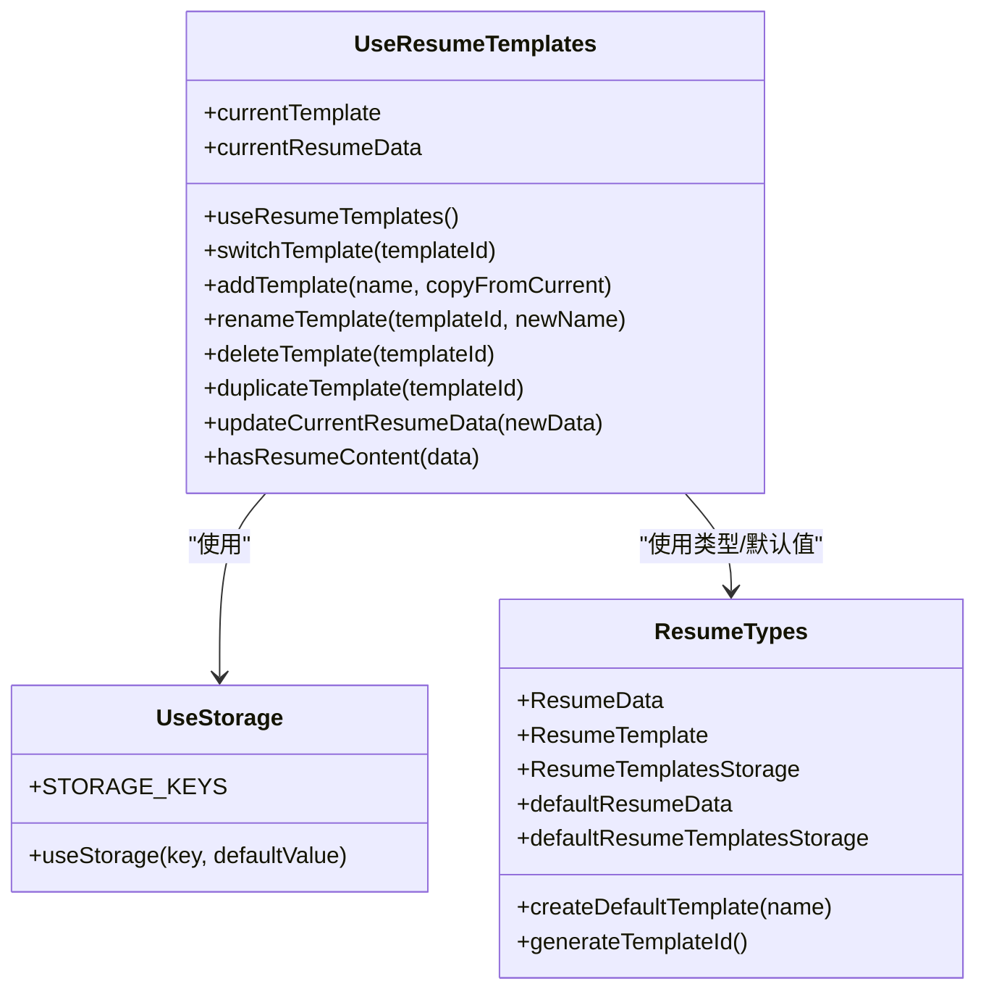

# useResumeTemplates Hook

<cite>
**本文引用的文件**
- [useResumeTemplates.ts](file://src/hooks/useResumeTemplates.ts)
- [useStorage.ts](file://src/hooks/useStorage.ts)
- [resume.ts](file://src/types/resume.ts)
- [FloatingPanel.tsx](file://src/components/floating/FloatingPanel.tsx)
- [popup.tsx](file://src/popup.tsx)
</cite>

## 目录
1. [简介](#简介)
2. [项目结构](#项目结构)
3. [核心组件](#核心组件)
4. [架构总览](#架构总览)
5. [详细组件分析](#详细组件分析)
6. [依赖关系分析](#依赖关系分析)
7. [性能考量](#性能考量)
8. [故障排查指南](#故障排查指南)
9. [结论](#结论)
10. [附录](#附录)

## 简介
本文件为 useResumeTemplates Hook 的全面 API 文档，聚焦简历模板管理系统的实现与使用。该 Hook 基于 useStorage 提供数据持久化，围绕 STORAGE_KEYS.RESUME_TEMPLATES 与 STORAGE_KEYS.RESUME_DATA 两个键位进行模板与旧版简历数据的读写；同时提供模板的增删改查与当前简历数据的更新能力，并内置数据迁移逻辑，将旧版 resumeData 无缝迁移到新的模板系统。

## 项目结构
- useResumeTemplates.ts：模板管理核心逻辑，包含模板 CRUD、当前模板与当前简历数据的派生状态、迁移逻辑与数据更新。
- useStorage.ts：通用 Chrome 扩展存储 Hook，封装本地存储读取、写入与跨实例同步。
- resume.ts：简历数据与模板的数据结构定义、默认值与工具函数。
- 组件使用示例：
  - FloatingPanel.tsx：悬浮面板中通过 TemplateSelector 使用模板管理能力。
  - popup.tsx：弹窗页面直接注入 useResumeTemplates 并调用模板与数据更新方法。

图表来源
- [useResumeTemplates.ts](file://src/hooks/useResumeTemplates.ts#L1-L258)
- [useStorage.ts](file://src/hooks/useStorage.ts#L1-L102)
- [resume.ts](file://src/types/resume.ts#L1-L212)
- [FloatingPanel.tsx](file://src/components/floating/FloatingPanel.tsx#L322-L353)
- [popup.tsx](file://src/popup.tsx#L133-L241)

章节来源
- [useResumeTemplates.ts](file://src/hooks/useResumeTemplates.ts#L1-L258)
- [useStorage.ts](file://src/hooks/useStorage.ts#L1-L102)
- [resume.ts](file://src/types/resume.ts#L1-L212)
- [FloatingPanel.tsx](file://src/components/floating/FloatingPanel.tsx#L322-L353)
- [popup.tsx](file://src/popup.tsx#L133-L241)

## 核心组件
- 模板存储与旧版数据存储
  - 使用 useStorage 读取/写入 STORAGE_KEYS.RESUME_TEMPLATES 与 STORAGE_KEYS.RESUME_DATA。
  - 模板存储结构为 ResumeTemplatesStorage，包含 templates 数组与 currentTemplateId。
  - 旧版数据结构为 ResumeData 或 null，用于迁移检测。
- 计算状态
  - currentTemplate：根据 currentTemplateId 在 templates 中查找当前模板。
  - currentResumeData：当前模板的 data，若无则回退到 defaultResumeData。
- 迁移逻辑
  - 首次加载且模板列表为空时，检查 legacyResumeData 是否存在有效内容，若有则迁移为首个模板并设置为当前模板；否则创建默认模板并设为当前模板。
  - 若仅有模板但未设置 currentTemplateId，则自动选择第一个模板作为当前模板。
- 方法集合
  - switchTemplate(templateId)
  - addTemplate(name, copyFromCurrent?)
  - renameTemplate(templateId, newName)
  - deleteTemplate(templateId)
  - duplicateTemplate(templateId)
  - updateCurrentResumeData(newData | updaterFn)

章节来源
- [useResumeTemplates.ts](file://src/hooks/useResumeTemplates.ts#L18-L234)
- [resume.ts](file://src/types/resume.ts#L164-L211)

## 架构总览
useResumeTemplates 通过 useStorage 将模板与旧版数据持久化到浏览器存储，内部维护模板列表与当前模板 ID，并基于 useMemo 派生 currentTemplate 与 currentResumeData。迁移逻辑在首次加载完成时执行，确保用户首次使用时拥有可用的模板与数据。

图表来源
- [useResumeTemplates.ts](file://src/hooks/useResumeTemplates.ts#L18-L234)
- [useStorage.ts](file://src/hooks/useStorage.ts#L1-L102)
- [resume.ts](file://src/types/resume.ts#L1-L212)

## 详细组件分析

### 数据持久化与键位
- 键位定义
  - STORAGE_KEYS.RESUME_TEMPLATES：模板存储键。
  - STORAGE_KEYS.RESUME_DATA：旧版简历数据键。
- useStorage 行为
  - 初始化时从 chrome.storage.local 或开发环境降级到 localStorage 读取对应键值。
  - 监听 chrome.storage.onChanged，实现多实例间同步。
  - updateValue 支持传入函数或值，异步写入对应键位。

章节来源
- [useStorage.ts](file://src/hooks/useStorage.ts#L1-L102)
- [useResumeTemplates.ts](file://src/hooks/useResumeTemplates.ts#L18-L34)

### 迁移逻辑与 hasResumeContent
- 迁移触发条件
  - 模板列表为空且旧版数据存在且非空时，将旧版数据包装为首个模板并设为当前模板。
  - 否则创建默认模板并设为当前模板。
- hasResumeContent 判断标准
  - 个人信息任一字段非空即视为有内容。
  - 其他字段：自述、教育、工作、项目、技能、语言、自定义字段任一非空即视为有内容。
- 边界处理
  - 模板列表为空时才进行迁移检查，避免覆盖已有模板。
  - 迁移完成后标记 migrationChecked，防止重复迁移。

图表来源
- [useResumeTemplates.ts](file://src/hooks/useResumeTemplates.ts#L35-L74)
- [useResumeTemplates.ts](file://src/hooks/useResumeTemplates.ts#L236-L256)

章节来源
- [useResumeTemplates.ts](file://src/hooks/useResumeTemplates.ts#L35-L74)
- [useResumeTemplates.ts](file://src/hooks/useResumeTemplates.ts#L236-L256)

### 计算状态 currentTemplate 与 currentResumeData
- currentTemplate：根据 currentTemplateId 在 templates 中查找匹配项。
- currentResumeData：若存在当前模板则返回其 data，否则回退到 defaultResumeData。
- 两者均通过 useMemo 缓存，依赖相应输入稳定，避免不必要重渲染。

章节来源
- [useResumeTemplates.ts](file://src/hooks/useResumeTemplates.ts#L82-L92)
- [resume.ts](file://src/types/resume.ts#L104-L135)

### 方法详解

#### switchTemplate(templateId)
- 参数
  - templateId: string
- 返回值
  - 无
- 副作用
  - 若模板列表包含该 ID，则更新 currentTemplateId。
- 边界条件
  - 若模板列表不含该 ID，则不更新。
- 使用场景
  - 用户在模板选择器中切换模板。

章节来源
- [useResumeTemplates.ts](file://src/hooks/useResumeTemplates.ts#L94-L105)

#### addTemplate(name, copyFromCurrent?)
- 参数
  - name: string
  - copyFromCurrent?: boolean（可选，默认 false）
- 返回值
  - 新模板的 id: string
- 副作用
  - 新建模板并加入 templates，同时将 currentTemplateId 设为新模板。
  - 若 copyFromCurrent 为 true 且存在当前模板，则复制其 data；否则复制 defaultResumeData。
- 边界条件
  - 无显式失败返回，始终返回新模板 id。
- 使用场景
  - 用户新增模板，支持从当前模板复制数据。

章节来源
- [useResumeTemplates.ts](file://src/hooks/useResumeTemplates.ts#L108-L128)
- [resume.ts](file://src/types/resume.ts#L186-L202)

#### renameTemplate(templateId, newName)
- 参数
  - templateId: string
  - newName: string
- 返回值
  - 无
- 副作用
  - 更新指定模板的名称与 updatedAt 时间戳。
- 边界条件
  - 若模板不存在，不更新。
- 使用场景
  - 用户修改模板名称。

章节来源
- [useResumeTemplates.ts](file://src/hooks/useResumeTemplates.ts#L131-L143)

#### deleteTemplate(templateId)
- 参数
  - templateId: string
- 返回值
  - boolean：若成功删除返回 true，否则返回 false。
- 副作用
  - 删除模板后，若被删除的是当前模板，则自动选择第一个模板作为新的当前模板；若模板列表仅剩一个则拒绝删除并返回 false。
- 边界条件
  - 模板数量小于等于 1 时保护性返回 false。
- 使用场景
  - 用户删除不需要的模板。

章节来源
- [useResumeTemplates.ts](file://src/hooks/useResumeTemplates.ts#L146-L168)

#### duplicateTemplate(templateId)
- 参数
  - templateId: string
- 返回值
  - 新模板的 id: string | null（若找不到模板则返回 null）
- 副作用
  - 复制目标模板的 data 与元信息，生成新模板并加入 templates，同时将 currentTemplateId 设为新模板。
- 边界条件
  - 若模板不存在，返回 null。
- 使用场景
  - 快速克隆现有模板。

章节来源
- [useResumeTemplates.ts](file://src/hooks/useResumeTemplates.ts#L195-L216)

#### updateCurrentResumeData(newData | updaterFn)
- 参数
  - newData: ResumeData | ((prev: ResumeData) => ResumeData)
- 返回值
  - 无
- 副作用
  - 更新当前模板的 data；若传入函数则以函数形式应用；同时更新 updatedAt。
- 边界条件
  - 若尚未设置 currentTemplateId，则直接返回不更新。
- 使用场景
  - 用户编辑简历表单时实时更新当前模板数据。

章节来源
- [useResumeTemplates.ts](file://src/hooks/useResumeTemplates.ts#L171-L191)

### 在组件中的使用示例路径
- 悬浮面板 TemplateSelector 使用模板管理能力
  - 通过 props 接收 templates、currentTemplateId，并绑定 onSwitch、onAdd、onRename、onDelete、onDuplicate 回调。
  - 参考路径：[FloatingPanel.tsx](file://src/components/floating/FloatingPanel.tsx#L322-L353)
- 弹窗页面直接注入 useResumeTemplates
  - 解构出 templates、currentTemplateId、currentResumeData 与各操作方法。
  - 示例：[popup.tsx](file://src/popup.tsx#L133-L241)

章节来源
- [FloatingPanel.tsx](file://src/components/floating/FloatingPanel.tsx#L322-L353)
- [popup.tsx](file://src/popup.tsx#L133-L241)

## 依赖关系分析

图表来源
- [useResumeTemplates.ts](file://src/hooks/useResumeTemplates.ts#L1-L258)
- [useStorage.ts](file://src/hooks/useStorage.ts#L1-L102)
- [resume.ts](file://src/types/resume.ts#L1-L212)

章节来源
- [useResumeTemplates.ts](file://src/hooks/useResumeTemplates.ts#L1-L258)
- [useStorage.ts](file://src/hooks/useStorage.ts#L1-L102)
- [resume.ts](file://src/types/resume.ts#L1-L212)

## 性能考量
- useMemo 派生状态
  - currentTemplate 与 currentResumeData 使用 useMemo 缓存，减少不必要的重渲染。
- useCallback 包装方法
  - 所有公开方法均使用 useCallback，确保在父组件传递回调时保持引用稳定。
- 迁移逻辑
  - 仅在模板列表为空且旧版数据存在时执行一次迁移，避免重复开销。
- 存储层
  - useStorage 对 chrome.storage.onChanged 的监听仅在存在 chrome 环境时启用，开发环境降级到 localStorage，保证跨环境一致性。

章节来源
- [useResumeTemplates.ts](file://src/hooks/useResumeTemplates.ts#L82-L92)
- [useResumeTemplates.ts](file://src/hooks/useResumeTemplates.ts#L94-L216)
- [useStorage.ts](file://src/hooks/useStorage.ts#L43-L59)

## 故障排查指南
- 模板无法切换
  - 检查 templates 中是否存在该 templateId；若不存在则不会更新 currentTemplateId。
  - 参考：[switchTemplate](file://src/hooks/useResumeTemplates.ts#L94-L105)
- 删除失败返回 false
  - 当模板数量小于等于 1 时会保护性返回 false；请先添加新模板再删除。
  - 参考：[deleteTemplate](file://src/hooks/useResumeTemplates.ts#L146-L168)
- 迁移未生效
  - 确认模板列表是否为空且旧版数据存在且 hasResumeContent 为真；否则会创建默认模板而非迁移。
  - 参考：[迁移逻辑](file://src/hooks/useResumeTemplates.ts#L35-L74)，[hasResumeContent](file://src/hooks/useResumeTemplates.ts#L236-L256)
- 当前数据未更新
  - 若 currentTemplateId 未设置，updateCurrentResumeData 将直接返回不更新。
  - 参考：[updateCurrentResumeData](file://src/hooks/useResumeTemplates.ts#L171-L191)
- 存储异常
  - 开发环境可能降级到 localStorage；若出现异常，检查浏览器存储权限与容量限制。
  - 参考：[useStorage](file://src/hooks/useStorage.ts#L1-L39)

章节来源
- [useResumeTemplates.ts](file://src/hooks/useResumeTemplates.ts#L94-L191)
- [useResumeTemplates.ts](file://src/hooks/useResumeTemplates.ts#L236-L256)
- [useStorage.ts](file://src/hooks/useStorage.ts#L1-L39)

## 结论
useResumeTemplates 通过 useStorage 实现了模板与旧版数据的持久化与迁移，提供了完善的模板 CRUD 与当前数据更新能力，并以 useMemo 与 useCallback 保障性能与稳定性。其设计兼顾易用性与健壮性，适合在扩展的多种界面中复用。

## 附录

### API 摘要
- 状态
  - isLoading: boolean
  - templates: ResumeTemplate[]
  - currentTemplateId: string
  - currentTemplate: ResumeTemplate | undefined
  - currentResumeData: ResumeData
- 方法
  - switchTemplate(templateId: string): void
  - addTemplate(name: string, copyFromCurrent?: boolean): string
  - renameTemplate(templateId: string, newName: string): void
  - deleteTemplate(templateId: string): boolean
  - duplicateTemplate(templateId: string): string | null
  - updateCurrentResumeData(newData: ResumeData | ((prev: ResumeData) => ResumeData)): void

章节来源
- [useResumeTemplates.ts](file://src/hooks/useResumeTemplates.ts#L218-L234)