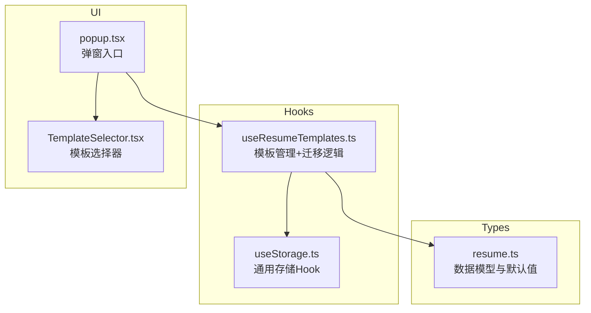
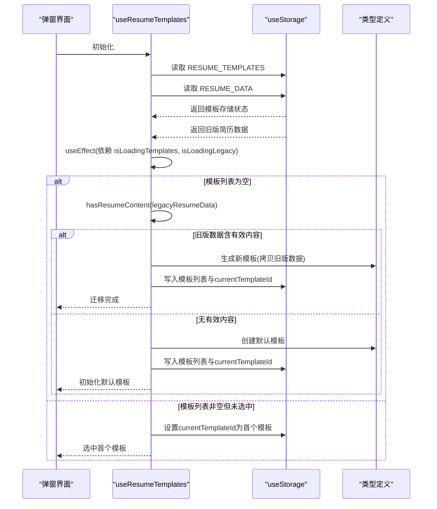
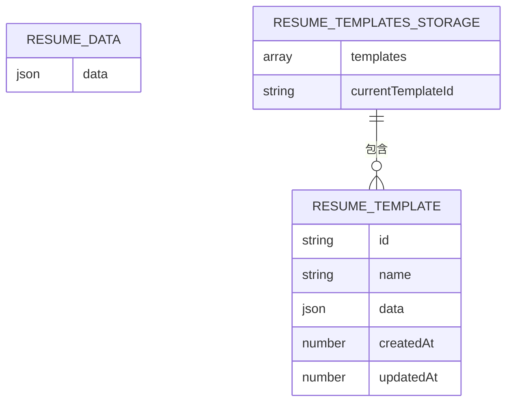
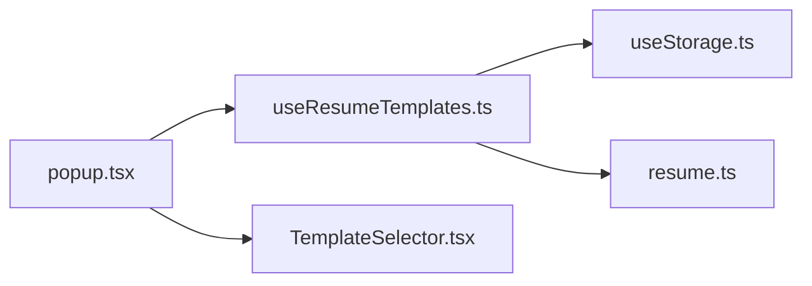

# 数据迁移机制

<cite>
**本文引用的文件**
- [useResumeTemplates.ts](file://src/hooks/useResumeTemplates.ts)
- [useStorage.ts](file://src/hooks/useStorage.ts)
- [resume.ts](file://src/types/resume.ts)
- [popup.tsx](file://src/popup.tsx)
- [TemplateSelector.tsx](file://src/components/common/TemplateSelector.tsx)
</cite>

## 目录
1. [简介](#简介)
2. [项目结构](#项目结构)
3. [核心组件](#核心组件)
4. [架构总览](#架构总览)
5. [详细组件分析](#详细组件分析)
6. [依赖关系分析](#依赖关系分析)
7. [性能考量](#性能考量)
8. [故障排查指南](#故障排查指南)
9. [结论](#结论)
10. [附录](#附录)

## 简介
本节聚焦于 useResumeTemplates 中的数据迁移逻辑，解释其如何兼容旧版简历存储结构（STORAGE_KEYS.RESUME_DATA），并在首次加载时自动检测并迁移旧数据到新的模板系统。文档将详细说明 useEffect 的依赖项 isLoadingTemplates 和 isLoadingLegacy 的作用、迁移触发条件与流程、hasResumeContent 的判断标准、迁移成功后的模板列表初始化与 currentTemplateId 设置，并提供迁移前后数据结构对比示例，最后给出对用户体验的透明性说明与开发者调试建议。

## 项目结构
围绕“数据迁移”的相关文件组织如下：
- hooks/useResumeTemplates.ts：实现模板管理与迁移逻辑
- hooks/useStorage.ts：通用存储 Hook，提供键名常量与异步读写
- types/resume.ts：定义 ResumeData、ResumeTemplate、ResumeTemplatesStorage 等类型及默认值
- features/popup/popup.tsx：弹窗入口，消费 useResumeTemplates 的状态与方法
- components/common/TemplateSelector.tsx：模板选择器 UI，展示模板列表与操作

图表来源
- [useResumeTemplates.ts](file://src/hooks/useResumeTemplates.ts#L1-L80)
- [useStorage.ts](file://src/hooks/useStorage.ts#L1-L102)
- [resume.ts](file://src/types/resume.ts#L86-L212)
- [popup.tsx](file://src/popup.tsx#L124-L170)
- [TemplateSelector.tsx](file://src/components/common/TemplateSelector.tsx#L1-L60)

章节来源
- [useResumeTemplates.ts](file://src/hooks/useResumeTemplates.ts#L1-L80)
- [useStorage.ts](file://src/hooks/useStorage.ts#L1-L102)
- [resume.ts](file://src/types/resume.ts#L86-L212)
- [popup.tsx](file://src/popup.tsx#L124-L170)
- [TemplateSelector.tsx](file://src/components/common/TemplateSelector.tsx#L1-L60)

## 核心组件
- useResumeTemplates：负责模板的增删改查、当前模板切换、迁移检查与初始化；其中迁移逻辑位于 useEffect 中，依赖 isLoadingTemplates 与 isLoadingLegacy，确保在旧版数据与新版模板均加载完成后再执行迁移。
- useStorage：提供键名常量 STORAGE_KEYS（RESUME_DATA、RESUME_TEMPLATES）与异步读取/写入能力；在迁移过程中分别读取旧版简历数据与新版模板存储。
- 类型系统：ResumeData 为旧版完整简历数据结构；ResumeTemplate 与 ResumeTemplatesStorage 为新版模板系统结构；defaultResumeTemplatesStorage 作为初始空模板存储。

章节来源
- [useResumeTemplates.ts](file://src/hooks/useResumeTemplates.ts#L1-L80)
- [useStorage.ts](file://src/hooks/useStorage.ts#L90-L102)
- [resume.ts](file://src/types/resume.ts#L86-L212)

## 架构总览
迁移流程在应用启动时自动执行，遵循以下步骤：
- 并行加载旧版简历数据（STORAGE_KEYS.RESUME_DATA）与新版模板存储（STORAGE_KEYS.RESUME_TEMPLATES）
- 在两个加载均完成且迁移未检查过的情况下，进入迁移分支
- 若新版模板列表为空，则检查旧版数据是否存在且包含有效内容
  - 若满足条件，将旧版 ResumeData 封装为单模板并设置为当前模板
  - 否则创建默认模板并设置为当前模板
- 若新版模板列表已有模板但未设置 currentTemplateId，则选中第一个模板
- 最终标记迁移检查完成，避免重复执行

图表来源
- [useResumeTemplates.ts](file://src/hooks/useResumeTemplates.ts#L18-L80)
- [useStorage.ts](file://src/hooks/useStorage.ts#L1-L88)
- [resume.ts](file://src/types/resume.ts#L165-L212)
- [popup.tsx](file://src/popup.tsx#L124-L170)

## 详细组件分析

### 迁移逻辑与依赖控制
- 依赖项：
  - isLoadingTemplates：新版模板存储加载状态
  - isLoadingLegacy：旧版简历数据加载状态
  - templatesStorage、legacyResumeData：实际数据
  - setTemplatesStorage：更新模板存储
- 控制流程：
  - 在任一加载进行中直接返回，避免竞态
  - 仅当模板列表为空时才触发迁移检查
  - 迁移完成后设置 migrationChecked，防止重复执行
  - 若模板列表已有但未设置 currentTemplateId，则选中第一个

章节来源
- [useResumeTemplates.ts](file://src/hooks/useResumeTemplates.ts#L18-L80)

### hasResumeContent 判断标准
- 个人信息字段：对 personalInfo 的所有值进行非空与去空白校验，任一字段非空即视为包含内容
- 其他字段：对 selfIntro、education、workExperience、projects、skills、languages、customFields 等进行长度或非空判断，任一满足即视为包含内容
- 结果：只要个人信息或其它任一部分存在有效内容，就认为有简历内容

章节来源
- [useResumeTemplates.ts](file://src/hooks/useResumeTemplates.ts#L236-L257)
- [resume.ts](file://src/types/resume.ts#L86-L100)

### 迁移成功后的模板初始化
- 封装策略：将旧版 ResumeData 直接作为新模板的 data 字段，生成唯一模板 ID，设置创建与更新时间
- 列表创建：创建单元素模板数组，并将 currentTemplateId 设为该模板 ID
- 用户体验：用户无需手动操作，即可在首次打开时看到迁移后的模板并开始编辑

章节来源
- [useResumeTemplates.ts](file://src/hooks/useResumeTemplates.ts#L35-L74)
- [resume.ts](file://src/types/resume.ts#L165-L181)

### 迁移前后数据结构对比
- 旧版（STORAGE_KEYS.RESUME_DATA）：
  - 结构：ResumeData（包含个人信息、求职期望、自我介绍、教育经历、工作/实习经历、项目经历、技能、语言能力、自定义字段）
- 新版（STORAGE_KEYS.RESUME_TEMPLATES）：
  - 结构：ResumeTemplatesStorage（包含 templates 数组与 currentTemplateId）
  - 每个模板：ResumeTemplate（包含 id、name、data、createdAt、updatedAt）

图表来源
- [resume.ts](file://src/types/resume.ts#L86-L181)

### 用户体验与调试建议
- 透明性：
  - 迁移过程对用户完全透明：无需额外操作，即可在首次打开时看到迁移后的模板
  - 若旧版数据为空或无有效内容，系统将创建默认模板，保证可用性
- 调试识别：
  - 控制台日志：迁移完成后会输出提示日志，便于确认迁移是否发生
  - loading 状态：弹窗界面会根据 isLoading 与模板列表状态显示加载提示
  - 模板选择器：若迁移成功，模板列表将出现单模板；若迁移失败（如旧版数据为空），将创建默认模板

章节来源
- [useResumeTemplates.ts](file://src/hooks/useResumeTemplates.ts#L35-L74)
- [popup.tsx](file://src/popup.tsx#L196-L214)
- [TemplateSelector.tsx](file://src/components/common/TemplateSelector.tsx#L190-L210)

## 依赖关系分析
- useResumeTemplates 依赖：
  - useStorage：读取旧版数据与新版模板存储
  - 类型系统：ResumeData、ResumeTemplate、ResumeTemplatesStorage、默认值与工具函数
- UI 层依赖：
  - popup.tsx：消费 useResumeTemplates 的状态与方法，渲染模板选择器与表单
  - TemplateSelector.tsx：展示模板列表并支持切换、添加、重命名、删除、复制

图表来源
- [popup.tsx](file://src/popup.tsx#L124-L170)
- [TemplateSelector.tsx](file://src/components/common/TemplateSelector.tsx#L1-L60)
- [useResumeTemplates.ts](file://src/hooks/useResumeTemplates.ts#L1-L80)
- [useStorage.ts](file://src/hooks/useStorage.ts#L1-L102)
- [resume.ts](file://src/types/resume.ts#L86-L212)

章节来源
- [popup.tsx](file://src/popup.tsx#L124-L170)
- [TemplateSelector.tsx](file://src/components/common/TemplateSelector.tsx#L1-L60)
- [useResumeTemplates.ts](file://src/hooks/useResumeTemplates.ts#L1-L80)
- [useStorage.ts](file://src/hooks/useStorage.ts#L1-L102)
- [resume.ts](file://src/types/resume.ts#L86-L212)

## 性能考量
- 并行加载：useStorage 对 RESUME_TEMPLATES 与 RESUME_DATA 的读取是并行的，减少首屏等待时间
- 条件迁移：仅在模板列表为空时才执行迁移，避免不必要的写入与重渲染
- 状态合并：isLoading = isLoadingTemplates || isLoadingLegacy || !migrationChecked，确保 UI 在迁移完成前保持加载态
- 一次性检查：migrationChecked 防止重复迁移，降低重复计算与存储写入成本

章节来源
- [useResumeTemplates.ts](file://src/hooks/useResumeTemplates.ts#L18-L34)
- [useStorage.ts](file://src/hooks/useStorage.ts#L1-L88)

## 故障排查指南
- 迁移未发生
  - 检查旧版数据是否存在且 hasResumeContent 返回真值
  - 确认模板列表为空（否则不会触发迁移）
  - 查看控制台日志是否输出迁移完成提示
- 模板未选中
  - 若模板列表非空但 currentTemplateId 为空，系统会自动选中第一个模板
- 旧版数据为空或无效
  - 系统将创建默认模板，确保可用性
- 调试技巧
  - 在弹窗界面观察加载状态与模板列表
  - 在浏览器扩展存储中查看 STORAGE_KEYS.RESUME_DATA 与 STORAGE_KEYS.RESUME_TEMPLATES 的值，确认迁移结果

章节来源
- [useResumeTemplates.ts](file://src/hooks/useResumeTemplates.ts#L35-L74)
- [useStorage.ts](file://src/hooks/useStorage.ts#L90-L102)
- [popup.tsx](file://src/popup.tsx#L196-L214)

## 结论
useResumeTemplates 的迁移机制通过并行加载与条件检查，实现了对旧版简历数据的无缝兼容。在首次加载时自动判断旧版数据的有效性，若存在有效内容则迁移为新模板，否则创建默认模板，确保用户体验的连续性与一致性。开发者可通过控制台日志与存储键值快速定位迁移状态，保障功能稳定性。

## 附录
- 键名常量参考
  - RESUME_DATA：旧版简历数据键
  - RESUME_TEMPLATES：新版模板存储键
- 关键路径参考
  - 迁移主流程：[useResumeTemplates.ts](file://src/hooks/useResumeTemplates.ts#L35-L74)
  - hasResumeContent 判断：[useResumeTemplates.ts](file://src/hooks/useResumeTemplates.ts#L236-L257)
  - 类型定义：[resume.ts](file://src/types/resume.ts#L86-L181)
  - 存储 Hook 与键名：[useStorage.ts](file://src/hooks/useStorage.ts#L90-L102)
  - UI 消费与展示：[popup.tsx](file://src/popup.tsx#L124-L170)、[TemplateSelector.tsx](file://src/components/common/TemplateSelector.tsx#L190-L210)