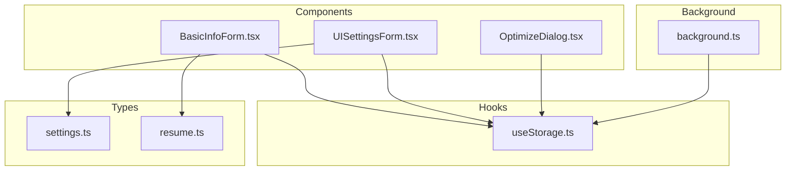
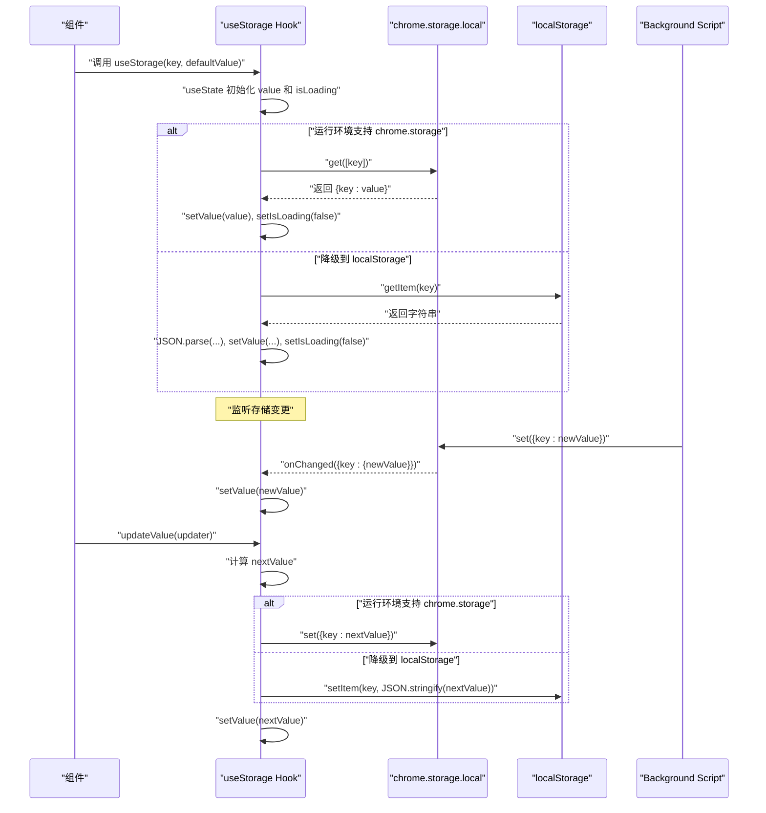
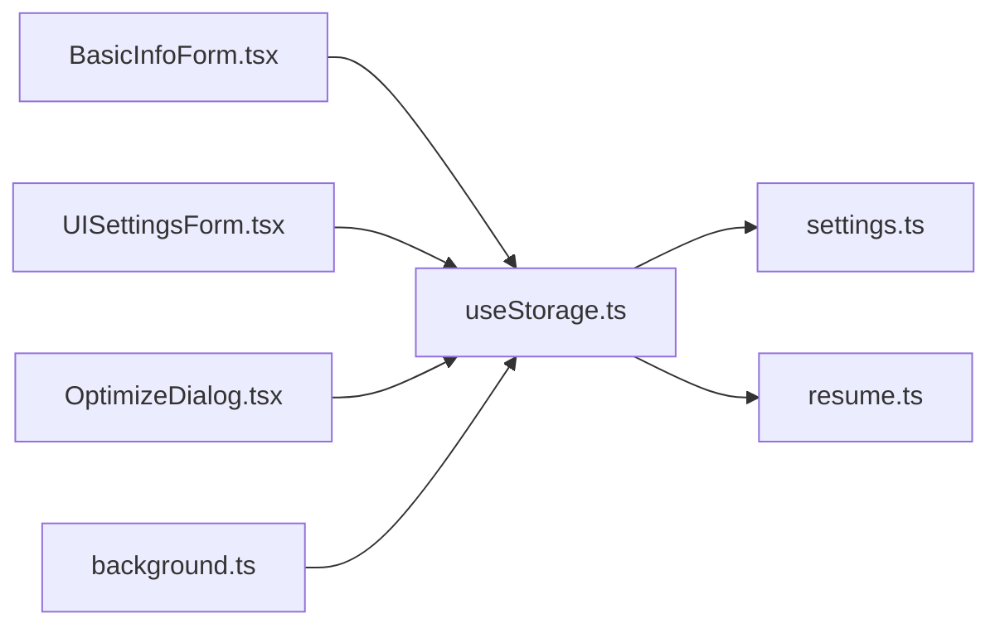

# useStorage Hook

<cite>
**本文引用的文件**
- [useStorage.ts](file://src/hooks/useStorage.ts)
- [BasicInfoForm.tsx](file://src/features/popup/BasicInfoForm.tsx)
- [UISettingsForm.tsx](file://src/features/popup/settings/UISettingsForm.tsx)
- [OptimizeDialog.tsx](file://src/features/popup/OptimizeDialog.tsx)
- [background.ts](file://src/background.ts)
- [settings.ts](file://src/types/settings.ts)
- [resume.ts](file://src/types/resume.ts)
</cite>

## 目录
1. [简介](#简介)
2. [项目结构](#项目结构)
3. [核心组件](#核心组件)
4. [架构总览](#架构总览)
5. [详细组件分析](#详细组件分析)
6. [依赖关系分析](#依赖关系分析)
7. [性能考虑](#性能考虑)
8. [故障排查指南](#故障排查指南)
9. [结论](#结论)
10. [附录](#附录)

## 简介
本文件为 useStorage<T>(key: string, defaultValue: T) Hook 提供系统化的 API 文档与实现机制说明。该 Hook 在 Chrome 扩展环境中提供持久化存储能力，并在开发环境或非扩展环境下自动降级至浏览器本地存储；同时通过跨实例变更监听机制，确保多实例之间的数据同步。Hook 返回一个三元组 [value, updateValue, isLoading]，分别表示当前存储值、更新函数和加载状态。updateValue 支持函数式更新，便于在复杂状态更新场景下安全地基于前一状态进行计算。

## 项目结构
useStorage Hook 位于 hooks 目录，配套的组件与服务脚本在 features、background 等目录中使用该 Hook 或直接访问存储 API，形成“Hook 层 -> 组件层 -> 扩展服务层”的分层架构。

图表来源
- [useStorage.ts](file://src/hooks/useStorage.ts#L1-L102)
- [BasicInfoForm.tsx](file://src/features/popup/BasicInfoForm.tsx#L1-L180)
- [UISettingsForm.tsx](file://src/features/popup/settings/UISettingsForm.tsx#L1-L115)
- [OptimizeDialog.tsx](file://src/features/popup/OptimizeDialog.tsx#L1-L297)
- [background.ts](file://src/background.ts#L1-L80)
- [settings.ts](file://src/types/settings.ts#L1-L192)
- [resume.ts](file://src/types/resume.ts#L1-L212)

章节来源
- [useStorage.ts](file://src/hooks/useStorage.ts#L1-L102)

## 核心组件
- useStorage<T>(key: string, defaultValue: T)
  - 功能：在 Chrome 扩展环境中持久化存储数据，支持开发环境降级到 localStorage。
  - 返回：三元组 [value, updateValue, isLoading]
    - value：当前存储的值，类型为 T。
    - updateValue：更新函数，支持两种形式：
      - updateValue(newValue: T)：直接替换为新值。
      - updateValue(updater: (prev: T) => T)：函数式更新，基于前一状态计算新值。
    - isLoading：布尔值，表示初始数据加载状态。首次挂载时为 true，加载完成后变为 false。
  - 优先策略：优先使用 chrome.storage.local；若运行环境不支持 chrome.storage，则自动降级到 localStorage。
  - 跨实例同步：通过 chrome.storage.onChanged 监听本地存储变更，当同一 key 的值被其他实例修改时，当前实例会同步更新 value。
  - 错误处理：加载与保存过程中出现异常会记录错误日志并继续执行，避免阻断 UI。

章节来源
- [useStorage.ts](file://src/hooks/useStorage.ts#L1-L102)

## 架构总览
useStorage 的工作流包含三个关键阶段：初始化加载、跨实例同步、更新持久化。

图表来源
- [useStorage.ts](file://src/hooks/useStorage.ts#L1-L102)
- [background.ts](file://src/background.ts#L1-L80)

## 详细组件分析

### useStorage<T>(key, defaultValue) 实现机制
- 初始化加载
  - 在首次挂载时，根据运行环境判断是否可用 chrome.storage.local。
  - 若可用：从 chrome.storage.local.get(key) 读取值；若不存在则保持 defaultValue。
  - 若不可用：从 localStorage.getItem(key) 读取字符串并 JSON.parse 后赋值；若不存在则保持 defaultValue。
  - 加载完成后将 isLoading 设为 false。
- 跨实例同步
  - 仅在 chrome.storage 可用时注册 onChanged 监听器。
  - 当 areaName 为 "local" 且 changes[key] 存在时，将 value 更新为 newValue。
  - 卸载组件时移除监听器，避免内存泄漏。
- 更新持久化
  - updateValue 支持函数式更新：当传入函数时，基于前一状态 prev 计算 nextValue；否则直接使用传入的新值。
  - 异步写入：优先写入 chrome.storage.local.set({key: nextValue})；否则写入 localStorage.setItem(key, JSON.stringify(nextValue))。
  - 写入过程捕获异常并输出错误日志，不影响后续逻辑。
- 返回值
  - [value, updateValue, isLoading] 三元组，其中 updateValue 使用 useCallback 缓存，避免因每次渲染产生新的函数引用导致子组件不必要的重渲染。

章节来源
- [useStorage.ts](file://src/hooks/useStorage.ts#L1-L102)

### 函数式更新的优势
- 原子性与一致性：函数式更新确保在并发更新时始终基于最新状态计算，避免竞态条件。
- 简化复杂更新：在需要合并对象或数组时，函数式更新可直接对 prev 进行深拷贝或浅合并，减少错误。
- 与 React 状态更新最佳实践一致：推荐在需要依赖前一状态的场景使用函数式更新。

章节来源
- [useStorage.ts](file://src/hooks/useStorage.ts#L61-L85)

### 开发环境降级策略
- 优先使用 chrome.storage.local：在扩展环境中提供可靠、跨标签页的存储能力。
- 自动降级到 localStorage：当 typeof chrome !== "undefined" 且 chrome.storage 不可用时，使用 localStorage.getItem/ setItem 作为后备方案，保证开发调试时的功能可用性。
- 注意事项：localStorage 为字符串存储，因此在读取时需要 JSON.parse，写入时需要 JSON.stringify。

章节来源
- [useStorage.ts](file://src/hooks/useStorage.ts#L15-L29)

### 跨实例变更监听机制
- 监听器注册：仅在 chrome.storage 可用时注册 onChanged 监听器，监听 "local" 区域的变更。
- 数据同步：当同一 key 的 newValue 变更时，立即更新当前实例的 value，从而实现多实例间的实时同步。
- 清理：组件卸载时移除监听器，防止内存泄漏。

章节来源
- [useStorage.ts](file://src/hooks/useStorage.ts#L40-L59)

### API 使用示例与最佳实践
- 基本用法
  - 在组件中解构出 [value, updateValue, isLoading]，并在 isLoading 为 false 时渲染真实内容。
  - 示例参考：[BasicInfoForm.tsx](file://src/features/popup/BasicInfoForm.tsx#L36-L82)、[UISettingsForm.tsx](file://src/features/popup/settings/UISettingsForm.tsx#L19-L51)。
- 函数式更新
  - 在需要合并对象或数组时，使用 updateValue(prev => ({ ...prev, key: value }))。
  - 示例参考：[BasicInfoForm.tsx](file://src/features/popup/BasicInfoForm.tsx#L62-L73)、[UISettingsForm.tsx](file://src/features/popup/settings/UISettingsForm.tsx#L26-L45)。
- 处理加载状态
  - 在 isLoading 为 true 时显示加载占位，避免空值导致的 UI 异常。
  - 示例参考：[BasicInfoForm.tsx](file://src/features/popup/BasicInfoForm.tsx#L134-L140)、[UISettingsForm.tsx](file://src/features/popup/settings/UISettingsForm.tsx#L47-L49)。
- 与扩展服务交互
  - 背景脚本通过 chrome.storage.local.get/set 读写设置，与 useStorage 的跨实例同步配合，实现 UI 模式的即时生效。
  - 示例参考：[background.ts](file://src/background.ts#L10-L29)、[background.ts](file://src/background.ts#L31-L57)。

章节来源
- [BasicInfoForm.tsx](file://src/features/popup/BasicInfoForm.tsx#L36-L82)
- [UISettingsForm.tsx](file://src/features/popup/settings/UISettingsForm.tsx#L19-L51)
- [background.ts](file://src/background.ts#L10-L29)
- [background.ts](file://src/background.ts#L31-L57)

### 错误场景与处理策略
- 存储配额超限
  - 现象：chrome.storage.local.set 或 localStorage.setItem 抛出异常。
  - 处理：updateValue 与初始化加载均包含 try/catch 并输出错误日志，不会中断流程；建议在 UI 上提示用户清理存储或减少数据体积。
- 数据格式不匹配
  - 现象：localStorage 中存在旧格式数据，JSON.parse 失败。
  - 处理：初始化加载时捕获异常并保持 defaultValue，避免崩溃；可在后续迁移逻辑中修复数据格式。
- 跨实例同步延迟
  - 现象：onChange 回调可能滞后于其他实例的写入。
  - 处理：依赖 Hook 内部 setValue 同步更新，通常可满足大多数场景；若对强一致有更高要求，可在业务层增加确认机制。

章节来源
- [useStorage.ts](file://src/hooks/useStorage.ts#L14-L33)
- [useStorage.ts](file://src/hooks/useStorage.ts#L70-L85)

## 依赖关系分析
- 组件依赖
  - BasicInfoForm、UISettingsForm、OptimizeDialog 等组件通过 useStorage 读写配置与表单数据。
- 类型依赖
  - settings.ts 提供默认设置类型与默认值，用于初始化 useStorage。
  - resume.ts 提供简历数据类型与默认值，用于表单持久化。
- 扩展服务依赖
  - background.ts 通过 chrome.storage.local 直接读写 UI 设置，与 useStorage 的跨实例同步共同保证设置的一致性。

图表来源
- [useStorage.ts](file://src/hooks/useStorage.ts#L1-L102)
- [BasicInfoForm.tsx](file://src/features/popup/BasicInfoForm.tsx#L1-L180)
- [UISettingsForm.tsx](file://src/features/popup/settings/UISettingsForm.tsx#L1-L115)
- [OptimizeDialog.tsx](file://src/features/popup/OptimizeDialog.tsx#L1-L297)
- [background.ts](file://src/background.ts#L1-L80)
- [settings.ts](file://src/types/settings.ts#L1-L192)
- [resume.ts](file://src/types/resume.ts#L1-L212)

章节来源
- [useStorage.ts](file://src/hooks/useStorage.ts#L1-L102)
- [settings.ts](file://src/types/settings.ts#L1-L192)
- [resume.ts](file://src/types/resume.ts#L1-L212)
- [background.ts](file://src/background.ts#L1-L80)

## 性能考虑
- 缓存 updateValue：updateValue 使用 useCallback 缓存，避免每次渲染产生新的函数引用，减少子组件不必要的重渲染。
- 避免频繁写入：在高频更新场景（如表单输入）中，可通过节流/防抖策略减少存储写入次数。
- 合理使用 isLoading：在加载期间避免执行昂贵的副作用，待 isLoading 为 false 后再进行数据绑定与渲染。
- 跨实例同步成本：onChange 监听器仅在 chrome.storage 可用时注册，且只监听目标 key，开销较低；若实例数量较多，仍建议控制存储键的数量与大小。

章节来源
- [useStorage.ts](file://src/hooks/useStorage.ts#L61-L85)

## 故障排查指南
- 无法加载数据
  - 检查运行环境是否支持 chrome.storage；若不支持，确认 localStorage 是否可用。
  - 查看控制台错误日志，定位 JSON 解析或存储写入异常。
- 更新无效或不同步
  - 确认是否在 chrome.storage 可用的环境中；仅在该环境下才会注册 onChanged 监听器。
  - 检查 key 是否一致，确保多个实例使用相同的键名。
- 存储配额问题
  - 观察 set 操作抛出的异常；必要时清理部分存储或拆分键空间。
- 背景脚本与 UI 不一致
  - 确认 background.ts 对 chrome.storage.local 的读写逻辑与组件侧的 useStorage 是否使用相同键名。

章节来源
- [useStorage.ts](file://src/hooks/useStorage.ts#L14-L33)
- [useStorage.ts](file://src/hooks/useStorage.ts#L40-L59)
- [background.ts](file://src/background.ts#L10-L29)

## 结论
useStorage Hook 为 Chrome 扩展提供了统一、可靠的持久化存储抽象，具备优先使用 chrome.storage.local 的策略、开发环境降级到 localStorage 的容错能力、以及跨实例变更监听机制。通过返回三元组 [value, updateValue, isLoading]，开发者可以简洁地管理状态、处理加载与更新，并在复杂场景下利用函数式更新保证状态一致性。配合组件层与背景脚本的协同，可实现稳定、可维护的扩展功能。

## 附录
- 常见键名（STORAGE_KEYS）
  - RESUME_DATA：简历数据
  - RESUME_TEMPLATES：简历模板
  - MODEL_SETTINGS：模型设置
  - PARSE_SETTINGS：解析设置
  - UI_SETTINGS：界面设置
  - STAR_GATE：星门开关
- 类型与默认值
  - UI 设置默认值：参见 [settings.ts](file://src/types/settings.ts#L102-L106)
  - 简历数据默认值：参见 [resume.ts](file://src/types/resume.ts#L104-L134)

章节来源
- [useStorage.ts](file://src/hooks/useStorage.ts#L90-L101)
- [settings.ts](file://src/types/settings.ts#L102-L106)
- [resume.ts](file://src/types/resume.ts#L104-L134)