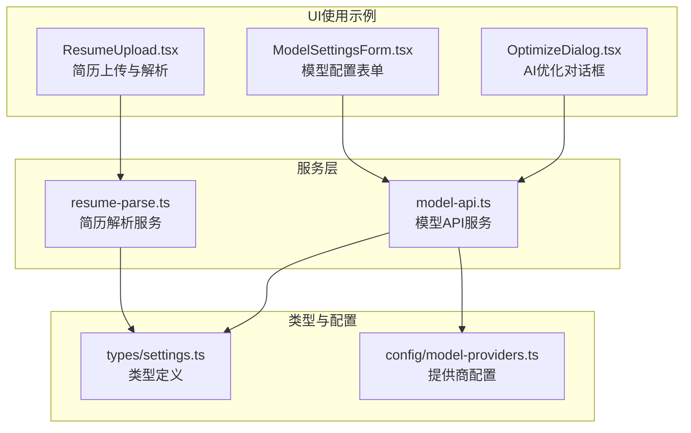
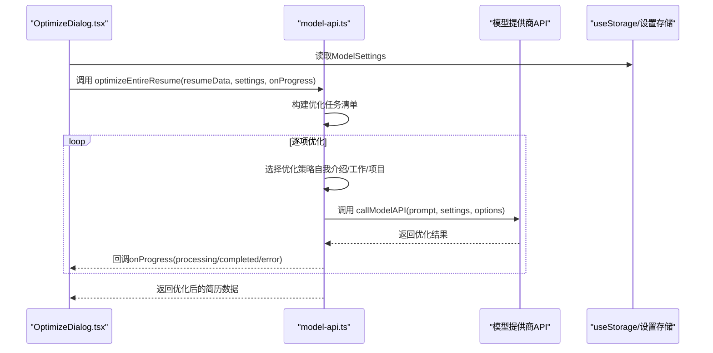
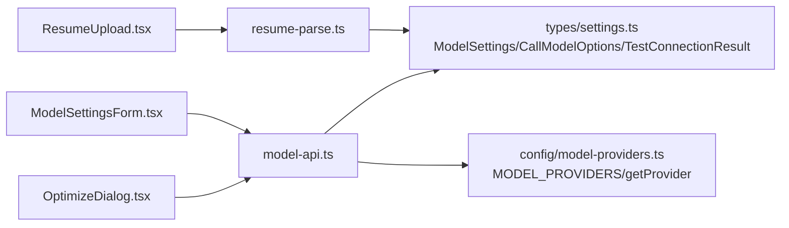

# 服务API

<cite>
**本文引用的文件**
- [src/services/model-api.ts](file://src/services/model-api.ts)
- [src/services/resume-parse.ts](file://src/services/resume-parse.ts)
- [src/types/settings.ts](file://src/types/settings.ts)
- [src/config/model-providers.ts](file://src/config/model-providers.ts)
- [src/features/popup/OptimizeDialog.tsx](file://src/features/popup/OptimizeDialog.tsx)
- [src/features/popup/ResumeUpload.tsx](file://src/features/popup/ResumeUpload.tsx)
- [src/features/popup/settings/ModelSettingsForm.tsx](file://src/features/popup/settings/ModelSettingsForm.tsx)
</cite>

## 目录
1. [简介](#简介)
2. [项目结构](#项目结构)
3. [核心组件](#核心组件)
4. [架构总览](#架构总览)
5. [详细组件分析](#详细组件分析)
6. [依赖关系分析](#依赖关系分析)
7. [性能考量](#性能考量)
8. [故障排查指南](#故障排查指南)
9. [结论](#结论)

## 简介
本文件面向开发者，提供服务模块的详细API文档，覆盖以下两部分：
- 模型API服务：封装多国产大模型提供商的统一调用接口，提供通用的AI调用、连接测试、字段优化、建议生成、字段匹配、整份简历一键优化等能力。
- 简历解析服务：封装简历解析API调用，支持将PDF/Word/JSON等文件解析为统一的简历数据结构，并提供兼容性处理与错误码说明。

## 项目结构
服务模块位于 src/services 下，配合类型定义 src/types、提供商配置 src/config，以及UI层的设置与使用示例位于 src/features/popup。

图表来源
- [src/services/model-api.ts](file://src/services/model-api.ts#L1-L678)
- [src/services/resume-parse.ts](file://src/services/resume-parse.ts#L1-L342)
- [src/types/settings.ts](file://src/types/settings.ts#L1-L192)
- [src/config/model-providers.ts](file://src/config/model-providers.ts#L1-L123)
- [src/features/popup/OptimizeDialog.tsx](file://src/features/popup/OptimizeDialog.tsx#L1-L149)
- [src/features/popup/ResumeUpload.tsx](file://src/features/popup/ResumeUpload.tsx#L37-L258)
- [src/features/popup/settings/ModelSettingsForm.tsx](file://src/features/popup/settings/ModelSettingsForm.tsx#L1-L298)

章节来源
- [src/services/model-api.ts](file://src/services/model-api.ts#L1-L678)
- [src/services/resume-parse.ts](file://src/services/resume-parse.ts#L1-L342)
- [src/types/settings.ts](file://src/types/settings.ts#L1-L192)
- [src/config/model-providers.ts](file://src/config/model-providers.ts#L1-L123)
- [src/features/popup/OptimizeDialog.tsx](file://src/features/popup/OptimizeDialog.tsx#L1-L149)
- [src/features/popup/ResumeUpload.tsx](file://src/features/popup/ResumeUpload.tsx#L37-L258)
- [src/features/popup/settings/ModelSettingsForm.tsx](file://src/features/popup/settings/ModelSettingsForm.tsx#L1-L298)

## 核心组件
- 模型API服务（model-api.ts）
  - 统一构建API URL、发送请求、解析响应、兼容不同提供商的响应格式
  - 提供连接测试、字段级优化、建议生成、字段匹配、整份简历一键优化等能力
- 简历解析服务（resume-parse.ts）
  - 将文件转为Base64并调用解析API，解析为统一的 ParsedResumeData 结构
  - 提供兼容性处理策略与日期/技能等级映射工具

章节来源
- [src/services/model-api.ts](file://src/services/model-api.ts#L1-L678)
- [src/services/resume-parse.ts](file://src/services/resume-parse.ts#L1-L342)

## 架构总览
下面的序列图展示了“一键优化整份简历”在UI层的调用流程，以及服务层内部的处理链路。

图表来源
- [src/features/popup/OptimizeDialog.tsx](file://src/features/popup/OptimizeDialog.tsx#L94-L141)
- [src/services/model-api.ts](file://src/services/model-api.ts#L492-L676)
- [src/types/settings.ts](file://src/types/settings.ts#L22-L30)

## 详细组件分析

### 模型API服务（model-api.ts）

- 构建API请求URL
  - 支持内置提供商与自定义URL（OpenAI兼容）
  - 自定义URL会自动补全为/chat/completions结尾
  - 未知提供商将抛出错误
  - 参考路径：[buildApiUrl](file://src/services/model-api.ts#L17-L33)

- 调用大模型API（callModelAPI）
  - 参数
    - prompt: string，必填
    - settings: ModelSettings，必填
    - options: CallModelOptions，可选
  - 返回
    - Promise<string>，返回模型生成的文本
  - 错误处理
    - 未配置API Key或模型将抛出错误
    - HTTP状态码401/429/400分别给出明确提示
    - 其他HTTP错误将返回状态与错误文本
    - 响应解析兼容choices[].message.content、output.text、result等格式，否则抛出无法解析错误
  - 示例调用
    - 在UI中通过优化对话框触发：[handleStartOptimize](file://src/features/popup/OptimizeDialog.tsx#L95-L141)
  - 关键实现参考
    - [callModelAPI](file://src/services/model-api.ts#L38-L139)

- 测试模型API连接（testModelConnection）
  - 参数
    - settings: ModelSettings，必填
  - 返回
    - Promise<TestConnectionResult>，包含success、message、response
  - 行为
    - 若未配置API Key，直接返回失败消息
    - 否则发送简短测试请求，成功返回成功消息与响应，失败返回错误消息
  - 示例调用
    - 在模型配置表单中点击“测试连接”：[handleTestConnection](file://src/features/popup/settings/ModelSettingsForm.tsx#L75-L90)
  - 关键实现参考
    - [testModelConnection](file://src/services/model-api.ts#L144-L174)

- 优化简历字段（optimizeResumeField）
  - 参数
    - fieldName: string，字段标识（如self-intro、project-desc、responsibilities、description）
    - currentValue: string，当前字段值
    - settings: ModelSettings，必填
    - context: 目标职位、行业、项目名、公司等上下文
  - 返回
    - Promise<string>，返回优化后的文本
  - 行为
    - 根据字段类型构造针对性提示词，调用callModelAPI
  - 关键实现参考
    - [optimizeResumeField](file://src/services/model-api.ts#L179-L232)

- 生成简历建议（generateResumeSuggestions）
  - 参数
    - resumeData: 任意对象，包含个人信息与经历数组
    - settings: ModelSettings，必填
  - 返回
    - Promise<{ completeness: number; suggestions: string[]; tips: string[] }>
  - 行为
    - 生成包含完整性评分、建议数组、小贴士数组的JSON
    - 若无法解析JSON，回退为返回原始响应
  - 关键实现参考
    - [generateResumeSuggestions](file://src/services/model-api.ts#L237-L287)

- AI辅助字段匹配（aiMatchFields）
  - 参数
    - pageFields: 页面表单字段描述数组
    - resumeFields: 简历字段描述数组
    - settings: ModelSettings，必填
  - 返回
    - Promise<Array<{pageIndex: number; resumeIndex: number; confidence: number}>>，置信度>=0.5的匹配
  - 行为
    - 构造提示词，要求返回JSON数组，解析后过滤低置信度
  - 关键实现参考
    - [aiMatchFields](file://src/services/model-api.ts#L293-L366)

- 一键优化整份简历（optimizeEntireResume）
  - 参数
    - resumeData: 任意对象，包含个人信息与经历数组
    - settings: ModelSettings，必填
    - onProgress: 进度回调，包含current、total、currentTask、status、optimizedContent、error
  - 返回
    - Promise<any>，返回优化后的简历数据副本
  - 行为
    - 深拷贝简历数据，按顺序构建优化任务（自我介绍、工作经历描述、项目描述、项目职责）
    - 逐项调用对应优化函数，期间通过onProgress反馈进度
    - 为避免请求过于频繁，相邻任务间添加延迟
    - 任一任务失败会记录错误并继续后续任务
  - 关键实现参考
    - [optimizeEntireResume](file://src/services/model-api.ts#L492-L676)

- 内部优化子函数
  - optimizeSelfIntro：针对自我介绍的优化
  - optimizeWorkDescription：针对工作经历描述的优化
  - optimizeProjectDescription：针对项目描述的优化
  - optimizeResponsibilities：针对项目职责的优化
  - 关键实现参考
    - [optimizeSelfIntro](file://src/services/model-api.ts#L371-L407)
    - [optimizeWorkDescription](file://src/services/model-api.ts#L408-L429)
    - [optimizeProjectDescription](file://src/services/model-api.ts#L434-L458)
    - [optimizeResponsibilities](file://src/services/model-api.ts#L463-L487)

- 类型与配置
  - ModelSettings：包含provider、model、customUrl、apiKeys、apiKey
  - CallModelOptions：包含systemPrompt、temperature、maxTokens、model
  - TestConnectionResult：包含success、message、response
  - ModelProvider：包含id、name、baseUrl、models、authHeader、authPrefix
  - 关键类型参考
    - [ModelSettings/CallModelOptions/TestConnectionResult](file://src/types/settings.ts#L22-L30)
    - [CallModelOptions](file://src/types/settings.ts#L109-L114)
    - [TestConnectionResult](file://src/types/settings.ts#L117-L121)
    - [ModelProvider](file://src/types/settings.ts#L12-L19)
  - 提供商配置参考
    - [MODEL_PROVIDERS/getProvider](file://src/config/model-providers.ts#L1-L123)

章节来源
- [src/services/model-api.ts](file://src/services/model-api.ts#L1-L678)
- [src/types/settings.ts](file://src/types/settings.ts#L1-L192)
- [src/config/model-providers.ts](file://src/config/model-providers.ts#L1-L123)
- [src/features/popup/OptimizeDialog.tsx](file://src/features/popup/OptimizeDialog.tsx#L94-L141)
- [src/features/popup/settings/ModelSettingsForm.tsx](file://src/features/popup/settings/ModelSettingsForm.tsx#L75-L90)

### 简历解析服务（resume-parse.ts）

- 输入与输出
  - 输入
    - file: File，支持PDF/Word/JSON/文本等
    - settings: ParseSettings，包含url与appCode
  - 输出
    - Promise<ParsedResumeData>，统一的简历数据结构
  - 关键类型参考
    - [ParsedResumeData](file://src/services/resume-parse.ts#L114-L132)
    - [ParseSettings](file://src/types/settings.ts#L33-L36)

- 主要函数
  - fileToBase64：将File转换为Base64字符串
    - 参考路径：[fileToBase64](file://src/services/resume-parse.ts#L19-L33)
  - parseResumeByAPI：调用解析API并返回统一结构
    - 行为
      - 校验settings.url与settings.appCode
      - 将文件转为Base64
      - 构造请求体（包含文件名、Base64内容、OCR类型等）
      - 发送POST请求，使用APPCODE认证
      - 解析响应并调用parseAPIResponse
      - 错误处理：401认证失败、其他HTTP错误均抛出错误
    - 参考路径：[parseResumeByAPI](file://src/services/resume-parse.ts#L38-L109)
  - parseAPIResponse：将API原始响应解析为统一结构
    - 行为
      - 兼容多种原始数据容器（result/data/body或直接对象）
      - 解析个人信息、教育经历、工作/实习经历、项目经历、技能、语言能力
      - 日期标准化与技能等级映射
    - 参考路径：[parseAPIResponse](file://src/services/resume-parse.ts#L137-L295)
  - normalizeDateValue：将多种日期格式标准化为YYYY-MM-DD
    - 参考路径：[normalizeDateValue](file://src/services/resume-parse.ts#L299-L320)
  - mapSkillLevel：将API技能等级映射为表单可选值
    - 参考路径：[mapSkillLevel](file://src/services/resume-parse.ts#L322-L341)

- 错误码与解决方案
  - 401：认证失败
    - 可能原因：APP Code错误、服务未激活或已过期
    - 解决方案：检查APP Code是否正确、确认服务已开通
  - 其他HTTP错误：返回状态码与错误文本
    - 解决方案：检查网络连通性、确认API地址与APP Code配置正确
  - 参考路径：[错误处理](file://src/services/resume-parse.ts#L82-L101)

- UI使用示例
  - 简历上传与解析流程
    - 支持JSON直解析与调用API解析
    - 未配置解析API时提示用户前往设置配置
    - 参考路径：[ResumeUpload](file://src/features/popup/ResumeUpload.tsx#L37-L258)

章节来源
- [src/services/resume-parse.ts](file://src/services/resume-parse.ts#L1-L342)
- [src/types/settings.ts](file://src/types/settings.ts#L33-L36)
- [src/features/popup/ResumeUpload.tsx](file://src/features/popup/ResumeUpload.tsx#L37-L258)

## 依赖关系分析

图表来源
- [src/services/model-api.ts](file://src/services/model-api.ts#L1-L678)
- [src/services/resume-parse.ts](file://src/services/resume-parse.ts#L1-L342)
- [src/types/settings.ts](file://src/types/settings.ts#L1-L192)
- [src/config/model-providers.ts](file://src/config/model-providers.ts#L1-L123)
- [src/features/popup/OptimizeDialog.tsx](file://src/features/popup/OptimizeDialog.tsx#L1-L149)
- [src/features/popup/settings/ModelSettingsForm.tsx](file://src/features/popup/settings/ModelSettingsForm.tsx#L1-L298)
- [src/features/popup/ResumeUpload.tsx](file://src/features/popup/ResumeUpload.tsx#L37-L258)

## 性能考量
- 请求频率控制
  - optimizeEntireResume在任务间添加延迟，避免触发限流
  - 参考路径：[任务间延迟](file://src/services/model-api.ts#L658-L662)
- 响应解析兼容
  - callModelAPI兼容多种响应格式，减少因提供商差异导致的失败
  - 参考路径：[响应解析](file://src/services/model-api.ts#L122-L138)
- 数据标准化
  - normalizeDateValue与mapSkillLevel统一数据格式，降低后续处理成本
  - 参考路径：[日期标准化](file://src/services/resume-parse.ts#L299-L320)、[技能等级映射](file://src/services/resume-parse.ts#L322-L341)

## 故障排查指南

- 模型API常见问题
  - 401 未授权
    - 检查API Key是否正确配置，或切换到对应提供商的Key
    - 参考路径：[错误处理](file://src/services/model-api.ts#L106-L117)
  - 429 请求过于频繁
    - 适当延长任务间隔或降低并发
    - 参考路径：[任务延迟](file://src/services/model-api.ts#L658-L662)
  - 400 请求参数错误
    - 检查prompt与options是否合理
    - 参考路径：[错误处理](file://src/services/model-api.ts#L112-L114)
  - 无法解析响应
    - 确认提供商返回格式是否被兼容
    - 参考路径：[响应解析](file://src/services/model-api.ts#L122-L138)

- 简历解析常见问题
  - 401 认证失败
    - 检查APP Code是否正确、服务是否已开通
    - 参考路径：[错误处理](file://src/services/resume-parse.ts#L92-L101)
  - 文件格式不支持
    - 仅支持PDF/Word/JSON/文本等，超出范围会提示错误
    - 参考路径：[文件校验与提示](file://src/features/popup/ResumeUpload.tsx#L42-L46)

- 连接测试
  - 在模型配置表单中点击“测试连接”，查看成功/失败提示
  - 参考路径：[测试连接](file://src/features/popup/settings/ModelSettingsForm.tsx#L75-L90)

章节来源
- [src/services/model-api.ts](file://src/services/model-api.ts#L106-L138)
- [src/services/resume-parse.ts](file://src/services/resume-parse.ts#L92-L101)
- [src/features/popup/settings/ModelSettingsForm.tsx](file://src/features/popup/settings/ModelSettingsForm.tsx#L75-L90)
- [src/features/popup/ResumeUpload.tsx](file://src/features/popup/ResumeUpload.tsx#L42-L46)

## 结论
本服务API文档梳理了模型API与简历解析服务的接口、参数、返回值、错误处理与典型调用场景。通过统一的类型与配置体系，开发者可以快速集成多提供商的大模型能力，并稳定地解析各类简历文件，形成一致的数据结构以便前端表单填充与展示。建议在生产环境中结合连接测试与错误监控，确保API调用的稳定性与用户体验。