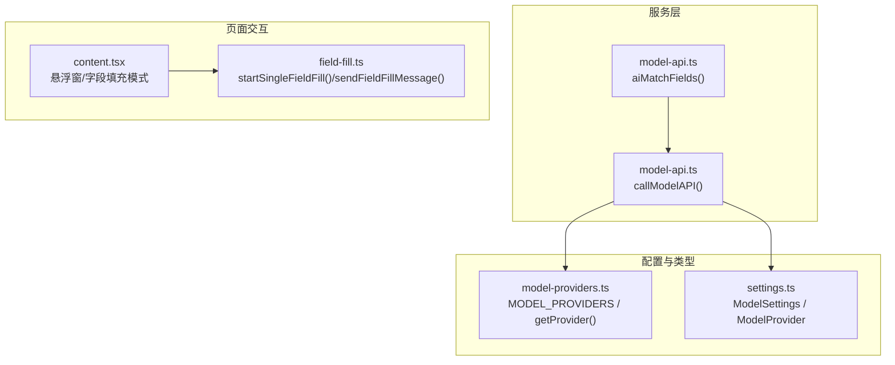
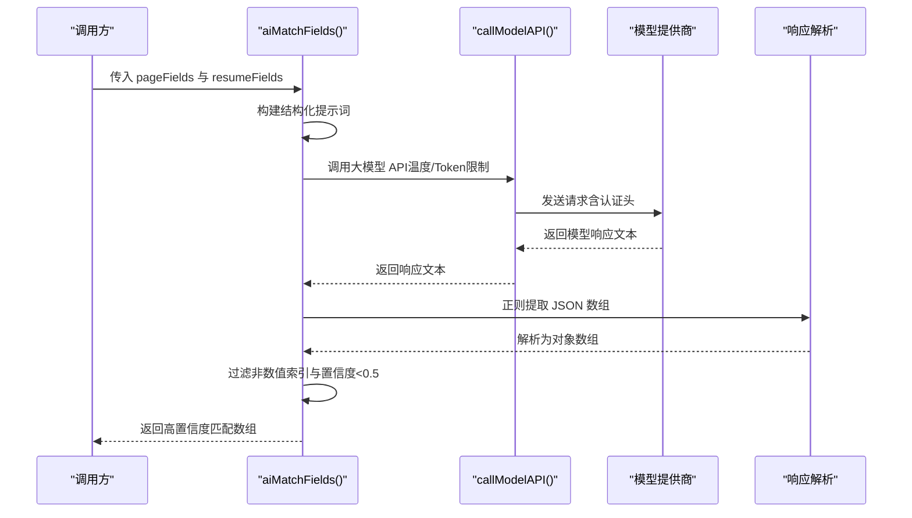
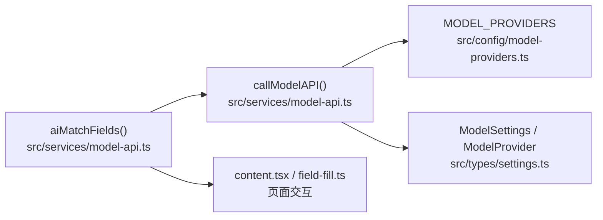

# AI字段匹配 (aiMatchFields)

<cite>
**本文引用的文件**
- [model-api.ts](file://src/services/model-api.ts)
- [model-providers.ts](file://src/config/model-providers.ts)
- [settings.ts](file://src/types/settings.ts)
- [content.tsx](file://src/content.tsx)
- [field-fill.ts](file://src/services/field-fill.ts)
</cite>

## 目录
1. [简介](#简介)
2. [项目结构](#项目结构)
3. [核心组件](#核心组件)
4. [架构总览](#架构总览)
5. [详细组件分析](#详细组件分析)
6. [依赖关系分析](#依赖关系分析)
7. [性能考量](#性能考量)
8. [故障排查指南](#故障排查指南)
9. [结论](#结论)
10. [附录](#附录)

## 简介
本文件为 aiMatchFields 函数的详细 API 文档。该函数通过大模型对网页表单字段与简历数据字段进行智能匹配，输出高置信度的匹配结果，用于后续的智能填充。其核心目标是：
- 将网页表单字段（含标签、占位符、name/id、类型等）与简历字段（含 key、关键词、值）进行语义对齐
- 输出结构化匹配数组，包含网页字段索引、简历字段索引与置信度
- 仅返回置信度不低于 0.5 的匹配，保证结果质量
- 采用正则提取 JSON 数组并进行类型与阈值过滤，增强鲁棒性

该能力在智能填充场景中与传统规则匹配形成互补：当规则无法覆盖复杂语义或多变文案时，AI 可以基于上下文与语义理解给出更准确的对应关系。

## 项目结构
aiMatchFields 位于模型 API 服务模块中，依赖模型提供商配置与设置类型；其调用链路会经由通用的大模型 API 调用函数，最终向指定模型提供商发起请求。

图表来源
- [model-api.ts](file://src/services/model-api.ts#L289-L366)
- [model-providers.ts](file://src/config/model-providers.ts#L1-L123)
- [settings.ts](file://src/types/settings.ts#L1-L120)
- [content.tsx](file://src/content.tsx#L1-L120)
- [field-fill.ts](file://src/services/field-fill.ts#L1-L120)

章节来源
- [model-api.ts](file://src/services/model-api.ts#L289-L366)
- [model-providers.ts](file://src/config/model-providers.ts#L1-L123)
- [settings.ts](file://src/types/settings.ts#L1-L120)
- [content.tsx](file://src/content.tsx#L1-L120)
- [field-fill.ts](file://src/services/field-fill.ts#L1-L120)

## 核心组件
- aiMatchFields：接收网页字段数组与简历字段数组，构建结构化提示词，调用大模型 API 并解析返回的 JSON 数组，过滤置信度低于 0.5 的结果，返回高置信度匹配。
- callModelAPI：封装通用的大模型请求流程，支持多种提供商与认证方式，统一提取响应文本。
- MODEL_PROVIDERS / getProvider：提供模型提供商的基础配置与模型列表查询。
- ModelSettings / ModelProvider 类型：定义模型提供商、模型、API Key 存储结构及默认值。

章节来源
- [model-api.ts](file://src/services/model-api.ts#L289-L366)
- [model-providers.ts](file://src/config/model-providers.ts#L1-L123)
- [settings.ts](file://src/types/settings.ts#L1-L120)

## 架构总览
下面的序列图展示了 aiMatchFields 的调用与响应解析流程：

图表来源
- [model-api.ts](file://src/services/model-api.ts#L289-L366)

## 详细组件分析

### 函数签名与职责
- 函数名：aiMatchFields
- 输入参数
  - pageFields：网页字段数组，元素包含 label、placeholder、name、id、type 等
  - resumeFields：简历字段数组，元素包含 key、keywords[]、value
  - settings：模型设置（provider、model、customUrl、apiKeys 等）
- 输出
  - 匹配数组，元素包含 pageIndex、resumeIndex、confidence（0-1）

处理流程要点
- 将 pageFields 与 resumeFields 转换为结构化描述，便于模型理解
- 构造提示词，明确要求返回 JSON 数组，并限定只返回置信度 >= 0.5 的匹配
- 调用 callModelAPI 发起请求，设置较低温度与适中 Token 上限以提升稳定性
- 使用正则提取响应中的 JSON 数组，再进行类型校验与置信度过滤

章节来源
- [model-api.ts](file://src/services/model-api.ts#L289-L366)

### 参数与数据结构说明
- pageFields（网页字段）
  - 字段含义：label（标签）、placeholder（占位符）、name（字段名）、id（DOM ID）、type（输入类型）
  - 用途：作为网页侧的语义标识，帮助模型理解字段意图
- resumeFields（简历字段）
  - 字段含义：key（简历字段键）、keywords（关键词集合，前 3 个）、value（字段值，截断至 30 字）
  - 用途：作为简历侧的语义锚点，辅助模型识别字段含义

章节来源
- [model-api.ts](file://src/services/model-api.ts#L289-L366)

### 提示词构造与约束
- 提示词包含两部分：网页表单字段与简历数据字段的结构化描述
- 明确要求返回 JSON 数组，包含 pageIndex、resumeIndex、confidence
- 严格限定只返回置信度 >= 0.5 的匹配，减少噪声

章节来源
- [model-api.ts](file://src/services/model-api.ts#L289-L366)

### 响应解析与过滤
- 使用正则匹配方括号内的 JSON 数组，避免模型输出中夹杂其他文本
- 解析为对象数组后，进一步过滤：
  - pageIndex 与 resumeIndex 必须为数值
  - confidence 必须 >= 0.5
- 若解析失败或异常，返回空数组并记录错误日志

章节来源
- [model-api.ts](file://src/services/model-api.ts#L289-L366)

### 与模型提供商与设置的关系
- aiMatchFields 通过 callModelAPI 调用模型，后者依据 settings.provider 选择模型提供商，并从 settings.apiKeys 中读取对应提供商的 API Key
- MODEL_PROVIDERS 提供基础配置（baseUrl、认证头、模型列表），getProvider 提供查询能力
- settings.ts 定义了 ModelSettings 与 ModelProvider 的结构与默认值

章节来源
- [model-api.ts](file://src/services/model-api.ts#L1-L161)
- [model-providers.ts](file://src/config/model-providers.ts#L1-L123)
- [settings.ts](file://src/types/settings.ts#L1-L120)

### 与智能填充流程的衔接
- 页面交互层通过 content.tsx 与 field-fill.ts 实现“悬浮窗”与“字段填充模式”
- 用户在弹窗中填写简历字段后，可通过“一键填充”或“单字段填充”将值写入网页输入框
- aiMatchFields 可作为智能匹配阶段的核心能力，为后续填充提供可靠的字段映射

章节来源
- [content.tsx](file://src/content.tsx#L1-L120)
- [field-fill.ts](file://src/services/field-fill.ts#L1-L120)

### 示例数据与语义关联
- 输入示例（示意）
  - 网页字段：姓名（label 或 placeholder）、手机号（label 或 placeholder）、邮箱（label 或 placeholder）
  - 简历字段：key 为 name、phone、email，keywords 为“姓名”、“手机号”、“邮箱”，value 为对应值
- 输出示例（示意）
  - [{ pageIndex: 0, resumeIndex: 0, confidence: 0.92 }, { pageIndex: 1, resumeIndex: 1, confidence: 0.87 }]
- 语义关联说明
  - “姓名”与 name：模型理解“姓名”标签或占位符与简历 key 的语义一致性
  - “手机号”与 phone：模型理解“手机”“电话”等常见别称与简历 key 的语义一致性

注意：以上为概念性示例，实际字段与关键词来源于真实页面与简历解析结果。

### 与传统规则匹配的互补
- 传统规则匹配通常依赖固定规则（如 name 与姓名、phone 与手机号等），在简单场景效果稳定
- 当页面文案多样化、字段命名不规范或存在同义表达时，AI 可基于上下文与语义理解给出更稳健的匹配
- 实践建议：先用规则快速匹配高确定性字段，再用 AI 补足模糊或歧义字段，最后统一过滤置信度阈值

## 依赖关系分析
aiMatchFields 的关键依赖如下：

图表来源
- [model-api.ts](file://src/services/model-api.ts#L289-L366)
- [model-providers.ts](file://src/config/model-providers.ts#L1-L123)
- [settings.ts](file://src/types/settings.ts#L1-L120)
- [content.tsx](file://src/content.tsx#L1-L120)
- [field-fill.ts](file://src/services/field-fill.ts#L1-L120)

章节来源
- [model-api.ts](file://src/services/model-api.ts#L289-L366)
- [model-providers.ts](file://src/config/model-providers.ts#L1-L123)
- [settings.ts](file://src/types/settings.ts#L1-L120)
- [content.tsx](file://src/content.tsx#L1-L120)
- [field-fill.ts](file://src/services/field-fill.ts#L1-L120)

## 性能考量
- 温度与 Token 上限
  - aiMatchFields 调用时设置了较低温度与适中 Token 上限，有助于提升输出稳定性与可控性
- 响应解析成本
  - 正则匹配与 JSON 解析为 O(n) 级别，n 为响应文本长度；过滤步骤为 O(m) 级别，m 为匹配候选数量
- 网络与并发
  - 大模型请求为同步阻塞调用，建议在 UI 层提供加载反馈；避免在同一页面短时间内多次触发
- 结果规模控制
  - 通过置信度阈值与字段描述截断（关键词与值），降低提示词体积与模型负担

## 故障排查指南
- API Key 未配置或错误
  - 现象：抛出“请先在设置中配置模型 API Key”或 401 错误
  - 处理：在设置中为对应提供商填写正确的 API Key，并确认 provider 与 model 选择正确
- 模型不可用或请求过于频繁
  - 现象：429 限流或 400 参数错误
  - 处理：降低请求频率，检查网络与服务端状态
- 响应解析失败
  - 现象：返回空数组，控制台打印“AI 字段匹配失败”
  - 处理：确认提示词格式与模型输出一致；必要时调整提示词或增加系统提示
- 置信度过低
  - 现象：无匹配或匹配稀少
  - 处理：丰富简历字段的 keywords 与 value；优化页面字段的 label/placeholder；适当降低阈值（谨慎）

章节来源
- [model-api.ts](file://src/services/model-api.ts#L1-L161)
- [model-api.ts](file://src/services/model-api.ts#L289-L366)

## 结论
aiMatchFields 通过结构化提示词与强约束的 JSON 输出，结合正则解析与阈值过滤，实现了对网页表单字段与简历字段的高置信度匹配。其与传统规则匹配互补，能够在复杂语义场景中显著提升智能填充的准确性与稳定性。配合悬浮窗与字段填充流程，可为用户提供从“识别匹配”到“一键填充”的完整体验。

## 附录

### API 定义（概要）
- 函数：aiMatchFields(pageFields, resumeFields, settings)
- 输入
  - pageFields：数组，元素含 label、placeholder、name、id、type
  - resumeFields：数组，元素含 key、keywords[]、value
  - settings：ModelSettings（provider、model、customUrl、apiKeys）
- 输出
  - 数组：元素含 pageIndex、resumeIndex、confidence（>=0.5）

章节来源
- [model-api.ts](file://src/services/model-api.ts#L289-L366)