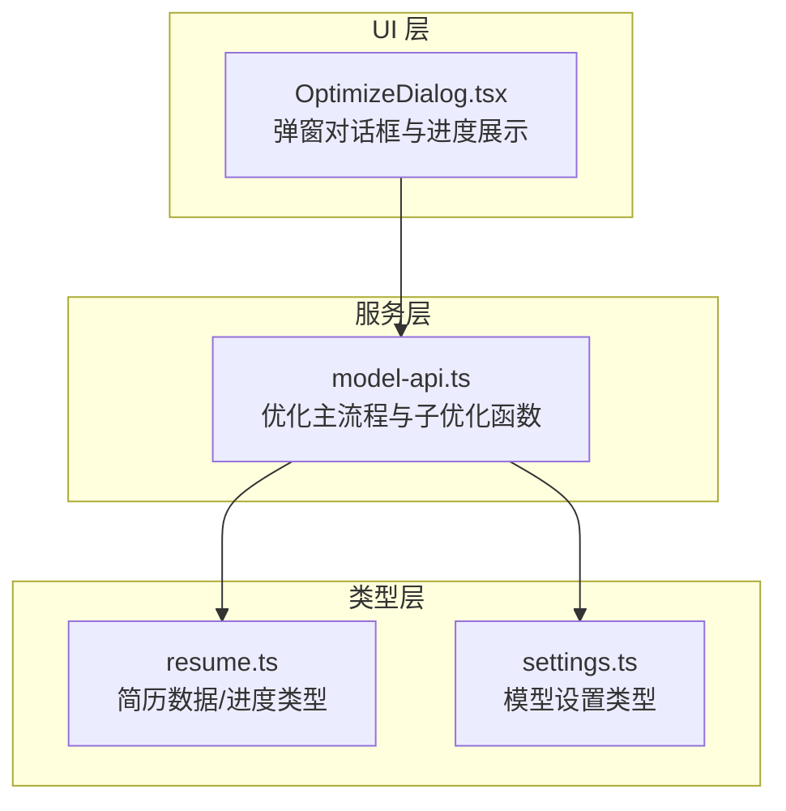
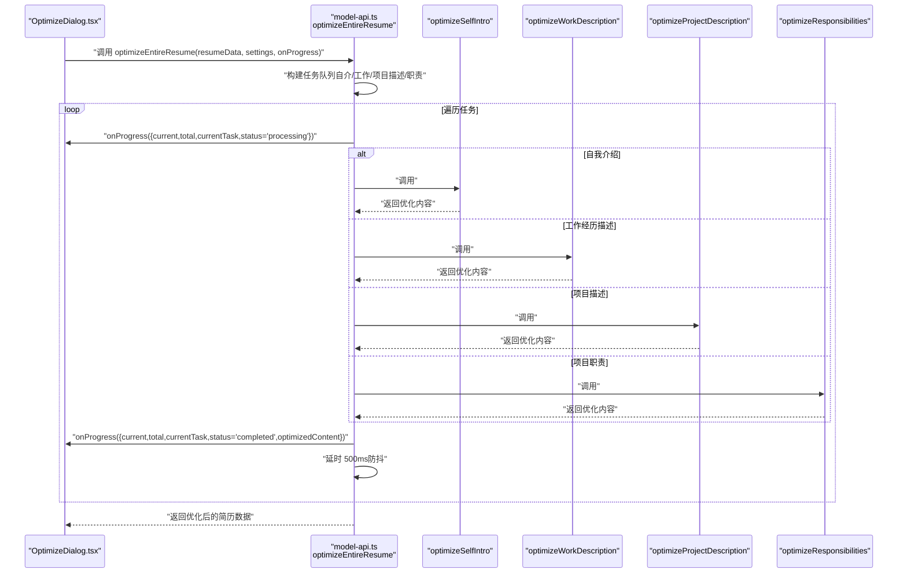
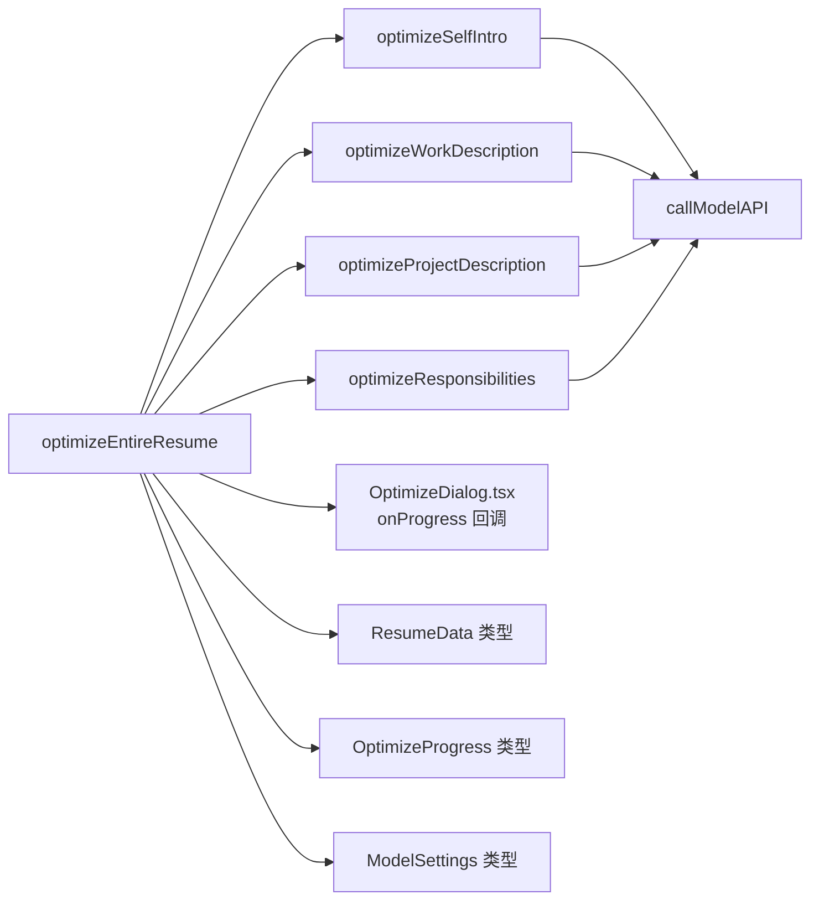

# 一键优化简历 (optimizeEntireResume)

<cite>
**本文引用的文件**
- [model-api.ts](file://src/services/model-api.ts)
- [OptimizeDialog.tsx](file://src/features/popup/OptimizeDialog.tsx)
- [resume.ts](file://src/types/resume.ts)
- [settings.ts](file://src/types/settings.ts)
</cite>

## 目录
1. [简介](#简介)
2. [项目结构](#项目结构)
3. [核心组件](#核心组件)
4. [架构总览](#架构总览)
5. [详细组件分析](#详细组件分析)
6. [依赖关系分析](#依赖关系分析)
7. [性能考量](#性能考量)
8. [故障排查指南](#故障排查指南)
9. [结论](#结论)
10. [附录](#附录)

## 简介
本文件为 optimizeEntireResume 函数的详细 API 文档，聚焦“一键式整份简历优化”能力。该函数接收原始简历数据、模型设置与进度回调，自动构建优化任务队列（自我介绍、工作经历描述、项目描述、项目职责等），依次调用对应优化函数，并通过 onProgress 实时反馈进度与状态；同时内置防抖延迟策略与错误恢复机制，保证整体流程稳定与用户体验流畅。

## 项目结构
- 服务层：模型 API 调用与优化逻辑集中在服务模块中，统一管理提示词、调用参数与错误处理。
- 类型层：简历数据结构、优化进度与模型设置类型在类型定义文件中集中声明，便于跨组件复用。
- UI 层：弹窗对话框组件负责收集用户输入、触发优化流程、渲染进度与结果，并将优化后的数据回传给上层。

图表来源
- [model-api.ts](file://src/services/model-api.ts#L350-L678)
- [resume.ts](file://src/types/resume.ts#L86-L163)
- [settings.ts](file://src/types/settings.ts#L22-L45)
- [OptimizeDialog.tsx](file://src/features/popup/OptimizeDialog.tsx#L1-L141)

章节来源
- [model-api.ts](file://src/services/model-api.ts#L350-L678)
- [resume.ts](file://src/types/resume.ts#L86-L163)
- [settings.ts](file://src/types/settings.ts#L22-L45)
- [OptimizeDialog.tsx](file://src/features/popup/OptimizeDialog.tsx#L1-L141)

## 核心组件
- optimizeEntireResume：入口函数，负责构建任务队列、逐项调优、合并结果、进度上报与错误恢复。
- 子优化函数：分别针对自我介绍、工作经历描述、项目描述、项目职责进行专项优化。
- 进度回调 onProgress：向 UI 层推送当前进度、任务名、状态与可选的优化结果或错误信息。
- 模型设置 settings：包含提供商、模型、API Key 等关键参数，用于构建模型调用请求。
- 简历数据结构：ResumeData，包含求职期望、自我介绍、教育、工作经历、项目、技能、语言等字段。

章节来源
- [model-api.ts](file://src/services/model-api.ts#L350-L678)
- [resume.ts](file://src/types/resume.ts#L86-L163)
- [settings.ts](file://src/types/settings.ts#L22-L45)

## 架构总览
optimizeEntireResume 的执行路径如下：接收 resumeData 与 settings，构建优化任务队列，遍历任务逐一调用对应优化函数，期间通过 onProgress 回调推进 UI 进度条与状态文案；在每次任务完成后插入短暂延迟，降低 API 请求频率；若某任务失败，记录错误并继续下一个任务，最终返回深拷贝后的优化结果。

图表来源
- [model-api.ts](file://src/services/model-api.ts#L492-L678)
- [OptimizeDialog.tsx](file://src/features/popup/OptimizeDialog.tsx#L115-L131)

## 详细组件分析

### optimizeEntireResume API 定义与行为
- 参数
  - resumeData：原始简历数据对象，需满足 ResumeData 结构。
  - settings：模型设置对象，包含 provider、model、apiKeys 等。
  - onProgress：进度回调函数，接收包含 current、total、currentTask、status、optimizedContent、error 等字段的对象。
- 返回值
  - Promise<any>：返回深拷贝后的优化结果（与 resumeData 结构一致，但部分字段已被替换为优化后的内容）。
- 工作流
  - 深拷贝 resumeData，避免修改原始数据。
  - 构建任务队列：按顺序收集“自我介绍”、“工作经历描述”、“项目描述”、“项目职责”等可优化项。
  - 遍历任务：每次调用前先 onProgress 发送 processing 状态；根据任务类型调用对应优化函数；成功后更新优化结果；无论成功与否均递增已完成计数并在完成后发送 completed 或 error 状态；在仍有剩余任务时，等待 500ms 再继续，以缓解 API 频率压力。
  - 若无任何可优化内容，抛出错误。
- 错误恢复
  - 单个任务失败不会中断整体流程；onProgress 会携带 error 字段，UI 可据此展示失败原因并允许重试。
- 结果合并
  - 采用深拷贝策略，逐项更新优化后的内容，确保不破坏原始数据结构。

章节来源
- [model-api.ts](file://src/services/model-api.ts#L492-L678)
- [resume.ts](file://src/types/resume.ts#L86-L163)

### 子优化函数（按任务类型）
- optimizeSelfIntro
  - 输入：当前自我介绍内容、目标职位、目标行业、模型设置。
  - 输出：优化后的自我介绍文本。
  - 特点：结合求职意向，强调量化成果与简洁表达。
- optimizeWorkDescription
  - 输入：当前工作经历描述、上下文（公司、职位）、模型设置。
  - 输出：优化后的工作描述文本。
  - 特点：遵循 STAR 法则、动词开头、量化成果、分点描述。
- optimizeProjectDescription
  - 输入：当前项目描述、上下文（项目名）、模型设置。
  - 输出：优化后的项目描述文本。
  - 特点：背景目标、技术栈、创新点、量化成果。
- optimizeResponsibilities
  - 输入：当前项目职责描述、上下文（项目名）、模型设置。
  - 输出：优化后的职责描述文本。
  - 特点：动词开头、突出个人角色与成果、条理清晰。

章节来源
- [model-api.ts](file://src/services/model-api.ts#L350-L487)

### 进度回调机制（onProgress）
- 触发时机
  - 每次任务开始前：发送 processing 状态，包含 current、total、currentTask。
  - 每次任务完成后：发送 completed 状态，包含 current、total、currentTask、optimizedContent。
  - 某任务发生异常：发送 error 状态，包含 current、total、currentTask、error。
- 字段说明
  - current：已完成的任务数量。
  - total：任务总数。
  - currentTask：当前正在处理的任务名称。
  - status：任务状态（processing/completed/error）。
  - optimizedContent：本次任务的优化结果（仅 completed 时存在）。
  - error：错误信息（仅 error 时存在）。
- UI 展示
  - OptimizeDialog.tsx 中根据 onProgress 更新进度条、百分比与状态文案。

章节来源
- [model-api.ts](file://src/services/model-api.ts#L586-L678)
- [OptimizeDialog.tsx](file://src/features/popup/OptimizeDialog.tsx#L192-L213)

### 防抖延迟策略
- 策略说明：在每个任务完成后，若仍有剩余任务，则等待 500ms 再继续，避免触发 API 频率限制。
- 作用：降低请求并发，提高稳定性与成功率，改善用户体验。

章节来源
- [model-api.ts](file://src/services/model-api.ts#L658-L662)

### 错误恢复策略
- 行为：单个任务失败不会中断整体流程；onProgress 会携带 error 字段，UI 可提示用户重试。
- 原因：任务粒度明确、try/catch 包裹、错误不影响后续任务。
- 建议：UI 层可提供“重试”按钮，重新触发优化流程。

章节来源
- [model-api.ts](file://src/services/model-api.ts#L662-L673)
- [OptimizeDialog.tsx](file://src/features/popup/OptimizeDialog.tsx#L131-L141)

### 优化结果的合并方式
- 深拷贝策略：先对 resumeData 执行深拷贝，再逐项更新优化后的内容，确保不污染原始数据。
- 更新规则：
  - 自我介绍：直接替换 selfIntro。
  - 工作经历描述：定位到 workExperience[index][key] 并替换 description。
  - 项目描述：定位到 projects[index][key] 并替换 projectDesc。
  - 项目职责：定位到 projects[index][key] 并替换 responsibilities。
- 返回值：返回优化后的完整简历数据。

章节来源
- [model-api.ts](file://src/services/model-api.ts#L504-L647)

### 调用示例（React 组件）
- 在 OptimizeDialog.tsx 中，通过按钮点击触发 optimizeEntireResume，并将 onProgress 回调绑定到本地状态，从而驱动 UI 更新。
- 示例流程要点：
  - 校验 API 配置与可优化内容。
  - 调用 optimizeEntireResume(resumeData, modelSettings, onProgress)。
  - onProgress 更新进度与状态。
  - 成功后将优化结果回传给父组件并关闭弹窗。

章节来源
- [OptimizeDialog.tsx](file://src/features/popup/OptimizeDialog.tsx#L95-L141)

### 对用户体验的提升
- 一键式优化：无需手动逐项编辑，系统自动识别并优化所有可优化内容。
- 实时反馈：进度条与状态文案让用户感知优化过程，减少等待焦虑。
- 错误友好：单任务失败不影响整体，支持重试，提升成功率。
- 防抖策略：降低 API 压力，避免频繁失败导致的卡顿与失败。

## 依赖关系分析
- optimizeEntireResume 依赖：
  - 子优化函数：optimizeSelfIntro、optimizeWorkDescription、optimizeProjectDescription、optimizeResponsibilities。
  - 类型定义：ResumeData、OptimizeProgress、OptimizeTask、ModelSettings。
  - 模型调用：callModelAPI（由各子优化函数内部调用）。
- UI 依赖：
  - OptimizeDialog.tsx 通过 onProgress 驱动进度展示与交互。

图表来源
- [model-api.ts](file://src/services/model-api.ts#L350-L678)
- [resume.ts](file://src/types/resume.ts#L86-L163)
- [settings.ts](file://src/types/settings.ts#L22-L45)
- [OptimizeDialog.tsx](file://src/features/popup/OptimizeDialog.tsx#L115-L131)

## 性能考量
- 串行优化：按顺序逐项调用，避免并发请求带来的不稳定与限流风险。
- 防抖延迟：每次任务完成后等待 500ms，有助于平滑 API 请求节奏。
- 深拷贝成本：对大型简历数据进行深拷贝，内存占用与序列化开销随数据规模增长；建议在 UI 层限制一次性优化的条目数量或分批处理。
- 错误短路：单任务失败不影响整体，但可能增加总耗时；可在 UI 层提供“跳过失败项”的选项以进一步提升效率。

## 故障排查指南
- 无可优化内容
  - 现象：抛出错误，提示“没有找到可优化的内容，请先填写简历的描述性内容”。
  - 排查：确认简历中存在自我介绍、工作经历描述、项目描述或项目职责等可优化字段。
- API 配置缺失
  - 现象：callModelAPI 抛出“请先在设置中配置模型 API Key”或“请先在设置中选择要使用的模型”。
  - 排查：在设置页配置 provider、model 与 API Key。
- API 请求失败
  - 现象：callModelAPI 返回 401、429、400 等错误码，或“API 请求失败”。
  - 排查：检查 API Key 是否正确、网络是否可用、模型是否支持、请求频率是否过高。
- 单任务失败
  - 现象：onProgress 报错，但整体流程继续。
  - 排查：查看 error 字段，确认是否为网络波动或模型响应异常；可重试该任务或整体重试。

章节来源
- [model-api.ts](file://src/services/model-api.ts#L492-L678)
- [settings.ts](file://src/types/settings.ts#L49-L77)

## 结论
optimizeEntireResume 通过“任务队列 + 子优化函数 + 进度回调 + 防抖延迟 + 错误恢复”的组合，实现了“一键式整份简历优化”。它在保证稳定性的同时，提供了良好的用户体验：实时进度反馈、失败可恢复、结果深拷贝保护原始数据。配合 UI 层的弹窗对话框，用户可以轻松完成整份简历的批量优化。

## 附录

### API 定义摘要
- 函数签名
  - optimizeEntireResume(resumeData, settings, onProgress)
- 参数
  - resumeData：ResumeData
  - settings：ModelSettings
  - onProgress：(progress: OptimizeProgress) => void
- 返回值
  - Promise<any>：优化后的简历数据
- 任务类型
  - self-intro、work-description、project-desc、project-responsibilities

章节来源
- [model-api.ts](file://src/services/model-api.ts#L492-L678)
- [resume.ts](file://src/types/resume.ts#L138-L163)
- [settings.ts](file://src/types/settings.ts#L22-L45)