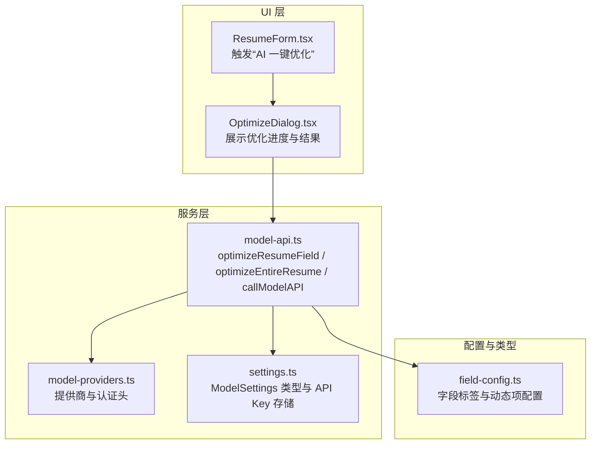
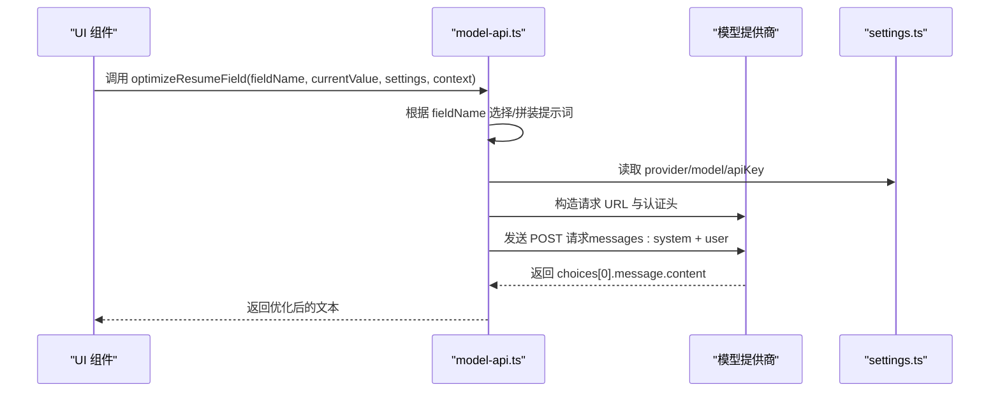
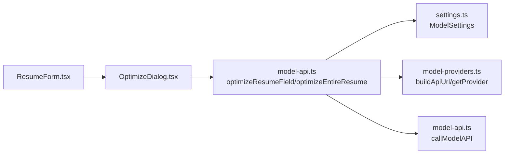

# 优化简历字段 (optimizeResumeField)

<cite>
**本文引用的文件**
- [model-api.ts](file://src/services/model-api.ts)
- [OptimizeDialog.tsx](file://src/features/popup/OptimizeDialog.tsx)
- [ResumeForm.tsx](file://src/features/popup/ResumeForm.tsx)
- [field-config.ts](file://src/config/field-config.ts)
- [settings.ts](file://src/types/settings.ts)
- [model-providers.ts](file://src/config/model-providers.ts)
</cite>

## 目录
1. [简介](#简介)
2. [项目结构](#项目结构)
3. [核心组件](#核心组件)
4. [架构总览](#架构总览)
5. [详细组件分析](#详细组件分析)
6. [依赖关系分析](#依赖关系分析)
7. [性能考量](#性能考量)
8. [故障排查指南](#故障排查指南)
9. [结论](#结论)
10. [附录](#附录)

## 简介
本文件为 optimizeResumeField 函数提供完整的 API 文档，涵盖参数说明、提示词模板系统、默认优化策略、与模型 API 的交互流程、UI 应用场景以及在整体简历优化流程中的复用机制。读者无需深入源码即可理解该函数如何根据字段类型生成针对性的优化提示，并通过模型 API 返回更专业、结构化的简历内容。

## 项目结构
与 optimizeResumeField 直接相关的代码主要分布在以下模块：
- 服务层：模型 API 调用与字段优化实现
- UI 层：弹窗对话框与简历表单入口
- 类型与配置：模型提供商、设置、字段配置

图表来源
- [model-api.ts](file://src/services/model-api.ts#L178-L232)
- [OptimizeDialog.tsx](file://src/features/popup/OptimizeDialog.tsx#L1-L140)
- [ResumeForm.tsx](file://src/features/popup/ResumeForm.tsx#L739-L781)
- [field-config.ts](file://src/config/field-config.ts#L378-L399)
- [settings.ts](file://src/types/settings.ts#L21-L44)
- [model-providers.ts](file://src/config/model-providers.ts#L97-L121)

章节来源
- [model-api.ts](file://src/services/model-api.ts#L178-L232)
- [OptimizeDialog.tsx](file://src/features/popup/OptimizeDialog.tsx#L1-L140)
- [ResumeForm.tsx](file://src/features/popup/ResumeForm.tsx#L739-L781)
- [field-config.ts](file://src/config/field-config.ts#L378-L399)
- [settings.ts](file://src/types/settings.ts#L21-L44)
- [model-providers.ts](file://src/config/model-providers.ts#L97-L121)

## 核心组件
- optimizeResumeField：按字段类型生成定制化提示词，调用模型 API 并返回优化结果。
- callModelAPI：封装模型提供商、认证头、请求体构建与响应解析。
- optimizeEntireResume：批量优化整份简历，内部复用字段级优化逻辑。
- OptimizeDialog：UI 对话框，展示优化预览、进度与结果。
- ModelSettings：模型提供商、模型名称、API Key 存储与获取。

章节来源
- [model-api.ts](file://src/services/model-api.ts#L38-L139)
- [model-api.ts](file://src/services/model-api.ts#L178-L232)
- [model-api.ts](file://src/services/model-api.ts#L492-L676)
- [OptimizeDialog.tsx](file://src/features/popup/OptimizeDialog.tsx#L1-L140)
- [settings.ts](file://src/types/settings.ts#L21-L44)

## 架构总览
optimizeResumeField 的调用链路如下：

图表来源
- [model-api.ts](file://src/services/model-api.ts#L38-L139)
- [model-api.ts](file://src/services/model-api.ts#L178-L232)
- [settings.ts](file://src/types/settings.ts#L21-L44)
- [model-providers.ts](file://src/config/model-providers.ts#L97-L121)

## 详细组件分析

### 函数签名与参数说明
- 函数名：optimizeResumeField
- 参数
  - fieldName：字段标识字符串，如 self-intro、project-desc、responsibilities、description 等
  - currentValue：当前字段内容（字符串）
  - settings：模型设置对象，包含 provider、model、customUrl、apiKeys 等
  - context：上下文对象，包含 position、industry、projectName、company 等字段
- 返回值：Promise<string>，返回优化后的文本
- 默认行为：当 fieldName 不在内置映射中时，使用通用默认提示词

章节来源
- [model-api.ts](file://src/services/model-api.ts#L178-L232)
- [settings.ts](file://src/types/settings.ts#L21-L44)

### 提示词模板系统（fieldPrompts）
optimizeResumeField 内部维护一个字段到提示词的映射，针对不同字段类型给出明确的优化方向与约束：
- self-intro
  - 目标：使自我介绍更专业、有吸引力
  - 上下文：position、industry
  - 输出要求：直接输出优化后的自我介绍，字数控制在 200-300 字
- project-desc
  - 目标：使项目描述更专业、有条理
  - 上下文：projectName
  - 输出要求：使用 STAR 法则（情境-任务-行动-结果）组织内容
- responsibilities
  - 目标：使职责描述更专业
  - 上下文：position
  - 输出要求：动词开头，突出成果和数据
- description
  - 目标：使工作/实习描述更专业
  - 上下文：company、position
  - 输出要求：突出工作成果和个人贡献
- 默认提示词
  - 当 fieldName 不匹配上述键时，使用通用提示词，要求输出更专业、有吸引力的内容

章节来源
- [model-api.ts](file://src/services/model-api.ts#L189-L231)

### 与模型 API 的交互流程
- 读取 settings：provider、model、customUrl、apiKeys
- 构建请求 URL：buildApiUrl(providerId, customUrl)
- 构造请求体：messages 包含 system 和 user 角色；temperature、max_tokens、stream 等参数
- 发起请求：fetch(url, { method: "POST", headers, body })
- 解析响应：优先提取 choices[0].message.content；兼容 output.text 或 result 字段
- 错误处理：401、429、400 等状态码抛出明确错误；无法解析响应时抛出异常

章节来源
- [model-api.ts](file://src/services/model-api.ts#L38-L139)
- [model-providers.ts](file://src/config/model-providers.ts#L97-L121)
- [settings.ts](file://src/types/settings.ts#L21-L44)

### 在 UI 中的应用场景
- “AI 一键优化简历”按钮
  - 在简历表单页面，用户点击“✨ AI 一键优化简历”，弹出优化对话框
  - 对话框会预览将要优化的内容清单（自我介绍、工作描述、项目描述、职责描述等）
  - 用户确认后，调用 optimizeEntireResume 执行批量优化
- 单字段优化入口
  - UI 中可为每个可优化字段提供“AI 优化”按钮，调用 optimizeResumeField
  - 传入 fieldName、currentValue、settings、context（如 position、industry、projectName、company）
  - 将返回的优化文本回填到对应字段

章节来源
- [ResumeForm.tsx](file://src/features/popup/ResumeForm.tsx#L739-L781)
- [OptimizeDialog.tsx](file://src/features/popup/OptimizeDialog.tsx#L1-L140)

### 在 optimizeEntireResume 中的复用机制
- optimizeEntireResume 会遍历简历数据，收集需要优化的任务（自述、工作描述、项目描述、职责描述），并逐个调用对应的字段级优化函数
- 对于通用字段类型，optimizeEntireResume 也可复用 optimizeResumeField，将任务类型映射到对应字段键，从而统一提示词生成与模型调用流程

章节来源
- [model-api.ts](file://src/services/model-api.ts#L492-L676)
- [model-api.ts](file://src/services/model-api.ts#L178-L232)

### 针对不同字段类型的调用示例（说明性）
- 自我介绍（self-intro）
  - context：包含 position、industry
  - 作用：结合目标职位与行业，突出匹配度与核心优势
- 项目描述（project-desc）
  - context：包含 projectName
  - 作用：使用 STAR 法则组织内容，突出项目背景、技术栈、难点与成果
- 职责描述（responsibilities）
  - context：包含 position
  - 作用：动词开头、量化成果、强调个人贡献
- 工作描述（description）
  - context：包含 company、position
  - 作用：突出工作成果与个人贡献
- 通用字段（其他 fieldName）
  - 作用：当字段类型不匹配内置映射时，使用默认提示词进行通用优化

章节来源
- [model-api.ts](file://src/services/model-api.ts#L189-L231)
- [field-config.ts](file://src/config/field-config.ts#L378-L399)

## 依赖关系分析
- optimizeResumeField 依赖
  - settings.ts：读取 provider、model、apiKeys
  - model-providers.ts：构建请求 URL 与认证头
  - model-api.ts（callModelAPI）：实际发起请求与解析响应
- UI 层依赖
  - OptimizeDialog.tsx：展示优化预览、进度与结果
  - ResumeForm.tsx：触发优化对话框

图表来源
- [OptimizeDialog.tsx](file://src/features/popup/OptimizeDialog.tsx#L1-L140)
- [ResumeForm.tsx](file://src/features/popup/ResumeForm.tsx#L739-L781)
- [model-api.ts](file://src/services/model-api.ts#L178-L232)
- [model-api.ts](file://src/services/model-api.ts#L38-L139)
- [settings.ts](file://src/types/settings.ts#L21-L44)
- [model-providers.ts](file://src/config/model-providers.ts#L97-L121)

章节来源
- [model-api.ts](file://src/services/model-api.ts#L178-L232)
- [model-api.ts](file://src/services/model-api.ts#L38-L139)
- [OptimizeDialog.tsx](file://src/features/popup/OptimizeDialog.tsx#L1-L140)
- [ResumeForm.tsx](file://src/features/popup/ResumeForm.tsx#L739-L781)
- [settings.ts](file://src/types/settings.ts#L21-L44)
- [model-providers.ts](file://src/config/model-providers.ts#L97-L121)

## 性能考量
- 请求频率控制：optimizeEntireResume 在任务间添加延迟，避免频繁请求导致限流
- 响应解析兼容：支持多种响应格式，减少因模型差异导致的解析失败
- 温度与令牌限制：通过 options 控制 temperature 与 max_tokens，平衡创造性与稳定性

章节来源
- [model-api.ts](file://src/services/model-api.ts#L38-L139)
- [model-api.ts](file://src/services/model-api.ts#L658-L662)

## 故障排查指南
- API Key 未配置
  - 现象：调用 callModelAPI 抛出“请先在设置中配置模型 API Key”
  - 处理：在模型设置中配置 provider 与对应 API Key
- 未选择模型
  - 现象：抛出“请先在设置中选择要使用的模型”
  - 处理：选择可用模型或使用自定义 URL
- 认证失败（401）
  - 现象：抛出“API 认证失败，请检查 API Key 是否正确”
  - 处理：核对 API Key 与提供商配置
- 请求过于频繁（429）
  - 现象：抛出“请求过于频繁，请稍后再试”
  - 处理：降低请求频率或等待冷却
- 请求参数错误（400）
  - 现象：抛出“请求参数错误”
  - 处理：检查请求体与模型参数
- 响应无法解析
  - 现象：抛出“无法解析模型响应”
  - 处理：检查模型返回格式或更换模型

章节来源
- [model-api.ts](file://src/services/model-api.ts#L47-L139)
- [settings.ts](file://src/types/settings.ts#L21-L44)

## 结论
optimizeResumeField 通过“字段类型 + 上下文”的提示词模板系统，为不同简历字段提供定制化优化策略，并借助统一的模型 API 调用流程稳定地返回高质量文本。在 UI 中，它既可作为单字段优化入口，也可被 optimizeEntireResume 复用，形成从细粒度到整体的优化闭环。

## 附录
- 字段键与标签映射参考：用于 UI 展示与任务命名
- 模型提供商与认证头：用于构建请求 URL 与鉴权

章节来源
- [field-config.ts](file://src/config/field-config.ts#L378-L399)
- [model-providers.ts](file://src/config/model-providers.ts#L97-L121)