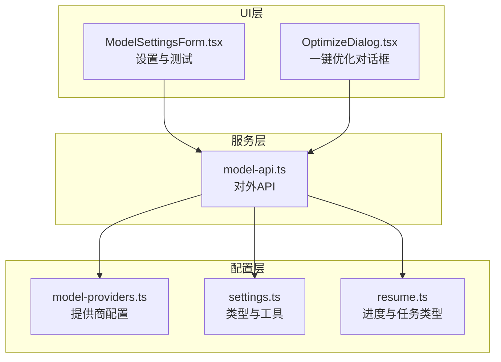
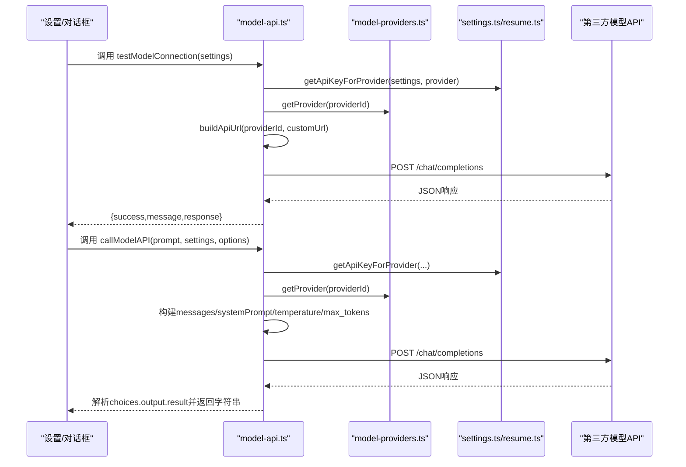
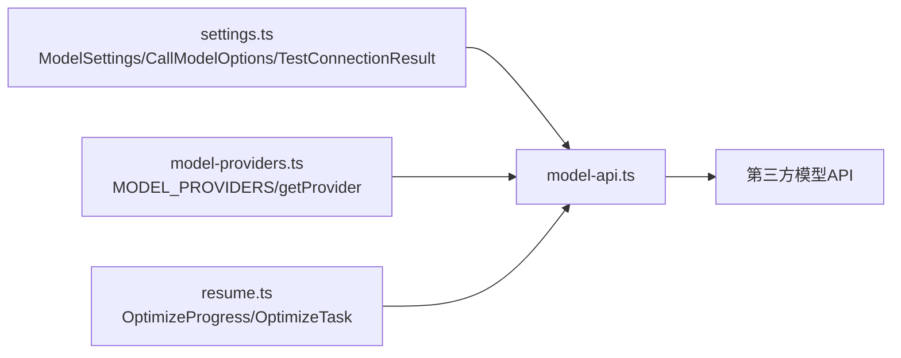

# 模型API服务

<cite>
**本文引用的文件**
- [src/services/model-api.ts](file://src/services/model-api.ts)
- [src/config/model-providers.ts](file://src/config/model-providers.ts)
- [src/types/settings.ts](file://src/types/settings.ts)
- [src/types/resume.ts](file://src/types/resume.ts)
- [src/features/popup/settings/ModelSettingsForm.tsx](file://src/features/popup/settings/ModelSettingsForm.tsx)
- [src/features/popup/OptimizeDialog.tsx](file://src/features/popup/OptimizeDialog.tsx)
</cite>

## 目录
1. [简介](#简介)
2. [项目结构](#项目结构)
3. [核心组件](#核心组件)
4. [架构总览](#架构总览)
5. [详细组件分析](#详细组件分析)
6. [依赖分析](#依赖分析)
7. [性能考虑](#性能考虑)
8. [故障排查指南](#故障排查指南)
9. [结论](#结论)
10. [附录](#附录)

## 简介
本文件为 model-api.ts 模块的详细API文档，覆盖所有对外暴露的函数，包括：
- callModelAPI：通用模型调用，支持系统提示词、温度、最大令牌数等参数，以及多提供商认证与响应解析。
- testModelConnection：连接测试，返回成功/失败与消息体。
- optimizeResumeField：按字段类型优化简历内容，支持上下文注入（职位、行业、项目名、公司等）。
- generateResumeSuggestions：基于简历数据生成完整性评估与建议，具备JSON解析容错。
- aiMatchFields：AI驱动的网页字段与简历字段匹配，返回置信度>=0.5的匹配结果。
- optimizeEntireResume：一键优化整份简历，含任务队列、进度回调、防抖延迟与错误恢复。

同时提供各函数的调用示例、常见错误码与解决方案。

## 项目结构
model-api.ts 位于服务层，负责统一构建请求、认证与响应解析，并通过类型定义与配置模块实现跨提供商适配。

图表来源
- [src/services/model-api.ts](file://src/services/model-api.ts#L1-L678)
- [src/config/model-providers.ts](file://src/config/model-providers.ts#L1-L123)
- [src/types/settings.ts](file://src/types/settings.ts#L1-L192)
- [src/types/resume.ts](file://src/types/resume.ts#L1-L212)
- [src/features/popup/settings/ModelSettingsForm.tsx](file://src/features/popup/settings/ModelSettingsForm.tsx#L1-L298)
- [src/features/popup/OptimizeDialog.tsx](file://src/features/popup/OptimizeDialog.tsx#L1-L297)

章节来源
- [src/services/model-api.ts](file://src/services/model-api.ts#L1-L678)
- [src/config/model-providers.ts](file://src/config/model-providers.ts#L1-L123)
- [src/types/settings.ts](file://src/types/settings.ts#L1-L192)
- [src/types/resume.ts](file://src/types/resume.ts#L1-L212)
- [src/features/popup/settings/ModelSettingsForm.tsx](file://src/features/popup/settings/ModelSettingsForm.tsx#L1-L298)
- [src/features/popup/OptimizeDialog.tsx](file://src/features/popup/OptimizeDialog.tsx#L1-L297)

## 核心组件
- callModelAPI：构建URL、拼装messages（system+user）、设置温度与max_tokens、发起HTTP请求、解析choices.output.result等多格式响应。
- testModelConnection：基于callModelAPI执行简短问候测试，返回success/message/response。
- optimizeResumeField：按字段类型（自我介绍、项目描述、职责描述、工作描述）构造提示词，注入上下文，调用callModelAPI。
- generateResumeSuggestions：汇总简历关键信息，要求模型返回JSON，若解析失败回退到原始响应。
- aiMatchFields：将页面字段与简历字段特征化，要求模型返回JSON数组，过滤置信度>=0.5的结果。
- optimizeEntireResume：构建优化任务队列，逐项调用子优化器，进度回调，防抖延迟，错误恢复。

章节来源
- [src/services/model-api.ts](file://src/services/model-api.ts#L35-L139)
- [src/services/model-api.ts](file://src/services/model-api.ts#L141-L174)
- [src/services/model-api.ts](file://src/services/model-api.ts#L176-L232)
- [src/services/model-api.ts](file://src/services/model-api.ts#L234-L287)
- [src/services/model-api.ts](file://src/services/model-api.ts#L289-L366)
- [src/services/model-api.ts](file://src/services/model-api.ts#L368-L676)

## 架构总览
下图展示调用链路与跨模块协作。

图表来源
- [src/services/model-api.ts](file://src/services/model-api.ts#L35-L139)
- [src/services/model-api.ts](file://src/services/model-api.ts#L141-L174)
- [src/config/model-providers.ts](file://src/config/model-providers.ts#L1-L123)
- [src/types/settings.ts](file://src/types/settings.ts#L46-L78)

## 详细组件分析

### callModelAPI 函数
- 功能：通用模型调用，支持systemPrompt、temperature、maxTokens、model等选项。
- 参数
  - prompt: 用户输入内容
  - settings: ModelSettings（provider、model、customUrl、apiKeys）
  - options: CallModelOptions（可选，systemPrompt、temperature、maxTokens、model）
- 请求构建
  - URL：buildApiUrl(providerId, customUrl)，支持“custom”自定义OpenAI兼容接口
  - 认证头：由提供商配置决定，前缀与头部名来自MODEL_PROVIDERS
  - 请求体：messages包含system与user；temperature与max_tokens来自options或默认值；stream=false
- 响应解析
  - 优先解析 choices[0].message.content
  - 兼容 output.text 与 result 字段
  - 若均不满足，抛出“无法解析模型响应”
- 错误处理
  - 401：认证失败
  - 429：请求过于频繁
  - 400：参数错误
  - 其他：返回状态码与错误文本

章节来源
- [src/services/model-api.ts](file://src/services/model-api.ts#L35-L139)
- [src/config/model-providers.ts](file://src/config/model-providers.ts#L1-L95)
- [src/types/settings.ts](file://src/types/settings.ts#L108-L121)

### testModelConnection 函数
- 功能：测试模型API连通性
- 流程
  - 读取当前提供商API Key
  - 调用callModelAPI发送简短问候，限制temperature与maxTokens
  - 返回 {success, message, response}
- 结果对象结构
  - success: boolean
  - message: string
  - response?: string（仅成功时存在）

章节来源
- [src/services/model-api.ts](file://src/services/model-api.ts#L141-L174)
- [src/features/popup/settings/ModelSettingsForm.tsx](file://src/features/popup/settings/ModelSettingsForm.tsx#L74-L90)

### optimizeResumeField 函数
- 功能：按字段类型优化简历内容
- 字段类型与提示词模板
  - self-intro：自我介绍，支持注入position、industry
  - project-desc：项目描述，支持注入projectName
  - responsibilities：职责描述，支持注入position
  - description：工作/实习描述，支持注入company、position
- 上下文注入
  - 通过context对象传入position、industry、projectName、company
- 调用链
  - 根据fieldName选择模板
  - 组装prompt后调用callModelAPI

章节来源
- [src/services/model-api.ts](file://src/services/model-api.ts#L176-L232)

### generateResumeSuggestions 函数
- 功能：基于简历数据生成完整性评估与建议
- 输入
  - resumeData：任意对象（期望包含personalInfo、education、workExperience、projects、skills等）
- 输出
  - completeness: number（0-100）
  - suggestions: string[]
  - tips: string[]
- JSON解析容错
  - 尝试从响应中提取最内层JSON对象并解析
  - 解析失败时回退为 {completeness:0, suggestions:[response], tips:[]}

章节来源
- [src/services/model-api.ts](file://src/services/model-api.ts#L234-L287)

### aiMatchFields 函数
- 功能：AI驱动的网页字段与简历字段匹配
- 输入
  - pageFields：网页表单字段数组（label/placeholder/name/id/type）
  - resumeFields：简历字段数组（key/keywords/value）
- 输出
  - 匹配数组：{pageIndex, resumeIndex, confidence}（confidence>=0.5）
- 特征提取与置信度
  - 页面字段：索引、标签/占位符/名称/ID、类型
  - 简历字段：索引、key、keywords前3个、value截断
- JSON解析
  - 从响应中提取最外层数组并解析
  - 过滤满足数值索引与置信度阈值的结果

章节来源
- [src/services/model-api.ts](file://src/services/model-api.ts#L289-L366)

### optimizeEntireResume 函数
- 功能：一键优化整份简历
- 任务队列构建
  - 自我介绍（selfIntro）
  - 工作经历描述（workExperience[].description）
  - 项目描述（projects[].projectDesc）
  - 项目职责（projects[].responsibilities）
- 优化器
  - optimizeSelfIntro：注入目标职位/行业
  - optimizeWorkDescription：注入公司/职位
  - optimizeProjectDescription：注入项目名
  - optimizeResponsibilities：注入项目名
- 进度回调
  - onProgress：包含 current/total/currentTask/status/optimizedContent/error
- 防抖延迟
  - 每次请求后延迟500ms，避免过于频繁
- 错误恢复
  - 单项任务失败不影响整体流程，记录status:error与错误信息

章节来源
- [src/services/model-api.ts](file://src/services/model-api.ts#L368-L676)
- [src/types/resume.ts](file://src/types/resume.ts#L136-L163)
- [src/features/popup/OptimizeDialog.tsx](file://src/features/popup/OptimizeDialog.tsx#L94-L141)

## 依赖分析
- 对外依赖
  - MODEL_PROVIDERS：提供baseUrl、authHeader、authPrefix、models
  - getApiKeyForProvider：按provider读取独立API Key
  - getProvider/getModelsByProvider：动态获取提供商与模型列表
- 内部依赖
  - buildApiUrl：根据providerId与customUrl生成/chat/completions端点
  - callModelAPI：被多个优化函数复用
  - 子优化器：各自封装特定提示词与上下文

图表来源
- [src/services/model-api.ts](file://src/services/model-api.ts#L1-L678)
- [src/config/model-providers.ts](file://src/config/model-providers.ts#L1-L123)
- [src/types/settings.ts](file://src/types/settings.ts#L1-L192)
- [src/types/resume.ts](file://src/types/resume.ts#L1-L212)

章节来源
- [src/services/model-api.ts](file://src/services/model-api.ts#L1-L678)
- [src/config/model-providers.ts](file://src/config/model-providers.ts#L1-L123)
- [src/types/settings.ts](file://src/types/settings.ts#L1-L192)
- [src/types/resume.ts](file://src/types/resume.ts#L1-L212)

## 性能考虑
- 防抖延迟：optimizeEntireResume在每次请求后等待500ms，降低API限流风险。
- 请求体精简：仅包含必要messages与固定参数，减少带宽与延迟。
- 响应解析：优先解析标准choices，兼容多种输出结构，避免重复请求。
- 并发控制：采用串行队列逐项处理，避免并发导致的资源争用与限流。

[本节为通用建议，不直接分析具体文件]

## 故障排查指南
- 401 认证失败
  - 现象：testModelConnection或callModelAPI抛出认证失败
  - 排查：确认settings中对应provider的API Key已正确配置；检查provider与authHeader/authPrefix是否匹配
  - 解决：重新获取API Key并保存至settings.apiKeys[provider]
- 429 频率限制
  - 现象：短时间内多次调用导致限流
  - 排查：检查optimizeEntireResume的防抖是否生效；确认网络环境与并发请求
  - 解决：适当增加延迟或减少并发；在UI层提示用户稍后再试
- 400 参数错误
  - 现象：请求参数不合法
  - 排查：检查modelId、providerId、customUrl是否有效
  - 解决：修正settings.provider与settings.model或customUrl
- 响应解析失败
  - 现象：无法解析JSON或choices为空
  - 排查：确认模型返回格式；检查systemPrompt与temperature是否合理
  - 解决：调整提示词与参数；在generateResumeSuggestions中接受原始响应回退

章节来源
- [src/services/model-api.ts](file://src/services/model-api.ts#L98-L139)
- [src/services/model-api.ts](file://src/services/model-api.ts#L234-L287)
- [src/features/popup/settings/ModelSettingsForm.tsx](file://src/features/popup/settings/ModelSettingsForm.tsx#L74-L90)

## 结论
model-api.ts提供了统一的模型调用入口，结合多提供商配置与类型安全，实现了从连接测试、字段级优化、简历建议生成到全量优化的一站式能力。其设计强调：
- 明确的参数与选项体系（systemPrompt、temperature、maxTokens、model）
- 稳健的响应解析与容错策略
- 可扩展的提供商适配与独立API Key管理
- 友好的用户体验（测试连接、进度回调、错误恢复）

[本节为总结性内容，不直接分析具体文件]

## 附录

### API定义与调用示例（路径指引）
- callModelAPI
  - 定义与实现：[src/services/model-api.ts](file://src/services/model-api.ts#L35-L139)
  - 类型定义：[src/types/settings.ts](file://src/types/settings.ts#L108-L121)
  - 示例（调用路径）：调用者通过settings与options传参，最终由model-api.ts内部构建请求并返回字符串
- testModelConnection
  - 定义与实现：[src/services/model-api.ts](file://src/services/model-api.ts#L141-L174)
  - UI使用：[src/features/popup/settings/ModelSettingsForm.tsx](file://src/features/popup/settings/ModelSettingsForm.tsx#L74-L90)
  - 示例（调用路径）：在设置页点击“测试连接”，调用testModelConnection(settings)
- optimizeResumeField
  - 定义与实现：[src/services/model-api.ts](file://src/services/model-api.ts#L176-L232)
  - 示例（调用路径）：根据fieldName与context调用，内部再调用callModelAPI
- generateResumeSuggestions
  - 定义与实现：[src/services/model-api.ts](file://src/services/model-api.ts#L234-L287)
  - 示例（调用路径）：传入resumeData，返回{completeness,suggestions,tips}
- aiMatchFields
  - 定义与实现：[src/services/model-api.ts](file://src/services/model-api.ts#L289-L366)
  - 示例（调用路径）：传入pageFields与resumeFields，返回置信度>=0.5的匹配数组
- optimizeEntireResume
  - 定义与实现：[src/services/model-api.ts](file://src/services/model-api.ts#L368-L676)
  - UI使用：[src/features/popup/OptimizeDialog.tsx](file://src/features/popup/OptimizeDialog.tsx#L94-L141)
  - 示例（调用路径）：传入resumeData、settings与onProgress回调

### 数据模型与类型
- ModelSettings/CallModelOptions/TestConnectionResult
  - 定义与工具：[src/types/settings.ts](file://src/types/settings.ts#L21-L121)
- OptimizeProgress/OptimizeTask
  - 定义：[src/types/resume.ts](file://src/types/resume.ts#L136-L163)

章节来源
- [src/types/settings.ts](file://src/types/settings.ts#L21-L121)
- [src/types/resume.ts](file://src/types/resume.ts#L136-L163)