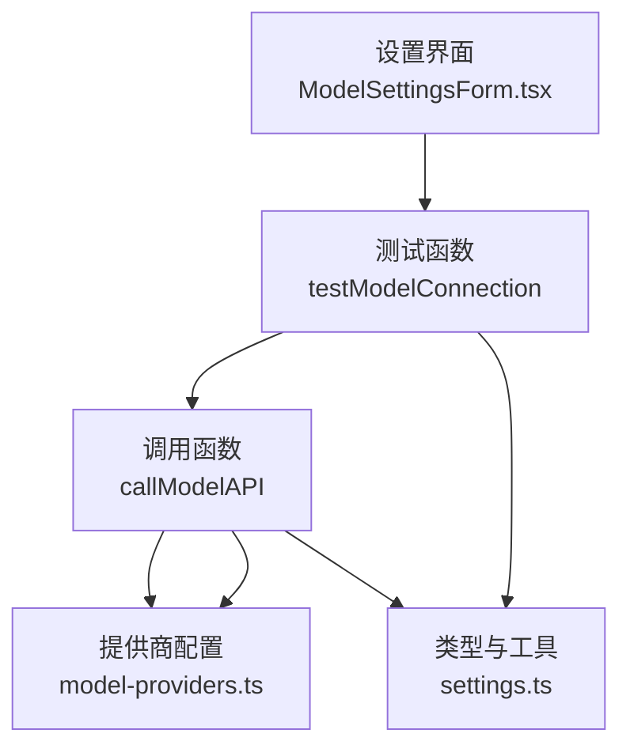
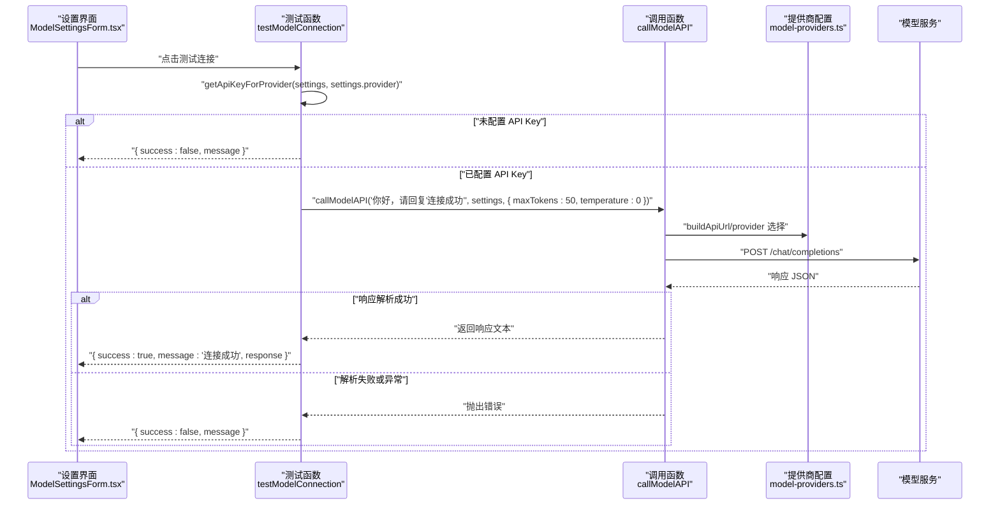
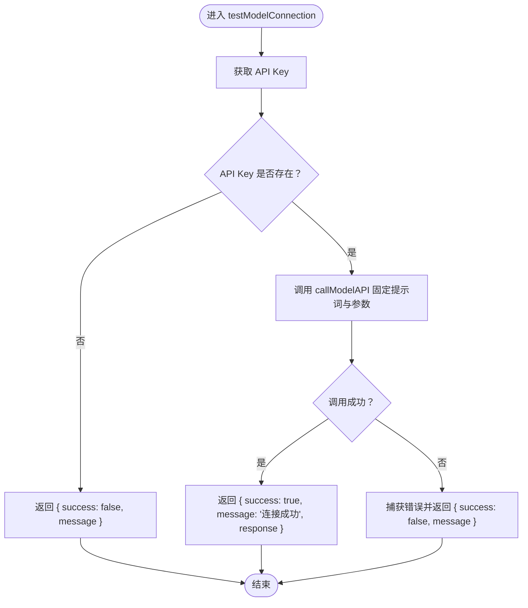
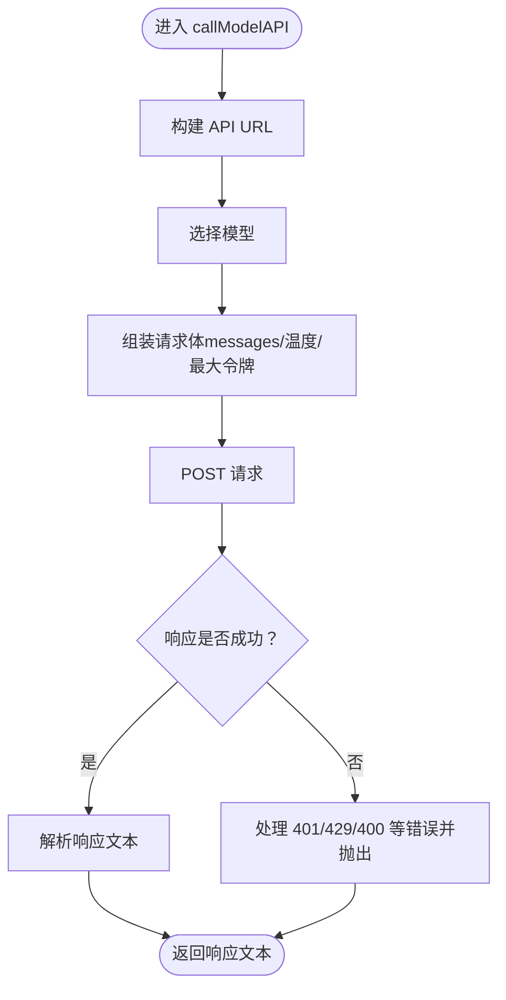
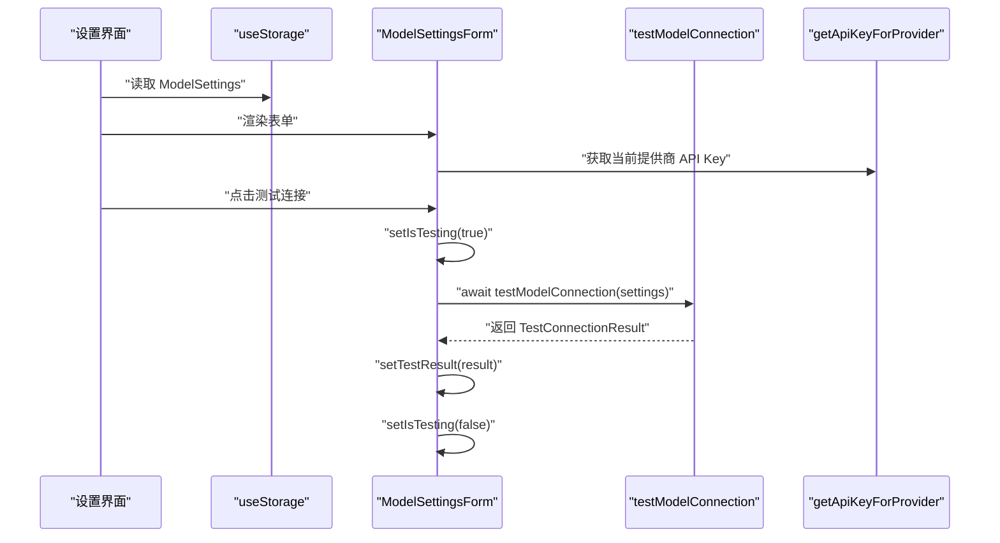
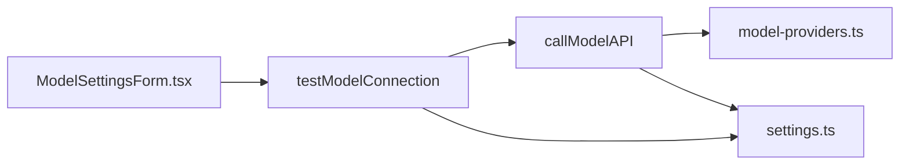

# 测试模型连接 (testModelConnection)

<cite>
**本文引用的文件**
- [src/services/model-api.ts](file://src/services/model-api.ts)
- [src/features/popup/settings/ModelSettingsForm.tsx](file://src/features/popup/settings/ModelSettingsForm.tsx)
- [src/types/settings.ts](file://src/types/settings.ts)
- [src/config/model-providers.ts](file://src/config/model-providers.ts)
</cite>

## 目录
1. [简介](#简介)
2. [项目结构](#项目结构)
3. [核心组件](#核心组件)
4. [架构总览](#架构总览)
5. [详细组件分析](#详细组件分析)
6. [依赖关系分析](#依赖关系分析)
7. [性能考量](#性能考量)
8. [故障排查指南](#故障排查指南)
9. [结论](#结论)
10. [附录](#附录)

## 简介
本文件为 testModelConnection 函数的详细 API 文档，目标是帮助开发者与使用者理解该函数如何验证用户配置的 AI 模型服务是否可用。文档涵盖：
- 参数 settings（ModelSettings 类型）的使用方式
- 如何通过 getApiKeyForProvider 获取对应提供商的 API Key 并进行有效性检查
- 函数内部调用 callModelAPI 发送测试请求（内容为“你好，请回复连接成功”）的流程，包括 maxTokens 和 temperature 的固定配置以确保测试稳定性
- 返回的 TestConnectionResult 对象结构：success（布尔值表示连接是否成功）、message（描述性信息）、response（可选的实际响应内容）
- 成功与失败场景的示例返回值
- 在 API Key 未配置、网络错误、认证失败等情况下的处理逻辑
- 实际调用示例，展示如何在设置界面中集成此功能进行实时连接测试

## 项目结构
围绕 testModelConnection 的关键文件与职责如下：
- src/services/model-api.ts：实现模型 API 调用与连接测试的核心逻辑
- src/features/popup/settings/ModelSettingsForm.tsx：设置界面中触发并展示测试结果的入口
- src/types/settings.ts：定义 ModelSettings、TestConnectionResult、CallModelOptions 等类型及 API Key 存取工具
- src/config/model-providers.ts：提供模型提供商的基础配置（URL、鉴权头、前缀等）

图表来源
- [src/features/popup/settings/ModelSettingsForm.tsx](file://src/features/popup/settings/ModelSettingsForm.tsx#L17-L20)
- [src/services/model-api.ts](file://src/services/model-api.ts#L37-L139)
- [src/types/settings.ts](file://src/types/settings.ts#L22-L121)
- [src/config/model-providers.ts](file://src/config/model-providers.ts#L8-L95)

章节来源
- [src/services/model-api.ts](file://src/services/model-api.ts#L37-L174)
- [src/features/popup/settings/ModelSettingsForm.tsx](file://src/features/popup/settings/ModelSettingsForm.tsx#L17-L20)
- [src/types/settings.ts](file://src/types/settings.ts#L22-L121)
- [src/config/model-providers.ts](file://src/config/model-providers.ts#L8-L95)

## 核心组件
- testModelConnection(settings: ModelSettings): Promise<TestConnectionResult>
  - 功能：验证用户配置的 AI 模型服务是否可用
  - 关键步骤：
    - 使用 getApiKeyForProvider(settings, settings.provider) 获取当前提供商的 API Key
    - 若未配置 API Key，立即返回 { success: false, message: "请先配置 API Key" }
    - 调用 callModelAPI("你好，请回复'连接成功'", settings, { maxTokens: 50, temperature: 0 }) 执行测试请求
    - 成功时返回 { success: true, message: "连接成功", response: 实际响应内容 }
    - 失败时捕获异常并返回 { success: false, message: 错误信息 }
- callModelAPI(prompt, settings, options): Promise<string>
  - 功能：通用模型 API 调用，构建请求体、发送请求、解析响应
  - 关键点：
    - 从 settings.provider 与 settings.customUrl 构建 API URL
    - 从 settings.model 或 options.model 选择模型
    - 从 options.temperature 与 options.maxTokens 控制推理参数
    - 统一处理 401、429、400 等状态码并抛出可读错误
    - 解析 choices[0].message.content 或兼容 output.text/result
- ModelSettings 类型
  - 字段：provider、model、customUrl（可选）、apiKeys（记录各提供商的 API Key）、apiKey（兼容旧版）
- TestConnectionResult 类型
  - 字段：success（布尔）、message（字符串）、response（可选字符串）

章节来源
- [src/services/model-api.ts](file://src/services/model-api.ts#L143-L174)
- [src/services/model-api.ts](file://src/services/model-api.ts#L37-L139)
- [src/types/settings.ts](file://src/types/settings.ts#L22-L121)

## 架构总览
下图展示了从设置界面到模型 API 的完整调用链路与错误处理路径。

图表来源
- [src/features/popup/settings/ModelSettingsForm.tsx](file://src/features/popup/settings/ModelSettingsForm.tsx#L75-L90)
- [src/services/model-api.ts](file://src/services/model-api.ts#L143-L174)
- [src/services/model-api.ts](file://src/services/model-api.ts#L37-L139)
- [src/config/model-providers.ts](file://src/config/model-providers.ts#L17-L33)

## 详细组件分析

### testModelConnection 函数
- 输入参数
  - settings: ModelSettings
    - 作用：承载当前选择的提供商、模型、自定义 URL、API Key 等配置
    - 通过 getApiKeyForProvider(settings, settings.provider) 获取当前提供商的 API Key
- 处理流程
  - 若 API Key 为空，直接返回失败结果
  - 否则调用 callModelAPI，传入固定提示词与固定推理参数（maxTokens: 50, temperature: 0），确保测试稳定
  - 成功时返回包含 success、message、response 的结果对象；失败时捕获异常并返回包含 success、message 的结果对象
- 返回值
  - TestConnectionResult：success（布尔）、message（字符串）、response（可选字符串）

图表来源
- [src/services/model-api.ts](file://src/services/model-api.ts#L143-L174)

章节来源
- [src/services/model-api.ts](file://src/services/model-api.ts#L143-L174)

### callModelAPI 函数
- 输入参数
  - prompt: string（测试提示词为“你好，请回复'连接成功'”）
  - settings: ModelSettings（决定 provider、model、customUrl）
  - options: CallModelOptions（可覆盖 temperature、maxTokens、model、systemPrompt）
- 关键逻辑
  - 构建 API URL：buildApiUrl(providerId, settings.customUrl)
  - 选择模型：settings.model 或 options.model，默认模型标识
  - 组装请求体：messages（system + user）、temperature、max_tokens、stream=false
  - 发送请求并统一处理非 2xx 状态码，抛出可读错误
  - 解析响应：优先 choices[0].message.content，其次 output.text 或 result
- 错误处理
  - 401：认证失败
  - 429：请求过于频繁
  - 400：请求参数错误
  - 其他：API 请求失败

图表来源
- [src/services/model-api.ts](file://src/services/model-api.ts#L37-L139)
- [src/config/model-providers.ts](file://src/config/model-providers.ts#L17-L33)

章节来源
- [src/services/model-api.ts](file://src/services/model-api.ts#L37-L139)
- [src/config/model-providers.ts](file://src/config/model-providers.ts#L17-L33)

### ModelSettings 与 TestConnectionResult 类型
- ModelSettings
  - provider: string（当前提供商）
  - model: string（当前模型）
  - customUrl?: string（自定义 URL，当 provider 为 custom 时生效）
  - apiKeys: Record<string, string>（按提供商独立存储 API Key）
  - apiKey?: string（兼容旧版）
- TestConnectionResult
  - success: boolean
  - message: string
  - response?: string（可选）

章节来源
- [src/types/settings.ts](file://src/types/settings.ts#L22-L121)

### API Key 存取工具
- getApiKeyForProvider(settings, providerId?)
  - 优先从 settings.apiKeys[providerId] 获取
  - 若不存在且存在旧版 settings.apiKey，则回退使用
  - 不存在时返回空字符串
- setApiKeyForProvider(settings, providerId, apiKey)
  - 返回新 settings，写入 apiKeys[providerId] = apiKey

章节来源
- [src/types/settings.ts](file://src/types/settings.ts#L49-L77)

### 设置界面集成与交互
- ModelSettingsForm.tsx
  - 通过 useStorage 读取/写入 ModelSettings
  - 使用 getApiKeyForProvider(settings, settings.provider) 获取当前提供商的 API Key
  - 点击“测试连接”按钮时：
    - setIsTesting(true)
    - 调用 testModelConnection(settings)
    - setTestResult(result)
    - 捕获异常并设置 { success: false, message }
    - 最终 setIsTesting(false)
  - 测试结果以颜色区分成功/失败并展示消息

图表来源
- [src/features/popup/settings/ModelSettingsForm.tsx](file://src/features/popup/settings/ModelSettingsForm.tsx#L26-L90)
- [src/types/settings.ts](file://src/types/settings.ts#L49-L77)

章节来源
- [src/features/popup/settings/ModelSettingsForm.tsx](file://src/features/popup/settings/ModelSettingsForm.tsx#L26-L90)
- [src/types/settings.ts](file://src/types/settings.ts#L49-L77)

## 依赖关系分析
- 组件耦合
  - testModelConnection 依赖：
    - getApiKeyForProvider（来自 settings.ts）
    - callModelAPI（来自 model-api.ts）
    - MODEL_PROVIDERS（来自 model-providers.ts）
- 数据流向
  - 设置界面 -> testModelConnection -> callModelAPI -> 模型服务
  - 错误在 callModelAPI 层统一处理并向上抛出
- 外部依赖
  - fetch（浏览器内置）
  - PROVIDER 配置（baseUrl、authHeader、authPrefix）

图表来源
- [src/features/popup/settings/ModelSettingsForm.tsx](file://src/features/popup/settings/ModelSettingsForm.tsx#L17-L20)
- [src/services/model-api.ts](file://src/services/model-api.ts#L37-L139)
- [src/types/settings.ts](file://src/types/settings.ts#L49-L77)
- [src/config/model-providers.ts](file://src/config/model-providers.ts#L8-L95)

章节来源
- [src/services/model-api.ts](file://src/services/model-api.ts#L37-L139)
- [src/types/settings.ts](file://src/types/settings.ts#L49-L77)
- [src/config/model-providers.ts](file://src/config/model-providers.ts#L8-L95)

## 性能考量
- 测试请求参数固定
  - maxTokens: 50，temperature: 0，确保测试快速、稳定、可控
- 响应解析
  - 优先解析 choices[0].message.content，其次兼容 output.text 或 result，减少额外解析成本
- 错误早返回
  - API Key 缺失时立即返回，避免无效网络请求
- UI 体验
  - 设置界面禁用按钮与显示加载状态，避免重复点击导致的资源浪费

[本节为通用指导，不涉及特定文件分析]

## 故障排查指南
- API Key 未配置
  - 现象：返回 { success: false, message: "请先配置 API Key" }
  - 处理：在设置界面输入对应提供商的 API Key 后重试
- 认证失败（401）
  - 现象：返回包含“API 认证失败，请检查 API Key 是否正确”的错误信息
  - 处理：确认 API Key 正确、提供商与模型选择无误
- 请求过于频繁（429）
  - 现象：返回“请求过于频繁，请稍后再试”
  - 处理：等待一段时间后重试
- 请求参数错误（400）
  - 现象：返回“请求参数错误: ...”
  - 处理：检查模型、自定义 URL、系统提示词等配置
- 其他网络/服务端错误
  - 现象：返回“API 请求失败: 状态码 - 错误详情”
  - 处理：检查网络连通性、服务端状态、URL 格式（custom 模式需以 /chat/completions 结尾）
- 响应解析失败
  - 现象：抛出“无法解析模型响应”
  - 处理：确认服务端返回格式与 SDK 兼容

章节来源
- [src/services/model-api.ts](file://src/services/model-api.ts#L98-L139)

## 结论
testModelConnection 通过固定提示词与推理参数，结合统一的错误处理与响应解析策略，为用户提供了一种稳定、直观的模型服务可用性验证方式。配合设置界面的实时测试与结果反馈，能够显著降低配置门槛与排错成本。

[本节为总结性内容，不涉及特定文件分析]

## 附录

### API 定义与示例

- 函数签名
  - testModelConnection(settings: ModelSettings): Promise<TestConnectionResult>
- 参数
  - settings: ModelSettings
    - provider: string（当前提供商）
    - model: string（当前模型）
    - customUrl?: string（自定义 URL，当 provider 为 custom 时生效）
    - apiKeys: Record<string, string>（按提供商独立存储 API Key）
    - apiKey?: string（兼容旧版）
- 返回值
  - TestConnectionResult
    - success: boolean
    - message: string
    - response?: string（可选）

- 示例返回值
  - 成功
    - { success: true, message: "连接成功", response: "连接成功" }
  - 失败（API Key 未配置）
    - { success: false, message: "请先配置 API Key" }
  - 失败（认证失败）
    - { success: false, message: "API 认证失败，请检查 API Key 是否正确" }
  - 失败（网络/服务端错误）
    - { success: false, message: "API 请求失败: 500 - 服务器内部错误" }

- 实际调用示例（设置界面集成）
  - 触发条件：用户点击“测试连接”按钮
  - 流程要点：
    - 禁用按钮并显示“测试中...”
    - 调用 testModelConnection(settings)
    - 展示结果：成功绿色高亮，失败红色高亮
    - 重置状态：最终恢复按钮可用

章节来源
- [src/services/model-api.ts](file://src/services/model-api.ts#L143-L174)
- [src/types/settings.ts](file://src/types/settings.ts#L22-L121)
- [src/features/popup/settings/ModelSettingsForm.tsx](file://src/features/popup/settings/ModelSettingsForm.tsx#L75-L90)