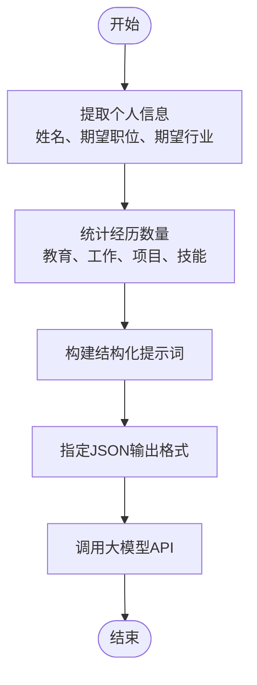
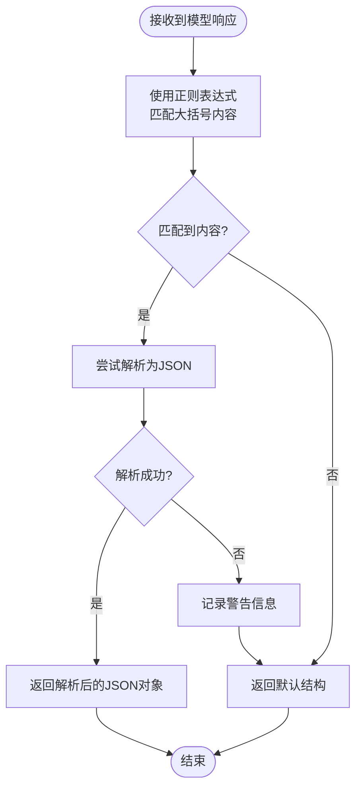

# 生成简历建议 (generateResumeSuggestions)

<cite>
**本文档引用的文件**   
- [model-api.ts](file://src/services/model-api.ts#L237-L286)
- [resume.ts](file://src/types/resume.ts#L89-L134)
- [settings.ts](file://src/types/settings.ts#L22-L30)
</cite>

## 目录
1. [简介](#简介)
2. [核心功能分析](#核心功能分析)
3. [参数说明](#参数说明)
4. [提示词构建机制](#提示词构建机制)
5. [JSON响应解析策略](#json响应解析策略)
6. [成功响应示例](#成功响应示例)
7. [降级处理方案](#降级处理方案)
8. [应用场景](#应用场景)
9. [错误处理机制](#错误处理机制)

## 简介
`generateResumeSuggestions`函数是简历智能诊断系统的核心功能之一，用于分析简历的完整性并提供优化建议。该函数通过调用大模型API，基于用户提供的简历数据和模型设置，生成包含完整性评分、具体建议和实用小贴士的结构化反馈。此功能在"简历健康度评估"和"智能诊断"等场景中发挥重要作用，帮助用户提升简历质量。

## 核心功能分析

`generateResumeSuggestions`函数的主要职责是作为专业的简历顾问，根据用户提供的简历信息生成改进建议。函数接收简历数据对象和模型设置作为输入参数，构建针对性的提示词(prompt)，调用大模型API获取响应，并对响应进行解析处理，最终返回结构化的建议结果。

该函数实现了完整的错误处理机制，包括对API调用失败的异常捕获和对JSON解析失败的降级处理。当模型返回的响应无法解析为预期的JSON格式时，函数会将原始响应作为建议内容返回，确保功能的健壮性和用户体验的连续性。

**Section sources**
- [model-api.ts](file://src/services/model-api.ts#L237-L286)

## 参数说明

### resumeData 参数
`resumeData`参数是一个包含完整简历数据的对象，其结构定义在`types/resume.ts`文件中。该对象包含以下主要属性：

- `personalInfo`: 个人基本信息，包括姓名、性别、出生日期、电话、邮箱等
- `jobExpectation`: 求职期望，包括期望职位、期望行业、期望薪资等
- `education`: 教育经历数组
- `workExperience`: 工作/实习经历数组
- `projects`: 项目经历数组
- `skills`: 技能数组
- `languages`: 语言能力数组
- `customFields`: 自定义字段数组

### settings 参数
`settings`参数是模型设置对象，定义了调用大模型API所需的配置信息。该对象包含以下关键属性：

- `provider`: 模型提供商（如deepseek、kimi等）
- `model`: 使用的具体模型名称
- `customUrl`: 自定义API URL（可选）
- `apiKeys`: 各提供商独立存储的API密钥

**Section sources**
- [resume.ts](file://src/types/resume.ts#L89-L134)
- [settings.ts](file://src/types/settings.ts#L22-L30)

## 提示词构建机制

`generateResumeSuggestions`函数通过精心设计的模板构建提示词，确保向大模型提供足够的上下文信息。提示词的构建过程包括以下关键步骤：

1. **提取个人信息**：从`resumeData.personalInfo`中提取姓名、期望职位和期望行业等关键信息
2. **统计经历数量**：计算教育经历、工作经历、项目经历和技能的数量
3. **构建结构化提示**：将提取的信息组织成易于理解的格式，明确要求模型提供简历完整性评估、内容优化建议和针对目标职位的建议
4. **指定输出格式**：明确要求模型以JSON格式返回结果，包含completeness、suggestions和tips三个字段



**Diagram sources **
- [model-api.ts](file://src/services/model-api.ts#L247-L263)

## JSON响应解析策略

`generateResumeSuggestions`函数采用稳健的JSON响应解析策略，确保能够正确处理各种可能的响应情况。解析过程包含以下步骤：

1. **正则表达式匹配**：使用正则表达式`/\{[\s\S]*\}/`匹配响应中的第一个大括号包裹的内容块
2. **JSON解析尝试**：尝试将匹配到的内容解析为JSON对象
3. **异常处理**：如果解析失败，则记录警告信息并进入降级处理流程
4. **结果返回**：成功解析则返回JSON对象，失败则返回包含原始响应的默认结构



**Diagram sources **
- [model-api.ts](file://src/services/model-api.ts#L268-L282)

## 成功响应示例

当`generateResumeSuggestions`函数成功执行并收到有效的JSON响应时，会返回包含完整性评分、建议和小贴士的结构化对象。以下是一个成功的响应示例：

```json
{
  "completeness": 85,
  "suggestions": [
    "建议在教育经历中补充GPA或排名信息",
    "工作经历描述可以更加量化，添加具体成果数据",
    "项目经历中应突出个人贡献和技术栈"
  ],
  "tips": [
    "使用STAR法则描述项目经历",
    "每段工作经历保持3-5个要点",
    "技能部分按熟练程度分类展示"
  ]
}
```

此响应表明简历完整性评分为85分（满分100），并提供了具体的优化建议和实用小贴士，帮助用户有针对性地改进简历内容。

**Section sources**
- [model-api.ts](file://src/services/model-api.ts#L270-L273)

## 降级处理方案

为了确保函数的健壮性，`generateResumeSuggestions`实现了完善的降级处理机制。当模型返回的响应无法解析为JSON格式时，函数会执行以下降级方案：

1. **捕获解析异常**：在`JSON.parse()`调用周围使用try-catch块捕获解析错误
2. **记录警告信息**：在控制台输出警告信息"无法解析为 JSON，返回原始响应"
3. **返回默认结构**：构造一个包含默认值的响应对象，其中：
   - `completeness`设置为0
   - `suggestions`数组包含原始响应内容
   - `tips`数组为空

这种降级处理确保了即使在异常情况下，函数也能返回有意义的结果，避免了程序崩溃，同时为用户提供原始的模型响应内容作为参考。

**Section sources**
- [model-api.ts](file://src/services/model-api.ts#L274-L282)

## 应用场景

`generateResumeSuggestions`函数在以下典型场景中发挥重要作用：

### 简历健康度评估
作为简历健康度评估功能的核心，该函数可以定期对用户的简历进行扫描和评估，提供实时的完整性评分和改进建议。用户可以通过评分变化趋势了解简历优化的进展。

### 智能诊断
在智能诊断模式下，该函数可以深入分析简历内容，识别潜在问题，如：
- 信息缺失（如缺少项目成果数据）
- 描述不够专业（如使用模糊的形容词）
- 结构不合理（如经历描述过长或过短）

### 求职准备辅助
当用户准备申请特定职位时，该函数可以根据期望职位和行业信息，提供针对性的优化建议，帮助用户定制化简历内容，提高求职成功率。

**Section sources**
- [model-api.ts](file://src/services/model-api.ts#L258-L262)

## 错误处理机制

`generateResumeSuggestions`函数实现了全面的错误处理机制，确保在各种异常情况下都能提供适当的反馈：

1. **API调用异常**：在调用`callModelAPI`时使用try-catch块捕获所有异常
2. **错误日志记录**：在控制台记录详细的错误信息"生成简历建议失败:"
3. **异常重新抛出**：捕获到的异常会被重新抛出，以便上层调用者进行进一步处理
4. **用户友好提示**：在UI层面，错误信息会被转换为用户友好的提示，避免显示技术性错误

这种分层的错误处理策略既保证了程序的稳定性，又提供了良好的用户体验，使用户能够理解问题所在并采取相应措施。

**Section sources**
- [model-api.ts](file://src/services/model-api.ts#L283-L285)