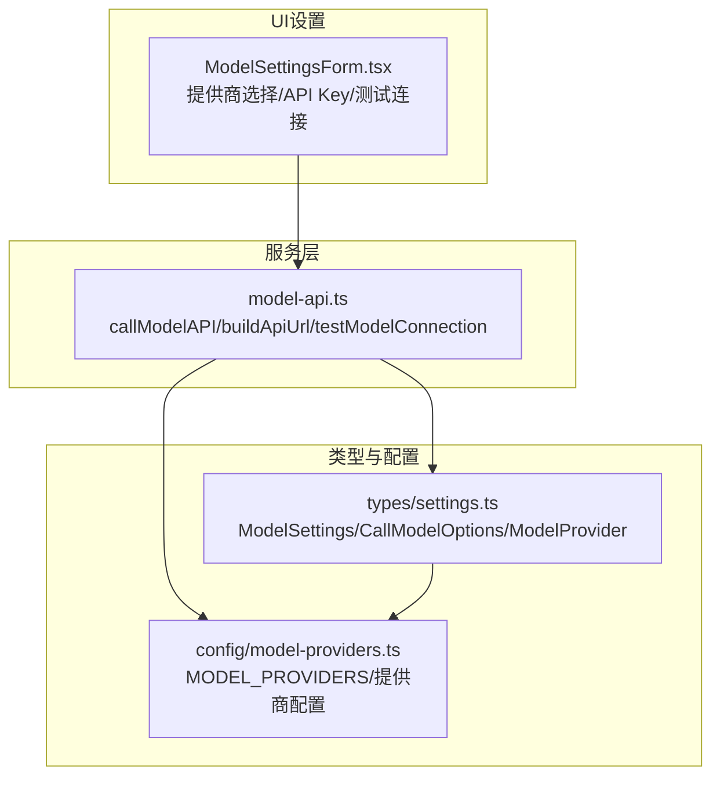
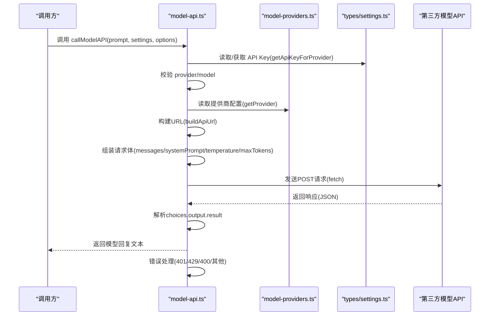
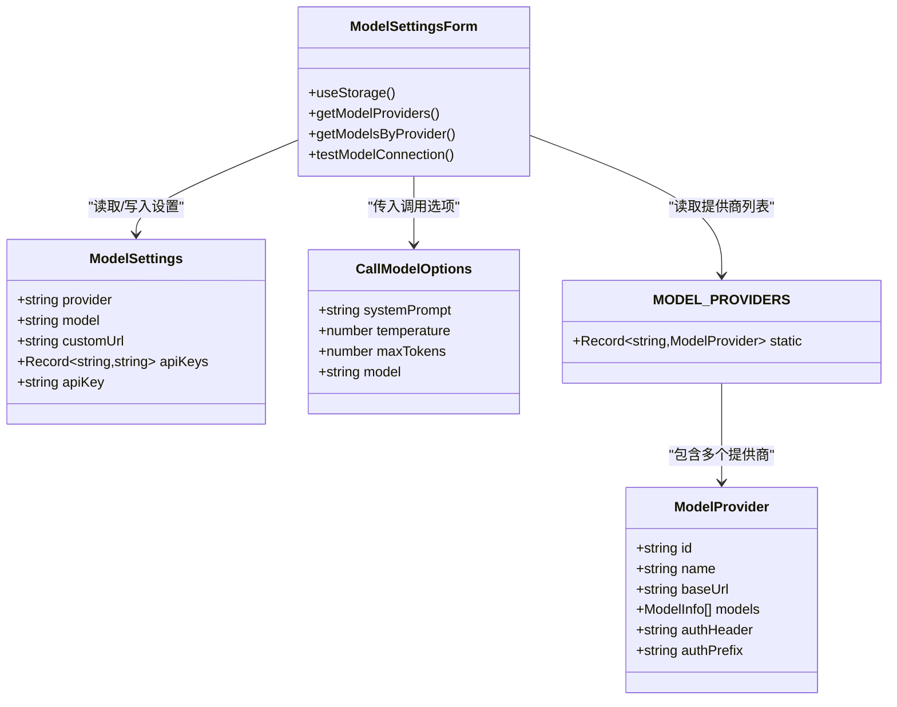
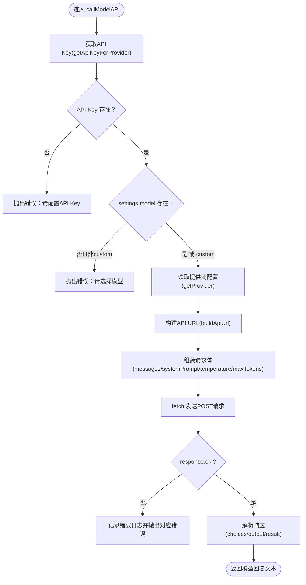

# 调用大模型API (callModelAPI)

<cite>
**本文引用的文件**
- [src/services/model-api.ts](file://src/services/model-api.ts)
- [src/config/model-providers.ts](file://src/config/model-providers.ts)
- [src/types/settings.ts](file://src/types/settings.ts)
- [src/features/popup/settings/ModelSettingsForm.tsx](file://src/features/popup/settings/ModelSettingsForm.tsx)
</cite>

## 目录
1. [简介](#简介)
2. [项目结构](#项目结构)
3. [核心组件](#核心组件)
4. [架构总览](#架构总览)
5. [详细组件分析](#详细组件分析)
6. [依赖关系分析](#依赖关系分析)
7. [性能考虑](#性能考虑)
8. [故障排查指南](#故障排查指南)
9. [结论](#结论)
10. [附录](#附录)

## 简介
本文件为 callModelAPI 函数的详细API文档，面向开发者与非技术读者，系统阐述其参数、请求构建逻辑、认证机制、请求体结构、默认值与覆盖规则、响应解析策略、调用示例、常见错误码与解决方案，以及错误日志输出机制。该函数统一抽象了对多家国产大模型提供商（DeepSeek、Kimi、通义千问、火山引擎、智谱AI、百川智能等）的调用流程，支持自定义URL（OpenAI兼容）与多提供商独立API Key管理。

## 项目结构
与callModelAPI相关的代码主要分布在以下模块：
- 服务层：封装模型API调用、URL构建、连接测试与字段优化等能力
- 类型定义：模型提供商、设置、调用选项等类型
- 配置：各提供商的基础URL、认证头、前缀、模型列表
- UI设置：提供者选择、模型选择、API Key输入、连接测试入口

图表来源
- [src/services/model-api.ts](file://src/services/model-api.ts#L1-L161)
- [src/config/model-providers.ts](file://src/config/model-providers.ts#L1-L95)
- [src/types/settings.ts](file://src/types/settings.ts#L1-L121)
- [src/features/popup/settings/ModelSettingsForm.tsx](file://src/features/popup/settings/ModelSettingsForm.tsx#L1-L235)

章节来源
- [src/services/model-api.ts](file://src/services/model-api.ts#L1-L161)
- [src/config/model-providers.ts](file://src/config/model-providers.ts#L1-L95)
- [src/types/settings.ts](file://src/types/settings.ts#L1-L121)
- [src/features/popup/settings/ModelSettingsForm.tsx](file://src/features/popup/settings/ModelSettingsForm.tsx#L1-L235)

## 核心组件
- callModelAPI：对外暴露的统一调用接口，负责参数校验、URL构建、请求头组装、请求体构造、响应解析与错误处理。
- buildApiUrl：根据providerId与customUrl生成最终API端点，支持“自定义”模式。
- testModelConnection：基于callModelAPI的轻量测试，验证API Key与连通性。
- ModelSettings/CallModelOptions/ModelProvider：类型定义，约束参数结构与默认行为。
- MODEL_PROVIDERS：提供商配置集合，包含baseUrl、authHeader、authPrefix、模型列表等。

章节来源
- [src/services/model-api.ts](file://src/services/model-api.ts#L16-L139)
- [src/types/settings.ts](file://src/types/settings.ts#L1-L121)
- [src/config/model-providers.ts](file://src/config/model-providers.ts#L1-L95)

## 架构总览
callModelAPI的调用序列如下：

图表来源
- [src/services/model-api.ts](file://src/services/model-api.ts#L37-L139)
- [src/config/model-providers.ts](file://src/config/model-providers.ts#L1-L95)
- [src/types/settings.ts](file://src/types/settings.ts#L46-L77)

## 详细组件分析

### 函数签名与参数说明
- 函数名：callModelAPI
- 参数
  - prompt: string，发送给模型的提示词
  - settings: ModelSettings，包含provider、model、customUrl、apiKeys等
  - options: CallModelOptions，可选参数包括systemPrompt、temperature、maxTokens、model
- 返回值：Promise<string>，模型返回的文本内容
- 抛出异常：当缺少API Key、未选择模型、未知提供商或HTTP状态码异常时抛出错误

章节来源
- [src/services/model-api.ts](file://src/services/model-api.ts#L37-L139)
- [src/types/settings.ts](file://src/types/settings.ts#L22-L30)
- [src/types/settings.ts](file://src/types/settings.ts#L109-L114)

### 请求构建逻辑
- providerId选择与默认值
  - 若settings.provider为空，默认使用"deepseek"
- API Key获取
  - 通过getApiKeyForProvider(settings, providerId)按提供商独立获取
  - 若未配置API Key，直接抛错
- 模型ID选择优先级
  - settings.model > options.model > 默认值"deepseek-chat"
- URL构建
  - providerId为"custom"且settings.customUrl存在时，确保URL以"/chat/completions"结尾
  - 否则从MODEL_PROVIDERS中读取baseUrl并拼接"/chat/completions"
- 请求头
  - Content-Type: application/json
  - 动态认证头：headers[provider.authHeader] = provider.authPrefix + apiKey
  - 不同提供商的认证头与前缀由MODEL_PROVIDERS统一配置
- 请求体
  - model: 上述确定的modelId
  - messages: 数组，包含system与user两条消息
    - system：content来自options.systemPrompt或默认中文系统提示
    - user：content来自prompt
  - temperature: options.temperature或默认0.7
  - max_tokens: options.maxTokens或默认2000
  - stream: false（非流式）

章节来源
- [src/services/model-api.ts](file://src/services/model-api.ts#L37-L139)
- [src/services/model-api.ts](file://src/services/model-api.ts#L16-L33)
- [src/config/model-providers.ts](file://src/config/model-providers.ts#L1-L95)
- [src/types/settings.ts](file://src/types/settings.ts#L46-L77)

### system prompt默认值与覆盖机制
- 默认值：中文系统提示，引导模型扮演“简历填写助手”
- 覆盖规则：若options.systemPrompt存在，则使用options.systemPrompt；否则使用默认值
- 作用：限定模型行为与输出风格，便于简历优化场景的一致性

章节来源
- [src/services/model-api.ts](file://src/services/model-api.ts#L70-L87)

### temperature与max_tokens默认配置与优先级
- 默认值
  - temperature: 0.7
  - max_tokens: 2000
- 优先级：options中的值优先于默认值
- 影响：temperature控制创造性，max_tokens控制最大输出长度

章节来源
- [src/services/model-api.ts](file://src/services/model-api.ts#L83-L86)

### 多提供商认证机制
- API Key获取
  - getApiKeyForProvider(settings, providerId)优先从settings.apiKeys[provider]取值
  - 若不存在则回退到旧版settings.apiKey
  - 未配置时抛错
- 认证头差异
  - 不同提供商通过MODEL_PROVIDERS配置不同的authHeader与authPrefix
  - 示例：DeepSeek/Kimi/Qwen/Volcengine/Zhipu/Baichuan均为"Authorization: Bearer ..."格式
- 自定义URL
  - providerId为"custom"时，使用settings.customUrl作为基础地址
  - URL末尾自动补齐"/chat/completions"

章节来源
- [src/types/settings.ts](file://src/types/settings.ts#L46-L77)
- [src/config/model-providers.ts](file://src/config/model-providers.ts#L1-L95)
- [src/services/model-api.ts](file://src/services/model-api.ts#L16-L33)

### 响应解析策略
- 优先解析OpenAI风格的choices[0].message.content
- 兼容性处理
  - 若返回结构包含output.text，则提取output.text
  - 若返回结构包含result，则直接返回result
- 解析失败：抛出“无法解析模型响应”的错误

章节来源
- [src/services/model-api.ts](file://src/services/model-api.ts#L118-L139)

### 调用示例（步骤说明）
以下为在不同场景下的调用步骤，不直接展示代码片段：
- 配置DeepSeek
  - 在设置中选择provider为"deepseek"，填写对应API Key
  - 调用callModelAPI(prompt, settings, options)，其中options可传入systemPrompt、temperature、maxTokens
- 配置通义千问
  - 选择provider为"qwen"，填写DashScope API Key
  - 调用时可按需覆盖systemPrompt与温度参数
- 配置Kimi
  - 选择provider为"kimi"，填写Moonshot API Key
  - 可通过options调整maxTokens以适配长文本
- 配置自定义URL（OpenAI兼容）
  - 选择provider为"custom"，填写customUrl（如https://your-api.com/v1）
  - 调用时可传入自定义model（如gpt-4o-mini）与temperature、maxTokens

章节来源
- [src/features/popup/settings/ModelSettingsForm.tsx](file://src/features/popup/settings/ModelSettingsForm.tsx#L113-L209)
- [src/services/model-api.ts](file://src/services/model-api.ts#L37-L139)

### 错误码与解决方案
- 401 认证失败
  - 触发条件：HTTP 401 Unauthorized
  - 解决方案：检查API Key是否正确、是否与所选提供商匹配、是否过期
- 429 频率限制
  - 触发条件：HTTP 429 Too Many Requests
  - 解决方案：降低请求频率，增加延时或减少并发
- 400 参数错误
  - 触发条件：HTTP 400 Bad Request
  - 解决方案：检查modelId是否有效、请求体字段是否完整、URL是否正确
- 其他错误
  - 触发条件：其他HTTP状态码或网络异常
  - 解决方案：查看控制台错误日志，确认URL、认证头、请求体结构

章节来源
- [src/services/model-api.ts](file://src/services/model-api.ts#L98-L117)

### 错误日志输出机制
- 当HTTP响应非OK时，会打印包含status、statusText与errorText的日志
- 对401/429/400分别给出明确的错误提示
- 成功响应后打印响应JSON，便于调试

章节来源
- [src/services/model-api.ts](file://src/services/model-api.ts#L98-L121)

## 依赖关系分析

图表来源
- [src/types/settings.ts](file://src/types/settings.ts#L1-L121)
- [src/config/model-providers.ts](file://src/config/model-providers.ts#L1-L95)
- [src/features/popup/settings/ModelSettingsForm.tsx](file://src/features/popup/settings/ModelSettingsForm.tsx#L1-L235)

章节来源
- [src/types/settings.ts](file://src/types/settings.ts#L1-L121)
- [src/config/model-providers.ts](file://src/config/model-providers.ts#L1-L95)
- [src/features/popup/settings/ModelSettingsForm.tsx](file://src/features/popup/settings/ModelSettingsForm.tsx#L1-L235)

## 性能考虑
- 请求频率控制：在批量优化场景中，建议适当延时以避免429限流
- 输出长度控制：合理设置maxTokens，避免超长响应导致解析与传输开销
- 认证头复用：同一提供商下保持API Key不变，减少重复配置成本
- URL规范化：自定义URL时确保以"/chat/completions"结尾，避免额外重定向

[本节为通用建议，不直接分析具体文件]

## 故障排查指南
- API Key未配置或错误
  - 现象：抛出“请先在设置中配置模型 API Key”
  - 处理：在设置界面为当前提供商填写正确的API Key
- 未选择模型
  - 现象：抛出“请先在设置中选择要使用的模型”
  - 处理：在设置中选择合适的模型ID（自定义模式除外）
- 未知提供商
  - 现象：抛出“未知的模型提供商”
  - 处理：检查settings.provider是否为已支持的ID之一
- 401认证失败
  - 现象：控制台打印401并提示认证失败
  - 处理：核对API Key、提供商选择、网络环境
- 429频率限制
  - 现象：控制台打印429并提示稍后再试
  - 处理：降低请求频率或增加延时
- 400参数错误
  - 现象：控制台打印400并附带错误文本
  - 处理：检查modelId、请求体字段、URL
- 响应解析失败
  - 现象：抛出“无法解析模型响应”
  - 处理：确认返回格式是否符合choices/output/result任一结构

章节来源
- [src/services/model-api.ts](file://src/services/model-api.ts#L47-L53)
- [src/services/model-api.ts](file://src/services/model-api.ts#L54-L59)
- [src/services/model-api.ts](file://src/services/model-api.ts#L98-L139)
- [src/features/popup/settings/ModelSettingsForm.tsx](file://src/features/popup/settings/ModelSettingsForm.tsx#L70-L90)

## 结论
callModelAPI通过统一的参数体系、URL构建与认证机制，实现了对多家国产大模型提供商的无缝接入。其默认值与覆盖规则清晰，响应解析策略兼顾主流格式，配合完善的错误处理与日志输出，能够满足简历优化等场景的稳定调用需求。建议在生产环境中结合限流策略与合理的参数配置，以获得更佳的稳定性与性能表现。

[本节为总结性内容，不直接分析具体文件]

## 附录

### 常见提供商与认证头对照
- DeepSeek、Kimi、通义千问、火山引擎、智谱AI、百川智能、自定义（OpenAI兼容）
- 共同特征：Authorization: Bearer <API_KEY>

章节来源
- [src/config/model-providers.ts](file://src/config/model-providers.ts#L1-L95)

### 关键流程图：callModelAPI内部执行

图表来源
- [src/services/model-api.ts](file://src/services/model-api.ts#L37-L139)