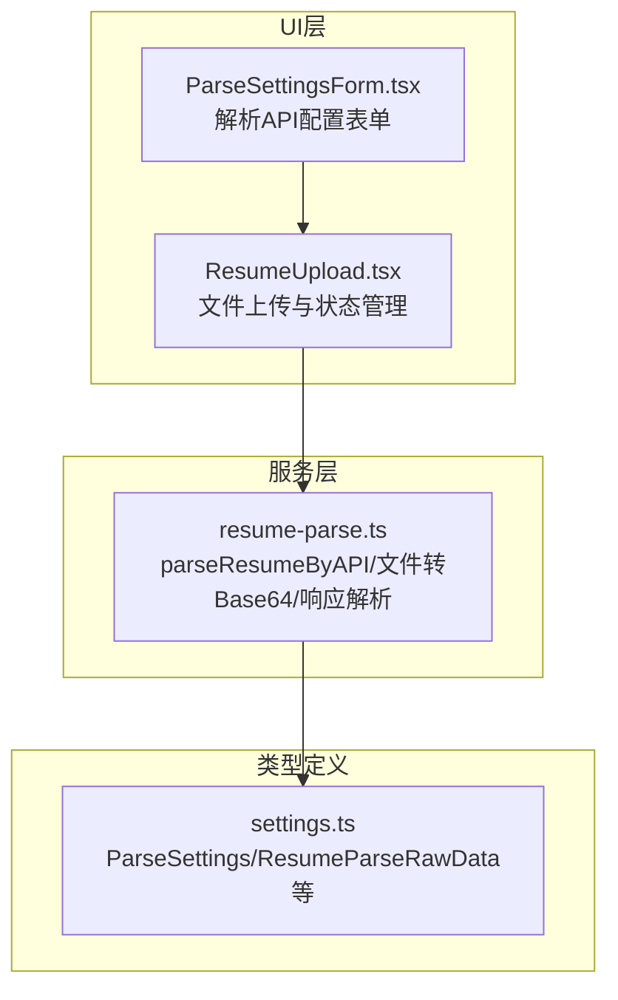
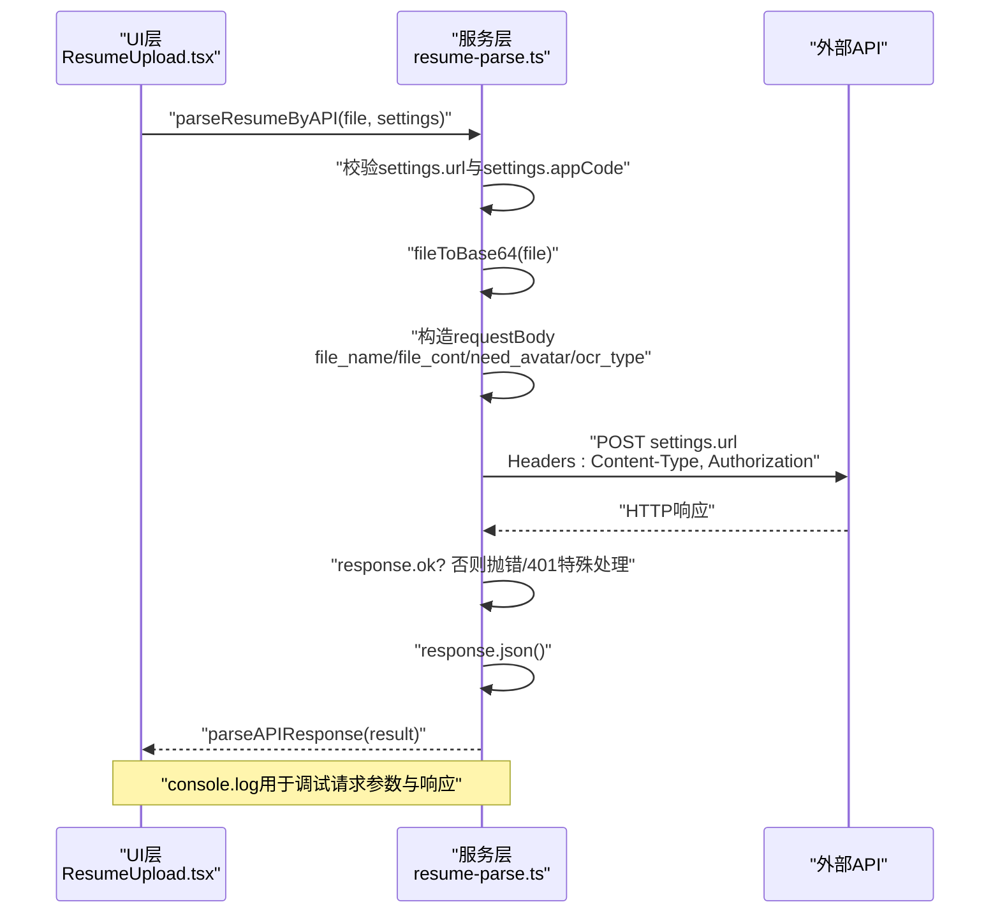
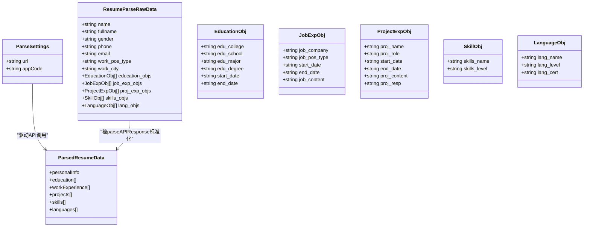

# API请求构建与认证

<cite>
**本文引用的文件列表**
- [src/services/resume-parse.ts](file://src/services/resume-parse.ts)
- [src/features/popup/ResumeUpload.tsx](file://src/features/popup/ResumeUpload.tsx)
- [src/features/popup/settings/ParseSettingsForm.tsx](file://src/features/popup/settings/ParseSettingsForm.tsx)
- [src/types/settings.ts](file://src/types/settings.ts)
</cite>

## 目录
1. [引言](#引言)
2. [项目结构](#项目结构)
3. [核心组件](#核心组件)
4. [架构总览](#架构总览)
5. [详细组件分析](#详细组件分析)
6. [依赖关系分析](#依赖关系分析)
7. [性能考量](#性能考量)
8. [故障排查指南](#故障排查指南)
9. [结论](#结论)

## 引言
本文聚焦于简历解析API调用流程中的请求构建与认证机制，围绕以下关键点展开：
- settings.url与settings.appCode的配置校验机制
- requestBody中file_name、file_cont、need_avatar、ocr_type字段的语义与取值规则
- Authorization请求头采用“APPCODE + appCode”的认证模式及Content-Type为“application/json; charset=UTF-8”的必要性
- fetch请求的POST方法实现、JSON.stringify序列化过程
- HTTP状态码（尤其是401）的错误处理策略
- 请求日志输出（console.log）的调试价值分析

## 项目结构
该功能位于前端插件的“服务层”与“UI层”之间，服务层负责将本地文件转为Base64并调用外部API；UI层负责用户交互与配置输入。

图表来源
- [src/features/popup/ResumeUpload.tsx](file://src/features/popup/ResumeUpload.tsx#L1-L260)
- [src/features/popup/settings/ParseSettingsForm.tsx](file://src/features/popup/settings/ParseSettingsForm.tsx#L1-L99)
- [src/services/resume-parse.ts](file://src/services/resume-parse.ts#L1-L109)
- [src/types/settings.ts](file://src/types/settings.ts#L32-L83)

章节来源
- [src/features/popup/ResumeUpload.tsx](file://src/features/popup/ResumeUpload.tsx#L1-L260)
- [src/features/popup/settings/ParseSettingsForm.tsx](file://src/features/popup/settings/ParseSettingsForm.tsx#L1-L99)
- [src/services/resume-parse.ts](file://src/services/resume-parse.ts#L1-L109)
- [src/types/settings.ts](file://src/types/settings.ts#L32-L83)

## 核心组件
- parseResumeByAPI：封装了文件转Base64、请求体构造、fetch调用、错误处理与响应解析的完整流程。
- fileToBase64：将浏览器File对象转换为Base64字符串，供API请求体使用。
- parseAPIResponse：将API返回的原始数据结构标准化为统一的表单可用结构。
- ParseSettings与ResumeParseRawData：定义解析API所需的配置与响应数据结构。

章节来源
- [src/services/resume-parse.ts](file://src/services/resume-parse.ts#L19-L109)
- [src/types/settings.ts](file://src/types/settings.ts#L32-L83)
- [src/types/settings.ts](file://src/types/settings.ts#L124-L191)

## 架构总览
下面的时序图展示了从用户上传文件到收到解析结果的关键步骤，包括请求构建、认证、错误处理与日志输出。

图表来源
- [src/features/popup/ResumeUpload.tsx](file://src/features/popup/ResumeUpload.tsx#L64-L81)
- [src/services/resume-parse.ts](file://src/services/resume-parse.ts#L38-L109)

## 详细组件分析

### 请求构建与配置校验
- settings.url与settings.appCode的校验
  - 在调用API前，若settings.url或settings.appCode缺失，将抛出明确的错误信息，提示用户前往设置中完善配置。
  - UI层在用户选择非JSON文件时也会提前校验配置，避免无效请求。
- requestBody字段语义与取值规则
  - file_name：简历文件名（需包含正确的后缀名）。用于标识文件类型与后续处理。
  - file_cont：Base64编码的简历内容。由fileToBase64生成，确保二进制数据以文本形式传输。
  - need_avatar：是否需要提取头像图片。当前固定为0（不提取）。
  - ocr_type：OCR类型。当前固定为1（高级OCR）。
- Authorization与Content-Type
  - Authorization采用“APPCODE + appCode”的认证模式，符合阿里云API的认证约定。
  - Content-Type设置为“application/json; charset=UTF-8”，确保服务端正确解析JSON负载并处理中文字符。

章节来源
- [src/services/resume-parse.ts](file://src/services/resume-parse.ts#L48-L70)
- [src/services/resume-parse.ts](file://src/services/resume-parse.ts#L56-L62)
- [src/services/resume-parse.ts](file://src/services/resume-parse.ts#L72-L80)
- [src/features/popup/ResumeUpload.tsx](file://src/features/popup/ResumeUpload.tsx#L64-L69)

### fetch请求与JSON序列化
- 方法与URL：使用POST方法向settings.url发起请求。
- 请求头：
  - Content-Type：application/json; charset=UTF-8
  - Authorization：APPCODE + appCode
- 请求体：通过JSON.stringify(requestBody)将对象序列化为JSON字符串。
- 响应处理：
  - 若response.ok为false，读取响应文本并记录详细错误信息，随后根据状态码抛出异常。
  - 对401状态码进行特殊处理，提示认证失败并引导检查APP Code有效性。
  - 成功时解析JSON并交由parseAPIResponse进行结构化处理。

章节来源
- [src/services/resume-parse.ts](file://src/services/resume-parse.ts#L72-L109)

### 错误处理策略（HTTP状态码）
- 通用错误：当response.ok为false时，读取响应文本并抛出包含状态码、状态文本与错误详情的错误信息。
- 401错误：明确提示认证失败，建议检查APP Code是否正确、服务是否激活或已过期。
- UI层：捕获异常并设置错误状态与消息，便于用户感知与重试。

章节来源
- [src/services/resume-parse.ts](file://src/services/resume-parse.ts#L82-L101)
- [src/features/popup/ResumeUpload.tsx](file://src/features/popup/ResumeUpload.tsx#L81-L87)

### 日志输出与调试价值
- 请求参数日志：打印url、file_name、file_size、base64长度与appCode存在性，便于快速核对请求构造是否正确。
- 响应日志：打印API响应，便于比对服务端返回结构与预期差异。
- 错误日志：打印状态码、状态文本、错误文本与URL，有助于定位网络或认证问题。

章节来源
- [src/services/resume-parse.ts](file://src/services/resume-parse.ts#L42-L46)
- [src/services/resume-parse.ts](file://src/services/resume-parse.ts#L64-L70)
- [src/services/resume-parse.ts](file://src/services/resume-parse.ts#L84-L90)
- [src/services/resume-parse.ts](file://src/services/resume-parse.ts#L104-L106)

### 类关系与数据模型

图表来源
- [src/types/settings.ts](file://src/types/settings.ts#L32-L83)
- [src/types/settings.ts](file://src/types/settings.ts#L124-L191)

章节来源
- [src/types/settings.ts](file://src/types/settings.ts#L32-L83)
- [src/types/settings.ts](file://src/types/settings.ts#L124-L191)

## 依赖关系分析
- UI层依赖服务层提供的parseResumeByAPI接口；同时依赖ParseSettings类型定义。
- 服务层依赖settings.ts中的类型定义，并在运行时进行配置校验。
- 错误处理与日志贯穿服务层，UI层负责展示与重试。

图表来源
- [src/features/popup/ResumeUpload.tsx](file://src/features/popup/ResumeUpload.tsx#L1-L260)
- [src/services/resume-parse.ts](file://src/services/resume-parse.ts#L1-L109)
- [src/features/popup/settings/ParseSettingsForm.tsx](file://src/features/popup/settings/ParseSettingsForm.tsx#L1-L99)
- [src/types/settings.ts](file://src/types/settings.ts#L32-L83)

章节来源
- [src/features/popup/ResumeUpload.tsx](file://src/features/popup/ResumeUpload.tsx#L1-L260)
- [src/services/resume-parse.ts](file://src/services/resume-parse.ts#L1-L109)
- [src/features/popup/settings/ParseSettingsForm.tsx](file://src/features/popup/settings/ParseSettingsForm.tsx#L1-L99)
- [src/types/settings.ts](file://src/types/settings.ts#L32-L83)

## 性能考量
- Base64体积膨胀：Base64编码会使数据体积约增加33%，大文件上传时需关注网络带宽与内存占用。
- 序列化成本：JSON.stringify在大对象上有一定开销，但通常可忽略；建议避免重复构造大型请求体。
- 并发与重试：当前实现为单次请求；如需增强可靠性，可在UI层引入有限重试与超时控制。

## 故障排查指南
- 配置缺失
  - 现象：调用前即抛出“API配置不完整”错误。
  - 排查：确认settings.url与settings.appCode均已填写。
- 认证失败（401）
  - 现象：抛出“API认证失败（401）”提示。
  - 排查：检查APP Code是否正确、服务是否已激活且未过期。
- 网络或业务错误
  - 现象：response.ok为false，抛出包含状态码与错误文本的错误。
  - 排查：查看控制台日志中的状态码、URL与错误文本，结合服务端文档定位问题。
- 日志辅助
  - 使用请求参数日志与响应日志快速定位字段缺失或结构不符问题。

章节来源
- [src/services/resume-parse.ts](file://src/services/resume-parse.ts#L48-L51)
- [src/services/resume-parse.ts](file://src/services/resume-parse.ts#L82-L101)
- [src/services/resume-parse.ts](file://src/services/resume-parse.ts#L64-L70)
- [src/services/resume-parse.ts](file://src/services/resume-parse.ts#L84-L90)
- [src/services/resume-parse.ts](file://src/services/resume-parse.ts#L104-L106)

## 结论
parseResumeByAPI函数在请求构建与认证方面遵循清晰的规范：严格的配置校验、明确的请求体字段语义、标准的Content-Type与APPCODE认证头、完善的错误处理与日志输出。这些设计既保证了与外部API的兼容性，也提升了开发与运维阶段的可观测性与可维护性。