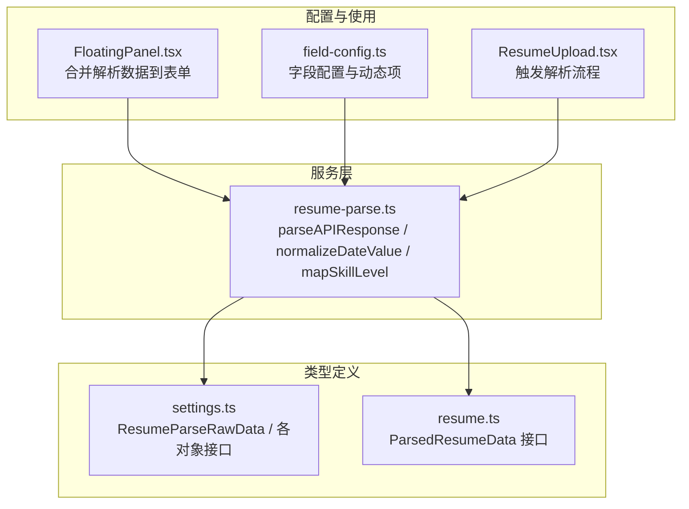
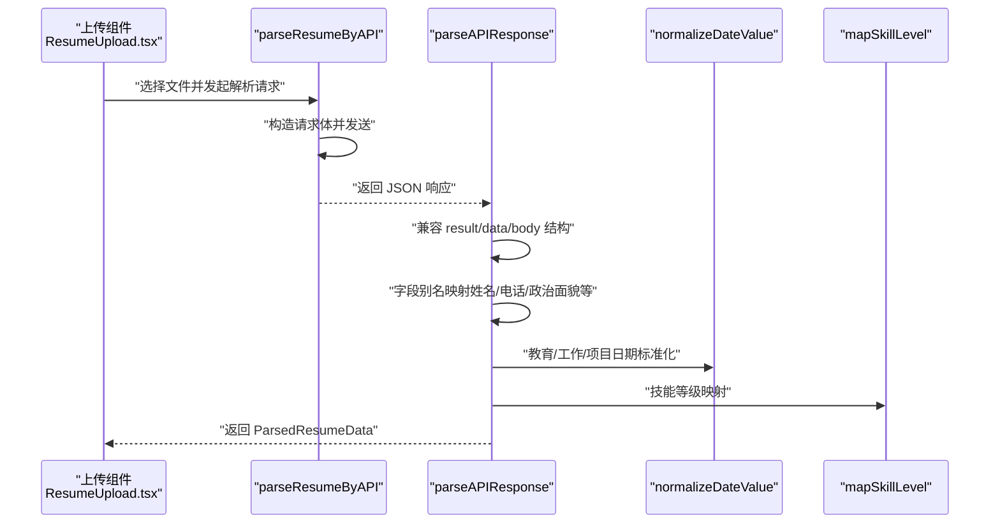
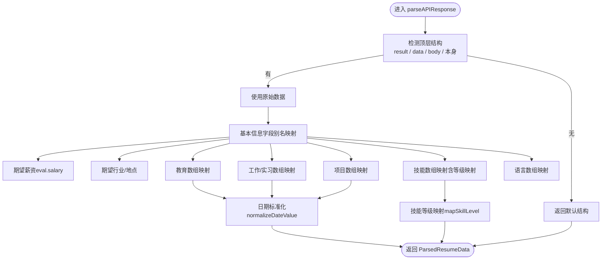
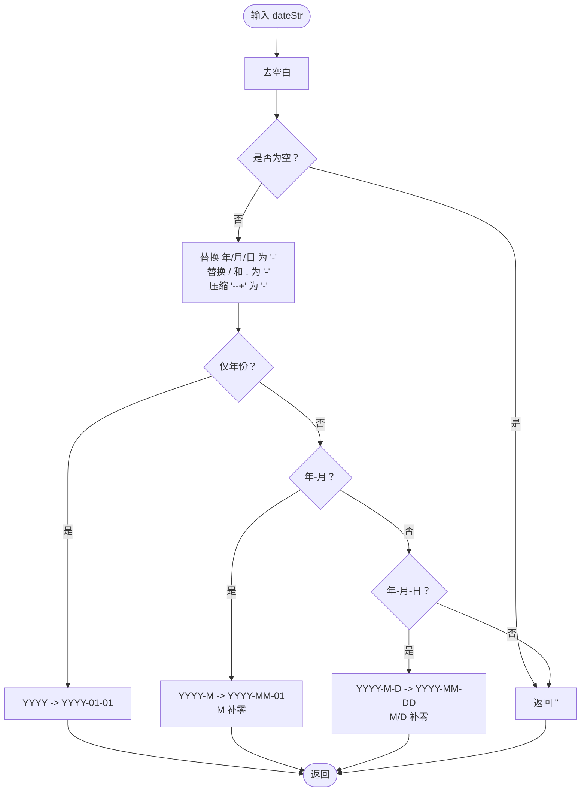
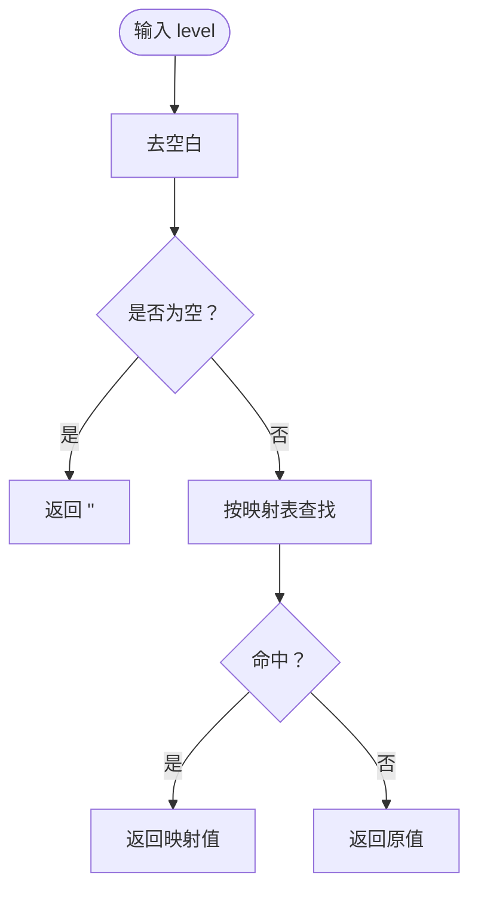
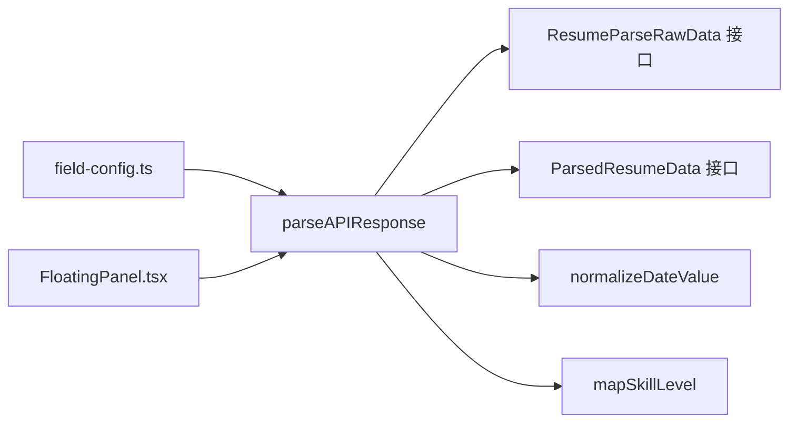

# 响应解析与数据归一化

<cite>
**本文引用的文件**
- [src/services/resume-parse.ts](file://src/services/resume-parse.ts)
- [src/types/settings.ts](file://src/types/settings.ts)
- [src/types/resume.ts](file://src/types/resume.ts)
- [src/config/field-config.ts](file://src/config/field-config.ts)
- [src/components/floating/FloatingPanel.tsx](file://src/components/floating/FloatingPanel.tsx)
- [src/features/popup/ResumeUpload.tsx](file://src/features/popup/ResumeUpload.tsx)
</cite>

## 目录
1. [简介](#简介)
2. [项目结构](#项目结构)
3. [核心组件](#核心组件)
4. [架构总览](#架构总览)
5. [详细组件分析](#详细组件分析)
6. [依赖关系分析](#依赖关系分析)
7. [性能考量](#性能考量)
8. [故障排查指南](#故障排查指南)
9. [结论](#结论)

## 简介
本文件围绕简历解析流程中的响应处理与数据归一化展开，重点解析以下内容：
- parseAPIResponse 函数对 result/data/body 多层嵌套结构的兼容策略
- 别名字段优先级映射（如姓名、电话、政治面貌等）
- normalizeDateValue 函数对中文日期与分隔符的标准化算法（正则替换、补零、YYYY-MM-DD 输出）
- mapSkillLevel 技能等级语义映射表
- 教育、工作、项目、技能、语言等数组类型的结构转换与空值默认填充策略

## 项目结构
与本主题直接相关的文件集中在服务层与类型定义层：
- 服务层：解析 API 响应、日期标准化、技能等级映射
- 类型定义：原始解析数据结构、最终表单数据结构
- 配置与使用：字段配置、悬浮面板合并逻辑、上传入口

图表来源
- [src/services/resume-parse.ts](file://src/services/resume-parse.ts#L136-L340)
- [src/types/settings.ts](file://src/types/settings.ts#L124-L191)
- [src/types/resume.ts](file://src/types/resume.ts#L112-L134)
- [src/config/field-config.ts](file://src/config/field-config.ts#L45-L110)
- [src/components/floating/FloatingPanel.tsx](file://src/components/floating/FloatingPanel.tsx#L31-L64)
- [src/features/popup/ResumeUpload.tsx](file://src/features/popup/ResumeUpload.tsx#L37-L120)

章节来源
- [src/services/resume-parse.ts](file://src/services/resume-parse.ts#L136-L340)
- [src/types/settings.ts](file://src/types/settings.ts#L124-L191)
- [src/types/resume.ts](file://src/types/resume.ts#L112-L134)
- [src/config/field-config.ts](file://src/config/field-config.ts#L45-L110)
- [src/components/floating/FloatingPanel.tsx](file://src/components/floating/FloatingPanel.tsx#L31-L64)
- [src/features/popup/ResumeUpload.tsx](file://src/features/popup/ResumeUpload.tsx#L37-L120)

## 核心组件
- parseAPIResponse：统一解析 API 响应，兼容 result/data/body 多层结构，完成字段别名映射与数组结构转换，并输出 ParsedResumeData
- normalizeDateValue：将中文日期与多种分隔符标准化为 YYYY-MM-DD
- mapSkillLevel：将自然语言技能等级映射为表单下拉框可选值
- ResumeParseRawData：原始解析数据结构定义，涵盖教育、工作、项目、技能、语言等对象数组
- ParsedResumeData：最终表单数据结构定义

章节来源
- [src/services/resume-parse.ts](file://src/services/resume-parse.ts#L136-L340)
- [src/types/settings.ts](file://src/types/settings.ts#L124-L191)
- [src/types/resume.ts](file://src/types/resume.ts#L112-L134)

## 架构总览
解析流程概览如下：

图表来源
- [src/features/popup/ResumeUpload.tsx](file://src/features/popup/ResumeUpload.tsx#L37-L120)
- [src/services/resume-parse.ts](file://src/services/resume-parse.ts#L38-L109)
- [src/services/resume-parse.ts](file://src/services/resume-parse.ts#L136-L340)

## 详细组件分析

### parseAPIResponse：响应结构兼容与字段映射
- 多层结构兼容策略
  - 若顶层包含 result、data、body，则以之为“原始数据”；否则直接使用顶层对象
  - 若无有效数据，返回默认结构（空字符串与空数组）
- 字段别名优先级
  - 姓名：name → fullname
  - 性别：gender_inf → gender
  - 电话：phone → mobile
  - 政治面貌：polit_status → political_status
  - 期望职位：work_pos_type_p → work_pos_type
  - 自我介绍：cont_basic_info → cont_job_skill → raw_text
  - 期望行业：work_pos_type
  - 期望地点：work_city
  - 期望薪资：eval.salary（若存在）
- 数组类型结构转换
  - 教育：education_objs → education[i][...]（字段映射：学校、专业、学历、排名、起止日期）
  - 工作/实习：job_exp_objs → internship[i][...]（字段映射：公司、职位、起止日期、描述）
  - 项目：proj_exp_objs → project[i][...]（字段映射：项目名、角色、时间串、描述、职责）
  - 技能：skills_objs → skills[i][name, level]（level 通过 mapSkillLevel 映射）
  - 语言：lang_objs → language[i][name, proficiency, certificate]
- 空值默认填充策略
  - 字符串字段默认空字符串
  - 数组字段默认空数组
  - 日期字段通过 normalizeDateValue 规范化，无法解析则为空字符串

图表来源
- [src/services/resume-parse.ts](file://src/services/resume-parse.ts#L136-L295)

章节来源
- [src/services/resume-parse.ts](file://src/services/resume-parse.ts#L136-L295)
- [src/types/settings.ts](file://src/types/settings.ts#L124-L191)
- [src/types/resume.ts](file://src/types/resume.ts#L112-L134)

### normalizeDateValue：中文日期标准化算法
- 输入处理
  - 去除前后空白，空值返回空字符串
- 分隔符替换
  - 年/月/日中的“年”“月”“日”替换为“-”
  - “/”“.”替换为“-”
  - 连续“--+”压缩为单个“-”
- 格式判定与补零
  - 仅年份：YYYY → YYYY-01-01
  - 年-月：YYYY-M → YYYY-MM-01
  - 年-月-日：YYYY-M-D → YYYY-MM-DD（月/日不足两位补零）
- 不符合上述格式：返回空字符串

图表来源
- [src/services/resume-parse.ts](file://src/services/resume-parse.ts#L299-L320)

章节来源
- [src/services/resume-parse.ts](file://src/services/resume-parse.ts#L299-L320)

### mapSkillLevel：技能等级语义映射表
- 输入规范化：去除空白，空值返回空字符串
- 映射规则（示例）
  - 入门 → 初级
  - 了解 → 初级
  - 一般 → 初级
  - 熟悉 → 中级
  - 良好 → 中级
  - 熟练 → 高级
  - 精通 → 专家
  - 专家 → 专家
  - 掌握 → 高级
- 未命中映射：原样返回（保持兼容）

图表来源
- [src/services/resume-parse.ts](file://src/services/resume-parse.ts#L322-L340)

章节来源
- [src/services/resume-parse.ts](file://src/services/resume-parse.ts#L322-L340)
- [src/config/field-config.ts](file://src/config/field-config.ts#L145-L164)

### 字段别名优先级与空值默认策略
- 姓名：name → fullname
- 电话：phone → mobile
- 政治面貌：polit_status → political_status
- 期望职位：work_pos_type_p → work_pos_type
- 自我介绍：cont_basic_info → cont_job_skill → raw_text
- 期望行业：work_pos_type
- 期望地点：work_city
- 期望薪资：eval.salary（若存在）
- 空值默认：字符串字段默认空字符串，数组字段默认空数组

章节来源
- [src/services/resume-parse.ts](file://src/services/resume-parse.ts#L174-L198)
- [src/services/resume-parse.ts](file://src/services/resume-parse.ts#L200-L295)

### 数组类型结构转换与默认填充
- 教育（education_objs）
  - 字段映射：学校（edu_college/edu_school）、专业（edu_major）、学历（edu_degree/edu_degree_norm）、排名（edu_college_rank/edu_college_rank_qs）
  - 日期：start_date/end_date 通过 normalizeDateValue
  - 默认：空字符串
- 工作/实习（job_exp_objs）
  - 字段映射：公司（job_cpy/job_company/work_company）、职位（job_pos_type_p/job_pos_type/work_pos_type_p）、描述（job_content）
  - 日期：start_date/end_date 通过 normalizeDateValue
  - 默认：空字符串
- 项目（proj_exp_objs）
  - 字段映射：项目名（proj_name）、角色（proj_role）、时间串（start_date/end_date 组合）、描述（proj_content）、职责（proj_resp）
  - 默认：空字符串
- 技能（skills_objs）
  - 字段映射：名称（skills_name）、等级（skills_level → mapSkillLevel）
  - 默认：空字符串
- 语言（lang_objs）
  - 字段映射：名称（lang_name/language）、掌握程度（lang_level/level）、证书（lang_cert）
  - 默认：空字符串

章节来源
- [src/services/resume-parse.ts](file://src/services/resume-parse.ts#L200-L295)
- [src/types/settings.ts](file://src/types/settings.ts#L148-L191)

## 依赖关系分析
- parseAPIResponse 依赖
  - ResumeParseRawData 接口（来自 settings.ts）定义原始数据结构
  - ParsedResumeData 接口（来自 resume.ts）定义最终表单数据结构
  - normalizeDateValue 与 mapSkillLevel 作为内部工具函数
- 字段配置
  - field-config.ts 定义了表单字段与动态列表的配置，用于前端渲染与校验
- 数据合并
  - FloatingPanel.tsx 将解析得到的 personalInfo 与 jobExpectation 合并到现有表单数据，体现“解析数据优先”的策略

图表来源
- [src/services/resume-parse.ts](file://src/services/resume-parse.ts#L136-L340)
- [src/types/settings.ts](file://src/types/settings.ts#L124-L191)
- [src/types/resume.ts](file://src/types/resume.ts#L112-L134)
- [src/config/field-config.ts](file://src/config/field-config.ts#L45-L110)
- [src/components/floating/FloatingPanel.tsx](file://src/components/floating/FloatingPanel.tsx#L31-L64)

章节来源
- [src/services/resume-parse.ts](file://src/services/resume-parse.ts#L136-L340)
- [src/types/settings.ts](file://src/types/settings.ts#L124-L191)
- [src/types/resume.ts](file://src/types/resume.ts#L112-L134)
- [src/config/field-config.ts](file://src/config/field-config.ts#L45-L110)
- [src/components/floating/FloatingPanel.tsx](file://src/components/floating/FloatingPanel.tsx#L31-L64)

## 性能考量
- 正则替换与字符串处理
  - normalizeDateValue 使用少量正则与 padStart，复杂度近似 O(n)，n 为字符串长度
- 数组映射
  - 对教育/工作/项目/技能/语言数组进行 map，整体复杂度 O(N)
- 建议
  - 控制数组规模，避免一次性解析超大简历
  - 对日期与技能等级映射尽量在上游清洗，减少重复处理

[本节提供通用建议，无需特定文件引用]

## 故障排查指南
- API 响应为空或结构异常
  - 现象：返回默认结构，字段为空
  - 排查：确认 API 返回包含 result/data/body 之一，或顶层即为数据对象
- 日期格式异常
  - 现象：日期字段为空
  - 排查：检查输入是否为“年/月/日”或“YYYY-M-D”等格式，确保分隔符为“-”或“/”“.”
- 技能等级未映射
  - 现象：技能等级显示为原文
  - 排查：确认等级文本是否在映射表中，或是否为新词
- 字段缺失
  - 现象：期望行业/地点/薪资为空
  - 排查：确认原始数据中是否存在对应字段（work_pos_type、work_city、eval.salary）

章节来源
- [src/services/resume-parse.ts](file://src/services/resume-parse.ts#L136-L198)
- [src/services/resume-parse.ts](file://src/services/resume-parse.ts#L299-L340)

## 结论
- parseAPIResponse 通过“result/data/body”兼容策略与别名优先级映射，实现了对多源 API 响应的稳健解析
- normalizeDateValue 与 mapSkillLevel 保证了日期格式一致性与技能等级语义统一
- 数组类型结构转换遵循“字段别名 → 标准化 → 默认填充”的流程，确保前端渲染稳定
- 实际使用中，建议在上游完善数据质量控制，减少下游清洗成本