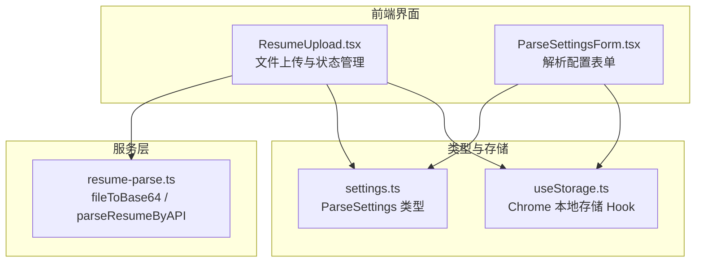
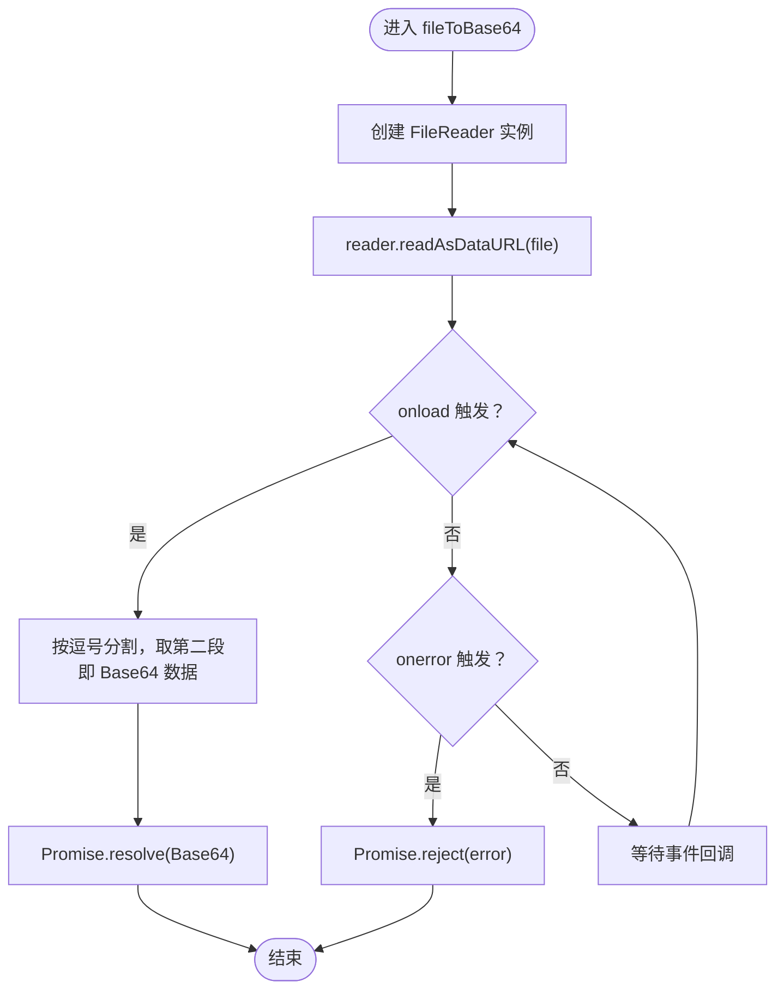
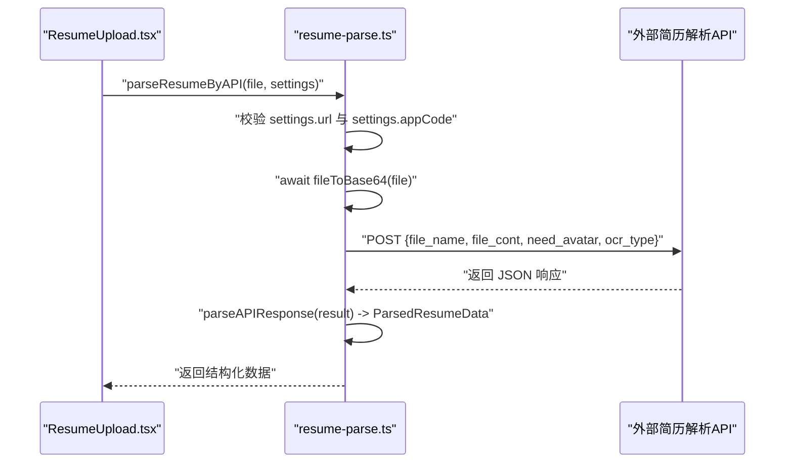
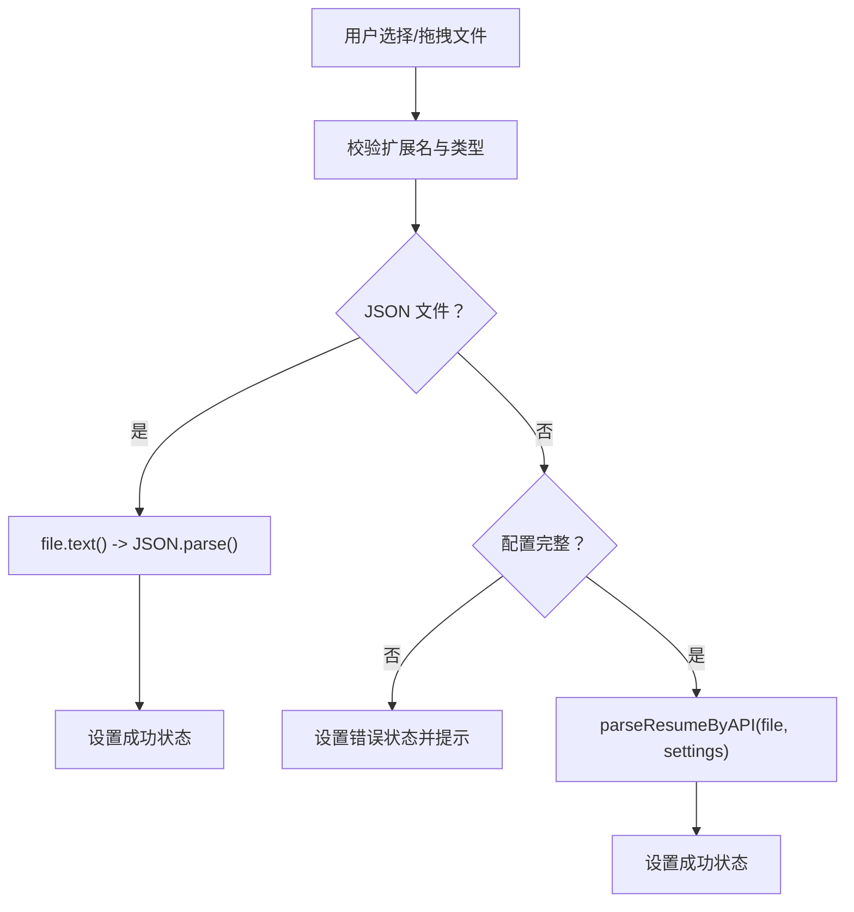
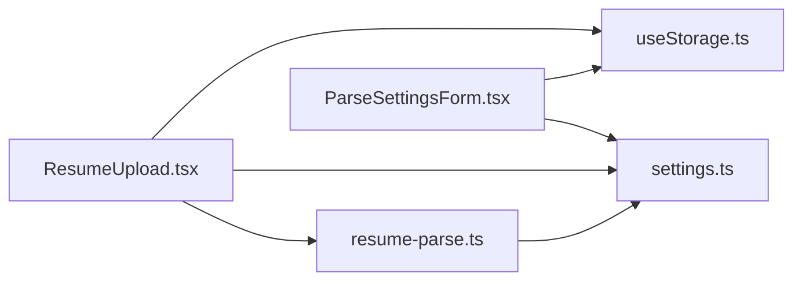

# 文件处理与Base64编码

<cite>
**本文引用的文件**
- [src/services/resume-parse.ts](file://src/services/resume-parse.ts)
- [src/features/popup/ResumeUpload.tsx](file://src/features/popup/ResumeUpload.tsx)
- [src/types/settings.ts](file://src/types/settings.ts)
- [src/features/popup/settings/ParseSettingsForm.tsx](file://src/features/popup/settings/ParseSettingsForm.tsx)
- [src/hooks/useStorage.ts](file://src/hooks/useStorage.ts)
</cite>

## 目录
1. [简介](#简介)
2. [项目结构](#项目结构)
3. [核心组件](#核心组件)
4. [架构总览](#架构总览)
5. [详细组件分析](#详细组件分析)
6. [依赖关系分析](#依赖关系分析)
7. [性能考量](#性能考量)
8. [故障排查指南](#故障排查指南)
9. [结论](#结论)

## 简介
本文聚焦于简历解析流程中的文件预处理环节，系统阐述 fileToBase64 函数的实现机制与在 parseResumeByAPI 中的集成方式。内容涵盖：
- FileReader API 的异步处理流程与 Promise 封装模式
- data URL 格式解析（移除 data:type;base64, 前缀）的细节
- 在简历解析流程中的前置作用：将用户上传的 File 对象转换为适合网络传输的 Base64 字符串
- 错误处理机制：onerror 事件的捕获与传递
- 对支持 PDF/DOCX 等二进制文件上传的基础性作用

## 项目结构
围绕“文件上传—Base64预处理—API解析”的主线，相关文件分布如下：
- 上传与状态管理：ResumeUpload.tsx
- 解析配置与类型：settings.ts、ParseSettingsForm.tsx
- 文件预处理与API调用：resume-parse.ts
- 存储与配置读写：useStorage.ts



图表来源
- [src/features/popup/ResumeUpload.tsx](file://src/features/popup/ResumeUpload.tsx#L1-L260)
- [src/services/resume-parse.ts](file://src/services/resume-parse.ts#L1-L120)
- [src/types/settings.ts](file://src/types/settings.ts#L32-L83)
- [src/features/popup/settings/ParseSettingsForm.tsx](file://src/features/popup/settings/ParseSettingsForm.tsx#L1-L99)
- [src/hooks/useStorage.ts](file://src/hooks/useStorage.ts#L1-L102)

章节来源
- [src/features/popup/ResumeUpload.tsx](file://src/features/popup/ResumeUpload.tsx#L1-L260)
- [src/services/resume-parse.ts](file://src/services/resume-parse.ts#L1-L120)
- [src/types/settings.ts](file://src/types/settings.ts#L32-L83)
- [src/features/popup/settings/ParseSettingsForm.tsx](file://src/features/popup/settings/ParseSettingsForm.tsx#L1-L99)
- [src/hooks/useStorage.ts](file://src/hooks/useStorage.ts#L1-L102)

## 核心组件
- fileToBase64：将浏览器 File 对象转换为纯 Base64 字符串，供网络传输使用
- parseResumeByAPI：在完成配置校验后，调用 fileToBase64 完成预处理，并向解析 API 发起请求
- ResumeUpload：负责接收用户上传的文件，区分 JSON 与二进制文件，协调进度与错误提示，并在二进制文件场景下调用 parseResumeByAPI
- ParseSettings/ParseSettingsForm：提供 API URL 与 APP Code 的配置入口，作为 parseResumeByAPI 的前置条件
- useStorage：持久化存储配置，使配置在页面间保持一致

章节来源
- [src/services/resume-parse.ts](file://src/services/resume-parse.ts#L18-L33)
- [src/services/resume-parse.ts](file://src/services/resume-parse.ts#L38-L109)
- [src/features/popup/ResumeUpload.tsx](file://src/features/popup/ResumeUpload.tsx#L37-L126)
- [src/types/settings.ts](file://src/types/settings.ts#L32-L83)
- [src/features/popup/settings/ParseSettingsForm.tsx](file://src/features/popup/settings/ParseSettingsForm.tsx#L1-L99)
- [src/hooks/useStorage.ts](file://src/hooks/useStorage.ts#L1-L102)

## 架构总览
下面以序列图展示“文件上传—Base64预处理—API解析”的端到端流程，映射到实际源码文件。

```mermaid
sequenceDiagram
participant UI as "ResumeUpload.tsx"
participant SVC as "resume-parse.ts"
participant API as "外部简历解析API"
UI->>UI : "用户选择/拖拽文件"
UI->>UI : "校验扩展名与类型"
alt "JSON 文件"
UI->>UI : "直接读取文本并解析 JSON"
UI-->>UI : "设置解析成功状态"
else "二进制文件(PDF/DOCX)"
UI->>SVC : "parseResumeByAPI(file, settings)"
SVC->>SVC : "校验 API 配置"
SVC->>SVC : "fileToBase64(file)"
SVC->>SVC : "reader.readAsDataURL(file)"
SVC-->>SVC : "onload 回调：移除 data : type;base64, 前缀"
SVC-->>UI : "返回 Base64 字符串"
SVC->>API : "POST 请求含 file_name、file_cont、need_avatar、ocr_type"
API-->>SVC : "返回解析结果"
SVC-->>UI : "返回解析后的结构化数据"
UI-->>UI : "设置解析成功状态"
end
```

图表来源
- [src/features/popup/ResumeUpload.tsx](file://src/features/popup/ResumeUpload.tsx#L37-L126)
- [src/services/resume-parse.ts](file://src/services/resume-parse.ts#L38-L109)
- [src/services/resume-parse.ts](file://src/services/resume-parse.ts#L18-L33)

## 详细组件分析

### fileToBase64 函数：FileReader 异步与 Promise 封装
- 功能定位：将浏览器 File 对象转换为纯 Base64 字符串，便于通过 HTTP 请求体传输
- 实现要点：
  - 使用 FileReader.readAsDataURL 将文件读取为 data URL（包含前缀 data:type;base64,）
  - onload 回调中解析 data URL，移除前缀，仅保留 Base64 数据
  - onerror 回调中将错误传递给 Promise 的 reject 分支
  - 通过 Promise 包装 FileReader 的异步行为，使其可在 async/await 中使用
- 适用范围：PDF、DOCX 等二进制文件的通用预处理，确保后续 API 调用可稳定传入 file_cont 字段



图表来源
- [src/services/resume-parse.ts](file://src/services/resume-parse.ts#L18-L33)

章节来源
- [src/services/resume-parse.ts](file://src/services/resume-parse.ts#L18-L33)

### parseResumeByAPI：在简历解析流程中的前置作用
- 前置条件：必须存在有效的 API URL 与 APP Code；否则抛出错误
- 前置处理：调用 fileToBase64 将 File 对象转换为 Base64 字符串
- 请求构建：构造包含 file_name、file_cont、need_avatar、ocr_type 的请求体
- 认证方式：Authorization 头使用 APICODE 前缀
- 错误处理：对非 2xx 响应进行统一错误包装，401 错误给出明确提示
- 结果解析：将 API 返回的原始数据结构化为前端表单可用的 ParsedResumeData



图表来源
- [src/services/resume-parse.ts](file://src/services/resume-parse.ts#L38-L109)
- [src/services/resume-parse.ts](file://src/services/resume-parse.ts#L111-L132)

章节来源
- [src/services/resume-parse.ts](file://src/services/resume-parse.ts#L38-L109)
- [src/services/resume-parse.ts](file://src/services/resume-parse.ts#L111-L132)

### ResumeUpload：文件上传与流程编排
- 能力范围：支持 JSON、PDF、DOC、DOCX、TXT、HTML 等格式
- 流程控制：
  - JSON 文件：直接读取文本并解析，无需 API
  - 二进制文件：校验配置后调用 parseResumeByAPI，模拟进度，最终设置成功状态
- 错误处理：当配置缺失或解析异常时，设置错误状态并显示提示信息



图表来源
- [src/features/popup/ResumeUpload.tsx](file://src/features/popup/ResumeUpload.tsx#L37-L126)

章节来源
- [src/features/popup/ResumeUpload.tsx](file://src/features/popup/ResumeUpload.tsx#L37-L126)

### 配置与类型：ParseSettings 与 ParseSettingsForm
- ParseSettings：包含 url 与 appCode 两个字段，作为 parseResumeByAPI 的必要输入
- ParseSettingsForm：提供输入框与说明，引导用户填写 API URL 与 APP Code
- useStorage：持久化存储配置，避免每次刷新丢失

章节来源
- [src/types/settings.ts](file://src/types/settings.ts#L32-L83)
- [src/features/popup/settings/ParseSettingsForm.tsx](file://src/features/popup/settings/ParseSettingsForm.tsx#L1-L99)
- [src/hooks/useStorage.ts](file://src/hooks/useStorage.ts#L1-L102)

## 依赖关系分析
- ResumeUpload 依赖：
  - 解析服务：parseResumeByAPI
  - 配置类型：ParseSettings
  - 存储 Hook：useStorage
- 解析服务依赖：
  - fileToBase64（核心预处理）
  - settings.ts 中的类型定义
- 配置表单依赖：
  - settings.ts 中的类型定义
  - useStorage 持久化



图表来源
- [src/features/popup/ResumeUpload.tsx](file://src/features/popup/ResumeUpload.tsx#L1-L260)
- [src/services/resume-parse.ts](file://src/services/resume-parse.ts#L1-L120)
- [src/types/settings.ts](file://src/types/settings.ts#L32-L83)
- [src/features/popup/settings/ParseSettingsForm.tsx](file://src/features/popup/settings/ParseSettingsForm.tsx#L1-L99)
- [src/hooks/useStorage.ts](file://src/hooks/useStorage.ts#L1-L102)

章节来源
- [src/features/popup/ResumeUpload.tsx](file://src/features/popup/ResumeUpload.tsx#L1-L260)
- [src/services/resume-parse.ts](file://src/services/resume-parse.ts#L1-L120)
- [src/types/settings.ts](file://src/types/settings.ts#L32-L83)
- [src/features/popup/settings/ParseSettingsForm.tsx](file://src/features/popup/settings/ParseSettingsForm.tsx#L1-L99)
- [src/hooks/useStorage.ts](file://src/hooks/useStorage.ts#L1-L102)

## 性能考量
- Base64 编码开销：将二进制文件转换为 Base64 后体积约为原大小的 4/3 左右，大文件上传会增加带宽与内存压力
- 建议：
  - 优先使用官方提供的解析服务，减少自建服务的复杂度
  - 控制文件大小，避免超大 PDF/DOCX 导致解析耗时与失败
  - 在 UI 层提供进度反馈与取消机制（当前实现已模拟进度）

## 故障排查指南
- 常见错误与定位：
  - API 配置缺失：parseResumeByAPI 在缺少 url 或 appCode 时直接抛错
  - 401 认证失败：parseResumeByAPI 对 401 做了专门提示，检查 APP Code 是否正确
  - FileReader 异常：fileToBase64 的 onerror 会被 reject，进而导致上层 catch 捕获
- 排查步骤：
  1. 确认 ParseSettingsForm 中已填写 API URL 与 APP Code
  2. 检查网络连通性与 API 服务状态
  3. 查看控制台输出的请求参数与响应详情
  4. 若为二进制文件，确认文件类型与大小符合要求

章节来源
- [src/services/resume-parse.ts](file://src/services/resume-parse.ts#L38-L109)
- [src/services/resume-parse.ts](file://src/services/resume-parse.ts#L18-L33)
- [src/features/popup/ResumeUpload.tsx](file://src/features/popup/ResumeUpload.tsx#L37-L126)

## 结论
fileToBase64 是简历解析流程的关键前置步骤，它通过 FileReader 将 File 对象转换为纯 Base64 字符串，从而为 parseResumeByAPI 提供标准的 file_cont 参数。结合 ResumeUpload 的文件校验与进度反馈，以及 ParseSettings 的配置管理，系统实现了对 PDF/DOCX 等二进制文件上传的可靠支持。在错误处理方面，onerror 事件被正确捕获并向上抛出，配合 parseResumeByAPI 的统一错误包装，能够快速定位问题并提示用户。