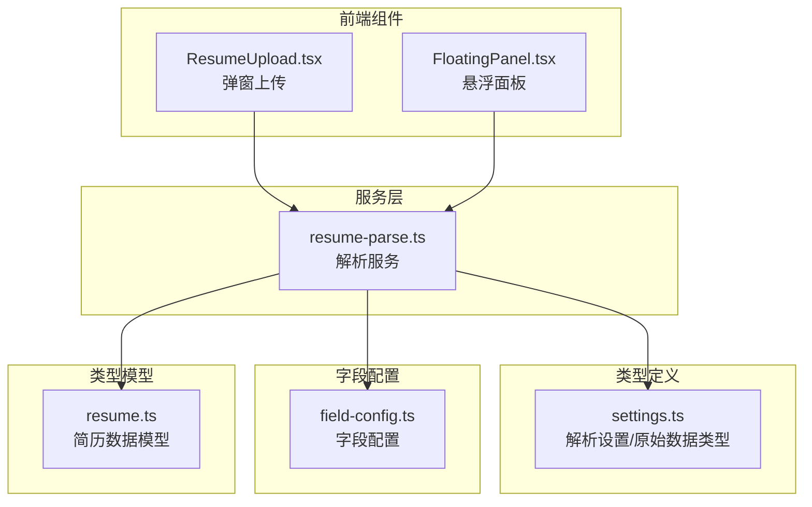
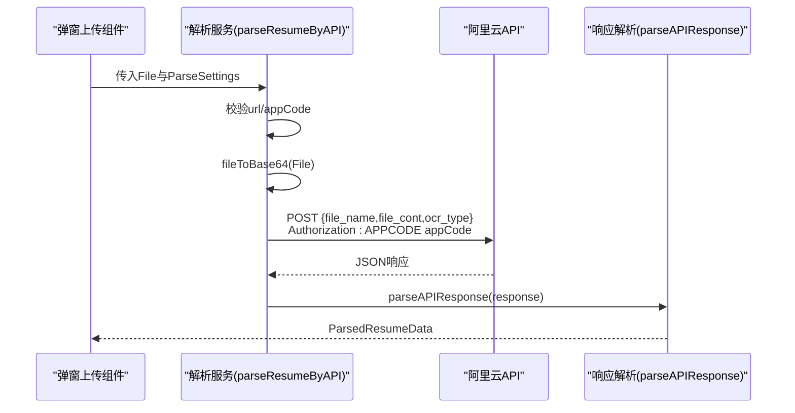
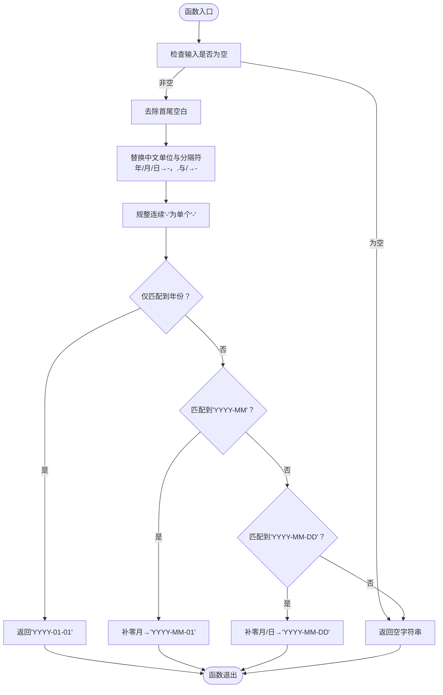
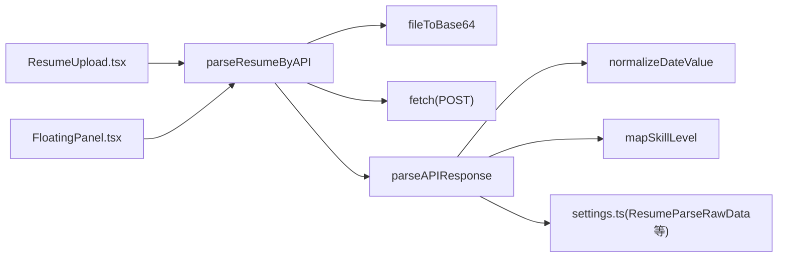
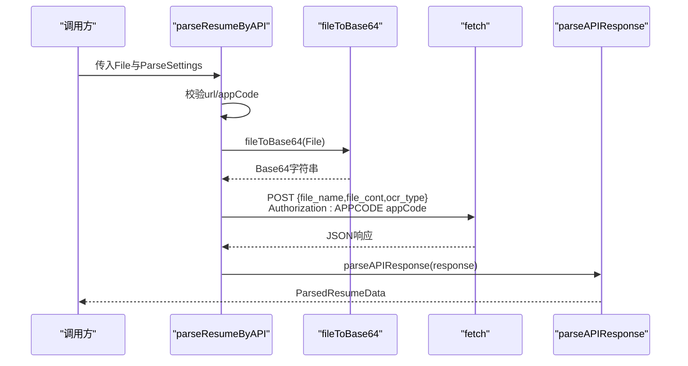
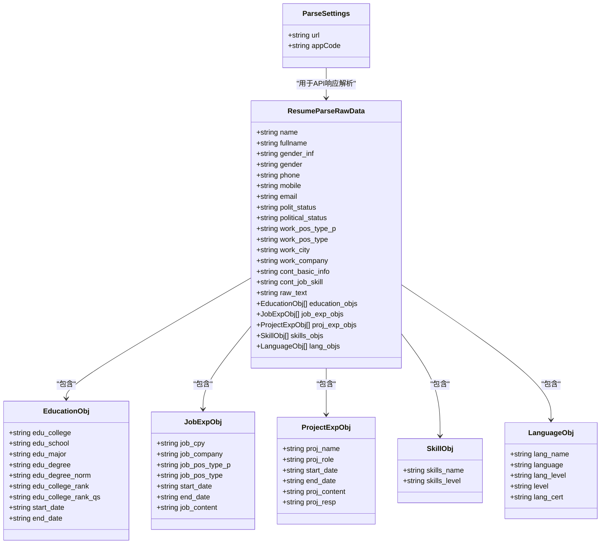

# 简历解析服务

<cite>
**本文引用的文件**
- [src/services/resume-parse.ts](file://src/services/resume-parse.ts)
- [src/types/settings.ts](file://src/types/settings.ts)
- [src/features/popup/ResumeUpload.tsx](file://src/features/popup/ResumeUpload.tsx)
- [src/components/floating/FloatingPanel.tsx](file://src/components/floating/FloatingPanel.tsx)
- [src/config/field-config.ts](file://src/config/field-config.ts)
- [src/types/resume.ts](file://src/types/resume.ts)
</cite>

## 目录
1. [简介](#简介)
2. [项目结构](#项目结构)
3. [核心组件](#核心组件)
4. [架构总览](#架构总览)
5. [详细组件分析](#详细组件分析)
6. [依赖关系分析](#依赖关系分析)
7. [性能考虑](#性能考虑)
8. [故障排查指南](#故障排查指南)
9. [结论](#结论)
10. [附录](#附录)

## 简介
本文件为简历解析服务模块的API文档，聚焦于 parseResumeByAPI 函数的完整工作流程与 parseAPIResponse 的响应兼容性处理策略。文档覆盖以下关键点：
- 输入验证与文件处理：文件类型校验、Base64编码转换
- 请求体构建：file_name、file_cont、ocr_type等字段
- 认证头设置：APPCODE认证方式
- 对阿里云API的POST请求发送与错误处理
- 响应兼容性：对result/data/body多层嵌套结构的智能提取
- 字段映射与结构转换：姓名、电话、教育经历、工作/实习经历、项目经历、技能、语言能力
- 日期标准化与技能等级语义映射
- 错误处理与空响应默认值策略

## 项目结构
简历解析服务位于 src/services/resume-parse.ts，配合类型定义 src/types/settings.ts 使用，并在前端组件中被调用，例如弹窗上传组件 src/features/popup/ResumeUpload.tsx 与悬浮面板组件 src/components/floating/FloatingPanel.tsx。

图表来源
- [src/services/resume-parse.ts](file://src/services/resume-parse.ts#L1-L109)
- [src/types/settings.ts](file://src/types/settings.ts#L33-L83)
- [src/features/popup/ResumeUpload.tsx](file://src/features/popup/ResumeUpload.tsx#L1-L126)
- [src/components/floating/FloatingPanel.tsx](file://src/components/floating/FloatingPanel.tsx#L31-L64)
- [src/config/field-config.ts](file://src/config/field-config.ts#L1-L120)
- [src/types/resume.ts](file://src/types/resume.ts#L1-L100)

章节来源
- [src/services/resume-parse.ts](file://src/services/resume-parse.ts#L1-L109)
- [src/types/settings.ts](file://src/types/settings.ts#L33-L83)
- [src/features/popup/ResumeUpload.tsx](file://src/features/popup/ResumeUpload.tsx#L1-L126)
- [src/components/floating/FloatingPanel.tsx](file://src/components/floating/FloatingPanel.tsx#L31-L64)
- [src/config/field-config.ts](file://src/config/field-config.ts#L1-L120)
- [src/types/resume.ts](file://src/types/resume.ts#L1-L100)

## 核心组件
- parseResumeByAPI：负责文件输入验证、Base64编码、请求体构建、APPCODE认证头设置、向阿里云API发起POST请求，并将响应交给 parseAPIResponse 进行统一解析。
- parseAPIResponse：对不同API返回结构进行兼容性提取，完成字段映射与结构转换。
- fileToBase64：将浏览器File对象转换为Base64字符串。
- normalizeDateValue：将中文日期与多种分隔符标准化为YYYY-MM-DD。
- mapSkillLevel：将技能等级语义映射到表单下拉框可选项。

章节来源
- [src/services/resume-parse.ts](file://src/services/resume-parse.ts#L19-L109)
- [src/services/resume-parse.ts](file://src/services/resume-parse.ts#L137-L342)

## 架构总览
下面的时序图展示了从用户上传文件到最终得到解析后的简历数据的完整流程。

图表来源
- [src/features/popup/ResumeUpload.tsx](file://src/features/popup/ResumeUpload.tsx#L38-L88)
- [src/services/resume-parse.ts](file://src/services/resume-parse.ts#L38-L109)
- [src/services/resume-parse.ts](file://src/services/resume-parse.ts#L137-L342)

## 详细组件分析

### parseResumeByAPI：API调用全流程
- 输入验证
  - 校验 ParseSettings.url 与 ParseSettings.appCode 是否存在，缺失则抛出错误。
- 文件处理
  - 使用 fileToBase64 将File转换为Base64字符串，移除 dataURL 前缀仅保留纯Base64数据。
- 请求体构建
  - 构造请求体：file_name（含后缀）、file_cont（Base64）、need_avatar（0）、ocr_type（1）。
- 认证头设置
  - Content-Type: application/json; charset=UTF-8
  - Authorization: APPCODE + appCode（阿里云API标准）
- 请求发送与错误处理
  - 若response.ok为false，读取文本错误信息并按状态码分类处理；401明确提示认证失败，其他错误包含状态码与错误文本。
- 响应解析
  - 成功后解析JSON，交由 parseAPIResponse 统一映射。

章节来源
- [src/services/resume-parse.ts](file://src/services/resume-parse.ts#L38-L109)

### parseAPIResponse：响应兼容性与字段映射
- 响应兼容性处理
  - 支持多层嵌套结构：优先取 result，其次 data，再 body，最后回退到顶层对象。
  - 当rawData为空时，返回默认结构（空数组/空字符串）。
- 个人信息映射
  - 姓名：优先取 name，否则取 fullname。
  - 性别：优先取 gender_inf，否则取 gender。
  - 电话：优先取 phone，否则取 mobile。
  - 政治面貌：优先取 polit_status，否则取 political_status。
  - 期望职位：优先取 work_pos_type_p，否则取 work_pos_type。
  - 期望薪资：从 eval.salary 提取，若不存在则留空。
  - 自我介绍：优先取 cont_basic_info、cont_job_skill、raw_text。
  - 期望行业：当存在 work_pos_type 时写入 expected-industry。
  - 期望地点：当存在 work_city 时写入 expected-location。
- 教育经历映射
  - 来源字段：education_objs 数组。
  - 结构转换：将每个元素映射为 Record<string,string>，键名采用“education[index][属性]”形式，属性包括 school、major、degree、rank、start-date、end-date。
  - 日期标准化：使用 normalizeDateValue 规范化起止日期。
- 工作/实习经历映射
  - 来源字段：job_exp_objs 数组。
  - 结构转换：将每个元素映射为 Record<string,string>，键名采用“internship[index][属性]”，属性包括 company、position、start-date、end-date、description。
  - 日期标准化：使用 normalizeDateValue 规范化起止日期。
  - 公司/职位回退：当job_exp_objs字段缺失时，回退到work_company/work_pos_type_p。
- 项目经历映射
  - 来源字段：proj_exp_objs 数组。
  - 结构转换：将每个元素映射为 Record<string,string>，键名采用“project[index][属性]”，属性包括 project-name、role、project-time（由start_date与end_date拼接，缺省补空）、project-desc、responsibilities。
- 技能映射
  - 来源字段：skills_objs 数组。
  - 结构转换：将每个元素映射为 Record<string,string>，键名采用“skills[index][name|level]”。
  - 技能等级映射：使用 mapSkillLevel 将“熟悉→中级”、“精通→专家”等语义映射到表单下拉框值。
- 语言能力映射
  - 来源字段：lang_objs 数组。
  - 结构转换：将每个元素映射为 Record<string,string>，键名采用“language[index][name|proficiency|certificate]”，其中名称优先取 lang_name，否则取 language；熟练度优先取 lang_level，否则取 level。

章节来源
- [src/services/resume-parse.ts](file://src/services/resume-parse.ts#L137-L342)
- [src/types/settings.ts](file://src/types/settings.ts#L123-L190)

### normalizeDateValue：日期标准化
- 支持的输入格式
  - 年/月/日：中文单位会被替换为“-”，如“2020年10月15日”→“2020-10-15”。
  - 分隔符：支持“.”、“/”等分隔符，统一替换为“-”。
  - 连续“--”会被规整为单个“-”。
- 归一化规则
  - 只有年份：返回“YYYY-01-01”。
  - 年-月：返回“YYYY-MM-01”。
  - 年-月-日：返回“YYYY-MM-DD”，且月/日自动补零。
  - 其他格式：返回空字符串。

图表来源
- [src/services/resume-parse.ts](file://src/services/resume-parse.ts#L297-L340)

章节来源
- [src/services/resume-parse.ts](file://src/services/resume-parse.ts#L297-L340)

### mapSkillLevel：技能等级语义映射
- 映射策略
  - 将“熟悉”映射为“中级”，“精通”映射为“专家”，其他常见语义如“入门/了解/一般/良好/熟练/掌握/专家”等映射到“初级/中级/高级/专家”。
  - 未命中映射的值保持原样。
- 用途
  - 与 skills_objs.level 字段配合，输出表单下拉框可选值。

章节来源
- [src/services/resume-parse.ts](file://src/services/resume-parse.ts#L322-L340)

### 字段归一化与结构转换规则
- 教育经历
  - 输入：education_objs[]
  - 输出：education[]（Record<string,string>数组），键名采用“education[index][属性]”
- 工作/实习经历
  - 输入：job_exp_objs[]
  - 输出：internship[]（Record<string,string>数组），键名采用“internship[index][属性]”
- 项目经历
  - 输入：proj_exp_objs[]
  - 输出：project[]（Record<string,string>数组），键名采用“project[index][属性]”，其中 project-time 由 start_date 与 end_date 拼接
- 技能
  - 输入：skills_objs[]
  - 输出：skills[]（Record<string,string>数组），键名采用“skills[index][name|level]”，level经 mapSkillLevel 归一化
- 语言能力
  - 输入：lang_objs[]
  - 输出：language[]（Record<string,string>数组），键名采用“language[index][name|proficiency|certificate]”

章节来源
- [src/services/resume-parse.ts](file://src/services/resume-parse.ts#L200-L295)
- [src/types/settings.ts](file://src/types/settings.ts#L148-L190)

## 依赖关系分析
- 组件耦合
  - parseResumeByAPI 依赖 fileToBase64、fetch、ParseSettings（来自 settings.ts）、ParsedResumeData（来自 resume-parse.ts）。
  - parseAPIResponse 依赖 ResumeParseRawData（来自 settings.ts）、EducationObj/JobExpObj/ProjectExpObj/SkillObj/LanguageObj（来自 settings.ts）、normalizeDateValue、mapSkillLevel。
- 外部集成
  - 阿里云API：通过POST请求与APPCODE认证头交互。
- 前端集成
  - 弹窗上传组件与悬浮面板组件分别调用 parseResumeByAPI，并将返回的 ParsedResumeData 写入对应表单。

图表来源
- [src/features/popup/ResumeUpload.tsx](file://src/features/popup/ResumeUpload.tsx#L38-L88)
- [src/components/floating/FloatingPanel.tsx](file://src/components/floating/FloatingPanel.tsx#L31-L64)
- [src/services/resume-parse.ts](file://src/services/resume-parse.ts#L19-L109)
- [src/services/resume-parse.ts](file://src/services/resume-parse.ts#L137-L342)
- [src/types/settings.ts](file://src/types/settings.ts#L123-L190)

章节来源
- [src/features/popup/ResumeUpload.tsx](file://src/features/popup/ResumeUpload.tsx#L38-L88)
- [src/components/floating/FloatingPanel.tsx](file://src/components/floating/FloatingPanel.tsx#L31-L64)
- [src/services/resume-parse.ts](file://src/services/resume-parse.ts#L19-L109)
- [src/services/resume-parse.ts](file://src/services/resume-parse.ts#L137-L342)
- [src/types/settings.ts](file://src/types/settings.ts#L123-L190)

## 性能考虑
- Base64体积放大：Base64相比二进制会增大约33%，建议优先使用PDF/DOCX等压缩格式，避免超大文件导致网络传输与内存压力。
- OCR类型选择：ocr_type=1为高级OCR，解析更准确但可能耗时更长，可根据需求权衡。
- 响应解析复杂度：parseAPIResponse对数组进行逐项映射，时间复杂度O(n)，n为各列表长度之和；日期与技能等级映射为O(1)操作。
- 建议
  - 在前端对文件大小与类型进行预校验，减少无效请求。
  - 合理设置超时与重试策略（可在上层封装）。

[本节为通用建议，无需特定文件引用]

## 故障排查指南
- 401认证失败
  - 现象：API返回401，控制台输出明确提示。
  - 排查步骤：
    - 确认 ParseSettings.appCode 是否正确填写。
    - 确认阿里云API服务已激活且未过期。
    - 确认 Authorization 头格式为“APPCODE appCode”。
- 空响应或无数据
  - 现象：API返回空对象或字段缺失。
  - 处理策略：
    - parseAPIResponse 对空rawData返回默认结构（空数组/空字符串），确保上层不会收到null。
    - 建议：在UI层显示“未识别到字段”的提示，并允许手动编辑。
- 文件格式不支持
  - 现象：弹窗上传组件拒绝非允许扩展名。
  - 处理策略：仅允许“.json”、“.pdf”、“.doc”、“.docx”、“.txt”、“.html”；JSON文件直接解析，其他格式走API。
- 网络错误
  - 现象：response.ok为false，包含状态码与错误文本。
  - 处理策略：捕获错误并提示用户检查网络、API地址与凭证。

章节来源
- [src/services/resume-parse.ts](file://src/services/resume-parse.ts#L82-L109)
- [src/features/popup/ResumeUpload.tsx](file://src/features/popup/ResumeUpload.tsx#L31-L46)
- [src/services/resume-parse.ts](file://src/services/resume-parse.ts#L169-L172)

## 结论
本模块通过清晰的输入验证、标准化的请求体构建与APPCODE认证，实现了对阿里云API的稳定调用；parseAPIResponse提供了强大的响应兼容性与字段映射能力，能够将多变的API返回结构转换为统一的表单数据格式。配合 normalizeDateValue 与 mapSkillLevel，进一步提升了数据质量与用户体验。建议在生产环境中结合超时与重试策略，并持续监控401等认证类错误。

[本节为总结，无需特定文件引用]

## 附录

### API调用序列图（代码级）

图表来源
- [src/services/resume-parse.ts](file://src/services/resume-parse.ts#L38-L109)
- [src/services/resume-parse.ts](file://src/services/resume-parse.ts#L137-L342)

### 类关系图（类型与接口）

图表来源
- [src/types/settings.ts](file://src/types/settings.ts#L33-L83)
- [src/types/settings.ts](file://src/types/settings.ts#L123-L190)