# UI组件库

<cite>
**本文档引用的文件**  
- [button.tsx](file://src/components/ui/button.tsx)
- [input.tsx](file://src/components/ui/input.tsx)
- [select.tsx](file://src/components/ui/select.tsx)
- [tabs.tsx](file://src/components/ui/tabs.tsx)
- [popover.tsx](file://src/components/ui/popover.tsx)
- [field-fill-button.tsx](file://src/components/ui/field-fill-button.tsx)
- [input-with-fill.tsx](file://src/components/ui/input-with-fill.tsx)
- [TemplateSelector.tsx](file://src/components/common/TemplateSelector.tsx)
- [FloatingPanel.tsx](file://src/components/floating/FloatingPanel.tsx)
- [field-fill.ts](file://src/services/field-fill.ts)
- [resume.ts](file://src/types/resume.ts)
- [utils.ts](file://src/lib/utils.ts)
</cite>

## 目录
1. [简介](#简介)
2. [项目结构](#项目结构)
3. [核心UI组件](#核心ui组件)
4. [Radix UI基础组件封装](#radix-ui基础组件封装)
5. [TemplateSelector组件](#templateselector组件)
6. [FloatingPanel组件](#floatingpanel组件)
7. [field-fill-button组件](#field-fill-button组件)
8. [依赖分析](#依赖分析)
9. [结论](#结论)

## 简介
本项目是一个Chrome扩展插件，提供简历信息管理和自动填充功能。核心UI组件库基于Radix UI构建，通过Tailwind CSS进行样式定制，实现了统一的设计语言和交互模式。系统包含弹窗模式和悬浮窗模式两种界面形态，支持简历模板管理、AI优化、数据导出等核心功能。

## 项目结构
项目采用模块化结构，主要分为组件、功能、服务、类型定义等目录。UI组件分为基础组件和复合组件，通过合理的分层设计实现高复用性和可维护性。

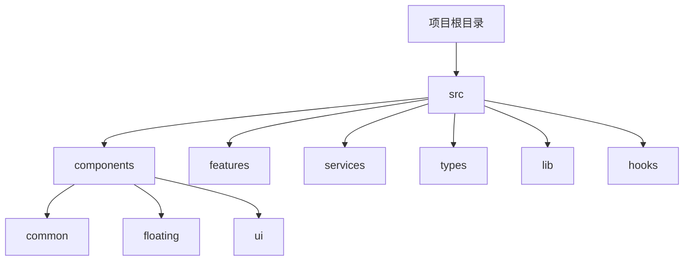

**图示来源**  
- [项目结构](file://src)

**本节来源**  
- [项目结构](file://src)

## 核心UI组件
本插件的UI组件体系基于Radix UI原语构建，通过`class-variance-authority`实现样式变体管理，使用`tailwind-merge`解决样式冲突。所有组件均采用Plasmo框架的CSS作用域机制，确保样式隔离。

**本节来源**  
- [button.tsx](file://src/components/ui/button.tsx)
- [input.tsx](file://src/components/ui/input.tsx)
- [utils.ts](file://src/lib/utils.ts)

## Radix UI基础组件封装

### 按钮组件
按钮组件封装了Radix UI的Slot原语，通过`cva`函数定义了多种样式变体（默认、破坏性、轮廓、次要、幽灵、链接）和尺寸变体（默认、小、大、图标）。组件支持`asChild`属性，允许将样式应用到子组件上。

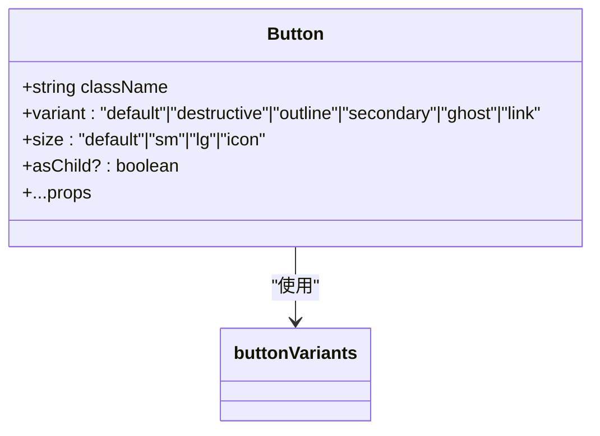

**图示来源**  
- [button.tsx](file://src/components/ui/button.tsx#L7-L35)

**本节来源**  
- [button.tsx](file://src/components/ui/button.tsx)

### 输入框组件
输入框组件直接封装了原生input元素，应用了统一的样式类，包括边框、背景、焦点状态和禁用状态的样式。组件通过`cn`工具函数合并传入的className。

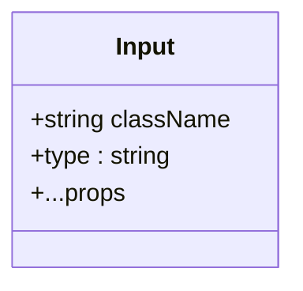

**图示来源**  
- [input.tsx](file://src/components/ui/input.tsx#L8-L22)

**本节来源**  
- [input.tsx](file://src/components/ui/input.tsx)

### 选择器组件
选择器组件完整封装了Radix UI的Select原语，包括触发器、内容、选项等子组件。特别的是，组件禁用了Portal功能，避免在Chrome扩展Popup中因焦点转移导致窗口关闭的问题。

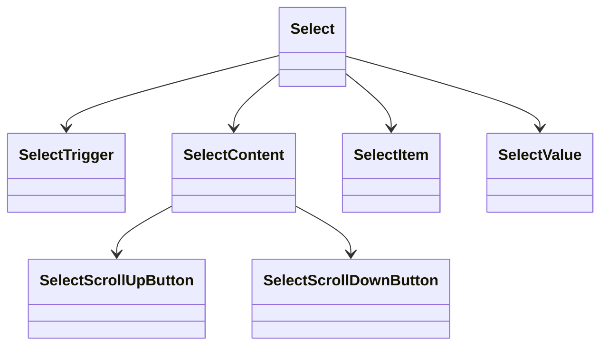

**图示来源**  
- [select.tsx](file://src/components/ui/select.tsx)

**本节来源**  
- [select.tsx](file://src/components/ui/select.tsx)

### 标签组件
标签组件封装了Radix UI的Label原语，应用了统一的字体大小和粗细样式，并处理了禁用状态的样式。

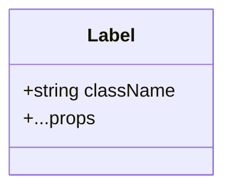

**图示来源**  
- [label.tsx](file://src/components/ui/label.tsx)

**本节来源**  
- [label.tsx](file://src/components/ui/label.tsx)

### 弹出层组件
弹出层组件封装了Radix UI的Popover原语，同样禁用了Portal功能以适应Chrome扩展环境。

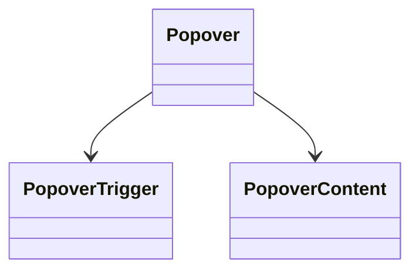

**图示来源**  
- [popover.tsx](file://src/components/ui/popover.tsx)

**本节来源**  
- [popover.tsx](file://src/components/ui/popover.tsx)

## TemplateSelector组件

### 组件概述
TemplateSelector组件用于管理简历模板，支持模板的选择、添加、重命名、删除和复制功能。

### 属性接口
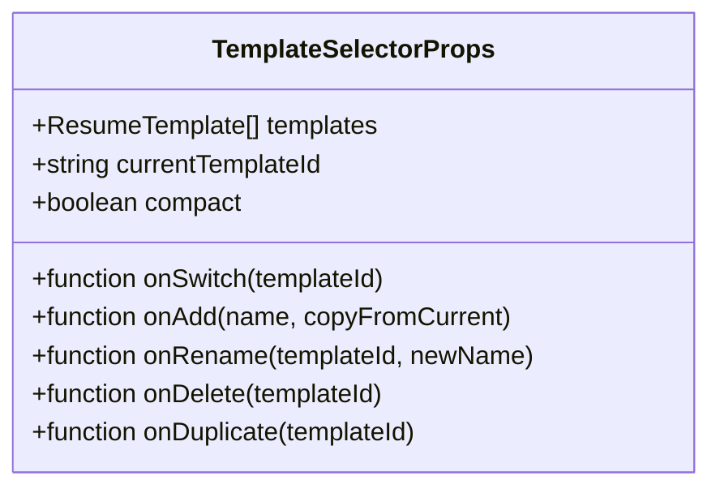

**图示来源**  
- [TemplateSelector.tsx](file://src/components/common/TemplateSelector.tsx#L13-L22)

### 交互逻辑
组件使用对话框模式处理各种操作，通过`dialogMode`状态管理当前显示的对话框类型（添加、重命名、删除）。

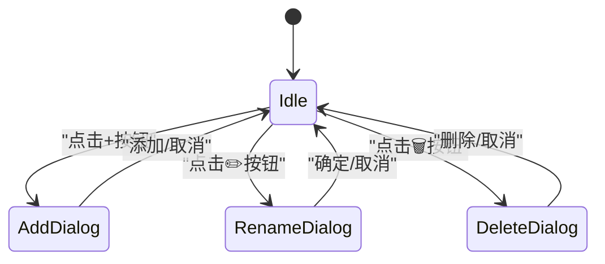

**图示来源**  
- [TemplateSelector.tsx](file://src/components/common/TemplateSelector.tsx)

### 渲染逻辑
组件根据`compact`属性决定显示模式，非紧凑模式显示完整界面，紧凑模式仅显示核心功能。

**本节来源**  
- [TemplateSelector.tsx](file://src/components/common/TemplateSelector.tsx)

## FloatingPanel组件

### 组件概述
FloatingPanel组件实现悬浮窗模式的主界面，支持拖拽、最小化、关闭等交互行为。

### 属性接口
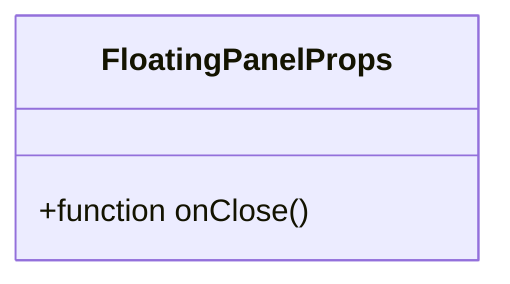

**图示来源**  
- [FloatingPanel.tsx](file://src/components/floating/FloatingPanel.tsx#L21-L23)

### 定位逻辑
组件通过`position`状态管理悬浮窗位置，使用`useEffect`监听拖拽事件，计算新的位置并限制在视口范围内。

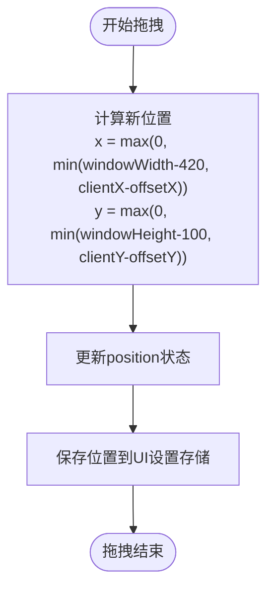

**图示来源**  
- [FloatingPanel.tsx](file://src/components/floating/FloatingPanel.tsx)

### 事件绑定
组件在标题栏绑定`onMouseDown`事件处理拖拽开始，在`document`上绑定`mousemove`和`mouseup`事件处理拖拽过程和结束。

**本节来源**  
- [FloatingPanel.tsx](file://src/components/floating/FloatingPanel.tsx)

## field-fill-button组件

### 组件概述
field-fill-button组件实现"点填模式"功能，允许用户将插件中的字段值填充到网页的输入框中。

### 属性接口
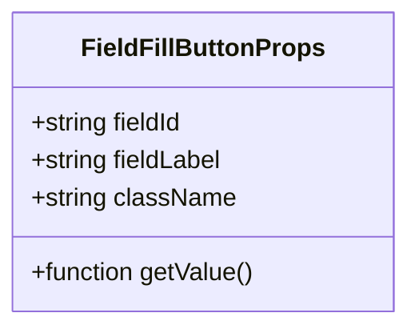

**图示来源**  
- [field-fill-button.tsx](file://src/components/ui/field-fill-button.tsx#L4-L9)

### 通信机制
组件通过调用`startSingleFieldFill`服务函数与content script通信，根据运行环境选择不同的通信方式。

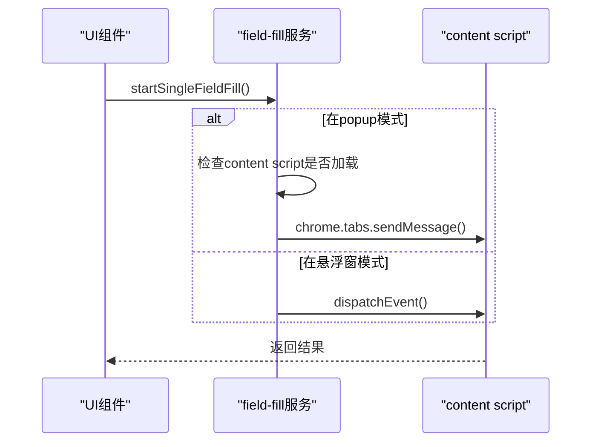

**图示来源**  
- [field-fill-button.tsx](file://src/components/ui/field-fill-button.tsx)
- [field-fill.ts](file://src/services/field-fill.ts)

### 状态管理
组件维护加载状态和消息提示状态，提供用户友好的反馈。

**本节来源**  
- [field-fill-button.tsx](file://src/components/ui/field-fill-button.tsx)
- [field-fill.ts](file://src/services/field-fill.ts)

## 依赖分析
组件库依赖Radix UI作为基础原语，使用Tailwind CSS进行样式设计，通过Plasmo框架实现Chrome扩展的构建和样式作用域。

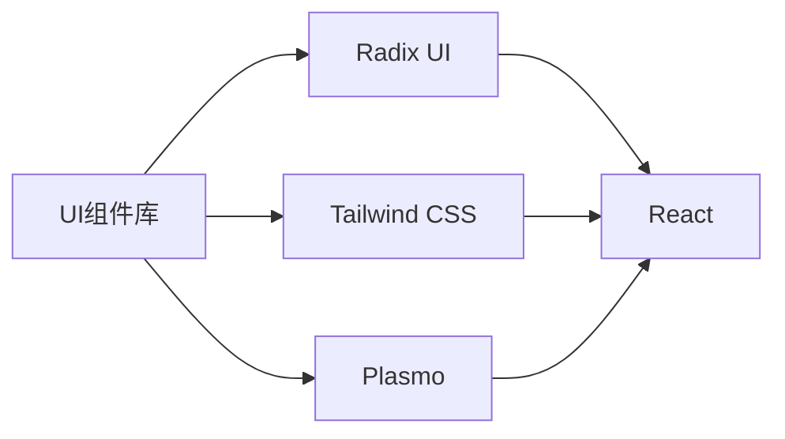

**图示来源**  
- [package.json](file://package.json)

**本节来源**  
- [package.json](file://package.json)

## 结论
该UI组件库设计合理，通过封装Radix UI原语实现了统一的设计语言和交互模式。组件间职责清晰，通信机制完善，为插件提供了稳定可靠的用户界面基础。