# 基础UI组件

<cite>
**本文档引用的文件**  
- [button.tsx](file://src/components/ui/button.tsx)
- [input.tsx](file://src/components/ui/input.tsx)
- [label.tsx](file://src/components/ui/label.tsx)
- [select.tsx](file://src/components/ui/select.tsx)
- [tabs.tsx](file://src/components/ui/tabs.tsx)
- [popover.tsx](file://src/components/ui/popover.tsx)
- [date-picker.tsx](file://src/components/ui/date-picker.tsx)
- [calendar.tsx](file://src/components/ui/calendar.tsx)
- [input-with-fill.tsx](file://src/components/ui/input-with-fill.tsx)
- [field-fill-button.tsx](file://src/components/ui/field-fill-button.tsx)
- [field-config.ts](file://src/config/field-config.ts)
- [field-fill.ts](file://src/services/field-fill.ts)
- [FloatingPanel.tsx](file://src/components/floating/FloatingPanel.tsx)
- [BasicInfoForm.tsx](file://src/features/popup/BasicInfoForm.tsx)
</cite>

## 目录
1. [简介](#简介)
2. [项目结构](#项目结构)
3. [核心组件](#核心组件)
4. [架构概述](#架构概述)
5. [详细组件分析](#详细组件分析)
6. [依赖分析](#依赖分析)
7. [性能考虑](#性能考虑)
8. [故障排除指南](#故障排除指南)
9. [结论](#结论)

## 简介
本文档详细记录了基于Radix UI封装的基础UI组件，包括按钮、输入框、标签、选择器、标签页、弹出框、日期选择器、日历和带填充功能的输入框。文档说明了每个组件的Props接口定义、事件回调机制、样式定制方式（通过Tailwind CSS）以及无障碍访问支持。重点描述了input-with-fill组件如何集成“点填”功能触发逻辑，分析其与field-fill-button的交互模式。同时提供了各组件在弹窗（popup）和悬浮面板（FloatingPanel）中的使用上下文示例，并结合Zod表单验证展示了与React Hook Form的集成方式。

## 项目结构
项目采用模块化结构，主要分为以下几个部分：
- `assets`：存放国际化资源和静态文件
- `docs`：项目文档
- `src`：源代码目录
  - `components`：UI组件
    - `common`：通用组件
    - `floating`：悬浮面板相关组件
    - `ui`：基础UI组件
  - `config`：配置文件
  - `features`：功能特性
  - `hooks`：自定义Hook
  - `lib`：工具库
  - `services`：服务层
  - `types`：类型定义
  - `utils`：工具函数

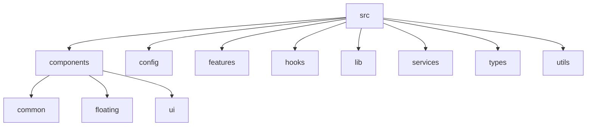

**图源**
- [src/components/ui](file://src/components/ui)

**章节来源**
- [src/components/ui](file://src/components/ui)

## 核心组件
本文档涵盖的核心UI组件包括：button、input、label、select、tabs、popover、date-picker、calendar和input-with-fill。这些组件均基于Radix UI进行封装，遵循一致的设计模式和API规范。

**章节来源**
- [src/components/ui/button.tsx](file://src/components/ui/button.tsx)
- [src/components/ui/input.tsx](file://src/components/ui/input.tsx)
- [src/components/ui/label.tsx](file://src/components/ui/label.tsx)
- [src/components/ui/select.tsx](file://src/components/ui/select.tsx)
- [src/components/ui/tabs.tsx](file://src/components/ui/tabs.tsx)
- [src/components/ui/popover.tsx](file://src/components/ui/popover.tsx)
- [src/components/ui/date-picker.tsx](file://src/components/ui/date-picker.tsx)
- [src/components/ui/calendar.tsx](file://src/components/ui/calendar.tsx)
- [src/components/ui/input-with-fill.tsx](file://src/components/ui/input-with-fill.tsx)

## 架构概述
系统采用分层架构，基于React和Radix UI构建。UI组件层封装了基础的交互元素，通过Tailwind CSS实现样式定制。业务逻辑层处理数据流和状态管理，服务层负责与浏览器API的交互。整个架构支持在弹窗和悬浮面板两种模式下运行。

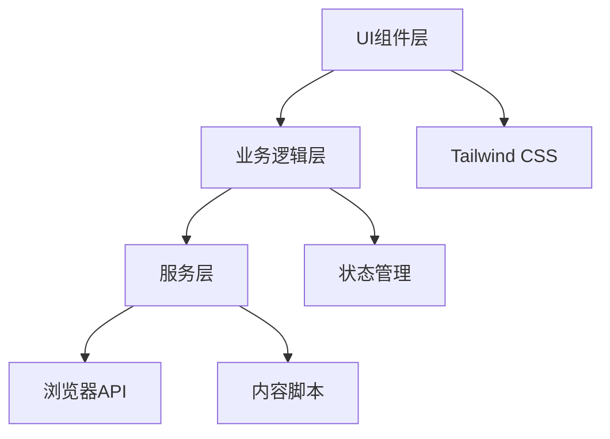

**图源**
- [src/components/ui](file://src/components/ui)
- [src/services](file://src/services)

## 详细组件分析

### 按钮组件分析
按钮组件基于Radix UI的Slot组件构建，支持多种变体和尺寸。通过cva库定义样式变体，使用Tailwind CSS类名进行样式定制。

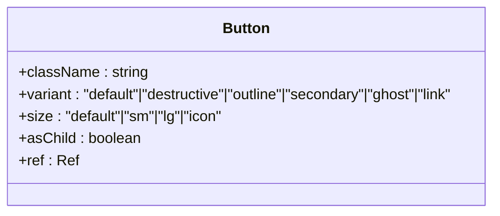

**图源**
- [button.tsx](file://src/components/ui/button.tsx#L7-L35)

**章节来源**
- [button.tsx](file://src/components/ui/button.tsx)

### 输入框组件分析
输入框组件封装了原生input元素，提供了统一的样式和无障碍访问支持。支持所有标准的HTML输入属性。

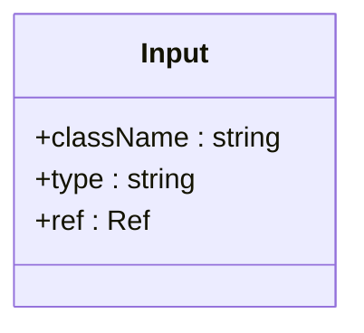

**图源**
- [input.tsx](file://src/components/ui/input.tsx#L8-L25)

**章节来源**
- [input.tsx](file://src/components/ui/input.tsx)

### 标签组件分析
标签组件基于Radix UI的LabelPrimitive构建，提供了与表单控件的无障碍关联功能。

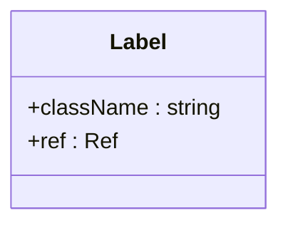

**图源**
- [label.tsx](file://src/components/ui/label.tsx#L11-L24)

**章节来源**
- [label.tsx](file://src/components/ui/label.tsx)

### 选择器组件分析
选择器组件基于Radix UI的Select组件构建，提供了完整的下拉选择功能，包括滚动按钮和内容区域。

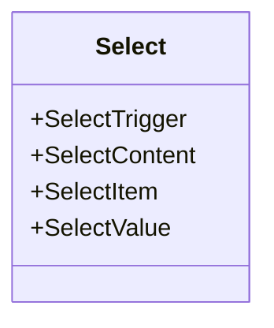

**图源**
- [select.tsx](file://src/components/ui/select.tsx#L7-L160)

**章节来源**
- [select.tsx](file://src/components/ui/select.tsx)

### 标签页组件分析
标签页组件实现了完整的标签页切换功能，使用React Context管理选中状态。

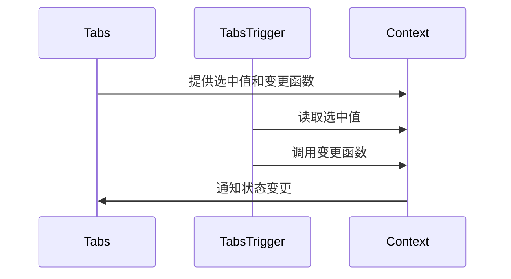

**图源**
- [tabs.tsx](file://src/components/ui/tabs.tsx#L5-L105)

**章节来源**
- [tabs.tsx](file://src/components/ui/tabs.tsx)

### 弹出框组件分析
弹出框组件基于Radix UI的Popover构建，用于显示浮动内容，特别优化了在Chrome扩展中的焦点管理。

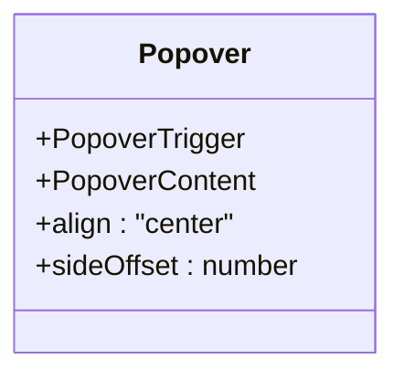

**图源**
- [popover.tsx](file://src/components/ui/popover.tsx#L6-L28)

**章节来源**
- [popover.tsx](file://src/components/ui/popover.tsx)

### 日期选择器组件分析
日期选择器组件组合了Popover和Calendar组件，提供了完整的日期选择功能。

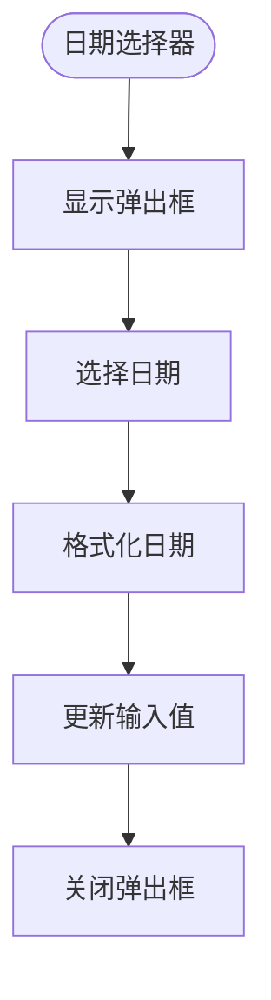

**图源**
- [date-picker.tsx](file://src/components/ui/date-picker.tsx#L36-L90)

**章节来源**
- [date-picker.tsx](file://src/components/ui/date-picker.tsx)

### 日历组件分析
日历组件基于react-day-picker构建，支持中文本地化和多种导航选项。

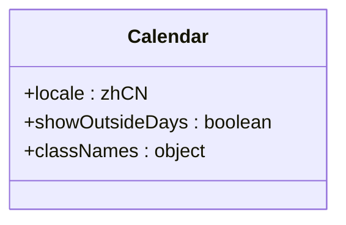

**图源**
- [calendar.tsx](file://src/components/ui/calendar.tsx#L11-L69)

**章节来源**
- [calendar.tsx](file://src/components/ui/calendar.tsx)

### 带填充功能的输入框组件分析
input-with-fill组件是本项目的核心创新，集成了“点填”功能，允许用户将输入内容注入到网页中。

#### 组件结构
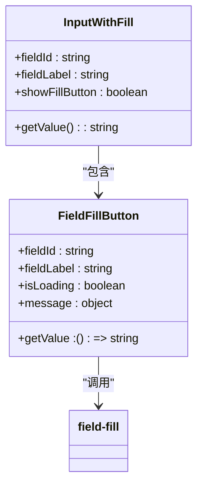

**图源**
- [input-with-fill.tsx](file://src/components/ui/input-with-fill.tsx#L16-L169)
- [field-fill-button.tsx](file://src/components/ui/field-fill-button.tsx#L15-L121)

#### 交互流程
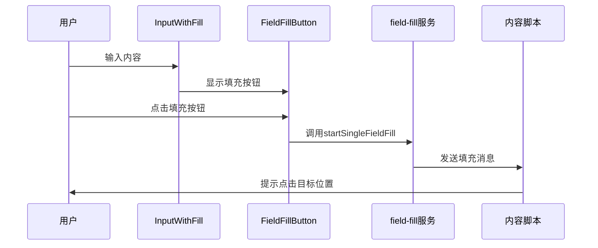

**图源**
- [input-with-fill.tsx](file://src/components/ui/input-with-fill.tsx)
- [field-fill-button.tsx](file://src/components/ui/field-fill-button.tsx)
- [field-fill.ts](file://src/services/field-fill.ts)

#### 使用上下文
在弹窗和悬浮面板中，这些组件被广泛用于简历信息的输入和填充：

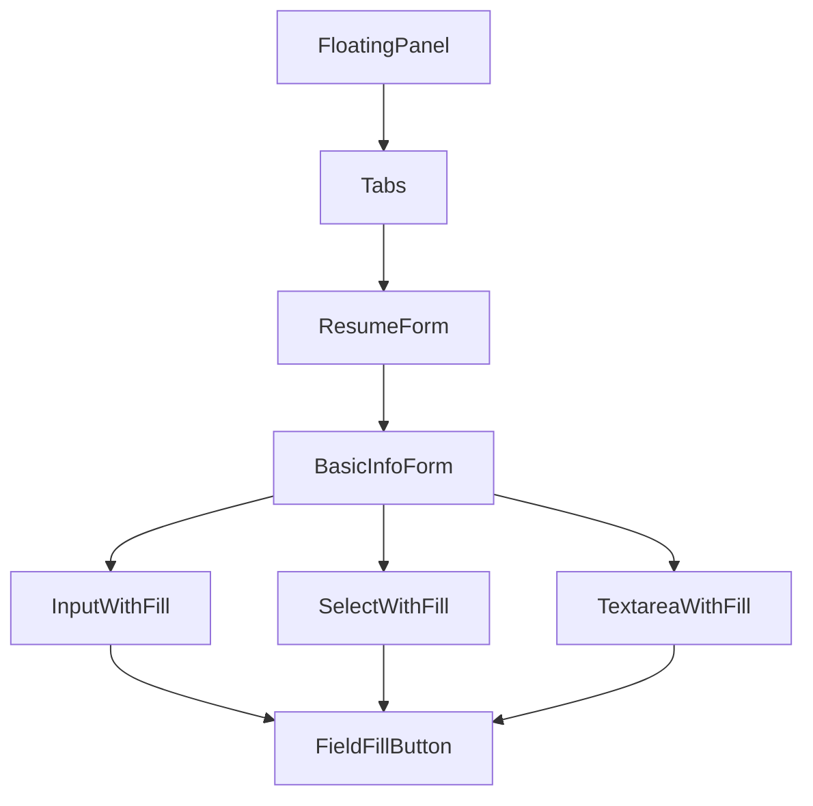

**图源**
- [FloatingPanel.tsx](file://src/components/floating/FloatingPanel.tsx#L118-L413)
- [BasicInfoForm.tsx](file://src/features/popup/BasicInfoForm.tsx#L36-L179)

#### 与React Hook Form集成
组件与React Hook Form和Zod验证库无缝集成，实现了表单验证和自动保存：

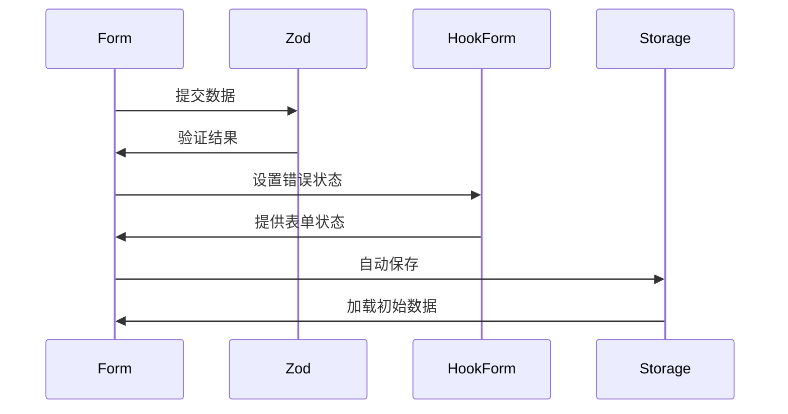

**图源**
- [BasicInfoForm.tsx](file://src/features/popup/BasicInfoForm.tsx#L23-L34)

**章节来源**
- [input-with-fill.tsx](file://src/components/ui/input-with-fill.tsx)
- [field-fill-button.tsx](file://src/components/ui/field-fill-button.tsx)
- [field-fill.ts](file://src/services/field-fill.ts)
- [FloatingPanel.tsx](file://src/components/floating/FloatingPanel.tsx)
- [BasicInfoForm.tsx](file://src/features/popup/BasicInfoForm.tsx)

## 依赖分析
项目依赖关系清晰，UI组件层独立于业务逻辑，通过props传递数据和回调函数。

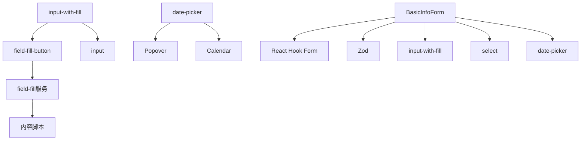

**图源**
- [package.json](file://package.json)
- [src/components/ui](file://src/components/ui)

**章节来源**
- [package.json](file://package.json)
- [src/components/ui](file://src/components/ui)

## 性能考虑
组件设计考虑了性能优化：
- 使用React.memo和useCallback避免不必要的渲染
- 通过ref直接访问DOM元素，减少重新渲染
- 在悬浮面板中实现最小化状态，减少DOM开销
- 使用防抖保存，避免频繁存储操作

## 故障排除指南
常见问题及解决方案：
- **填充按钮无响应**：检查页面是否支持内容脚本注入，刷新页面后重试
- **日期选择器不显示**：确保正确导入Calendar组件和相关样式
- **表单验证失败**：检查Zod schema定义是否与输入组件匹配
- **悬浮面板拖拽异常**：检查浏览器是否阻止了固定定位

**章节来源**
- [field-fill.ts](file://src/services/field-fill.ts#L1-L260)
- [FloatingPanel.tsx](file://src/components/floating/FloatingPanel.tsx#L1-L414)

## 结论
本文档详细记录了基于Radix UI封装的基础UI组件，重点介绍了input-with-fill组件的“点填”功能实现。组件设计遵循一致性原则，支持无障碍访问，并通过Tailwind CSS实现灵活的样式定制。在弹窗和悬浮面板中的实际应用证明了组件的实用性和可靠性。与React Hook Form和Zod的集成提供了强大的表单处理能力，为用户提供流畅的简历填写体验。