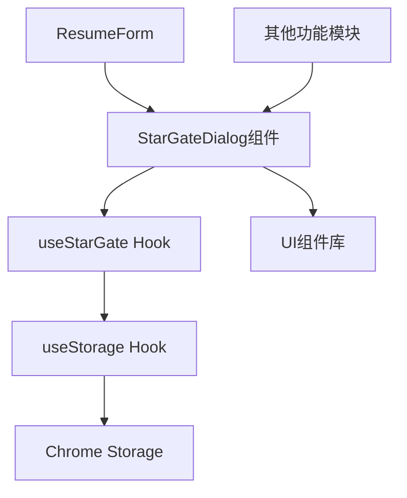
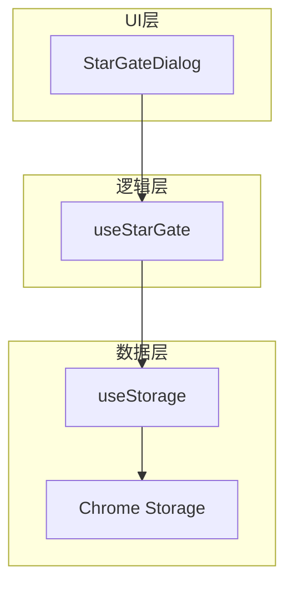
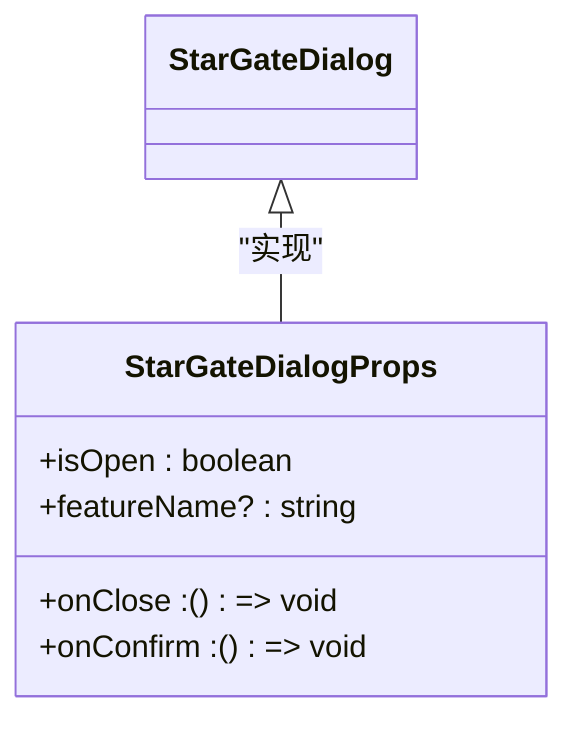
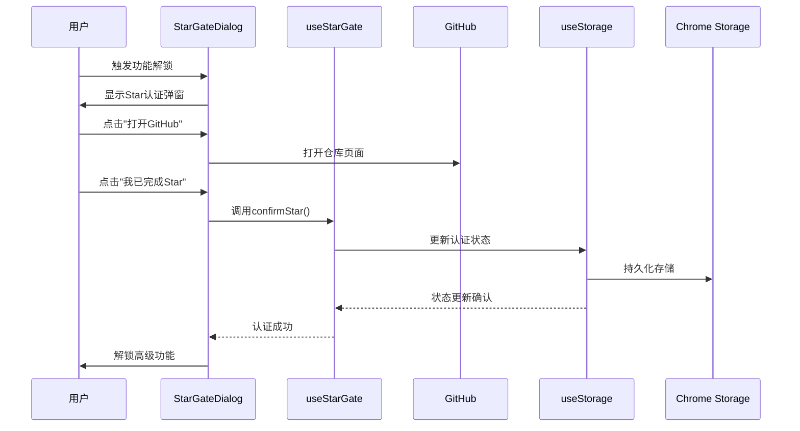
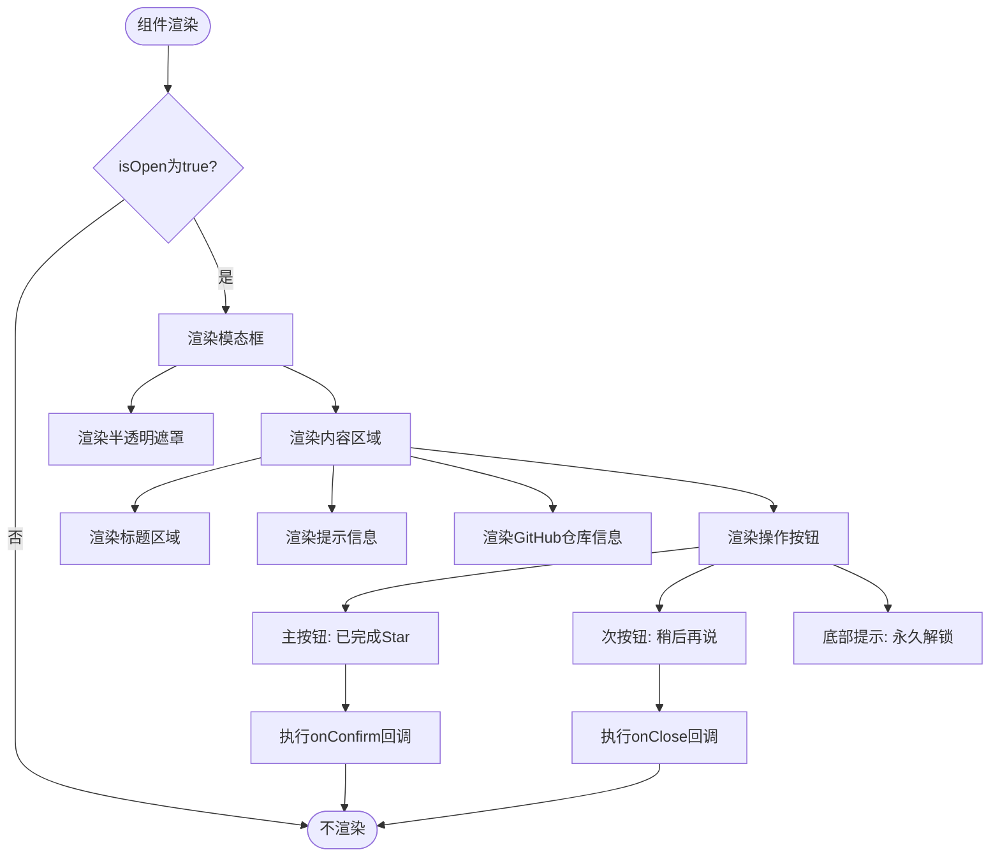
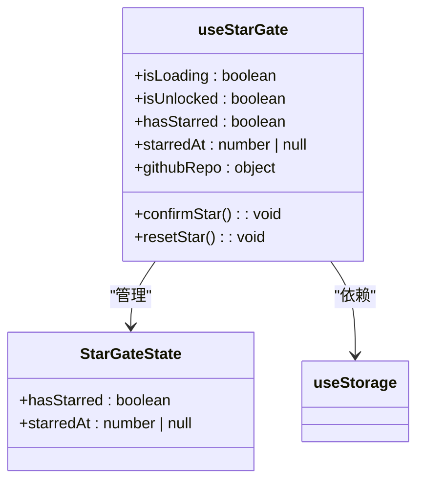
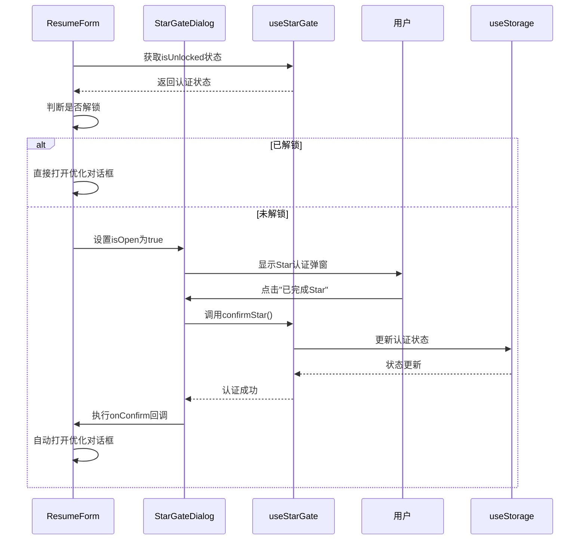
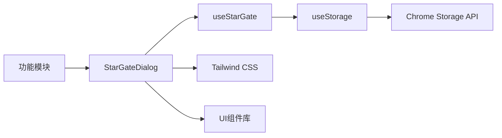

# Star认证弹窗

<cite>
**本文档引用的文件**
- [StarGateDialog.tsx](file://src/components/common/StarGateDialog.tsx)
- [useStarGate.ts](file://src/hooks/useStarGate.ts)
- [useStorage.ts](file://src/hooks/useStorage.ts)
- [ResumeForm.tsx](file://src/features/popup/ResumeForm.tsx)
- [button.tsx](file://src/components/ui/button.tsx)
- [style.css](file://src/style.css)
- [tailwind.config.js](file://tailwind.config.js)
</cite>

## 目录
1. [简介](#简介)
2. [项目结构](#项目结构)
3. [核心组件](#核心组件)
4. [架构概述](#架构概述)
5. [详细组件分析](#详细组件分析)
6. [依赖分析](#依赖分析)
7. [性能考量](#性能考量)
8. [故障排除指南](#故障排除指南)
9. [结论](#结论)

## 简介
Star认证弹窗（StarGateDialog）是Offer捞捞插件中用于产品增长策略的关键认证拦截机制。该组件通过优雅的用户界面引导用户为GitHub开源项目点Star，以解锁高级功能。本组件与useStarGate Hook深度集成，实现了完整的用户认证流程，既保障了开源项目的可持续发展，又为用户提供了有价值的功能解锁体验。

## 项目结构
Star认证弹窗组件位于插件的公共组件目录中，与核心Hook共同构成认证系统。该组件采用模块化设计，与其他功能模块松耦合，便于在不同场景中复用。

**图示来源**
- [StarGateDialog.tsx](file://src/components/common/StarGateDialog.tsx)
- [useStarGate.ts](file://src/hooks/useStarGate.ts)
- [useStorage.ts](file://src/hooks/useStorage.ts)

**本节来源**
- [StarGateDialog.tsx](file://src/components/common/StarGateDialog.tsx)
- [useStarGate.ts](file://src/hooks/useStarGate.ts)

## 核心组件
Star认证弹窗组件通过isOpen属性精确控制显示状态，结合onConfirm和onClose回调函数管理用户交互流程。组件设计充分考虑用户体验，通过渐变背景、动画效果和响应式布局创造愉悦的交互体验。

**本节来源**
- [StarGateDialog.tsx](file://src/components/common/StarGateDialog.tsx)
- [useStarGate.ts](file://src/hooks/useStarGate.ts)

## 架构概述
Star认证系统采用分层架构设计，上层为UI组件，中层为业务逻辑Hook，底层为数据存储服务。这种架构确保了关注点分离，提高了代码的可维护性和可测试性。

**图示来源**
- [StarGateDialog.tsx](file://src/components/common/StarGateDialog.tsx)
- [useStarGate.ts](file://src/hooks/useStarGate.ts)
- [useStorage.ts](file://src/hooks/useStorage.ts)

## 详细组件分析

### StarGateDialog组件分析
StarGateDialog组件是产品增长策略的核心实现，通过认证拦截机制平衡开源贡献与功能解锁。

#### 组件接口设计

**图示来源**
- [StarGateDialog.tsx](file://src/components/common/StarGateDialog.tsx#L5-L10)

#### 认证流程序列图

**图示来源**
- [StarGateDialog.tsx](file://src/components/common/StarGateDialog.tsx)
- [useStarGate.ts](file://src/hooks/useStarGate.ts)

#### 视觉设计流程图

**图示来源**
- [StarGateDialog.tsx](file://src/components/common/StarGateDialog.tsx)
- [style.css](file://src/style.css)

**本节来源**
- [StarGateDialog.tsx](file://src/components/common/StarGateDialog.tsx)
- [useStarGate.ts](file://src/hooks/useStarGate.ts)
- [button.tsx](file://src/components/ui/button.tsx)

### useStarGate Hook分析
useStarGate Hook是Star认证系统的核心逻辑控制器，负责管理用户的认证状态。

#### 状态管理类图

**图示来源**
- [useStarGate.ts](file://src/hooks/useStarGate.ts#L7-L18)
- [useStorage.ts](file://src/hooks/useStorage.ts)

#### 集成应用分析
在简历优化功能中，StarGateDialog与useStarGate的集成实现了平滑的用户体验流程。当用户尝试使用AI优化功能时，系统首先检查认证状态，未认证则显示Star弹窗，认证完成后自动进入优化流程。

**图示来源**
- [ResumeForm.tsx](file://src/features/popup/ResumeForm.tsx)
- [useStarGate.ts](file://src/hooks/useStarGate.ts)
- [StarGateDialog.tsx](file://src/components/common/StarGateDialog.tsx)

**本节来源**
- [useStarGate.ts](file://src/hooks/useStarGate.ts)
- [ResumeForm.tsx](file://src/features/popup/ResumeForm.tsx)

## 依赖分析
Star认证系统依赖于多个核心模块，形成了清晰的依赖关系链。

**图示来源**
- [package.json](file://package.json)
- [StarGateDialog.tsx](file://src/components/common/StarGateDialog.tsx)
- [useStarGate.ts](file://src/hooks/useStarGate.ts)

**本节来源**
- [StarGateDialog.tsx](file://src/components/common/StarGateDialog.tsx)
- [useStarGate.ts](file://src/hooks/useStarGate.ts)
- [useStorage.ts](file://src/hooks/useStorage.ts)

## 性能考量
Star认证弹窗组件在性能方面进行了优化设计。组件采用条件渲染机制，当isOpen为false时直接返回null，避免不必要的DOM渲染和性能开销。状态管理通过useStorage Hook实现持久化存储，确保用户认证状态在浏览器会话间保持一致。

## 故障排除指南
当Star认证功能出现异常时，可按以下步骤进行排查：
1. 检查Chrome Storage权限是否正常
2. 验证useStorage Hook是否正确初始化
3. 确认GitHub仓库URL配置正确
4. 检查网络连接是否正常
5. 验证用户是否真正完成了Star操作

**本节来源**
- [useStorage.ts](file://src/hooks/useStorage.ts#L15-L33)
- [useStarGate.ts](file://src/hooks/useStarGate.ts#L23-L27)

## 结论
Star认证弹窗组件通过精心设计的用户体验流程和稳健的技术实现，成功地将开源贡献与产品功能解锁相结合。该组件不仅为开源项目带来了必要的社区支持，也为用户提供了清晰的价值交换机制，是开源产品商业化策略的优秀实践案例。