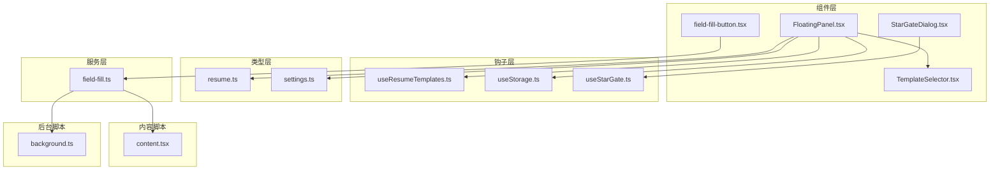
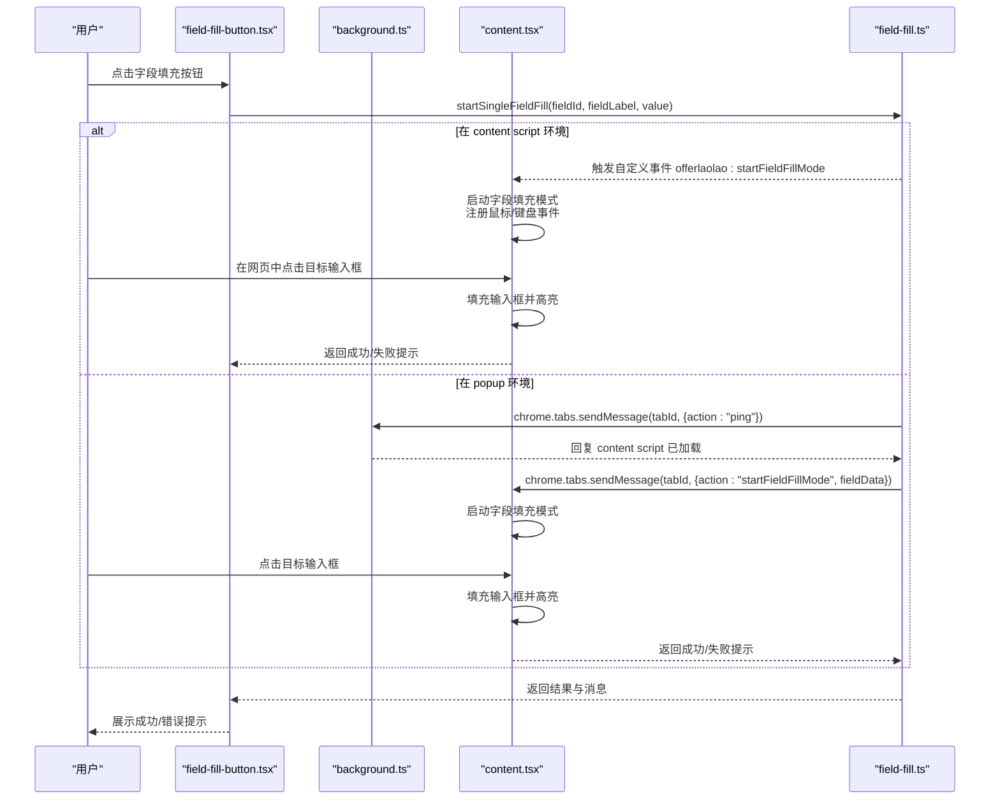
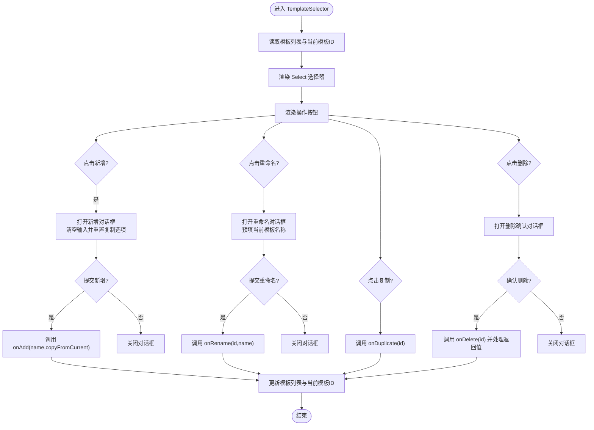
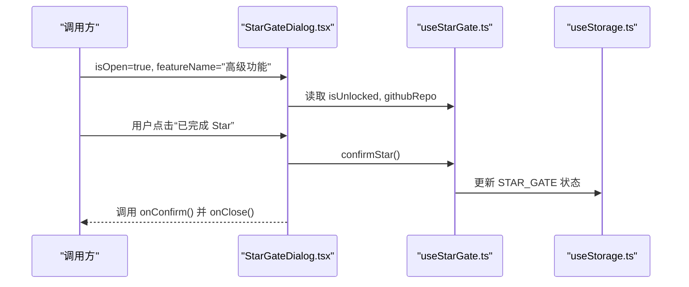
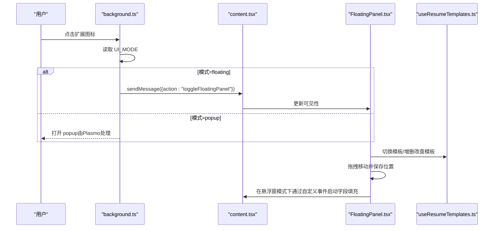
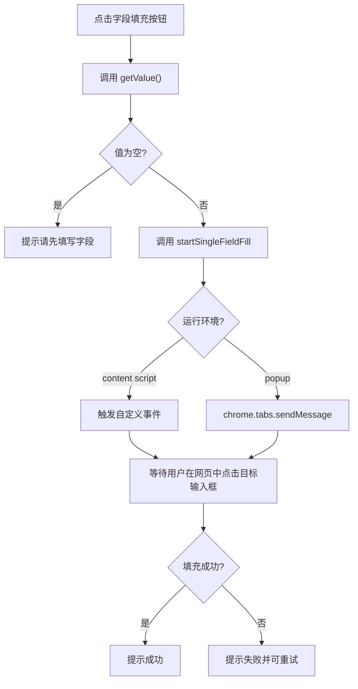
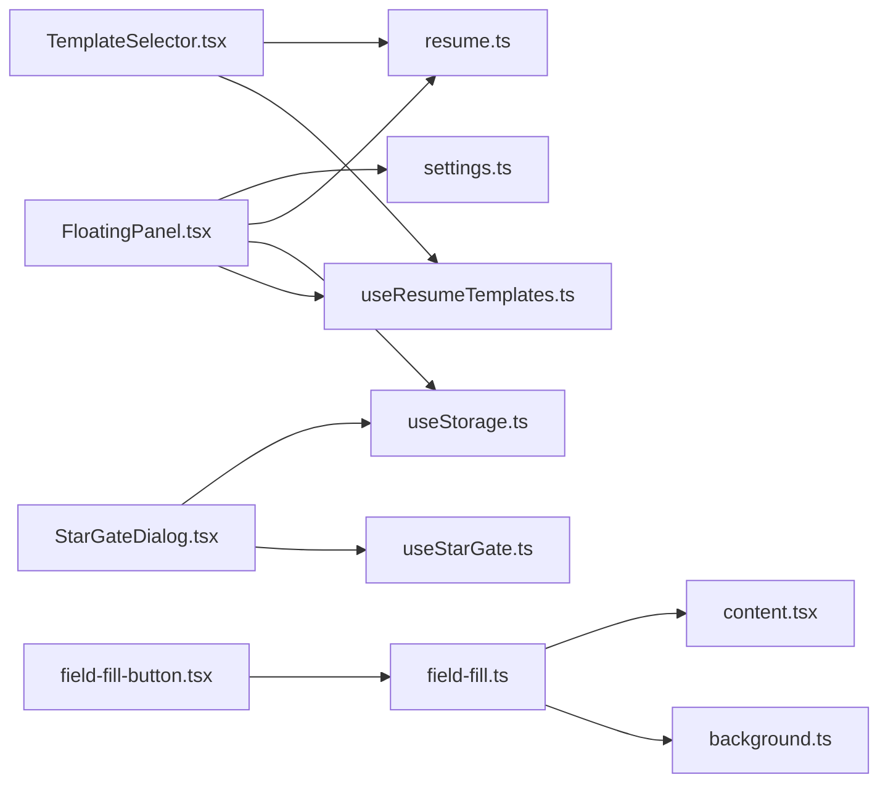

# 复合功能组件

<cite>
**本文引用的文件**
- [TemplateSelector.tsx](file://src/components/common/TemplateSelector.tsx)
- [StarGateDialog.tsx](file://src/components/common/StarGateDialog.tsx)
- [FloatingPanel.tsx](file://src/components/floating/FloatingPanel.tsx)
- [field-fill-button.tsx](file://src/components/ui/field-fill-button.tsx)
- [useResumeTemplates.ts](file://src/hooks/useResumeTemplates.ts)
- [useStorage.ts](file://src/hooks/useStorage.ts)
- [useStarGate.ts](file://src/hooks/useStarGate.ts)
- [field-fill.ts](file://src/services/field-fill.ts)
- [content.tsx](file://src/content.tsx)
- [background.ts](file://src/background.ts)
- [resume.ts](file://src/types/resume.ts)
- [settings.ts](file://src/types/settings.ts)
</cite>

## 目录
1. [引言](#引言)
2. [项目结构](#项目结构)
3. [核心组件](#核心组件)
4. [架构总览](#架构总览)
5. [组件详解](#组件详解)
6. [依赖关系分析](#依赖关系分析)
7. [性能考量](#性能考量)
8. [故障排查指南](#故障排查指南)
9. [结论](#结论)

## 引言
本文件聚焦插件中的复合UI组件，深入解析以下四类组件：
- TemplateSelector：多简历模板的可视化切换与状态同步
- StarGateDialog：认证流程集成与条件渲染逻辑
- FloatingPanel：悬浮窗在不同招聘网站中的动态定位、拖拽行为与与content script的通信机制
- field-fill-button：字段级别的“点填模式”触发，协调background与content script完成精准填充

文档同时覆盖各组件的调用方式、状态管理依赖（useStorage、useResumeTemplates）、错误处理机制，并提供可视化图示帮助理解。

## 项目结构
围绕复合UI组件，相关代码分布在如下模块：
- 组件层：common（TemplateSelector、StarGateDialog）、floating（FloatingPanel）、ui（field-fill-button）
- 钩子层：useStorage、useResumeTemplates、useStarGate
- 类型层：resume.ts、settings.ts
- 服务层：field-fill.ts
- 内容脚本：content.tsx
- 后台脚本：background.ts

图表来源
- [FloatingPanel.tsx](file://src/components/floating/FloatingPanel.tsx#L1-L414)
- [TemplateSelector.tsx](file://src/components/common/TemplateSelector.tsx#L1-L259)
- [field-fill-button.tsx](file://src/components/ui/field-fill-button.tsx#L1-L121)
- [useResumeTemplates.ts](file://src/hooks/useResumeTemplates.ts#L1-L258)
- [useStorage.ts](file://src/hooks/useStorage.ts#L1-L102)
- [useStarGate.ts](file://src/hooks/useStarGate.ts#L1-L72)
- [field-fill.ts](file://src/services/field-fill.ts#L1-L260)
- [content.tsx](file://src/content.tsx#L1-L454)
- [background.ts](file://src/background.ts#L1-L80)
- [resume.ts](file://src/types/resume.ts#L1-L212)
- [settings.ts](file://src/types/settings.ts#L1-L192)

章节来源
- [FloatingPanel.tsx](file://src/components/floating/FloatingPanel.tsx#L1-L414)
- [TemplateSelector.tsx](file://src/components/common/TemplateSelector.tsx#L1-L259)
- [field-fill-button.tsx](file://src/components/ui/field-fill-button.tsx#L1-L121)
- [useResumeTemplates.ts](file://src/hooks/useResumeTemplates.ts#L1-L258)
- [useStorage.ts](file://src/hooks/useStorage.ts#L1-L102)
- [useStarGate.ts](file://src/hooks/useStarGate.ts#L1-L72)
- [field-fill.ts](file://src/services/field-fill.ts#L1-L260)
- [content.tsx](file://src/content.tsx#L1-L454)
- [background.ts](file://src/background.ts#L1-L80)
- [resume.ts](file://src/types/resume.ts#L1-L212)
- [settings.ts](file://src/types/settings.ts#L1-L192)

## 核心组件
- TemplateSelector：提供模板选择、新增、重命名、复制、删除等操作，支持紧凑/完整两种展示形态，内部维护对话框状态与输入值，通过回调与上层模板系统交互。
- StarGateDialog：基于useStarGate状态控制的认证引导弹窗，提供GitHub仓库跳转与确认解锁高级功能的交互。
- FloatingPanel：悬浮窗主面板，支持拖拽、最小化、导出、设置切换、模板选择与简历表单编辑，内部集成解析数据填充与UI设置持久化。
- field-fill-button：字段级“点填模式”入口，封装startSingleFieldFill调用，负责错误提示与加载状态反馈。

章节来源
- [TemplateSelector.tsx](file://src/components/common/TemplateSelector.tsx#L1-L259)
- [StarGateDialog.tsx](file://src/components/common/StarGateDialog.tsx#L1-L106)
- [FloatingPanel.tsx](file://src/components/floating/FloatingPanel.tsx#L1-L414)
- [field-fill-button.tsx](file://src/components/ui/field-fill-button.tsx#L1-L121)

## 架构总览
下面以序列图展示“点填模式”的端到端流程，包括background与content script之间的消息传递、content script对页面DOM的操作以及field-fill-button的前端触发。

图表来源
- [field-fill-button.tsx](file://src/components/ui/field-fill-button.tsx#L1-L121)
- [field-fill.ts](file://src/services/field-fill.ts#L1-L260)
- [content.tsx](file://src/content.tsx#L1-L454)
- [background.ts](file://src/background.ts#L1-L80)

## 组件详解

### TemplateSelector：多模板可视化切换与状态同步
- 功能要点
  - 选择器：基于Select组件展示模板列表，onValueChange回调驱动父层切换当前模板。
  - 操作区：提供新增、重命名、复制、删除模板的按钮，配合内部对话框状态管理。
  - 对话框：三种模式（新增、重命名、删除）通过内部状态切换，输入校验与提交回调由父层提供。
  - 紧凑模式：compact参数控制布局与间距，适配不同容器尺寸。
- 状态与依赖
  - 依赖useResumeTemplates提供的模板列表、当前模板ID、当前简历数据，以及模板CRUD操作。
  - 依赖useStorage持久化UI设置（如悬浮窗位置、最小化状态），用于FloatingPanel的定位与状态恢复。
- 错误处理
  - 删除最后一个模板时返回false并提示不可删除，避免空模板集。
  - 新增/重命名时对输入进行trim校验，防止空名称。
- 调用方式
  - 作为FloatingPanel的子组件被渲染，接收templates、currentTemplateId与switch/rename/delete/duplicate等回调。

图表来源
- [TemplateSelector.tsx](file://src/components/common/TemplateSelector.tsx#L1-L259)
- [useResumeTemplates.ts](file://src/hooks/useResumeTemplates.ts#L1-L258)

章节来源
- [TemplateSelector.tsx](file://src/components/common/TemplateSelector.tsx#L1-L259)
- [useResumeTemplates.ts](file://src/hooks/useResumeTemplates.ts#L1-L258)

### StarGateDialog：认证流程集成与条件渲染
- 功能要点
  - 条件渲染：isOpen为true时才渲染弹窗，避免无意义的DOM占用。
  - 认证引导：提供GitHub仓库链接跳转，鼓励用户Star以解锁高级功能。
  - 确认回调：onConfirm用于执行解锁逻辑，onClose用于关闭弹窗。
- 状态与依赖
  - 依赖useStarGate返回的hasStarred、confirmStar等状态与方法，用于记录用户已Star并更新存储。
  - 依赖useStorage的STAR_GATE键持久化Star状态。
- 错误处理
  - 无显式错误分支，主要通过外部状态控制显示与行为。
- 调用方式
  - 通常由设置页或功能入口根据useStarGate.isUnlocked状态决定是否展示。

图表来源
- [StarGateDialog.tsx](file://src/components/common/StarGateDialog.tsx#L1-L106)
- [useStarGate.ts](file://src/hooks/useStarGate.ts#L1-L72)
- [useStorage.ts](file://src/hooks/useStorage.ts#L1-L102)

章节来源
- [StarGateDialog.tsx](file://src/components/common/StarGateDialog.tsx#L1-L106)
- [useStarGate.ts](file://src/hooks/useStarGate.ts#L1-L72)
- [useStorage.ts](file://src/hooks/useStorage.ts#L1-L102)

### FloatingPanel：动态定位、拖拽与content script通信
- 动态定位与拖拽
  - 位置持久化：从UI设置加载初始位置，拖拽结束后保存至UI设置。
  - 边界约束：拖拽时限制面板在窗口可视区域内，避免超出屏幕。
  - 最小化：提供圆形最小化入口，点击展开；最小化状态下仍保留拖拽能力。
- 与content script的通信
  - 切换悬浮窗显示：background根据UI模式向content script发送toggle/show/hide消息，content script通过回调更新FloatingPanel可见性。
  - 字段填充模式：当处于悬浮窗模式时，直接通过window自定义事件触发content script的字段填充模式；当处于popup模式时，通过chrome.tabs.sendMessage与content script交互。
- 模板与数据
  - 使用useResumeTemplates管理模板集合与当前简历数据，支持模板切换、新增、重命名、复制、删除与更新。
  - 解析数据填充：ResumeUpload解析完成后，convertParsedDataToResumeData将解析字段映射到对应简历数据并更新当前模板。

图表来源
- [FloatingPanel.tsx](file://src/components/floating/FloatingPanel.tsx#L1-L414)
- [background.ts](file://src/background.ts#L1-L80)
- [content.tsx](file://src/content.tsx#L1-L454)
- [useResumeTemplates.ts](file://src/hooks/useResumeTemplates.ts#L1-L258)

章节来源
- [FloatingPanel.tsx](file://src/components/floating/FloatingPanel.tsx#L1-L414)
- [background.ts](file://src/background.ts#L1-L80)
- [content.tsx](file://src/content.tsx#L1-L454)
- [useResumeTemplates.ts](file://src/hooks/useResumeTemplates.ts#L1-L258)

### field-fill-button：字段级“点填模式”触发与错误处理
- 触发流程
  - 读取字段值：getValue()返回当前字段值，若为空则提示“请先填写字段名”。
  - 调用服务：startSingleFieldFill(fieldId, fieldLabel, value)根据环境选择直接事件或chrome.tabs.sendMessage路径。
  - 结果反馈：根据返回的success与message更新UI提示，支持成功/错误两类提示。
- 与background/content script的协作
  - popup模式：通过chrome.tabs.sendMessage发送startFieldFillMode请求，content script启动字段填充模式并处理点击事件。
  - content模式：直接触发window自定义事件，content script立即进入字段填充模式。
- 错误处理
  - 输入为空、环境不支持、页面脚本未就绪、消息通道异常等情况均有明确提示与重试策略（服务层对消息通道失败进行有限次重试）。

图表来源
- [field-fill-button.tsx](file://src/components/ui/field-fill-button.tsx#L1-L121)
- [field-fill.ts](file://src/services/field-fill.ts#L1-L260)
- [content.tsx](file://src/content.tsx#L1-L454)
- [background.ts](file://src/background.ts#L1-L80)

章节来源
- [field-fill-button.tsx](file://src/components/ui/field-fill-button.tsx#L1-L121)
- [field-fill.ts](file://src/services/field-fill.ts#L1-L260)
- [content.tsx](file://src/content.tsx#L1-L454)
- [background.ts](file://src/background.ts#L1-L80)

## 依赖关系分析
- 组件与钩子
  - FloatingPanel依赖useResumeTemplates与useStorage管理模板与UI设置。
  - TemplateSelector依赖useResumeTemplates的模板CRUD与当前模板状态。
  - StarGateDialog依赖useStarGate与useStorage管理Star状态。
  - field-fill-button依赖field-fill服务与content script交互。
- 类型与存储
  - resume.ts定义了ResumeData、ResumeTemplate与默认值，useResumeTemplates基于这些类型进行迁移与更新。
  - settings.ts定义了UISettings与默认值，FloatingPanel基于此进行位置与最小化状态管理。
  - useStorage提供跨实例同步与开发环境降级（localStorage）。
- 服务与脚本
  - field-fill.ts在popup与content两种环境下分别处理消息与事件，保证一致的用户体验。
  - content.tsx负责字段填充模式的核心逻辑：事件监听、元素查找与填充、提示与高亮。
  - background.ts根据UI模式切换popup行为，并与content script通信。

图表来源
- [FloatingPanel.tsx](file://src/components/floating/FloatingPanel.tsx#L1-L414)
- [TemplateSelector.tsx](file://src/components/common/TemplateSelector.tsx#L1-L259)
- [StarGateDialog.tsx](file://src/components/common/StarGateDialog.tsx#L1-L106)
- [field-fill-button.tsx](file://src/components/ui/field-fill-button.tsx#L1-L121)
- [useResumeTemplates.ts](file://src/hooks/useResumeTemplates.ts#L1-L258)
- [useStorage.ts](file://src/hooks/useStorage.ts#L1-L102)
- [useStarGate.ts](file://src/hooks/useStarGate.ts#L1-L72)
- [field-fill.ts](file://src/services/field-fill.ts#L1-L260)
- [content.tsx](file://src/content.tsx#L1-L454)
- [background.ts](file://src/background.ts#L1-L80)
- [resume.ts](file://src/types/resume.ts#L1-L212)
- [settings.ts](file://src/types/settings.ts#L1-L192)

章节来源
- [useResumeTemplates.ts](file://src/hooks/useResumeTemplates.ts#L1-L258)
- [useStorage.ts](file://src/hooks/useStorage.ts#L1-L102)
- [field-fill.ts](file://src/services/field-fill.ts#L1-L260)
- [content.tsx](file://src/content.tsx#L1-L454)
- [background.ts](file://src/background.ts#L1-L80)
- [resume.ts](file://src/types/resume.ts#L1-L212)
- [settings.ts](file://src/types/settings.ts#L1-L192)

## 性能考量
- 模板加载与迁移
  - useResumeTemplates在首次加载时进行旧数据迁移与默认模板创建，避免空模板集导致的交互异常。
  - 模板CRUD操作采用不可变更新策略，减少不必要的重渲染。
- 拖拽与定位
  - FloatingPanel拖拽时仅更新位置状态并在mouseup时保存，避免高频重绘。
  - 位置边界计算使用Math.max/min，复杂度低且稳定。
- 字段填充
  - content script在启用模式时注册事件监听器，点击后立即清理，降低长期监听带来的性能负担。
  - 填充时针对不同输入类型触发相应事件，尽量兼容受控组件，减少二次渲染成本。

[本节为通用性能建议，不直接分析具体文件]

## 故障排查指南
- 字段填充失败
  - 现象：popup模式下提示“页面脚本未就绪/连接失败/接收端不存在”。
  - 排查：刷新当前页面后再试；确认content script已注入；检查URL是否为普通网页（非chrome://、about:等）。
  - 参考：服务层对消息通道失败进行有限次重试，必要时提示用户刷新。
- 模板删除受限
  - 现象：删除最后一个模板时报错“无法删除最后一个模板”。
  - 排查：至少保留一个模板；如需重建，使用“复制模板”或“新增模板”。
- Star Gate未解锁
  - 现象：高级功能不可用。
  - 排查：在StarGateDialog中完成Star并确认，或通过useStarGate.resetStar重置状态进行验证。
- 悬浮窗无法显示
  - 现象：点击图标无反应或悬浮窗不出现。
  - 排查：确认UI模式为floating；检查background是否成功向content script发送toggle消息；刷新页面后重试。

章节来源
- [field-fill.ts](file://src/services/field-fill.ts#L1-L260)
- [useResumeTemplates.ts](file://src/hooks/useResumeTemplates.ts#L1-L258)
- [useStarGate.ts](file://src/hooks/useStarGate.ts#L1-L72)
- [background.ts](file://src/background.ts#L1-L80)
- [content.tsx](file://src/content.tsx#L1-L454)

## 结论
本文件系统性梳理了TemplateSelector、StarGateDialog、FloatingPanel与field-fill-button四个复合UI组件的设计与实现要点。它们通过useStorage与useResumeTemplates实现状态持久化与模板管理，借助field-fill服务与content/script通信实现“点填模式”，并通过StarGateDialog完成认证引导。整体架构清晰、职责分离明确，具备良好的扩展性与可维护性。