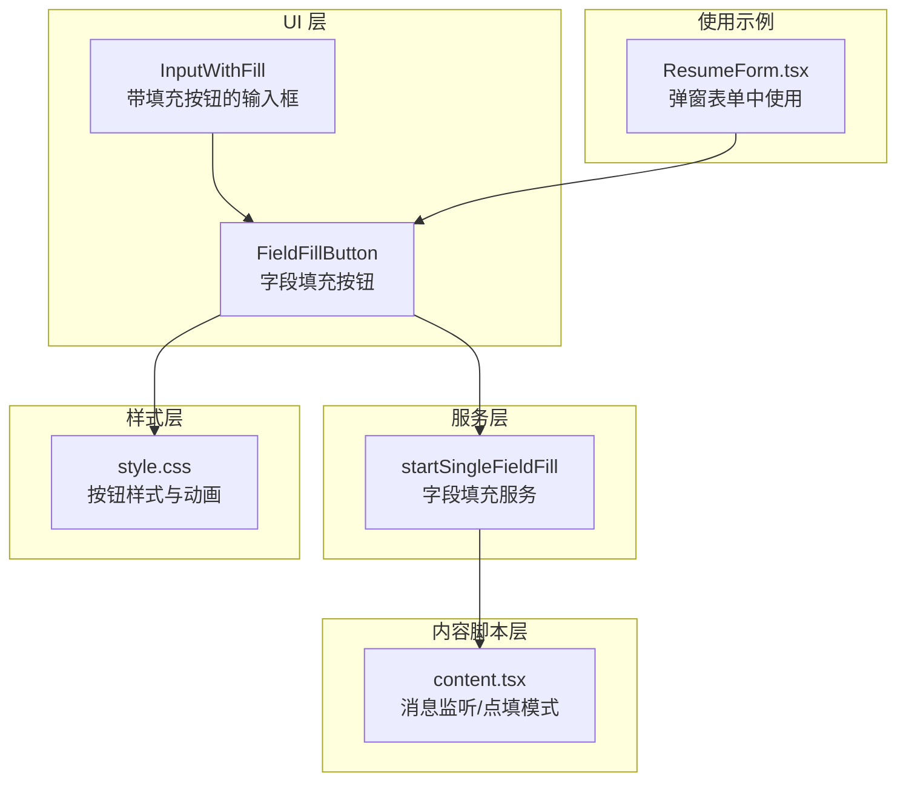
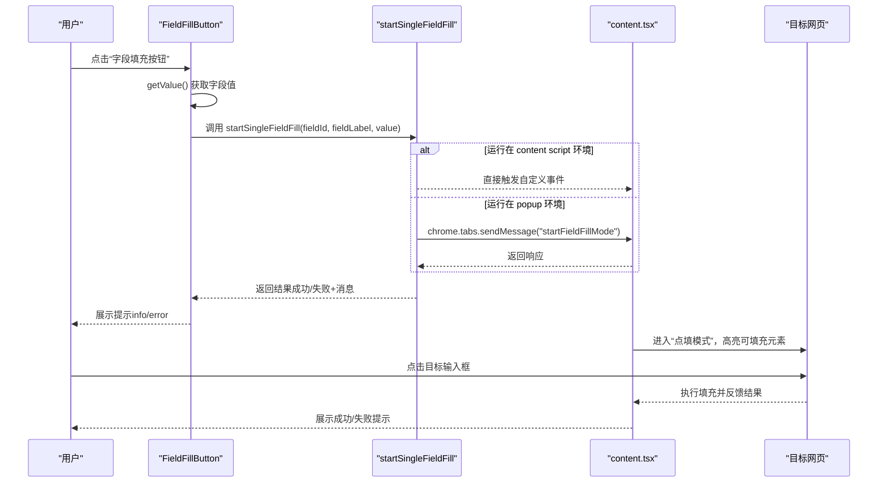
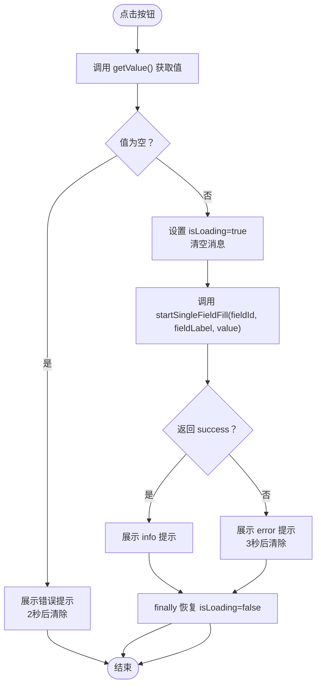
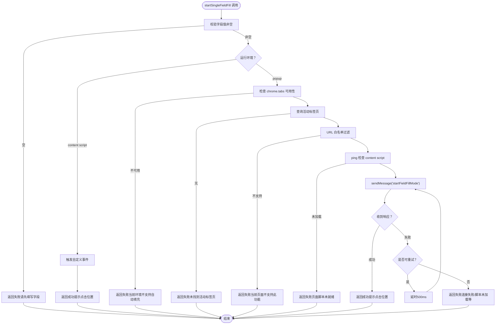
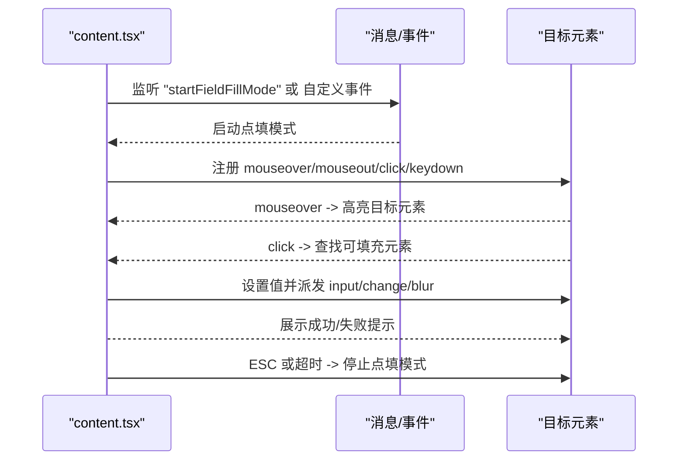
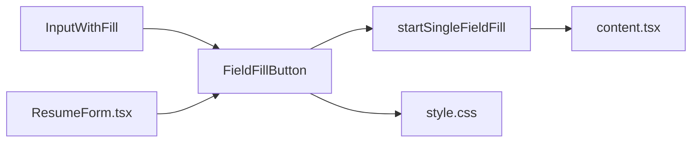

# 字段填充按钮

<cite>
**本文引用的文件**
- [field-fill-button.tsx](file://src/components/ui/field-fill-button.tsx)
- [field-fill.ts](file://src/services/field-fill.ts)
- [content.tsx](file://src/content.tsx)
- [input-with-fill.tsx](file://src/components/ui/input-with-fill.tsx)
- [style.css](file://src/style.css)
- [ResumeForm.tsx](file://src/features/popup/ResumeForm.tsx)
</cite>

## 目录
1. [简介](#简介)
2. [项目结构](#项目结构)
3. [核心组件](#核心组件)
4. [架构总览](#架构总览)
5. [详细组件分析](#详细组件分析)
6. [依赖关系分析](#依赖关系分析)
7. [性能考量](#性能考量)
8. [故障排查指南](#故障排查指南)
9. [结论](#结论)

## 简介
本文围绕“字段填充按钮”组件展开，系统解析其在“点填模式”中的工作原理，重点说明：
- 如何通过 getValue 函数获取当前字段值
- 点击后如何调用 startSingleFieldFill 服务触发内容脚本注入流程
- isLoading 状态对用户操作的反馈机制
- 成功、错误、提示三类消息的展示策略
- 按钮的视觉设计（悬停效果、禁用状态）及在表单布局中的嵌入方式
- 填充失败场景的调试方法（检查目标网站 DOM 结构、验证字段选择器配置等）

## 项目结构
与“字段填充按钮”相关的核心文件分布如下：
- UI 层：字段填充按钮组件、带填充按钮的输入/文本域/选择框组件
- 服务层：字段填充服务，负责跨上下文通信与注入流程
- 内容脚本层：接收消息，进入“点填模式”，监听鼠标事件并执行填充
- 样式层：统一的按钮样式与交互反馈
- 使用示例：弹窗表单中直接使用字段填充按钮

图表来源
- [field-fill-button.tsx](file://src/components/ui/field-fill-button.tsx#L1-L121)
- [field-fill.ts](file://src/services/field-fill.ts#L46-L136)
- [content.tsx](file://src/content.tsx#L59-L122)
- [style.css](file://src/style.css#L77-L94)
- [input-with-fill.tsx](file://src/components/ui/input-with-fill.tsx#L1-L48)
- [ResumeForm.tsx](file://src/features/popup/ResumeForm.tsx#L163-L199)

章节来源
- [field-fill-button.tsx](file://src/components/ui/field-fill-button.tsx#L1-L121)
- [field-fill.ts](file://src/services/field-fill.ts#L46-L136)
- [content.tsx](file://src/content.tsx#L59-L122)
- [style.css](file://src/style.css#L77-L94)
- [input-with-fill.tsx](file://src/components/ui/input-with-fill.tsx#L1-L48)
- [ResumeForm.tsx](file://src/features/popup/ResumeForm.tsx#L163-L199)

## 核心组件
- 字段填充按钮（FieldFillButton）：负责收集当前字段值、发起填充流程、管理加载态与消息提示
- 字段填充服务（startSingleFieldFill）：根据运行环境判断（popup/content script），决定直接注入或通过消息通道注入
- 内容脚本（content.tsx）：接收消息，进入“点填模式”，高亮可填充元素，响应点击完成填充
- 带填充按钮的输入组件（InputWithFill）：在输入框右侧嵌入字段填充按钮，统一获取输入值
- 样式（style.css）：提供按钮悬停、禁用、旋转动画等视觉反馈

章节来源
- [field-fill-button.tsx](file://src/components/ui/field-fill-button.tsx#L1-L121)
- [field-fill.ts](file://src/services/field-fill.ts#L46-L136)
- [content.tsx](file://src/content.tsx#L166-L243)
- [input-with-fill.tsx](file://src/components/ui/input-with-fill.tsx#L1-L48)
- [style.css](file://src/style.css#L77-L94)

## 架构总览
“点填模式”的端到端流程如下：

图表来源
- [field-fill-button.tsx](file://src/components/ui/field-fill-button.tsx#L27-L71)
- [field-fill.ts](file://src/services/field-fill.ts#L46-L136)
- [content.tsx](file://src/content.tsx#L59-L122)
- [content.tsx](file://src/content.tsx#L166-L243)

## 详细组件分析

### 字段填充按钮（FieldFillButton）
- 输入参数
  - fieldId：字段标识
  - fieldLabel：字段标签（用于提示文案）
  - getValue：闭包函数，返回当前字段值
  - className：可选样式类名
- 行为逻辑
  - 点击时先调用 getValue 获取值，若为空则展示错误提示并退出
  - 设置 isLoading 并清空历史消息
  - 调用 startSingleFieldFill，根据返回结果展示 info 或 error 提示
  - 异常捕获统一转为 error 提示
  - finally 中恢复 isLoading
- 视觉反馈
  - 加载态：显示旋转动画图标
  - 禁用态：按钮禁用，透明度降低
  - 悬停态：背景色与阴影变化，轻微上移
  - 消息提示：绝对定位显示在按钮右侧，颜色区分 info/error

图表来源
- [field-fill-button.tsx](file://src/components/ui/field-fill-button.tsx#L27-L71)

章节来源
- [field-fill-button.tsx](file://src/components/ui/field-fill-button.tsx#L1-L121)
- [style.css](file://src/style.css#L77-L94)

### 字段填充服务（startSingleFieldFill）
- 环境检测
  - 若在 content script 环境，直接触发自定义事件，无需 chrome.tabs
  - 若在 popup 环境，需具备 chrome.tabs 能力
- URL 白名单过滤
  - 对 chrome://、chrome-extension://、edge://、about:、moz-extension:// 等页面拒绝注入
- 注入前置检查
  - 通过 ping 检测 content script 是否已加载
  - 若未加载，提示“页面脚本未就绪，请刷新当前网页后重试”
- 消息发送与重试
  - 通过 chrome.tabs.sendMessage 发送“startFieldFillMode”消息
  - 对特定错误进行有限次重试（最多2次，间隔500ms）
  - 对“消息端口关闭前无响应”等特殊错误进行兼容处理
- 返回结果
  - 成功：提示“请在网页中点击要填入的位置”
  - 失败：返回友好错误文案

图表来源
- [field-fill.ts](file://src/services/field-fill.ts#L46-L136)
- [field-fill.ts](file://src/services/field-fill.ts#L138-L259)

章节来源
- [field-fill.ts](file://src/services/field-fill.ts#L46-L136)
- [field-fill.ts](file://src/services/field-fill.ts#L138-L259)

### 内容脚本（content.tsx）——“点填模式”
- 消息监听
  - 接收来自 popup 的“startFieldFillMode”消息，或悬浮窗模式下的自定义事件
  - 接收“ping”消息用于健康检查
- “点填模式”生命周期
  - 启动：注册 mouseover/mouseout/click/keydown 事件，设置光标为十字准星
  - 高亮：鼠标悬停时为目标元素添加外框高亮
  - 填充：点击目标元素时，根据 pendingFieldFill 的值执行填充，并展示成功/失败提示
  - 停止：ESC 取消或自动清理事件与样式
- 填充实现
  - 支持 input/textarea/select/contenteditable
  - 触发 input/change/blur 等事件，兼容受控组件（如 React）

图表来源
- [content.tsx](file://src/content.tsx#L59-L122)
- [content.tsx](file://src/content.tsx#L166-L243)
- [content.tsx](file://src/content.tsx#L237-L379)

章节来源
- [content.tsx](file://src/content.tsx#L59-L122)
- [content.tsx](file://src/content.tsx#L166-L243)
- [content.tsx](file://src/content.tsx#L237-L379)

### 嵌入方式与布局
- 带填充按钮的输入组件（InputWithFill/TextareaWithFill/SelectWithFill）
  - 将原生输入/文本域/选择框与 FieldFillButton 并排显示
  - getValue 闭包分别从 input/textarea/select 的当前值或选中文本中提取
  - 通过 ref 暴露原生元素，便于外部访问
- 弹窗表单中直接使用 FieldFillButton
  - 传入 fieldId、fieldLabel、getValue 回调
  - 适合在 BasicInfoForm/ResumeForm 等场景快速集成

章节来源
- [input-with-fill.tsx](file://src/components/ui/input-with-fill.tsx#L1-L48)
- [input-with-fill.tsx](file://src/components/ui/input-with-fill.tsx#L55-L108)
- [input-with-fill.tsx](file://src/components/ui/input-with-fill.tsx#L112-L168)
- [ResumeForm.tsx](file://src/features/popup/ResumeForm.tsx#L163-L199)

## 依赖关系分析
- 组件耦合
  - FieldFillButton 依赖 startSingleFieldFill 服务
  - startSingleFieldFill 依赖 content.tsx 的消息处理与注入流程
  - InputWithFill 通过 getValue 与具体输入组件解耦
- 外部依赖
  - chrome.tabs（popup 模式）
  - 自定义事件（悬浮窗模式）
- 潜在循环依赖
  - 无直接循环；服务层与内容脚本通过消息通道解耦

图表来源
- [field-fill-button.tsx](file://src/components/ui/field-fill-button.tsx#L1-L121)
- [field-fill.ts](file://src/services/field-fill.ts#L46-L136)
- [content.tsx](file://src/content.tsx#L59-L122)
- [input-with-fill.tsx](file://src/components/ui/input-with-fill.tsx#L1-L48)
- [ResumeForm.tsx](file://src/features/popup/ResumeForm.tsx#L163-L199)

章节来源
- [field-fill-button.tsx](file://src/components/ui/field-fill-button.tsx#L1-L121)
- [field-fill.ts](file://src/services/field-fill.ts#L46-L136)
- [content.tsx](file://src/content.tsx#L59-L122)
- [input-with-fill.tsx](file://src/components/ui/input-with-fill.tsx#L1-L48)
- [ResumeForm.tsx](file://src/features/popup/ResumeForm.tsx#L163-L199)

## 性能考量
- 事件绑定与清理
  - “点填模式”启用时注册多事件监听，停止时务必移除，避免内存泄漏
- 消息重试
  - 最多重试 2 次，间隔 500ms，避免频繁重试造成阻塞
- DOM 操作
  - 填充时派发多种事件，确保框架感知到变化；对受控组件做额外处理，减少二次渲染成本
- 样式与动画
  - 旋转动画与悬停位移开销极低，不影响交互流畅度

章节来源
- [content.tsx](file://src/content.tsx#L218-L243)
- [field-fill.ts](file://src/services/field-fill.ts#L162-L259)
- [content.tsx](file://src/content.tsx#L337-L379)

## 故障排查指南
- 现象：点击按钮无反应或立即报错
  - 检查 getValue 是否返回有效值（空字符串会触发错误提示）
  - 确认运行环境：popup 模式需具备 chrome.tabs 权限；content script 模式需在目标网页中
- 现象：提示“页面脚本未就绪，请刷新当前网页后重试”
  - 目标页面可能未加载 content script，刷新页面后再试
  - 确认 URL 未被白名单过滤（如 about:、chrome-extension://）
- 现象：提示“无法连接到页面/接收端不存在”
  - popup 快速关闭可能导致消息端口关闭，属于预期行为，可忽略继续操作
  - 若持续出现，尝试刷新页面并重新点击
- 现象：网页中无法点击目标元素
  - 检查目标元素是否为 input/textarea/select 或 contenteditable
  - 确认“点填模式”已启动（光标应为十字准星）
- 现象：填充后无变化
  - 确认已派发 input/change/blur 等事件
  - 对于受控组件，确认已同步原生属性值
- 现象：提示“当前页面不支持此功能”
  - 当前页面为浏览器内置页或扩展页，需在普通网页上使用

章节来源
- [field-fill-button.tsx](file://src/components/ui/field-fill-button.tsx#L27-L71)
- [field-fill.ts](file://src/services/field-fill.ts#L71-L136)
- [field-fill.ts](file://src/services/field-fill.ts#L138-L259)
- [content.tsx](file://src/content.tsx#L166-L243)
- [content.tsx](file://src/content.tsx#L237-L379)

## 结论
字段填充按钮通过简洁的回调接口与服务层解耦，实现了“点填模式”的完整闭环：从 UI 触发、值采集、跨上下文注入，到内容脚本的高亮与填充反馈。其加载态与消息提示为用户提供了即时反馈；样式层的悬停与禁用态增强了交互体验。在实际使用中，建议：
- 确保 getValue 返回稳定值
- 在 popup 模式下保证 content script 已加载
- 针对复杂表单页面，优先在普通网页中使用，避免受限页面
- 遇到失败场景，按“故障排查指南”逐项验证