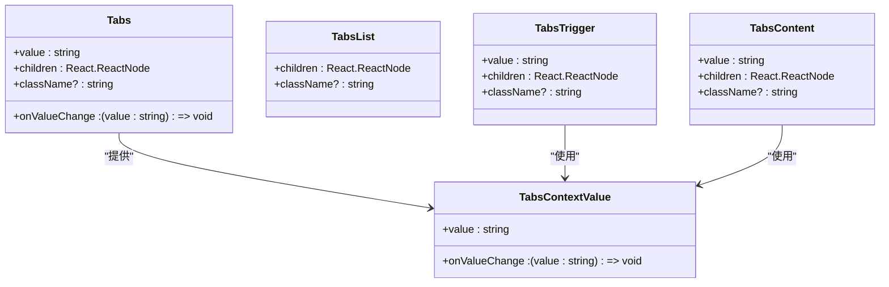
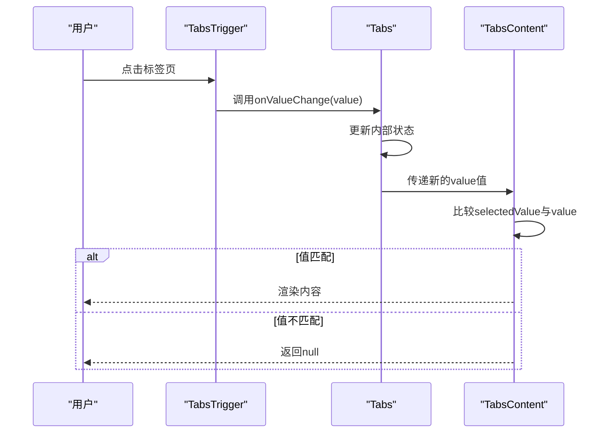
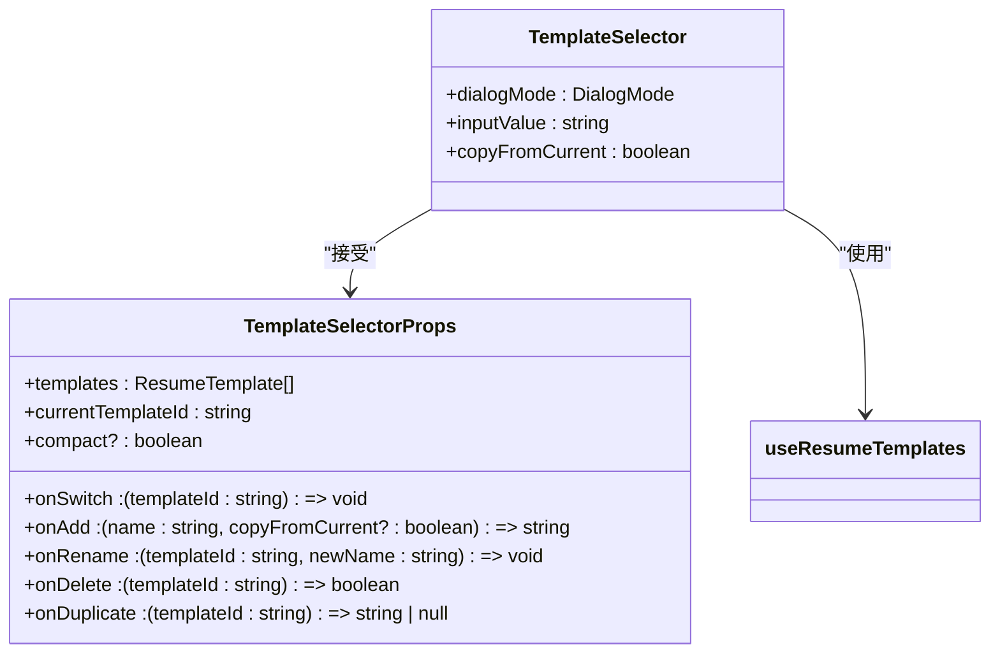
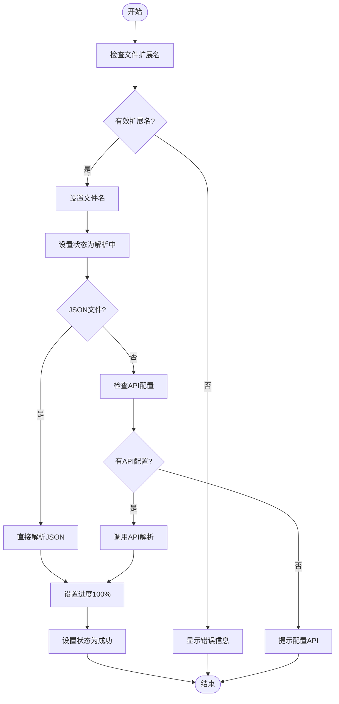
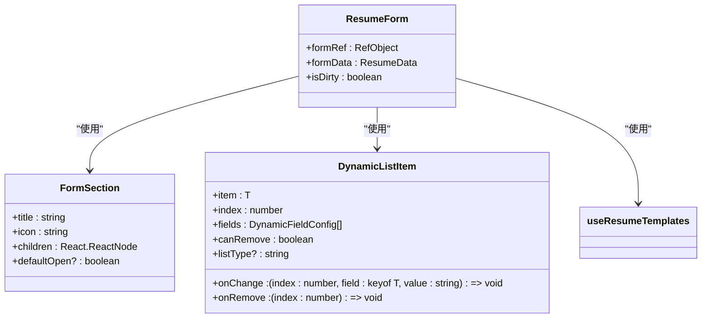
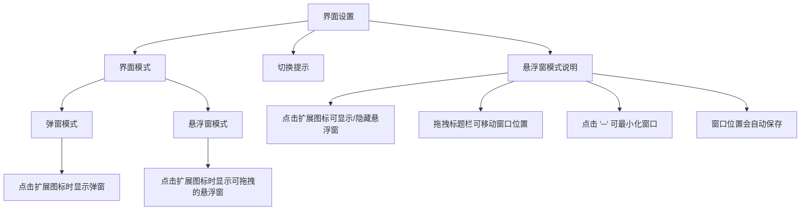
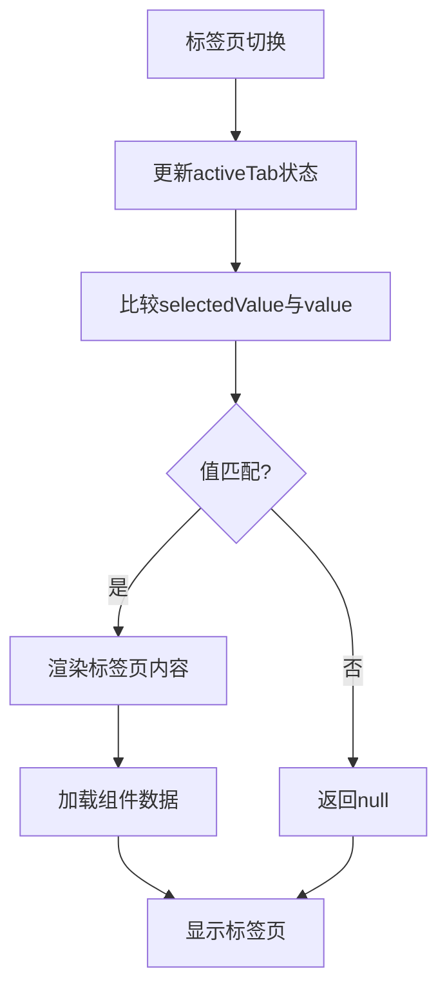
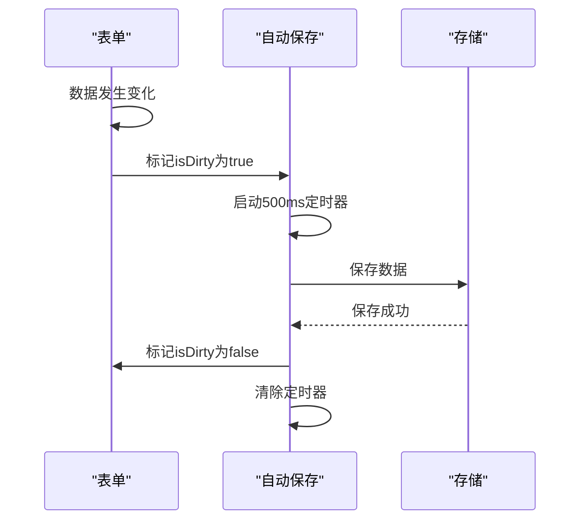

# 多标签页管理

<cite>
**本文档引用的文件**   
- [tabs.tsx](file://src/components/ui/tabs.tsx)
- [popup.tsx](file://src/popup.tsx)
- [ResumeForm.tsx](file://src/features/popup/ResumeForm.tsx)
- [ResumeUpload.tsx](file://src/features/popup/ResumeUpload.tsx)
- [TemplateSelector.tsx](file://src/components/common/TemplateSelector.tsx)
- [UISettingsForm.tsx](file://src/features/popup/settings/UISettingsForm.tsx)
- [ModelSettingsForm.tsx](file://src/features/popup/settings/ModelSettingsForm.tsx)
- [useResumeTemplates.ts](file://src/hooks/useResumeTemplates.ts)
</cite>

## 目录
1. [简介](#简介)
2. [Tabs组件架构与状态管理](#tabs组件架构与状态管理)
3. [简历填写功能模块](#简历填写功能模块)
4. [设置功能模块](#设置功能模块)
5. [标签页切换性能优化](#标签页切换性能优化)
6. [总结](#总结)

## 简介

本系统通过Tabs组件在悬浮面板中实现导航功能，主要涵盖"简历填写"与"设置"两大功能模块的切换。Tabs组件采用React Context机制管理activeTab状态，通过onValueChange回调函数驱动内容渲染。在简历填写标签页中，集成了TemplateSelector、ResumeUpload和ResumeForm等子组件，提供完整的简历编辑功能。在设置标签页中，包含了UISettingsForm、ModelSettingsForm等多个配置表单，用于系统参数设置。整个系统通过合理的状态管理和组件集成，实现了高效、易用的用户界面。

## Tabs组件架构与状态管理

Tabs组件系统由四个核心组件构成：Tabs、TabsList、TabsTrigger和TabsContent。该系统通过React Context实现状态管理，确保标签页状态在组件树中高效传递。



**Diagram sources**
- [tabs.tsx](file://src/components/ui/tabs.tsx#L5-L107)

**Section sources**
- [tabs.tsx](file://src/components/ui/tabs.tsx#L1-L107)

activeTab状态的管理通过useState Hook在popup.tsx根组件中实现，并通过Tabs组件的value和onValueChange属性向下传递。当用户点击标签页时，TabsTrigger组件的onClick事件触发onValueChange回调，更新activeTab状态，从而驱动TabsContent组件的条件渲染。



**Diagram sources**
- [tabs.tsx](file://src/components/ui/tabs.tsx#L1-L107)
- [popup.tsx](file://src/popup.tsx#L125-L294)

## 简历填写功能模块

简历填写功能模块是系统的核心功能，通过集成多个子组件实现完整的简历编辑体验。该模块以ResumeForm组件为主体，结合TemplateSelector和ResumeUpload组件，提供模板管理、简历上传和表单编辑功能。

### TemplateSelector组件集成

TemplateSelector组件提供简历模板的管理功能，包括模板选择、添加、重命名、删除和复制操作。该组件通过回调函数与父组件通信，实现模板状态的同步。



**Diagram sources**
- [TemplateSelector.tsx](file://src/components/common/TemplateSelector.tsx#L1-L259)
- [useResumeTemplates.ts](file://src/hooks/useResumeTemplates.ts#L1-L258)

TemplateSelector组件通过useResumeTemplates Hook获取模板数据，并通过一系列回调函数（onSwitch、onAdd、onRename等）与父组件交互。当用户执行模板操作时，这些回调函数会触发useResumeTemplates中的相应方法，更新模板存储状态。

**Section sources**
- [TemplateSelector.tsx](file://src/components/common/TemplateSelector.tsx#L1-L259)
- [useResumeTemplates.ts](file://src/hooks/useResumeTemplates.ts#L1-L258)

### ResumeUpload组件集成

ResumeUpload组件提供简历文件上传和解析功能，支持多种文件格式（JSON、PDF、Word等）。该组件通过onParsedData回调函数将解析后的数据传递给父组件。



**Diagram sources**
- [ResumeUpload.tsx](file://src/features/popup/ResumeUpload.tsx#L1-L260)

ResumeUpload组件通过handleFile函数处理文件解析逻辑，根据文件类型采取不同的解析策略。对于JSON文件，直接解析内容；对于其他格式，则调用简历解析API进行处理。解析完成后，通过onParsedData回调将数据传递给父组件。

**Section sources**
- [ResumeUpload.tsx](file://src/features/popup/ResumeUpload.tsx#L1-L260)

### ResumeForm组件结构

ResumeForm组件是简历填写的核心，采用可折叠的表单区域设计，包含基本信息、求职期望、教育经历等多个表单部分。该组件通过useResumeTemplates Hook获取当前简历数据，并提供自动保存功能。



**Diagram sources**
- [ResumeForm.tsx](file://src/features/popup/ResumeForm.tsx#L1-L782)

ResumeForm组件通过createListHandlers函数为每个动态列表（教育经历、工作经历等）创建统一的增删改操作处理器。当表单数据发生变化时，通过setIsDirty标记数据为"脏"状态，并在短暂延迟后自动保存到存储中。

**Section sources**
- [ResumeForm.tsx](file://src/features/popup/ResumeForm.tsx#L1-L782)

## 设置功能模块

设置功能模块包含多个配置表单，用于系统参数的设置和管理。该模块通过分组的方式组织不同的设置项，提供清晰的用户界面。

### UISettingsForm布局结构

UISettingsForm组件提供界面设置功能，主要包含界面模式选择和相关说明。该组件通过useStorage Hook管理UI设置状态，并在模式改变时通知background script更新行为。



**Diagram sources**
- [UISettingsForm.tsx](file://src/features/popup/settings/UISettingsForm.tsx#L1-L115)

UISettingsForm组件通过handleModeChange函数处理模式切换逻辑，在更新本地状态的同时，通过chrome.runtime.sendMessage通知background script更新popup行为。这种设计确保了UI状态与系统行为的一致性。

**Section sources**
- [UISettingsForm.tsx](file://src/features/popup/settings/UISettingsForm.tsx#L1-L115)

### ModelSettingsForm布局结构

ModelSettingsForm组件提供AI模型配置功能，包含模型提供商选择、模型选择、API Key输入和连接测试等功能。该组件通过useStorage Hook管理模型设置状态，并提供测试连接功能。

```mermaid
classDiagram
class ModelSettingsForm {
+providers : ModelProvider[]
+models : {id : string, name : string}[]
+testResult : {success : boolean, message : string} | null
+isTesting : boolean
}
class ModelSettings {
+provider : string
+model : string
+apiKey : Record<string, string>
+customUrl? : string
}
ModelSettingsForm --> ModelSettings : "使用"
ModelSettingsForm --> useStorage : "使用"
ModelSettingsForm --> testModelConnection : "使用"
```

**Diagram sources**
- [ModelSettingsForm.tsx](file://src/features/popup/settings/ModelSettingsForm.tsx#L1-L298)

ModelSettingsForm组件通过useEffect Hook监听提供商变化，动态更新模型列表。当用户点击测试连接按钮时，调用testModelConnection函数验证API连接，并显示测试结果。这种设计提供了即时的反馈，增强了用户体验。

**Section sources**
- [ModelSettingsForm.tsx](file://src/features/popup/settings/ModelSettingsForm.tsx#L1-L298)

## 标签页切换性能优化

为提升标签页切换时的性能表现，系统采用了多种优化策略，包括状态管理优化、组件懒加载和数据缓存机制。

### 懒加载策略

系统通过条件渲染实现标签页内容的懒加载。只有当标签页被激活时，其内容才会被渲染，从而减少初始加载时的资源消耗。



**Diagram sources**
- [tabs.tsx](file://src/components/ui/tabs.tsx#L86-L92)

TabsContent组件通过比较selectedValue与value的值来决定是否渲染内容。当值不匹配时，直接返回null，避免了未激活标签页的渲染开销。这种策略有效减少了DOM节点数量，提升了整体性能。

### 自动保存与状态缓存

系统采用自动保存机制，减少用户手动保存的操作。当表单数据发生变化时，系统会在短暂延迟后自动保存到存储中，确保数据安全。



**Diagram sources**
- [ResumeForm.tsx](file://src/features/popup/ResumeForm.tsx#L275-L283)
- [BasicInfoForm.tsx](file://src/features/popup/BasicInfoForm.tsx#L63-L73)

自动保存机制通过useEffect Hook实现，当isDirty状态为true且数据发生变化时，启动一个500ms的定时器。如果在定时器执行前数据再次发生变化，则重置定时器，避免频繁保存。这种防抖策略平衡了数据安全与性能消耗。

## 总结

本系统通过精心设计的Tabs组件实现了悬浮面板中的导航功能，有效管理了"简历填写"与"设置"两大功能模块的切换。activeTab状态通过React Context机制进行管理，onValueChange回调驱动内容渲染，确保了状态的一致性和响应性。在简历填写标签页中，TemplateSelector、ResumeUpload和ResumeForm等子组件通过合理的集成方式，提供了完整的简历编辑体验。在设置标签页中，UISettingsForm、ModelSettingsForm等配置表单通过清晰的布局结构，方便用户进行系统设置。通过懒加载策略和自动保存机制，系统在保证功能完整性的同时，也实现了良好的性能表现。