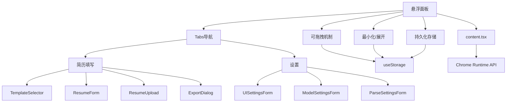
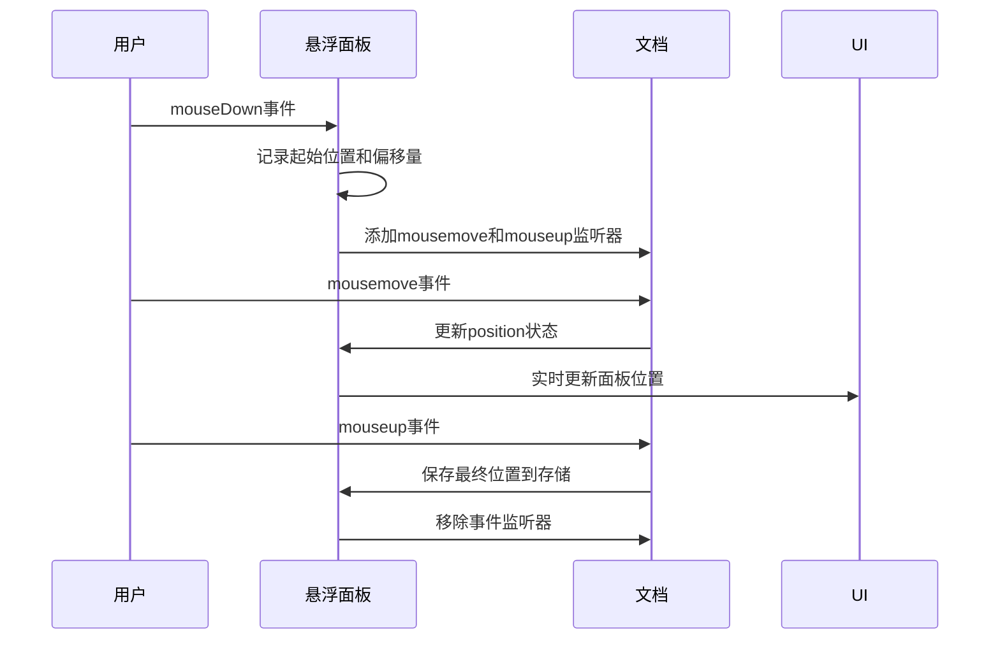
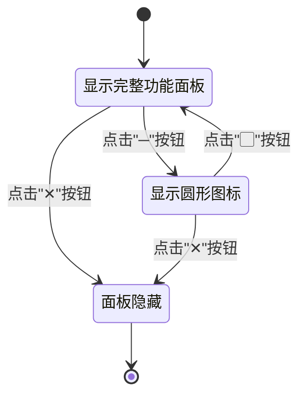
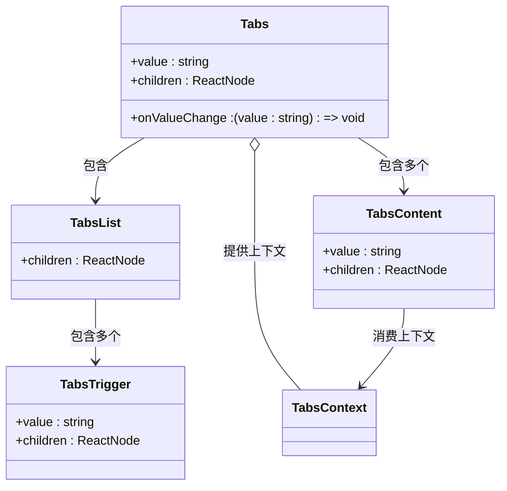
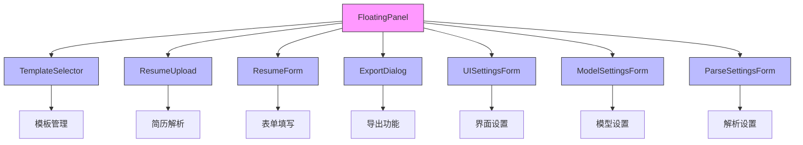
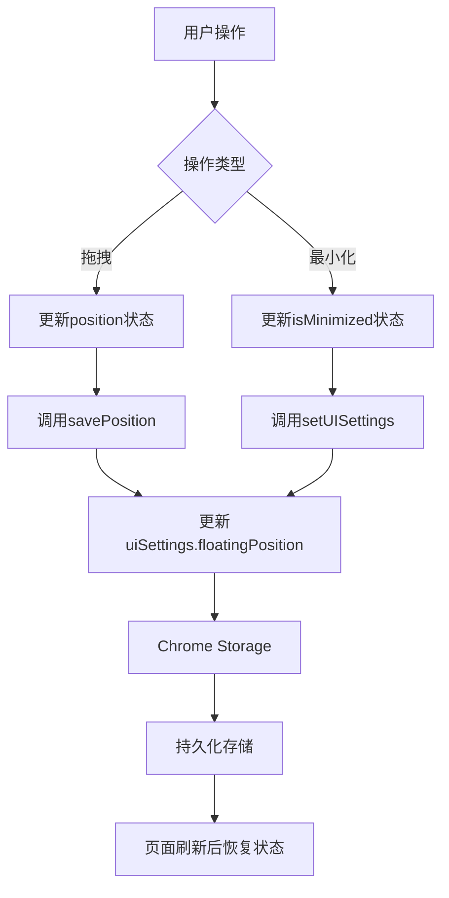
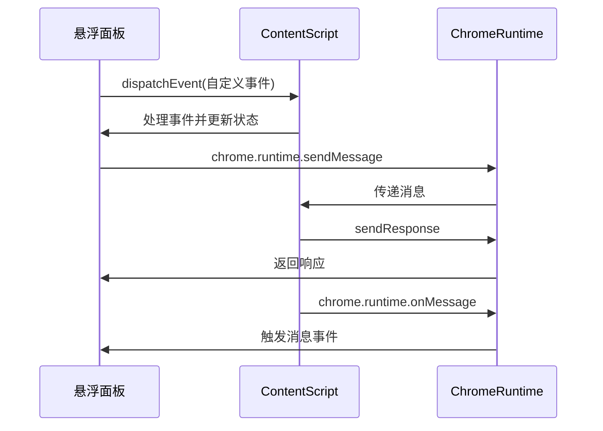
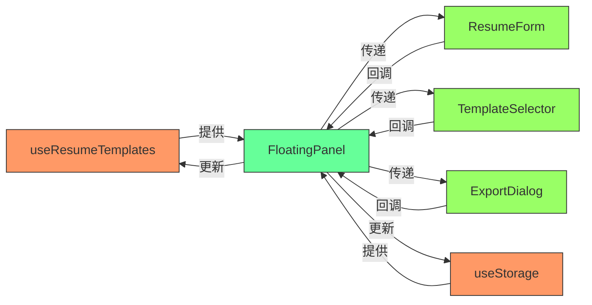
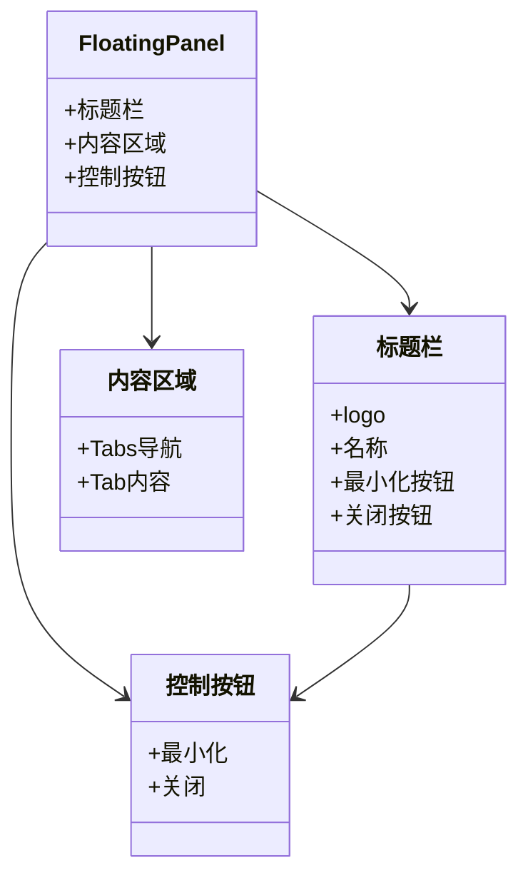
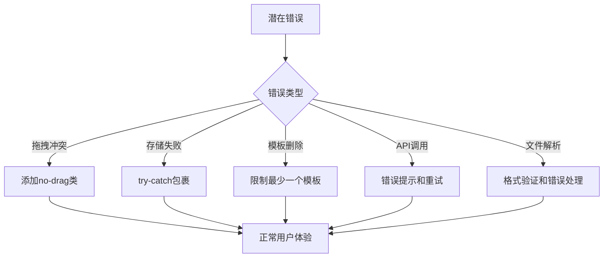

# 悬浮面板

<cite>
**本文档引用文件**   
- [FloatingPanel.tsx](file://src/components/floating/FloatingPanel.tsx)
- [useStorage.ts](file://src/hooks/useStorage.ts)
- [tabs.tsx](file://src/components/ui/tabs.tsx)
- [ResumeForm.tsx](file://src/features/popup/ResumeForm.tsx)
- [TemplateSelector.tsx](file://src/components/common/TemplateSelector.tsx)
- [ExportDialog.tsx](file://src/features/popup/ExportDialog.tsx)
- [content.tsx](file://src/content.tsx)
- [settings.ts](file://src/types/settings.ts)
- [resume.ts](file://src/types/resume.ts)
- [UISettingsForm.tsx](file://src/features/popup/settings/UISettingsForm.tsx)
</cite>

## 目录
1. [架构概述](#架构概述)
2. [可拖拽机制实现](#可拖拽机制实现)
3. [最小化与展开状态管理](#最小化与展开状态管理)
4. [Tabs组件与功能导航](#tabs组件与功能导航)
5. [子组件集成](#子组件集成)
6. [持久化存储方案](#持久化存储方案)
7. [与Content Script通信模式](#与content-script通信模式)
8. [状态管理与数据流](#状态管理与数据流)
9. [UI结构与样式设计](#ui结构与样式设计)
10. [错误处理与边界情况](#错误处理与边界情况)

## 架构概述

悬浮面板组件作为插件在网页侧边栏运行的核心容器，采用React函数式组件架构，通过组合式设计模式集成多个子组件。组件通过`content.tsx`注入到网页DOM中，作为独立的UI层存在。整体架构分为三个主要层次：UI展示层、状态管理层和通信层。UI展示层由Tabs组件组织简历填写和设置两大功能模块；状态管理层通过自定义Hook管理位置、最小化状态和UI设置；通信层通过Chrome Runtime API与插件其他部分交互。

**图表来源**
- [FloatingPanel.tsx](file://src/components/floating/FloatingPanel.tsx#L1-L414)
- [content.tsx](file://src/content.tsx#L1-L454)

## 可拖拽机制实现

悬浮面板的可拖拽机制通过监听`mouseDown`和`mouseMove`事件实现，结合`position`状态管理实现平滑拖动。当用户在面板标题栏按下鼠标时，触发`handleMouseDown`回调，记录拖拽起始位置和偏移量。随后在`useEffect`中监听全局`mousemove`和`mouseup`事件，实时更新面板位置。拖拽过程中，位置计算考虑了窗口边界限制，确保面板不会被拖出可视区域。

**图表来源**
- [FloatingPanel.tsx](file://src/components/floating/FloatingPanel.tsx#L172-L207)

## 最小化与展开状态管理

最小化/展开状态的切换逻辑通过`isMinimized`状态控制，结合`toggleMinimize`函数实现。当面板处于最小化状态时，仅显示一个圆形图标，包含展开和关闭按钮；展开状态则显示完整的功能面板。状态切换时，不仅更新本地状态，还通过`useStorage`Hook将状态持久化到Chrome存储中，确保页面刷新后状态得以保留。

**图表来源**
- [FloatingPanel.tsx](file://src/components/floating/FloatingPanel.tsx#L226-L234)

## Tabs组件与功能导航

Tabs组件在简历填写与设置功能间提供导航作用，通过`Tabs`、`TabsList`、`TabsTrigger`和`TabsContent`四个子组件实现。`Tabs`组件提供上下文，管理当前激活的标签页；`TabsList`作为容器；`TabsTrigger`作为可点击的标签页按钮；`TabsContent`根据当前激活的标签页显示对应内容。这种设计实现了功能模块的清晰分离和用户友好的界面导航。

**图表来源**
- [tabs.tsx](file://src/components/ui/tabs.tsx#L1-L107)

## 子组件集成

悬浮面板集成了多个子组件，形成完整的功能体系。`TemplateSelector`用于管理简历模板，支持模板的增删改查和复制；`ResumeForm`是核心的简历填写表单，包含个人信息、教育经历、工作经历等模块；`ExportDialog`提供简历导出功能，支持JSON和LaTeX格式。这些组件通过props传递数据和回调函数，形成紧密的协作关系。

**图表来源**
- [FloatingPanel.tsx](file://src/components/floating/FloatingPanel.tsx#L7-L11)

## 持久化存储方案

面板的位置信息和最小化状态通过`useStorage`Hook实现持久化存储。该Hook封装了Chrome Storage API，提供类似useState的接口，自动处理数据的读取、保存和同步。位置信息存储在`uiSettings`对象中，包括`floatingPosition`和`floatingMinimized`两个字段。当面板位置改变或状态切换时，通过`setUISettings`函数更新存储，确保用户偏好在不同会话间保持一致。

**图表来源**
- [useStorage.ts](file://src/hooks/useStorage.ts#L7-L87)
- [settings.ts](file://src/types/settings.ts#L85-L106)

## 与content script通信模式

悬浮面板通过自定义事件和Chrome Runtime API与content script通信，确保在复杂招聘网站DOM环境中保持稳定定位。content script监听`offerlaolao:startFieldFillMode`自定义事件和`chrome.runtime.onMessage`消息，处理来自面板的指令。这种双向通信模式允许面板控制content script的行为，如显示/隐藏面板、启动字段填充模式等，同时content script可以向面板发送解析结果。

**图表来源**
- [content.tsx](file://src/content.tsx#L59-L122)
- [FloatingPanel.tsx](file://src/components/floating/FloatingPanel.tsx#L118-L119)

## 状态管理与数据流

悬浮面板采用组合式状态管理策略，通过多个自定义Hook管理不同类型的状态。`useResumeTemplates`管理简历模板数据，`useStorage`管理UI设置和位置信息。数据流遵循单向数据流原则，从父组件通过props传递到子组件，子组件通过回调函数通知父组件状态变化。这种设计确保了状态的一致性和可预测性，便于调试和维护。

**图表来源**
- [FloatingPanel.tsx](file://src/components/floating/FloatingPanel.tsx#L132-L143)
- [useResumeTemplates.ts](file://src/hooks/useResumeTemplates.ts#L17-L234)

## UI结构与样式设计

悬浮面板采用响应式UI设计，使用Tailwind CSS进行样式控制。面板分为标题栏和内容区域，标题栏包含插件logo、名称和控制按钮；内容区域通过Tabs组件组织功能模块。样式设计注重用户体验，使用渐变背景、阴影效果和圆角边框提升视觉吸引力。最小化状态采用圆形设计，节省空间的同时保持可识别性。

**图表来源**
- [FloatingPanel.tsx](file://src/components/floating/FloatingPanel.tsx#L271-L411)

## 错误处理与边界情况

悬浮面板在设计时充分考虑了各种错误情况和边界条件。在拖拽实现中，添加了`no-drag`CSS类，防止在特定元素上意外触发拖拽。在存储操作中，使用try-catch包裹Chrome Storage调用，避免因存储异常导致应用崩溃。在模板管理中，限制模板数量不少于一个，防止用户删除所有模板。这些防护措施确保了组件在各种使用场景下的稳定性和可靠性。

**图表来源**
- [FloatingPanel.tsx](file://src/components/floating/FloatingPanel.tsx#L175-L176)
- [useStorage.ts](file://src/hooks/useStorage.ts#L30-L33)
- [TemplateSelector.tsx](file://src/components/common/TemplateSelector.tsx#L67-L70)