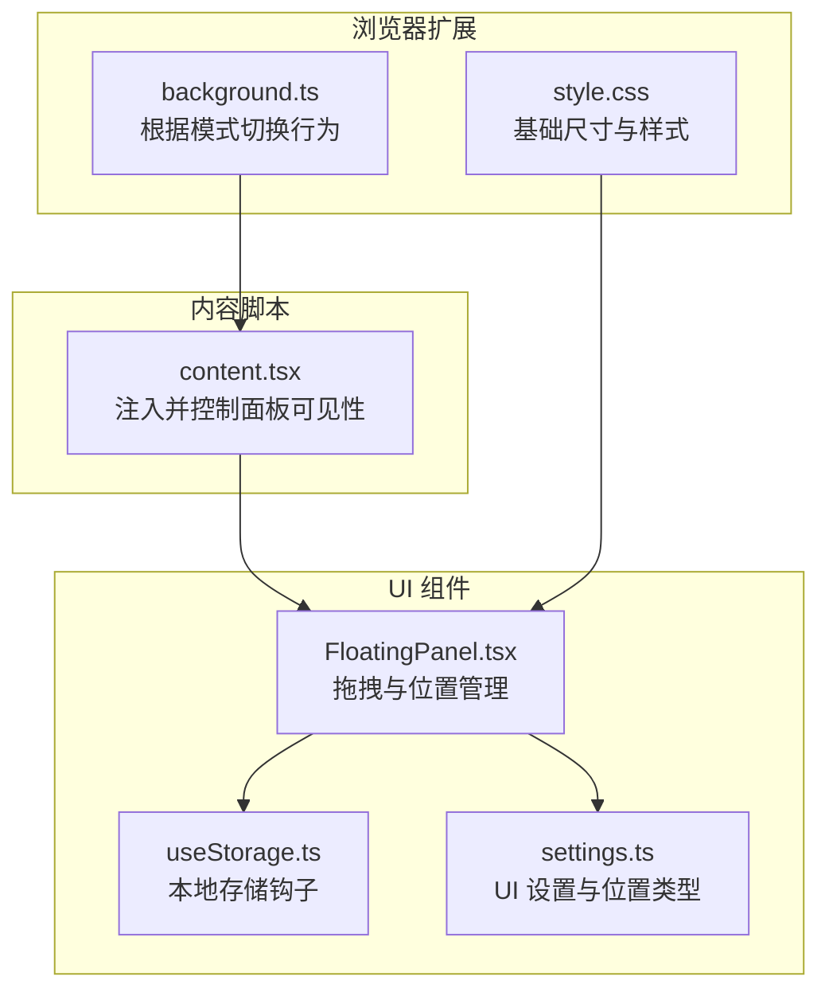
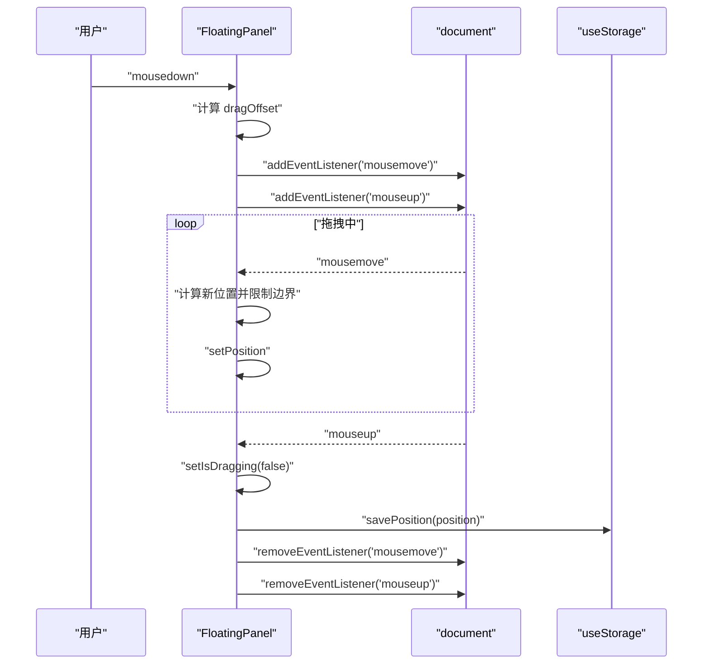
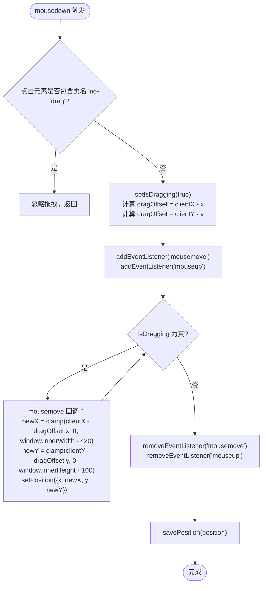
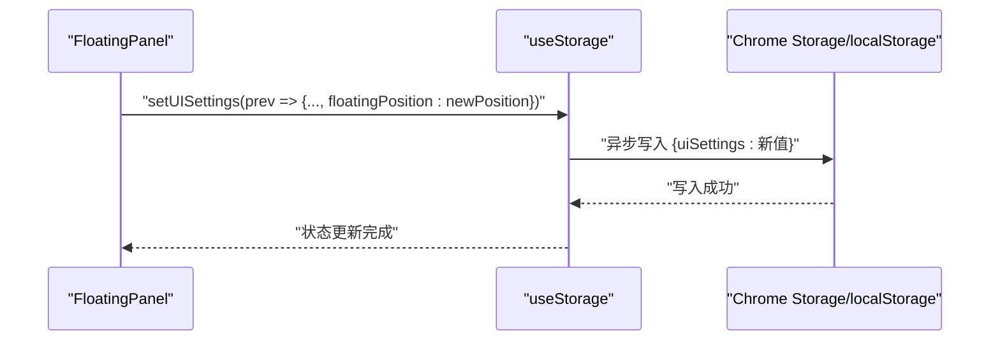
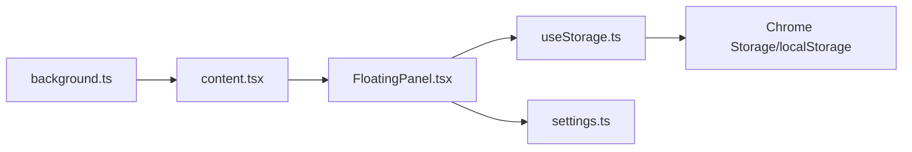

# 拖拽定位机制

<cite>
**本文引用的文件**
- [FloatingPanel.tsx](file://src/components/floating/FloatingPanel.tsx)
- [useStorage.ts](file://src/hooks/useStorage.ts)
- [settings.ts](file://src/types/settings.ts)
- [content.tsx](file://src/content.tsx)
- [background.ts](file://src/background.ts)
- [style.css](file://src/style.css)
</cite>

## 目录
1. [引言](#引言)
2. [项目结构](#项目结构)
3. [核心组件](#核心组件)
4. [架构总览](#架构总览)
5. [详细组件分析](#详细组件分析)
6. [依赖关系分析](#依赖关系分析)
7. [性能考量](#性能考量)
8. [故障排查指南](#故障排查指南)
9. [结论](#结论)
10. [附录](#附录)

## 引言
本节聚焦于 FloatingPanel 组件中基于 mouseDown/mouseMove 的拖拽实现机制，解释如何通过 dragOffset useRef 记录鼠标偏移量，并在 mousemove 事件中动态更新 position 状态实现平滑拖动；阐述面板位置边界限制逻辑（防止超出视窗）；说明拖拽结束时通过 savePosition 函数将最新位置持久化到 useStorage 中的流程；并结合代码示例路径说明事件监听的绑定与清理机制，确保无内存泄漏。最后给出在复杂 DOM 环境下保持定位稳定性的最佳实践。

## 项目结构
FloatingPanel 位于内容脚本环境中，作为页面内可拖拽的悬浮面板，其拖拽逻辑与持久化存储紧密耦合：
- 内容脚本负责注入并控制 FloatingPanel 的可见性与交互
- FloatingPanel 维护拖拽状态与位置，并通过 useStorage 将位置持久化
- useStorage 提供跨实例同步与本地存储读写能力
- 背景脚本根据 UI 模式决定是否展示悬浮窗

图表来源
- [content.tsx](file://src/content.tsx#L128-L151)
- [FloatingPanel.tsx](file://src/components/floating/FloatingPanel.tsx#L118-L171)
- [useStorage.ts](file://src/hooks/useStorage.ts#L1-L88)
- [settings.ts](file://src/types/settings.ts#L88-L106)
- [background.ts](file://src/background.ts#L1-L29)
- [style.css](file://src/style.css#L62-L75)

章节来源
- [content.tsx](file://src/content.tsx#L128-L151)
- [FloatingPanel.tsx](file://src/components/floating/FloatingPanel.tsx#L118-L171)
- [useStorage.ts](file://src/hooks/useStorage.ts#L1-L88)
- [settings.ts](file://src/types/settings.ts#L88-L106)
- [background.ts](file://src/background.ts#L1-L29)
- [style.css](file://src/style.css#L62-L75)

## 核心组件
- FloatingPanel：负责渲染悬浮面板、处理拖拽事件、维护 position 状态、调用 savePosition 持久化位置
- useStorage：提供本地存储读取、写入与跨实例同步，支持开发环境降级到 localStorage
- settings 类型：定义 UISettings、FloatingPosition 等类型，保证位置数据结构一致
- content.tsx：在页面中注入并控制 FloatingPanel 的显示/隐藏
- background.ts：根据 UI 模式决定是否通过消息切换悬浮窗显示

章节来源
- [FloatingPanel.tsx](file://src/components/floating/FloatingPanel.tsx#L118-L171)
- [useStorage.ts](file://src/hooks/useStorage.ts#L1-L88)
- [settings.ts](file://src/types/settings.ts#L88-L106)
- [content.tsx](file://src/content.tsx#L128-L151)
- [background.ts](file://src/background.ts#L1-L29)

## 架构总览
FloatingPanel 的拖拽流程由“按下 -> 移动 -> 放开”三阶段构成，关键点如下：
- 鼠标按下时计算 dragOffset（鼠标坐标与当前位置的差值）
- 在文档级别监听 mousemove/mouseup，实时更新 position 并限制边界
- 鼠标抬起时停止拖拽并将最终位置写入存储

图表来源
- [FloatingPanel.tsx](file://src/components/floating/FloatingPanel.tsx#L172-L207)
- [useStorage.ts](file://src/hooks/useStorage.ts#L61-L88)

章节来源
- [FloatingPanel.tsx](file://src/components/floating/FloatingPanel.tsx#L172-L207)
- [useStorage.ts](file://src/hooks/useStorage.ts#L61-L88)

## 详细组件分析

### 拖拽状态与事件绑定
- 状态与引用
  - position：面板左上角坐标，初始值来自 UI 设置或默认值
  - isDragging：拖拽开关
  - dragOffset：useRef，记录按下时鼠标坐标与面板当前位置的差值
  - panelRef：用于获取面板 DOM 引用（在最小化状态下仍可触发拖拽）
- 事件绑定与清理
  - mousedown：仅当点击目标不在 .no-drag 区域时才进入拖拽
  - mousemove：在 isDragging 为真时生效，实时更新 position
  - mouseup：停止拖拽并将最终位置写入存储
  - 清理：在 effect 返回的清理函数中移除 mousemove/mouseup 监听，避免内存泄漏

图表来源
- [FloatingPanel.tsx](file://src/components/floating/FloatingPanel.tsx#L172-L207)

章节来源
- [FloatingPanel.tsx](file://src/components/floating/FloatingPanel.tsx#L125-L130)
- [FloatingPanel.tsx](file://src/components/floating/FloatingPanel.tsx#L172-L207)

### 边界限制逻辑
- 限制策略
  - X 方向：最大不超过窗口宽度减去面板宽度（420px）
  - Y 方向：最大不超过窗口高度减去面板高度（100px）
  - 下限均为 0，确保面板不被拖出可视区域
- 实现位置
  - 限制逻辑在 mousemove 回调中执行，保证每次移动都满足边界约束

章节来源
- [FloatingPanel.tsx](file://src/components/floating/FloatingPanel.tsx#L189-L193)

### 位置持久化流程
- savePosition
  - 接收新位置，调用 setUISettings 更新 UI 设置中的 floatingPosition
  - setUISettings 内部异步写入存储（Chrome storage 或 localStorage）
- 触发时机
  - 鼠标抬起时调用 savePosition，确保只在拖拽结束后写入一次
- 存储键与类型
  - 使用 STORAGE_KEYS.UI_SETTINGS 作为键
  - UISettings 中包含 floatingPosition 和 floatingMinimized 字段

图表来源
- [FloatingPanel.tsx](file://src/components/floating/FloatingPanel.tsx#L161-L171)
- [useStorage.ts](file://src/hooks/useStorage.ts#L61-L88)
- [settings.ts](file://src/types/settings.ts#L88-L106)

章节来源
- [FloatingPanel.tsx](file://src/components/floating/FloatingPanel.tsx#L161-L171)
- [useStorage.ts](file://src/hooks/useStorage.ts#L61-L88)
- [settings.ts](file://src/types/settings.ts#L88-L106)

### 事件监听绑定与清理机制
- 绑定
  - 在拖拽开始时，向 document 添加 mousemove 与 mouseup 监听
- 清理
  - 在拖拽结束时移除监听，避免残留监听器导致内存泄漏
- 关闭面板或卸载组件时，清理函数也会被调用，确保安全

章节来源
- [FloatingPanel.tsx](file://src/components/floating/FloatingPanel.tsx#L195-L207)

### 复杂 DOM 环境下的定位稳定性建议
- 面板定位采用 fixed 定位，z-index 设为极大值，避免被页面元素遮挡
- 面板尺寸在 CSS 中有最小宽高限制，有助于在不同页面布局下保持可拖拽区域稳定
- 拖拽区域限定在标题栏与最小化圆点区域内，避免误触页面其他交互元素
- 通过 dragOffset 记录相对偏移，减少因页面滚动或缩放带来的误差

章节来源
- [FloatingPanel.tsx](file://src/components/floating/FloatingPanel.tsx#L271-L281)
- [style.css](file://src/style.css#L62-L75)

## 依赖关系分析
- 组件间依赖
  - FloatingPanel 依赖 useStorage 进行位置持久化
  - FloatingPanel 依赖 settings.ts 中的类型定义保证位置结构一致性
  - content.tsx 控制 FloatingPanel 的显示/隐藏
  - background.ts 根据 UI 模式决定是否通过消息切换悬浮窗
- 外部依赖
  - Chrome Storage API（生产环境）与 localStorage（开发环境降级）

图表来源
- [FloatingPanel.tsx](file://src/components/floating/FloatingPanel.tsx#L118-L171)
- [useStorage.ts](file://src/hooks/useStorage.ts#L1-L88)
- [settings.ts](file://src/types/settings.ts#L88-L106)
- [content.tsx](file://src/content.tsx#L128-L151)
- [background.ts](file://src/background.ts#L1-L29)

章节来源
- [FloatingPanel.tsx](file://src/components/floating/FloatingPanel.tsx#L118-L171)
- [useStorage.ts](file://src/hooks/useStorage.ts#L1-L88)
- [settings.ts](file://src/types/settings.ts#L88-L106)
- [content.tsx](file://src/content.tsx#L128-L151)
- [background.ts](file://src/background.ts#L1-L29)

## 性能考量
- 事件监听范围
  - 使用文档级监听，避免在复杂 DOM 中频繁查找父节点
- 状态更新频率
  - mousemove 中的 setPosition 会在每次移动时触发重渲染，建议在高频移动场景中考虑节流（当前实现未显式节流）
- 边界计算
  - 每次移动都进行 clamp 计算，成本较低，但可在必要时缓存面板尺寸以减少重复计算
- 存储写入
  - savePosition 在 mouseup 时一次性写入，避免频繁写入存储

[本节为通用性能讨论，不直接分析具体文件]

## 故障排查指南
- 拖拽无效
  - 检查点击区域是否包含类名 .no-drag，该类名会阻止拖拽
  - 确认 isDragging 状态在拖拽过程中为 true
- 位置异常
  - 检查边界限制是否生效（X 不超过窗口宽度-420，Y 不超过窗口高度-100）
  - 确认 position 是否被外部逻辑覆盖（例如最小化状态下的定位）
- 持久化失败
  - 检查 setUISettings 是否被调用且未抛错
  - 开发环境确认 localStorage 是否可用
- 内存泄漏
  - 确认拖拽结束后是否移除了 mousemove/mouseup 监听
  - 确认组件卸载时清理函数是否执行

章节来源
- [FloatingPanel.tsx](file://src/components/floating/FloatingPanel.tsx#L172-L207)
- [FloatingPanel.tsx](file://src/components/floating/FloatingPanel.tsx#L189-L193)
- [useStorage.ts](file://src/hooks/useStorage.ts#L61-L88)

## 结论
FloatingPanel 的拖拽实现通过 dragOffset 记录鼠标偏移，在文档级 mousemove 中动态更新 position 并进行边界限制，最终在 mouseup 时调用 savePosition 将位置持久化。事件监听在拖拽开始时绑定、在拖拽结束时清理，有效避免内存泄漏。配合固定定位与最小尺寸限制，能在复杂 DOM 环境中保持稳定的拖拽体验。

[本节为总结性内容，不直接分析具体文件]

## 附录
- 代码片段路径参考
  - 拖拽状态与引用初始化：[FloatingPanel.tsx](file://src/components/floating/FloatingPanel.tsx#L125-L130)
  - 拖拽开始与 dragOffset 计算：[FloatingPanel.tsx](file://src/components/floating/FloatingPanel.tsx#L172-L183)
  - 文档级事件绑定与清理：[FloatingPanel.tsx](file://src/components/floating/FloatingPanel.tsx#L195-L207)
  - 边界限制逻辑：[FloatingPanel.tsx](file://src/components/floating/FloatingPanel.tsx#L189-L193)
  - 位置持久化 savePosition：[FloatingPanel.tsx](file://src/components/floating/FloatingPanel.tsx#L161-L171)
  - 存储钩子实现（读取/写入/同步）：[useStorage.ts](file://src/hooks/useStorage.ts#L1-L88)
  - UI 设置类型定义（含位置类型）：[settings.ts](file://src/types/settings.ts#L88-L106)
  - 内容脚本注入与可见性控制：[content.tsx](file://src/content.tsx#L128-L151)
  - 背景脚本根据模式切换行为：[background.ts](file://src/background.ts#L1-L29)
  - 面板最小尺寸与样式：[style.css](file://src/style.css#L62-L75)