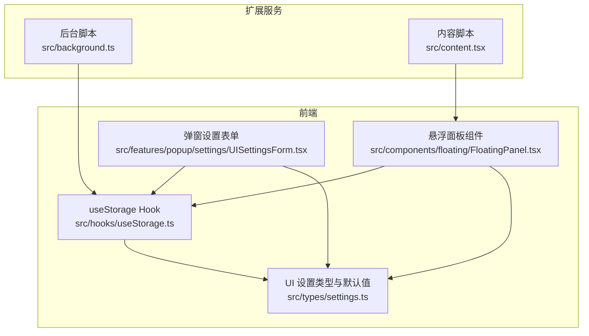
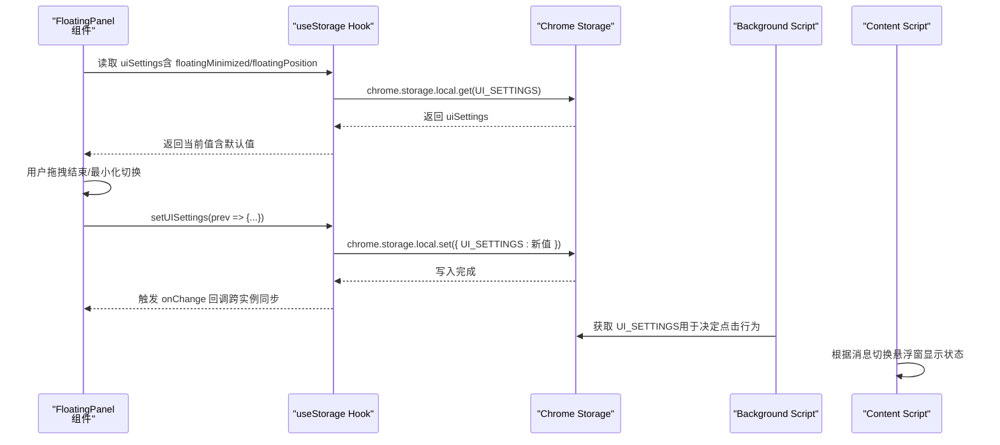
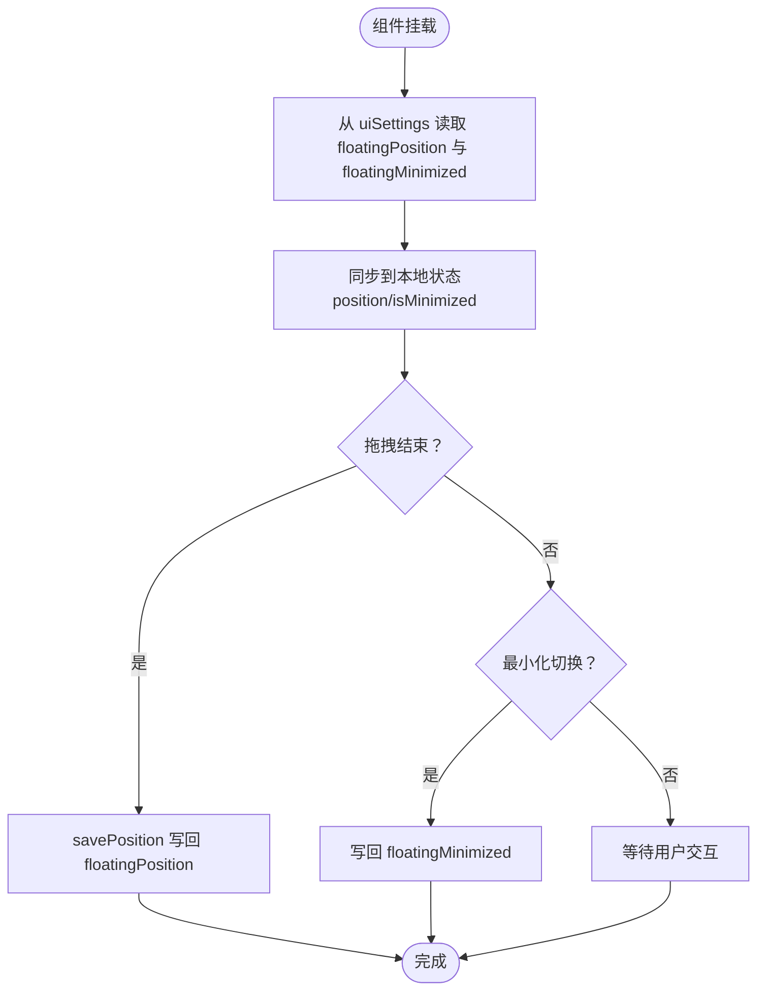
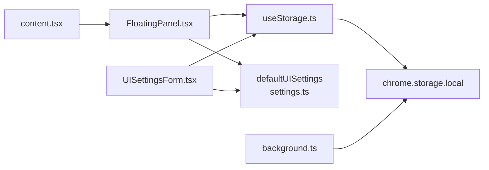

# 状态持久化方案

<cite>
**本文引用的文件**
- [useStorage.ts](file://src/hooks/useStorage.ts)
- [settings.ts](file://src/types/settings.ts)
- [FloatingPanel.tsx](file://src/components/floating/FloatingPanel.tsx)
- [UISettingsForm.tsx](file://src/features/popup/settings/UISettingsForm.tsx)
- [background.ts](file://src/background.ts)
- [content.tsx](file://src/content.tsx)
</cite>

## 目录
1. [引言](#引言)
2. [项目结构](#项目结构)
3. [核心组件](#核心组件)
4. [架构总览](#架构总览)
5. [详细组件分析](#详细组件分析)
6. [依赖关系分析](#依赖关系分析)
7. [性能考量](#性能考量)
8. [故障排查指南](#故障排查指南)
9. [结论](#结论)
10. [附录](#附录)

## 引言
本文件围绕“悬浮面板最小化状态与位置信息的持久化策略”进行深入讲解，重点说明：
- 如何通过 useStorage Hook 读取 uiSettings 中的 floatingMinimized 和 floatingPosition 字段初始化组件状态；
- 在状态变更时如何同步回存储；
- defaultUISettings 默认值的定义及其在首次使用时的作用；
- 结合代码展示 useEffect 如何监听 uiSettings 变化并更新本地状态，确保跨会话一致性；
- 讨论 Chrome 存储限制及数据结构优化建议。

## 项目结构
本项目采用“功能分层 + 类型定义”的组织方式，与状态持久化相关的关键模块如下：
- hooks/useStorage.ts：通用的 Chrome 扩展存储 Hook，提供读取、写入、跨实例同步能力；
- types/settings.ts：定义 UISettings 接口与 defaultUISettings 默认值；
- components/floating/FloatingPanel.tsx：悬浮面板组件，负责最小化状态与位置的本地状态管理与持久化；
- features/popup/settings/UISettingsForm.tsx：弹窗设置页中的界面模式切换表单；
- background.ts：后台脚本，负责扩展图标点击事件与 UI 模式切换的消息处理；
- content.tsx：内容脚本，承载悬浮面板并在页面内渲染。

图表来源
- [useStorage.ts](file://src/hooks/useStorage.ts#L1-L101)
- [settings.ts](file://src/types/settings.ts#L85-L107)
- [FloatingPanel.tsx](file://src/components/floating/FloatingPanel.tsx#L118-L170)
- [UISettingsForm.tsx](file://src/features/popup/settings/UISettingsForm.tsx#L19-L30)
- [background.ts](file://src/background.ts#L1-L78)
- [content.tsx](file://src/content.tsx#L128-L149)

章节来源
- [useStorage.ts](file://src/hooks/useStorage.ts#L1-L101)
- [settings.ts](file://src/types/settings.ts#L85-L107)
- [FloatingPanel.tsx](file://src/components/floating/FloatingPanel.tsx#L118-L170)
- [UISettingsForm.tsx](file://src/features/popup/settings/UISettingsForm.tsx#L19-L30)
- [background.ts](file://src/background.ts#L1-L78)
- [content.tsx](file://src/content.tsx#L128-L149)

## 核心组件
- useStorage Hook：封装 Chrome Storage 读取、写入与 onChanged 监听，提供 defaultValue 参数作为首次加载的兜底值；在开发环境降级到 localStorage。
- UISettings 类型与默认值：包含 mode、floatingPosition、floatingMinimized 三个关键字段，defaultUISettings 提供初始默认值。
- FloatingPanel 组件：维护本地最小化状态与位置状态，基于 useStorage 读取 uiSettings 并在拖拽结束与最小化切换时写回存储。
- UISettingsForm 表单：允许用户在弹窗设置页切换 UI 模式，并通过消息通知后台脚本更新 popup 行为。
- background 脚本：根据 uiSettings.mode 决定点击扩展图标时的行为，并在设置模式时更新 popup 行为。
- content 脚本：在页面内渲染悬浮面板并响应来自后台或弹窗的消息控制显示/隐藏。

章节来源
- [useStorage.ts](file://src/hooks/useStorage.ts#L1-L101)
- [settings.ts](file://src/types/settings.ts#L85-L107)
- [FloatingPanel.tsx](file://src/components/floating/FloatingPanel.tsx#L118-L170)
- [UISettingsForm.tsx](file://src/features/popup/settings/UISettingsForm.tsx#L19-L30)
- [background.ts](file://src/background.ts#L1-L78)
- [content.tsx](file://src/content.tsx#L128-L149)

## 架构总览
下面的序列图展示了“最小化状态与位置信息”的端到端持久化流程：从组件读取存储，到用户交互修改，再到存储写回与跨实例同步。

图表来源
- [FloatingPanel.tsx](file://src/components/floating/FloatingPanel.tsx#L145-L170)
- [useStorage.ts](file://src/hooks/useStorage.ts#L12-L37)
- [useStorage.ts](file://src/hooks/useStorage.ts#L40-L59)
- [useStorage.ts](file://src/hooks/useStorage.ts#L62-L88)
- [background.ts](file://src/background.ts#L14-L17)
- [content.tsx](file://src/content.tsx#L76-L104)

## 详细组件分析

### useStorage Hook：跨会话状态持久化基石
- 初始化与默认值
  - 通过 defaultValue 参数在首次加载时提供兜底值，避免空值导致的异常。
  - 在开发环境降级到 localStorage，保证本地调试可用。
- 读取与监听
  - 首次加载通过 chrome.storage.local.get 读取指定 key；
  - 通过 chrome.storage.onChanged 监听同一 key 的变化，实现多实例间的状态同步。
- 写入与异步落盘
  - set 方法支持函数式更新，内部异步调用 chrome.storage.local.set 写入；
  - 写入失败时记录日志，不影响主流程。
- 关键路径参考
  - 初始化与加载：[useStorage.ts](file://src/hooks/useStorage.ts#L12-L37)
  - onChanged 监听与同步：[useStorage.ts](file://src/hooks/useStorage.ts#L40-L59)
  - 写入逻辑：[useStorage.ts](file://src/hooks/useStorage.ts#L62-L88)

章节来源
- [useStorage.ts](file://src/hooks/useStorage.ts#L1-L101)

### defaultUISettings：首次使用的默认值
- 定义位置与字段
  - 包含 mode、floatingPosition、floatingMinimized 三类关键字段；
  - floatingPosition 默认坐标为较小正值，便于首次出现时可见。
- 首次使用作用
  - 当存储中不存在 uiSettings 时，useStorage 以 defaultUISettings 作为初始值；
  - 保证用户首次进入悬浮窗模式时，面板有合理的位置与状态。
- 关键路径参考
  - 默认值定义：[settings.ts](file://src/types/settings.ts#L85-L107)
  - 使用处（FloatingPanel）：[FloatingPanel.tsx](file://src/components/floating/FloatingPanel.tsx#L145-L149)
  - 使用处（UISettingsForm）：[UISettingsForm.tsx](file://src/features/popup/settings/UISettingsForm.tsx#L19-L23)

章节来源
- [settings.ts](file://src/types/settings.ts#L85-L107)
- [FloatingPanel.tsx](file://src/components/floating/FloatingPanel.tsx#L145-L149)
- [UISettingsForm.tsx](file://src/features/popup/settings/UISettingsForm.tsx#L19-L23)

### FloatingPanel：最小化状态与位置的双向绑定
- 初始化与 useEffect 同步
  - 组件挂载后，从 uiSettings 中读取 floatingPosition 与 floatingMinimized，并设置到本地状态；
  - 保证跨会话的一致性体验。
- 位置持久化
  - 拖拽结束后，通过 savePosition 将新位置写回 uiSettings；
  - 写入由 useStorage 的 set 方法异步完成，确保持久化。
- 最小化状态持久化
  - 切换最小化时，直接更新 uiSettings.floatingMinimized；
  - 保持最小化状态与位置信息的独立持久化。
- 关键路径参考
  - 读取 uiSettings 并同步本地状态：[FloatingPanel.tsx](file://src/components/floating/FloatingPanel.tsx#L151-L159)
  - 保存位置到存储：[FloatingPanel.tsx](file://src/components/floating/FloatingPanel.tsx#L162-L170)
  - 切换最小化并写回存储：[FloatingPanel.tsx](file://src/components/floating/FloatingPanel.tsx#L226-L234)

图表来源
- [FloatingPanel.tsx](file://src/components/floating/FloatingPanel.tsx#L151-L170)
- [FloatingPanel.tsx](file://src/components/floating/FloatingPanel.tsx#L226-L234)

章节来源
- [FloatingPanel.tsx](file://src/components/floating/FloatingPanel.tsx#L151-L170)
- [FloatingPanel.tsx](file://src/components/floating/FloatingPanel.tsx#L226-L234)

### UISettingsForm：弹窗设置页中的模式切换
- 功能概述
  - 通过 Select 控件切换 UI 模式（popup/floating），并调用 setSettings 更新存储；
  - 通过 chrome.runtime.sendMessage 通知后台脚本更新 popup 行为；
  - 在切换完成后显示提示信息，帮助用户理解切换效果。
- 关键路径参考
  - 读取与更新 uiSettings：[UISettingsForm.tsx](file://src/features/popup/settings/UISettingsForm.tsx#L19-L30)
  - 通知后台脚本更新 popup 行为：[UISettingsForm.tsx](file://src/features/popup/settings/UISettingsForm.tsx#L31-L45)
  - 后台脚本处理 setUIMode：[background.ts](file://src/background.ts#L42-L54)

章节来源
- [UISettingsForm.tsx](file://src/features/popup/settings/UISettingsForm.tsx#L19-L45)
- [background.ts](file://src/background.ts#L42-L54)

### background 与 content：跨脚本协同
- background.ts
  - 监听扩展图标点击事件，根据 uiSettings.mode 决定是否向 content script 发送 toggleFloatingPanel 消息；
  - 通过 chrome.action.setPopup 动态调整 popup 行为，使悬浮窗模式下点击图标直接切换悬浮窗显示状态。
- content.tsx
  - 监听来自 runtime 的消息，维护悬浮窗显示状态并回调给 React 组件；
  - 在悬浮窗模式下，通过 sendMessage 控制悬浮窗显示/隐藏。
- 关键路径参考
  - 图标点击与消息派发：[background.ts](file://src/background.ts#L10-L29)
  - 设置模式与 popup 行为更新：[background.ts](file://src/background.ts#L60-L70)
  - 消息监听与悬浮窗切换：[content.tsx](file://src/content.tsx#L69-L104)

章节来源
- [background.ts](file://src/background.ts#L10-L29)
- [background.ts](file://src/background.ts#L60-L70)
- [content.tsx](file://src/content.tsx#L69-L104)

## 依赖关系分析
- 组件耦合
  - FloatingPanel 依赖 useStorage 与 defaultUISettings，形成“存储驱动的 UI”模式；
  - UISettingsForm 依赖 useStorage 与 defaultUISettings，同时依赖 background 脚本以更新 popup 行为。
- 数据流向
  - 存储层（chrome.storage.local）是唯一真相源，useStorage 负责读取、写入与跨实例同步；
  - UI 层只维护本地状态，不直接访问存储，保证组件职责清晰。
- 外部依赖
  - Chrome Extension API（chrome.storage、chrome.runtime、chrome.action）；
  - Plasmo 生态（content script 注入、CSS 处理等）。

图表来源
- [useStorage.ts](file://src/hooks/useStorage.ts#L12-L37)
- [FloatingPanel.tsx](file://src/components/floating/FloatingPanel.tsx#L145-L170)
- [settings.ts](file://src/types/settings.ts#L85-L107)
- [UISettingsForm.tsx](file://src/features/popup/settings/UISettingsForm.tsx#L19-L30)
- [background.ts](file://src/background.ts#L14-L17)
- [content.tsx](file://src/content.tsx#L128-L149)

章节来源
- [useStorage.ts](file://src/hooks/useStorage.ts#L1-L101)
- [FloatingPanel.tsx](file://src/components/floating/FloatingPanel.tsx#L145-L170)
- [settings.ts](file://src/types/settings.ts#L85-L107)
- [UISettingsForm.tsx](file://src/features/popup/settings/UISettingsForm.tsx#L19-L30)
- [background.ts](file://src/background.ts#L14-L17)
- [content.tsx](file://src/content.tsx#L128-L149)

## 性能考量
- 存储读写开销
  - useStorage 在每次 set 时执行异步写入，频繁拖拽会导致多次写入；可通过节流/防抖减少写入次数（建议在组件侧增加节流策略）。
- 跨实例同步
  - onChanged 监听会在同一扩展内的多个实例之间广播更新，避免重复渲染与状态漂移；但过多实例可能带来额外事件处理成本。
- 渲染与布局
  - 悬浮面板固定定位且层级极高，确保在页面上始终可见；拖拽边界计算与最小化按钮交互应尽量轻量。
- 数据结构优化建议
  - 将 floatingPosition 与 floatingMinimized 合并为一个对象（例如 uiDisplayState），减少存储键数量；
  - 若未来引入更多面板状态（如尺寸、透明度等），统一收敛到一个对象，降低存储碎片化；
  - 对于高频写入场景，考虑批量合并更新（例如在拖拽结束时一次性写入位置与最小化状态）。

[本节为通用性能建议，不直接分析具体文件]

## 故障排查指南
- 无法读取存储
  - 检查浏览器环境是否为扩展上下文（非普通网页）；在非扩展上下文时 useStorage 会降级到 localStorage。
  - 确认 chrome.storage 是否可用，若不可用，检查扩展权限与 manifest 配置。
- 拖拽后位置未持久化
  - 确认拖拽结束时是否触发了 savePosition；检查 setUISettings 的调用链路。
  - 检查存储写入是否抛错（useStorage 内部有错误捕获与日志输出）。
- 最小化状态不同步
  - 确认组件是否在切换最小化时调用了 setUISettings；
  - 检查 onChanged 监听是否生效（同一扩展内的其他实例是否能收到更新）。
- 模式切换后 popup 行为未更新
  - 确认 UISettingsForm 是否成功发送 setUIMode 消息；
  - 检查 background 脚本是否正确处理 setUIMode 并调用 chrome.action.setPopup。

章节来源
- [useStorage.ts](file://src/hooks/useStorage.ts#L12-L37)
- [useStorage.ts](file://src/hooks/useStorage.ts#L40-L59)
- [useStorage.ts](file://src/hooks/useStorage.ts#L62-L88)
- [FloatingPanel.tsx](file://src/components/floating/FloatingPanel.tsx#L162-L170)
- [FloatingPanel.tsx](file://src/components/floating/FloatingPanel.tsx#L226-L234)
- [UISettingsForm.tsx](file://src/features/popup/settings/UISettingsForm.tsx#L31-L45)
- [background.ts](file://src/background.ts#L42-L54)

## 结论
本方案通过 useStorage Hook 将 uiSettings 中的 floatingMinimized 与 floatingPosition 与组件本地状态解耦，实现了：
- 首次使用时以 defaultUISettings 提供合理默认值；
- 通过 useEffect 将存储中的值同步到组件本地状态；
- 在用户交互（拖拽结束、最小化切换）时将最新状态写回存储；
- 通过 onChanged 监听实现跨实例同步，确保跨会话一致体验。

对于 Chrome 存储限制与数据结构优化，建议：
- 控制存储键数量与体积，必要时合并字段；
- 对高频写入场景增加节流/防抖；
- 在未来引入更多面板状态时，统一收敛到单一对象，降低碎片化与复杂度。

[本节为总结性内容，不直接分析具体文件]

## 附录
- 关键实现路径参考
  - useStorage 初始化与加载：[useStorage.ts](file://src/hooks/useStorage.ts#L12-L37)
  - onChanged 监听与同步：[useStorage.ts](file://src/hooks/useStorage.ts#L40-L59)
  - 写入逻辑：[useStorage.ts](file://src/hooks/useStorage.ts#L62-L88)
  - defaultUISettings 定义：[settings.ts](file://src/types/settings.ts#L85-L107)
  - FloatingPanel 读取与写回：[FloatingPanel.tsx](file://src/components/floating/FloatingPanel.tsx#L151-L170), [FloatingPanel.tsx](file://src/components/floating/FloatingPanel.tsx#L226-L234)
  - UISettingsForm 模式切换与消息通知：[UISettingsForm.tsx](file://src/features/popup/settings/UISettingsForm.tsx#L19-L45)
  - background 模式切换与 popup 行为更新：[background.ts](file://src/background.ts#L42-L70)
  - content 消息监听与悬浮窗切换：[content.tsx](file://src/content.tsx#L69-L104)