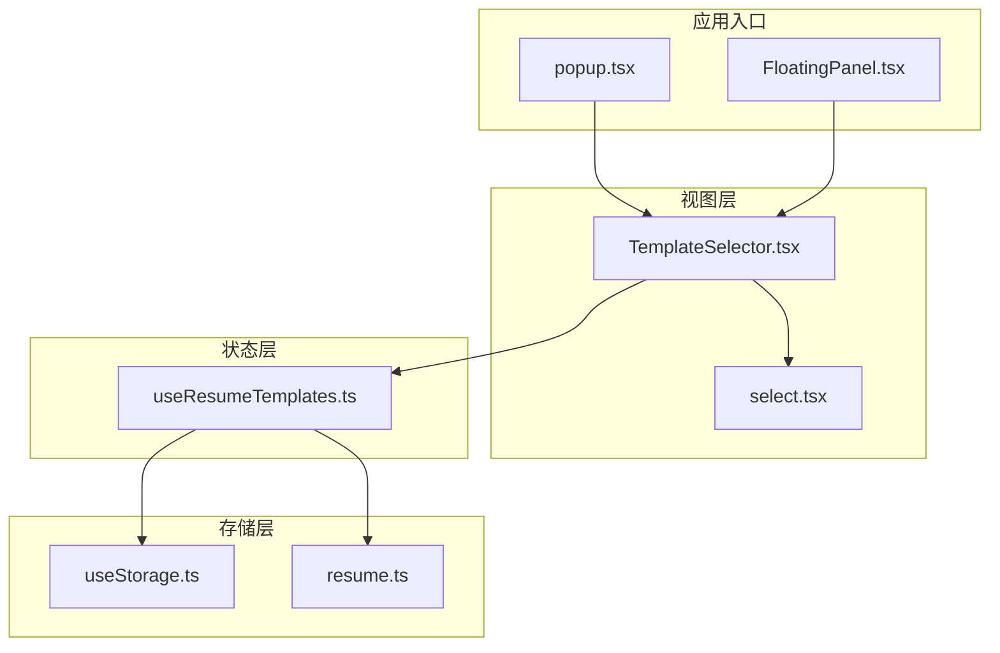
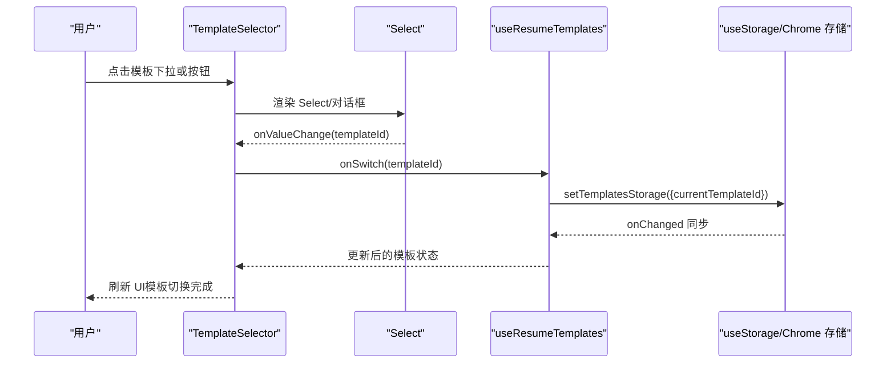
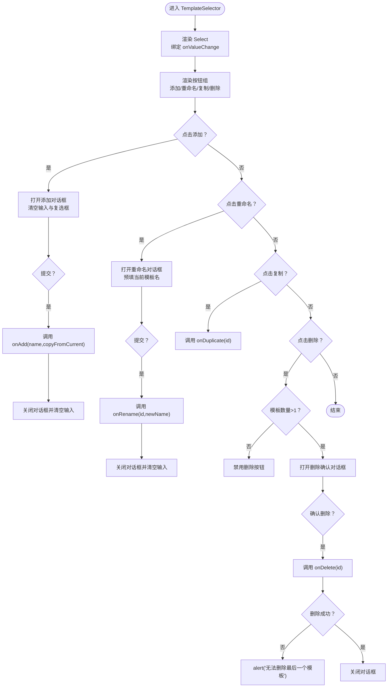
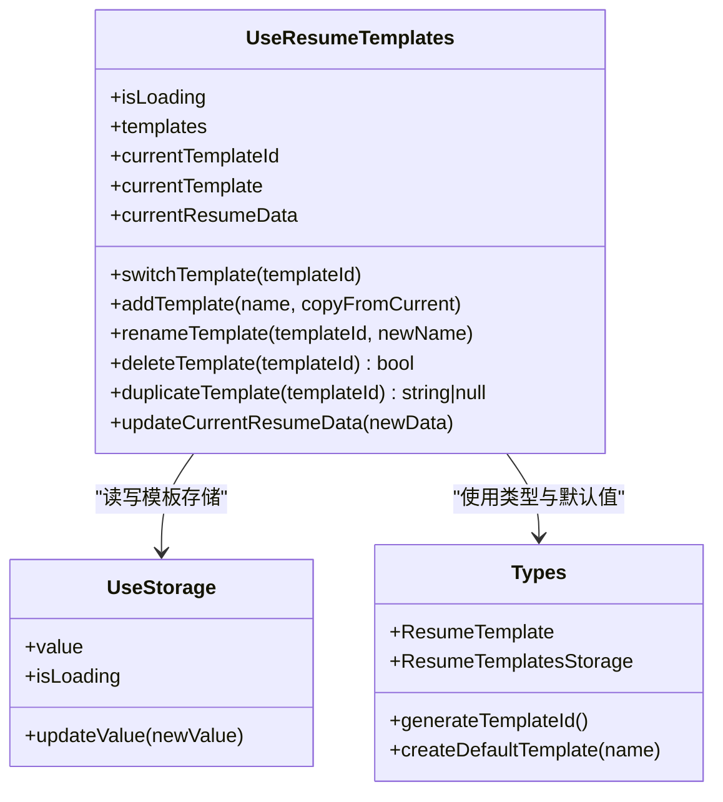
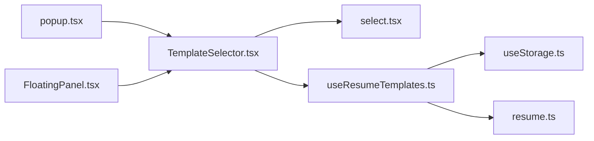

# 简历模板选择器

<cite>
**本文引用的文件**
- [TemplateSelector.tsx](file://src/components/common/TemplateSelector.tsx)
- [useResumeTemplates.ts](file://src/hooks/useResumeTemplates.ts)
- [select.tsx](file://src/components/ui/select.tsx)
- [useStorage.ts](file://src/hooks/useStorage.ts)
- [resume.ts](file://src/types/resume.ts)
- [popup.tsx](file://src/popup.tsx)
- [FloatingPanel.tsx](file://src/components/floating/FloatingPanel.tsx)
</cite>

## 目录
1. [简介](#简介)
2. [项目结构](#项目结构)
3. [核心组件](#核心组件)
4. [架构总览](#架构总览)
5. [详细组件分析](#详细组件分析)
6. [依赖关系分析](#依赖关系分析)
7. [性能考量](#性能考量)
8. [故障排查指南](#故障排查指南)
9. [结论](#结论)
10. [附录](#附录)

## 简介
本文件深入解析 TemplateSelector 组件的实现机制，重点说明其作为“多简历模板可视化管理”的核心功能。该组件通过 Select 组件实现模板切换，通过对话框模式（添加、重命名、删除）管理模板生命周期，并通过 onSwitch、onAdd、onRename、onDelete、onDuplicate 等回调函数与 useResumeTemplates Hook 进行状态同步。文档还分析了 compact 模式下的 UI 适配策略，解释按钮组（添加、重命名、复制、删除）的交互逻辑与禁用规则（如最后一个模板不可删除），并提供组件在弹窗和悬浮窗两种模式下的使用示例，说明其与 Chrome 存储的集成方式，以及针对模板操作失败等异常情况的调试建议。

## 项目结构
TemplateSelector 位于公共组件目录，配合 UI Select 组件、useResumeTemplates Hook、useStorage Hook 和类型定义共同工作，分别负责：
- 视图层：TemplateSelector 负责渲染模板选择器、对话框与按钮组
- 交互层：Select 组件提供下拉选择与选项渲染
- 状态层：useResumeTemplates Hook 提供模板 CRUD、迁移与当前模板数据
- 存储层：useStorage Hook 提供 Chrome 本地存储读写与跨实例同步
- 类型层：resume.ts 定义模板、简历数据与默认值

图表来源
- [TemplateSelector.tsx](file://src/components/common/TemplateSelector.tsx#L1-L259)
- [select.tsx](file://src/components/ui/select.tsx#L1-L162)
- [useResumeTemplates.ts](file://src/hooks/useResumeTemplates.ts#L1-L258)
- [useStorage.ts](file://src/hooks/useStorage.ts#L1-L102)
- [resume.ts](file://src/types/resume.ts#L165-L212)
- [popup.tsx](file://src/popup.tsx#L200-L214)
- [FloatingPanel.tsx](file://src/components/floating/FloatingPanel.tsx#L335-L350)

章节来源
- [TemplateSelector.tsx](file://src/components/common/TemplateSelector.tsx#L1-L259)
- [useResumeTemplates.ts](file://src/hooks/useResumeTemplates.ts#L1-L258)
- [select.tsx](file://src/components/ui/select.tsx#L1-L162)
- [useStorage.ts](file://src/hooks/useStorage.ts#L1-L102)
- [resume.ts](file://src/types/resume.ts#L165-L212)
- [popup.tsx](file://src/popup.tsx#L200-L214)
- [FloatingPanel.tsx](file://src/components/floating/FloatingPanel.tsx#L335-L350)

## 核心组件
- TemplateSelector：提供模板选择、添加、重命名、删除、复制等操作；支持 compact 模式；通过回调与 useResumeTemplates 同步状态。
- useResumeTemplates：封装模板 CRUD、迁移逻辑、当前模板与简历数据计算、模板复制与更新。
- UI Select：Radix UI Select 的封装，提供触发器、内容区、选项项等，且在扩展 Popup 中禁用 Portal 以避免焦点问题。
- useStorage：封装 Chrome 本地存储读取、写入与 onChanged 同步，兼容开发环境降级。
- 类型定义：ResumeTemplate、ResumeTemplatesStorage、默认模板与 ID 生成等。

章节来源
- [TemplateSelector.tsx](file://src/components/common/TemplateSelector.tsx#L1-L259)
- [useResumeTemplates.ts](file://src/hooks/useResumeTemplates.ts#L1-L258)
- [select.tsx](file://src/components/ui/select.tsx#L1-L162)
- [useStorage.ts](file://src/hooks/useStorage.ts#L1-L102)
- [resume.ts](file://src/types/resume.ts#L165-L212)

## 架构总览
TemplateSelector 作为 UI 展示与交互中枢，将用户操作映射为对 useResumeTemplates 的调用，后者通过 useStorage 将变更持久化到 Chrome 本地存储。模板选择由 Select 触发 onValueChange，从而调用 onSwitch 回调，实现模板切换。

图表来源
- [TemplateSelector.tsx](file://src/components/common/TemplateSelector.tsx#L196-L209)
- [useResumeTemplates.ts](file://src/hooks/useResumeTemplates.ts#L95-L105)
- [useStorage.ts](file://src/hooks/useStorage.ts#L39-L59)

## 详细组件分析

### TemplateSelector 组件
- 功能职责
  - 通过 Select 组件展示模板列表，onValueChange 触发 onSwitch 切换当前模板。
  - 通过按钮组提供添加、重命名、复制、删除操作，配合对话框完成生命周期管理。
  - 支持 compact 模式，减少外层容器与标签文本，适配紧凑布局。
- 回调接口
  - onSwitch(templateId)：切换当前模板
  - onAdd(name, copyFromCurrent?)：新增模板，返回新模板 id
  - onRename(templateId, newName)：重命名模板
  - onDelete(templateId)：删除模板，返回布尔表示是否成功
  - onDuplicate(templateId)：复制模板，返回新模板 id 或空
- 对话框模式
  - add：输入模板名，可选“复制当前模板内容”，提交后调用 onAdd 并清空输入与复选框。
  - rename：输入新名称，提交后调用 onRename。
  - delete：确认删除，调用 onDelete；若失败（最后一个模板），提示“无法删除最后一个模板”。
- 按钮组交互与禁用规则
  - 添加：无条件可用
  - 重命名：当前模板存在时可用
  - 复制：当前模板存在时可用
  - 删除：当模板数量大于 1 时可用；否则禁用
- compact 模式 UI 适配
  - 在 compact 下不渲染“模板：”标签与外层背景与圆角，Select 触发器宽度更窄，整体更紧凑

图表来源
- [TemplateSelector.tsx](file://src/components/common/TemplateSelector.tsx#L46-L187)
- [TemplateSelector.tsx](file://src/components/common/TemplateSelector.tsx#L196-L251)

章节来源
- [TemplateSelector.tsx](file://src/components/common/TemplateSelector.tsx#L1-L259)

### UI Select 组件
- 关键点
  - SelectContent 未使用 Portal，避免在 Chrome 扩展 Popup 中因焦点转移导致窗口关闭的问题。
  - SelectItem 渲染模板名称，SelectTrigger 提供触发器与下拉箭头。
- 与 TemplateSelector 的协作
  - TemplateSelector 通过 Select 的 onValueChange 接收用户选择，触发 onSwitch 回调。

章节来源
- [select.tsx](file://src/components/ui/select.tsx#L68-L96)
- [select.tsx](file://src/components/ui/select.tsx#L114-L135)
- [TemplateSelector.tsx](file://src/components/common/TemplateSelector.tsx#L196-L209)

### useResumeTemplates Hook
- 状态与计算
  - templates、currentTemplateId、currentTemplate、currentResumeData（基于当前模板 data 的默认值）
- 模板操作
  - switchTemplate：校验模板存在后更新 currentTemplateId
  - addTemplate：生成唯一 id，可选复制当前模板数据，默认使用 defaultResumeData
  - renameTemplate：更新模板名称与 updatedAt
  - deleteTemplate：禁止删除最后一个模板；删除后若当前模板被删则重选第一个
  - duplicateTemplate：复制模板并自动设为当前模板
  - updateCurrentResumeData：更新当前模板的简历数据并更新时间戳
- 迁移逻辑
  - 若模板列表为空且存在旧版 resumeData 且有内容，则迁移为默认模板；否则创建默认模板
  - 若仅有模板但无 currentTemplateId，则选中第一个模板
- 与存储的集成
  - 通过 useStorage 读取/写入 STORAGE_KEYS.RESUME_TEMPLATES，支持 onChanged 同步

图表来源
- [useResumeTemplates.ts](file://src/hooks/useResumeTemplates.ts#L1-L258)
- [useStorage.ts](file://src/hooks/useStorage.ts#L1-L102)
- [resume.ts](file://src/types/resume.ts#L165-L212)

章节来源
- [useResumeTemplates.ts](file://src/hooks/useResumeTemplates.ts#L1-L258)
- [resume.ts](file://src/types/resume.ts#L165-L212)

### 存储与类型
- 存储键名
  - STORAGE_KEYS.RESUME_TEMPLATES：模板存储键
- 类型定义
  - ResumeTemplate：包含 id、name、data、createdAt、updatedAt
  - ResumeTemplatesStorage：包含 templates[] 与 currentTemplateId
  - defaultResumeTemplatesStorage：默认空模板存储
  - generateTemplateId：生成唯一模板 id
  - createDefaultTemplate：创建默认模板

章节来源
- [useStorage.ts](file://src/hooks/useStorage.ts#L90-L102)
- [resume.ts](file://src/types/resume.ts#L165-L212)

### 在弹窗与悬浮窗中的使用示例
- 弹窗模式（popup）
  - 在 popup 页面中，当模板加载完成后渲染 TemplateSelector，并将 useResumeTemplates 的模板列表与回调传入
- 悬浮窗模式（FloatingPanel）
  - 在悬浮面板中同样渲染 TemplateSelector，实现一致的模板管理体验

章节来源
- [popup.tsx](file://src/popup.tsx#L200-L214)
- [FloatingPanel.tsx](file://src/components/floating/FloatingPanel.tsx#L335-L350)

## 依赖关系分析
- 组件耦合
  - TemplateSelector 与 UI Select 强耦合（Select 的 onValueChange 与 SelectItem 渲染）
  - TemplateSelector 与 useResumeTemplates 强耦合（通过回调进行状态同步）
  - useResumeTemplates 与 useStorage 强耦合（存储读写与 onChanged 同步）
- 外部依赖
  - Chrome 扩展环境下的 chrome.storage.local
  - Radix UI Select（SelectPrimitive）

图表来源
- [TemplateSelector.tsx](file://src/components/common/TemplateSelector.tsx#L1-L259)
- [select.tsx](file://src/components/ui/select.tsx#L1-L162)
- [useResumeTemplates.ts](file://src/hooks/useResumeTemplates.ts#L1-L258)
- [useStorage.ts](file://src/hooks/useStorage.ts#L1-L102)
- [resume.ts](file://src/types/resume.ts#L165-L212)
- [popup.tsx](file://src/popup.tsx#L200-L214)
- [FloatingPanel.tsx](file://src/components/floating/FloatingPanel.tsx#L335-L350)

## 性能考量
- 渲染优化
  - SelectItem 仅渲染模板名称，列表较大时可考虑虚拟滚动（当前未实现）
- 状态更新
  - useResumeTemplates 使用 useMemo 计算 currentTemplate 与 currentResumeData，避免不必要的重渲染
- 存储写入
  - useStorage 异步写入，避免阻塞 UI；同时监听 onChanged 实现跨实例同步
- 交互响应
  - TemplateSelector 对话框采用受控输入与受控复选框，减少副作用

[本节为通用性能讨论，不直接分析具体文件]

## 故障排查指南
- 删除失败（最后一个模板）
  - 现象：点击删除后弹出“无法删除最后一个模板”
  - 原因：deleteTemplate 禁止删除最后一个模板
  - 处理：先添加新模板再删除
- 新增模板失败或无反应
  - 现象：添加对话框提交后无模板新增
  - 原因：输入为空或 onAdd 返回值未被消费
  - 处理：确保输入非空；确认 onAdd 成功写入 templates 并更新 currentTemplateId
- 切换无效
  - 现象：选择模板后未生效
  - 原因：onSwitch 未更新 currentTemplateId 或模板不存在
  - 处理：检查 templates 中是否存在该 id；确认 onSwitch 正确调用
- 存储异常
  - 现象：刷新后模板丢失或不同实例间不同步
  - 原因：chrome.storage.local 访问失败或 onChanged 未触发
  - 处理：检查浏览器权限；确认 useStorage 初始化与 onChanged 监听正常
- 开发环境差异
  - 现象：本地开发时数据未持久化
  - 原因：useStorage 在非 chrome 环境降级为 localStorage
  - 处理：在扩展环境中测试；或在开发时模拟 chrome.storage

章节来源
- [TemplateSelector.tsx](file://src/components/common/TemplateSelector.tsx#L66-L74)
- [useResumeTemplates.ts](file://src/hooks/useResumeTemplates.ts#L146-L168)
- [useStorage.ts](file://src/hooks/useStorage.ts#L1-L102)

## 结论
TemplateSelector 通过简洁的 UI 与明确的回调契约，将模板选择与生命周期管理整合在一个组件内，配合 useResumeTemplates 的状态管理与 useStorage 的持久化能力，实现了稳定可靠的多模板管理体验。其在弹窗与悬浮窗两种模式下的统一使用方式，保证了用户体验的一致性。对于最后一个模板不可删除、复制与重命名的禁用规则等边界情况，组件均提供了清晰的交互反馈与保护措施。

[本节为总结性内容，不直接分析具体文件]

## 附录
- 使用示例路径
  - 弹窗模式：[popup.tsx](file://src/popup.tsx#L200-L214)
  - 悬浮窗模式：[FloatingPanel.tsx](file://src/components/floating/FloatingPanel.tsx#L335-L350)
- 类型定义参考
  - 模板与存储结构：[resume.ts](file://src/types/resume.ts#L165-L212)
- 存储键名参考
  - 模板存储键：[useStorage.ts](file://src/hooks/useStorage.ts#L90-L102)