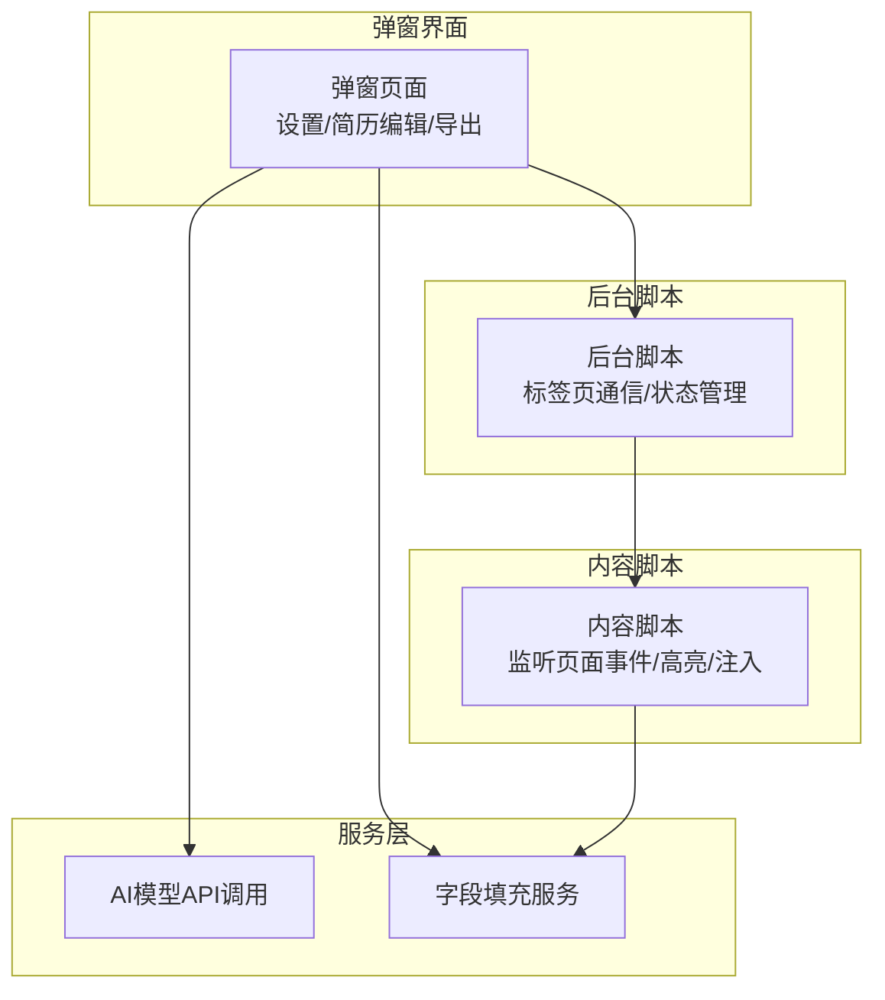
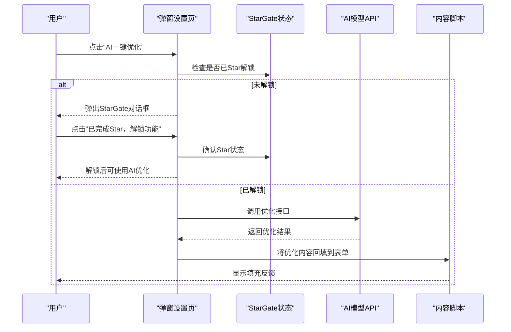
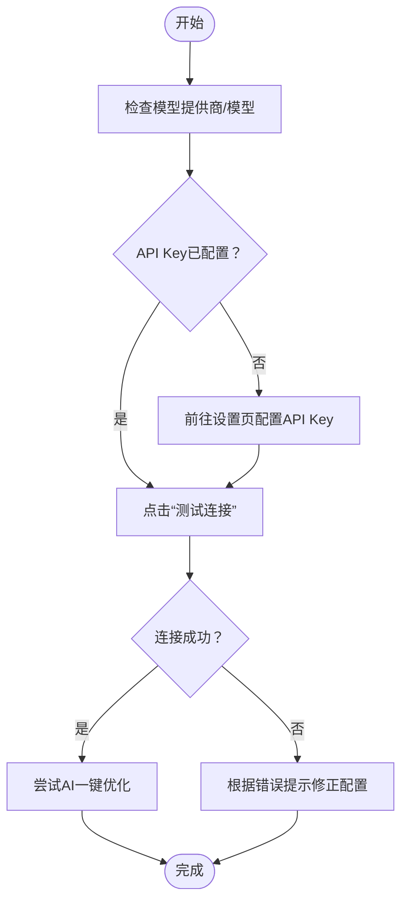
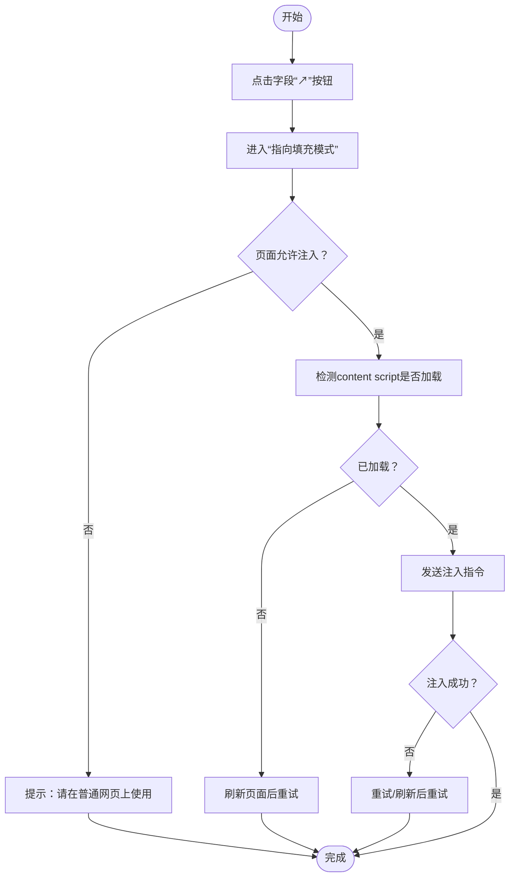
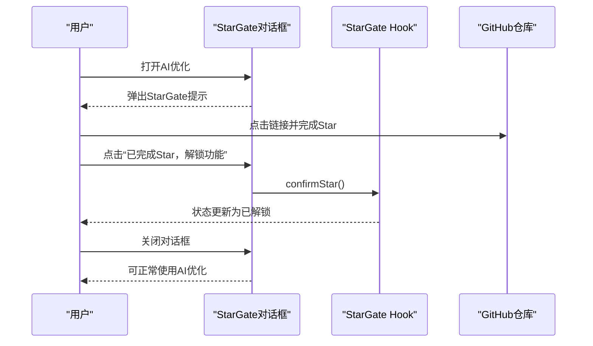
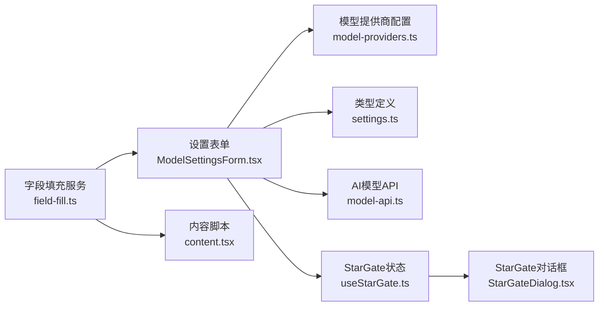

# 常见问题

<cite>
**本文引用的文件**
- [README.md](file://README.md)
- [assets/README.zh-CN.md](file://assets/README.zh-CN.md)
- [src/hooks/useStarGate.ts](file://src/hooks/useStarGate.ts)
- [src/components/common/StarGateDialog.tsx](file://src/components/common/StarGateDialog.tsx)
- [src/services/model-api.ts](file://src/services/model-api.ts)
- [src/features/popup/settings/ModelSettingsForm.tsx](file://src/features/popup/settings/ModelSettingsForm.tsx)
- [src/services/field-fill.ts](file://src/services/field-fill.ts)
- [src/content.tsx](file://src/content.tsx)
- [src/components/ui/field-fill-button.tsx](file://src/components/ui/field-fill-button.tsx)
- [src/components/ui/input-with-fill.tsx](file://src/components/ui/input-with-fill.tsx)
- [src/config/model-providers.ts](file://src/config/model-providers.ts)
- [src/types/settings.ts](file://src/types/settings.ts)
</cite>

## 目录
1. [简介](#简介)
2. [项目结构](#项目结构)
3. [核心组件](#核心组件)
4. [架构总览](#架构总览)
5. [详细组件分析](#详细组件分析)
6. [依赖关系分析](#依赖关系分析)
7. [性能与稳定性建议](#性能与稳定性建议)
8. [故障排查指南](#故障排查指南)
9. [结论](#结论)
10. [附录](#附录)

## 简介
本FAQ围绕用户在使用 Offer Laolao 插件过程中遇到的高频问题，结合项目源码与说明文档，给出贴近用户语言、可操作性强的解决方案。重点覆盖以下典型场景：
- 安装失败（开发者模式、Edge商店安装）
- API配置错误（AI模型与简历解析）
- 填充不生效（字段级精准填充、页面限制）
- AI功能锁定（StarGate验证）

## 项目结构
插件采用浏览器扩展架构，核心由“弹窗界面（popup）+ 内容脚本（content）+ 后台脚本（background）”协同工作。弹窗内提供设置、简历编辑与导出等功能；内容脚本负责监听页面元素并执行字段注入；后台脚本负责跨标签通信与状态管理。

[无图表来源，因为该图为概念性结构示意]

**章节来源**
- [README.md](file://README.md#L131-L191)
- [assets/README.zh-CN.md](file://assets/README.zh-CN.md#L131-L192)

## 核心组件
- StarGate 验证：通过 GitHub Star 状态解锁高级功能（如AI优化），状态持久化在本地存储。
- AI模型API：统一调用不同提供商的OpenAI兼容接口，支持测试连接、字段匹配、内容优化等。
- 字段填充服务：在弹窗中触发，向当前页面注入“字段级精准填充”模式，支持高亮、点击注入、Esc取消。
- 设置表单：集中管理模型提供商、模型、API Key、自定义URL等配置，并提供一键测试连接。

**章节来源**
- [src/hooks/useStarGate.ts](file://src/hooks/useStarGate.ts#L1-L72)
- [src/components/common/StarGateDialog.tsx](file://src/components/common/StarGateDialog.tsx#L1-L106)
- [src/services/model-api.ts](file://src/services/model-api.ts#L1-L174)
- [src/features/popup/settings/ModelSettingsForm.tsx](file://src/features/popup/settings/ModelSettingsForm.tsx#L1-L298)
- [src/services/field-fill.ts](file://src/services/field-fill.ts#L1-L136)

## 架构总览
下面以“AI优化按钮不可用”的典型流程为例，展示从用户操作到服务调用的关键链路。

**图表来源**
- [src/features/popup/settings/ModelSettingsForm.tsx](file://src/features/popup/settings/ModelSettingsForm.tsx#L1-L298)
- [src/hooks/useStarGate.ts](file://src/hooks/useStarGate.ts#L1-L72)
- [src/components/common/StarGateDialog.tsx](file://src/components/common/StarGateDialog.tsx#L1-L106)
- [src/services/model-api.ts](file://src/services/model-api.ts#L176-L233)
- [src/content.tsx](file://src/content.tsx#L237-L297)

## 详细组件分析

### 安装失败排查
常见原因与解决步骤：
- 未启用开发者模式或未选择正确的构建目录
  - 步骤：确认已进入扩展管理页面并开启“开发者模式”，加载扩展时选择构建产物目录。
- Edge商店安装失败
  - 步骤：更换网络或稍后再试；若仍失败，尝试使用开发者模式安装。
- Edge开发者模式安装
  - 步骤：按开发者模式安装流程，确保选择的是构建产物目录。

建议核对：
- 构建产物路径是否正确（构建后生成特定目录）
- 浏览器版本与扩展兼容性

**章节来源**
- [README.md](file://README.md#L131-L191)
- [assets/README.zh-CN.md](file://assets/README.zh-CN.md#L131-L192)

### API配置错误（AI模型与简历解析）
症状：
- “AI一键优化”按钮灰色不可用
- 测试连接失败
- 优化接口报错

定位与修复：
- 检查模型提供商与模型是否选择
- 确认API Key已配置且与提供商匹配
- 使用“测试连接”验证连通性
- 若使用自定义URL，确保URL以/chat/completions结尾
- 若出现认证失败/401，检查API Key是否正确
- 若出现429，降低请求频率或等待冷却

**图表来源**
- [src/features/popup/settings/ModelSettingsForm.tsx](file://src/features/popup/settings/ModelSettingsForm.tsx#L1-L298)
- [src/services/model-api.ts](file://src/services/model-api.ts#L141-L174)
- [src/services/model-api.ts](file://src/services/model-api.ts#L1-L120)
- [src/config/model-providers.ts](file://src/config/model-providers.ts#L1-L123)
- [src/types/settings.ts](file://src/types/settings.ts#L1-L122)

**章节来源**
- [src/features/popup/settings/ModelSettingsForm.tsx](file://src/features/popup/settings/ModelSettingsForm.tsx#L1-L298)
- [src/services/model-api.ts](file://src/services/model-api.ts#L1-L174)
- [src/config/model-providers.ts](file://src/config/model-providers.ts#L1-L123)
- [src/types/settings.ts](file://src/types/settings.ts#L1-L122)

### 填充不生效（字段级精准填充）
常见现象：
- 点击“↗”按钮后无响应
- 页面提示“当前页面不支持此功能”
- 刷新页面后仍无法注入

定位与修复：
- 确认当前页面非系统页（如chrome://、edge://、about:）
- 若弹窗快速关闭导致消息端口异常，按提示刷新页面后重试
- 若content script未加载，需刷新页面后再试
- 使用Esc取消模式后重新进入“指向填充模式”

**图表来源**
- [src/services/field-fill.ts](file://src/services/field-fill.ts#L1-L136)
- [src/services/field-fill.ts](file://src/services/field-fill.ts#L138-L260)
- [src/content.tsx](file://src/content.tsx#L237-L297)
- [src/components/ui/field-fill-button.tsx](file://src/components/ui/field-fill-button.tsx#L1-L47)
- [src/components/ui/input-with-fill.tsx](file://src/components/ui/input-with-fill.tsx#L1-L168)

**章节来源**
- [src/services/field-fill.ts](file://src/services/field-fill.ts#L1-L136)
- [src/services/field-fill.ts](file://src/services/field-fill.ts#L138-L260)
- [src/content.tsx](file://src/content.tsx#L237-L297)
- [src/components/ui/field-fill-button.tsx](file://src/components/ui/field-fill-button.tsx#L1-L47)
- [src/components/ui/input-with-fill.tsx](file://src/components/ui/input-with-fill.tsx#L1-L168)

### AI功能锁定（StarGate验证）
症状：
- 首次使用AI优化时弹出StarGate对话框
- 点击“已完成Star，解锁功能”后仍不可用

定位与修复：
- 点击对话框中的GitHub链接完成Star
- 回到插件后点击“已完成Star，解锁功能”
- 确认本地存储中已记录Star状态
- 若误删或重装，可重置Star状态后重新确认

**图表来源**
- [src/components/common/StarGateDialog.tsx](file://src/components/common/StarGateDialog.tsx#L1-L106)
- [src/hooks/useStarGate.ts](file://src/hooks/useStarGate.ts#L1-L72)

**章节来源**
- [src/components/common/StarGateDialog.tsx](file://src/components/common/StarGateDialog.tsx#L1-L106)
- [src/hooks/useStarGate.ts](file://src/hooks/useStarGate.ts#L1-L72)

### 为何某些网站表单无法识别
- 说明：部分网站使用特殊表单组件，自动识别可能不生效
- 解决：使用“字段级精准填充”逐个定位并注入
- 建议：先在插件中填写好字段值，再进入“指向填充模式”，点击目标输入框完成注入

**章节来源**
- [README.md](file://README.md#L287-L289)
- [assets/README.zh-CN.md](file://assets/README.zh-CN.md#L286-L288)
- [src/services/field-fill.ts](file://src/services/field-fill.ts#L1-L136)

### AI优化按钮灰色不可用
- 说明：首次使用AI优化需完成StarGate验证
- 解决：点击StarGate对话框中的GitHub链接完成Star，再点击“已完成Star，解锁功能”

**章节来源**
- [README.md](file://README.md#L235-L245)
- [assets/README.zh-CN.md](file://assets/README.zh-CN.md#L234-L245)
- [src/components/common/StarGateDialog.tsx](file://src/components/common/StarGateDialog.tsx#L1-L106)
- [src/hooks/useStarGate.ts](file://src/hooks/useStarGate.ts#L1-L72)

## 依赖关系分析
- 设置表单依赖模型提供商配置与API类型定义，用于动态渲染与校验
- AI模型API依赖设置表单提供的配置，统一构建请求并处理错误
- 字段填充服务依赖后台脚本与内容脚本，负责跨上下文通信与注入
- StarGate状态贯穿设置与弹窗，决定是否开放高级功能

**图表来源**
- [src/features/popup/settings/ModelSettingsForm.tsx](file://src/features/popup/settings/ModelSettingsForm.tsx#L1-L298)
- [src/config/model-providers.ts](file://src/config/model-providers.ts#L1-L123)
- [src/types/settings.ts](file://src/types/settings.ts#L1-L122)
- [src/services/model-api.ts](file://src/services/model-api.ts#L1-L174)
- [src/hooks/useStarGate.ts](file://src/hooks/useStarGate.ts#L1-L72)
- [src/components/common/StarGateDialog.tsx](file://src/components/common/StarGateDialog.tsx#L1-L106)
- [src/services/field-fill.ts](file://src/services/field-fill.ts#L1-L136)
- [src/content.tsx](file://src/content.tsx#L237-L297)

**章节来源**
- [src/features/popup/settings/ModelSettingsForm.tsx](file://src/features/popup/settings/ModelSettingsForm.tsx#L1-L298)
- [src/config/model-providers.ts](file://src/config/model-providers.ts#L1-L123)
- [src/types/settings.ts](file://src/types/settings.ts#L1-L122)
- [src/services/model-api.ts](file://src/services/model-api.ts#L1-L174)
- [src/hooks/useStarGate.ts](file://src/hooks/useStarGate.ts#L1-L72)
- [src/components/common/StarGateDialog.tsx](file://src/components/common/StarGateDialog.tsx#L1-L106)
- [src/services/field-fill.ts](file://src/services/field-fill.ts#L1-L136)
- [src/content.tsx](file://src/content.tsx#L237-L297)

## 性能与稳定性建议
- 避免频繁触发AI优化，注意服务端限流（429）
- 使用“字段级精准填充”替代自动识别时，建议先在插件中填写完整字段值
- 在复杂页面中，先刷新页面确保content script加载完成
- API Key与模型配置变更后，优先使用“测试连接”确认

[本节为通用建议，不直接分析具体文件]

## 故障排查指南
- 安装失败
  - 确认已启用开发者模式并选择正确构建目录
  - Edge商店安装失败可换网络或改用开发者模式
- API配置错误
  - 检查提供商/模型/API Key是否齐全
  - 使用“测试连接”定位401/429/400等错误
  - 自定义URL需以/chat/completions结尾
- 填充不生效
  - 排除系统页（chrome://、edge://、about:）
  - 刷新页面后重试，或等待消息端口稳定
- AI功能锁定
  - 完成StarGate验证后再次尝试
  - 如状态异常，重置Star状态后重新确认

**章节来源**
- [README.md](file://README.md#L131-L191)
- [assets/README.zh-CN.md](file://assets/README.zh-CN.md#L131-L192)
- [src/services/model-api.ts](file://src/services/model-api.ts#L1-L174)
- [src/services/field-fill.ts](file://src/services/field-fill.ts#L1-L136)
- [src/components/common/StarGateDialog.tsx](file://src/components/common/StarGateDialog.tsx#L1-L106)

## 结论
通过以上分场景的排查与修复建议，大多数用户在安装、API配置、填充与AI功能使用上的问题都能得到快速解决。建议在首次使用前完成StarGate验证与API测试，日常使用中优先采用“字段级精准填充”以提升成功率。

[本节为总结性内容，不直接分析具体文件]

## 附录
- 相关文件路径参考
  - 设置表单：src/features/popup/settings/ModelSettingsForm.tsx
  - StarGate状态与弹窗：src/hooks/useStarGate.ts、src/components/common/StarGateDialog.tsx
  - AI模型API：src/services/model-api.ts、src/config/model-providers.ts、src/types/settings.ts
  - 字段填充服务与内容脚本：src/services/field-fill.ts、src/content.tsx
  - 字段注入UI组件：src/components/ui/field-fill-button.tsx、src/components/ui/input-with-fill.tsx

[本节为补充说明，不直接分析具体文件]