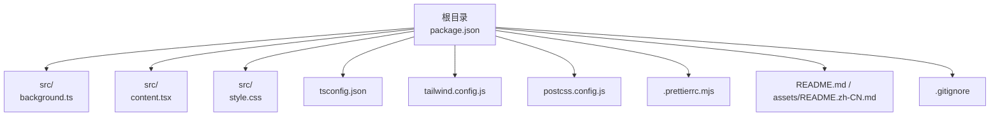
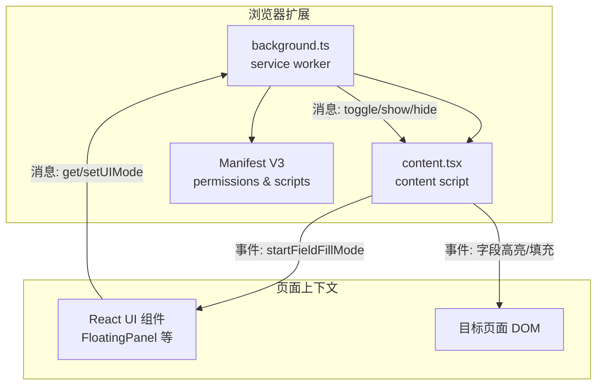
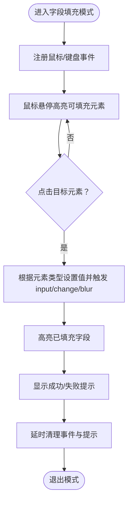
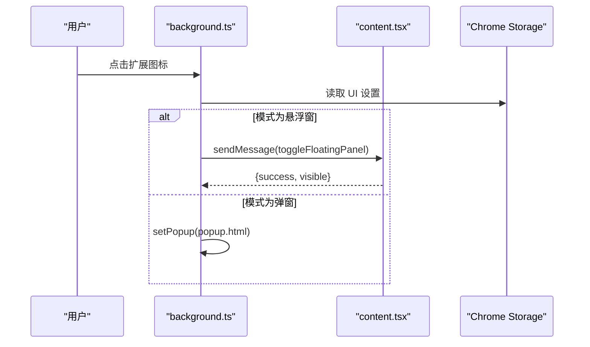
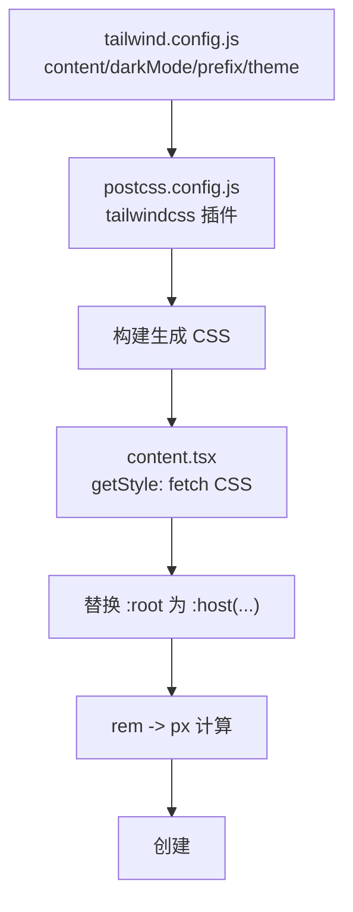
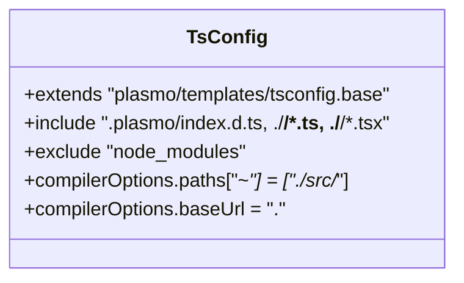
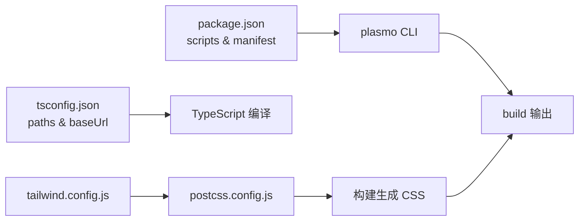

# 开发指南

<cite>
**本文引用的文件**
- [package.json](file://package.json)
- [tsconfig.json](file://tsconfig.json)
- [tailwind.config.js](file://tailwind.config.js)
- [postcss.config.js](file://postcss.config.js)
- [.prettierrc.mjs](file://.prettierrc.mjs)
- [src/content.tsx](file://src/content.tsx)
- [src/background.ts](file://src/background.ts)
- [README.md](file://README.md)
- [assets/README.zh-CN.md](file://assets/README.zh-CN.md)
- [.gitignore](file://.gitignore)
</cite>

## 目录
1. [简介](#简介)
2. [项目结构](#项目结构)
3. [核心组件](#核心组件)
4. [架构总览](#架构总览)
5. [详细组件分析](#详细组件分析)
6. [依赖关系分析](#依赖关系分析)
7. [性能与构建注意事项](#性能与构建注意事项)
8. [故障排查指南](#故障排查指南)
9. [结论](#结论)
10. [附录](#附录)

## 简介
本指南面向贡献者，提供从零搭建开发环境到本地调试、构建与打包的完整流程说明。重点覆盖：
- 依赖安装（pnpm）
- 本地开发启动（pnpm dev）
- 构建生产包（pnpm build）
- TypeScript 配置（模块解析策略、路径别名）
- Tailwind CSS 与 PostCSS 的样式处理流程
- Plasmo 框架的特殊配置与运行机制
- 代码提交规范、分支管理策略与 PR 审查建议

## 项目结构
该项目为基于 Plasmo 的 Chrome 扩展工程，采用 React + TypeScript + Tailwind CSS 技术栈，包含扩展的核心逻辑（background、content script）与 UI 组件。

图表来源
- [package.json](file://package.json#L1-L66)
- [tsconfig.json](file://tsconfig.json#L1-L19)
- [tailwind.config.js](file://tailwind.config.js#L1-L66)
- [postcss.config.js](file://postcss.config.js#L1-L9)
- [.prettierrc.mjs](file://.prettierrc.mjs#L1-L27)
- [src/background.ts](file://src/background.ts#L1-L80)
- [src/content.tsx](file://src/content.tsx#L1-L454)
- [README.md](file://README.md#L1-L330)
- [assets/README.zh-CN.md](file://assets/README.zh-CN.md#L1-L330)
- [.gitignore](file://.gitignore#L1-L66)

章节来源
- [package.json](file://package.json#L1-L66)
- [tsconfig.json](file://tsconfig.json#L1-L19)
- [tailwind.config.js](file://tailwind.config.js#L1-L66)
- [postcss.config.js](file://postcss.config.js#L1-L9)
- [.prettierrc.mjs](file://.prettierrc.mjs#L1-L27)
- [src/background.ts](file://src/background.ts#L1-L80)
- [src/content.tsx](file://src/content.tsx#L1-L454)
- [README.md](file://README.md#L1-L330)
- [assets/README.zh-CN.md](file://assets/README.zh-CN.md#L1-L330)
- [.gitignore](file://.gitignore#L1-L66)

## 核心组件
- 扩展入口与生命周期
  - background.ts：扩展图标点击事件处理、UI 模式切换、消息路由与 popup 行为更新。
  - content.tsx：内容脚本，负责注入 UI、字段精准填充模式、Shadow DOM 样式适配与与后台通信。
- 样式与主题
  - tailwind.config.js：定义内容扫描范围、深色模式策略、类前缀与主题变量映射。
  - postcss.config.js：启用 Tailwind CSS 插件。
  - tsconfig.json：启用路径别名“~”并继承 Plasmo 基础配置。
  - .prettierrc.mjs：统一代码风格与导入顺序，包含对 Plasmo 与内部路径的排序规则。
- 构建与运行
  - package.json：定义脚本（dev/build/package）、依赖与 Manifest V3 配置。
  - .gitignore：忽略构建产物、依赖缓存与 IDE 文件。

章节来源
- [src/background.ts](file://src/background.ts#L1-L80)
- [src/content.tsx](file://src/content.tsx#L1-L454)
- [tailwind.config.js](file://tailwind.config.js#L1-L66)
- [postcss.config.js](file://postcss.config.js#L1-L9)
- [tsconfig.json](file://tsconfig.json#L1-L19)
- [.prettierrc.mjs](file://.prettierrc.mjs#L1-L27)
- [package.json](file://package.json#L1-L66)
- [.gitignore](file://.gitignore#L1-L66)

## 架构总览
下图展示了扩展的运行时架构：浏览器加载 background 作为 service worker；content script 注入到目标页面，负责 UI 与字段填充；UI 通过消息与 background 交互，实现悬浮窗/弹窗模式切换与行为控制。

图表来源
- [src/background.ts](file://src/background.ts#L1-L80)
- [src/content.tsx](file://src/content.tsx#L1-L454)
- [package.json](file://package.json#L42-L64)

章节来源
- [src/background.ts](file://src/background.ts#L1-L80)
- [src/content.tsx](file://src/content.tsx#L1-L454)
- [package.json](file://package.json#L42-L64)

## 详细组件分析

### 组件 A：内容脚本（content.tsx）
- 职责
  - 注入 React UI（悬浮窗面板），并在 Shadow DOM 中应用样式。
  - 监听来自 background 的消息，切换悬浮窗显示状态或进入字段精准填充模式。
  - 实现字段填充模式：鼠标悬停高亮、点击选择目标元素、触发表单事件、可视化反馈。
- 关键流程（字段填充模式）

图表来源
- [src/content.tsx](file://src/content.tsx#L157-L395)

章节来源
- [src/content.tsx](file://src/content.tsx#L1-L454)

### 组件 B：后台脚本（background.ts）
- 职责
  - 监听扩展图标点击，根据用户设置决定显示弹窗还是悬浮窗。
  - 处理来自 UI 的消息请求，查询/更新 UI 模式，并动态调整 action.popup。
- 关键流程（图标点击与模式切换）

图表来源
- [src/background.ts](file://src/background.ts#L11-L29)
- [src/background.ts](file://src/background.ts#L31-L57)
- [src/content.tsx](file://src/content.tsx#L69-L94)

章节来源
- [src/background.ts](file://src/background.ts#L1-L80)
- [src/content.tsx](file://src/content.tsx#L1-L122)

### 组件 C：样式与主题（Tailwind + PostCSS）
- Tailwind 配置要点
  - content 扫描范围限定在 src 下的 TSX/HTML。
  - 深色模式使用 class 策略。
  - 类前缀为 plasmo-，避免与目标站点冲突。
  - 主题变量映射到 hsl(var(--xxx))，便于统一主题。
- PostCSS 配置
  - 仅启用 tailwindcss 插件，保持最小化配置。
- 运行时样式注入（content.tsx）
  - 通过 url: 导入 CSS，运行时获取 CSS 文本并替换 :root 为 :host(plasmo-csui)，将 rem 转换为 px，再注入到页面 style 中，适配 Shadow DOM。

图表来源
- [tailwind.config.js](file://tailwind.config.js#L1-L66)
- [postcss.config.js](file://postcss.config.js#L1-L9)
- [src/content.tsx](file://src/content.tsx#L16-L34)

章节来源
- [tailwind.config.js](file://tailwind.config.js#L1-L66)
- [postcss.config.js](file://postcss.config.js#L1-L9)
- [src/content.tsx](file://src/content.tsx#L16-L34)

### 组件 D：TypeScript 配置与模块解析
- 继承 Plasmo 基础配置，启用 .plasmo 类型声明与 TSX 支持。
- 路径别名“~”映射至 src/*，便于统一导入。
- baseUrl 设为项目根目录，配合 paths 实现清晰的相对路径组织。

图表来源
- [tsconfig.json](file://tsconfig.json#L1-L19)

章节来源
- [tsconfig.json](file://tsconfig.json#L1-L19)

### 组件 E：代码风格与导入排序（Prettier）
- 统一缩进、分号、引号与尾随逗号策略。
- 导入顺序优先内置模块、第三方库、Plasmo 命名空间、内部路径别名“~”、相对路径，提升可读性与一致性。

章节来源
- [.prettierrc.mjs](file://.prettierrc.mjs#L1-L27)

## 依赖关系分析
- 构建与运行
  - package.json 定义了 dev/build/package 三个脚本，分别委托给 plasmo dev/build/package。
  - Manifest V3 配置包含权限、host_permissions、background.service_worker、web_accessible_resources 等关键项。
- 样式管线
  - tailwind.config.js 指定 content 扫描范围与主题变量映射。
  - postcss.config.js 仅启用 tailwindcss 插件，简化构建链路。
- Git 忽略
  - .gitignore 忽略 node_modules、.plasmo、build、日志、docs/node_modules、IDE 相关文件等，确保仓库整洁。

图表来源
- [package.json](file://package.json#L1-L66)
- [tsconfig.json](file://tsconfig.json#L1-L19)
- [tailwind.config.js](file://tailwind.config.js#L1-L66)
- [postcss.config.js](file://postcss.config.js#L1-L9)

章节来源
- [package.json](file://package.json#L1-L66)
- [tsconfig.json](file://tsconfig.json#L1-L19)
- [tailwind.config.js](file://tailwind.config.js#L1-L66)
- [postcss.config.js](file://postcss.config.js#L1-L9)
- [.gitignore](file://.gitignore#L1-L66)

## 性能与构建注意事项
- 构建产物
  - 使用 plasmo build 生成 chrome-mv3-prod 目录，供开发者模式加载。
- 样式体积
  - Tailwind content 仅扫描 src 下的 TSX/HTML，避免无用类进入产物。
  - 通过类前缀与主题变量集中管理，减少重复定义。
- 运行时样式注入
  - content.tsx 在运行时获取 CSS 并进行字符串替换与 rem->px 转换，避免额外构建步骤，但需注意样式注入时机与 Shadow DOM 适配。

章节来源
- [package.json](file://package.json#L7-L11)
- [tailwind.config.js](file://tailwind.config.js#L1-L66)
- [src/content.tsx](file://src/content.tsx#L16-L34)

## 故障排查指南
- 开发启动失败
  - 确认已安装 pnpm 并执行 pnpm install。
  - 若端口占用，尝试更换端口或关闭占用进程。
- 样式异常
  - 检查 tailwind.config.js 的 content 范围是否包含新增组件文件。
  - 确认 postcss.config.js 已启用 tailwindcss 插件。
  - 如使用类前缀，确保 UI 中使用了 plasmo- 前缀。
- 字段填充无效
  - 确认 content.tsx 已注入到目标页面（matches 配置）。
  - 检查字段填充模式事件是否触发（startFieldFillMode）。
  - 对受控组件（如 React 输入框），确保触发了 input/change/blur 事件。
- 悬浮窗/弹窗切换问题
  - 检查 background.ts 是否正确读取 UI 设置并更新 action.popup。
  - 确认 content.tsx 的消息监听器已注册并返回 true 以支持异步响应。

章节来源
- [src/content.tsx](file://src/content.tsx#L1-L122)
- [src/background.ts](file://src/background.ts#L1-L80)
- [tailwind.config.js](file://tailwind.config.js#L1-L66)
- [postcss.config.js](file://postcss.config.js#L1-L9)

## 结论
本指南提供了从环境准备到本地开发、构建与样式的全流程说明，并结合实际代码文件对 Plasmo 框架、TS 路径别名、Tailwind CSS 与 PostCSS 的集成进行了深入解析。建议贡献者遵循本文档的开发流程与规范，确保代码质量与扩展稳定性。

## 附录

### 开发环境搭建与常用命令
- 安装 pnpm（若未安装）
- 安装依赖：pnpm install
- 本地开发：pnpm dev
- 构建生产包：pnpm build
- 打包发布：pnpm package

章节来源
- [package.json](file://package.json#L7-L11)
- [README.md](file://README.md#L131-L175)
- [assets/README.zh-CN.md](file://assets/README.zh-CN.md#L130-L171)

### TypeScript 模块解析策略
- 使用“~”作为内部路径别名，映射到 src/*。
- baseUrl 为项目根目录，便于统一相对路径。
- 继承 plasmo 基础 tsconfig，包含 .plasmo 类型声明与 TSX 支持。

章节来源
- [tsconfig.json](file://tsconfig.json#L1-L19)

### Tailwind CSS 与 PostCSS 处理流程
- Tailwind 配置：content 扫描 src 下 TSX/HTML；darkMode 使用 class；prefix 为 plasmo-；主题变量映射到 hsl。
- PostCSS：仅启用 tailwindcss 插件。
- 运行时样式注入：content.tsx 通过 url: 导入 CSS，fetch 后替换 :root 为 :host(...)，rem 转 px，注入页面 style。

章节来源
- [tailwind.config.js](file://tailwind.config.js#L1-L66)
- [postcss.config.js](file://postcss.config.js#L1-L9)
- [src/content.tsx](file://src/content.tsx#L16-L34)

### Plasmo 框架特殊配置与运行机制
- 脚本委托：package.json 中 dev/build/package 均委托给 plasmo。
- Manifest V3：权限、host_permissions、background.service_worker、web_accessible_resources 等由 manifest 字段定义。
- 类型与注入：tsconfig 继承 plasmo 基础配置，content.tsx 使用 PlasmoCSConfig 与 getStyle 注入样式。

章节来源
- [package.json](file://package.json#L7-L11)
- [package.json](file://package.json#L42-L64)
- [tsconfig.json](file://tsconfig.json#L1-L19)
- [src/content.tsx](file://src/content.tsx#L1-L15)

### 代码提交规范、分支管理与 PR 审查建议
- 分支管理
  - 主分支：稳定版本与发布。
  - 开发分支：develop 或 main，合并功能分支。
  - 功能分支：feature/xxx，修复分支：fix/xxx，文档分支：docs/xxx。
- 提交信息
  - 类型：feat、fix、docs、style、refactor、perf、test、build、ci、chore、revert。
  - 格式：type(scope): subject（简短描述），正文说明动机与影响。
- PR 审查
  - 代码风格：遵循 .prettierrc.mjs 的导入顺序与格式。
  - 变更范围：限制在单一功能或修复内，避免无关改动。
  - 测试：补充必要的单元/集成测试或提供测试步骤。
  - 文档：更新 README 或相关文档。
- 代码评审清单
  - 是否符合 TypeScript 配置与路径别名约定？
  - Tailwind 使用是否遵循 prefix 与 content 范围？
  - 是否考虑了 Shadow DOM 样式注入与事件触发？
  - 是否满足 Manifest V3 权限与 web_accessible_resources 要求？

章节来源
- [.prettierrc.mjs](file://.prettierrc.mjs#L1-L27)
- [tsconfig.json](file://tsconfig.json#L1-L19)
- [tailwind.config.js](file://tailwind.config.js#L1-L66)
- [postcss.config.js](file://postcss.config.js#L1-L9)
- [package.json](file://package.json#L42-L64)
- [src/content.tsx](file://src/content.tsx#L16-L34)