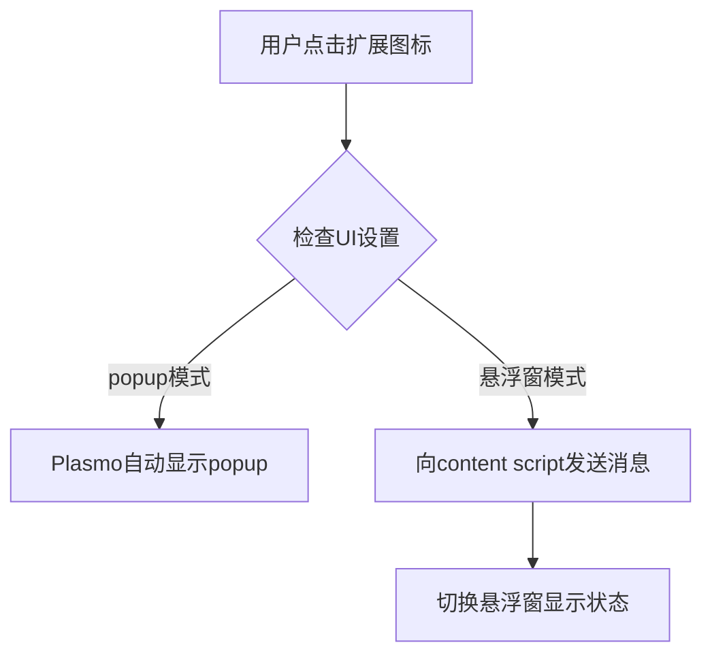
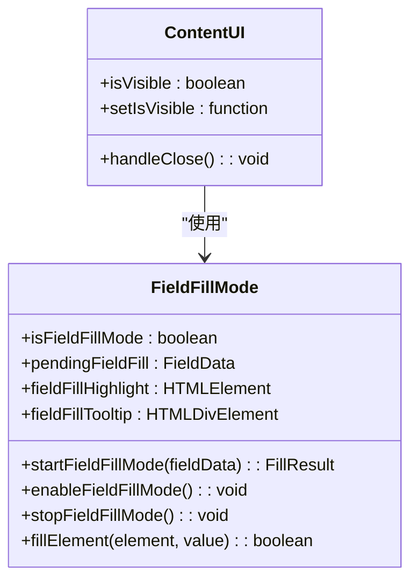
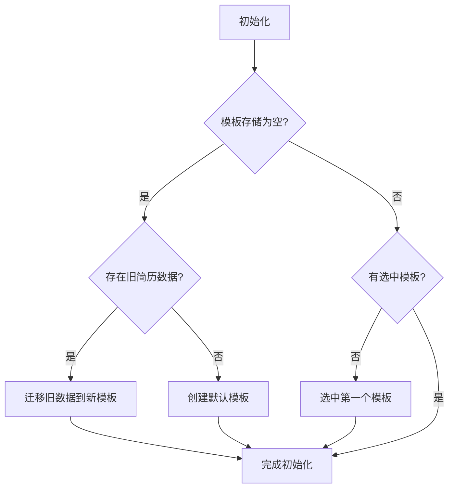
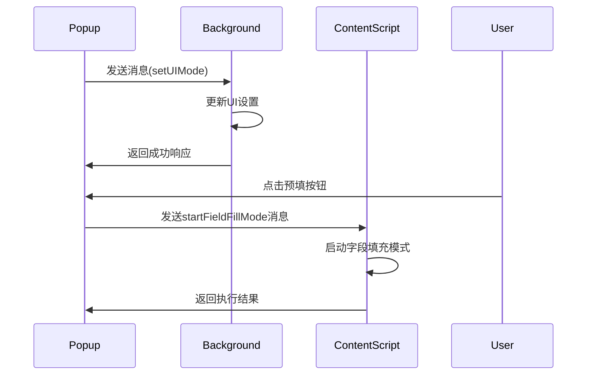
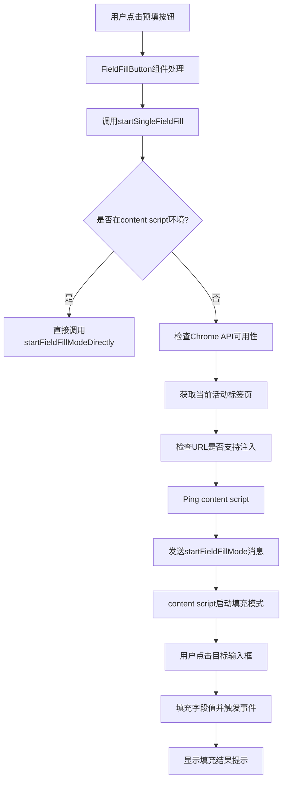
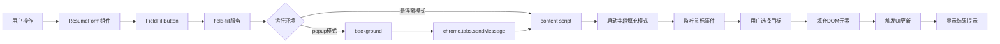
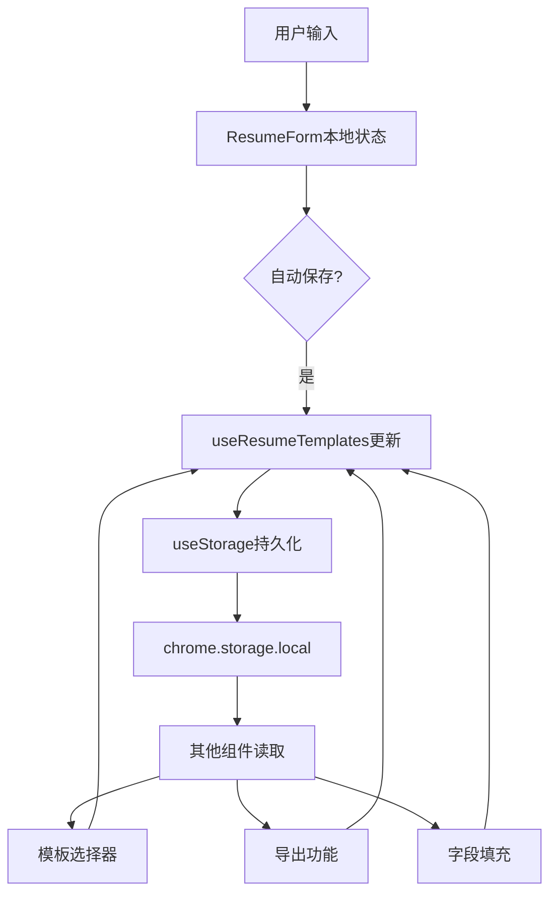

# 技术架构

<cite>
**本文档引用文件**  
- [popup.tsx](file://src/popup.tsx)
- [background.ts](file://src/background.ts)
- [content.tsx](file://src/content.tsx)
- [useStorage.ts](file://src/hooks/useStorage.ts)
- [useResumeTemplates.ts](file://src/hooks/useResumeTemplates.ts)
- [field-fill.ts](file://src/services/field-fill.ts)
- [resume-parse.ts](file://src/services/resume-parse.ts)
- [FloatingPanel.tsx](file://src/components/floating/FloatingPanel.tsx)
- [ResumeForm.tsx](file://src/features/popup/ResumeForm.tsx)
- [field-fill-button.tsx](file://src/components/ui/field-fill-button.tsx)
</cite>

## 目录
1. [三层架构设计](#三层架构设计)
2. [状态管理与数据持久化](#状态管理与数据持久化)
3. [跨上下文通信机制](#跨上下文通信机制)
4. [字段填充流程](#字段填充流程)
5. [数据流图示](#数据流图示)

## 三层架构设计

本Chrome扩展采用典型的三层架构设计，分离UI展示、业务控制和DOM操作逻辑，确保各层职责清晰、解耦良好。

### UI层（Popup）
UI层由`popup.tsx`实现，作为用户主要交互界面。该层基于React构建，使用组件化开发模式，包含简历填写表单、模板管理、设置面板等功能模块。通过Tab组件实现模式切换，支持简历填写和系统设置两种模式。

**Section sources**
- [popup.tsx](file://src/popup.tsx#L124-L297)

### 控制层（Background）
控制层由`background.ts`实现，作为扩展的后台服务工作线程。该层负责处理扩展图标点击事件，并根据用户设置决定启动popup或悬浮窗模式。通过监听`chrome.action.onClicked`事件，实现用户界面模式的动态切换。



**Diagram sources**
- [background.ts](file://src/background.ts#L10-L29)

### 注入层（Content Script）
注入层由`content.tsx`实现，负责将扩展功能注入到目标网页中。该层包含两个核心功能：悬浮窗UI组件和字段填充模式。通过`PlasmoCSConfig`配置匹配所有URL，确保在任意网页均可使用。



**Diagram sources**
- [content.tsx](file://src/content.tsx#L128-L151)
- [content.tsx](file://src/content.tsx#L153-L454)

## 状态管理与数据持久化

### 自定义Hook状态管理
系统通过自定义Hook实现状态管理，主要包含`useStorage`和`useResumeTemplates`两个核心Hook。

#### useStorage Hook
`useStorage.ts`实现的`useStorage` Hook封装了Chrome Storage API，提供React状态管理接口。该Hook支持本地存储和开发环境降级到localStorage，确保开发调试的便利性。

```mermaid
flowchart TD
A[调用useStorage] --> B[从chrome.storage.local加载数据]
B --> C{加载成功?}
C --> |是| D[设置state值]
C --> |否| E[尝试localStorage]
E --> F[设置state值]
D --> G[返回[value, updateValue, isLoading]]
F --> G
G --> H[监听storage变化]
H --> I[自动同步其他实例]
```

**Diagram sources**
- [useStorage.ts](file://src/hooks/useStorage.ts#L7-L87)

#### useResumeTemplates Hook
`useResumeTemplates.ts`实现的`useResumeTemplates` Hook管理简历模板系统，提供模板的CRUD操作。该Hook实现了数据迁移逻辑，可将旧版简历数据迁移到新的模板系统中。



**Diagram sources**
- [useResumeTemplates.ts](file://src/hooks/useResumeTemplates.ts#L17-L80)

### 数据持久化机制
系统使用Chrome Storage API实现数据持久化，通过`STORAGE_KEYS`常量定义存储键名。所有用户数据（简历数据、模板、设置等）均保存在`chrome.storage.local`中，确保跨会话的数据持久性。

**Section sources**
- [useStorage.ts](file://src/hooks/useStorage.ts#L93-L100)
- [types/resume.ts](file://src/types/resume.ts#L164-L182)
- [types/settings.ts](file://src/types/settings.ts#L38-L106)

## 跨上下文通信机制

### Plasmo Messaging机制
系统采用Plasmo框架提供的消息传递机制，实现popup、background和content script之间的通信。不同上下文通过`chrome.runtime.sendMessage`和`chrome.tabs.sendMessage`进行消息传递。



**Diagram sources**
- [background.ts](file://src/background.ts#L31-L57)
- [field-fill.ts](file://src/services/field-fill.ts#L46-L260)

### 通信消息类型
系统定义了多种消息类型，用于不同场景的通信需求：

| 消息类型 | 发送方 | 接收方 | 用途 |
|---------|-------|-------|-----|
| ping | popup | content script | 检测content script是否就绪 |
| toggleFloatingPanel | background | content script | 切换悬浮窗显示状态 |
| startFieldFillMode | popup | content script | 启动字段填充模式 |
| getUIMode | popup | background | 获取当前UI模式 |
| setUIMode | popup | background | 设置UI模式 |

**Section sources**
- [background.ts](file://src/background.ts#L32-L57)
- [content.tsx](file://src/content.tsx#L69-L122)
- [field-fill.ts](file://src/services/field-fill.ts#L46-L260)

## 字段填充流程

### 预填按钮触发流程
当用户点击"预填"按钮时，系统执行以下流程：



**Diagram sources**
- [field-fill-button.tsx](file://src/components/ui/field-fill-button.tsx#L27-L72)
- [field-fill.ts](file://src/services/field-fill.ts#L46-L260)
- [content.tsx](file://src/content.tsx#L107-L119)

### 字段填充核心技术
字段填充功能通过以下技术实现：

1. **跨域检测**：检查目标URL是否为支持的网页类型，避免在chrome://等系统页面执行
2. **事件触发**：填充后触发input、change、blur等事件，确保React等框架能检测到值变化
3. **原生属性设置**：对于React受控组件，通过Object.getOwnPropertyDescriptor设置原生value属性
4. **DOM遍历**：从点击元素向上遍历5层，查找可填充的输入元素

**Section sources**
- [field-fill.ts](file://src/services/field-fill.ts#L94-L106)
- [content.tsx](file://src/content.tsx#L330-L358)
- [content.tsx](file://src/content.tsx#L302-L311)

## 数据流图示

### 用户操作数据流
以下数据流图展示了用户点击"预填"按钮后，数据如何在系统各组件间流动：



**Diagram sources**
- [ResumeForm.tsx](file://src/features/popup/ResumeForm.tsx#L404-L497)
- [field-fill-button.tsx](file://src/components/ui/field-fill-button.tsx#L1-L121)
- [field-fill.ts](file://src/services/field-fill.ts#L46-L260)
- [content.tsx](file://src/content.tsx#L153-L454)

### 简历数据流动
简历数据在系统中的流动路径如下：



**Diagram sources**
- [ResumeForm.tsx](file://src/features/popup/ResumeForm.tsx#L242-L283)
- [useResumeTemplates.ts](file://src/hooks/useResumeTemplates.ts#L171-L192)
- [useStorage.ts](file://src/hooks/useStorage.ts#L62-L85)