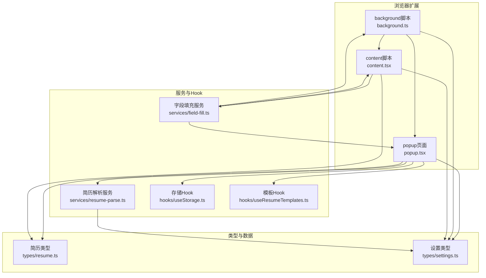
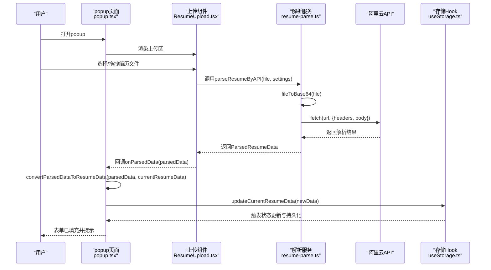
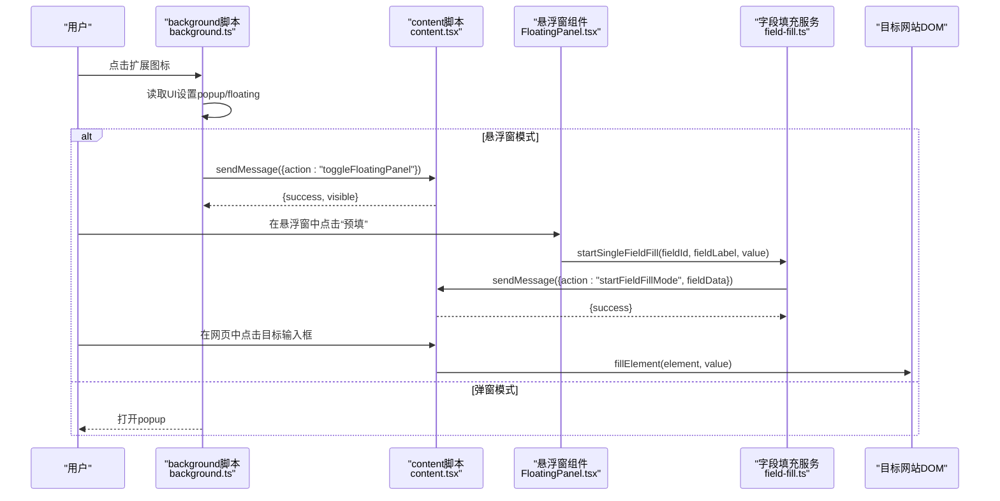
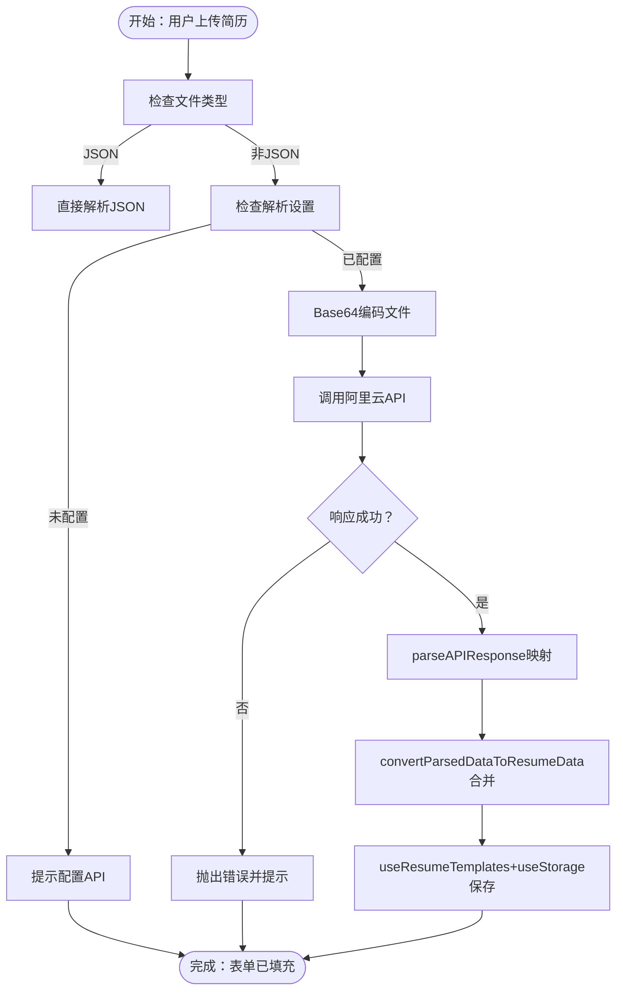
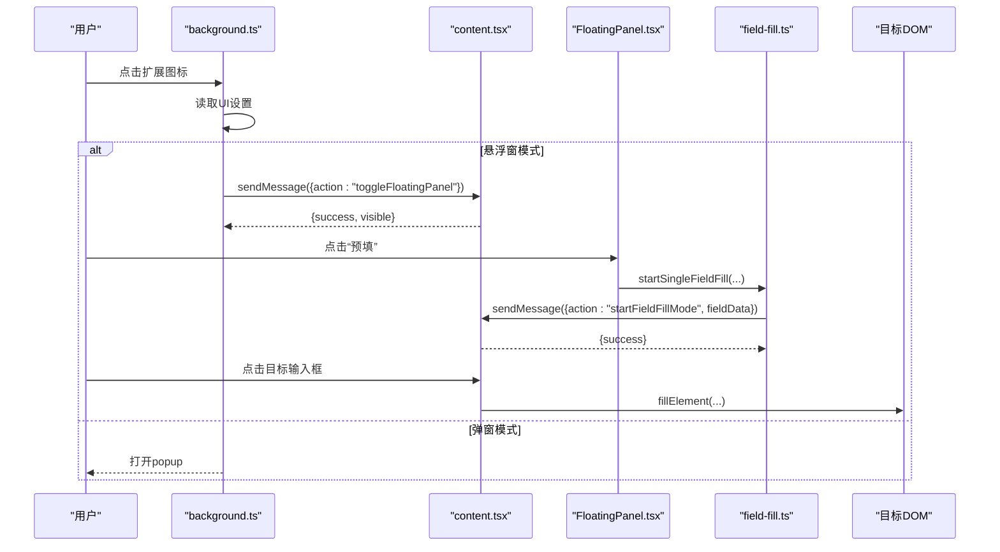
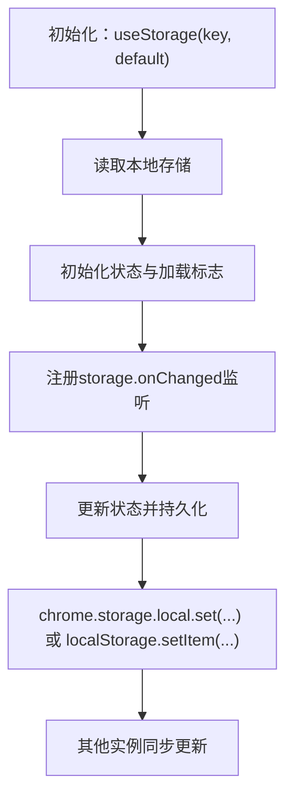
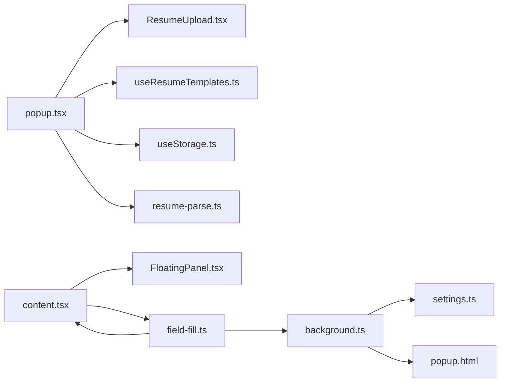

# 数据流

<cite>
**本文引用的文件**
- [src/popup.tsx](file://src/popup.tsx)
- [src/background.ts](file://src/background.ts)
- [src/content.tsx](file://src/content.tsx)
- [src/services/resume-parse.ts](file://src/services/resume-parse.ts)
- [src/services/field-fill.ts](file://src/services/field-fill.ts)
- [src/hooks/useStorage.ts](file://src/hooks/useStorage.ts)
- [src/hooks/useResumeTemplates.ts](file://src/hooks/useResumeTemplates.ts)
- [src/features/popup/ResumeUpload.tsx](file://src/features/popup/ResumeUpload.tsx)
- [src/components/floating/FloatingPanel.tsx](file://src/components/floating/FloatingPanel.tsx)
- [src/types/resume.ts](file://src/types/resume.ts)
- [src/types/settings.ts](file://src/types/settings.ts)
</cite>

## 目录
1. [简介](#简介)
2. [项目结构](#项目结构)
3. [核心组件](#核心组件)
4. [架构总览](#架构总览)
5. [详细组件分析](#详细组件分析)
6. [依赖关系分析](#依赖关系分析)
7. [性能考量](#性能考量)
8. [故障排查指南](#故障排查指南)
9. [结论](#结论)

## 简介
本文件聚焦于两个核心用户操作的数据流：
- AI简历解析流程：用户在popup中上传简历文件 → 触发resume-parse服务调用阿里云API → 解析结果返回popup上下文 → 通过convertParsedDataToResumeData函数与现有简历数据合并 → 更新React状态并自动持久化到Chrome Storage。
- 一键填充流程：用户在目标网站点击扩展图标 → background脚本根据UI模式决定行为 → 若为弹窗模式，直接打开popup；若为悬浮窗模式，则通过chrome.tabs.sendMessage通知content script → content script接收消息并显示FloatingPanel → 用户在悬浮窗中点击“预填” → 消息发送回popup → popup将简历数据打包发送给content script → content script执行fillElement等函数填充DOM元素。

文档明确指出数据在不同执行环境（popup、background、content script）间的序列化与反序列化过程，以及useStorage Hook如何在各层间提供统一的存储访问接口。

## 项目结构
- popup端：负责UI交互、简历上传、解析结果合并、状态更新与持久化。
- background端：负责扩展图标点击事件、UI模式决策、与content script的消息路由。
- content script端：负责悬浮窗显示、字段填充模式、DOM元素填充。
- 服务层：resume-parse负责调用外部API解析简历；field-fill负责跨环境消息与重试策略。
- Hook层：useStorage提供跨环境一致的本地存储访问；useResumeTemplates提供模板与数据迁移。

图表来源
- [src/background.ts](file://src/background.ts#L1-L80)
- [src/content.tsx](file://src/content.tsx#L1-L150)
- [src/popup.tsx](file://src/popup.tsx#L1-L120)
- [src/services/resume-parse.ts](file://src/services/resume-parse.ts#L1-L120)
- [src/services/field-fill.ts](file://src/services/field-fill.ts#L1-L120)
- [src/hooks/useStorage.ts](file://src/hooks/useStorage.ts#L1-L102)
- [src/hooks/useResumeTemplates.ts](file://src/hooks/useResumeTemplates.ts#L1-L120)
- [src/types/resume.ts](file://src/types/resume.ts#L1-L120)
- [src/types/settings.ts](file://src/types/settings.ts#L1-L120)

章节来源
- [src/popup.tsx](file://src/popup.tsx#L1-L120)
- [src/background.ts](file://src/background.ts#L1-L80)
- [src/content.tsx](file://src/content.tsx#L1-L150)
- [src/services/resume-parse.ts](file://src/services/resume-parse.ts#L1-L120)
- [src/services/field-fill.ts](file://src/services/field-fill.ts#L1-L120)
- [src/hooks/useStorage.ts](file://src/hooks/useStorage.ts#L1-L102)
- [src/hooks/useResumeTemplates.ts](file://src/hooks/useResumeTemplates.ts#L1-L120)
- [src/types/resume.ts](file://src/types/resume.ts#L1-L120)
- [src/types/settings.ts](file://src/types/settings.ts#L1-L120)

## 核心组件
- popup.tsx：承载简历表单、上传区、设置页与导出功能；负责将解析结果合并到当前简历数据，并通过useResumeTemplates与useStorage实现状态更新与持久化。
- background.ts：监听扩展图标点击，读取UI设置，控制popup或悬浮窗模式；处理来自content/script的消息查询与设置变更。
- content.tsx：注入悬浮窗UI，监听消息切换悬浮窗显示状态；在悬浮窗模式下直接触发字段填充模式；封装DOM填充逻辑。
- services/resume-parse.ts：将文件转为Base64并调用外部API，解析返回数据为内部结构；提供日期标准化与技能等级映射。
- services/field-fill.ts：在popup中发起字段填充流程，检测content script是否就绪，发送消息并处理重试；在content script中直接触发字段填充模式。
- hooks/useStorage.ts：统一的本地存储访问，支持Chrome Storage与开发环境降级到localStorage；提供双向同步与异步保存。
- hooks/useResumeTemplates.ts：模板系统与旧数据迁移；提供当前模板数据与更新接口。

章节来源
- [src/popup.tsx](file://src/popup.tsx#L120-L300)
- [src/background.ts](file://src/background.ts#L1-L80)
- [src/content.tsx](file://src/content.tsx#L1-L150)
- [src/services/resume-parse.ts](file://src/services/resume-parse.ts#L1-L120)
- [src/services/field-fill.ts](file://src/services/field-fill.ts#L1-L120)
- [src/hooks/useStorage.ts](file://src/hooks/useStorage.ts#L1-L102)
- [src/hooks/useResumeTemplates.ts](file://src/hooks/useResumeTemplates.ts#L1-L120)

## 架构总览
以下时序图展示两个核心流程的数据流与跨环境交互。

### AI简历解析流程（popup → API → popup → 合并 → 持久化）

图表来源
- [src/features/popup/ResumeUpload.tsx](file://src/features/popup/ResumeUpload.tsx#L1-L160)
- [src/services/resume-parse.ts](file://src/services/resume-parse.ts#L1-L120)
- [src/popup.tsx](file://src/popup.tsx#L20-L120)
- [src/hooks/useStorage.ts](file://src/hooks/useStorage.ts#L1-L102)
- [src/hooks/useResumeTemplates.ts](file://src/hooks/useResumeTemplates.ts#L1-L120)

### 一键填充流程（扩展图标 → background → content → 悬浮窗 → 填充）

图表来源
- [src/background.ts](file://src/background.ts#L1-L80)
- [src/content.tsx](file://src/content.tsx#L60-L122)
- [src/components/floating/FloatingPanel.tsx](file://src/components/floating/FloatingPanel.tsx#L1-L120)
- [src/services/field-fill.ts](file://src/services/field-fill.ts#L1-L120)

## 详细组件分析

### 组件A：AI简历解析流程（时序图）
- 关键点
  - 文件上传与格式校验：支持JSON与多种文档格式；JSON直接解析，其他格式走API。
  - API调用：Base64编码、Authorization头、请求体构造与错误处理。
  - 结果转换：parseAPIResponse将API返回结构映射为内部结构；normalizeDateValue与mapSkillLevel保证兼容性。
  - 数据合并：convertParsedDataToResumeData将解析结果与现有数据合并，优先使用解析值。
  - 持久化：通过useResumeTemplates与useStorage自动保存到Chrome Storage。

图表来源
- [src/features/popup/ResumeUpload.tsx](file://src/features/popup/ResumeUpload.tsx#L1-L160)
- [src/services/resume-parse.ts](file://src/services/resume-parse.ts#L1-L120)
- [src/popup.tsx](file://src/popup.tsx#L20-L120)
- [src/hooks/useResumeTemplates.ts](file://src/hooks/useResumeTemplates.ts#L1-L120)
- [src/hooks/useStorage.ts](file://src/hooks/useStorage.ts#L1-L102)

章节来源
- [src/features/popup/ResumeUpload.tsx](file://src/features/popup/ResumeUpload.tsx#L1-L160)
- [src/services/resume-parse.ts](file://src/services/resume-parse.ts#L1-L120)
- [src/popup.tsx](file://src/popup.tsx#L20-L120)
- [src/hooks/useResumeTemplates.ts](file://src/hooks/useResumeTemplates.ts#L1-L120)
- [src/hooks/useStorage.ts](file://src/hooks/useStorage.ts#L1-L102)

### 组件B：一键填充流程（时序图）
- 关键点
  - UI模式判断：background根据UI设置决定打开popup还是悬浮窗。
  - 消息路由：background通过chrome.tabs.sendMessage与content script通信。
  - 悬浮窗显示：content script维护悬浮窗可见状态并通过React组件渲染。
  - 字段填充：field-fill在popup中检测content script就绪后发送消息；在content script中直接触发字段填充模式；最终通过fillElement填充DOM。

图表来源
- [src/background.ts](file://src/background.ts#L1-L80)
- [src/content.tsx](file://src/content.tsx#L60-L122)
- [src/components/floating/FloatingPanel.tsx](file://src/components/floating/FloatingPanel.tsx#L1-L120)
- [src/services/field-fill.ts](file://src/services/field-fill.ts#L1-L120)

章节来源
- [src/background.ts](file://src/background.ts#L1-L80)
- [src/content.tsx](file://src/content.tsx#L60-L122)
- [src/components/floating/FloatingPanel.tsx](file://src/components/floating/FloatingPanel.tsx#L1-L120)
- [src/services/field-fill.ts](file://src/services/field-fill.ts#L1-L120)

### 组件C：数据在执行环境间的序列化与反序列化
- popup ↔ background
  - 消息：toggleFloatingPanel/showFloatingPanel/hideFloatingPanel/startFieldFillMode等；携带简单对象（如{action, mode, fieldData}）。
  - 序列化：Chrome消息API自动序列化；注意避免循环引用与不可序列化对象。
- popup ↔ content script
  - 消息：startFieldFillMode、ping；携带字段数据payload。
  - 序列化：payload为纯数据对象，适合跨环境传输。
- content script ↔ 页面
  - 自定义事件：offerlaolao:startFieldFillMode；在content script中触发，由页面侧监听并处理。
  - DOM填充：fillElement通过原生API设置值并派发事件，确保框架可感知变化。

章节来源
- [src/background.ts](file://src/background.ts#L1-L80)
- [src/content.tsx](file://src/content.tsx#L60-L122)
- [src/services/field-fill.ts](file://src/services/field-fill.ts#L1-L120)

### 组件D：useStorage Hook在各层间的统一存储访问
- 功能
  - 读取：首次从chrome.storage.local或localStorage加载；支持默认值。
  - 监听：监听storage.onChanged，同步其他实例的更新。
  - 写入：异步保存到chrome.storage.local或localStorage，异常捕获。
- 作用
  - popup与floating面板共享同一套键值，实现跨组件状态持久化。
  - 通过STORAGE_KEYS集中管理键名，避免硬编码。

图表来源
- [src/hooks/useStorage.ts](file://src/hooks/useStorage.ts#L1-L102)
- [src/hooks/useResumeTemplates.ts](file://src/hooks/useResumeTemplates.ts#L1-L120)

章节来源
- [src/hooks/useStorage.ts](file://src/hooks/useStorage.ts#L1-L102)
- [src/hooks/useResumeTemplates.ts](file://src/hooks/useResumeTemplates.ts#L1-L120)

## 依赖关系分析
- 组件耦合
  - popup依赖ResumeUpload、useResumeTemplates、useStorage、resume-parse服务。
  - content script依赖FloatingPanel、field-fill服务；与popup通过消息解耦。
  - background依赖UI设置类型与存储键名常量。
- 外部依赖
  - Chrome Extension API：tabs、runtime、storage。
  - 外部API：阿里云简历解析服务。
- 潜在循环依赖
  - 无直接循环；消息通过chrome.runtime.onMessage与chrome.tabs.sendMessage解耦。

图表来源
- [src/popup.tsx](file://src/popup.tsx#L1-L120)
- [src/background.ts](file://src/background.ts#L1-L80)
- [src/content.tsx](file://src/content.tsx#L1-L150)
- [src/services/resume-parse.ts](file://src/services/resume-parse.ts#L1-L120)
- [src/services/field-fill.ts](file://src/services/field-fill.ts#L1-L120)
- [src/hooks/useResumeTemplates.ts](file://src/hooks/useResumeTemplates.ts#L1-L120)
- [src/hooks/useStorage.ts](file://src/hooks/useStorage.ts#L1-L102)
- [src/types/settings.ts](file://src/types/settings.ts#L1-L120)

章节来源
- [src/popup.tsx](file://src/popup.tsx#L1-L120)
- [src/background.ts](file://src/background.ts#L1-L80)
- [src/content.tsx](file://src/content.tsx#L1-L150)
- [src/services/resume-parse.ts](file://src/services/resume-parse.ts#L1-L120)
- [src/services/field-fill.ts](file://src/services/field-fill.ts#L1-L120)
- [src/hooks/useResumeTemplates.ts](file://src/hooks/useResumeTemplates.ts#L1-L120)
- [src/hooks/useStorage.ts](file://src/hooks/useStorage.ts#L1-L102)
- [src/types/settings.ts](file://src/types/settings.ts#L1-L120)

## 性能考量
- 解析API调用
  - Base64编码与网络请求可能耗时，建议在UI中提供进度反馈与错误提示。
  - 对于大文件，考虑分块或后台任务策略（当前实现为前台直连）。
- 消息重试
  - field-fill在发送消息失败时进行有限次重试，避免频繁刷新页面。
- DOM填充
  - fillElement派发input/change/blur事件并处理受控组件场景，减少框架检测不到值的问题。
- 存储访问
  - useStorage采用异步写入与监听同步，避免阻塞主线程。

[本节为通用指导，不直接分析具体文件]

## 故障排查指南
- 解析失败
  - 检查API配置是否完整（URL与AppCode）；查看401错误提示并确认认证有效。
  - 确认文件格式支持列表与文件大小限制。
- 一键填充失败
  - 确认content script已注入且可用（ping检测）；若页面为特殊协议（chrome://、about:），将被拒绝。
  - 若出现“消息端口未建立”类错误，可能是popup快速关闭导致；系统已做兼容处理。
- 悬浮窗不显示
  - 检查UI设置是否为悬浮窗模式；background已根据设置动态调整popup行为。
- 数据未持久化
  - 确认useStorage可用；开发环境下会降级到localStorage。

章节来源
- [src/features/popup/ResumeUpload.tsx](file://src/features/popup/ResumeUpload.tsx#L1-L160)
- [src/services/resume-parse.ts](file://src/services/resume-parse.ts#L1-L120)
- [src/services/field-fill.ts](file://src/services/field-fill.ts#L1-L120)
- [src/background.ts](file://src/background.ts#L1-L80)
- [src/hooks/useStorage.ts](file://src/hooks/useStorage.ts#L1-L102)

## 结论
本文通过时序图与流程图清晰刻画了两个核心流程的数据流路径，明确了popup、background、content script之间的消息传递与数据转换，以及useStorage与useResumeTemplates在多层间的统一存储与模板管理职责。对于解析与填充两大场景，系统提供了完善的错误处理、重试与兼容策略，确保用户体验稳定可靠。