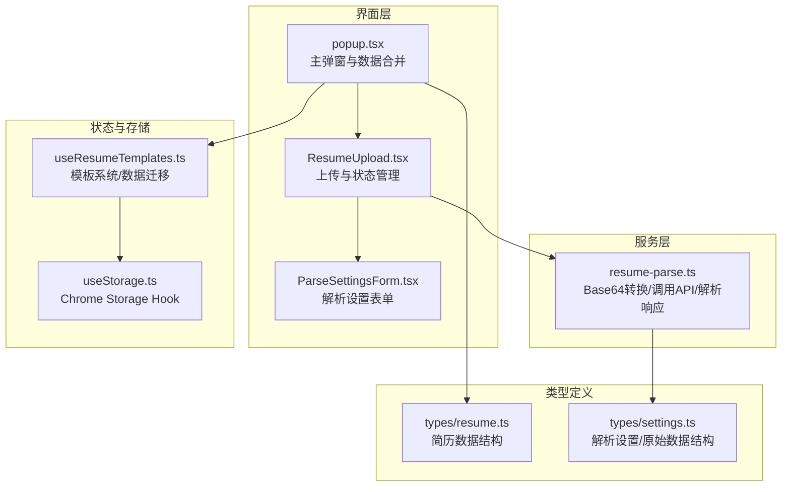
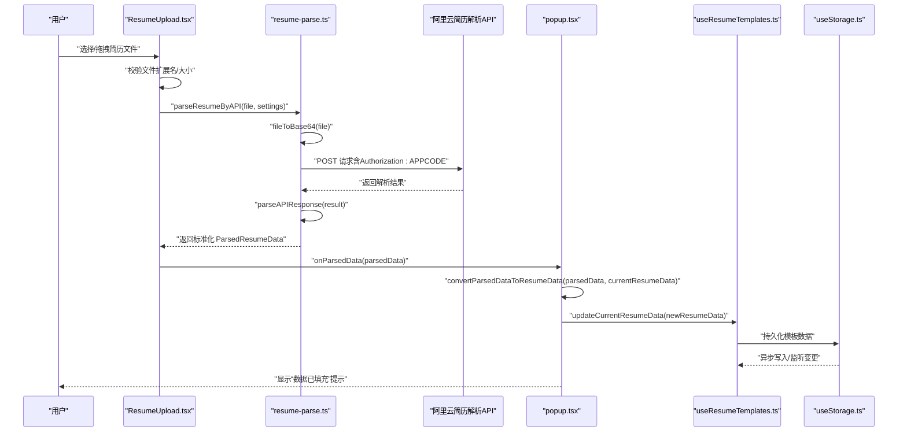
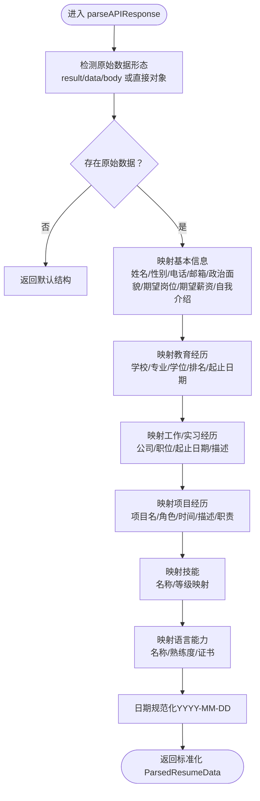
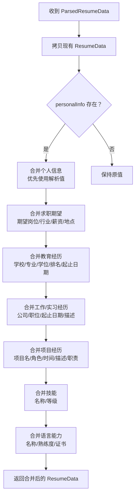
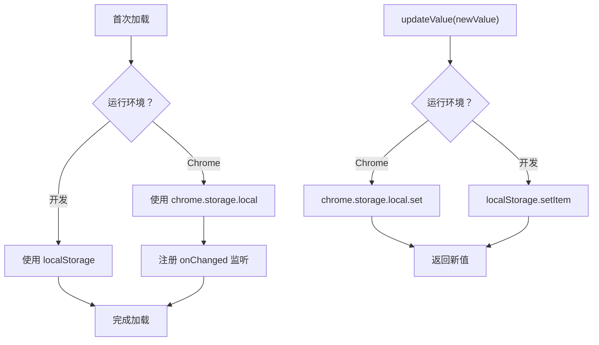
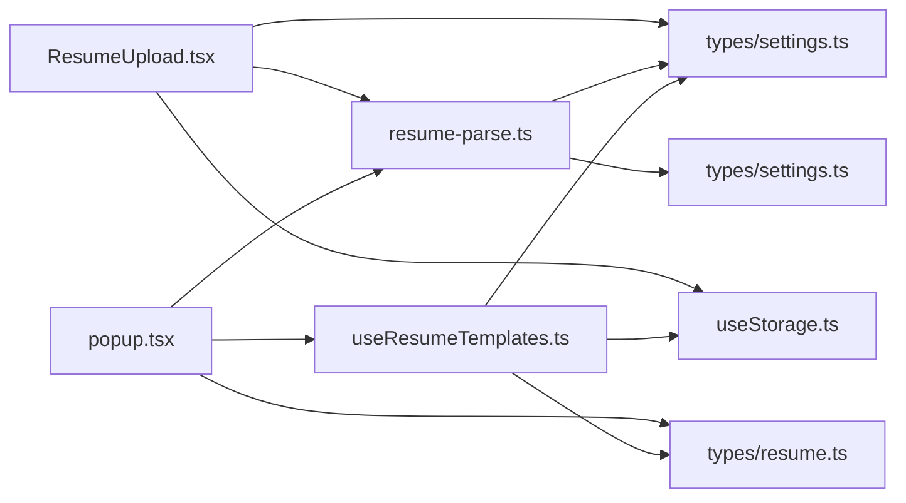

# 简历解析数据流

<cite>
**本文引用的文件**
- [src/features/popup/ResumeUpload.tsx](file://src/features/popup/ResumeUpload.tsx)
- [src/services/resume-parse.ts](file://src/services/resume-parse.ts)
- [src/popup.tsx](file://src/popup.tsx)
- [src/hooks/useStorage.ts](file://src/hooks/useStorage.ts)
- [src/hooks/useResumeTemplates.ts](file://src/hooks/useResumeTemplates.ts)
- [src/types/resume.ts](file://src/types/resume.ts)
- [src/types/settings.ts](file://src/types/settings.ts)
- [src/features/popup/settings/ParseSettingsForm.tsx](file://src/features/popup/settings/ParseSettingsForm.tsx)
</cite>

## 目录
1. [简介](#简介)
2. [项目结构](#项目结构)
3. [核心组件](#核心组件)
4. [架构总览](#架构总览)
5. [详细组件分析](#详细组件分析)
6. [依赖关系分析](#依赖关系分析)
7. [性能考量](#性能考量)
8. [故障排查指南](#故障排查指南)
9. [结论](#结论)

## 简介
本文档围绕“从用户上传简历文件到解析结果合并至应用状态”的完整数据流进行深入说明，覆盖以下关键环节：
- 用户在弹窗界面通过 ResumeUpload 组件触发文件上传；
- 调用 resume-parse.ts 中的 parseResumeByAPI 函数，将文件转换为 Base64 并发送至阿里云简历解析 API；
- 处理 API 响应，通过 parseAPIResponse 函数将原始数据映射为标准化的简历结构；
- 在 popup 上下文中调用 convertParsedDataToResumeData 函数，将解析结果与现有简历数据合并；
- 通过 useStorage Hook 自动将更新后的简历数据持久化到 Chrome Storage；
- 说明错误处理机制（如认证失败、网络异常），以及开发环境下 localStorage 的降级策略。

## 项目结构
本项目采用按功能域划分的组织方式，简历解析相关的关键文件分布如下：
- 界面层：src/features/popup/ResumeUpload.tsx（上传与状态管理）、src/popup.tsx（主弹窗与数据合并）、src/features/popup/settings/ParseSettingsForm.tsx（解析 API 配置）
- 服务层：src/services/resume-parse.ts（文件转 Base64、调用 API、解析响应）
- 状态与存储：src/hooks/useStorage.ts（跨环境存储 Hook）、src/hooks/useResumeTemplates.ts（模板系统与数据迁移）
- 类型定义：src/types/resume.ts（简历数据结构）、src/types/settings.ts（解析设置与原始数据结构）

图表来源
- [src/features/popup/ResumeUpload.tsx](file://src/features/popup/ResumeUpload.tsx#L1-L260)
- [src/services/resume-parse.ts](file://src/services/resume-parse.ts#L1-L342)
- [src/popup.tsx](file://src/popup.tsx#L1-L300)
- [src/hooks/useStorage.ts](file://src/hooks/useStorage.ts#L1-L102)
- [src/hooks/useResumeTemplates.ts](file://src/hooks/useResumeTemplates.ts#L1-L258)
- [src/types/resume.ts](file://src/types/resume.ts#L1-L212)
- [src/types/settings.ts](file://src/types/settings.ts#L1-L192)
- [src/features/popup/settings/ParseSettingsForm.tsx](file://src/features/popup/settings/ParseSettingsForm.tsx#L1-L99)

章节来源
- [src/features/popup/ResumeUpload.tsx](file://src/features/popup/ResumeUpload.tsx#L1-L260)
- [src/services/resume-parse.ts](file://src/services/resume-parse.ts#L1-L342)
- [src/popup.tsx](file://src/popup.tsx#L1-L300)
- [src/hooks/useStorage.ts](file://src/hooks/useStorage.ts#L1-L102)
- [src/hooks/useResumeTemplates.ts](file://src/hooks/useResumeTemplates.ts#L1-L258)
- [src/types/resume.ts](file://src/types/resume.ts#L1-L212)
- [src/types/settings.ts](file://src/types/settings.ts#L1-L192)
- [src/features/popup/settings/ParseSettingsForm.tsx](file://src/features/popup/settings/ParseSettingsForm.tsx#L1-L99)

## 核心组件
- ResumeUpload：负责文件校验、拖拽/点击上传、进度模拟、调用解析 API、错误处理与状态反馈；对外暴露 onParsedData 回调传递解析结果。
- resume-parse.ts：封装文件转 Base64、调用阿里云 API、解析响应为内部标准结构。
- popup.tsx：在收到解析结果后，调用 convertParsedDataToResumeData 合并到当前模板的简历数据，并通过 useResumeTemplates 的 updateCurrentResumeData 触发持久化。
- useStorage.ts：统一的跨环境存储 Hook，生产环境使用 chrome.storage，开发环境降级为 localStorage。
- useResumeTemplates.ts：模板系统与数据迁移，负责将旧版 resumeData 迁移到新版模板结构，并提供当前模板数据的读取与更新。
- 类型定义：types/resume.ts 定义了简历数据结构；types/settings.ts 定义了解析设置与原始数据结构。

章节来源
- [src/features/popup/ResumeUpload.tsx](file://src/features/popup/ResumeUpload.tsx#L1-L260)
- [src/services/resume-parse.ts](file://src/services/resume-parse.ts#L1-L342)
- [src/popup.tsx](file://src/popup.tsx#L1-L300)
- [src/hooks/useStorage.ts](file://src/hooks/useStorage.ts#L1-L102)
- [src/hooks/useResumeTemplates.ts](file://src/hooks/useResumeTemplates.ts#L1-L258)
- [src/types/resume.ts](file://src/types/resume.ts#L1-L212)
- [src/types/settings.ts](file://src/types/settings.ts#L1-L192)

## 架构总览
下面的时序图展示了从用户上传到解析结果合并至应用状态的完整流程，包括数据形态变化与关键错误处理点。

图表来源
- [src/features/popup/ResumeUpload.tsx](file://src/features/popup/ResumeUpload.tsx#L37-L120)
- [src/services/resume-parse.ts](file://src/services/resume-parse.ts#L38-L109)
- [src/popup.tsx](file://src/popup.tsx#L144-L156)
- [src/hooks/useResumeTemplates.ts](file://src/hooks/useResumeTemplates.ts#L170-L192)
- [src/hooks/useStorage.ts](file://src/hooks/useStorage.ts#L61-L88)

## 详细组件分析

### 组件一：用户上传与解析触发（ResumeUpload）
- 功能要点
  - 支持拖拽/点击上传，限制扩展名（JSON、PDF、DOC/DOCX、TXT、HTML）。
  - JSON 文件直接读取文本并解析为对象；非 JSON 文件走 API 解析路径。
  - 调用 parseResumeByAPI 之前会检查解析设置（URL 与 APP Code）。
  - 模拟进度条，解析完成后进入 success 状态并通过 onParsedData 回传数据。
  - 错误处理：格式不支持、设置缺失、API 失败（含 401 认证失败）等。
- 关键实现路径
  - 文件校验与状态切换：[src/features/popup/ResumeUpload.tsx](file://src/features/popup/ResumeUpload.tsx#L37-L120)
  - API 调用入口：[src/features/popup/ResumeUpload.tsx](file://src/features/popup/ResumeUpload.tsx#L64-L80)
  - 错误处理与提示：[src/features/popup/ResumeUpload.tsx](file://src/features/popup/ResumeUpload.tsx#L81-L88)

章节来源
- [src/features/popup/ResumeUpload.tsx](file://src/features/popup/ResumeUpload.tsx#L1-L260)

### 组件二：API 调用与响应解析（resume-parse.ts）
- 功能要点
  - fileToBase64：将 File 对象转换为 Base64（去除 data URL 前缀）。
  - parseResumeByAPI：校验设置、构造请求体（包含文件名、Base64 内容、OCR 类型等），发送 POST 请求，处理 401 等错误并抛出可读错误信息。
  - parseAPIResponse：将 API 返回的多形态原始数据（result/data/body 或直接对象）统一映射为内部标准结构（personalInfo、education、workExperience、projects、skills、languages）。
  - 辅助函数：normalizeDateValue（日期规范化）、mapSkillLevel（技能等级映射）。
- 关键实现路径
  - Base64 转换：[src/services/resume-parse.ts](file://src/services/resume-parse.ts#L19-L33)
  - API 调用与错误处理：[src/services/resume-parse.ts](file://src/services/resume-parse.ts#L38-L109)
  - 响应解析与字段映射：[src/services/resume-parse.ts](file://src/services/resume-parse.ts#L137-L295)
  - 日期与技能映射：[src/services/resume-parse.ts](file://src/services/resume-parse.ts#L297-L341)

图表来源
- [src/services/resume-parse.ts](file://src/services/resume-parse.ts#L137-L295)
- [src/services/resume-parse.ts](file://src/services/resume-parse.ts#L297-L341)

章节来源
- [src/services/resume-parse.ts](file://src/services/resume-parse.ts#L1-L342)

### 组件三：解析结果合并至应用状态（popup.tsx + useResumeTemplates.ts）
- 功能要点
  - convertParsedDataToResumeData：将 ParsedResumeData 合并到当前模板的 ResumeData，优先使用解析数据，否则保留已有值；对日期字段进行映射。
  - 通过 useResumeTemplates 的 updateCurrentResumeData 更新当前模板数据，触发模板系统持久化。
  - useResumeTemplates：维护模板列表与当前模板 ID，提供切换、新增、复制、删除、重命名等操作；内置旧版数据迁移逻辑。
- 关键实现路径
  - 数据合并逻辑：[src/popup.tsx](file://src/popup.tsx#L22-L122)
  - 更新当前模板数据：[src/popup.tsx](file://src/popup.tsx#L144-L156)
  - 模板系统与持久化：[src/hooks/useResumeTemplates.ts](file://src/hooks/useResumeTemplates.ts#L170-L192)
  - 模板系统初始化与迁移：[src/hooks/useResumeTemplates.ts](file://src/hooks/useResumeTemplates.ts#L35-L81)

图表来源
- [src/popup.tsx](file://src/popup.tsx#L22-L122)
- [src/hooks/useResumeTemplates.ts](file://src/hooks/useResumeTemplates.ts#L170-L192)

章节来源
- [src/popup.tsx](file://src/popup.tsx#L1-L300)
- [src/hooks/useResumeTemplates.ts](file://src/hooks/useResumeTemplates.ts#L1-L258)

### 组件四：跨环境存储与持久化（useStorage.ts）
- 功能要点
  - 生产环境：使用 chrome.storage.local 读取/写入；监听 onChanged 事件以同步其他实例的更新。
  - 开发环境：降级为 localStorage，保证本地开发可用性。
  - 提供泛型支持，自动序列化/反序列化。
- 关键实现路径
  - 初始化加载与降级策略：[src/hooks/useStorage.ts](file://src/hooks/useStorage.ts#L12-L33)
  - 存储变更监听与同步：[src/hooks/useStorage.ts](file://src/hooks/useStorage.ts#L39-L59)
  - 更新存储与异常处理：[src/hooks/useStorage.ts](file://src/hooks/useStorage.ts#L61-L88)

图表来源
- [src/hooks/useStorage.ts](file://src/hooks/useStorage.ts#L12-L33)
- [src/hooks/useStorage.ts](file://src/hooks/useStorage.ts#L39-L59)
- [src/hooks/useStorage.ts](file://src/hooks/useStorage.ts#L61-L88)

章节来源
- [src/hooks/useStorage.ts](file://src/hooks/useStorage.ts#L1-L102)

### 组件五：解析设置配置（ParseSettingsForm）
- 功能要点
  - 提供 API URL 与 APP Code 输入框，实时保存到存储。
  - 作为 ResumeUpload 的前置条件，确保解析 API 可用。
- 关键实现路径
  - 设置表单与存储绑定：[src/features/popup/settings/ParseSettingsForm.tsx](file://src/features/popup/settings/ParseSettingsForm.tsx#L1-L99)
  - 默认设置与类型定义：[src/types/settings.ts](file://src/types/settings.ts#L32-L84)

章节来源
- [src/features/popup/settings/ParseSettingsForm.tsx](file://src/features/popup/settings/ParseSettingsForm.tsx#L1-L99)
- [src/types/settings.ts](file://src/types/settings.ts#L32-L84)

## 依赖关系分析
- ResumeUpload 依赖：
  - 解析服务：parseResumeByAPI、fileToBase64
  - 存储 Hook：useStorage（解析设置）
  - 类型：ParsedResumeData、ParseSettings
- resume-parse.ts 依赖：
  - 类型：ParseSettings、ResumeParseRawData、EducationObj、JobExpObj、ProjectExpObj、SkillObj、LanguageObj
- popup.tsx 依赖：
  - 解析服务：convertParsedDataToResumeData
  - 模板系统：useResumeTemplates（updateCurrentResumeData）
  - 类型：ResumeData、ParsedResumeData
- useResumeTemplates.ts 依赖：
  - 存储 Hook：useStorage（模板与旧版数据）
  - 类型：ResumeData、ResumeTemplate、ResumeTemplatesStorage、defaultResumeData、createDefaultTemplate、generateTemplateId
- useStorage.ts 依赖：
  - 类型：STORAGE_KEYS（键名常量）

图表来源
- [src/features/popup/ResumeUpload.tsx](file://src/features/popup/ResumeUpload.tsx#L1-L260)
- [src/services/resume-parse.ts](file://src/services/resume-parse.ts#L1-L342)
- [src/popup.tsx](file://src/popup.tsx#L1-L300)
- [src/hooks/useStorage.ts](file://src/hooks/useStorage.ts#L1-L102)
- [src/hooks/useResumeTemplates.ts](file://src/hooks/useResumeTemplates.ts#L1-L258)
- [src/types/resume.ts](file://src/types/resume.ts#L1-L212)
- [src/types/settings.ts](file://src/types/settings.ts#L1-L192)

章节来源
- [src/features/popup/ResumeUpload.tsx](file://src/features/popup/ResumeUpload.tsx#L1-L260)
- [src/services/resume-parse.ts](file://src/services/resume-parse.ts#L1-L342)
- [src/popup.tsx](file://src/popup.tsx#L1-L300)
- [src/hooks/useStorage.ts](file://src/hooks/useStorage.ts#L1-L102)
- [src/hooks/useResumeTemplates.ts](file://src/hooks/useResumeTemplates.ts#L1-L258)
- [src/types/resume.ts](file://src/types/resume.ts#L1-L212)
- [src/types/settings.ts](file://src/types/settings.ts#L1-L192)

## 性能考量
- 文件 Base64 转换：大文件会增加内存占用与传输体积，建议控制文件大小或分块处理（当前实现为一次性读取）。
- API 调用：网络延迟为主要瓶颈，建议在 UI 层提供明确的加载状态与超时处理（当前实现包含进度模拟与错误提示）。
- 存储写入：useStorage 的更新为异步写入，避免阻塞主线程；模板系统批量更新当前模板数据，减少多次渲染。
- 日期与技能映射：parseAPIResponse 中的映射逻辑为 O(n) 遍历，复杂度可控。

## 故障排查指南
- 认证失败（401）
  - 现象：API 返回 401，错误信息提示 APP Code 不正确或服务未激活。
  - 排查：确认 ParseSettingsForm 中 APP Code 配置正确；检查阿里云服务状态。
  - 参考实现：[src/services/resume-parse.ts](file://src/services/resume-parse.ts#L92-L102)
- 网络异常
  - 现象：fetch 抛错或响应非 OK，错误信息包含状态码与服务端返回文本。
  - 排查：检查网络连通性、API URL 可达性、防火墙设置。
  - 参考实现：[src/services/resume-parse.ts](file://src/services/resume-parse.ts#L82-L103)
- 文件格式不支持
  - 现象：ResumeUpload 显示错误提示，状态停留在 error。
  - 排查：确认文件扩展名为 .json、.pdf、.doc、.docx、.txt、.html。
  - 参考实现：[src/features/popup/ResumeUpload.tsx](file://src/features/popup/ResumeUpload.tsx#L37-L46)
- 解析设置缺失
  - 现象：ResumeUpload 提示需先配置 API URL 与 APP Code。
  - 排查：在设置页填写并保存解析 API 配置。
  - 参考实现：[src/features/popup/ResumeUpload.tsx](file://src/features/popup/ResumeUpload.tsx#L65-L69)
- 开发环境无法持久化
  - 现象：刷新后数据丢失。
  - 说明：开发环境使用 localStorage 降级，若浏览器禁用 localStorage 或清理缓存会导致数据丢失。
  - 参考实现：[src/hooks/useStorage.ts](file://src/hooks/useStorage.ts#L22-L33)
- 跨标签页/实例不同步
  - 现象：一个实例更新后其他实例未即时看到最新值。
  - 说明：useStorage 注册了 chrome.storage.onChanged 监听，开发环境无该监听，需手动刷新或在生产环境使用 Chrome 扩展。
  - 参考实现：[src/hooks/useStorage.ts](file://src/hooks/useStorage.ts#L39-L59)

章节来源
- [src/services/resume-parse.ts](file://src/services/resume-parse.ts#L82-L109)
- [src/features/popup/ResumeUpload.tsx](file://src/features/popup/ResumeUpload.tsx#L37-L69)
- [src/hooks/useStorage.ts](file://src/hooks/useStorage.ts#L22-L59)

## 结论
本数据流以 ResumeUpload 为入口，通过 resume-parse.ts 完成文件到结构化数据的转换，并由 popup.tsx 与 useResumeTemplates.ts 将解析结果与现有简历数据合并，最终通过 useStorage.ts 实现跨环境持久化。整体流程清晰、错误处理完备，且具备良好的开发环境降级策略。建议在后续迭代中增强网络超时与重试、优化大文件处理与进度反馈，并完善跨实例同步方案（开发环境可通过轮询或消息通信实现）。