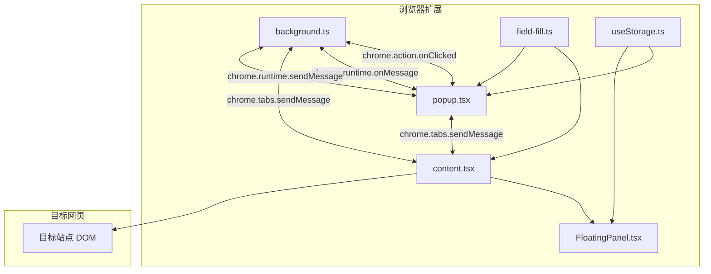
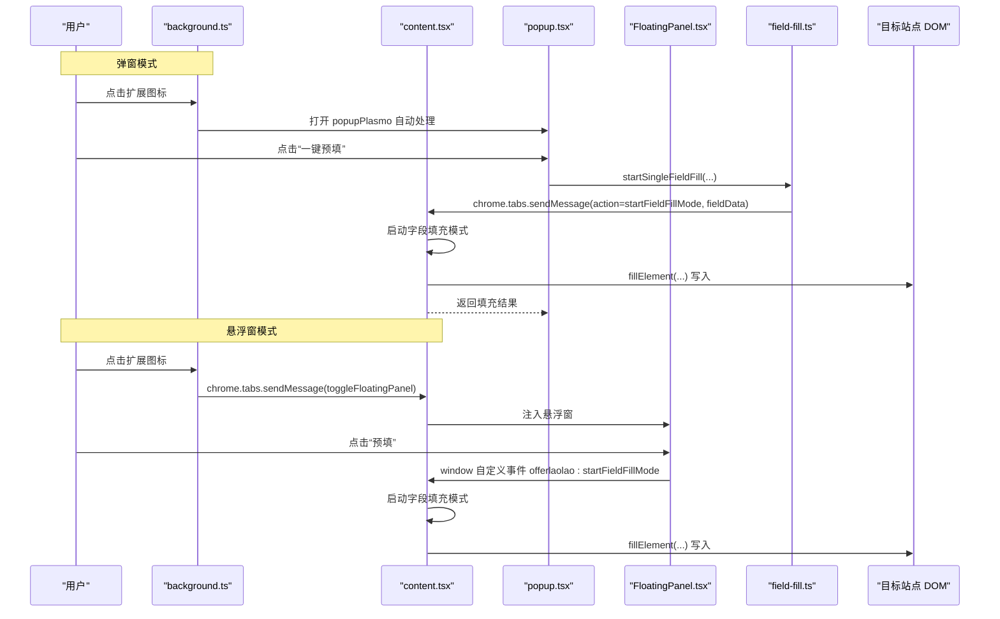
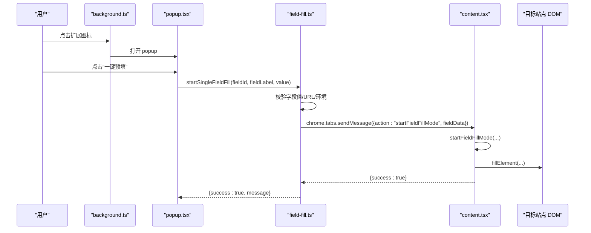
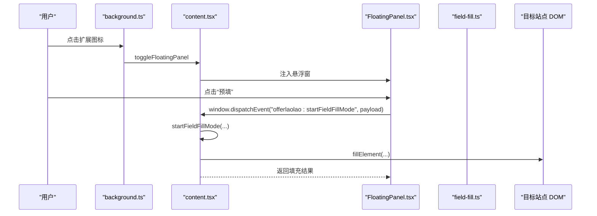
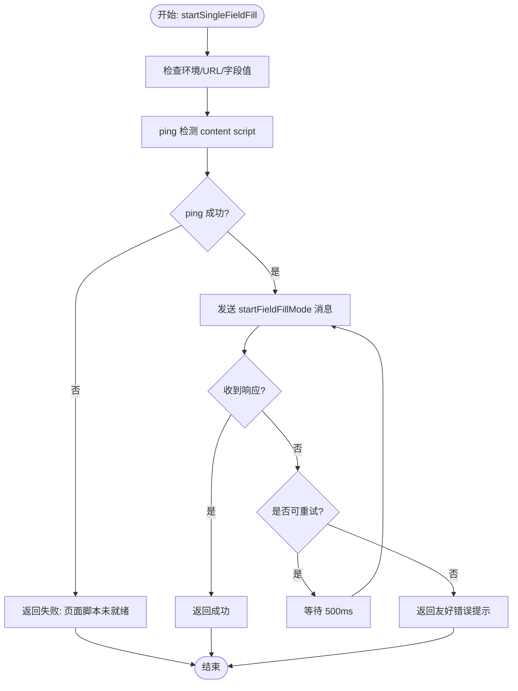
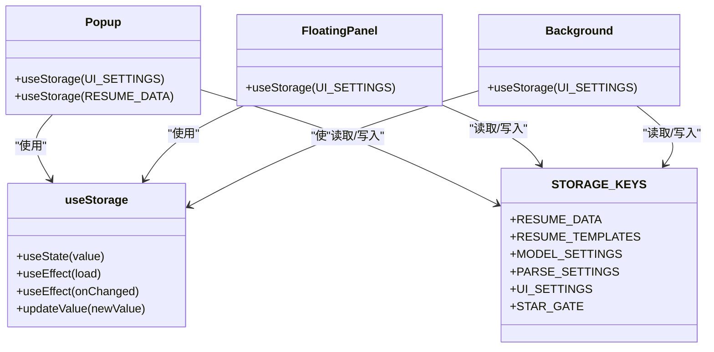
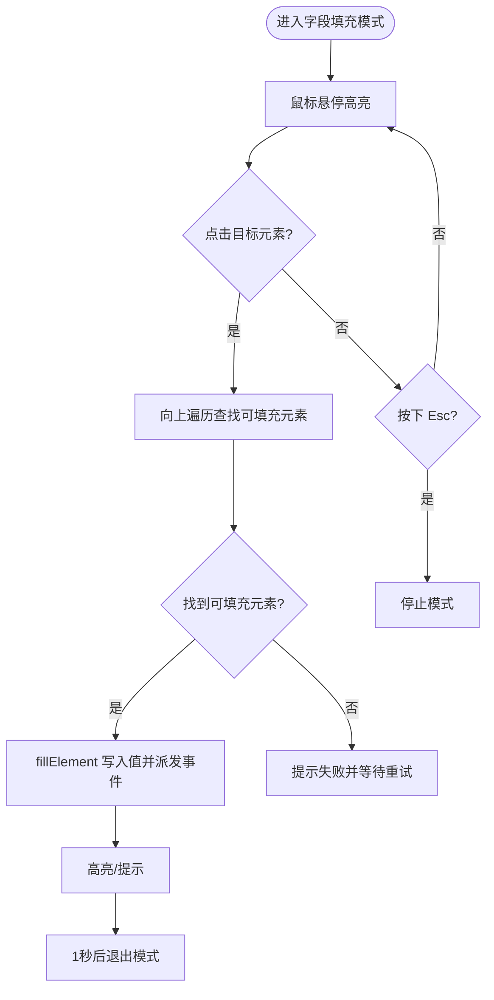
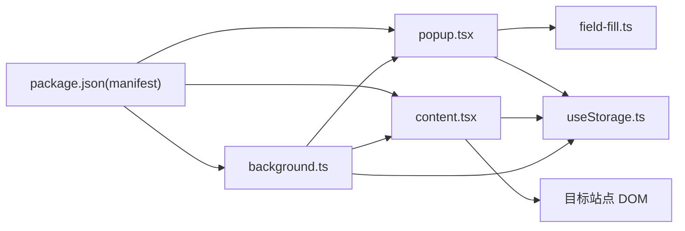

# 表单填充数据流

<cite>
**本文引用的文件**
- [background.ts](file://src/background.ts)
- [content.tsx](file://src/content.tsx)
- [popup.tsx](file://src/popup.tsx)
- [field-fill.ts](file://src/services/field-fill.ts)
- [useStorage.ts](file://src/hooks/useStorage.ts)
- [FloatingPanel.tsx](file://src/components/floating/FloatingPanel.tsx)
- [field-fill-button.tsx](file://src/components/ui/field-fill-button.tsx)
- [field-config.ts](file://src/config/field-config.ts)
- [resume.ts](file://src/types/resume.ts)
- [settings.ts](file://src/types/settings.ts)
- [package.json](file://package.json)
</cite>

## 目录
1. [简介](#简介)
2. [项目结构](#项目结构)
3. [核心组件](#核心组件)
4. [架构总览](#架构总览)
5. [详细组件分析](#详细组件分析)
6. [依赖关系分析](#依赖关系分析)
7. [性能考量](#性能考量)
8. [故障排查指南](#故障排查指南)
9. [结论](#结论)
10. [附录](#附录)

## 简介
本文件面向“Offer 捞捞”Chrome 扩展的表单填充功能，系统性梳理两种 UI 模式下的数据流与交互路径：
- 弹窗模式：用户点击扩展图标后，background 脚本根据设置决定直接打开 popup；用户在 popup 中点击“一键预填”，popup 通过 chrome.tabs.sendMessage 将简历字段数据发送给 content script，content script 调用 fillElement 等函数填充目标网站 DOM 元素。
- 悬浮窗模式：background 脚本通知 content script 注入 FloatingPanel；用户在悬浮窗中点击“预填”，消息经由 content script 的 window 自定义事件或 runtime 消息通道回传 popup，popup 再将简历数据打包回传 content script 完成填充。

文档重点覆盖：
- 消息传递格式（FieldFillPayload 结构）
- 序列化与跨执行环境通信机制（chrome.runtime.sendMessage/chrome.tabs.sendMessage）
- field-fill.ts 中的重试逻辑与错误处理策略
- useStorage 在各层间提供统一存储访问的实现原理

## 项目结构
该扩展采用 Chrome Extension 的典型三层结构：
- background service worker：负责图标点击、UI 模式切换、popup 行为控制
- content script：注入到目标页面，负责悬浮窗渲染、字段填充模式、DOM 操作
- popup：扩展弹出面板，提供简历编辑与一键预填入口

图表来源
- [background.ts](file://src/background.ts#L1-L78)
- [content.tsx](file://src/content.tsx#L1-L150)
- [FloatingPanel.tsx](file://src/components/floating/FloatingPanel.tsx#L1-L120)
- [popup.tsx](file://src/popup.tsx#L1-L120)
- [field-fill.ts](file://src/services/field-fill.ts#L1-L120)
- [useStorage.ts](file://src/hooks/useStorage.ts#L1-L102)

章节来源
- [background.ts](file://src/background.ts#L1-L78)
- [content.tsx](file://src/content.tsx#L1-L150)
- [popup.tsx](file://src/popup.tsx#L1-L120)
- [field-fill.ts](file://src/services/field-fill.ts#L1-L120)
- [useStorage.ts](file://src/hooks/useStorage.ts#L1-L102)

## 核心组件
- background.ts：处理扩展图标点击事件，读取 UI 设置，控制 popup 行为；监听来自 content/script 的消息，提供 UI 模式查询与切换。
- content.tsx：作为 content script，负责：
  - 接收 background 的悬浮窗显示/隐藏消息
  - 监听窗口自定义事件（悬浮窗模式下直接调用）
  - 启动字段填充模式、查找可填充元素、填充 DOM、高亮反馈
- popup.tsx：扩展弹出面板，提供简历编辑、模板管理、导出、设置等功能；通过 field-fill.ts 发起填充请求。
- field-fill.ts：封装字段填充流程，包含 payload 结构、环境判断、ping 检测、重试与错误处理、消息发送。
- FloatingPanel.tsx：悬浮窗 UI，内嵌 popup 的核心功能，支持拖拽、最小化、位置持久化。
- useStorage.ts：统一的 Chrome Storage Hook，提供本地存储读写与变更监听，贯穿 popup 与悬浮窗。
- field-fill-button.tsx：表单字段旁的“预填”按钮，调用 field-fill.ts 发起单字段填充。
- field-config.ts 与 resume.ts：字段配置与数据模型，支撑表单渲染与字段 ID/标签映射。
- settings.ts：UI 模式类型与默认设置，驱动 background 的行为。

章节来源
- [background.ts](file://src/background.ts#L1-L78)
- [content.tsx](file://src/content.tsx#L1-L150)
- [popup.tsx](file://src/popup.tsx#L1-L120)
- [field-fill.ts](file://src/services/field-fill.ts#L1-L120)
- [FloatingPanel.tsx](file://src/components/floating/FloatingPanel.tsx#L1-L120)
- [useStorage.ts](file://src/hooks/useStorage.ts#L1-L102)
- [field-fill-button.tsx](file://src/components/ui/field-fill-button.tsx#L1-L121)
- [field-config.ts](file://src/config/field-config.ts#L1-L120)
- [resume.ts](file://src/types/resume.ts#L1-L120)
- [settings.ts](file://src/types/settings.ts#L80-L120)

## 架构总览
两种 UI 模式的共同点是：最终都会通过 content script 的字段填充模式完成 DOM 写入。差异在于“消息来源”和“悬浮窗注入”。

图表来源
- [background.ts](file://src/background.ts#L1-L78)
- [content.tsx](file://src/content.tsx#L1-L150)
- [popup.tsx](file://src/popup.tsx#L1-L120)
- [FloatingPanel.tsx](file://src/components/floating/FloatingPanel.tsx#L1-L120)
- [field-fill.ts](file://src/services/field-fill.ts#L1-L120)

## 详细组件分析

### 弹窗模式数据流
- 用户点击扩展图标：background 读取 UI 设置，若为 popup，则由 Plasmo 自动显示 popup。
- 用户在 popup 中点击“一键预填”：popup 通过 field-fill.ts 发起 startSingleFieldFill，内部：
  - 校验字段值非空
  - 查询当前活动标签页并校验 URL
  - ping 检测 content script 是否已加载
  - 通过 chrome.tabs.sendMessage 发送 action=startFieldFillMode，携带 FieldFillPayload
- content script 收到消息后：
  - 校验参数合法性
  - 启动字段填充模式（注册事件监听、显示提示）
  - 用户点击目标输入框后，调用 fillElement 写入值并高亮反馈
- 返回结果：popup 保持打开以便连续填充多个字段

图表来源
- [background.ts](file://src/background.ts#L1-L78)
- [popup.tsx](file://src/popup.tsx#L1-L120)
- [field-fill.ts](file://src/services/field-fill.ts#L1-L120)
- [content.tsx](file://src/content.tsx#L150-L380)

章节来源
- [background.ts](file://src/background.ts#L1-L78)
- [popup.tsx](file://src/popup.tsx#L1-L120)
- [field-fill.ts](file://src/services/field-fill.ts#L1-L120)
- [content.tsx](file://src/content.tsx#L150-L380)

### 悬浮窗模式数据流
- 用户点击扩展图标：background 通知 content script 切换悬浮窗显示状态。
- content script 注入 FloatingPanel，用户在悬浮窗中点击“预填”：
  - 若在 content script 环境（悬浮窗模式），直接触发 window 自定义事件 offerlaolao:startFieldFillMode
  - 若在 popup 环境，通过 chrome.tabs.sendMessage 发送相同 action
- content script 启动字段填充模式并等待用户点击目标输入框，随后 fillElement 写入并反馈

图表来源
- [background.ts](file://src/background.ts#L1-L78)
- [content.tsx](file://src/content.tsx#L1-L150)
- [FloatingPanel.tsx](file://src/components/floating/FloatingPanel.tsx#L1-L120)
- [field-fill.ts](file://src/services/field-fill.ts#L1-L120)

章节来源
- [background.ts](file://src/background.ts#L1-L78)
- [content.tsx](file://src/content.tsx#L1-L150)
- [FloatingPanel.tsx](file://src/components/floating/FloatingPanel.tsx#L1-L120)
- [field-fill.ts](file://src/services/field-fill.ts#L1-L120)

### 消息传递格式与序列化
- FieldFillPayload 结构
  - 字段：fieldId、fieldLabel、value
  - 用途：承载单字段的标识与值，用于 content script 的字段填充模式
- 序列化与传输
  - popup 侧通过 chrome.tabs.sendMessage 发送 payload
  - content script 侧通过 window 自定义事件或 chrome.runtime.onMessage 接收
  - 由于使用 Plain Object，无需额外序列化；Chrome Runtime 会进行必要序列化/反序列化
- 跨执行环境通信
  - background 与 content script：chrome.runtime.onMessage/chrome.tabs.sendMessage
  - popup 与 content script：chrome.tabs.sendMessage
  - 悬浮窗与 content script：window 自定义事件（同源）

章节来源
- [field-fill.ts](file://src/services/field-fill.ts#L1-L120)
- [content.tsx](file://src/content.tsx#L1-L150)
- [field-fill-button.tsx](file://src/components/ui/field-fill-button.tsx#L1-L121)

### 重试逻辑与错误处理（field-fill.ts）
- 环境检测：区分 content script 环境与 popup 环境，避免在不支持的环境中发起填充
- URL 白名单：排除 chrome://、chrome-extension://、edge://、about:、moz-extension:// 等页面
- ping 检测：通过 chrome.tabs.sendMessage 发送 action=ping，确认 content script 已注入
- 重试策略：
  - 最多重试 2 次，间隔 500ms
  - 识别常见错误关键字（如“无法建立连接”、“接收端不存在”、“消息端口关闭”），对特定情况做“视为成功”的宽容处理
- 友好提示：针对不同错误场景返回明确的消息，指导用户刷新页面或检查脚本加载状态

图表来源
- [field-fill.ts](file://src/services/field-fill.ts#L120-L260)

章节来源
- [field-fill.ts](file://src/services/field-fill.ts#L120-L260)

### useStorage 统一存储访问
- 设计目标：在 popup 与悬浮窗之间共享同一套本地存储，提供读取、写入与变更监听
- 实现要点：
  - 读取：优先使用 chrome.storage.local.get；开发环境降级到 localStorage
  - 写入：优先使用 chrome.storage.local.set；开发环境降级到 localStorage
  - 同步：监听 chrome.storage.onChanged，将其他实例的更新同步到当前实例
  - 键名：通过 STORAGE_KEYS 统一管理，避免硬编码
- 使用场景：
  - UI 模式（UI_SETTINGS）：background 读取/写入，popup 与悬浮窗读取
  - 简历数据（RESUME_DATA/RESUME_TEMPLATES）：popup 与悬浮窗共享同一份数据
  - 悬浮窗位置与最小化状态：FloatingPanel 读取/更新 UI_SETTINGS

图表来源
- [useStorage.ts](file://src/hooks/useStorage.ts#L1-L102)
- [settings.ts](file://src/types/settings.ts#L80-L120)
- [background.ts](file://src/background.ts#L1-L78)
- [FloatingPanel.tsx](file://src/components/floating/FloatingPanel.tsx#L120-L200)
- [popup.tsx](file://src/popup.tsx#L1-L120)

章节来源
- [useStorage.ts](file://src/hooks/useStorage.ts#L1-L102)
- [settings.ts](file://src/types/settings.ts#L80-L120)
- [background.ts](file://src/background.ts#L1-L78)
- [FloatingPanel.tsx](file://src/components/floating/FloatingPanel.tsx#L120-L200)
- [popup.tsx](file://src/popup.tsx#L1-L120)

### 字段填充模式与 DOM 写入
- 启动流程：content script 接收 payload 后，进入字段填充模式，注册鼠标/键盘事件，显示提示
- 目标定位：向上遍历最多 5 层，匹配 input/textarea/select/contenteditable 等可填充元素
- 写入策略：根据元素类型设置值并派发 input/change/blur 等事件；对受控组件补充原生 setter
- 反馈机制：成功/失败分别高亮与提示，稍后自动退出模式

图表来源
- [content.tsx](file://src/content.tsx#L150-L380)

章节来源
- [content.tsx](file://src/content.tsx#L150-L380)

## 依赖关系分析
- manifest 权限与资源
  - permissions：storage、activeTab、scripting
  - host_permissions：允许访问 https://*/*、http://*/*
  - web_accessible_resources：使扩展资源在目标页面可用
- 组件耦合
  - popup 与 field-fill.ts：通过按钮组件调用，形成高层耦合
  - content.tsx 与 FloatingPanel：通过注入与事件通信，低耦合
  - background 与 UI 设置：通过 useStorage 与 settings 类型解耦
- 外部依赖
  - Chrome Runtime API：chrome.runtime、chrome.tabs、chrome.storage
  - Plasmo：content script 注入与 popup 生命周期管理

图表来源
- [package.json](file://package.json#L41-L65)
- [background.ts](file://src/background.ts#L1-L78)
- [popup.tsx](file://src/popup.tsx#L1-L120)
- [content.tsx](file://src/content.tsx#L1-L150)
- [field-fill.ts](file://src/services/field-fill.ts#L1-L120)
- [useStorage.ts](file://src/hooks/useStorage.ts#L1-L102)

章节来源
- [package.json](file://package.json#L41-L65)
- [background.ts](file://src/background.ts#L1-L78)
- [popup.tsx](file://src/popup.tsx#L1-L120)
- [content.tsx](file://src/content.tsx#L1-L150)
- [field-fill.ts](file://src/services/field-fill.ts#L1-L120)
- [useStorage.ts](file://src/hooks/useStorage.ts#L1-L102)

## 性能考量
- 消息往返与重试：重试次数与延迟为固定值，避免过度轮询；建议在 popup 关闭时减少不必要的重试
- DOM 写入：fillElement 仅在命中可填充元素时执行，且只派发必要事件，降低对复杂框架的干扰
- 悬浮窗注入：通过 window 自定义事件在 content script 内部直接调用，避免额外消息往返
- 存储访问：useStorage 采用批量读取与变更监听，减少频繁 IO

## 故障排查指南
- “页面脚本未就绪，请刷新当前网页后重试”
  - 可能原因：content script 未注入或尚未加载
  - 处理建议：刷新页面，确保目标站点允许扩展注入
- “无法连接到页面，请刷新页面后重试”
  - 可能原因：标签页不可用或通信端口异常
  - 处理建议：切换到正常页面，重新点击“预填”
- “当前页面不支持此功能，请在普通网页上使用”
  - 可能原因：在 chrome://、about: 等受限页面
  - 处理建议：在目标招聘网站打开页面后再试
- “请先在弹窗中填写该字段”
  - 可能原因：字段值为空
  - 处理建议：先在 popup/悬浮窗中填写对应字段

章节来源
- [field-fill.ts](file://src/services/field-fill.ts#L120-L260)
- [content.tsx](file://src/content.tsx#L1-L150)

## 结论
本扩展通过清晰的三层架构与统一的存储抽象，实现了弹窗与悬浮窗两种 UI 模式下的稳定表单填充。消息传递采用标准的 Chrome Runtime API，配合 ping 检测与有限重试，兼顾可靠性与用户体验。字段填充模式在 content script 内部完成，既保证了安全边界，又提供了灵活的 DOM 写入能力。useStorage 为 popup 与悬浮窗提供了统一的数据访问层，确保状态一致与实时同步。

## 附录
- 关键类型与键名
  - FieldFillPayload：fieldId、fieldLabel、value
  - STORAGE_KEYS：RESUME_DATA、RESUME_TEMPLATES、MODEL_SETTINGS、PARSE_SETTINGS、UI_SETTINGS、STAR_GATE
  - UISettings：mode、floatingPosition、floatingMinimized
- 常见问题定位清单
  - 检查 manifest 权限与 web_accessible_resources
  - 确认目标页面允许扩展注入
  - 刷新页面后重试
  - 在普通网页而非受限页面使用