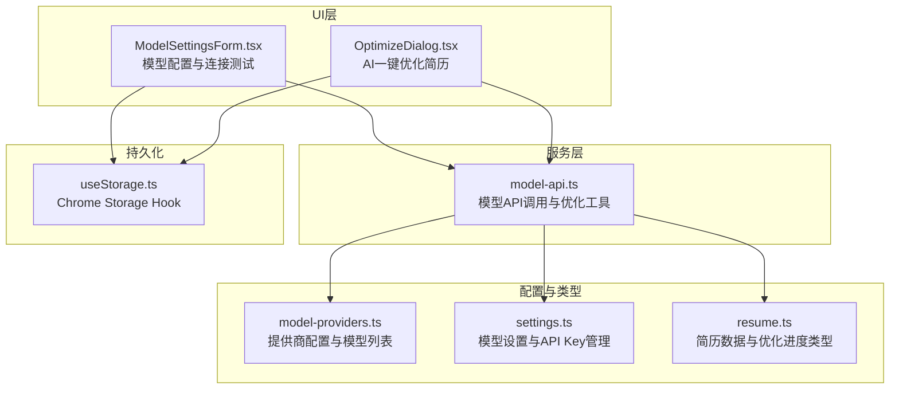
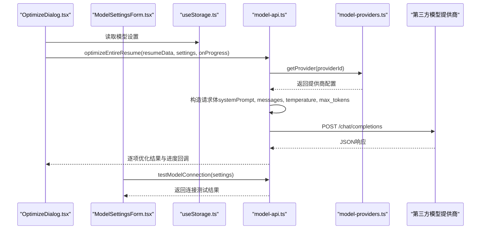
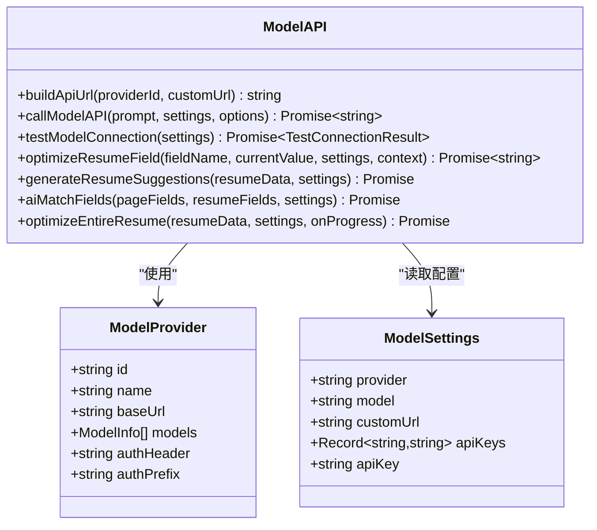
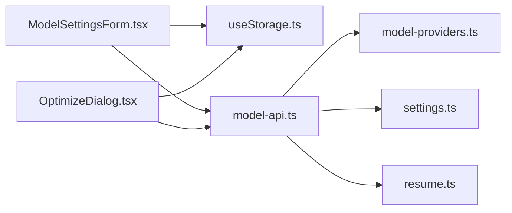

# AI模型API服务

<cite>
**本文引用的文件**
- [model-api.ts](file://src/services/model-api.ts)
- [model-providers.ts](file://src/config/model-providers.ts)
- [OptimizeDialog.tsx](file://src/features/popup/OptimizeDialog.tsx)
- [ModelSettingsForm.tsx](file://src/features/popup/settings/ModelSettingsForm.tsx)
- [settings.ts](file://src/types/settings.ts)
- [resume.ts](file://src/types/resume.ts)
- [useStorage.ts](file://src/hooks/useStorage.ts)
- [package.json](file://package.json)
</cite>

## 目录
1. [简介](#简介)
2. [项目结构](#项目结构)
3. [核心组件](#核心组件)
4. [架构总览](#架构总览)
5. [详细组件分析](#详细组件分析)
6. [依赖关系分析](#依赖关系分析)
7. [性能考量](#性能考量)
8. [故障排查指南](#故障排查指南)
9. [结论](#结论)
10. [附录：扩展新提供商指南](#附录扩展新提供商指南)

## 简介
本文件面向“AI模型API服务”的全面技术文档，聚焦于model-api服务如何抽象化对多家大语言模型（如DeepSeek、通义千问、Kimi、火山引擎、智谱AI、百川智能等）的统一调用接口。文档重点覆盖：
- createModelClient工厂函数的实现思路与适配器加载机制（通过配置驱动）
- 请求封装、认证机制（API Key管理）、错误处理与重试策略现状
- 流式响应处理现状与建议
- 与OptimizeDialog组件的AI优化联动流程
- 与ModelSettingsForm的联动与连接测试实现路径
- 性能考量（请求节流、响应缓存设计建议）
- 安全性建议（防止API Key泄露）
- 扩展指南：如何新增AI模型提供商

## 项目结构
本项目采用按功能域划分的目录结构，AI模型API服务位于src/services/model-api.ts，配置与类型定义分别位于src/config/model-providers.ts与src/types/settings.ts；UI层的设置表单与优化对话框分别位于src/features/popup/settings/ModelSettingsForm.tsx与src/features/popup/OptimizeDialog.tsx；数据持久化使用src/hooks/useStorage.ts。

图表来源
- [model-api.ts](file://src/services/model-api.ts#L1-L120)
- [model-providers.ts](file://src/config/model-providers.ts#L1-L123)
- [ModelSettingsForm.tsx](file://src/features/popup/settings/ModelSettingsForm.tsx#L1-L120)
- [OptimizeDialog.tsx](file://src/features/popup/OptimizeDialog.tsx#L1-L120)
- [settings.ts](file://src/types/settings.ts#L1-L120)
- [resume.ts](file://src/types/resume.ts#L136-L163)
- [useStorage.ts](file://src/hooks/useStorage.ts#L1-L88)

章节来源
- [model-api.ts](file://src/services/model-api.ts#L1-L120)
- [model-providers.ts](file://src/config/model-providers.ts#L1-L123)
- [ModelSettingsForm.tsx](file://src/features/popup/settings/ModelSettingsForm.tsx#L1-L120)
- [OptimizeDialog.tsx](file://src/features/popup/OptimizeDialog.tsx#L1-L120)
- [settings.ts](file://src/types/settings.ts#L1-L120)
- [resume.ts](file://src/types/resume.ts#L136-L163)
- [useStorage.ts](file://src/hooks/useStorage.ts#L1-L88)

## 核心组件
- 模型API调用与优化工具：封装统一请求、响应解析、连接测试、批量优化等能力
- 模型提供商配置：集中管理各提供商的baseUrl、认证头、前缀、模型列表
- API Key管理：支持多提供商独立存储，兼容旧版单一apiKey字段
- UI联动：ModelSettingsForm负责配置与连接测试；OptimizeDialog负责触发批量优化并展示进度

章节来源
- [model-api.ts](file://src/services/model-api.ts#L1-L120)
- [model-providers.ts](file://src/config/model-providers.ts#L1-L123)
- [settings.ts](file://src/types/settings.ts#L46-L77)

## 架构总览
下图展示了从UI到服务再到提供商的端到端调用链路，以及配置驱动的适配器加载机制。

图表来源
- [OptimizeDialog.tsx](file://src/features/popup/OptimizeDialog.tsx#L94-L141)
- [ModelSettingsForm.tsx](file://src/features/popup/settings/ModelSettingsForm.tsx#L74-L90)
- [model-api.ts](file://src/services/model-api.ts#L38-L139)
- [model-providers.ts](file://src/config/model-providers.ts#L97-L123)

## 详细组件分析

### 组件A：模型API调用与优化工具（model-api.ts）
- 功能概览
  - 构建API请求URL：支持内置提供商与自定义URL（OpenAI兼容）
  - 统一调用：封装fetch请求，设置认证头，构造messages与参数
  - 响应解析：兼容choices/message.content、output.text、result等多种格式
  - 连接测试：最小化请求验证可用性
  - AI优化：提供简历字段优化、建议生成、字段匹配、整份简历一键优化等能力
  - 批量优化：带进度回调，内置节流延迟，避免过快请求

- 关键实现要点
  - URL构建：当providerId为custom时，自动拼接/chat/completions结尾；否则使用MODEL_PROVIDERS配置
  - 认证：通过provider.authHeader与provider.authPrefix拼接Authorization头
  - 请求体：systemPrompt、messages、temperature、max_tokens、stream=false
  - 错误处理：401、429、400等状态码映射为明确提示；其余异常统一抛错
  - 响应解析：优先choices[0].message.content，其次兼容output.text与result
  - 连接测试：最小化参数调用callModelAPI，返回success/message/response
  - 一键优化：遍历简历内容，逐项调用优化函数，onProgress回调推进UI进度；每轮完成后延迟500ms

- 与OptimizeDialog联动
  - OptimizeDialog在确认配置与内容后，调用optimizeEntireResume，并将进度回调传入
  - 优化完成后，将返回的优化数据回传给父组件，用于更新UI

- 与ModelSettingsForm联动
  - ModelSettingsForm负责选择提供商、模型、输入API Key，并提供连接测试入口
  - 测试通过后，OptimizeDialog方可开始批量优化

- 与配置/类型的关系
  - 通过getProvider(providerId)从model-providers.ts读取baseUrl、authHeader、authPrefix、models
  - API Key通过settings.ts中的getApiKeyForProvider/setApiKeyForProvider进行多提供商独立存储

- 与存储的关系
  - UI层通过useStorage.ts持久化模型设置，model-api.ts不直接操作存储，仅消费settings

- 流式响应处理现状与建议
  - 现状：请求体中stream=false，服务端返回完整JSON后解析
  - 建议：若需实时流式输出，可在请求体中启用stream=true，并在fetch后使用ReadableStream逐块解析，再通过onProgress回调增量渲染

- 错误重试策略现状与建议
  - 现状：未实现自动重试；对429等限流场景给出明确提示
  - 建议：对429、网络瞬断等可恢复错误引入指数退避重试；限制最大重试次数与总超时时间

- 性能与节流
  - 现状：批量优化中每轮完成后sleep 500ms，避免请求过于频繁
  - 建议：增加并发队列控制、请求去抖、响应缓存（基于prompt+model+provider组合键）

- 安全性
  - API Key存储：多提供商独立存储，切换提供商时自动加载对应Key
  - UI输入：密码输入框，避免明文显示
  - manifest权限：仅声明storage、activeTab、scripting，减少敏感权限暴露

章节来源
- [model-api.ts](file://src/services/model-api.ts#L17-L139)
- [model-api.ts](file://src/services/model-api.ts#L141-L174)
- [model-api.ts](file://src/services/model-api.ts#L176-L366)
- [model-api.ts](file://src/services/model-api.ts#L368-L678)
- [model-providers.ts](file://src/config/model-providers.ts#L1-L123)
- [settings.ts](file://src/types/settings.ts#L46-L77)
- [OptimizeDialog.tsx](file://src/features/popup/OptimizeDialog.tsx#L94-L141)
- [ModelSettingsForm.tsx](file://src/features/popup/settings/ModelSettingsForm.tsx#L74-L90)
- [useStorage.ts](file://src/hooks/useStorage.ts#L1-L88)

#### 类图：模型API与提供商配置

图表来源
- [model-providers.ts](file://src/config/model-providers.ts#L1-L123)
- [settings.ts](file://src/types/settings.ts#L1-L120)
- [model-api.ts](file://src/services/model-api.ts#L1-L120)

### 组件B：模型提供商配置（model-providers.ts）
- 功能概览
  - 维护各提供商的基础信息：id、name、baseUrl、models、认证头与前缀
  - 提供查询接口：getModelProviders、getModelsByProvider、getProvider

- 设计要点
  - 配置集中化，便于扩展新提供商
  - 自定义模式custom：允许用户输入OpenAI兼容URL，便于接入非标准平台

章节来源
- [model-providers.ts](file://src/config/model-providers.ts#L1-L123)

### 组件C：API Key管理（settings.ts）
- 功能概览
  - 多提供商独立存储apiKeys，键为providerId
  - 兼容旧版apiKey字段，保证迁移平滑
  - 提供getApiKeyForProvider与setApiKeyForProvider两个工具函数

- 安全建议
  - 在UI层使用密码输入框
  - 后续可考虑浏览器侧加密存储（如使用crypto.subtle.encrypt/decrypt），并在内存中及时清理

章节来源
- [settings.ts](file://src/types/settings.ts#L46-L77)

### 组件D：UI联动（ModelSettingsForm.tsx 与 OptimizeDialog.tsx）
- ModelSettingsForm
  - 选择提供商与模型，输入API Key（按提供商独立存储）
  - 提供“测试连接”按钮，调用testModelConnection并展示结果
  - 切换提供商时自动刷新模型列表并清空无效选择

- OptimizeDialog
  - 根据简历内容生成待优化清单
  - 调用optimizeEntireResume，接收进度回调，展示优化进度与结果
  - 失败时提供重试按钮

章节来源
- [ModelSettingsForm.tsx](file://src/features/popup/settings/ModelSettingsForm.tsx#L1-L298)
- [OptimizeDialog.tsx](file://src/features/popup/OptimizeDialog.tsx#L1-L297)

### 组件E：数据类型与进度（resume.ts）
- 定义了简历数据结构与优化进度类型，为UI与服务层提供契约

章节来源
- [resume.ts](file://src/types/resume.ts#L136-L163)

## 依赖关系分析
- 组件耦合
  - model-api.ts依赖model-providers.ts与settings.ts，形成“配置驱动”的适配器加载
  - UI层通过useStorage.ts读写模型设置，不直接依赖model-api.ts内部逻辑
- 外部依赖
  - fetch用于HTTP请求
  - Chrome Storage用于持久化（由useStorage.ts封装）
- 潜在循环依赖
  - 无直接循环；UI与服务层通过类型与配置间接耦合

图表来源
- [ModelSettingsForm.tsx](file://src/features/popup/settings/ModelSettingsForm.tsx#L1-L120)
- [OptimizeDialog.tsx](file://src/features/popup/OptimizeDialog.tsx#L1-L120)
- [model-api.ts](file://src/services/model-api.ts#L1-L120)
- [model-providers.ts](file://src/config/model-providers.ts#L1-L123)
- [settings.ts](file://src/types/settings.ts#L1-L120)
- [resume.ts](file://src/types/resume.ts#L136-L163)
- [useStorage.ts](file://src/hooks/useStorage.ts#L1-L88)

## 性能考量
- 请求节流
  - 现状：批量优化中每轮完成后sleep 500ms
  - 建议：引入并发队列（如最多2个并发），并根据提供商限流阈值动态调整
- 响应缓存
  - 建议：对相同prompt+model+provider组合建立本地缓存，避免重复请求
- 流式响应
  - 建议：启用stream=true，使用ReadableStream增量解析，配合onProgress实现实时渲染
- 错误重试
  - 建议：对429、网络瞬断等可恢复错误引入指数退避重试（最大重试次数与总超时限制）

## 故障排查指南
- 常见错误与定位
  - 401认证失败：检查API Key是否正确、是否选择了正确的提供商
  - 429请求过于频繁：降低并发或增加节流间隔
  - 400参数错误：检查model、temperature、max_tokens等参数
  - 无法解析响应：确认提供商返回格式是否为choices/message.content或output.text/result
- 连接测试
  - 使用ModelSettingsForm的“测试连接”按钮，查看success/message/response
- UI交互
  - OptimizeDialog在失败时提供重试按钮；确认API配置与简历内容均有效

章节来源
- [model-api.ts](file://src/services/model-api.ts#L106-L139)
- [ModelSettingsForm.tsx](file://src/features/popup/settings/ModelSettingsForm.tsx#L74-L90)
- [OptimizeDialog.tsx](file://src/features/popup/OptimizeDialog.tsx#L112-L141)

## 结论
本AI模型API服务通过“配置驱动”的适配器模式，实现了对多家大模型提供商的统一抽象。服务层提供了完善的请求封装、响应解析、连接测试与批量优化能力，并与UI层形成清晰的职责边界。当前在流式响应与自动重试方面仍有改进空间，建议引入流式输出与指数退避重试策略，同时加强响应缓存与并发控制以提升整体性能与稳定性。

## 附录：扩展新提供商指南
- 步骤
  1. 在model-providers.ts中新增提供商配置（id、name、baseUrl、models、authHeader、authPrefix）
  2. 若需要自定义URL兼容OpenAI格式，保留custom模式即可
  3. 在settings.ts中无需修改，API Key仍可按providerId独立存储
  4. 在ModelSettingsForm.tsx中无需额外改动，会自动拉取新提供商的模型列表
  5. 如需特殊认证头或前缀，可在model-providers.ts中调整
- 注意事项
  - 确保baseUrl以/结尾或在buildApiUrl中自动补全/chat/completions
  - 如提供商返回格式不同，可在model-api.ts的响应解析处补充兼容分支
  - 对于限流严格的提供商，适当提高节流间隔或引入重试策略

章节来源
- [model-providers.ts](file://src/config/model-providers.ts#L1-L123)
- [settings.ts](file://src/types/settings.ts#L46-L77)
- [ModelSettingsForm.tsx](file://src/features/popup/settings/ModelSettingsForm.tsx#L113-L170)