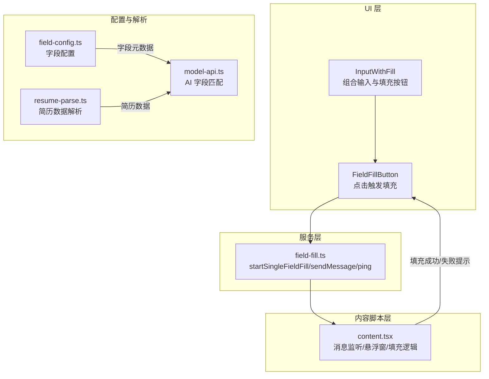
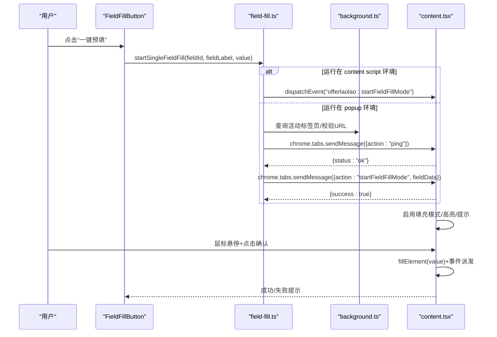
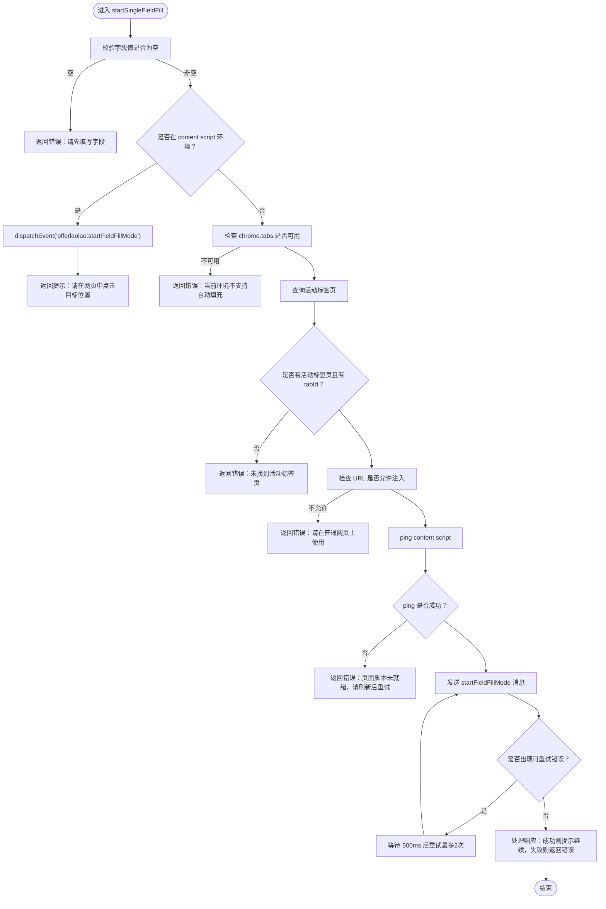
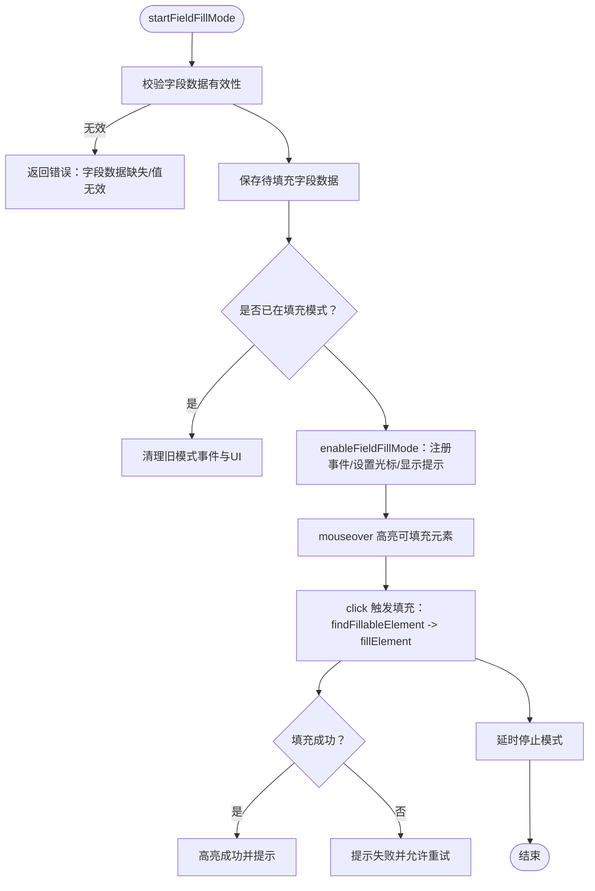
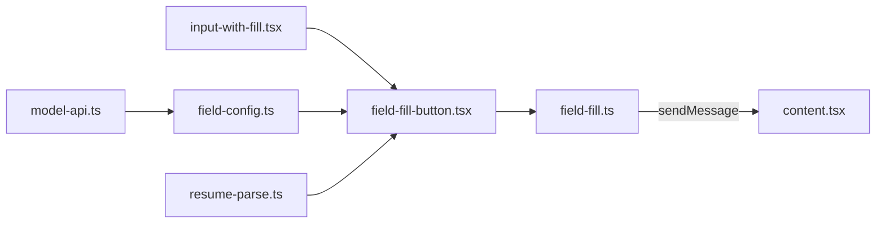

# 字段填充服务

<cite>
**本文引用的文件列表**
- [field-fill.ts](file://src/services/field-fill.ts)
- [content.tsx](file://src/content.tsx)
- [field-fill-button.tsx](file://src/components/ui/field-fill-button.tsx)
- [input-with-fill.tsx](file://src/components/ui/input-with-fill.tsx)
- [field-config.ts](file://src/config/field-config.ts)
- [background.ts](file://src/background.ts)
- [model-api.ts](file://src/services/model-api.ts)
- [resume-parse.ts](file://src/services/resume-parse.ts)
</cite>

## 目录
1. [简介](#简介)
2. [项目结构](#项目结构)
3. [核心组件](#核心组件)
4. [架构总览](#架构总览)
5. [详细组件分析](#详细组件分析)
6. [依赖关系分析](#依赖关系分析)
7. [性能考量](#性能考量)
8. [故障排查指南](#故障排查指南)
9. [结论](#结论)
10. [附录](#附录)

## 简介
本文件系统性阐述“字段填充服务”的设计与实现，重点覆盖以下方面：
- 与 content script 的通信机制：通过浏览器消息通道与自定义事件协同工作，确保在 popup 模式与悬浮窗模式下均能可靠触发页面级字段填充。
- 填充流程设计：从用户点击“一键预填”按钮到页面交互确认，再到 DOM 填充与反馈的完整链路。
- 选择器匹配策略：基于可填充元素判定与向上遍历策略，兼容多种输入控件与富文本编辑场景。
- 异步与错误处理：消息发送的重试机制、端侧错误分类与用户提示。
- 跨域与安全：通过 content script 注入与受控的消息通道，避免直接注入脚本带来的安全风险。
- 适配不同网站字段配置：通过字段配置模块与 AI 匹配能力，提升跨站点适配性。
- 性能优化建议：批量操作防抖、字段匹配缓存、事件去抖等。
- 常见问题与调试：填充失败的可能原因与定位方法。

## 项目结构
字段填充服务横跨三个层次：
- 服务层：负责跨页面通信、消息重试与错误处理。
- 内容脚本层：负责页面交互、元素高亮、DOM 填充与提示展示。
- UI 层：提供按钮与输入框组件，承载用户触发入口。

图表来源
- [field-fill.ts](file://src/services/field-fill.ts#L46-L259)
- [content.tsx](file://src/content.tsx#L69-L122)
- [field-fill-button.tsx](file://src/components/ui/field-fill-button.tsx#L1-L121)
- [input-with-fill.tsx](file://src/components/ui/input-with-fill.tsx#L1-L50)
- [field-config.ts](file://src/config/field-config.ts#L1-L400)
- [model-api.ts](file://src/services/model-api.ts#L289-L342)
- [resume-parse.ts](file://src/services/resume-parse.ts#L156-L340)

章节来源
- [field-fill.ts](file://src/services/field-fill.ts#L46-L259)
- [content.tsx](file://src/content.tsx#L69-L122)
- [field-fill-button.tsx](file://src/components/ui/field-fill-button.tsx#L1-L121)
- [input-with-fill.tsx](file://src/components/ui/input-with-fill.tsx#L1-L50)
- [field-config.ts](file://src/config/field-config.ts#L1-L400)
- [model-api.ts](file://src/services/model-api.ts#L289-L342)
- [resume-parse.ts](file://src/services/resume-parse.ts#L156-L340)

## 核心组件
- 字段填充服务（field-fill.ts）
  - 提供单字段填充入口：校验参数、判断上下文、查询活动标签页、检查 URL 限制、ping content script、发送消息并处理响应与重试。
  - 关键函数：startSingleFieldFill、pingContentScript、sendFieldFillMessage。
- 内容脚本（content.tsx）
  - 监听来自 popup 的消息与来自悬浮窗的自定义事件；启用/禁用字段填充模式；处理鼠标悬停高亮、点击确认、键盘取消；执行 DOM 填充与提示。
  - 关键函数：startFieldFillMode、enableFieldFillMode、stopFieldFillMode、findFillableElement、isFillableElement、fillElement。
- UI 组件（field-fill-button.tsx、input-with-fill.tsx）
  - FieldFillButton：封装点击触发逻辑，读取当前值并调用服务层；统一错误与成功提示。
  - InputWithFill：组合输入框与填充按钮，暴露 ref 以便外部读取值。
- 字段配置（field-config.ts）
  - 定义简历各模块字段的元数据（id、label、type、placeholder、options 等），为 UI 渲染与 AI 匹配提供依据。
- AI 匹配与简历解析（model-api.ts、resume-parse.ts）
  - model-api.ts：将页面字段与简历字段描述拼装为提示，调用模型返回匹配结果，过滤低置信度。
  - resume-parse.ts：将解析后的简历数据标准化为可填充的键值结构，并做日期与等级映射。

章节来源
- [field-fill.ts](file://src/services/field-fill.ts#L46-L259)
- [content.tsx](file://src/content.tsx#L166-L453)
- [field-fill-button.tsx](file://src/components/ui/field-fill-button.tsx#L1-L121)
- [input-with-fill.tsx](file://src/components/ui/input-with-fill.tsx#L1-L50)
- [field-config.ts](file://src/config/field-config.ts#L1-L400)
- [model-api.ts](file://src/services/model-api.ts#L289-L342)
- [resume-parse.ts](file://src/services/resume-parse.ts#L156-L340)

## 架构总览
字段填充的端到端流程如下：

图表来源
- [field-fill-button.tsx](file://src/components/ui/field-fill-button.tsx#L27-L71)
- [field-fill.ts](file://src/services/field-fill.ts#L46-L259)
- [content.tsx](file://src/content.tsx#L69-L122)
- [background.ts](file://src/background.ts#L11-L29)

## 详细组件分析

### 服务层：字段填充服务（field-fill.ts）
- 设计要点
  - 上下文识别：通过检测 chrome.tabs 是否存在判断当前是否处于 content script 环境，从而决定使用自定义事件还是 chrome.tabs.sendMessage。
  - URL 限制：禁止在 chrome://、chrome-extension://、edge://、about:、moz-extension:// 等页面执行，避免注入与通信异常。
  - ping 机制：先发送 ping 消息验证 content script 是否已加载，若失败则提示刷新页面。
  - 消息重试：对“无法建立连接/接收端不存在/消息端口关闭”等错误进行有限次数重试，提升稳定性。
  - 错误分类与友好提示：针对不同错误字符串给出明确指引，便于用户快速恢复。
- 关键流程图（startSingleFieldFill）

图表来源
- [field-fill.ts](file://src/services/field-fill.ts#L46-L259)

章节来源
- [field-fill.ts](file://src/services/field-fill.ts#L46-L259)

### 内容脚本层：字段填充模式（content.tsx）
- 设计要点
  - 模式切换：通过消息监听器处理 ping、悬浮窗显示/隐藏、启动字段填充模式。
  - 交互体验：启用模式时注册 mouseover/mouseout/click/keydown 事件，使用 crosshair 光标与提示条增强交互。
  - 元素判定：支持 input/textarea/select/contenteditable、role 为 textbox/combobox/searchbox 的元素，向上最多遍历 5 层寻找可填充节点。
  - DOM 填充：对不同元素类型分别设置值并派发 input/change/blur 等事件；对 React 受控组件通过原生 setter 触发框架感知。
  - 反馈提示：成功/失败提示条，成功后短暂高亮目标元素。
- 关键流程图（字段填充模式）

图表来源
- [content.tsx](file://src/content.tsx#L166-L453)

章节来源
- [content.tsx](file://src/content.tsx#L69-L122)
- [content.tsx](file://src/content.tsx#L166-L453)

### UI 层：按钮与输入框（field-fill-button.tsx、input-with-fill.tsx）
- 设计要点
  - FieldFillButton：读取传入的 getValue 函数获取当前值，避免重复渲染导致的值丢失；统一 loading 与消息提示。
  - InputWithFill：将输入框与填充按钮组合，暴露 ref 以便外部读取当前值；支持条件显示填充按钮。
- 与服务层的衔接
  - Button 调用 startSingleFieldFill，将 fieldId、fieldLabel、value 传递给服务层；服务层根据上下文决定通信路径。

章节来源
- [field-fill-button.tsx](file://src/components/ui/field-fill-button.tsx#L1-L121)
- [input-with-fill.tsx](file://src/components/ui/input-with-fill.tsx#L1-L50)

### 字段配置与适配（field-config.ts、model-api.ts、resume-parse.ts）
- 字段配置（field-config.ts）
  - 定义基本信息、求职期望、教育经历、工作/实习经历、项目经历、语言能力、技能、自定义字段等的字段元数据，含 id、label、type、placeholder、options 等。
  - 动态项配置（dynamicConfigs）：记录列表容器 id、添加按钮 id、字段列表与最小数量，便于扩展多条目表单。
- AI 字段匹配（model-api.ts）
  - 将页面字段与简历字段描述拼装为提示，调用模型返回匹配索引与置信度，过滤低置信度（阈值≥0.5）。
- 简历数据解析（resume-parse.ts）
  - 将解析后的原始数据标准化为可填充的键值结构，并对日期格式进行归一化、技能等级进行映射，减少跨站点差异。

章节来源
- [field-config.ts](file://src/config/field-config.ts#L1-L400)
- [model-api.ts](file://src/services/model-api.ts#L289-L342)
- [resume-parse.ts](file://src/services/resume-parse.ts#L156-L340)

## 依赖关系分析
- 服务层依赖
  - chrome.tabs：用于查询活动标签页、发送消息。
  - content.tsx：作为消息接收方，负责实际的 DOM 操作。
- 内容脚本依赖
  - 浏览器事件：注册/移除事件监听器，管理 UI 提示。
  - DOM API：查找元素、设置值、派发事件。
- UI 层依赖
  - 服务层：调用 startSingleFieldFill。
  - 配置与解析：字段配置与简历数据为 UI 提供元数据与值来源。

图表来源
- [field-fill.ts](file://src/services/field-fill.ts#L46-L259)
- [content.tsx](file://src/content.tsx#L69-L122)
- [field-fill-button.tsx](file://src/components/ui/field-fill-button.tsx#L1-L121)
- [input-with-fill.tsx](file://src/components/ui/input-with-fill.tsx#L1-L50)
- [field-config.ts](file://src/config/field-config.ts#L1-L400)
- [resume-parse.ts](file://src/services/resume-parse.ts#L156-L340)
- [model-api.ts](file://src/services/model-api.ts#L289-L342)

章节来源
- [field-fill.ts](file://src/services/field-fill.ts#L46-L259)
- [content.tsx](file://src/content.tsx#L69-L122)
- [field-fill-button.tsx](file://src/components/ui/field-fill-button.tsx#L1-L121)
- [input-with-fill.tsx](file://src/components/ui/input-with-fill.tsx#L1-L50)
- [field-config.ts](file://src/config/field-config.ts#L1-L400)
- [resume-parse.ts](file://src/services/resume-parse.ts#L156-L340)
- [model-api.ts](file://src/services/model-api.ts#L289-L342)

## 性能考量
- 批量操作防抖
  - 在 UI 层对“一键预填”按钮的点击进行节流，避免短时间内多次触发导致 content script 事件堆积。
  - 在 content script 层对高频事件（如 mouseover）进行去抖或降低触发频率，减少重绘与事件处理开销。
- 字段匹配缓存
  - 对页面字段的可填充判定结果进行短期缓存，避免重复遍历与判定。
  - 对 AI 匹配结果进行缓存，结合字段标签与类型生成稳定键，减少重复请求。
- 事件与 DOM 操作优化
  - 仅在启用模式时注册事件监听器，退出模式时及时移除，避免常驻监听器造成性能损耗。
  - DOM 填充后尽量减少不必要的样式变更与布局计算，必要时使用 requestAnimationFrame 合并更新。
- 跨域与安全
  - 通过 content script 注入与受控的消息通道进行通信，避免直接注入脚本带来的安全与跨域问题。
  - 对消息通道错误进行分类与重试，保证在 popup 快速关闭等边界条件下仍能获得预期行为。

[本节为通用性能建议，无需具体文件引用]

## 故障排查指南
- 常见失败原因
  - 页面脚本未就绪：content script 未加载或尚未完成初始化，需刷新页面后重试。
  - 当前页面不支持：在 chrome://、chrome-extension://、edge://、about:、moz-extension:// 等页面无法执行。
  - popup 快速关闭：消息端口在 popup 关闭时提前关闭，属于预期行为，服务层已做兼容处理。
  - 无法建立连接/接收端不存在：content script 未加载或标签页不可用，需刷新页面。
  - 字段值为空：UI 层未填写字段值，需先在弹窗中填写对应字段。
- 调试步骤
  - 打开开发者工具，观察控制台输出的 ping 与 sendMessage 日志，确认 content script 是否响应。
  - 在 content script 中检查是否注册了事件监听器与高亮逻辑，确认鼠标事件是否被阻止冒泡。
  - 验证目标元素是否满足可填充条件（input/textarea/select/contenteditable 或特定 role），必要时手动点击确认。
  - 若使用 AI 匹配，检查模型接口返回与置信度阈值，适当调整关键词或字段标签。
- 用户提示与恢复
  - 服务层对错误进行分类并返回友好提示，指导用户刷新页面或在普通网页上重试。
  - UI 层显示 info/error 提示，帮助用户理解下一步操作。

章节来源
- [field-fill.ts](file://src/services/field-fill.ts#L115-L259)
- [content.tsx](file://src/content.tsx#L69-L122)
- [field-fill-button.tsx](file://src/components/ui/field-fill-button.tsx#L27-L71)

## 结论
字段填充服务通过清晰的服务层与内容脚本层分工，结合 UI 层的用户触发入口，实现了跨站点、跨模式（popup/悬浮窗）的稳定字段填充能力。其设计强调：
- 明确的通信协议与错误处理策略；
- 严谨的元素判定与 DOM 填充流程；
- 可扩展的字段配置与 AI 匹配能力；
- 面向性能的事件与缓存优化思路。

在实际使用中，建议优先在普通网页上执行，确保 content script 正常加载；遇到失败时按提示刷新页面并重试；对于复杂表单可借助 AI 匹配与字段配置提升适配效率。

[本节为总结性内容，无需具体文件引用]

## 附录
- 实际使用示例（“一键预填”）
  - 用户在弹窗中填写某个字段（如手机号），点击“一键预填”按钮。
  - UI 层调用 FieldFillButton 的点击处理器，读取当前值并调用服务层的 startSingleFieldFill。
  - 服务层根据上下文选择通信路径：若在 content script 环境，直接分发自定义事件；否则通过 chrome.tabs.sendMessage 发送消息。
  - content script 收到消息后启用字段填充模式，显示提示与高亮，用户点击确认后完成 DOM 填充并反馈结果。

章节来源
- [field-fill-button.tsx](file://src/components/ui/field-fill-button.tsx#L27-L71)
- [field-fill.ts](file://src/services/field-fill.ts#L46-L259)
- [content.tsx](file://src/content.tsx#L69-L122)