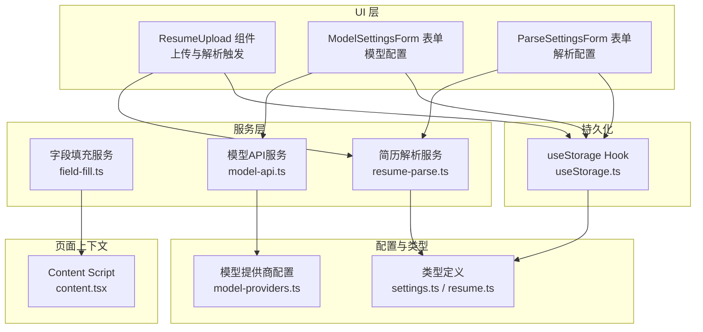
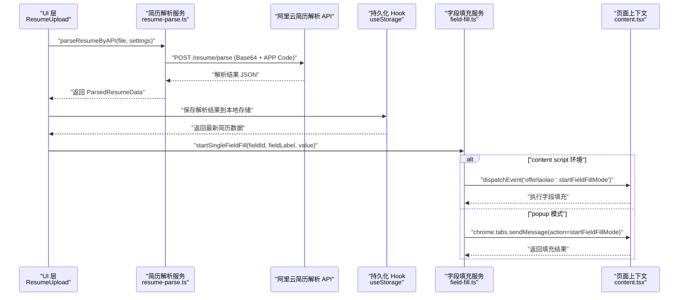
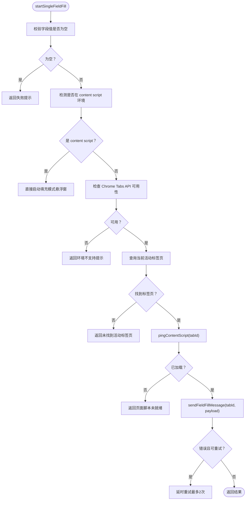
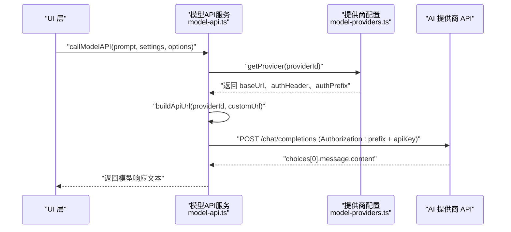
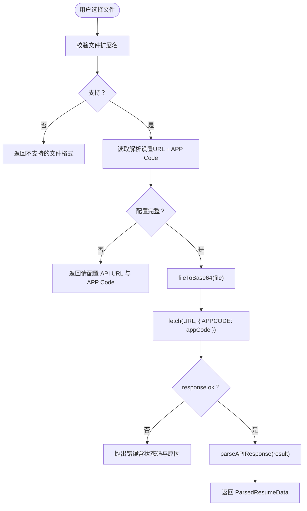
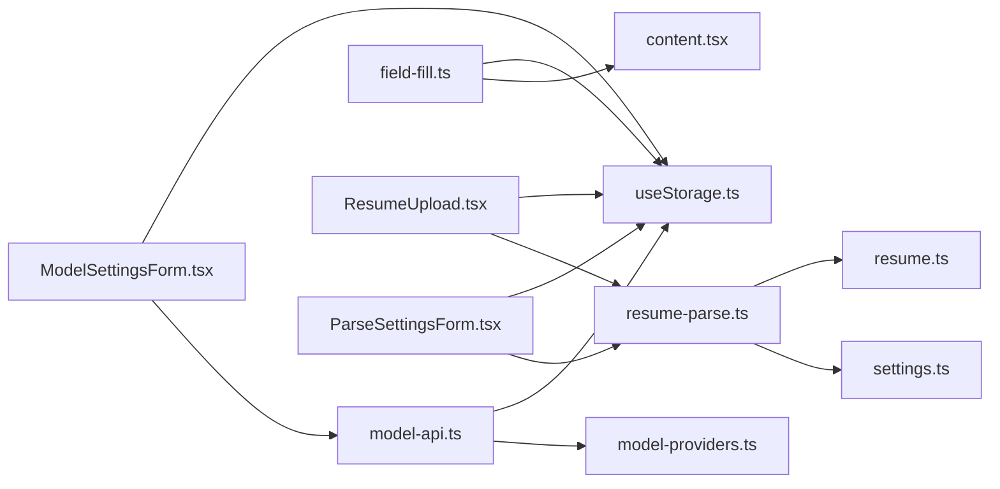

# 服务架构

<cite>
**本文引用的文件**
- [field-fill.ts](file://src/services/field-fill.ts)
- [model-api.ts](file://src/services/model-api.ts)
- [resume-parse.ts](file://src/services/resume-parse.ts)
- [content.tsx](file://src/content.tsx)
- [useStorage.ts](file://src/hooks/useStorage.ts)
- [ResumeUpload.tsx](file://src/features/popup/ResumeUpload.tsx)
- [model-providers.ts](file://src/config/model-providers.ts)
- [settings.ts](file://src/types/settings.ts)
- [resume.ts](file://src/types/resume.ts)
</cite>

## 目录
1. [简介](#简介)
2. [项目结构](#项目结构)
3. [核心组件](#核心组件)
4. [架构总览](#架构总览)
5. [详细组件分析](#详细组件分析)
6. [依赖关系分析](#依赖关系分析)
7. [性能考量](#性能考量)
8. [故障排查指南](#故障排查指南)
9. [结论](#结论)
10. [附录](#附录)

## 简介
本文件系统性梳理插件内部三大核心服务：字段填充服务（field-fill）、AI模型API服务（model-api）与简历解析服务（resume-parse）的设计与实现。重点说明：
- 字段填充服务如何封装与 content script 的通信逻辑，将“填充指令”和“数据”发送到页面上下文；
- AI模型API服务如何抽象化对 DeepSeek、通义千问、Kimi 等不同 AI 提供商的调用，提供统一接口供 UI 层使用；
- 简历解析服务如何与阿里云简历解析 API 集成，处理文件上传与解析结果的转换；
- 服务之间的调用关系，例如用户上传简历后，ResumeUpload 组件如何调用 resume-parse 服务，解析结果又如何通过 convertParsedDataToResumeData 函数整合到简历数据模型中；
- 这些服务如何通过自定义 Hook（如 useStorage）与持久化层交互，确保数据一致性。

## 项目结构
插件采用“服务层 + 类型与配置 + UI 层”的分层设计：
- 服务层：位于 src/services，封装业务能力（字段填充、模型调用、简历解析）
- 类型与配置：位于 src/types 与 src/config，定义数据结构与提供商配置
- UI 层：位于 src/features/popup，包含设置页、表单、上传组件等
- 持久化：位于 src/hooks，提供跨页面的本地存储 Hook

图表来源
- [ResumeUpload.tsx](file://src/features/popup/ResumeUpload.tsx#L1-L260)
- [field-fill.ts](file://src/services/field-fill.ts#L1-L260)
- [model-api.ts](file://src/services/model-api.ts#L1-L678)
- [resume-parse.ts](file://src/services/resume-parse.ts#L1-L342)
- [content.tsx](file://src/content.tsx#L1-L454)
- [useStorage.ts](file://src/hooks/useStorage.ts#L1-L102)
- [model-providers.ts](file://src/config/model-providers.ts#L1-L123)
- [settings.ts](file://src/types/settings.ts#L1-L192)
- [resume.ts](file://src/types/resume.ts#L1-L212)

章节来源
- [ResumeUpload.tsx](file://src/features/popup/ResumeUpload.tsx#L1-L260)
- [field-fill.ts](file://src/services/field-fill.ts#L1-L260)
- [model-api.ts](file://src/services/model-api.ts#L1-L678)
- [resume-parse.ts](file://src/services/resume-parse.ts#L1-L342)
- [content.tsx](file://src/content.tsx#L1-L454)
- [useStorage.ts](file://src/hooks/useStorage.ts#L1-L102)
- [model-providers.ts](file://src/config/model-providers.ts#L1-L123)
- [settings.ts](file://src/types/settings.ts#L1-L192)
- [resume.ts](file://src/types/resume.ts#L1-L212)

## 核心组件
- 字段填充服务（field-fill）
  - 负责在 popup 模式与 content script 间建立通信，向页面注入“字段填充模式”，并在悬浮窗模式下直接触发 content script 的填充逻辑
  - 提供 startSingleFieldFill、sendFieldFillMessage、pingContentScript 等关键方法
- AI模型API服务（model-api）
  - 抽象化对多家 AI 提供商的调用，支持 DeepSeek、Kimi、Qwen、火山引擎、智谱、百川等
  - 提供统一的 callModelAPI、testModelConnection、optimizeEntireResume 等接口
- 简历解析服务（resume-parse）
  - 封装阿里云简历解析 API 的调用，支持 Base64 上传与多格式解析
  - 提供 parseResumeByAPI 与 parseAPIResponse，并包含日期标准化与技能等级映射等工具函数

章节来源
- [field-fill.ts](file://src/services/field-fill.ts#L1-L260)
- [model-api.ts](file://src/services/model-api.ts#L1-L678)
- [resume-parse.ts](file://src/services/resume-parse.ts#L1-L342)

## 架构总览
下面的序列图展示了“用户上传简历 -> 调用解析服务 -> 整合到简历数据模型”的端到端流程，以及字段填充服务与页面上下文的交互。

图表来源
- [ResumeUpload.tsx](file://src/features/popup/ResumeUpload.tsx#L1-L260)
- [resume-parse.ts](file://src/services/resume-parse.ts#L1-L342)
- [useStorage.ts](file://src/hooks/useStorage.ts#L1-L102)
- [field-fill.ts](file://src/services/field-fill.ts#L1-L260)
- [content.tsx](file://src/content.tsx#L1-L454)

## 详细组件分析

### 字段填充服务（field-fill）
- 设计要点
  - 通过 isContentScriptContext 判断当前是否处于 content script 上下文，决定走“悬浮窗模式”还是“popup 模式”
  - 在 popup 模式下，先 pingContentScript 检查 content script 是否已注入，再通过 chrome.tabs.sendMessage 发送“startFieldFillMode”消息
  - 在悬浮窗模式下，直接 dispatch 自定义事件，由 content script 监听并启动填充模式
  - 提供重试机制与错误分类，对常见错误（如“无法建立连接”、“接收端不存在”）给出友好提示
- 关键流程（启动单字段填充）

图表来源
- [field-fill.ts](file://src/services/field-fill.ts#L1-L260)

章节来源
- [field-fill.ts](file://src/services/field-fill.ts#L1-L260)
- [content.tsx](file://src/content.tsx#L1-L454)

### AI模型API服务（model-api）
- 设计要点
  - 通过 MODEL_PROVIDERS 与 getProvider 抽象不同提供商的 baseUrl、认证头与模型列表
  - buildApiUrl 支持“自定义 URL（OpenAI 兼容）”场景，自动补齐 /chat/completions
  - callModelAPI 统一构建请求体（messages、temperature、max_tokens、stream=false），并解析响应
  - 提供 testModelConnection、optimizeResumeField、generateResumeSuggestions、aiMatchFields、optimizeEntireResume 等高级能力
- 关键流程（调用模型 API）

图表来源
- [model-api.ts](file://src/services/model-api.ts#L1-L678)
- [model-providers.ts](file://src/config/model-providers.ts#L1-L123)

章节来源
- [model-api.ts](file://src/services/model-api.ts#L1-L678)
- [model-providers.ts](file://src/config/model-providers.ts#L1-L123)
- [settings.ts](file://src/types/settings.ts#L1-L192)

### 简历解析服务（resume-parse）
- 设计要点
  - parseResumeByAPI 将文件转为 Base64，构造请求体（file_name、file_cont、ocr_type），并以 APP Code 进行认证
  - parseAPIResponse 将不同提供商返回的字段映射到统一的 ParsedResumeData 结构，包括个人信息、教育、工作、项目、技能、语言等
  - normalizeDateValue 与 mapSkillLevel 提供数据规范化与兼容处理
- 关键流程（上传与解析）

图表来源
- [resume-parse.ts](file://src/services/resume-parse.ts#L1-L342)

章节来源
- [resume-parse.ts](file://src/services/resume-parse.ts#L1-L342)
- [settings.ts](file://src/types/settings.ts#L1-L192)
- [resume.ts](file://src/types/resume.ts#L1-L212)

### UI 与服务的集成
- ResumeUpload 组件
  - 通过 useStorage 读取解析设置，调用 parseResumeByAPI 解析文件
  - 对 JSON 文件直接解析，对 PDF/DOCX 等格式调用 API 解析
  - 解析成功后，将数据通过 onParsedData 回调传递给上层，用于后续整合到简历数据模型
- 字段填充按钮与 content script
  - FieldFillButton 通过 startSingleFieldFill 触发填充流程
  - 在悬浮窗模式下，content.tsx 监听自定义事件并启动填充；在 popup 模式下，通过 chrome.tabs.sendMessage 与 content script 通信

章节来源
- [ResumeUpload.tsx](file://src/features/popup/ResumeUpload.tsx#L1-L260)
- [field-fill.ts](file://src/services/field-fill.ts#L1-L260)
- [content.tsx](file://src/content.tsx#L1-L454)

## 依赖关系分析
- 服务与配置
  - model-api 依赖 model-providers.ts 提供的提供商信息与模型列表
  - resume-parse 依赖 settings.ts 中的 ParseSettings 类型与默认值
- 服务与持久化
  - 所有服务通过 useStorage.ts 与浏览器存储交互，确保设置与数据在页面刷新后保持一致
- 服务与 UI
  - UI 层通过组件（如 ResumeUpload、ModelSettingsForm、ParseSettingsForm）驱动服务调用
  - 字段填充服务与 content script 通过消息与事件进行解耦通信

图表来源
- [model-api.ts](file://src/services/model-api.ts#L1-L678)
- [model-providers.ts](file://src/config/model-providers.ts#L1-L123)
- [resume-parse.ts](file://src/services/resume-parse.ts#L1-L342)
- [settings.ts](file://src/types/settings.ts#L1-L192)
- [resume.ts](file://src/types/resume.ts#L1-L212)
- [field-fill.ts](file://src/services/field-fill.ts#L1-L260)
- [content.tsx](file://src/content.tsx#L1-L454)
- [useStorage.ts](file://src/hooks/useStorage.ts#L1-L102)
- [ResumeUpload.tsx](file://src/features/popup/ResumeUpload.tsx#L1-L260)

章节来源
- [model-api.ts](file://src/services/model-api.ts#L1-L678)
- [model-providers.ts](file://src/config/model-providers.ts#L1-L123)
- [resume-parse.ts](file://src/services/resume-parse.ts#L1-L342)
- [settings.ts](file://src/types/settings.ts#L1-L192)
- [resume.ts](file://src/types/resume.ts#L1-L212)
- [field-fill.ts](file://src/services/field-fill.ts#L1-L260)
- [content.tsx](file://src/content.tsx#L1-L454)
- [useStorage.ts](file://src/hooks/useStorage.ts#L1-L102)
- [ResumeUpload.tsx](file://src/features/popup/ResumeUpload.tsx#L1-L260)

## 性能考量
- 字段填充服务
  - 重试策略：对“无法建立连接”“消息端口关闭”等错误进行最多两次延时重试，降低瞬时网络波动的影响
  - pingContentScript：在发送消息前先探测 content script 是否已注入，避免无效调用
- 模型API服务
  - 逐项优化简历时添加 500ms 延迟，避免请求过于频繁导致限流
  - 统一的请求体构建与响应解析，减少重复逻辑
- 简历解析服务
  - Base64 转换与请求体构造在本地完成，避免额外中间层
  - 对不同提供商返回结构进行兼容处理，减少 UI 层适配成本

[本节为通用指导，不直接分析具体文件]

## 故障排查指南
- 字段填充失败
  - 检查是否在受支持的页面上使用（排除 chrome://、about:、扩展页等）
  - 若 popup 模式下失败，确认 content script 已注入并可用；必要时刷新页面
  - 若出现“消息端口关闭”提示，通常为 popup 快速关闭导致，但仍可视为成功
- 模型API调用异常
  - 确认 API Key 已配置且对应提供商正确
  - 检查 providerId 与 model 是否匹配；自定义 URL 需以 /chat/completions 结尾
  - 401 为认证失败，429 为频率限制，400 为参数错误
- 简历解析失败
  - 确认 URL 与 APP Code 已配置
  - 401 通常为 APP Code 错误或服务未激活；其他状态码请查看错误详情

章节来源
- [field-fill.ts](file://src/services/field-fill.ts#L1-L260)
- [model-api.ts](file://src/services/model-api.ts#L1-L678)
- [resume-parse.ts](file://src/services/resume-parse.ts#L1-L342)

## 结论
本插件通过清晰的服务分层与统一的抽象接口，实现了字段填充、AI 模型调用与简历解析三大核心能力：
- 字段填充服务以最小侵入的方式与页面上下文通信，兼顾 popup 与悬浮窗两种模式
- 模型API服务以配置驱动的方式支持多家提供商，提供统一的调用与优化接口
- 简历解析服务对接阿里云 API，完成文件上传与结构化数据转换
- 通过 useStorage Hook 与 UI 层紧密协作，确保数据一致性与用户体验

[本节为总结性内容，不直接分析具体文件]

## 附录
- 关键函数与路径参考
  - 字段填充：[startSingleFieldFill](file://src/services/field-fill.ts#L46-L136)、[sendFieldFillMessage](file://src/services/field-fill.ts#L162-L259)、[pingContentScript](file://src/services/field-fill.ts#L141-L157)
  - 模型API：[callModelAPI](file://src/services/model-api.ts#L38-L139)、[testModelConnection](file://src/services/model-api.ts#L144-L174)、[optimizeEntireResume](file://src/services/model-api.ts#L492-L676)
  - 简历解析：[parseResumeByAPI](file://src/services/resume-parse.ts#L38-L109)、[parseAPIResponse](file://src/services/resume-parse.ts#L137-L295)、[normalizeDateValue](file://src/services/resume-parse.ts#L299-L320)、[mapSkillLevel](file://src/services/resume-parse.ts#L322-L341)
  - 页面交互：[content.tsx 消息监听与填充模式](file://src/content.tsx#L69-L122)、[悬浮窗事件](file://src/content.tsx#L59-L67)
  - 持久化：[useStorage Hook](file://src/hooks/useStorage.ts#L1-L102)
  - UI 集成：[ResumeUpload 组件](file://src/features/popup/ResumeUpload.tsx#L1-L260)