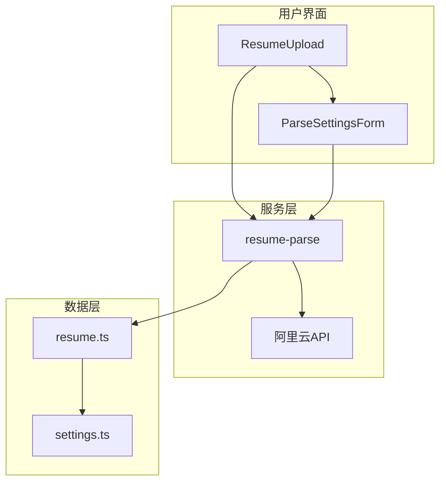
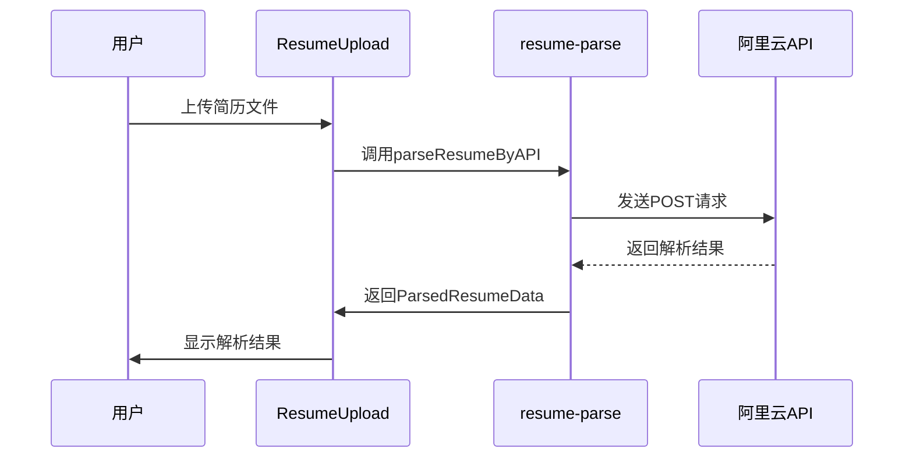
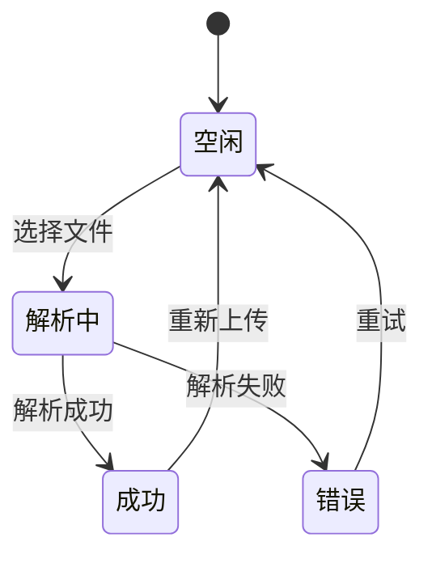
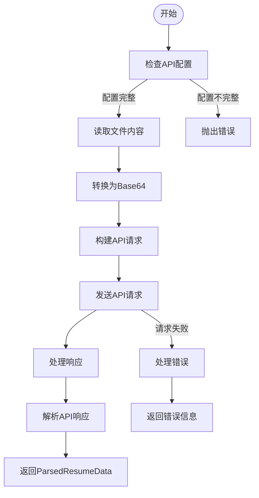
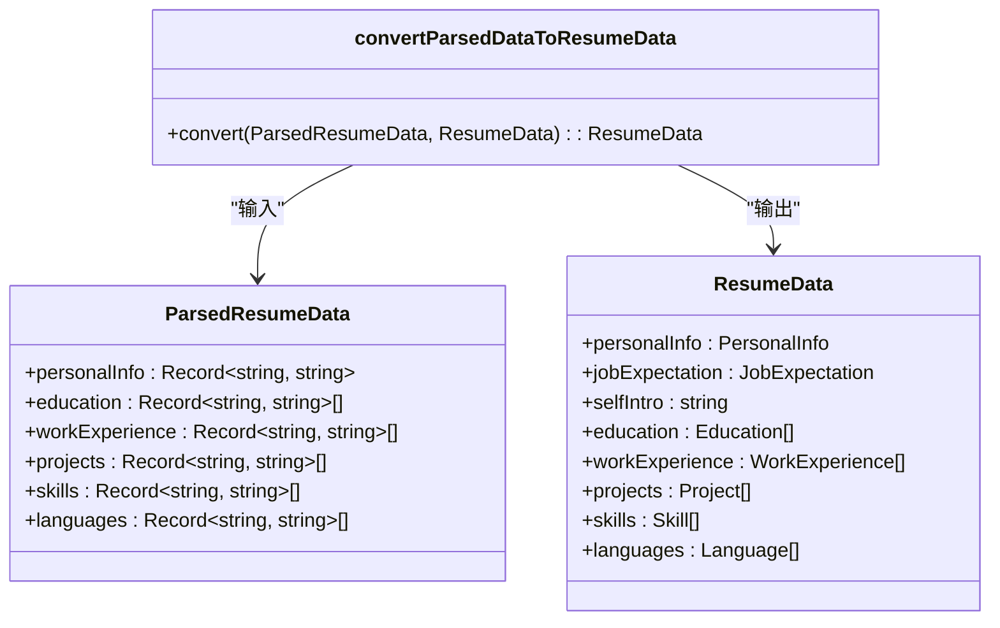

# 简历解析服务

<cite>
**本文档引用文件**  
- [resume-parse.ts](file://src/services/resume-parse.ts)
- [ResumeUpload.tsx](file://src/features/popup/ResumeUpload.tsx)
- [resume.ts](file://src/types/resume.ts)
- [settings.ts](file://src/types/settings.ts)
- [field-config.ts](file://src/config/field-config.ts)
- [popup.tsx](file://src/popup.tsx)
- [ParseSettingsForm.tsx](file://src/features/popup/settings/ParseSettingsForm.tsx)
- [export.ts](file://src/utils/export.ts)
</cite>

## 目录
1. [简介](#简介)
2. [项目结构](#项目结构)
3. [核心组件](#核心组件)
4. [架构概述](#架构概述)
5. [详细组件分析](#详细组件分析)
6. [依赖分析](#依赖分析)
7. [性能考虑](#性能考虑)
8. [故障排除指南](#故障排除指南)
9. [结论](#结论)

## 简介
简历解析服务是Offer捞捞插件的核心功能之一，旨在通过集成阿里云简历解析API，实现对PDF、DOCX等格式简历文件的智能结构化解析。该服务将用户上传的简历文件转换为结构化数据，并自动填充到简历表单中，极大提升了简历填写的效率和准确性。系统支持JSON、TXT、HTML等多种文件格式的解析，并通过完善的错误处理机制确保服务的稳定性。本文档详细阐述了简历解析服务的技术实现，包括文件上传、API调用、数据转换和用户交互等关键环节。

## 项目结构
简历解析服务的代码组织遵循功能模块化的设计原则，主要文件分布在`src`目录下的不同子目录中。核心服务逻辑位于`src/services/resume-parse.ts`，负责与阿里云API的通信和数据处理。用户界面组件`ResumeUpload.tsx`位于`src/features/popup`目录，提供文件上传和解析状态展示功能。数据模型定义在`src/types/resume.ts`和`src/types/settings.ts`中，确保类型安全和数据一致性。字段配置信息存储在`src/config/field-config.ts`，支持灵活的表单定制。整体结构清晰，便于维护和扩展。



**图表来源**  
- [ResumeUpload.tsx](file://src/features/popup/ResumeUpload.tsx)
- [resume-parse.ts](file://src/services/resume-parse.ts)
- [resume.ts](file://src/types/resume.ts)
- [settings.ts](file://src/types/settings.ts)

**章节来源**  
- [ResumeUpload.tsx](file://src/features/popup/ResumeUpload.tsx)
- [resume-parse.ts](file://src/services/resume-parse.ts)

## 核心组件
简历解析服务的核心组件包括文件上传组件、API调用服务和数据转换工具。`ResumeUpload`组件负责处理用户文件上传交互，支持拖拽和点击选择文件。`parseResumeByAPI`函数封装了与阿里云API的通信逻辑，包括认证、请求和响应处理。`convertParsedDataToResumeData`工具函数负责将API返回的原始数据转换为内部`ResumeData`数据模型。这些组件协同工作，实现了从文件上传到数据填充的完整流程。服务还包含`normalizeDateValue`和`mapSkillLevel`等辅助函数，确保数据格式的一致性和准确性。

**章节来源**  
- [resume-parse.ts](file://src/services/resume-parse.ts)
- [ResumeUpload.tsx](file://src/features/popup/ResumeUpload.tsx)
- [popup.tsx](file://src/popup.tsx)

## 架构概述
简历解析服务采用分层架构设计，分为用户界面层、服务层和数据层。用户界面层由`ResumeUpload`组件构成，提供直观的文件上传和状态反馈。服务层包含`resume-parse`模块，负责与阿里云API的通信，包括文件转换、请求发送和响应解析。数据层定义了`ResumeData`和`ParsedResumeData`等数据模型，确保数据在各层间传递的一致性。整个流程从用户上传文件开始，经过Base64编码、API调用、响应解析，最终将结构化数据填充到简历表单中。这种分层设计提高了代码的可维护性和可测试性。



**图表来源**  
- [ResumeUpload.tsx](file://src/features/popup/ResumeUpload.tsx)
- [resume-parse.ts](file://src/services/resume-parse.ts)

## 详细组件分析
### ResumeUpload 组件分析
`ResumeUpload`组件是用户与简历解析服务交互的入口，提供直观的文件上传界面。组件支持拖拽和点击选择文件两种方式，提升用户体验。上传状态通过`UploadStatus`枚举管理，包括空闲、解析中、成功和错误四种状态。组件通过`useStorage`钩子读取API配置，并在用户未配置时显示提示信息。文件选择后，组件会检查文件扩展名，仅允许上传支持的格式。解析过程中，组件显示进度条和状态提示，让用户了解当前进度。解析成功后，用户可以选择使用解析数据或重新上传。



**图表来源**  
- [ResumeUpload.tsx](file://src/features/popup/ResumeUpload.tsx)

**章节来源**  
- [ResumeUpload.tsx](file://src/features/popup/ResumeUpload.tsx)

### resume-parse 服务分析
`resume-parse`服务模块是简历解析功能的核心，包含`parseResumeByAPI`和`parseAPIResponse`等关键函数。`parseResumeByAPI`函数负责构建API请求，包括将文件转换为Base64编码、设置认证头和发送POST请求。函数首先检查API配置的完整性，然后读取文件内容并构建请求体。请求头中包含`APPCODE`认证信息，确保API调用的安全性。`parseAPIResponse`函数处理API响应，将原始数据映射到`ParsedResumeData`结构。该函数具有良好的容错性，能处理多种响应格式，并对日期和技能等级进行标准化处理。



**图表来源**  
- [resume-parse.ts](file://src/services/resume-parse.ts)

**章节来源**  
- [resume-parse.ts](file://src/services/resume-parse.ts)

### 数据转换分析
数据转换过程是连接API响应和内部数据模型的关键环节。`convertParsedDataToResumeData`函数将`ParsedResumeData`转换为`ResumeData`，确保数据结构与表单字段匹配。转换过程中，函数保留用户已填写的数据，仅用解析结果填充空缺字段，避免覆盖用户手动输入的内容。教育经历、工作经历等动态字段通过索引映射进行转换，确保数据的准确对应。技能等级通过`mapSkillLevel`函数进行标准化，将API返回的"精通"、"熟练"等值映射到"专家"、"高级"等统一标准。日期字段通过`normalizeDateValue`函数转换为YYYY-MM-DD格式，确保与表单输入控件兼容。



**图表来源**  
- [resume-parse.ts](file://src/services/resume-parse.ts)
- [resume.ts](file://src/types/resume.ts)
- [settings.ts](file://src/types/settings.ts)

**章节来源**  
- [resume-parse.ts](file://src/services/resume-parse.ts)
- [popup.tsx](file://src/popup.tsx)

## 依赖分析
简历解析服务依赖多个内部和外部组件。内部依赖包括`useStorage`钩子用于持久化存储API配置，`field-config.ts`提供表单字段配置，`resume.ts`定义数据模型。外部依赖主要是阿里云简历解析API，通过HTTPS协议进行通信。服务还依赖浏览器的FileReader API进行文件读取，fetch API进行网络请求。这些依赖关系通过TypeScript的import语句明确声明，确保了代码的可维护性。`ParseSettingsForm`组件与`resume-parse`服务共享`ParseSettings`类型定义，保证了配置数据的一致性。

```mermaid
dependencyDiagram
ResumeUpload --> resume-parse
ResumeUpload --> useStorage
resume-parse --> FileReader
resume-parse --> fetch
resume-parse --> 阿里云API
convertParsedDataToResumeData --> resume
ParseSettingsForm --> settings
```

**图表来源**  
- [ResumeUpload.tsx](file://src/features/popup/ResumeUpload.tsx)
- [resume-parse.ts](file://src/services/resume-parse.ts)
- [resume.ts](file://src/types/resume.ts)
- [settings.ts](file://src/types/settings.ts)

**章节来源**  
- [ResumeUpload.tsx](file://src/features/popup/ResumeUpload.tsx)
- [resume-parse.ts](file://src/services/resume-parse.ts)

## 性能考虑
简历解析服务在性能方面进行了多项优化。文件上传采用Base64编码，虽然增加了数据体积，但简化了API调用流程。进度条模拟提升了用户感知性能，即使在大文件解析时也能提供及时反馈。`fileToBase64`函数使用Promise封装FileReader，避免阻塞主线程。API调用错误处理机制减少了不必要的重试，降低了服务器负载。未来可考虑实现大文件分片上传，将大文件分割为多个小块并行上传，进一步提升大文件处理性能。缓存机制也可用于存储已解析的简历结果，避免重复解析相同文件。

## 故障排除指南
简历解析服务包含完善的错误处理机制。文件格式不支持时，系统会显示明确的错误信息，提示用户上传支持的文件类型。API调用失败时，根据HTTP状态码提供具体的错误原因，如401错误提示认证失败，其他错误显示详细的错误信息。网络问题导致的请求失败会捕获并显示友好的错误提示。`parseAPIResponse`函数具有良好的容错性，能处理空响应或格式错误的响应，返回默认数据结构避免程序崩溃。调试时可查看浏览器控制台的日志输出，包括API请求参数和响应内容，便于定位问题。

**章节来源**  
- [resume-parse.ts](file://src/services/resume-parse.ts)
- [ResumeUpload.tsx](file://src/features/popup/ResumeUpload.tsx)

## 结论
简历解析服务通过集成阿里云API，实现了高效、准确的简历结构化解析功能。服务架构清晰，组件职责明确，代码可维护性强。从用户上传文件到数据填充的完整链路设计合理，提供了良好的用户体验。错误处理机制完善，确保了服务的稳定性。数据转换过程严谨，保证了解析结果与内部数据模型的准确对应。未来可通过大文件分片上传、结果缓存等优化进一步提升性能。整体而言，该服务为简历自动填写提供了可靠的技术支持，显著提升了用户填写简历的效率。