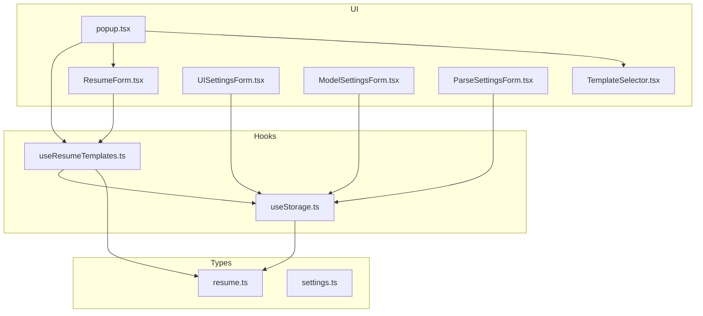
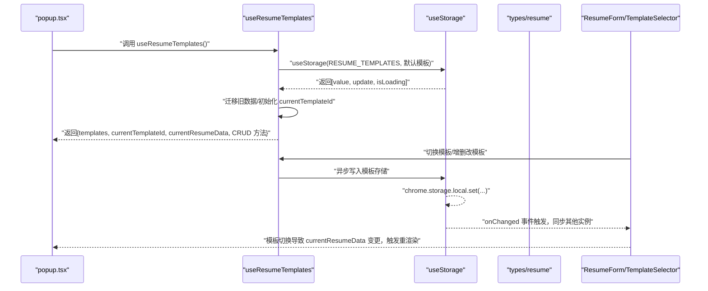
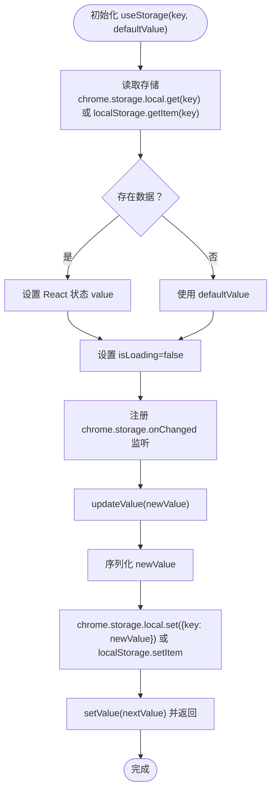
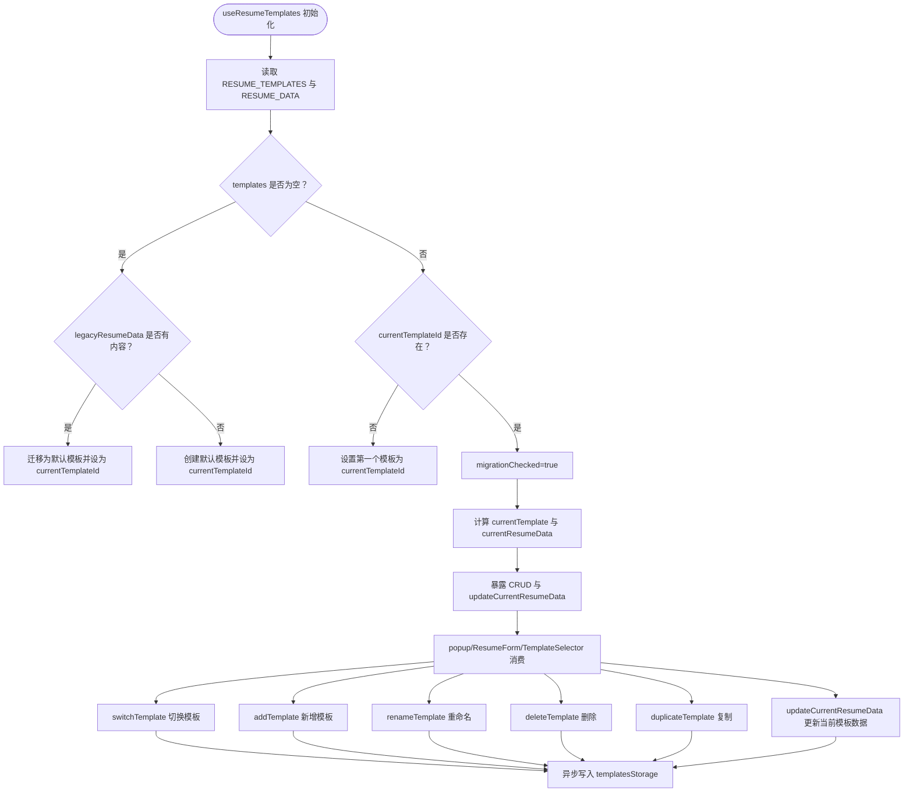
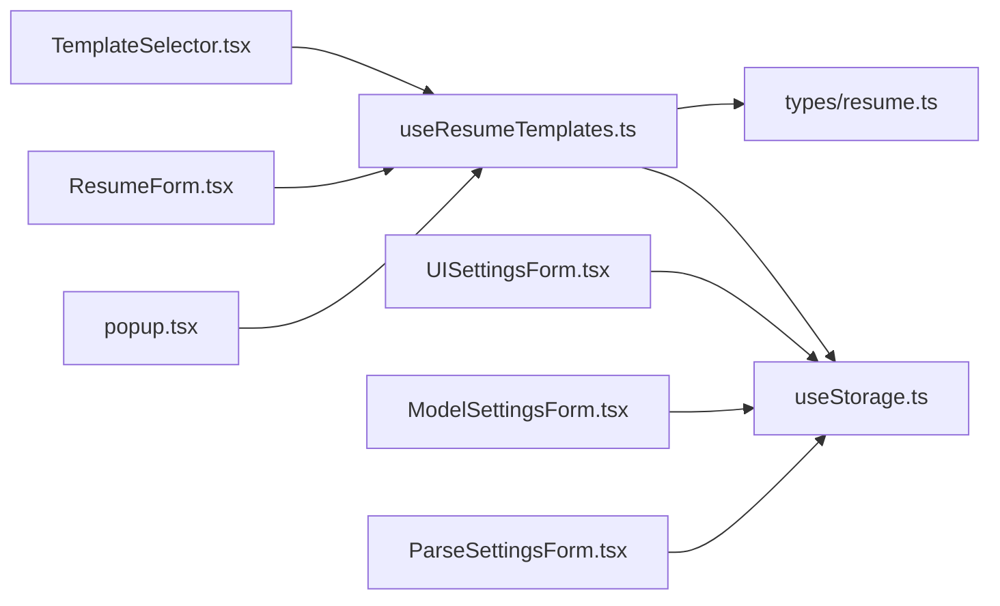

# 状态管理

<cite>
**本文引用的文件**
- [useStorage.ts](file://src/hooks/useStorage.ts)
- [useResumeTemplates.ts](file://src/hooks/useResumeTemplates.ts)
- [resume.ts](file://src/types/resume.ts)
- [settings.ts](file://src/types/settings.ts)
- [popup.tsx](file://src/popup.tsx)
- [ResumeForm.tsx](file://src/features/popup/ResumeForm.tsx)
- [TemplateSelector.tsx](file://src/components/common/TemplateSelector.tsx)
- [UISettingsForm.tsx](file://src/features/popup/settings/UISettingsForm.tsx)
- [ModelSettingsForm.tsx](file://src/features/popup/settings/ModelSettingsForm.tsx)
- [ParseSettingsForm.tsx](file://src/features/popup/settings/ParseSettingsForm.tsx)
</cite>

## 目录
1. [简介](#简介)
2. [项目结构](#项目结构)
3. [核心组件](#核心组件)
4. [架构总览](#架构总览)
5. [详细组件分析](#详细组件分析)
6. [依赖关系分析](#依赖关系分析)
7. [性能考量](#性能考量)
8. [故障排查指南](#故障排查指南)
9. [结论](#结论)

## 简介
本文件聚焦于插件的状态管理机制，系统性解析以下要点：
- 如何通过 React 自定义 Hook 和 Chrome Storage API 实现跨会话的状态持久化与管理；
- useStorage Hook 的设计与实现，如何封装 chrome.storage.local 的异步 API，提供类似 useState 的同步接口，并处理数据的序列化/反序列化；
- useResumeTemplates Hook 的实现，如何管理多个简历模板的 CRUD 操作，维护当前激活的模板 ID 与数据，并在模板切换时自动触发 UI 更新；
- 类型系统（ResumeData、UISettings 等）如何作为状态模型，确保类型安全；
- 在 popup 组件中如何消费这些 Hook，并保证状态变更时的响应式更新；
- 状态管理中的性能优化策略，包括避免不必要的渲染与存储读写。

## 项目结构
围绕状态管理的关键文件组织如下：
- hooks 层：useStorage、useResumeTemplates
- types 层：resume.ts、settings.ts（定义状态模型与默认值）
- popup 层：popup.tsx、ResumeForm.tsx、TemplateSelector.tsx（消费状态并驱动 UI）
- settings 表单层：UISettingsForm.tsx、ModelSettingsForm.tsx、ParseSettingsForm.tsx（使用 useStorage 持久化 UI/模型/解析设置）

图表来源
- [useStorage.ts](file://src/hooks/useStorage.ts#L1-L102)
- [useResumeTemplates.ts](file://src/hooks/useResumeTemplates.ts#L1-L258)
- [resume.ts](file://src/types/resume.ts#L1-L212)
- [settings.ts](file://src/types/settings.ts#L1-L192)
- [popup.tsx](file://src/popup.tsx#L124-L214)
- [ResumeForm.tsx](file://src/features/popup/ResumeForm.tsx#L227-L283)
- [TemplateSelector.tsx](file://src/components/common/TemplateSelector.tsx#L1-L259)
- [UISettingsForm.tsx](file://src/features/popup/settings/UISettingsForm.tsx#L1-L115)
- [ModelSettingsForm.tsx](file://src/features/popup/settings/ModelSettingsForm.tsx#L1-L298)
- [ParseSettingsForm.tsx](file://src/features/popup/settings/ParseSettingsForm.tsx#L1-L99)

章节来源
- [useStorage.ts](file://src/hooks/useStorage.ts#L1-L102)
- [useResumeTemplates.ts](file://src/hooks/useResumeTemplates.ts#L1-L258)
- [resume.ts](file://src/types/resume.ts#L1-L212)
- [settings.ts](file://src/types/settings.ts#L1-L192)
- [popup.tsx](file://src/popup.tsx#L124-L214)

## 核心组件
- useStorage：封装 Chrome Storage API，提供跨会话持久化与监听能力；在开发环境降级到 localStorage。
- useResumeTemplates：基于 useStorage 构建简历模板系统，负责模板 CRUD、迁移、当前模板与数据的计算与更新。

章节来源
- [useStorage.ts](file://src/hooks/useStorage.ts#L1-L102)
- [useResumeTemplates.ts](file://src/hooks/useResumeTemplates.ts#L1-L258)

## 架构总览
整体状态流从 Chrome Storage 读取初始值，组件通过 Hook 订阅状态变化，UI 响应式更新；同时，状态变更通过异步写入 Storage，形成“读取-渲染-持久化”的闭环。

图表来源
- [popup.tsx](file://src/popup.tsx#L124-L214)
- [useResumeTemplates.ts](file://src/hooks/useResumeTemplates.ts#L1-L258)
- [useStorage.ts](file://src/hooks/useStorage.ts#L1-L102)
- [resume.ts](file://src/types/resume.ts#L165-L212)

## 详细组件分析

### useStorage Hook 设计与实现
- 职责
  - 从 chrome.storage.local 或开发环境的 localStorage 读取初始值；
  - 监听 chrome.storage.onChanged，实现多实例间状态同步；
  - 提供更新函数，异步写入存储，保持 React 状态与存储一致。
- 关键点
  - 初始化加载：首次渲染时读取 key 对应的值，若不存在则使用 defaultValue；
  - 开发降级：当 chrome.storage 不可用时，回退到 localStorage；
  - 写入策略：updateValue 接受函数或值，内部统一序列化后写入；
  - 监听同步：监听 areaName 为 local 的变更，匹配 key 后更新 React 状态；
  - 返回值：value、updateValue、isLoading，便于 UI 控制加载态。
- 类型与键名
  - 泛型参数 T 表示存储值类型；
  - 提供 STORAGE_KEYS 常量集合，集中管理键名。

图表来源
- [useStorage.ts](file://src/hooks/useStorage.ts#L1-L102)

章节来源
- [useStorage.ts](file://src/hooks/useStorage.ts#L1-L102)

### useResumeTemplates Hook 实现
- 职责
  - 基于 useStorage 管理 ResumeTemplatesStorage；
  - 处理旧版 resumeData 的迁移，确保首次使用体验；
  - 计算 currentTemplate 与 currentResumeData，提供 CRUD 与复制模板能力；
  - 在模板切换时自动更新 UI。
- 数据模型
  - ResumeTemplatesStorage：包含 templates 数组与 currentTemplateId；
  - ResumeTemplate：包含 id、name、data、createdAt、updatedAt；
  - ResumeData：完整简历数据结构及默认值。
- 主要流程
  - 初始化：读取 RESUME_TEMPLATES 与 RESUME_DATA，标记 migrationChecked；
  - 迁移：若 templates 为空且 legacyResumeData 有内容，则迁移为首个模板；否则创建默认模板；
  - 计算：通过 useMemo 计算 currentTemplate 与 currentResumeData；
  - 模板操作：switchTemplate、addTemplate、renameTemplate、deleteTemplate、duplicateTemplate；
  - 数据更新：updateCurrentResumeData 支持函数式更新，自动更新 updatedAt。
- 与 UI 的交互
  - popup.tsx 使用 useResumeTemplates，将 templates、currentTemplateId、currentResumeData 传给 TemplateSelector 与 ResumeForm；
  - TemplateSelector 调用 CRUD 回调，触发状态变更；
  - ResumeForm 本地维护 formData，通过深度合并 defaultResumeData 与 currentResumeData，500ms 防抖自动保存到模板系统。

图表来源
- [useResumeTemplates.ts](file://src/hooks/useResumeTemplates.ts#L1-L258)
- [resume.ts](file://src/types/resume.ts#L165-L212)
- [popup.tsx](file://src/popup.tsx#L124-L214)
- [ResumeForm.tsx](file://src/features/popup/ResumeForm.tsx#L227-L283)
- [TemplateSelector.tsx](file://src/components/common/TemplateSelector.tsx#L1-L259)

章节来源
- [useResumeTemplates.ts](file://src/hooks/useResumeTemplates.ts#L1-L258)
- [resume.ts](file://src/types/resume.ts#L165-L212)
- [popup.tsx](file://src/popup.tsx#L124-L214)
- [ResumeForm.tsx](file://src/features/popup/ResumeForm.tsx#L227-L283)
- [TemplateSelector.tsx](file://src/components/common/TemplateSelector.tsx#L1-L259)

### 类型系统与状态模型
- ResumeData：包含个人信息、求职期望、自我介绍、教育经历、工作/实习经历、项目经历、技能、语言能力、自定义字段等，提供 defaultResumeData 默认值；
- ResumeTemplate：模板实体，包含 data、createdAt、updatedAt；
- ResumeTemplatesStorage：模板集合与当前模板 ID；
- UISettings：界面模式、悬浮窗位置与最小化状态等；
- 默认值与工厂函数：defaultResumeTemplatesStorage、createDefaultTemplate、generateTemplateId 等，确保状态结构稳定与可迁移。

章节来源
- [resume.ts](file://src/types/resume.ts#L1-L212)
- [settings.ts](file://src/types/settings.ts#L86-L107)

### 在 popup 组件中的消费与响应式更新
- popup.tsx
  - 使用 useResumeTemplates 获取 templates、currentTemplateId、currentResumeData 与 CRUD 方法；
  - 将模板选择器与表单组件绑定，模板切换即触发 currentResumeData 更新；
  - 解析后的数据通过 convertParsedDataToResumeData 转换后调用 updateCurrentResumeData，实现“解析-填充-持久化”一体化。
- ResumeForm.tsx
  - 本地维护 formData，与 currentResumeData 深度合并，确保字段完整性；
  - 通过 500ms 防抖将本地变更写回模板系统，减少频繁存储写入；
  - 切换模板时重置 dirty 状态，避免历史变更影响新模板。
- TemplateSelector.tsx
  - 作为 UI 控制器，接收 onSwitch/onAdd/onRename onDelete/onDuplicate 回调，直接驱动 useResumeTemplates 的状态变更。

章节来源
- [popup.tsx](file://src/popup.tsx#L124-L214)
- [ResumeForm.tsx](file://src/features/popup/ResumeForm.tsx#L227-L283)
- [TemplateSelector.tsx](file://src/components/common/TemplateSelector.tsx#L1-L259)

### 设置类状态的持久化
- UISettingsForm.tsx：使用 useStorage(STORAGE_KEYS.UI_SETTINGS, defaultUISettings) 持久化界面模式与悬浮窗行为；
- ModelSettingsForm.tsx：使用 useStorage(STORAGE_KEYS.MODEL_SETTINGS, defaultModelSettings) 持久化模型提供商、模型、API Key、自定义 URL；
- ParseSettingsForm.tsx：使用 useStorage(STORAGE_KEYS.PARSE_SETTINGS, defaultParseSettings) 持久化简历解析 API 配置。

章节来源
- [UISettingsForm.tsx](file://src/features/popup/settings/UISettingsForm.tsx#L1-L115)
- [ModelSettingsForm.tsx](file://src/features/popup/settings/ModelSettingsForm.tsx#L1-L298)
- [ParseSettingsForm.tsx](file://src/features/popup/settings/ParseSettingsForm.tsx#L1-L99)

## 依赖关系分析
- useResumeTemplates 依赖：
  - useStorage：读取/写入模板存储与旧版简历数据；
  - types/resume：ResumeData、ResumeTemplate、ResumeTemplatesStorage、默认值与工厂函数；
  - 通过 useMemo 降低计算成本，避免不必要重渲染。
- useStorage 依赖：
  - chrome.storage.local（生产）或 localStorage（开发）；
  - 通过 onChanged 事件实现跨实例同步。

图表来源
- [useResumeTemplates.ts](file://src/hooks/useResumeTemplates.ts#L1-L258)
- [useStorage.ts](file://src/hooks/useStorage.ts#L1-L102)
- [resume.ts](file://src/types/resume.ts#L1-L212)
- [popup.tsx](file://src/popup.tsx#L124-L214)
- [ResumeForm.tsx](file://src/features/popup/ResumeForm.tsx#L227-L283)
- [TemplateSelector.tsx](file://src/components/common/TemplateSelector.tsx#L1-L259)
- [UISettingsForm.tsx](file://src/features/popup/settings/UISettingsForm.tsx#L1-L115)
- [ModelSettingsForm.tsx](file://src/features/popup/settings/ModelSettingsForm.tsx#L1-L298)
- [ParseSettingsForm.tsx](file://src/features/popup/settings/ParseSettingsForm.tsx#L1-L99)

## 性能考量
- 避免不必要的渲染
  - useResumeTemplates 使用 useMemo 计算 currentTemplate 与 currentResumeData，减少依赖变更带来的重渲染；
  - ResumeForm 通过本地 formData 与深度合并 defaultResumeData，确保字段完整性的同时避免每次小改动都触发模板写入。
- 减少存储写入频率
  - ResumeForm 对本地变更采用 500ms 防抖，批量写入模板系统，降低 chrome.storage.local.set 的调用次数；
  - useStorage 的 updateValue 仅在状态真正变化时写入，避免重复持久化。
- 加载态控制
  - useStorage 返回 isLoading，UI 可在加载期间显示占位，提升感知性能；
  - useResumeTemplates 组合多个存储的 isLoading 与 migrationChecked，统一控制整体加载状态。
- 开发降级
  - 在非 chrome 环境下使用 localStorage，保证开发体验与基本功能可用。

章节来源
- [useResumeTemplates.ts](file://src/hooks/useResumeTemplates.ts#L1-L258)
- [ResumeForm.tsx](file://src/features/popup/ResumeForm.tsx#L227-L283)
- [useStorage.ts](file://src/hooks/useStorage.ts#L1-L102)

## 故障排查指南
- 存储读取失败
  - 现象：页面长时间处于加载态或数据未显示；
  - 排查：检查 chrome.storage.local 是否可用；确认键名是否正确（STORAGE_KEYS）；查看控制台错误日志；
  - 处理：在开发环境可观察 localStorage 是否存在对应键；确认 defaultValue 是否合理。
- 模板迁移异常
  - 现象：首次进入无模板或未自动创建默认模板；
  - 排查：确认 RESUME_TEMPLATES 是否为空；legacyResumeData 是否存在有效内容；migrationChecked 是否为 true；
  - 处理：清理无效数据后重试；或手动添加模板。
- 模板切换无效
  - 现象：切换模板后 currentResumeData 未更新；
  - 排查：确认 templates 中是否存在该 templateId；switchTemplate 是否被正确调用；
  - 处理：检查 TemplateSelector 的 onValueChange 与 onSwitch 回调链路。
- 防抖导致的数据延迟
  - 现象：修改后立即查看存储未更新；
  - 说明：ResumeForm 的 500ms 防抖为预期行为，等待定时器触发后再写入；
  - 处理：等待或手动触发保存动作（如切换模板或关闭页面）。

章节来源
- [useStorage.ts](file://src/hooks/useStorage.ts#L1-L102)
- [useResumeTemplates.ts](file://src/hooks/useResumeTemplates.ts#L1-L258)
- [ResumeForm.tsx](file://src/features/popup/ResumeForm.tsx#L227-L283)
- [TemplateSelector.tsx](file://src/components/common/TemplateSelector.tsx#L1-L259)

## 结论
本状态管理方案通过 useStorage 与 useResumeTemplates 的组合，实现了：
- 跨会话持久化：基于 chrome.storage.local（开发环境降级到 localStorage），确保数据在不同会话间保持；
- 类型安全：以 ResumeData、UISettings 等类型定义为状态模型，保障结构一致性；
- 响应式更新：useMemo 与 React 状态联动，模板切换与 CRUD 操作即时反映到 UI；
- 性能优化：防抖写入、加载态控制、跨实例同步，兼顾用户体验与资源消耗。

该体系为 popup 与悬浮窗等 UI 场景提供了稳定可靠的状态基础，支持多模板简历管理与多种设置的持久化。