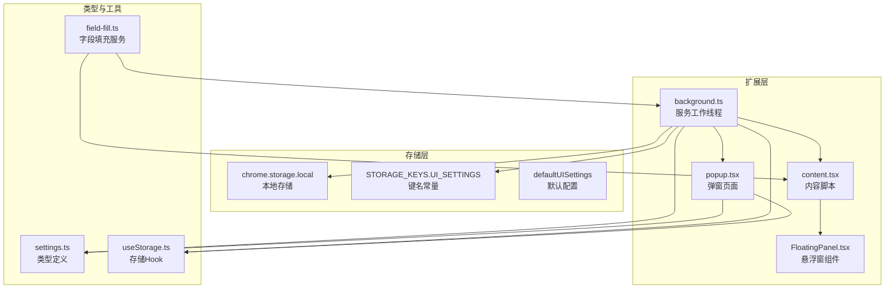
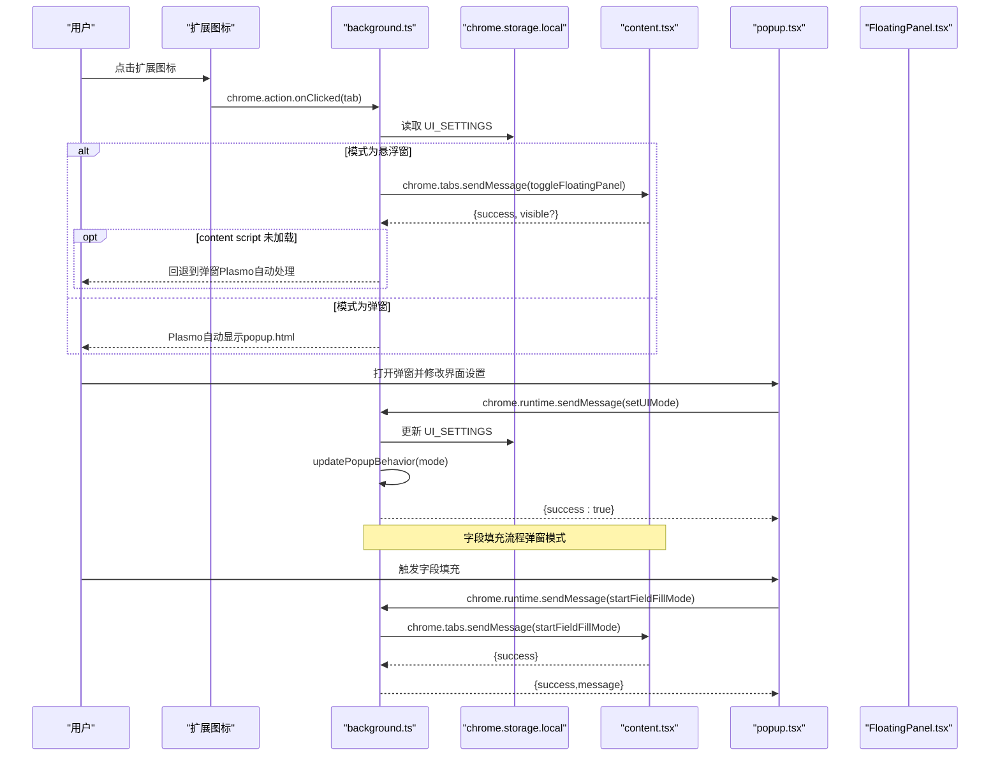
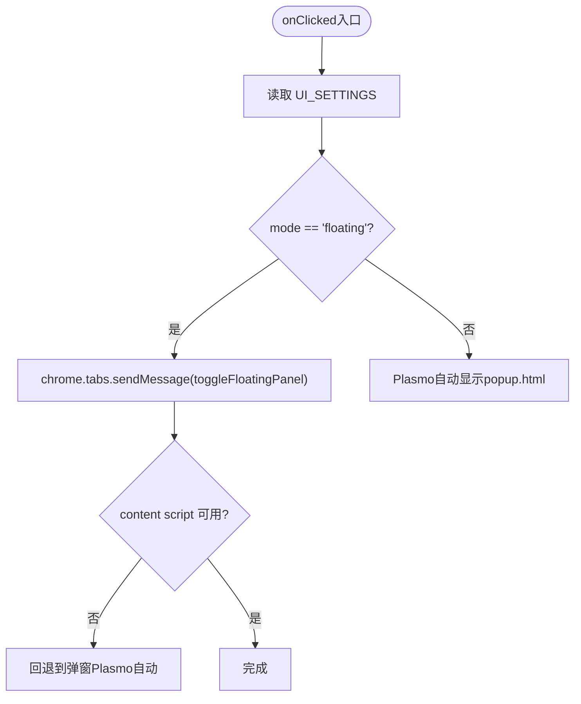
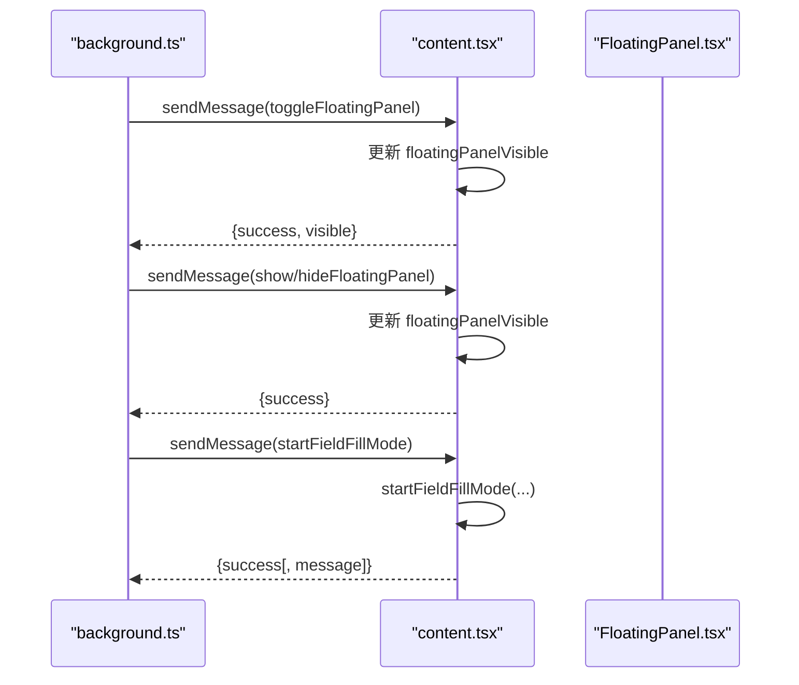
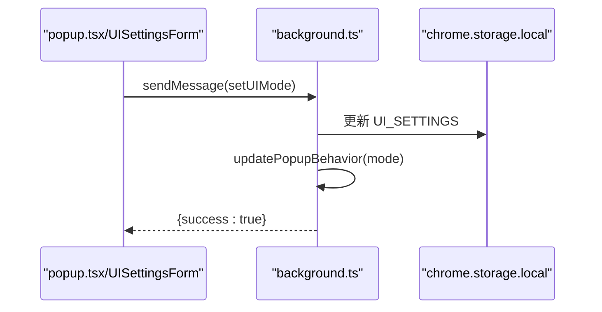
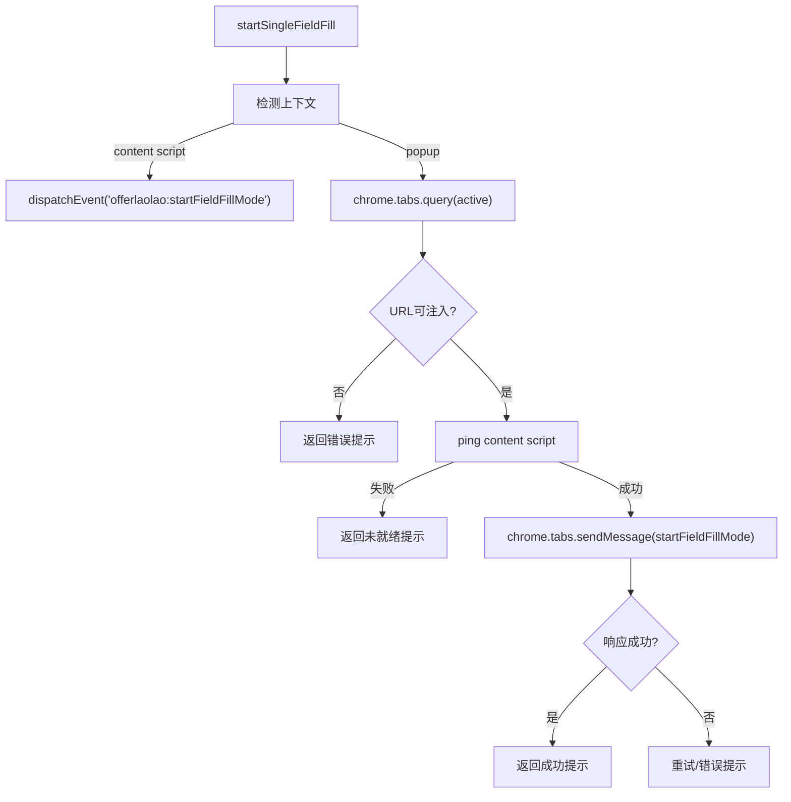
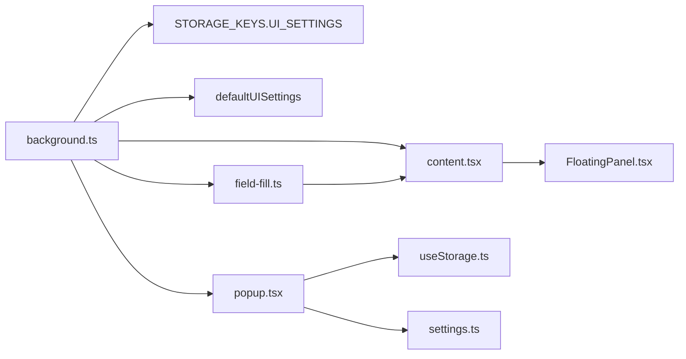

# Background脚本架构

<cite>
**本文引用的文件**
- [background.ts](file://src/background.ts)
- [content.tsx](file://src/content.tsx)
- [popup.tsx](file://src/popup.tsx)
- [field-fill.ts](file://src/services/field-fill.ts)
- [FloatingPanel.tsx](file://src/components/floating/FloatingPanel.tsx)
- [UISettingsForm.tsx](file://src/features/popup/settings/UISettingsForm.tsx)
- [settings.ts](file://src/types/settings.ts)
- [useStorage.ts](file://src/hooks/useStorage.ts)
- [package.json](file://package.json)
</cite>

## 目录
1. [引言](#引言)
2. [项目结构](#项目结构)
3. [核心组件](#核心组件)
4. [架构总览](#架构总览)
5. [详细组件分析](#详细组件分析)
6. [依赖关系分析](#依赖关系分析)
7. [性能考量](#性能考量)
8. [故障排查指南](#故障排查指南)
9. [结论](#结论)

## 引言
本文件系统性阐述 background.ts 在 Chrome 扩展中的核心控制作用，重点覆盖以下方面：
- 作为持久化服务工作线程，如何监听扩展图标点击事件并依据用户设置的 UI 模式（弹窗或悬浮窗）决定启动 popup 或注入 FloatingPanel。
- 消息路由机制：通过 chrome.runtime.onMessage 接收来自 popup 和 content script 的消息并进行分发处理。
- 如何读取存储中的 UISettings 配置以决定行为，并与 popup 的设置表单联动。
- 与 popup 和 content script 的通信模式：如何转发填充指令或同步状态变更。
- 在扩展生命周期中的角色：启动初始化与事件监听注册。
- 调试 background 脚本的方法与常见问题（如点击无响应）的解决方案。

## 项目结构
本扩展采用 Plasmo 架构，包含 background service worker、content script、popup 页面以及若干业务组件与服务模块。background.ts 位于 src 目录，是扩展的中枢控制器。

图表来源
- [background.ts](file://src/background.ts#L1-L78)
- [content.tsx](file://src/content.tsx#L1-L122)
- [popup.tsx](file://src/popup.tsx#L1-L300)
- [FloatingPanel.tsx](file://src/components/floating/FloatingPanel.tsx#L1-L414)
- [field-fill.ts](file://src/services/field-fill.ts#L1-L260)
- [settings.ts](file://src/types/settings.ts#L85-L107)
- [useStorage.ts](file://src/hooks/useStorage.ts#L90-L102)
- [package.json](file://package.json#L42-L64)

章节来源
- [background.ts](file://src/background.ts#L1-L78)
- [package.json](file://package.json#L42-L64)

## 核心组件
- background.ts：负责监听扩展图标点击、读取 UISettings、根据模式切换 popup 行为、处理来自 popup/content 的消息路由。
- content.tsx：在目标页面注入悬浮窗 UI 并处理字段填充模式、悬浮窗显示/隐藏等消息。
- popup.tsx：弹窗页面，包含简历填写、导出、设置等功能；其中 UISettingsForm 与 background 协作实现 UI 模式切换。
- FloatingPanel.tsx：悬浮窗面板组件，支持拖拽、最小化、多标签页内容。
- field-fill.ts：跨上下文的字段填充服务，统一处理“弹窗模式”和“悬浮窗模式”的消息发送与重试逻辑。
- settings.ts：定义 UISettings 类型与默认值。
- useStorage.ts：封装 chrome.storage.local 的读写与 onChanged 同步。
- package.json：声明 background.service_worker、权限与 host 权限。

章节来源
- [background.ts](file://src/background.ts#L1-L78)
- [content.tsx](file://src/content.tsx#L1-L122)
- [popup.tsx](file://src/popup.tsx#L1-L300)
- [FloatingPanel.tsx](file://src/components/floating/FloatingPanel.tsx#L1-L414)
- [field-fill.ts](file://src/services/field-fill.ts#L1-L260)
- [settings.ts](file://src/types/settings.ts#L85-L107)
- [useStorage.ts](file://src/hooks/useStorage.ts#L1-L102)
- [package.json](file://package.json#L42-L64)

## 架构总览
下面的序列图展示了扩展图标点击到 UI 模式切换的完整流程，以及消息路由的关键节点。

图表来源
- [background.ts](file://src/background.ts#L11-L29)
- [background.ts](file://src/background.ts#L31-L57)
- [content.tsx](file://src/content.tsx#L69-L122)
- [field-fill.ts](file://src/services/field-fill.ts#L115-L129)
- [field-fill.ts](file://src/services/field-fill.ts#L162-L259)
- [UISettingsForm.tsx](file://src/features/popup/settings/UISettingsForm.tsx#L31-L45)

## 详细组件分析

### background.ts：持久化服务工作线程
- 图标点击事件监听
  - 在 onClicked 中读取 UI_SETTINGS，若为悬浮窗模式则向 content script 发送 toggleFloatingPanel 消息；若 content script 未加载则回退到弹窗模式（由 Plasmo 自动处理）。
- 消息路由
  - onMessage 监听 getUIMode/setUIMode：
    - getUIMode：从存储读取当前模式并异步返回。
    - setUIMode：合并新模式写入存储，随后调用 updatePopupBehavior 更新 action.setPopup，最后异步返回成功。
- Popup 行为更新
  - updatePopupBehavior：当模式为悬浮窗时将 action.setPopup 设为空字符串，使点击图标触发 onClicked；否则恢复到 popup.html。
- 生命周期初始化
  - 启动时读取 UI_SETTINGS 并设置初始 popup 行为。

图表来源
- [background.ts](file://src/background.ts#L11-L29)

章节来源
- [background.ts](file://src/background.ts#L11-L29)
- [background.ts](file://src/background.ts#L31-L57)
- [background.ts](file://src/background.ts#L62-L76)

### content.tsx：目标页面注入与消息处理
- 消息监听
  - 支持 ping、toggleFloatingPanel、showFloatingPanel、hideFloatingPanel、startFieldFillMode 等动作，均返回异步响应。
  - 通过 window.addEventListener 直接处理悬浮窗模式下的自定义事件 offerlaolao:startFieldFillMode。
- 悬浮窗 UI
  - 通过 ContentUI 渲染 FloatingPanel，并维护 floatingPanelVisible 状态与回调。
- 字段填充模式
  - startFieldFillMode：启用鼠标事件监听，高亮可填充元素，点击后填充并提示，Esc 取消。
  - fillElement：兼容 input/textarea/select/contenteditable 等多种输入类型，触发必要事件以适配受控组件。

图表来源
- [content.tsx](file://src/content.tsx#L69-L122)
- [content.tsx](file://src/content.tsx#L128-L152)
- [content.tsx](file://src/content.tsx#L157-L216)
- [content.tsx](file://src/content.tsx#L330-L379)

章节来源
- [content.tsx](file://src/content.tsx#L49-L142)
- [content.tsx](file://src/content.tsx#L157-L216)
- [content.tsx](file://src/content.tsx#L330-L379)

### popup.tsx 与 UISettingsForm：UI 模式设置联动
- UISettingsForm
  - 通过 useStorage 读取/写入 UI_SETTINGS；当模式切换时调用 chrome.runtime.sendMessage({ action: "setUIMode", mode }) 通知 background 更新 popup 行为。
  - 切换提示语：在弹窗与悬浮窗之间切换时给出明确提示，帮助用户理解后续交互。
- popup 主体
  - 包含简历模板、上传、表单填写、导出等功能；与 FloatingPanel 共享部分 UI 组件与逻辑。

图表来源
- [UISettingsForm.tsx](file://src/features/popup/settings/UISettingsForm.tsx#L19-L45)
- [background.ts](file://src/background.ts#L42-L57)
- [background.ts](file://src/background.ts#L62-L70)

章节来源
- [popup.tsx](file://src/popup.tsx#L1-L300)
- [UISettingsForm.tsx](file://src/features/popup/settings/UISettingsForm.tsx#L19-L45)
- [useStorage.ts](file://src/hooks/useStorage.ts#L1-L88)
- [settings.ts](file://src/types/settings.ts#L85-L107)

### field-fill.ts：跨上下文字段填充服务
- 上下文检测
  - isContentScriptContext：在 content script 环境中直接触发自定义事件，避免使用 chrome.tabs.sendMessage。
- 弹窗模式路径
  - startSingleFieldFill：查询当前活动标签页，校验 URL 可注入性，先 ping 检查 content script 是否加载，再发送 startFieldFillMode 消息；内置重试与错误友好提示。
- 消息重试与错误处理
  - sendFieldFillMessage：最多重试两次，针对“端口关闭前无响应”等场景提供特殊处理，避免误判失败。

图表来源
- [field-fill.ts](file://src/services/field-fill.ts#L17-L25)
- [field-fill.ts](file://src/services/field-fill.ts#L43-L69)
- [field-fill.ts](file://src/services/field-fill.ts#L78-L136)
- [field-fill.ts](file://src/services/field-fill.ts#L138-L157)
- [field-fill.ts](file://src/services/field-fill.ts#L162-L259)

章节来源
- [field-fill.ts](file://src/services/field-fill.ts#L17-L25)
- [field-fill.ts](file://src/services/field-fill.ts#L43-L69)
- [field-fill.ts](file://src/services/field-fill.ts#L78-L136)
- [field-fill.ts](file://src/services/field-fill.ts#L138-L157)
- [field-fill.ts](file://src/services/field-fill.ts#L162-L259)

### FloatingPanel.tsx：悬浮窗 UI 与状态持久化
- 拖拽与最小化
  - 通过鼠标事件计算偏移并更新位置，保存到 UI_SETTINGS.floatingPosition；最小化状态保存到 UI_SETTINGS.floatingMinimized。
- 与 UISettings 的耦合
  - 读取 UI_SETTINGS 初始化面板位置与最小化状态；更新时写回存储，实现跨会话持久化。

章节来源
- [FloatingPanel.tsx](file://src/components/floating/FloatingPanel.tsx#L118-L171)
- [FloatingPanel.tsx](file://src/components/floating/FloatingPanel.tsx#L172-L207)
- [FloatingPanel.tsx](file://src/components/floating/FloatingPanel.tsx#L226-L235)
- [settings.ts](file://src/types/settings.ts#L85-L107)

## 依赖关系分析
- background.ts 依赖
  - 读取 UI_SETTINGS：来自 useStorage.ts 的 STORAGE_KEYS.UI_SETTINGS 与 defaultUISettings。
  - 与 content.tsx 的消息契约：toggleFloatingPanel/show/hide/startFieldFillMode/ping。
  - 与 popup.tsx 的消息契约：setUIMode/getUIMode。
- content.tsx 依赖
  - 与 background.ts 的消息契约一致；同时依赖 FloatingPanel.tsx 渲染悬浮窗。
- field-fill.ts 依赖
  - 与 background.ts 的消息契约一致；在 content script 环境下通过 window.dispatchEvent 直接调用字段填充逻辑。
- 存储与类型
  - UI_SETTINGS 的键名与默认值定义在 settings.ts；useStorage.ts 提供统一的读写与 onChanged 同步。

图表来源
- [background.ts](file://src/background.ts#L1-L78)
- [content.tsx](file://src/content.tsx#L1-L122)
- [popup.tsx](file://src/popup.tsx#L1-L300)
- [FloatingPanel.tsx](file://src/components/floating/FloatingPanel.tsx#L1-L414)
- [field-fill.ts](file://src/services/field-fill.ts#L1-L260)
- [useStorage.ts](file://src/hooks/useStorage.ts#L90-L102)
- [settings.ts](file://src/types/settings.ts#L85-L107)

章节来源
- [background.ts](file://src/background.ts#L1-L78)
- [content.tsx](file://src/content.tsx#L1-L122)
- [popup.tsx](file://src/popup.tsx#L1-L300)
- [FloatingPanel.tsx](file://src/components/floating/FloatingPanel.tsx#L1-L414)
- [field-fill.ts](file://src/services/field-fill.ts#L1-L260)
- [useStorage.ts](file://src/hooks/useStorage.ts#L90-L102)
- [settings.ts](file://src/types/settings.ts#L85-L107)

## 性能考量
- 消息路由异步化
  - background.ts 在处理 getUIMode/setUIMode 时使用异步存储读写，避免阻塞主线程。
- Popup 行为切换
  - 通过 chrome.action.setPopup 动态切换，减少不必要的页面重建。
- 字段填充重试
  - field-fill.ts 在网络波动或 content script 未完全就绪时进行有限重试，提升成功率与用户体验。
- 存储同步
  - useStorage.ts 监听 chrome.storage.onChanged，确保多实例间状态一致，降低竞态风险。

[本节为通用建议，不直接分析具体文件]

## 故障排查指南
- 点击无响应（悬浮窗模式）
  - 检查 content script 是否已注入：在目标页面打开开发者工具，确认 content.tsx 已加载并监听消息。
  - 若 ping 失败，尝试刷新页面后再试；field-fill.ts 中有明确的“页面脚本未就绪”提示。
  - 若 background.ts 抛出“content script not ready”，说明 content script 未加载，回退到弹窗模式。
- 切换 UI 模式无效
  - 确认 popup 中已发送 setUIMode 消息且 background.ts 成功写入存储。
  - 检查 background.ts 是否执行了 updatePopupBehavior，确保 action.setPopup 已更新。
- 字段填充失败
  - 确认当前 URL 可注入（非 chrome://、extension:// 等受限页面）。
  - 检查目标输入框是否为可填充类型（input/textarea/select/contenteditable 等）。
  - 若出现“端口关闭前无响应”，属于正常现象，按提示在页面中点击目标位置即可。
- 调试 background 脚本
  - 在浏览器扩展页面打开 background 页面，查看控制台日志。
  - 使用 chrome.runtime.sendMessage/chrome.tabs.sendMessage 的返回值与 lastError 进行定位。
  - 在 popup 中打印 UI_SETTINGS 的读取结果，确认存储键名与默认值一致。

章节来源
- [background.ts](file://src/background.ts#L11-L29)
- [field-fill.ts](file://src/services/field-fill.ts#L138-L157)
- [field-fill.ts](file://src/services/field-fill.ts#L162-L259)
- [content.tsx](file://src/content.tsx#L69-L122)

## 结论
background.ts 作为扩展的中枢控制器，承担了以下关键职责：
- 基于 UI_SETTINGS 决策 UI 展示形态（弹窗/悬浮窗），并在图标点击时即时生效。
- 通过 onMessage 与 onAction.setPopup 协同，实现弹窗与悬浮窗模式的无缝切换。
- 与 content.tsx、popup.tsx 形成清晰的消息契约，支撑字段填充、悬浮窗显示/隐藏等核心功能。
- 通过 useStorage.ts 与 settings.ts 的配合，保证配置持久化与类型安全。
- field-fill.ts 提供跨上下文的稳定填充服务，具备完善的错误处理与重试策略。

上述设计使得扩展在不同 UI 模式下保持一致的用户体验，并通过消息路由与存储同步实现可靠的跨组件协作。