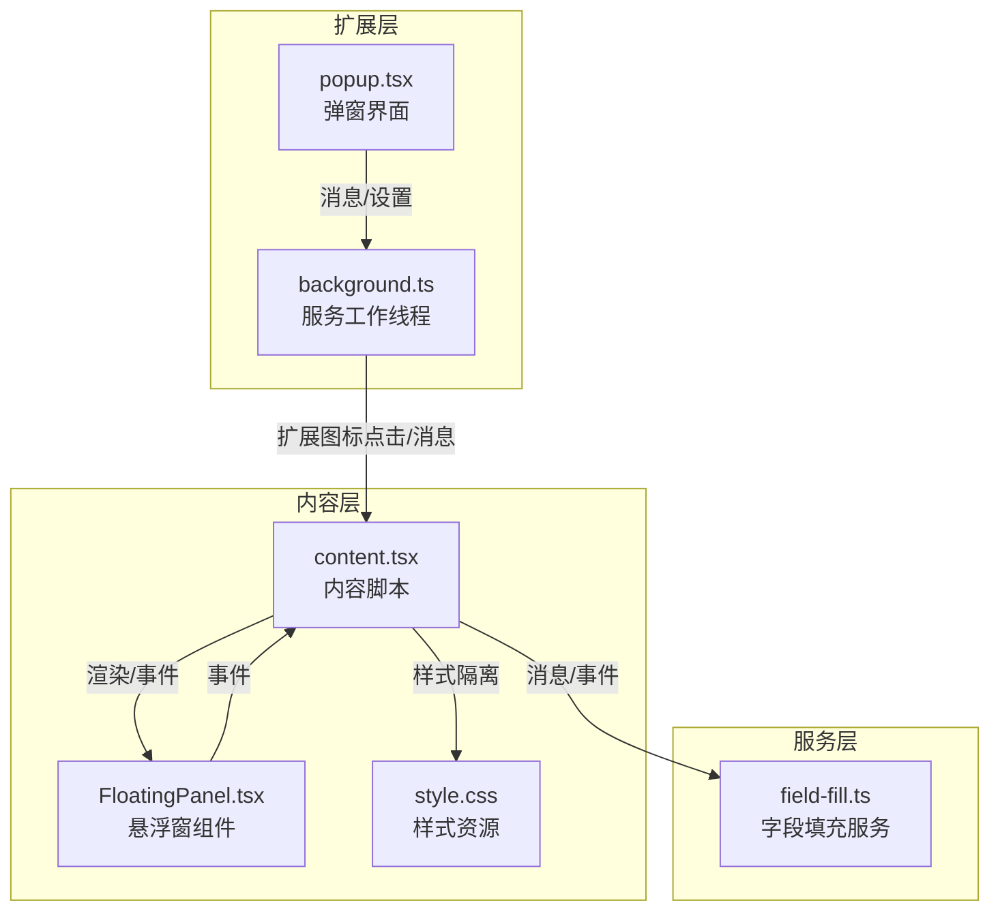
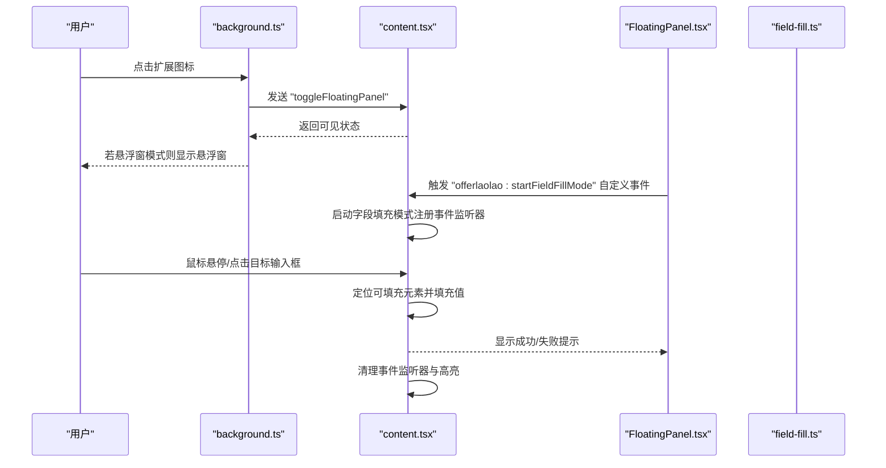
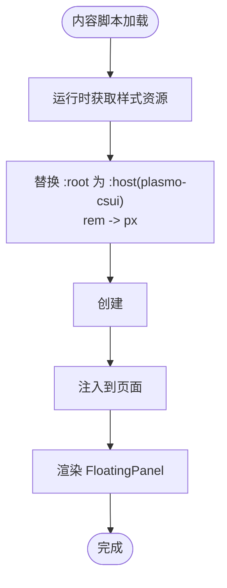
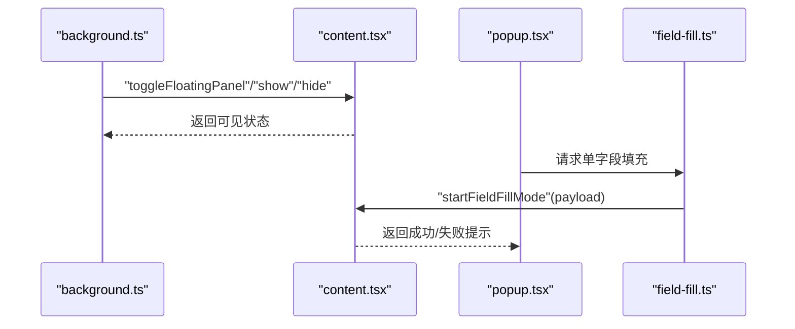
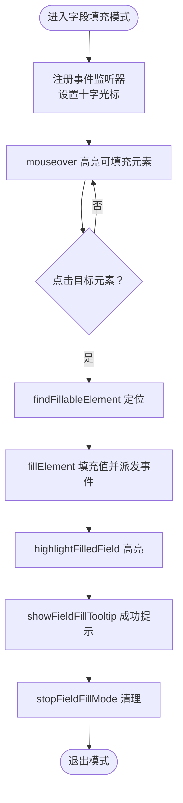
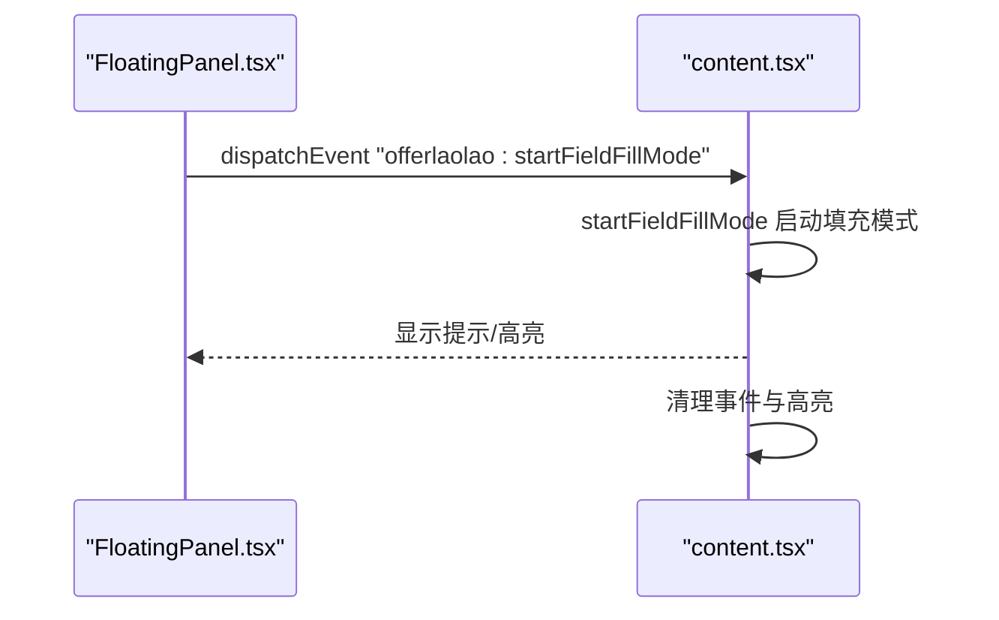
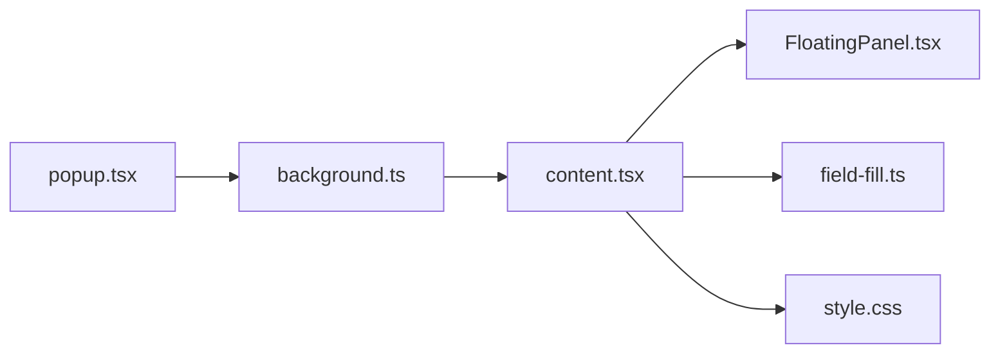

# 内容脚本架构

<cite>
**本文引用的文件**
- [content.tsx](file://src/content.tsx)
- [field-fill.ts](file://src/services/field-fill.ts)
- [background.ts](file://src/background.ts)
- [FloatingPanel.tsx](file://src/components/floating/FloatingPanel.tsx)
- [style.css](file://src/style.css)
- [popup.tsx](file://src/popup.tsx)
- [package.json](file://package.json)
</cite>

## 目录
1. [简介](#简介)
2. [项目结构](#项目结构)
3. [核心组件](#核心组件)
4. [架构总览](#架构总览)
5. [详细组件分析](#详细组件分析)
6. [依赖关系分析](#依赖关系分析)
7. [性能考量](#性能考量)
8. [故障排查指南](#故障排查指南)
9. [结论](#结论)

## 简介
本文围绕内容脚本 content.tsx 的注入机制与 DOM 交互能力进行深入分析，重点说明其如何借助 Plasmo 框架的 CSUI 能力在目标招聘网站页面上渲染 FloatingPanel 悬浮组件，并通过 Shadow DOM 与页面样式隔离；同时详述其消息监听机制，包括：
- 通过 chrome.runtime.onMessage 接收来自 background 的指令（如显示/隐藏悬浮窗、启动字段填充模式）；
- 通过 window.addEventListener 接收来自悬浮窗的自定义事件（悬浮窗模式下直接调用）；
- 调用 field-fill.ts 服务执行 DOM 操作实现表单填充。

此外，文档还涵盖：
- 与 background 的通信方式与安全考虑；
- 在不同网站的兼容性处理策略；
- 常见问题诊断步骤（内容脚本未注入、填充失败等）。

## 项目结构
本项目采用 Plasmo 框架组织内容脚本、悬浮窗组件与服务层，整体结构如下图所示：

图表来源
- [content.tsx](file://src/content.tsx#L1-L151)
- [FloatingPanel.tsx](file://src/components/floating/FloatingPanel.tsx#L118-L414)
- [field-fill.ts](file://src/services/field-fill.ts#L1-L260)
- [background.ts](file://src/background.ts#L1-L78)
- [style.css](file://src/style.css#L1-L118)

章节来源
- [content.tsx](file://src/content.tsx#L1-L151)
- [FloatingPanel.tsx](file://src/components/floating/FloatingPanel.tsx#L118-L414)
- [field-fill.ts](file://src/services/field-fill.ts#L1-L260)
- [background.ts](file://src/background.ts#L1-L78)
- [style.css](file://src/style.css#L1-L118)

## 核心组件
- 内容脚本 content.tsx
  - 通过 PlasmoCSConfig 的 matches 配置对所有 URL 注入；
  - 通过 getStyle 在运行时动态生成适配 Shadow DOM 的样式；
  - 维护悬浮窗显示状态与字段填充模式的全局状态；
  - 监听来自 background 的消息与来自悬浮窗的自定义事件；
  - 提供字段填充模式的核心算法：鼠标悬停高亮、点击定位、DOM 填充与反馈提示。
- 悬浮窗组件 FloatingPanel.tsx
  - 支持拖拽、最小化、关闭；
  - 内嵌弹窗式 UI（简历填写、设置等）；
  - 通过自定义事件向 content.tsx 传递字段填充请求。
- 字段填充服务 field-fill.ts
  - 在 popup 环境中通过 chrome.tabs.sendMessage 与 content.tsx 通信；
  - 提供 ping 检测、重试机制与错误友好提示；
  - 在 content-script 环境中直接触发自定义事件，避免跨进程通信。
- background.ts
  - 处理扩展图标点击事件，根据 UI 模式决定是否向 content.tsx 发送切换悬浮窗的消息；
  - 维护 UI 模式设置并通过 runtime.onMessage 响应设置变更；
  - 根据 UI 模式动态调整 action popup 行为。
- 样式 style.css
  - 通过 @layer 与 Tailwind 指令构建基础样式；
  - 通过 url: 导入并在 getStyle 中做 Shadow DOM 适配处理。

章节来源
- [content.tsx](file://src/content.tsx#L1-L151)
- [FloatingPanel.tsx](file://src/components/floating/FloatingPanel.tsx#L118-L414)
- [field-fill.ts](file://src/services/field-fill.ts#L1-L260)
- [background.ts](file://src/background.ts#L1-L78)
- [style.css](file://src/style.css#L1-L118)

## 架构总览
下面的序列图展示了“悬浮窗模式”下的关键交互流程，包括 background 与 content.tsx 的消息传递以及悬浮窗组件与 content.tsx 的事件交互。

图表来源
- [background.ts](file://src/background.ts#L11-L27)
- [content.tsx](file://src/content.tsx#L59-L122)
- [FloatingPanel.tsx](file://src/components/floating/FloatingPanel.tsx#L118-L414)
- [field-fill.ts](file://src/services/field-fill.ts#L27-L41)

章节来源
- [background.ts](file://src/background.ts#L11-L27)
- [content.tsx](file://src/content.tsx#L59-L122)
- [FloatingPanel.tsx](file://src/components/floating/FloatingPanel.tsx#L118-L414)
- [field-fill.ts](file://src/services/field-fill.ts#L27-L41)

## 详细组件分析

### 内容脚本注入与样式隔离
- 注入机制
  - content.tsx 通过 PlasmoCSConfig 的 matches: ["<all_urls>"] 对所有 URL 注入；
  - 通过 getStyle 运行时拉取 style.css 并将 :root 替换为 :host(plasmo-csui)，同时将 rem 单位转换为 px，保证在 Shadow DOM 中的样式一致性。
- 样式隔离
  - 通过将 CSS 以 <style> 形式注入到页面，配合 :host(...) 限定作用域，避免与目标页面样式冲突；
  - 通过固定尺寸与 z-index 策略，确保悬浮窗在页面层级上可见且不被遮挡。

图表来源
- [content.tsx](file://src/content.tsx#L8-L34)
- [style.css](file://src/style.css#L1-L118)

章节来源
- [content.tsx](file://src/content.tsx#L8-L34)
- [style.css](file://src/style.css#L1-L118)

### 消息监听与通信模型
- 来自 background 的消息
  - 支持 "ping"、"toggleFloatingPanel"、"showFloatingPanel"、"hideFloatingPanel"、"startFieldFillMode" 等动作；
  - "toggleFloatingPanel" 通过全局状态与回调函数同步 UI 可见性；
  - "startFieldFillMode" 调用字段填充模式入口函数。
- 来自悬浮窗的自定义事件
  - 当 UI 模式为悬浮窗时，FloatingPanel.tsx 通过 window.dispatchEvent 触发 "offerlaolao:startFieldFillMode"，content.tsx 监听并启动字段填充模式。
- 与 field-fill.ts 的协作
  - 在 popup 环境中，field-fill.ts 通过 chrome.tabs.sendMessage 与 content.tsx 通信；
  - 在 content-script 环境中，直接触发自定义事件，避免跨进程通信开销。

图表来源
- [background.ts](file://src/background.ts#L11-L27)
- [content.tsx](file://src/content.tsx#L69-L122)
- [field-fill.ts](file://src/services/field-fill.ts#L59-L204)

章节来源
- [background.ts](file://src/background.ts#L11-L27)
- [content.tsx](file://src/content.tsx#L69-L122)
- [field-fill.ts](file://src/services/field-fill.ts#L59-L204)

### 字段填充模式与 DOM 交互
- 模式启动与状态管理
  - startFieldFillMode 接收字段数据，保存 pendingFieldFill 并启用字段填充模式；
  - enableFieldFillMode 注册 mouseover/mouseout/click/keydown 事件监听器，设置光标为十字准星；
  - stopFieldFillModeCleanup/stopFieldFillMode 负责清理事件与 UI。
- 元素定位与可填充判定
  - findFillableElement 向父节点向上遍历最多 5 层，判断是否为 input/textarea/select 或 contenteditable/role 为 textbox/combobox/searchbox；
  - isFillableElement 统一判定规则，覆盖常见可编辑元素类型。
- 填充实现与事件触发
  - fillElement 根据元素类型分别设置值并派发 input/change/blur 等事件；
  - 针对受控组件，通过原生 setter 触发 React 内部状态更新；
  - highlightFilledField 对已填充元素进行短暂高亮提示；
  - showFieldFillTooltip/hideFieldFillTooltip 提供信息/成功/错误提示。
- 交互流程

图表来源
- [content.tsx](file://src/content.tsx#L166-L454)

章节来源
- [content.tsx](file://src/content.tsx#L166-L454)

### 悬浮窗组件与渲染
- FloatingPanel.tsx
  - 支持拖拽、最小化、关闭；
  - 内置标签页（简历填写/设置），集成模板选择、简历上传、导出等功能；
  - 通过自定义事件向 content.tsx 传递字段填充请求，从而在悬浮窗模式下直接启动字段填充。
- 渲染与可见性控制
  - content.tsx 通过 useState 与 setFloatingPanelVisibleCallback 控制 FloatingPanel 的显示/隐藏；
  - background.ts 根据 UI 模式动态设置 action popup，悬浮窗模式下点击图标由 content.tsx 处理。

图表来源
- [FloatingPanel.tsx](file://src/components/floating/FloatingPanel.tsx#L118-L414)
- [content.tsx](file://src/content.tsx#L59-L122)

章节来源
- [FloatingPanel.tsx](file://src/components/floating/FloatingPanel.tsx#L118-L414)
- [content.tsx](file://src/content.tsx#L59-L122)

### 与 background 的通信方式与安全考虑
- 通信方式
  - background.ts 监听扩展图标点击，若 UI 模式为悬浮窗，则向 content.tsx 发送 "toggleFloatingPanel"；
  - background.ts 通过 runtime.onMessage 响应 "getUIMode"/"setUIMode"，并根据模式动态设置 action popup；
  - popup.tsx 通过 runtime.sendMessage 设置 UI 模式，background.ts 更新 popup 行为。
- 安全考虑
  - 仅在允许的页面（非 chrome://、chrome-extension://、edge://、about:、moz-extension://）执行字段填充；
  - 使用 ping 检测 content.tsx 是否已注入，避免在不可用页面上发起消息；
  - 对 chrome.runtime.lastError 进行分类处理，提供友好提示并支持有限重试；
  - 通过自定义事件在悬浮窗模式下避免跨进程通信，降低安全风险。

章节来源
- [background.ts](file://src/background.ts#L11-L78)
- [field-fill.ts](file://src/services/field-fill.ts#L94-L157)
- [content.tsx](file://src/content.tsx#L69-L122)

### 兼容性处理策略
- 页面类型限制
  - field-fill.ts 在 popup 环境中检查 tabUrl，排除浏览器内置页面与扩展页面，避免在这些页面执行注入；
- 内容脚本注入时机
  - 通过 ping 检测 content.tsx 是否已加载，若未加载提示刷新页面后再试；
- DOM 元素类型适配
  - 支持 input/textarea/select 与 contenteditable/role 为 textbox/combobox/searchbox 的元素；
  - 对受控组件使用原生 setter 触发 React 内部状态更新；
- 样式隔离
  - 通过 getStyle 将 :root 替换为 :host(plasmo-csui)，rem 转 px，确保悬浮窗样式在 Shadow DOM 下正常渲染。

章节来源
- [field-fill.ts](file://src/services/field-fill.ts#L94-L157)
- [content.tsx](file://src/content.tsx#L166-L454)
- [style.css](file://src/style.css#L1-L118)

## 依赖关系分析
- 内容脚本依赖
  - 依赖 FloatingPanel 组件进行 UI 渲染；
  - 依赖 field-fill 服务在 popup 环境中进行跨标签页通信；
  - 依赖 background 提供 UI 模式与悬浮窗显示控制。
- 组件耦合度
  - content.tsx 与 FloatingPanel.tsx 通过自定义事件解耦，耦合度低；
  - field-fill.ts 与 content.tsx 通过消息/事件两种路径解耦，提升兼容性。

图表来源
- [content.tsx](file://src/content.tsx#L1-L151)
- [FloatingPanel.tsx](file://src/components/floating/FloatingPanel.tsx#L118-L414)
- [field-fill.ts](file://src/services/field-fill.ts#L1-L260)
- [background.ts](file://src/background.ts#L1-L78)
- [style.css](file://src/style.css#L1-L118)

章节来源
- [content.tsx](file://src/content.tsx#L1-L151)
- [FloatingPanel.tsx](file://src/components/floating/FloatingPanel.tsx#L118-L414)
- [field-fill.ts](file://src/services/field-fill.ts#L1-L260)
- [background.ts](file://src/background.ts#L1-L78)
- [style.css](file://src/style.css#L1-L118)

## 性能考量
- 事件监听器粒度
  - 字段填充模式仅在启用期间注册 mouseover/mouseout/click/keydown，避免常驻监听带来的性能损耗；
- DOM 操作最小化
  - 仅对可填充元素设置 outline/背景色高亮，完成后及时恢复；
  - 通过原生 setter 与事件派发减少不必要的框架重渲染。
- 样式处理
  - 运行时一次性生成并注入样式，避免重复计算与多次 DOM 修改。

[本节为通用性能建议，不直接分析具体文件]

## 故障排查指南
- 内容脚本未注入
  - 现象：popup 环境调用字段填充时报错“页面脚本未就绪，请刷新当前网页后重试”；
  - 排查：确认页面 URL 非浏览器内置页面或扩展页面；尝试刷新页面后重试；检查 manifest 权限与 web_accessible_resources。
  - 参考
    - [field-fill.ts](file://src/services/field-fill.ts#L115-L125)
    - [package.json](file://package.json#L41-L65)
- 填充失败
  - 现象：tooltip 显示“填充失败，请重试”；
  - 排查：确认目标元素是否为可填充类型（input/textarea/select 或 contenteditable/特定 role）；检查是否为受控组件；尝试再次点击目标元素；查看控制台是否有异常。
  - 参考
    - [content.tsx](file://src/content.tsx#L245-L379)
- 悬浮窗无法显示
  - 现象：扩展图标点击无反应或悬浮窗不出现；
  - 排查：确认 UI 模式为悬浮窗；检查 background 是否成功发送 "toggleFloatingPanel"；确认 content.tsx 是否已加载。
  - 参考
    - [background.ts](file://src/background.ts#L11-L27)
    - [content.tsx](file://src/content.tsx#L69-L122)
- popup 与悬浮窗模式切换
  - 现象：切换后行为不符合预期；
  - 排查：确认 popup 通过 runtime.sendMessage 设置 UI 模式；检查 background 是否正确更新 action popup。
  - 参考
    - [background.ts](file://src/background.ts#L31-L78)
    - [popup.tsx](file://src/popup.tsx#L1-L300)

章节来源
- [field-fill.ts](file://src/services/field-fill.ts#L115-L125)
- [package.json](file://package.json#L41-L65)
- [content.tsx](file://src/content.tsx#L245-L379)
- [background.ts](file://src/background.ts#L11-L78)
- [popup.tsx](file://src/popup.tsx#L1-L300)

## 结论
content.tsx 通过 Plasmo CSUI 在目标页面上安全、稳定地渲染 FloatingPanel 悬浮组件，并以 Shadow DOM 隔离样式，避免与页面冲突。其消息监听机制与 field-fill.ts 服务协同，既能在 popup 环境中通过跨标签页通信实现字段填充，也能在悬浮窗模式下通过自定义事件直接启动填充流程。通过对页面类型、注入时机与 DOM 元素类型的兼容性处理，系统在不同招聘网站上具备良好的鲁棒性。针对常见问题，建议优先检查内容脚本注入状态、目标元素类型与 UI 模式设置，以快速定位并解决问题。