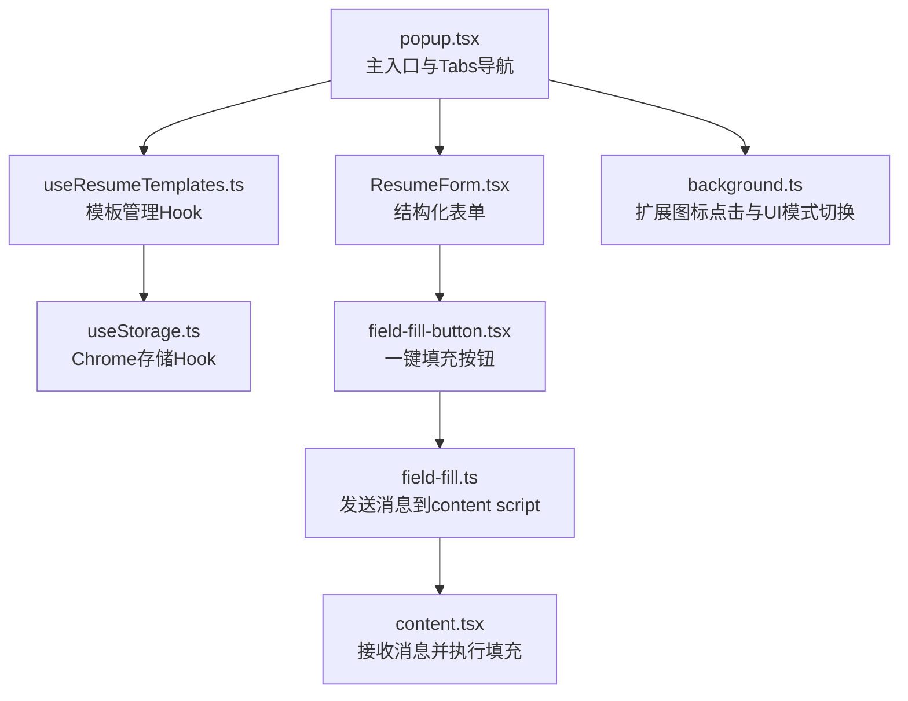
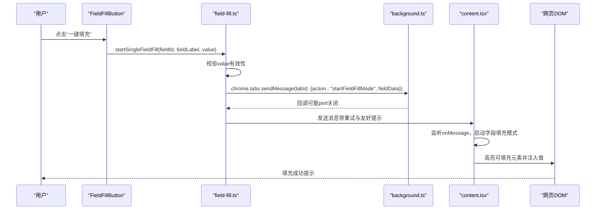
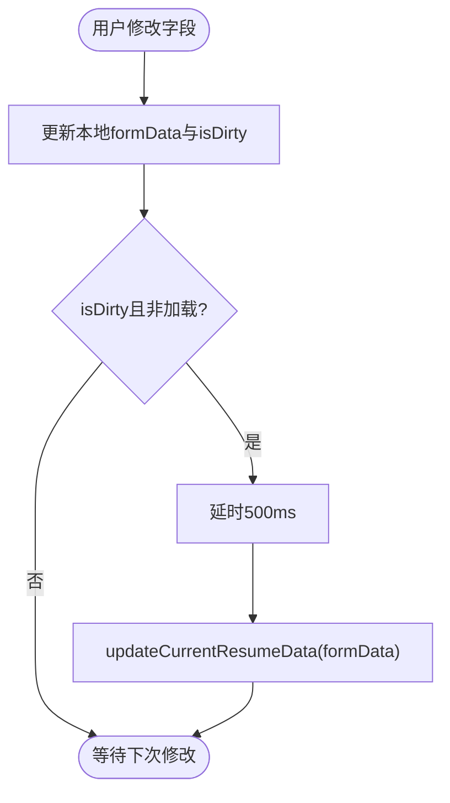
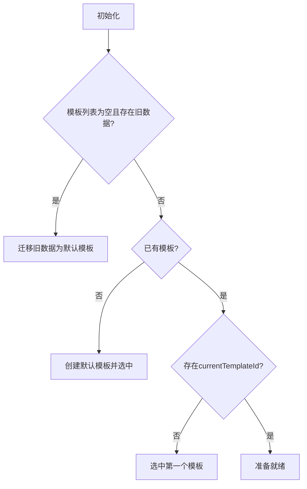
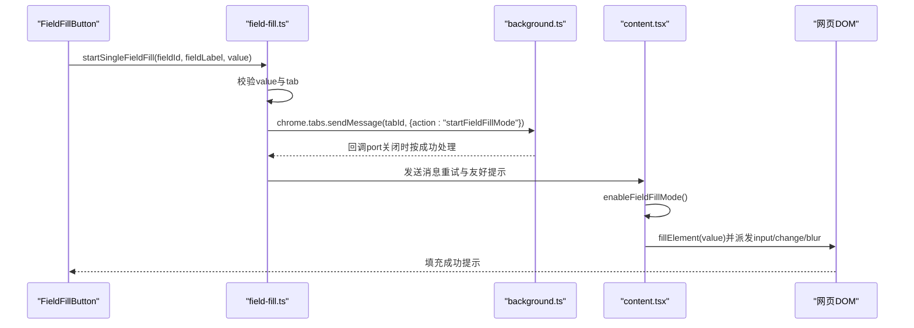
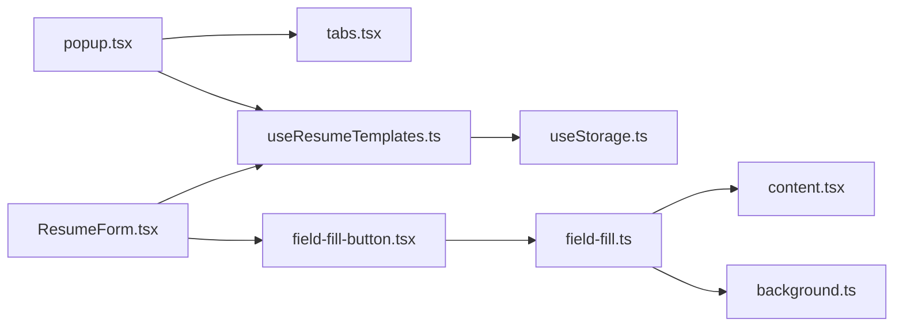

# Popup组件架构

<cite>
**本文引用的文件**
- [popup.tsx](file://src/popup.tsx)
- [ResumeForm.tsx](file://src/features/popup/ResumeForm.tsx)
- [useResumeTemplates.ts](file://src/hooks/useResumeTemplates.ts)
- [useStorage.ts](file://src/hooks/useStorage.ts)
- [field-fill.ts](file://src/services/field-fill.ts)
- [content.tsx](file://src/content.tsx)
- [background.ts](file://src/background.ts)
- [tabs.tsx](file://src/components/ui/tabs.tsx)
- [field-fill-button.tsx](file://src/components/ui/field-fill-button.tsx)
- [field-config.ts](file://src/config/field-config.ts)
- [resume.ts](file://src/types/resume.ts)
</cite>

## 目录
1. [简介](#简介)
2. [项目结构](#项目结构)
3. [核心组件](#核心组件)
4. [架构总览](#架构总览)
5. [详细组件分析](#详细组件分析)
6. [依赖关系分析](#依赖关系分析)
7. [性能考量](#性能考量)
8. [故障排查指南](#故障排查指南)
9. [结论](#结论)

## 简介
本文件深入解析 popup.tsx 作为插件主界面的架构设计，重点说明其作为 React 应用入口如何通过 App 级组件组织 UI 布局，使用 Tabs 组件实现“简历填写”“设置”“导出”等模块导航；详解 ResumeForm.tsx 如何构建结构化表单，结合字段配置与动态列表实现多段经历与技能等复杂数据的编辑；剖析 useResumeTemplates 自定义 Hook 如何实现多简历模板的增删改查与切换逻辑，并通过 useStorage 与 Chrome 存储持久化数据；结合代码示例展示表单数据流从用户输入→Hook 状态→存储的同步过程；说明与 background 和 content script 的通信机制，例如点击“一键填充”时如何通过 chrome.runtime.sendMessage 发送指令；最后提供常见问题如表单未保存、模板切换失败的排查思路。

## 项目结构
- popup.tsx 是插件的主入口，负责组织顶部标题栏、底部 Tabs 导航、模板选择器、简历上传区、表单区与导出按钮。
- ResumeForm.tsx 负责渲染完整的简历表单，包含静态字段与多段动态列表（教育、工作/实习、项目、技能、语言、自定义字段）。
- useResumeTemplates.ts 提供模板管理能力，包括迁移旧数据、增删改查、切换当前模板、更新当前模板数据。
- useStorage.ts 封装 Chrome 存储读写与变更监听，统一处理开发环境降级到 localStorage 的场景。
- field-fill.ts 与 content.tsx、background.ts 协作，实现“一键填充”功能，从 popup 发送消息到 content script，再由 content script 注入网页输入框。

图表来源
- [popup.tsx](file://src/popup.tsx#L124-L299)
- [ResumeForm.tsx](file://src/features/popup/ResumeForm.tsx#L227-L781)
- [useResumeTemplates.ts](file://src/hooks/useResumeTemplates.ts#L1-L258)
- [useStorage.ts](file://src/hooks/useStorage.ts#L1-L102)
- [field-fill-button.tsx](file://src/components/ui/field-fill-button.tsx#L1-L121)
- [field-fill.ts](file://src/services/field-fill.ts#L1-L260)
- [content.tsx](file://src/content.tsx#L1-L454)
- [background.ts](file://src/background.ts#L1-L80)

章节来源
- [popup.tsx](file://src/popup.tsx#L124-L299)
- [ResumeForm.tsx](file://src/features/popup/ResumeForm.tsx#L227-L781)
- [useResumeTemplates.ts](file://src/hooks/useResumeTemplates.ts#L1-L258)
- [useStorage.ts](file://src/hooks/useStorage.ts#L1-L102)
- [field-fill.ts](file://src/services/field-fill.ts#L1-L260)
- [content.tsx](file://src/content.tsx#L1-L454)
- [background.ts](file://src/background.ts#L1-L80)

## 核心组件
- App 级组件（popup.tsx）
  - 使用 Tabs 组织“简历填写”“设置”两个主要模块。
  - 通过 useResumeTemplates 管理模板集合与当前模板数据，驱动表单初始值与自动保存。
  - 提供“上传简历”区域，解析完成后将数据合并到当前模板数据。
  - 提供“导出简历”对话框入口。
- 表单组件（ResumeForm.tsx）
  - 以字段配置驱动渲染，支持静态字段与动态列表。
  - 通过本地状态与模板状态双向同步，实现自动保存与重置。
  - 提供“AI 一键优化”入口，配合 StarGate 验证。
- 模板管理 Hook（useResumeTemplates.ts）
  - 负责模板迁移、增删改查、切换当前模板、更新当前模板数据。
  - 与 useStorage 协作，保证数据持久化与跨实例同步。
- 存储 Hook（useStorage.ts）
  - 统一封装 Chrome storage/localStorage 读写与 onChanged 监听。
- 一键填充链路
  - FieldFillButton 触发 startSingleFieldFill，通过 chrome.tabs.sendMessage 发送到 content script，content script 执行 DOM 注入与事件派发。

章节来源
- [popup.tsx](file://src/popup.tsx#L124-L299)
- [ResumeForm.tsx](file://src/features/popup/ResumeForm.tsx#L227-L781)
- [useResumeTemplates.ts](file://src/hooks/useResumeTemplates.ts#L1-L258)
- [useStorage.ts](file://src/hooks/useStorage.ts#L1-L102)
- [field-fill-button.tsx](file://src/components/ui/field-fill-button.tsx#L1-L121)
- [field-fill.ts](file://src/services/field-fill.ts#L1-L260)
- [content.tsx](file://src/content.tsx#L1-L454)

## 架构总览
下面的序列图展示了“一键填充”的端到端流程，从用户点击按钮到网页输入框被成功赋值。

图表来源
- [field-fill-button.tsx](file://src/components/ui/field-fill-button.tsx#L1-L121)
- [field-fill.ts](file://src/services/field-fill.ts#L1-L260)
- [background.ts](file://src/background.ts#L1-L80)
- [content.tsx](file://src/content.tsx#L1-L454)

## 详细组件分析

### App级组件：popup.tsx
- 结构与布局
  - 顶部渐变色标题栏，包含插件图标与标题。
  - Tabs 导航包含“简历填写”“设置”两个选项卡。
  - “简历填写”页包含：
    - 模板选择器（TemplateSelector）：支持切换、新增、重命名、删除、复制模板。
    - 简历上传区（ResumeUpload）：解析后回调 handleParsedData，将解析结果与当前模板数据合并并自动更新。
    - 表单区（ResumeForm）：渲染完整简历表单。
    - 导出按钮：打开 ExportDialog。
  - “设置”页包含界面设置、模型设置、解析设置三部分。
- 数据流
  - 通过 useResumeTemplates 获取 currentResumeData 并传给表单组件。
  - 解析回调 handleParsedData 将解析数据与现有数据合并，调用 updateCurrentResumeData 写入模板存储。
  - 设置页的保存通过 handleSaveSettings 展示提示，实际设置持久化由对应设置表单内部完成。

章节来源
- [popup.tsx](file://src/popup.tsx#L124-L299)

### 表单组件：ResumeForm.tsx
- 字段配置驱动
  - 使用 field-config.ts 中的静态字段配置与动态列表配置，分别渲染基本信息、求职期望、自我介绍、教育经历、工作/实习经历、项目经历、技能、语言能力、自定义字段等。
- 动态列表与通用处理器
  - createListHandlers 生成通用的 update/add/remove 处理器，分别作用于教育、工作/实习、项目、技能、语言、自定义字段列表。
- 自动保存与重置
  - 组件内部维护 formData 与 isDirty，当 isDirty 且非加载状态时，延时 500ms 调用 updateCurrentResumeData 持久化。
  - 支持重置为默认值并提示。
- 一键填充按钮
  - 每个输入/选择/日期/文本域右侧提供 FieldFillButton，点击后调用 startSingleFieldFill，将当前值注入网页对应字段。
- 优化与解锁
  - 提供“AI 一键优化”按钮，未解锁时弹出 StarGateDialog，解锁后打开 OptimizeDialog。

图表来源
- [ResumeForm.tsx](file://src/features/popup/ResumeForm.tsx#L227-L360)
- [useResumeTemplates.ts](file://src/hooks/useResumeTemplates.ts#L170-L192)

章节来源
- [ResumeForm.tsx](file://src/features/popup/ResumeForm.tsx#L227-L781)
- [field-config.ts](file://src/config/field-config.ts#L1-L400)
- [resume.ts](file://src/types/resume.ts#L1-L212)

### 模板管理 Hook：useResumeTemplates.ts
- 数据迁移
  - 若模板列表为空且存在旧版 resumeData，则迁移为默认模板；否则创建默认模板并选中。
  - 若存在模板但未选中任何模板，则选中第一个。
- 模板操作
  - switchTemplate：切换当前模板。
  - addTemplate：新增模板，可选择复制当前模板数据。
  - renameTemplate：重命名模板。
  - deleteTemplate：删除模板（至少保留一个）。
  - duplicateTemplate：复制模板并选中。
  - updateCurrentResumeData：更新当前模板的数据并记录更新时间。
- 与存储交互
  - 通过 useStorage 读取/写入 RESUME_TEMPLATES 键，实现跨实例同步与持久化。

图表来源
- [useResumeTemplates.ts](file://src/hooks/useResumeTemplates.ts#L1-L120)

章节来源
- [useResumeTemplates.ts](file://src/hooks/useResumeTemplates.ts#L1-L258)
- [useStorage.ts](file://src/hooks/useStorage.ts#L1-L102)
- [resume.ts](file://src/types/resume.ts#L164-L212)

### 存储 Hook：useStorage.ts
- 功能
  - 从 chrome.storage.local 或开发环境的 localStorage 读取初始值。
  - 监听 onChanged 事件，同步其他实例的更新。
  - 提供 updateValue 方法异步写入存储，兼容开发环境降级。
- 常量键
  - STORAGE_KEYS 包含 RESUME_TEMPLATES、RESUME_DATA、MODEL_SETTINGS、PARSE_SETTINGS、UI_SETTINGS、STAR_GATE 等键名。

章节来源
- [useStorage.ts](file://src/hooks/useStorage.ts#L1-L102)

### Tabs 组件：tabs.tsx
- 设计
  - 使用上下文传递当前选中值与变更回调，实现 TabsList/TabsTrigger/TabsContent 的协作。
  - TabsTrigger 根据 isSelected 切换样式，TabsContent 根据 value 渲染对应内容。
- 用途
  - popup.tsx 中用于切换“简历填写”“设置”。

章节来源
- [tabs.tsx](file://src/components/ui/tabs.tsx#L1-L107)
- [popup.tsx](file://src/popup.tsx#L189-L293)

### 一键填充：FieldFillButton 与链路
- FieldFillButton
  - 从父组件获取 getValue，点击后调用 startSingleFieldFill，显示成功/错误提示。
- field-fill.ts
  - startSingleFieldFill：校验值、查询活动标签页、检测 content script 是否就绪、发送消息、带重试与友好提示。
- content.tsx
  - 监听 onMessage，启动字段填充模式，高亮可填充元素并注入值，支持键盘取消。
- background.ts
  - 监听扩展图标点击，根据 UI 设置决定显示 popup 或悬浮窗；同时处理 UI 模式切换的消息。

图表来源
- [field-fill-button.tsx](file://src/components/ui/field-fill-button.tsx#L1-L121)
- [field-fill.ts](file://src/services/field-fill.ts#L1-L260)
- [content.tsx](file://src/content.tsx#L1-L454)
- [background.ts](file://src/background.ts#L1-L80)

章节来源
- [field-fill-button.tsx](file://src/components/ui/field-fill-button.tsx#L1-L121)
- [field-fill.ts](file://src/services/field-fill.ts#L1-L260)
- [content.tsx](file://src/content.tsx#L1-L454)
- [background.ts](file://src/background.ts#L1-L80)

## 依赖关系分析
- 组件耦合
  - popup.tsx 依赖 useResumeTemplates 提供的模板状态与操作方法，依赖 Tabs 组件组织导航。
  - ResumeForm.tsx 依赖 useResumeTemplates 获取当前模板数据，依赖字段配置与动态列表处理器。
  - FieldFillButton 依赖 field-fill.ts 发送消息。
- 存储依赖
  - useResumeTemplates 依赖 useStorage 读写模板数据。
  - useStorage 依赖 chrome.storage 或 localStorage。
- 通信依赖
  - field-fill.ts 依赖 chrome.tabs.sendMessage 与 content script 通信。
  - background.ts 依赖 chrome.action.onClicked 与 chrome.runtime.onMessage。

图表来源
- [popup.tsx](file://src/popup.tsx#L124-L299)
- [ResumeForm.tsx](file://src/features/popup/ResumeForm.tsx#L227-L781)
- [useResumeTemplates.ts](file://src/hooks/useResumeTemplates.ts#L1-L258)
- [useStorage.ts](file://src/hooks/useStorage.ts#L1-L102)
- [field-fill-button.tsx](file://src/components/ui/field-fill-button.tsx#L1-L121)
- [field-fill.ts](file://src/services/field-fill.ts#L1-L260)
- [content.tsx](file://src/content.tsx#L1-L454)
- [background.ts](file://src/background.ts#L1-L80)

章节来源
- [popup.tsx](file://src/popup.tsx#L124-L299)
- [ResumeForm.tsx](file://src/features/popup/ResumeForm.tsx#L227-L781)
- [useResumeTemplates.ts](file://src/hooks/useResumeTemplates.ts#L1-L258)
- [useStorage.ts](file://src/hooks/useStorage.ts#L1-L102)
- [field-fill.ts](file://src/services/field-fill.ts#L1-L260)
- [content.tsx](file://src/content.tsx#L1-L454)
- [background.ts](file://src/background.ts#L1-L80)

## 性能考量
- 自动保存节流
  - ResumeForm.tsx 通过 500ms 延时避免频繁写入存储，减少存储压力与 UI 抖动。
- 模板迁移一次性
  - useResumeTemplates.ts 在首次加载时完成旧数据迁移与默认模板创建，避免后续每次渲染重复计算。
- 存储监听去抖
  - useStorage.ts 通过 onChanged 监听存储变化，避免手动轮询。
- DOM 注入优化
  - content.tsx 在注入值后派发 input/change/blur 事件，提升框架对受控组件的识别概率，减少二次触发成本。

## 故障排查指南
- 表单未保存
  - 现象：修改后未看到持久化。
  - 排查要点：
    - 确认 isDirty 是否为 true，且非加载状态。
    - 检查 updateCurrentResumeData 是否被调用（可通过断点或日志确认）。
    - 检查 useStorage 是否成功写入（开发环境检查 localStorage）。
  - 参考路径
    - [ResumeForm.tsx](file://src/features/popup/ResumeForm.tsx#L274-L283)
    - [useResumeTemplates.ts](file://src/hooks/useResumeTemplates.ts#L170-L192)
    - [useStorage.ts](file://src/hooks/useStorage.ts#L61-L88)

- 模板切换失败
  - 现象：切换模板后数据未更新或报错。
  - 排查要点：
    - 确认 templatesStorage.templates 中存在目标模板 ID。
    - 检查 switchTemplate 是否被调用，currentTemplateId 是否更新。
    - 检查 currentResumeData 是否正确取自当前模板。
  - 参考路径
    - [useResumeTemplates.ts](file://src/hooks/useResumeTemplates.ts#L94-L105)
    - [useResumeTemplates.ts](file://src/hooks/useResumeTemplates.ts#L82-L93)

- 一键填充失败
  - 现象：点击“一键填充”无响应或提示“页面脚本未加载”。
  - 排查要点：
    - 确认当前页面 URL 是否支持注入（排除 chrome://、about: 等）。
    - 确认 content script 是否已注入（Plasmo 自动注入，需刷新页面）。
    - 检查 chrome.tabs.sendMessage 返回的错误信息，必要时重试。
    - 检查 content script 是否监听到消息并启动字段填充模式。
  - 参考路径
    - [field-fill.ts](file://src/services/field-fill.ts#L94-L136)
    - [field-fill.ts](file://src/services/field-fill.ts#L162-L259)
    - [content.tsx](file://src/content.tsx#L69-L122)
    - [content.tsx](file://src/content.tsx#L157-L215)

- UI 模式切换异常
  - 现象：点击扩展图标后未显示悬浮窗或 popup。
  - 排查要点：
    - 检查 background.ts 是否根据 UI 设置正确 setPopup。
    - 检查 UI 设置键值是否正确写入存储。
  - 参考路径
    - [background.ts](file://src/background.ts#L1-L80)

## 结论
popup.tsx 通过清晰的 Tabs 导航与 useResumeTemplates 的模板体系，构建了可扩展的简历填写入口；ResumeForm.tsx 以字段配置与动态列表为核心，实现了结构化与可扩展的表单编辑体验；useResumeTemplates 与 useStorage 的组合确保了数据的持久化与跨实例同步；一键填充链路由 FieldFillButton 触发，经由 field-fill.ts 与 content.tsx 协作完成，具备良好的错误提示与重试机制。整体架构层次清晰、职责分离明确，便于维护与扩展。