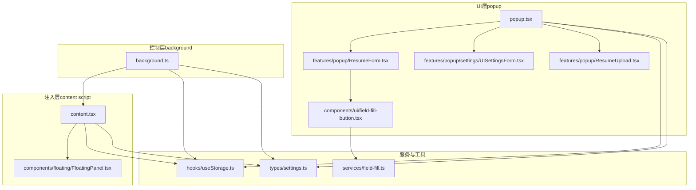
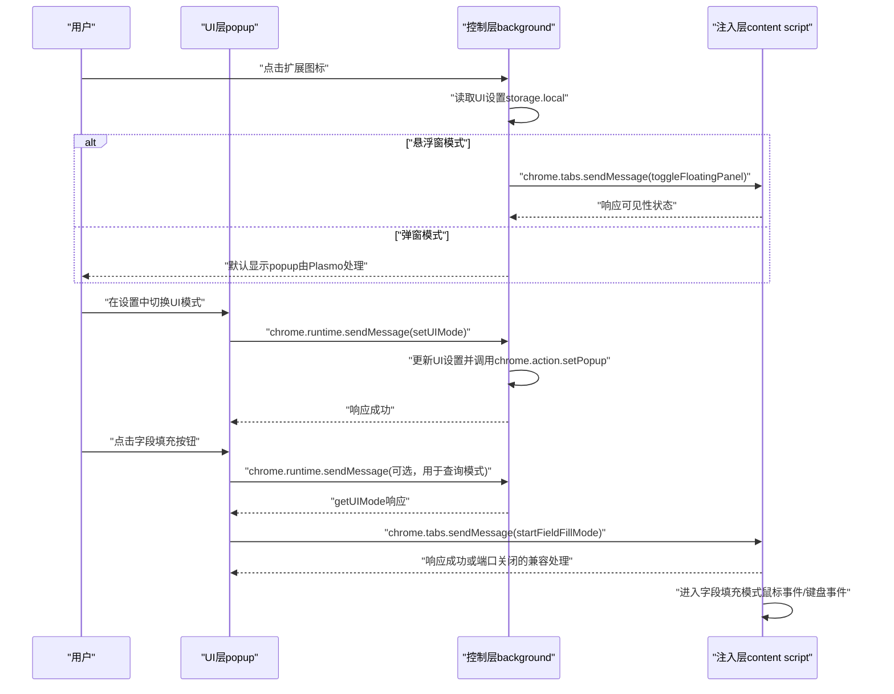
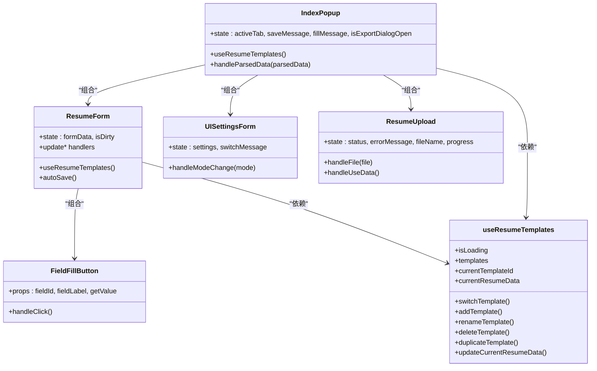
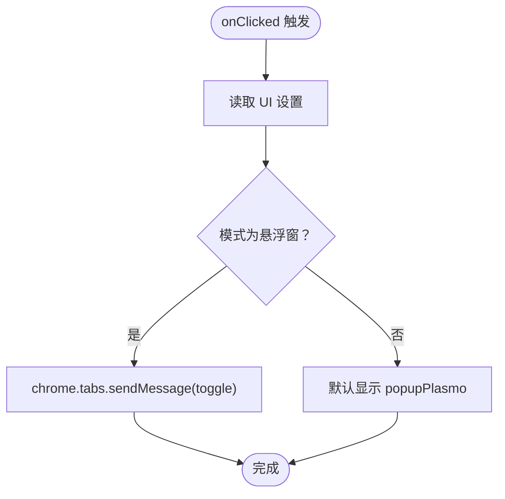
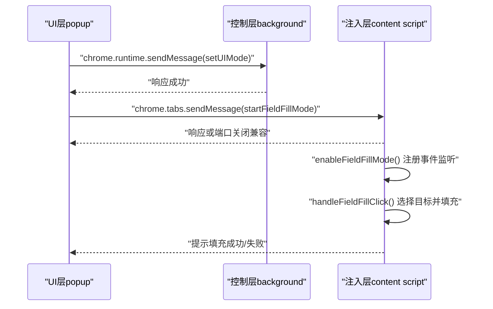
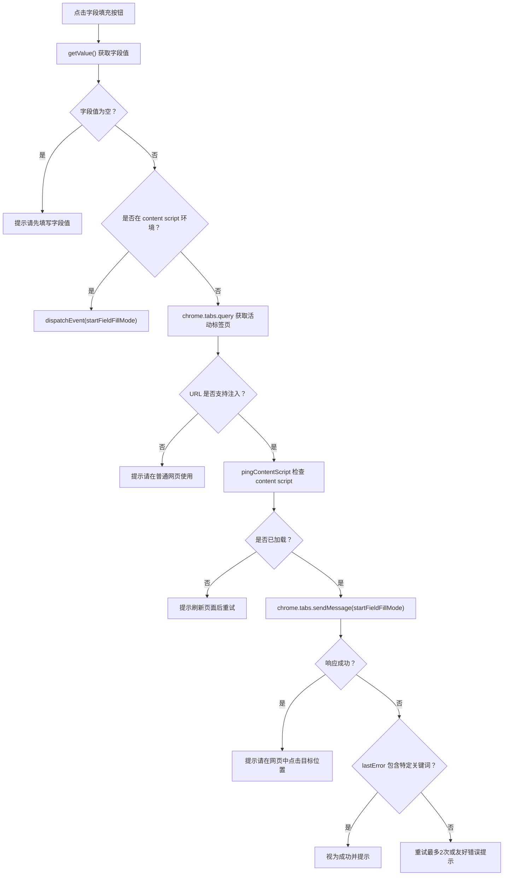
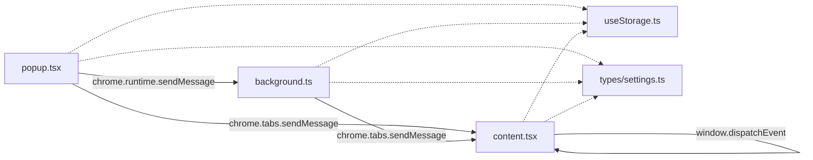

# 组件架构

<cite>
**本文引用的文件**
- [src/popup.tsx](file://src/popup.tsx)
- [src/background.ts](file://src/background.ts)
- [src/content.tsx](file://src/content.tsx)
- [src/hooks/useResumeTemplates.ts](file://src/hooks/useResumeTemplates.ts)
- [src/features/popup/ResumeForm.tsx](file://src/features/popup/ResumeForm.tsx)
- [src/features/popup/settings/UISettingsForm.tsx](file://src/features/popup/settings/UISettingsForm.tsx)
- [src/components/floating/FloatingPanel.tsx](file://src/components/floating/FloatingPanel.tsx)
- [src/services/field-fill.ts](file://src/services/field-fill.ts)
- [src/features/popup/ResumeUpload.tsx](file://src/features/popup/ResumeUpload.tsx)
- [src/components/ui/field-fill-button.tsx](file://src/components/ui/field-fill-button.tsx)
- [src/hooks/useStorage.ts](file://src/hooks/useStorage.ts)
- [src/types/settings.ts](file://src/types/settings.ts)
- [package.json](file://package.json)
</cite>

## 目录
1. [简介](#简介)
2. [项目结构](#项目结构)
3. [核心组件](#核心组件)
4. [架构总览](#架构总览)
5. [详细组件分析](#详细组件分析)
6. [依赖关系分析](#依赖关系分析)
7. [性能考量](#性能考量)
8. [故障排查指南](#故障排查指南)
9. [结论](#结论)

## 简介
本文件面向Chrome扩展“Offer 捞捞”的三层架构文档，围绕UI层（popup）、控制层（background）、注入层（content script）的职责划分与交互机制进行系统化说明。重点包括：
- popup作为用户主界面，通过React组件树与Tabs布局组织简历填写与设置功能，并利用自定义Hook（useResumeTemplates）管理多模板状态；
- background脚本监听扩展图标点击事件，依据用户设置的UI模式（弹窗/悬浮窗）决定行为，并通过chrome.runtime.onMessage处理来自其他上下文的消息；
- content script负责注入目标网页，通过Plasmo CSUI机制渲染FloatingPanel，并响应来自background或popup的消息以显示悬浮窗或启动字段填充模式。

同时，文档结合代码示例路径，说明各层如何通过chrome.runtime.sendMessage与chrome.tabs.sendMessage进行跨上下文通信，例如点击扩展图标时的消息传递路径，以及用户在popup中触发填充时如何将数据传递给content script执行DOM操作。

## 项目结构
项目采用按功能域分层的组织方式：
- src/popup.tsx：UI入口，承载简历填写与设置的主界面
- src/background.ts：控制层，处理扩展图标点击、UI模式切换、消息路由
- src/content.tsx：注入层，渲染悬浮窗面板并处理字段填充
- src/hooks/useResumeTemplates.ts：简历模板状态管理
- src/features/popup/*：popup内的功能模块（简历表单、设置等）
- src/components/floating/FloatingPanel.tsx：悬浮窗面板组件
- src/services/field-fill.ts：字段填充服务（跨上下文通信与重试策略）
- src/components/ui/field-fill-button.tsx：字段填充按钮
- src/hooks/useStorage.ts、src/types/settings.ts：存储与类型定义
- package.json：扩展清单与权限声明

图表来源
- [src/popup.tsx](file://src/popup.tsx#L1-L300)
- [src/background.ts](file://src/background.ts#L1-L80)
- [src/content.tsx](file://src/content.tsx#L1-L454)
- [src/features/popup/ResumeForm.tsx](file://src/features/popup/ResumeForm.tsx#L1-L782)
- [src/features/popup/settings/UISettingsForm.tsx](file://src/features/popup/settings/UISettingsForm.tsx#L1-L115)
- [src/features/popup/ResumeUpload.tsx](file://src/features/popup/ResumeUpload.tsx#L1-L260)
- [src/components/ui/field-fill-button.tsx](file://src/components/ui/field-fill-button.tsx#L1-L121)
- [src/services/field-fill.ts](file://src/services/field-fill.ts#L1-L260)
- [src/hooks/useStorage.ts](file://src/hooks/useStorage.ts#L1-L102)
- [src/types/settings.ts](file://src/types/settings.ts#L1-L192)

章节来源
- [src/popup.tsx](file://src/popup.tsx#L1-L300)
- [src/background.ts](file://src/background.ts#L1-L80)
- [src/content.tsx](file://src/content.tsx#L1-L454)
- [package.json](file://package.json#L41-L65)

## 核心组件
- UI层（popup）
  - 主界面IndexPopup：包含Tabs布局（简历填写/设置），集成TemplateSelector、ResumeUpload、ResumeForm、ExportDialog等子组件；通过useResumeTemplates提供模板状态管理。
  - 设置模块UISettingsForm：读取/写入UI模式（popup/floating），并通过chrome.runtime.sendMessage通知background更新行为。
  - 字段填充按钮FieldFillButton：封装字段值获取与startSingleFieldFill调用，统一错误提示与加载状态。
- 控制层（background）
  - 监听chrome.action.onClicked，依据UI设置决定是向content script发送toggle消息还是回退到默认popup。
  - 监听chrome.runtime.onMessage，处理getUIMode/setUIMode请求，更新popup行为（chrome.action.setPopup）。
- 注入层（content script）
  - 通过Plasmo CSUI机制渲染FloatingPanel，暴露toggle/show/hide悬浮窗消息处理。
  - 监听startFieldFillMode消息，进入字段填充模式，实现鼠标悬停高亮、点击选择目标输入框、键盘ESC取消、自动触发input/change/blur事件等。
  - 通过window.addEventListener接收悬浮窗内触发的自定义事件，直接在content script中启动字段填充模式。

章节来源
- [src/popup.tsx](file://src/popup.tsx#L124-L299)
- [src/features/popup/settings/UISettingsForm.tsx](file://src/features/popup/settings/UISettingsForm.tsx#L1-L115)
- [src/components/ui/field-fill-button.tsx](file://src/components/ui/field-fill-button.tsx#L1-L121)
- [src/background.ts](file://src/background.ts#L1-L80)
- [src/content.tsx](file://src/content.tsx#L69-L122)
- [src/content.tsx](file://src/content.tsx#L128-L151)
- [src/services/field-fill.ts](file://src/services/field-fill.ts#L1-L260)

## 架构总览
三层架构职责清晰：
- UI层（popup）：用户交互与数据编辑，模板管理与设置持久化
- 控制层（background）：扩展生命周期事件处理、UI模式决策、跨上下文消息路由
- 注入层（content script）：页面注入与悬浮窗渲染、字段填充模式执行

图表来源
- [src/background.ts](file://src/background.ts#L11-L29)
- [src/background.ts](file://src/background.ts#L31-L57)
- [src/features/popup/settings/UISettingsForm.tsx](file://src/features/popup/settings/UISettingsForm.tsx#L31-L45)
- [src/services/field-fill.ts](file://src/services/field-fill.ts#L115-L129)
- [src/services/field-fill.ts](file://src/services/field-fill.ts#L162-L259)
- [src/content.tsx](file://src/content.tsx#L69-L122)

## 详细组件分析

### UI层（popup）组件分析
- IndexPopup
  - Tabs组织简历填写与设置两个视图，TemplateSelector与ResumeUpload负责模板与数据导入，ResumeForm承载完整的简历表单与字段填充按钮。
  - 使用useResumeTemplates集中管理模板列表、当前模板、当前简历数据，提供切换、新增、重命名、删除、复制、更新等操作。
  - 通过convertParsedDataToResumeData将解析后的数据映射到简历结构，自动填充表单并提示。
- ResumeForm
  - 以可折叠区块展示基本信息、求职期望、教育经历、工作/实习经历、项目经历、技能、语言能力、自定义字段等。
  - 动态列表项支持增删改，字段类型覆盖输入框、日期选择、下拉选择、文本域等，均配套FieldFillButton。
  - 自动保存：本地表单状态变更后延迟更新模板数据，避免频繁写入。
- UISettingsForm
  - 读取UI设置（popup/floating），通过chrome.runtime.sendMessage通知background更新popup行为，并给出切换提示。
- ResumeUpload
  - 支持拖拽/点击上传，JSON直接解析，其他格式调用API解析，模拟进度条，解析成功后可“使用解析数据”回填表单。
- FieldFillButton
  - 统一字段值获取与startSingleFieldFill调用，处理空值校验、加载状态、错误提示与友好消息。

图表来源
- [src/popup.tsx](file://src/popup.tsx#L124-L299)
- [src/features/popup/ResumeForm.tsx](file://src/features/popup/ResumeForm.tsx#L227-L782)
- [src/features/popup/settings/UISettingsForm.tsx](file://src/features/popup/settings/UISettingsForm.tsx#L1-L115)
- [src/features/popup/ResumeUpload.tsx](file://src/features/popup/ResumeUpload.tsx#L1-L260)
- [src/components/ui/field-fill-button.tsx](file://src/components/ui/field-fill-button.tsx#L1-L121)
- [src/hooks/useResumeTemplates.ts](file://src/hooks/useResumeTemplates.ts#L1-L258)

章节来源
- [src/popup.tsx](file://src/popup.tsx#L124-L299)
- [src/features/popup/ResumeForm.tsx](file://src/features/popup/ResumeForm.tsx#L227-L782)
- [src/features/popup/settings/UISettingsForm.tsx](file://src/features/popup/settings/UISettingsForm.tsx#L1-L115)
- [src/features/popup/ResumeUpload.tsx](file://src/features/popup/ResumeUpload.tsx#L1-L260)
- [src/components/ui/field-fill-button.tsx](file://src/components/ui/field-fill-button.tsx#L1-L121)
- [src/hooks/useResumeTemplates.ts](file://src/hooks/useResumeTemplates.ts#L1-L258)

### 控制层（background）组件分析
- 扩展图标点击处理
  - 读取UI设置，若为悬浮窗模式则向当前标签页发送toggleFloatingPanel消息；否则默认popup由Plasmo自动处理。
- 消息处理
  - getUIMode：返回当前UI模式
  - setUIMode：更新UI设置并调用chrome.action.setPopup切换popup行为
- 初始化
  - 启动时根据UI设置初始化popup行为

图表来源
- [src/background.ts](file://src/background.ts#L11-L29)
- [src/background.ts](file://src/background.ts#L31-L57)
- [src/background.ts](file://src/background.ts#L72-L77)

章节来源
- [src/background.ts](file://src/background.ts#L1-L80)

### 注入层（content script）组件分析
- Plasmo CSUI配置
  - matches匹配所有URL，getStyle动态处理CSS以适配Shadow DOM
- 消息监听
  - toggleFloatingPanel/show/hide：切换悬浮窗显示状态并回调UI层
  - startFieldFillMode：启动字段填充模式，注册鼠标/键盘事件，高亮目标输入框，填充值并触发input/change/blur事件
  - 自定义事件：window.addEventListener("offerlaolao:startFieldFillMode")在悬浮窗内直接触发
- 悬浮窗UI
  - ContentUI基于useState与回调函数同步悬浮窗可见性，FloatingPanel提供拖拽、最小化、设置与表单功能

图表来源
- [src/services/field-fill.ts](file://src/services/field-fill.ts#L115-L129)
- [src/services/field-fill.ts](file://src/services/field-fill.ts#L162-L259)
- [src/content.tsx](file://src/content.tsx#L69-L122)
- [src/content.tsx](file://src/content.tsx#L157-L216)

章节来源
- [src/content.tsx](file://src/content.tsx#L1-L454)
- [src/components/floating/FloatingPanel.tsx](file://src/components/floating/FloatingPanel.tsx#L1-L414)
- [src/services/field-fill.ts](file://src/services/field-fill.ts#L1-L260)

### 字段填充流程（复杂逻辑）
- 跨上下文通信
  - popup中点击字段填充按钮后，调用startSingleFieldFill，先检测当前环境是否在content script（悬浮窗模式），若是则直接触发自定义事件；否则通过chrome.tabs.sendMessage发送startFieldFillMode消息。
  - content script收到消息后启动字段填充模式，注册鼠标悬停/离开/点击/键盘事件，选择目标输入框并填充值，最后高亮提示。
- 错误处理与重试
  - 若chrome.runtime.lastError包含特定关键词（如端口关闭），视为命令已发送成功但popup已关闭，返回友好提示。
  - 对连接失败、接收端不存在等情况进行有限次重试与友好提示。

图表来源
- [src/components/ui/field-fill-button.tsx](file://src/components/ui/field-fill-button.tsx#L27-L71)
- [src/services/field-fill.ts](file://src/services/field-fill.ts#L43-L69)
- [src/services/field-fill.ts](file://src/services/field-fill.ts#L78-L107)
- [src/services/field-fill.ts](file://src/services/field-fill.ts#L115-L129)
- [src/services/field-fill.ts](file://src/services/field-fill.ts#L162-L259)

章节来源
- [src/components/ui/field-fill-button.tsx](file://src/components/ui/field-fill-button.tsx#L1-L121)
- [src/services/field-fill.ts](file://src/services/field-fill.ts#L1-L260)

## 依赖关系分析
- 权限与清单
  - package.json声明了storage、activeTab、scripting权限，background为service worker，web_accessible_resources对所有URL开放资源访问。
- 存储与类型
  - useStorage提供本地存储读写与 onChanged 同步；STORAGE_KEYS统一键名；UISettings/UIMode定义UI模式与悬浮窗位置等类型。
- 组件耦合
  - popup与content script通过消息协议解耦；background作为消息中转站，避免UI层与注入层直接耦合。
- 潜在循环依赖
  - 无直接循环依赖；消息协议与UI组件相互独立，通过chrome API桥接。

图表来源
- [package.json](file://package.json#L41-L65)
- [src/popup.tsx](file://src/popup.tsx#L1-L300)
- [src/background.ts](file://src/background.ts#L1-L80)
- [src/content.tsx](file://src/content.tsx#L1-L454)
- [src/hooks/useStorage.ts](file://src/hooks/useStorage.ts#L1-L102)
- [src/types/settings.ts](file://src/types/settings.ts#L85-L107)

章节来源
- [package.json](file://package.json#L41-L65)
- [src/hooks/useStorage.ts](file://src/hooks/useStorage.ts#L1-L102)
- [src/types/settings.ts](file://src/types/settings.ts#L85-L107)

## 性能考量
- 自动保存节流：表单变更后延迟更新模板数据，减少频繁写入存储
- 消息重试：对连接失败与端口关闭场景进行有限次重试，提升成功率
- CSS注入优化：content script动态获取并处理CSS，替换根选择器与rem单位，降低样式冲突
- 事件监听范围：字段填充模式仅在启用时注册鼠标/键盘事件，结束时清理，避免全局性能影响

## 故障排查指南
- 点击扩展图标无反应
  - 检查UI模式设置是否为悬浮窗，且content script已注入；若未注入，刷新页面后重试
  - 参考路径：[src/background.ts](file://src/background.ts#L11-L29)
- 切换UI模式后点击图标仍显示弹窗
  - 确认UISettingsForm已通过chrome.runtime.sendMessage通知background更新popup行为
  - 参考路径：[src/features/popup/settings/UISettingsForm.tsx](file://src/features/popup/settings/UISettingsForm.tsx#L31-L45)，[src/background.ts](file://src/background.ts#L62-L71)
- 字段填充按钮点击无效
  - 检查字段值是否为空；确认当前页面支持注入（非扩展页/about:等）；查看content script是否已加载
  - 参考路径：[src/components/ui/field-fill-button.tsx](file://src/components/ui/field-fill-button.tsx#L27-L71)，[src/services/field-fill.ts](file://src/services/field-fill.ts#L78-L107)
- 填充失败或提示“无法连接到页面”
  - 刷新页面后重试；检查网络与API配置；查看重试与友好提示逻辑
  - 参考路径：[src/services/field-fill.ts](file://src/services/field-fill.ts#L162-L259)

章节来源
- [src/background.ts](file://src/background.ts#L11-L29)
- [src/features/popup/settings/UISettingsForm.tsx](file://src/features/popup/settings/UISettingsForm.tsx#L31-L45)
- [src/components/ui/field-fill-button.tsx](file://src/components/ui/field-fill-button.tsx#L27-L71)
- [src/services/field-fill.ts](file://src/services/field-fill.ts#L78-L107)
- [src/services/field-fill.ts](file://src/services/field-fill.ts#L162-L259)

## 结论
本架构以清晰的三层分工实现了用户交互、控制与注入的解耦：
- UI层专注体验与数据管理，通过useResumeTemplates与useStorage提供稳定的状态与持久化
- 控制层承担扩展生命周期与消息路由，保证UI模式切换与跨上下文通信的可靠性
- 注入层通过Plasmo CSUI与消息协议实现悬浮窗与字段填充的核心能力

通过规范的消息协议与错误处理策略，系统在不同上下文间保持一致的行为与良好的用户体验。