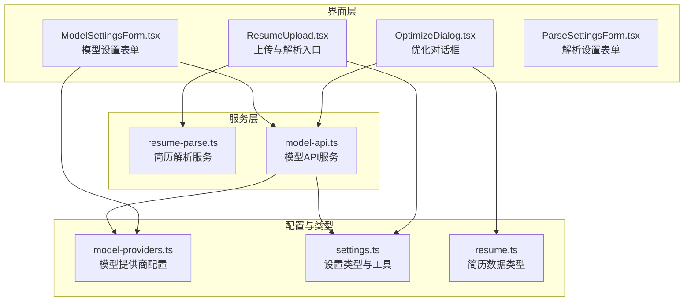
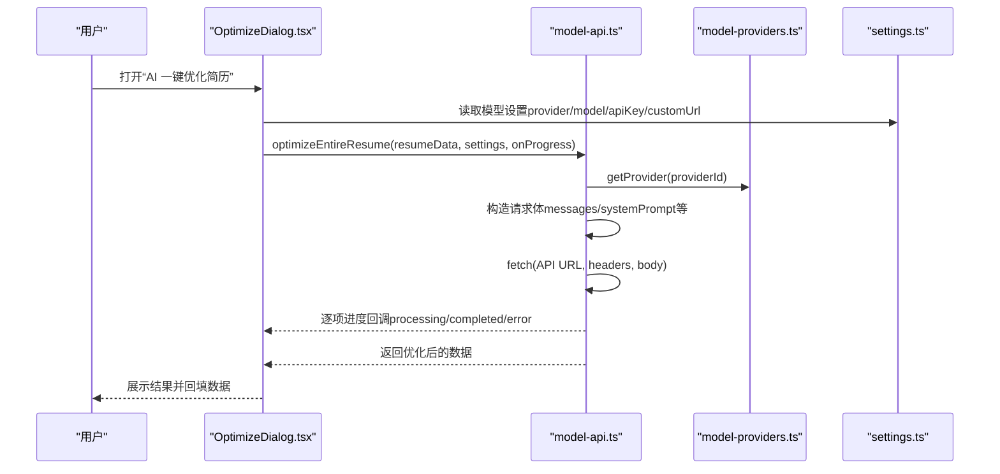
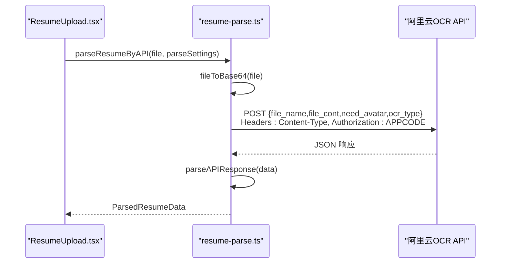
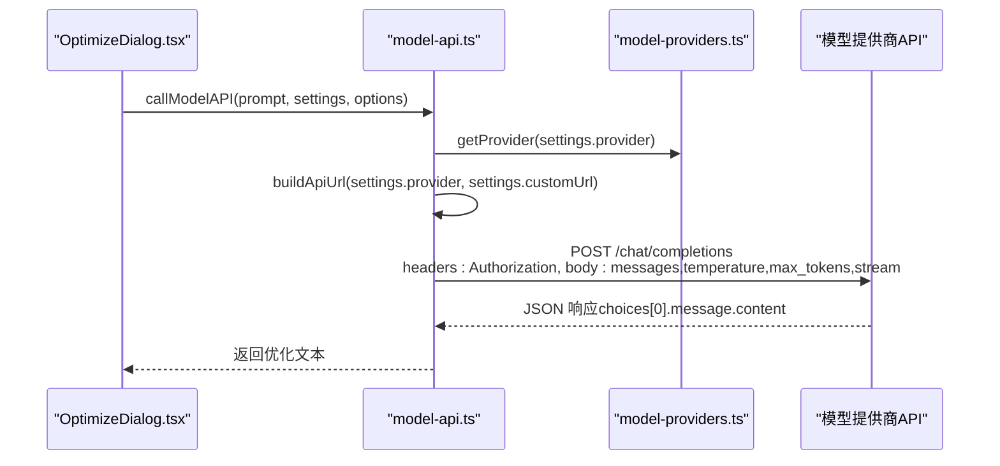
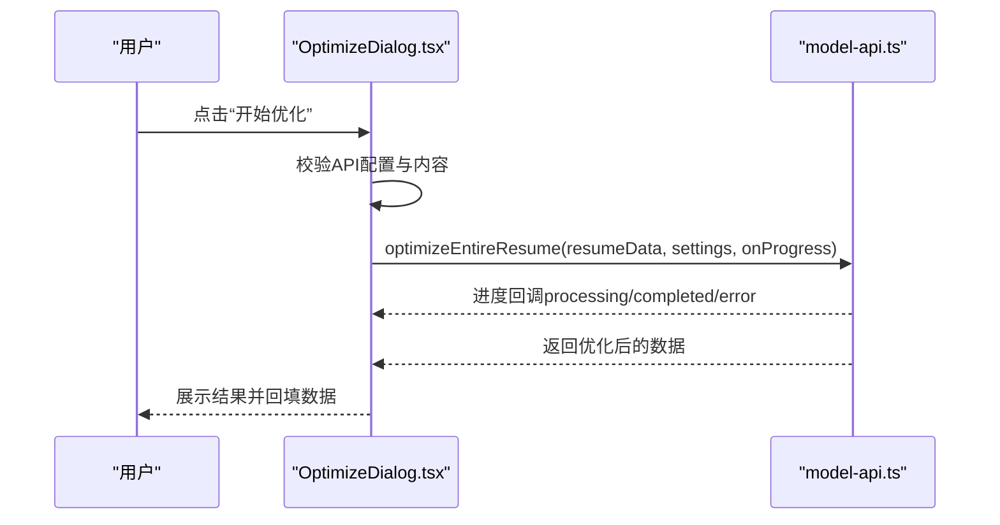
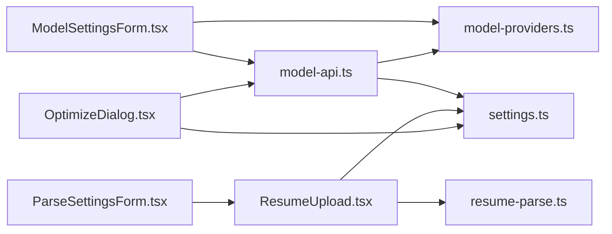

# AI功能

<cite>
**本文引用的文件**
- [src/services/resume-parse.ts](file://src/services/resume-parse.ts)
- [src/services/model-api.ts](file://src/services/model-api.ts)
- [src/features/popup/OptimizeDialog.tsx](file://src/features/popup/OptimizeDialog.tsx)
- [src/features/popup/ResumeUpload.tsx](file://src/features/popup/ResumeUpload.tsx)
- [src/config/model-providers.ts](file://src/config/model-providers.ts)
- [src/types/settings.ts](file://src/types/settings.ts)
- [src/types/resume.ts](file://src/types/resume.ts)
- [src/features/popup/settings/ModelSettingsForm.tsx](file://src/features/popup/settings/ModelSettingsForm.tsx)
- [src/features/popup/settings/ParseSettingsForm.tsx](file://src/features/popup/settings/ParseSettingsForm.tsx)
</cite>

## 目录
1. [简介](#简介)
2. [项目结构](#项目结构)
3. [核心组件](#核心组件)
4. [架构总览](#架构总览)
5. [详细组件分析](#详细组件分析)
6. [依赖关系分析](#依赖关系分析)
7. [性能考虑](#性能考虑)
8. [故障排查指南](#故障排查指南)
9. [结论](#结论)
10. [附录](#附录)

## 简介
本文件面向开发者，系统性梳理插件中的AI功能模块，覆盖三大子功能：
- AI简历解析：支持通过阿里云OCR服务或本地JSON解析，将PDF/DOCX等文件转换为结构化JSON数据。
- AI简历优化：集成DeepSeek、通义千问、Kimi、火山引擎、智谱AI、百川智能等多家大模型API，实现自我介绍、工作/实习经历、项目经历等字段的智能优化；并支持一键优化整份简历。
- AI简历生成：通过提示词工程与模型API，生成简历建议与内容优化建议。

文档重点说明各模块的调用链路、请求参数、响应格式、错误码与重试策略、API密钥管理、流式响应处理（现状与扩展建议）、提示词工程要点，以及如何新增模型提供商或自定义优化模板。

## 项目结构
AI功能主要分布在以下目录与文件：
- 服务层：解析服务与模型API服务
- 配置层：模型提供商配置
- 类型层：设置与简历数据类型
- 界面层：上传、优化对话框、设置表单

图表来源
- [src/features/popup/ResumeUpload.tsx](file://src/features/popup/ResumeUpload.tsx#L1-L260)
- [src/features/popup/OptimizeDialog.tsx](file://src/features/popup/OptimizeDialog.tsx#L1-L297)
- [src/services/resume-parse.ts](file://src/services/resume-parse.ts#L1-L342)
- [src/services/model-api.ts](file://src/services/model-api.ts#L1-L678)
- [src/config/model-providers.ts](file://src/config/model-providers.ts#L1-L123)
- [src/types/settings.ts](file://src/types/settings.ts#L1-L192)
- [src/types/resume.ts](file://src/types/resume.ts#L1-L212)

章节来源
- [src/features/popup/ResumeUpload.tsx](file://src/features/popup/ResumeUpload.tsx#L1-L260)
- [src/features/popup/OptimizeDialog.tsx](file://src/features/popup/OptimizeDialog.tsx#L1-L297)
- [src/services/resume-parse.ts](file://src/services/resume-parse.ts#L1-L342)
- [src/services/model-api.ts](file://src/services/model-api.ts#L1-L678)
- [src/config/model-providers.ts](file://src/config/model-providers.ts#L1-L123)
- [src/types/settings.ts](file://src/types/settings.ts#L1-L192)
- [src/types/resume.ts](file://src/types/resume.ts#L1-L212)

## 核心组件
- 简历解析服务（resume-parse.ts）
  - 支持JSON直读与阿里云OCR API两种路径；将PDF/DOCX等文件转为Base64并通过APPCODE认证调用API；解析响应为统一结构化数据。
- 模型API服务（model-api.ts）
  - 统一封装调用逻辑，支持多提供商（DeepSeek、通义千问、Kimi、火山引擎、智谱AI、百川智能、自定义OpenAI兼容）；提供字段级优化、整份简历一键优化、建议生成、字段匹配等能力。
- 优化对话框（OptimizeDialog.tsx）
  - 用户交互入口，展示待优化项、进度与结果，触发一键优化并回传优化后的数据。
- 上传组件（ResumeUpload.tsx）
  - 支持拖拽/点击上传，识别JSON与非JSON文件；非JSON走解析API，JSON直解析；提供进度与错误提示。
- 配置与类型
  - 模型提供商配置（model-providers.ts）与设置类型（settings.ts）、简历数据类型（resume.ts）。

章节来源
- [src/services/resume-parse.ts](file://src/services/resume-parse.ts#L1-L342)
- [src/services/model-api.ts](file://src/services/model-api.ts#L1-L678)
- [src/features/popup/OptimizeDialog.tsx](file://src/features/popup/OptimizeDialog.tsx#L1-L297)
- [src/features/popup/ResumeUpload.tsx](file://src/features/popup/ResumeUpload.tsx#L1-L260)
- [src/config/model-providers.ts](file://src/config/model-providers.ts#L1-L123)
- [src/types/settings.ts](file://src/types/settings.ts#L1-L192)
- [src/types/resume.ts](file://src/types/resume.ts#L1-L212)

## 架构总览
AI功能整体调用链如下：
- 简历解析：用户上传文件 → 上传组件判断文件类型 → 非JSON走解析API → 解析服务调用阿里云OCR → 解析响应为统一结构 → 回填到表单。
- 简历优化：用户打开优化对话框 → 读取模型设置 → 逐项优化或一键优化 → 模型API服务调用对应提供商 → 返回优化结果 → 更新UI与数据。
- 设置与配置：模型设置表单维护提供商、模型、API Key与自定义URL；解析设置表单维护阿里云解析API URL与APP Code。

图表来源
- [src/features/popup/OptimizeDialog.tsx](file://src/features/popup/OptimizeDialog.tsx#L1-L297)
- [src/services/model-api.ts](file://src/services/model-api.ts#L1-L678)
- [src/config/model-providers.ts](file://src/config/model-providers.ts#L1-L123)
- [src/types/settings.ts](file://src/types/settings.ts#L1-L192)

## 详细组件分析

### 组件A：简历解析服务（resume-parse.ts）
- 功能概述
  - 将文件转换为Base64，构造请求体，调用阿里云OCR解析API，解析响应为统一结构化数据（个人信息、教育、工作、项目、技能、语言）。
- 关键流程
  - 文件校验与Base64转换
  - 构建请求体（file_name、file_cont、need_avatar、ocr_type）
  - 发起fetch请求（Content-Type、Authorization: APPCODE）
  - 错误处理（401、4xx、5xx）
  - 响应解析（兼容result/data/body/raw）
  - 日期标准化与技能等级映射
- 请求参数
  - URL：来自设置（ParseSettings.url）
  - Headers：Content-Type、Authorization: APPCODE + APP Code
  - Body：{
      file_name: string,
      file_cont: string(Base64),
      need_avatar: number,
      ocr_type: number
    }
- 响应格式
  - 统一结构化对象，包含：
    - personalInfo: 姓名、性别、电话、邮箱、政治面貌、期望职位、期望薪资、自我介绍等
    - education: 教育经历数组
    - workExperience: 工作/实习经历数组
    - projects: 项目经历数组
    - skills: 技能数组
    - languages: 语言能力数组
- 错误码与处理
  - 401：认证失败（APP Code无效或服务未激活）
  - 400/429：参数错误/请求过于频繁
  - 其他：抛出通用错误
- 重试策略
  - 当前未内置重试；建议在上层调用处按业务需求增加指数退避重试（例如最多3次，间隔1s、2s、4s）

图表来源
- [src/features/popup/ResumeUpload.tsx](file://src/features/popup/ResumeUpload.tsx#L1-L260)
- [src/services/resume-parse.ts](file://src/services/resume-parse.ts#L1-L342)

章节来源
- [src/services/resume-parse.ts](file://src/services/resume-parse.ts#L1-L342)
- [src/features/popup/ResumeUpload.tsx](file://src/features/popup/ResumeUpload.tsx#L1-L260)

### 组件B：模型API服务（model-api.ts）
- 功能概述
  - 统一构建API URL、封装请求、解析响应；提供字段级优化、整份简历一键优化、建议生成、字段匹配等能力。
- 关键流程
  - 构建URL：支持内置提供商与自定义OpenAI兼容URL
  - 构造请求体：messages（systemPrompt/user）、temperature、max_tokens、stream=false
  - 发起fetch请求（Content-Type、Authorization: Bearer或APPCODE）
  - 错误处理：401、429、400等
  - 响应解析：优先choices[0].message.content，兼容output.text/result
- 请求参数
  - URL：buildApiUrl(providerId, customUrl)
  - Headers：Content-Type、Authorization: provider.authHeader + provider.authPrefix + apiKey
  - Body：{
      model: string,
      messages: [{role:"system", content}, {role:"user", content}],
      temperature: number,
      max_tokens: number,
      stream: boolean
    }
- 响应格式
  - 成功：字符串（优化后内容）
  - 失败：抛出错误
- 错误码与处理
  - 401：认证失败（API Key错误）
  - 429：请求过于频繁
  - 400：请求参数错误
  - 其他：通用错误
- 重试策略
  - 当前未内置重试；建议在上层调用处按业务需求增加指数退避重试（例如最多3次，间隔1s、2s、4s）
- 流式响应处理
  - 当前stream=false；如需流式，可在请求体中开启stream并使用ReadableStream消费事件流（需适配不同提供商的event格式）

图表来源
- [src/features/popup/OptimizeDialog.tsx](file://src/features/popup/OptimizeDialog.tsx#L1-L297)
- [src/services/model-api.ts](file://src/services/model-api.ts#L1-L678)
- [src/config/model-providers.ts](file://src/config/model-providers.ts#L1-L123)

章节来源
- [src/services/model-api.ts](file://src/services/model-api.ts#L1-L678)
- [src/config/model-providers.ts](file://src/config/model-providers.ts#L1-L123)

### 组件C：优化对话框（OptimizeDialog.tsx）
- 触发机制
  - 用户在弹窗中打开“AI 一键优化简历”对话框。
- 用户交互流程
  - 列出待优化项（自我介绍、工作经历、项目描述、项目职责）
  - 校验API配置与内容存在性
  - 开始优化：逐项调用优化函数，接收进度回调
  - 结果展示：成功/失败提示，支持重试
- 与服务层交互
  - 调用optimizeEntireResume，接收进度回调，最终回传优化后的数据给父组件

图表来源
- [src/features/popup/OptimizeDialog.tsx](file://src/features/popup/OptimizeDialog.tsx#L1-L297)
- [src/services/model-api.ts](file://src/services/model-api.ts#L490-L678)

章节来源
- [src/features/popup/OptimizeDialog.tsx](file://src/features/popup/OptimizeDialog.tsx#L1-L297)
- [src/services/model-api.ts](file://src/services/model-api.ts#L490-L678)

### 组件D：上传与解析（ResumeUpload.tsx）
- 文件类型支持：JSON、PDF、DOC、DOCX、TXT、HTML
- 非JSON文件：校验设置（URL与APP Code）→ 模拟进度 → 调用parseResumeByAPI → 显示结果
- JSON文件：直接读取并解析为JSON对象
- 错误处理：格式不支持、设置缺失、解析异常

章节来源
- [src/features/popup/ResumeUpload.tsx](file://src/features/popup/ResumeUpload.tsx#L1-L260)
- [src/services/resume-parse.ts](file://src/services/resume-parse.ts#L1-L342)

### 组件E：模型提供商配置（model-providers.ts）
- 支持提供商：DeepSeek、Kimi、通义千问、火山引擎、智谱AI、百川智能、自定义（OpenAI兼容）
- 关键字段：baseUrl、models、authHeader、authPrefix
- 工具函数：getModelProviders、getModelsByProvider、getProvider

章节来源
- [src/config/model-providers.ts](file://src/config/model-providers.ts#L1-L123)

### 组件F：设置与类型（settings.ts、resume.ts）
- 设置类型
  - ModelSettings：provider、model、customUrl、apiKeys（按提供商独立存储）
  - ParseSettings：url、appCode
  - 工具函数：getApiKeyForProvider、setApiKeyForProvider
- 简历数据类型
  - ResumeData、OptimizeProgress、OptimizeTask等

章节来源
- [src/types/settings.ts](file://src/types/settings.ts#L1-L192)
- [src/types/resume.ts](file://src/types/resume.ts#L1-L212)

## 依赖关系分析
- 组件耦合
  - OptimizeDialog依赖model-api的优化函数与settings的模型设置
  - ResumeUpload依赖resume-parse的解析函数与settings的解析设置
  - model-api依赖model-providers与settings
- 外部依赖
  - 阿里云OCR API（解析）
  - 各大模型提供商API（优化）
- 潜在循环依赖
  - 当前无循环依赖迹象

图表来源
- [src/features/popup/OptimizeDialog.tsx](file://src/features/popup/OptimizeDialog.tsx#L1-L297)
- [src/features/popup/ResumeUpload.tsx](file://src/features/popup/ResumeUpload.tsx#L1-L260)
- [src/services/model-api.ts](file://src/services/model-api.ts#L1-L678)
- [src/services/resume-parse.ts](file://src/services/resume-parse.ts#L1-L342)
- [src/config/model-providers.ts](file://src/config/model-providers.ts#L1-L123)
- [src/types/settings.ts](file://src/types/settings.ts#L1-L192)

章节来源
- [src/features/popup/OptimizeDialog.tsx](file://src/features/popup/OptimizeDialog.tsx#L1-L297)
- [src/features/popup/ResumeUpload.tsx](file://src/features/popup/ResumeUpload.tsx#L1-L260)
- [src/services/model-api.ts](file://src/services/model-api.ts#L1-L678)
- [src/services/resume-parse.ts](file://src/services/resume-parse.ts#L1-L342)
- [src/config/model-providers.ts](file://src/config/model-providers.ts#L1-L123)
- [src/types/settings.ts](file://src/types/settings.ts#L1-L192)

## 性能考虑
- 解析性能
  - 阿里云OCR解析时间受文件大小与复杂度影响；建议限制文件大小与格式，必要时拆分PDF。
  - Base64传输体积约为原文件的4/3倍，注意网络带宽与内存占用。
- 优化性能
  - 逐项优化时建议增加延迟（当前已有500ms延迟）以避免限频。
  - 对于长文本，合理设置max_tokens与temperature，平衡质量与速度。
- 并发与重试
  - 建议在上层调用处增加指数退避重试与并发控制（如队列化请求）。
- UI体验
  - 优化对话框提供进度条与状态提示，建议在长耗时任务中保持流畅反馈。

## 故障排查指南
- 解析失败（阿里云OCR）
  - 检查APP Code是否正确（401）
  - 确认API URL与APP Code已配置
  - 检查文件格式是否受支持
- 模型API失败
  - 检查API Key是否配置（401）
  - 检查模型选择与提供商是否匹配
  - 避免请求过于频繁（429）
  - 自定义URL需以/chat/completions结尾
- 优化失败
  - 确保简历中存在可优化的描述性内容
  - 检查网络连通性与代理设置
  - 在对话框中使用“重试”按钮进行二次尝试

章节来源
- [src/services/resume-parse.ts](file://src/services/resume-parse.ts#L82-L109)
- [src/services/model-api.ts](file://src/services/model-api.ts#L98-L139)
- [src/features/popup/OptimizeDialog.tsx](file://src/features/popup/OptimizeDialog.tsx#L94-L141)

## 结论
本AI功能模块通过清晰的服务层与配置层分离，实现了简历解析与优化的端到端能力。解析侧支持阿里云OCR与本地JSON直读，优化侧支持多家大模型与自定义OpenAI兼容接口。建议后续增强：
- 在服务层增加统一的重试与限流策略
- 在模型API层支持流式响应（stream=true）
- 丰富提示词模板与上下文注入，提升优化质量
- 提供更灵活的字段匹配与建议生成能力

## 附录

### A. 新增模型提供商步骤
- 在配置文件中添加提供商信息（id、name、baseUrl、models、authHeader、authPrefix）
- 在设置类型中确认ModelSettings支持apiKeys按提供商独立存储
- 在设置表单中选择新提供商后自动加载模型列表
- 如需自定义URL，使用custom模式并在设置中填写自定义API地址

章节来源
- [src/config/model-providers.ts](file://src/config/model-providers.ts#L1-L123)
- [src/types/settings.ts](file://src/types/settings.ts#L1-L192)
- [src/features/popup/settings/ModelSettingsForm.tsx](file://src/features/popup/settings/ModelSettingsForm.tsx#L1-L298)

### B. 自定义优化模板
- 在model-api.ts中扩展优化函数或提示词模板，支持更多字段类型
- 在OptimizeDialog.tsx中扩展待优化项列表与UI展示
- 通过Context传递目标职位/行业等上下文信息，提升优化针对性

章节来源
- [src/services/model-api.ts](file://src/services/model-api.ts#L179-L487)
- [src/features/popup/OptimizeDialog.tsx](file://src/features/popup/OptimizeDialog.tsx#L38-L74)

### C. API密钥管理
- 每个提供商独立存储API Key，切换提供商时自动加载对应Key
- 支持自定义URL模式，便于接入其他兼容OpenAI格式的平台

章节来源
- [src/types/settings.ts](file://src/types/settings.ts#L46-L78)
- [src/features/popup/settings/ModelSettingsForm.tsx](file://src/features/popup/settings/ModelSettingsForm.tsx#L172-L209)

### D. 流式响应处理（扩展建议）
- 在请求体中启用stream=true
- 使用ReadableStream消费事件流（不同提供商事件格式可能不同）
- 在UI中实时渲染增量内容，提升用户体验

[本节为概念性建议，不直接分析具体源文件]