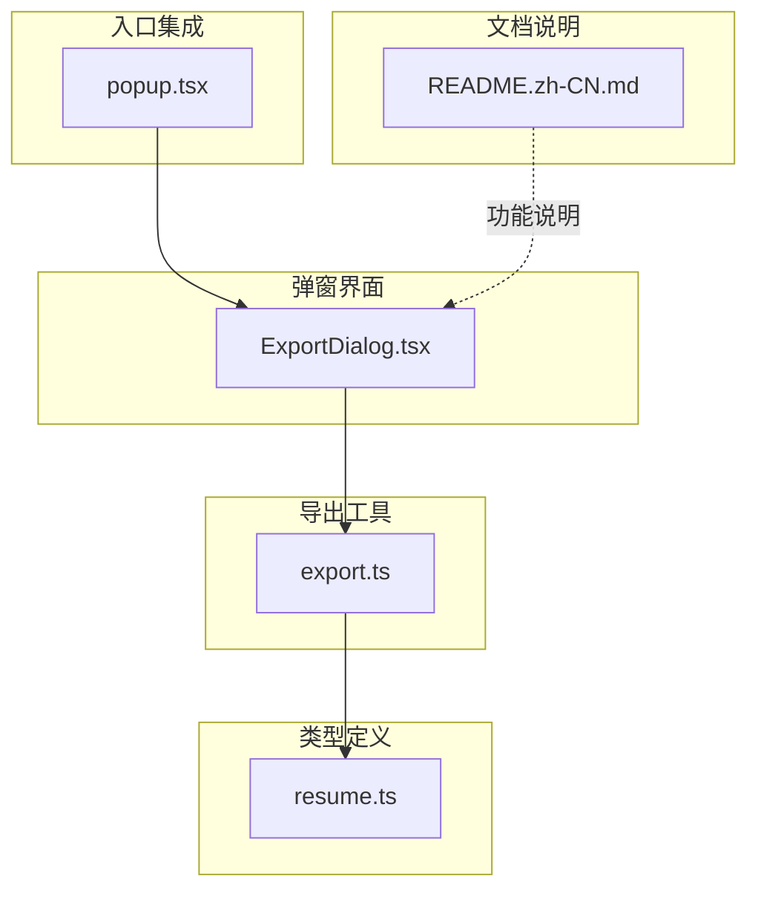
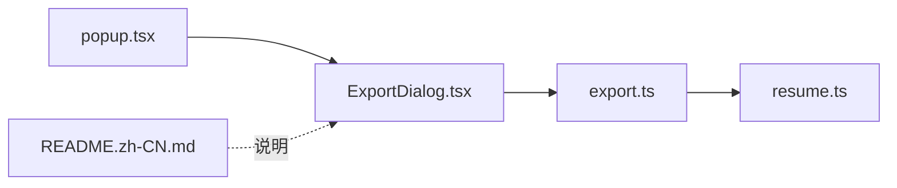

# 多格式导出

<cite>
**本文引用的文件**
- [ExportDialog.tsx](file://src/features/popup/ExportDialog.tsx)
- [export.ts](file://src/utils/export.ts)
- [resume.ts](file://src/types/resume.ts)
- [popup.tsx](file://src/popup.tsx)
- [README.zh-CN.md](file://assets/README.zh-CN.md)
</cite>

## 目录
1. [简介](#简介)
2. [项目结构](#项目结构)
3. [核心组件](#核心组件)
4. [架构总览](#架构总览)
5. [详细组件分析](#详细组件分析)
6. [依赖关系分析](#依赖关系分析)
7. [性能考量](#性能考量)
8. [故障排查指南](#故障排查指南)
9. [结论](#结论)
10. [附录](#附录)

## 简介
本章节面向开发者，系统性阐述多格式导出功能的设计与实现，重点说明 ExportDialog.tsx 如何提供用户界面以选择导出格式（JSON、LaTeX），以及如何调用 export.ts 中的工具函数执行实际导出逻辑。文档还解释了不同格式的数据转换规则，尤其是 LaTeX 模板的变量替换机制与样式控制，并给出导出文件的结构示例与用途说明。同时涵盖文件名生成策略、编码处理、Blob 下载等技术细节，并指导如何扩展新的导出格式或自定义模板。

## 项目结构
多格式导出功能涉及以下关键文件：
- 用户界面：ExportDialog.tsx
- 导出工具：export.ts
- 类型定义：resume.ts
- 入口集成：popup.tsx
- 功能说明：README.zh-CN.md



图表来源
- [ExportDialog.tsx](file://src/features/popup/ExportDialog.tsx#L1-L140)
- [export.ts](file://src/utils/export.ts#L1-L595)
- [resume.ts](file://src/types/resume.ts#L1-L212)
- [popup.tsx](file://src/popup.tsx#L206-L241)
- [README.zh-CN.md](file://assets/README.zh-CN.md#L87-L95)

章节来源
- [ExportDialog.tsx](file://src/features/popup/ExportDialog.tsx#L1-L140)
- [export.ts](file://src/utils/export.ts#L1-L595)
- [resume.ts](file://src/types/resume.ts#L1-L212)
- [popup.tsx](file://src/popup.tsx#L206-L241)
- [README.zh-CN.md](file://assets/README.zh-CN.md#L87-L95)

## 核心组件
- ExportDialog.tsx：提供“导出为 JSON”和“导出为 LaTeX”的交互界面，负责触发导出动作并展示反馈消息。
- export.ts：包含导出工具函数，负责将简历数据转换为 JSON 或 LaTeX，并通过浏览器下载。
- resume.ts：定义简历数据结构（个人基础信息、求职期望、教育经历、工作/实习经历、项目经历、技能、语言能力、自定义字段等）。
- popup.tsx：在主界面中集成导出入口，打开 ExportDialog。
- README.zh-CN.md：对导出功能进行概览说明。

章节来源
- [ExportDialog.tsx](file://src/features/popup/ExportDialog.tsx#L1-L140)
- [export.ts](file://src/utils/export.ts#L1-L595)
- [resume.ts](file://src/types/resume.ts#L1-L212)
- [popup.tsx](file://src/popup.tsx#L206-L241)
- [README.zh-CN.md](file://assets/README.zh-CN.md#L87-L95)

## 架构总览
下图展示了从用户点击导出按钮到文件下载完成的端到端流程。

```mermaid
sequenceDiagram
participant U as "用户"
participant P as "popup.tsx"
participant D as "ExportDialog.tsx"
participant E as "export.ts"
participant B as "浏览器下载"
U->>P : 点击“导出简历”
P->>D : 打开导出对话框
U->>D : 选择“导出为 JSON/LaTeX”
D->>E : 调用 exportAsJSON()/exportAsLatex(resumeData)
alt JSON 导出
E->>E : JSON.stringify(resumeData)
E->>E : 生成文件名(含日期)
E->>B : Blob 下载(application/json;charset=utf-8)
else LaTeX 导出
E->>E : generateLatexResume(resumeData)
E->>E : 生成文件名(含姓名/日期)
E->>B : Blob 下载(application/x-latex;charset=utf-8)
end
B-->>U : 触发下载并提示成功/失败
```

图表来源
- [popup.tsx](file://src/popup.tsx#L206-L241)
- [ExportDialog.tsx](file://src/features/popup/ExportDialog.tsx#L1-L140)
- [export.ts](file://src/utils/export.ts#L490-L595)

## 详细组件分析

### ExportDialog.tsx：导出对话框
- 职责
  - 展示导出选项（JSON、LaTeX）
  - 调用 export.ts 的导出函数
  - 显示成功/失败消息并自动关闭
  - 点击遮罩层可关闭对话框
- 关键行为
  - JSON 导出：调用 exportAsJSON(resumeData)，成功时显示成功消息并延时关闭；失败时显示错误消息。
  - LaTeX 导出：调用 exportAsLatex(resumeData)，成功时显示成功消息并延时关闭；失败时显示错误消息。
- 交互细节
  - 使用消息状态 message 控制提示文本与颜色。
  - 遮罩层点击事件仅在点击背景时关闭，避免误触。

章节来源
- [ExportDialog.tsx](file://src/features/popup/ExportDialog.tsx#L1-L140)

### export.ts：导出工具与模板生成
- LaTeX 特殊字符转义
  - escapeLatex：对反斜杠、&、%、$、#、_、{、}、~、^、<、> 等特殊字符进行转义，确保生成的 LaTeX 文本合法。
- 日期格式化
  - formatDateForLatex：将 YYYY-MM-DD 转换为 LaTeX 友好的 YYYY.MM 格式。
- LaTeX 文档生成
  - generateLatexResume：基于简历数据构建完整的 LaTeX 文档，包含导言区（宏包、主题色、字体、页面布局）、自定义命令（带图标节标题、日期范围、联系信息等）、正文各部分（个人信息、教育经历、工作/实习经历、项目经历、技能、语言能力、自我介绍、自定义字段）。
  - 该函数对所有文本内容调用 escapeLatex，确保中文与特殊字符安全。
- 文件下载与命名
  - downloadFile：创建 Blob 并触发浏览器下载，支持指定 MIME 类型与文件名。
  - sanitizeFilename：清理文件名中的非法字符，避免路径注入问题。
  - getCurrentDateString：生成当前日期字符串（YYYY-MM-DD）。
  - exportAsJSON：序列化简历数据为 JSON，文件名为 resume_data_YYYY-MM-DD.json，MIME 为 application/json;charset=utf-8。
  - exportAsLatex：生成 LaTeX 文档，文件名为 {姓名}_resume_YYYY-MM-DD.tex 或 resume_YYYY-MM-DD.tex，MIME 为 application/x-latex;charset=utf-8。
- JSON 解析
  - parseResumeFromJSON：从 JSON 字符串解析简历数据，进行基本校验。

章节来源
- [export.ts](file://src/utils/export.ts#L1-L595)

### resume.ts：简历数据结构
- 个人基础信息（PersonalInfo）
- 求职期望（JobExpectation）
- 自我介绍（selfIntro）
- 教育经历（Education[]）
- 工作/实习经历（WorkExperience[]）
- 项目经历（Project[]）
- 技能（Skill[]）
- 语言能力（Language[]）
- 自定义字段（CustomField[]）

章节来源
- [resume.ts](file://src/types/resume.ts#L1-L212)

### popup.tsx：导出入口集成
- 在主界面中提供“导出简历”按钮，点击后打开 ExportDialog。
- 该文件负责将当前简历数据传递给导出对话框。

章节来源
- [popup.tsx](file://src/popup.tsx#L206-L241)

### README.zh-CN.md：导出功能概览
- JSON 导出：导出完整简历数据，可用于备份和跨设备同步。
- LaTeX 导出：生成专业的 LaTeX 简历模板。

章节来源
- [README.zh-CN.md](file://assets/README.zh-CN.md#L87-L95)

## 依赖关系分析
- ExportDialog.tsx 依赖 export.ts 的导出函数。
- export.ts 依赖 resume.ts 的类型定义。
- popup.tsx 作为入口，负责打开 ExportDialog 并传入简历数据。
- README.zh-CN.md 提供功能层面的说明。



图表来源
- [popup.tsx](file://src/popup.tsx#L206-L241)
- [ExportDialog.tsx](file://src/features/popup/ExportDialog.tsx#L1-L140)
- [export.ts](file://src/utils/export.ts#L1-L595)
- [resume.ts](file://src/types/resume.ts#L1-L212)
- [README.zh-CN.md](file://assets/README.zh-CN.md#L87-L95)

章节来源
- [popup.tsx](file://src/popup.tsx#L206-L241)
- [ExportDialog.tsx](file://src/features/popup/ExportDialog.tsx#L1-L140)
- [export.ts](file://src/utils/export.ts#L1-L595)
- [resume.ts](file://src/types/resume.ts#L1-L212)
- [README.zh-CN.md](file://assets/README.zh-CN.md#L87-L95)

## 性能考量
- JSON 导出：JSON.stringify 是 O(n) 级别，n 为简历数据体量；渲染对话框与下载触发开销极低。
- LaTeX 导出：generateLatexResume 会遍历教育、工作、项目、技能、语言等数组，整体复杂度近似 O(n)；escapeLatex 与日期格式化为常数时间操作。
- 下载性能：Blob 与 URL.createObjectURL 在现代浏览器中高效；注意避免在短时间内频繁触发下载导致内存占用上升。
- UI 响应：导出过程在后台执行，UI 保持流畅；成功/失败消息延时关闭避免频繁闪烁。

[本节为通用性能讨论，不直接分析具体文件，故无章节来源]

## 故障排查指南
- 导出 JSON 失败
  - 检查 resumeData 结构是否完整且可被 JSON.stringify 正确序列化。
  - 查看控制台错误日志，确认 exportAsJSON 返回 false 的原因。
- 导出 LaTeX 失败
  - 检查 generateLatexResume 是否返回非空字符串。
  - 确认简历数据中必填字段（如姓名、联系方式等）是否为空，必要时提供默认值。
- 下载未触发
  - 确认 downloadFile 是否正确创建 Blob、创建对象 URL、触发 a.click() 并及时释放 URL。
  - 检查浏览器下载权限与弹窗拦截设置。
- 文件名异常
  - sanitizeFilename 会清理非法字符；若姓名为空，将回退到默认文件名。
- 字符乱码
  - LaTeX 文本需经 escapeLatex 转义；JSON 导出使用 UTF-8 编码，确保浏览器正确识别。

章节来源
- [export.ts](file://src/utils/export.ts#L490-L595)

## 结论
多格式导出功能通过 ExportDialog.tsx 提供直观的用户交互，借助 export.ts 的工具函数完成数据转换与下载。JSON 导出用于备份与导入，LaTeX 导出用于专业排版与在线平台（如 Overleaf）。LaTeX 模板采用严格的转义与样式控制，确保中文与特殊字符的安全呈现。开发者可在此基础上扩展新的导出格式或自定义模板。

[本节为总结性内容，不直接分析具体文件，故无章节来源]

## 附录

### 数据转换规则与模板机制（LaTeX）
- 变量替换与样式控制
  - 导言区：设置页面尺寸、字体、主题色、宏包（hyperref、url、tikz、FontAwesome5、xeCJK 等）。
  - 自定义命令：logosection（带图标节标题）、dateRange（日期范围）、datedline（带日期行）、contactInfo/basicContactInfo 等。
  - 正文结构：个人信息（姓名、联系方式、额外信息）、教育经历、工作/实习经历（含分段描述）、项目经历（含职责）、技能（按等级排序）、语言能力（列表）、自我介绍、自定义字段。
- 文本安全
  - 所有文本均通过 escapeLatex 转义，日期通过 formatDateForLatex 统一格式。
- 文件结构示例（LaTeX）
  - 文档类与导言区
  - 自定义命令定义
  - 正文各节（教育、工作、项目、技能、语言、自我介绍、自定义字段）
  - 文档结束标记
- 文件结构示例（JSON）
  - 包含 personalInfo、jobExpectation、selfIntro、education、workExperience、projects、skills、languages、customFields 等字段的完整对象。

章节来源
- [export.ts](file://src/utils/export.ts#L54-L487)
- [resume.ts](file://src/types/resume.ts#L1-L212)

### 文件名生成策略
- JSON：resume_data_YYYY-MM-DD.json
- LaTeX：若存在姓名，则 {姓名}_resume_YYYY-MM-DD.tex；否则 resume_YYYY-MM-DD.tex
- sanitizeFilename：清理非法字符，避免路径注入与浏览器兼容性问题。

章节来源
- [export.ts](file://src/utils/export.ts#L519-L575)

### 编码与下载实现
- 编码：JSON 导出使用 application/json;charset=utf-8；LaTeX 导出使用 application/x-latex;charset=utf-8。
- 下载：通过 Blob、URL.createObjectURL、a.download 触发下载，并在完成后释放对象 URL。

章节来源
- [export.ts](file://src/utils/export.ts#L490-L518)

### 扩展新导出格式或自定义模板指南
- 新增导出格式步骤
  - 在 export.ts 中新增导出函数（例如 exportAsTXT），负责将 ResumeData 转换为目标格式字符串。
  - 在 ExportDialog.tsx 中新增按钮与回调，调用新导出函数并处理成功/失败消息。
  - 设计文件名生成策略与 MIME 类型，确保 downloadFile 能正确触发下载。
- 自定义 LaTeX 模板
  - 修改 generateLatexResume 的导言区与正文结构，增加或调整自定义命令。
  - 若需引入新宏包或字体，更新导言区相应配置。
  - 注意对新增字段同样调用 escapeLatex 与日期格式化函数，保证安全性与一致性。

章节来源
- [export.ts](file://src/utils/export.ts#L54-L487)
- [ExportDialog.tsx](file://src/features/popup/ExportDialog.tsx#L1-L140)